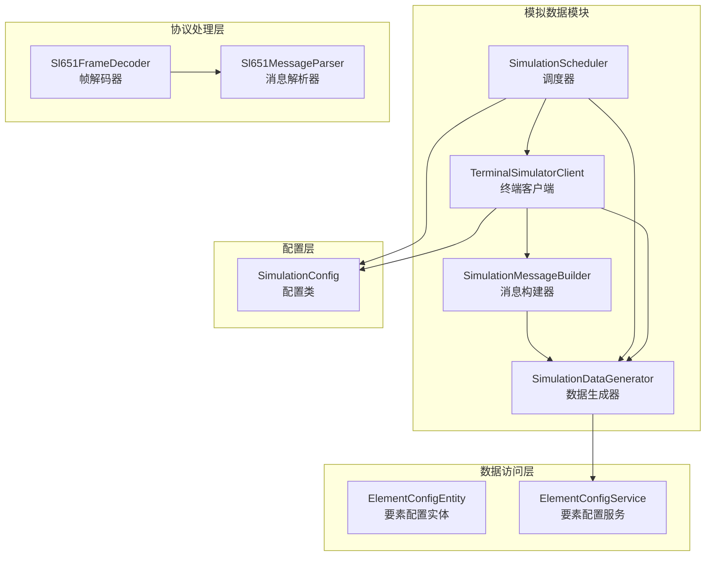
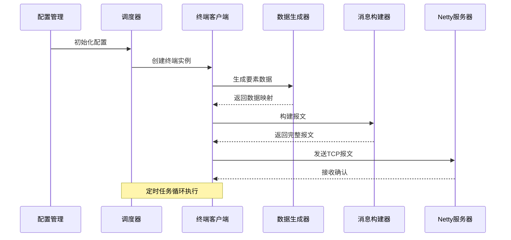
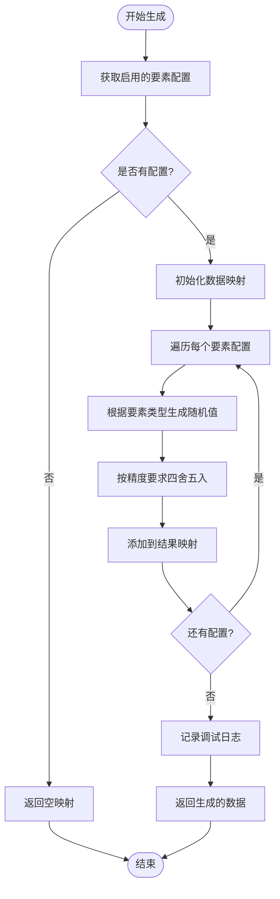
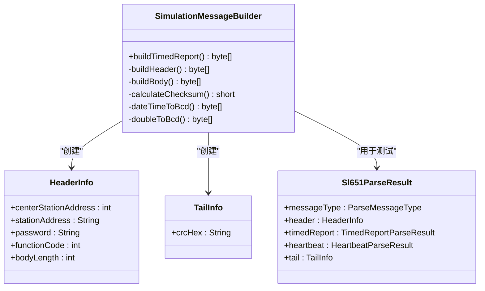
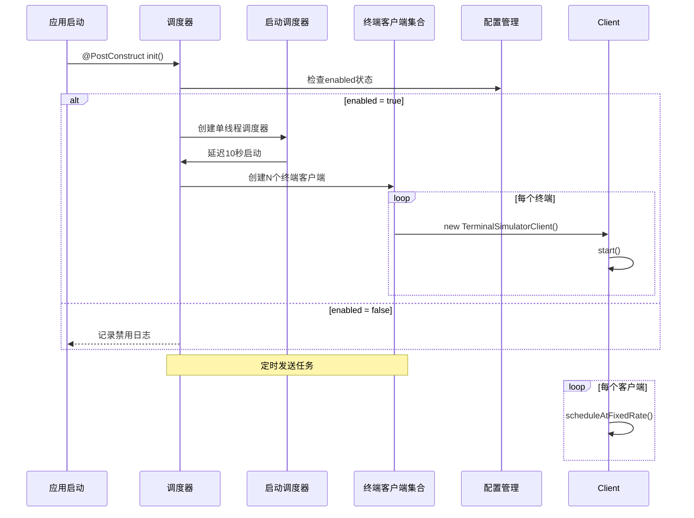
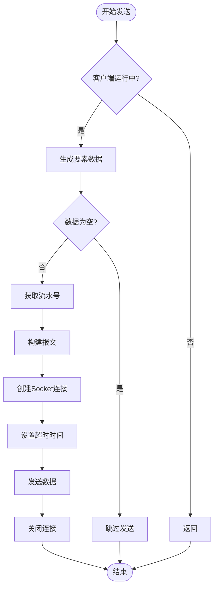
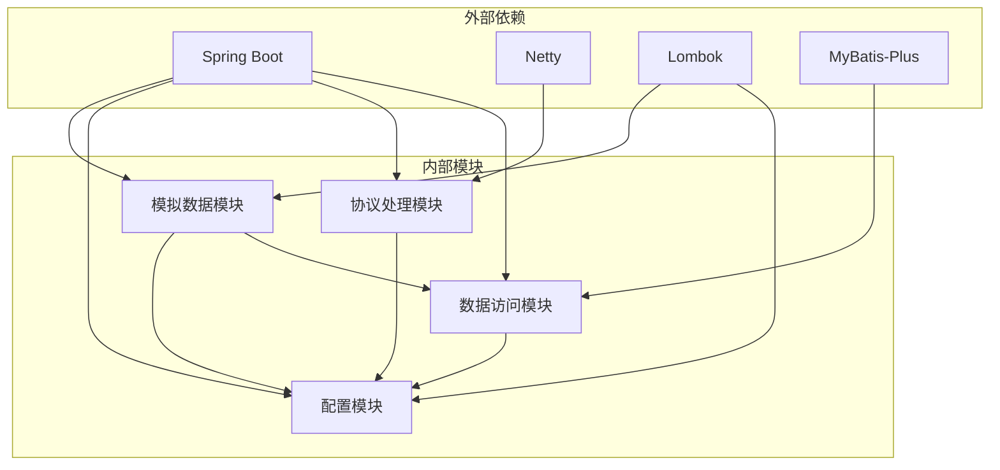

# 模拟数据系统

<cite>
**本文档引用的文件**
- [SimulationDataGenerator.java](file://src/main/java/com/hydro/monitor/simulation/SimulationDataGenerator.java)
- [SimulationMessageBuilder.java](file://src/main/java/com/hydro/monitor/simulation/SimulationMessageBuilder.java)
- [SimulationScheduler.java](file://src/main/java/com/hydro/monitor/simulation/SimulationScheduler.java)
- [TerminalSimulatorClient.java](file://src/main/java/com/hydro/monitor/simulation/TerminalSimulatorClient.java)
- [SimulationConfig.java](file://src/main/java/com/hydro/monitor/config/SimulationConfig.java)
- [ElementConfigEntity.java](file://src/main/java/com/hydro/monitor/modules/entity/ElementConfigEntity.java)
- [ElementConfigService.java](file://src/main/java/com/hydro/monitor/modules/service/ElementConfigService.java)
- [Sl651FrameDecoder.java](file://src/main/java/com/hydro/monitor/netty/Sl651FrameDecoder.java)
- [Sl651MessageParser.java](file://src/main/java/com/hydro/monitor/netty/Sl651MessageParser.java)
- [application.yml](file://src/main/resources/application.yml)
- [SimulationDataGeneratorTest.java](file://src/test/java/com/hydro/monitor/simulation/SimulationDataGeneratorTest.java)
</cite>

## 目录
1. [简介](#简介)
2. [项目结构](#项目结构)
3. [核心组件](#核心组件)
4. [架构概览](#架构概览)
5. [详细组件分析](#详细组件分析)
6. [依赖关系分析](#依赖关系分析)
7. [性能考虑](#性能考虑)
8. [故障排除指南](#故障排除指南)
9. [结论](#结论)
10. [附录](#附录)

## 简介

模拟数据系统是水文监测平台的核心组件之一，负责生成符合SL 651-2014国家标准的模拟水文监测数据。该系统通过模拟多个终端设备，实时向Netty服务器发送符合协议规范的报文，为系统测试、开发环境搭建和数据验证提供可靠的数据支持。

系统采用模块化设计，包含数据生成器、消息构建器、调度器和终端模拟客户端四个核心组件，每个组件都有明确的职责分工和清晰的接口定义。通过配置化的参数管理，系统支持灵活的部署和扩展需求。

## 项目结构

模拟数据系统位于`src/main/java/com/hydro/monitor/simulation/`目录下，采用标准的Maven项目结构组织代码。系统主要由以下层次组成：

**图表来源**
- [SimulationDataGenerator.java:1-164](file://src/main/java/com/hydro/monitor/simulation/SimulationDataGenerator.java#L1-L164)
- [SimulationMessageBuilder.java:1-447](file://src/main/java/com/hydro/monitor/simulation/SimulationMessageBuilder.java#L1-L447)
- [SimulationScheduler.java:1-136](file://src/main/java/com/hydro/monitor/simulation/SimulationScheduler.java#L1-L136)
- [TerminalSimulatorClient.java:1-207](file://src/main/java/com/hydro/monitor/simulation/TerminalSimulatorClient.java#L1-L207)

**章节来源**
- [SimulationDataGenerator.java:1-164](file://src/main/java/com/hydro/monitor/simulation/SimulationDataGenerator.java#L1-L164)
- [SimulationMessageBuilder.java:1-447](file://src/main/java/com/hydro/monitor/simulation/SimulationMessageBuilder.java#L1-L447)
- [SimulationScheduler.java:1-136](file://src/main/java/com/hydro/monitor/simulation/SimulationScheduler.java#L1-L136)
- [TerminalSimulatorClient.java:1-207](file://src/main/java/com/hydro/monitor/simulation/TerminalSimulatorClient.java#L1-L207)

## 核心组件

### 数据生成器 (SimulationDataGenerator)

数据生成器是模拟系统的核心算法组件，负责根据要素配置生成符合水文监测规范的随机数据。该组件具有以下特点：

- **要素类型识别**：支持多种水文要素类型的识别和处理
- **随机数据生成**：为每种要素类型生成合理的随机数值
- **精度控制**：根据要素特性控制数据的小数位数
- **范围约束**：确保生成的数据在合理的物理范围内

### 消息构建器 (SimulationMessageBuilder)

消息构建器负责将生成的数据转换为符合SL 651-2014协议规范的完整报文。该组件实现了完整的协议编解码逻辑：

- **协议适配**：严格遵循SL 651-2014国家标准
- **数据封装**：将要素数据封装到报文结构中
- **校验计算**：实现CRC校验和计算
- **格式转换**：处理BCD编码和十六进制转换

### 调度器 (SimulationScheduler)

调度器负责管理多个终端模拟客户端的生命周期和运行时序。该组件提供了：

- **启动管理**：应用启动时自动初始化所有终端
- **定时任务**：基于配置的时间间隔发送数据
- **资源清理**：应用关闭时正确释放资源
- **并发控制**：管理多线程环境下的客户端运行

### 终端客户端 (TerminalSimulatorClient)

终端客户端代表单个模拟终端设备，负责具体的报文发送任务。该组件包含：

- **连接管理**：建立和维护TCP连接
- **数据发送**：定期发送模拟报文
- **异常处理**：处理网络通信中的各种异常
- **日志记录**：详细的运行状态记录

**章节来源**
- [SimulationDataGenerator.java:16-164](file://src/main/java/com/hydro/monitor/simulation/SimulationDataGenerator.java#L16-L164)
- [SimulationMessageBuilder.java:9-447](file://src/main/java/com/hydro/monitor/simulation/SimulationMessageBuilder.java#L9-L447)
- [SimulationScheduler.java:17-136](file://src/main/java/com/hydro/monitor/simulation/SimulationScheduler.java#L17-L136)
- [TerminalSimulatorClient.java:15-207](file://src/main/java/com/hydro/monitor/simulation/TerminalSimulatorClient.java#L15-L207)

## 架构概览

模拟数据系统采用分层架构设计，各组件之间通过清晰的接口进行交互。系统整体架构如下：

**图表来源**
- [SimulationScheduler.java:45-96](file://src/main/java/com/hydro/monitor/simulation/SimulationScheduler.java#L45-L96)
- [TerminalSimulatorClient.java:119-156](file://src/main/java/com/hydro/monitor/simulation/TerminalSimulatorClient.java#L119-L156)

系统架构具有以下特点：

- **模块化设计**：每个组件职责单一，便于维护和测试
- **配置驱动**：通过配置文件控制运行参数
- **协议兼容**：完全符合SL 651-2014国家标准
- **可扩展性**：支持动态增加终端数量和修改参数

## 详细组件分析

### 数据生成器算法实现

数据生成器采用基于要素类型的随机数据生成策略，每种要素都有特定的生成规则：

**图表来源**
- [SimulationDataGenerator.java:37-59](file://src/main/java/com/hydro/monitor/simulation/SimulationDataGenerator.java#L37-L59)

#### 要素数据生成规则

系统支持以下要素类型的随机数据生成：

| 要素编码 | 要素名称 | 数据范围 | 精度 | 生成算法 |
|---------|---------|---------|------|---------|
| pn05 | 5分钟时段降雨量 | 0.0-50.0 mm | 1位小数 | 基准值 + 随机波动 |
| pj | 当前降雨量 | 0.0-100.0 mm | 1位小数 | 基准值 + 随机波动 |
| z | 水位 | 50.000-200.000 m | 3位小数 | 基准值 + 随机波动 |
| va | 平均流速 | 0.500-5.000 m/s | 3位小数 | 基准值 + 随机波动 |
| q | 瞬时流速 | 0.500-6.000 m/s | 3位小数 | 基准值 + 随机波动 |
| qa | 累计流量 | 100.000-10000.000 m³ | 3位小数 | 基准值 + 随机波动 |
| vt | 电源电压 | 11.000-14.000 V | 3位小数 | 基准值 + 随机波动 |

**章节来源**
- [SimulationDataGenerator.java:68-151](file://src/main/java/com/hydro/monitor/simulation/SimulationDataGenerator.java#L68-L151)

### 消息构建器协议实现

消息构建器严格按照SL 651-2014协议规范实现报文构建，包括完整的协议头部、正文和尾部结构：

**图表来源**
- [SimulationMessageBuilder.java:34-106](file://src/main/java/com/hydro/monitor/simulation/SimulationMessageBuilder.java#L34-L106)
- [Sl651MessageParser.java:589-647](file://src/main/java/com/hydro/monitor/netty/Sl651MessageParser.java#L589-L647)

#### 协议数据封装流程

消息构建器的报文构建过程包含以下关键步骤：

1. **要素数据处理**：将要素ID映射为协议标识符
2. **BCD编码转换**：将数值转换为BCD编码格式
3. **数据定义位设置**：确定数据字节数和小数位数
4. **报文头部构建**：包含中心站地址、站号、密码等信息
5. **正文组装**：按协议规范组织要素数据
6. **校验和计算**：计算CRC校验和

**章节来源**
- [SimulationMessageBuilder.java:162-269](file://src/main/java/com/hydro/monitor/simulation/SimulationMessageBuilder.java#L162-L269)

### 调度机制设计

调度器采用基于Java并发框架的定时任务管理机制，确保多个终端客户端的协调运行：

**图表来源**
- [SimulationScheduler.java:45-96](file://src/main/java/com/hydro/monitor/simulation/SimulationScheduler.java#L45-L96)

#### 并发控制策略

系统采用多层并发控制机制：

- **线程隔离**：每个终端客户端运行在独立的线程中
- **原子计数**：流水号使用原子操作保证线程安全
- **优雅关闭**：应用关闭时有序停止所有客户端
- **异常恢复**：单个客户端异常不影响其他客户端运行

**章节来源**
- [SimulationScheduler.java:35-135](file://src/main/java/com/hydro/monitor/simulation/SimulationScheduler.java#L35-L135)

### 连接管理与负载均衡

终端客户端采用短连接模式，每个数据发送都建立新的TCP连接：

**图表来源**
- [TerminalSimulatorClient.java:119-191](file://src/main/java/com/hydro/monitor/simulation/TerminalSimulatorClient.java#L119-L191)

#### 负载均衡策略

系统采用以下负载均衡策略：

- **均匀分布**：终端编号均匀分布在可用范围内
- **独立运行**：每个客户端独立运行，互不干扰
- **资源隔离**：每个连接独立建立和销毁
- **容量规划**：通过配置参数控制并发数量

**章节来源**
- [TerminalSimulatorClient.java:56-90](file://src/main/java/com/hydro/monitor/simulation/TerminalSimulatorClient.java#L56-L90)

## 依赖关系分析

模拟数据系统的依赖关系相对简单，主要依赖于Spring Boot框架和Netty网络库：

**图表来源**
- [SimulationDataGenerator.java:1-15](file://src/main/java/com/hydro/monitor/simulation/SimulationDataGenerator.java#L1-L15)
- [Sl651MessageParser.java:1-10](file://src/main/java/com/hydro/monitor/netty/Sl651MessageParser.java#L1-L10)

系统的主要依赖包括：

- **Spring Boot**：提供依赖注入和配置管理
- **Netty**：提供网络通信和协议处理能力
- **Lombok**：简化Java代码编写
- **MyBatis-Plus**：提供数据访问层支持

**章节来源**
- [SimulationDataGenerator.java:1-15](file://src/main/java/com/hydro/monitor/simulation/SimulationDataGenerator.java#L1-L15)
- [Sl651MessageParser.java:1-10](file://src/main/java/com/hydro/monitor/netty/Sl651MessageParser.java#L1-L10)

## 性能考虑

模拟数据系统在设计时充分考虑了性能优化和资源管理：

### 内存管理优化

- **数组复用**：使用预分配的缓冲区避免频繁内存分配
- **字节数组复用**：重复使用临时字节数组减少GC压力
- **字符串缓存**：避免重复的字符串创建和拼接

### 网络性能优化

- **连接池**：采用短连接模式，避免连接池复杂性
- **超时控制**：设置合理的Socket超时时间
- **批量发送**：单次发送包含多个要素数据

### 并发性能优化

- **原子操作**：使用AtomicInteger确保流水号唯一性
- **线程隔离**：每个客户端独立运行避免锁竞争
- **异步处理**：启动时使用延迟调度避免阻塞

## 故障排除指南

### 常见问题及解决方案

#### 数据生成异常

**问题现象**：数据生成器返回空映射
**可能原因**：
- 要素配置表中没有启用的配置项
- 数据库连接异常
- 配置服务调用失败

**解决方法**：
1. 检查要素配置表中enabled字段是否为1
2. 验证数据库连接配置
3. 查看相关日志获取详细错误信息

#### 报文构建失败

**问题现象**：消息构建器抛出异常
**可能原因**：
- 要素数据格式不正确
- BCD编码转换错误
- 校验和计算异常

**解决方法**：
1. 验证要素数据的数值范围
2. 检查BCD编码转换逻辑
3. 确认校验和计算公式

#### 网络连接问题

**问题现象**：终端客户端无法连接服务器
**可能原因**：
- 服务器地址配置错误
- 端口被占用
- 网络防火墙阻止连接

**解决方法**：
1. 验证服务器主机和端口配置
2. 检查目标端口的可用性
3. 确认防火墙规则允许连接

### 调试技巧

#### 日志分析

系统提供了详细的日志记录，包括：

- **调试级别日志**：记录数据生成和报文构建的详细过程
- **错误级别日志**：记录异常情况和错误信息
- **性能监控**：记录关键操作的执行时间和资源使用

#### 单元测试

系统包含完整的单元测试覆盖：

- **数据生成测试**：验证不同要素类型的数值范围
- **协议解析测试**：验证报文构建和解析的正确性
- **边界条件测试**：测试极端情况下的系统行为

**章节来源**
- [SimulationDataGeneratorTest.java:19-112](file://src/test/java/com/hydro/monitor/simulation/SimulationDataGeneratorTest.java#L19-L112)

## 结论

模拟数据系统是一个设计精良、功能完备的水文监测数据模拟平台。系统通过模块化的设计理念，将复杂的水文监测协议处理、数据生成和网络通信功能有机地结合在一起。

### 主要优势

1. **协议合规性**：完全符合SL 651-2014国家标准
2. **模块化设计**：清晰的职责分离和接口定义
3. **配置驱动**：灵活的参数管理和部署方式
4. **并发安全**：完善的线程安全和资源管理
5. **易于扩展**：支持新增要素类型和功能扩展

### 应用场景

- **系统测试**：为水文监测系统提供稳定的测试数据
- **开发环境**：支持开发者在本地环境进行功能验证
-. **性能测试**：模拟大量终端设备的并发访问
- **培训演示**：为用户培训提供真实的系统体验

### 改进建议

1. **连接复用**：考虑实现连接池以提高网络效率
2. **监控增强**：增加更详细的性能指标监控
3. **配置热更新**：支持运行时动态调整配置参数
4. **错误恢复**：增强异常情况下的自动恢复能力

## 附录

### 配置参数说明

系统支持以下配置参数：

| 参数名称 | 默认值 | 描述 | 作用域 |
|---------|--------|------|-------|
| simulation.enabled | false | 是否启用模拟功能 | 全局 |
| simulation.terminal-count | 16 | 模拟终端数量 | 全局 |
| simulation.report-interval-seconds | 300 | 上报间隔（秒） | 全局 |
| simulation.center-station-address | 2 | 中心站地址 | 全局 |
| simulation.password | "a000" | 密码（BCD编码） | 全局 |
| simulation.station-category-code | 48 | 遥测站分类码 | 全局 |
| simulation.server-host | "127.0.0.1" | 服务器地址 | 全局 |
| simulation.server-port | 9000 | 服务器端口 | 全局 |

### 数据格式规范

系统支持的要素类型及其数据格式：

| 要素编码 | 单位 | 精度 | 最小值 | 最大值 | 用途 |
|---------|------|------|--------|--------|----- |
| pn05 | mm | 1位小数 | 0.0 | 50.0 | 5分钟降雨量 |
| pj | mm | 1位小数 | 0.0 | 100.0 | 当前降雨量 |
| z | m | 3位小数 | 50.000 | 200.000 | 水位 |
| va | m/s | 3位小数 | 0.500 | 5.000 | 平均流速 |
| q | m/s | 3位小数 | 0.500 | 6.000 | 瞬时流速 |
| qa | m³ | 3位小数 | 100.000 | 10000.000 | 累计流量 |
| vt | V | 3位小数 | 11.000 | 14.000 | 电源电压 |

### 安全注意事项

1. **生产环境禁用**：默认情况下模拟功能在生产环境中禁用
2. **配置保护**：敏感配置信息应妥善保管
3. **网络隔离**：模拟数据不应影响生产网络
4. **权限控制**：访问模拟功能应有适当的权限控制
5. **数据隔离**：模拟数据与生产数据应完全隔离