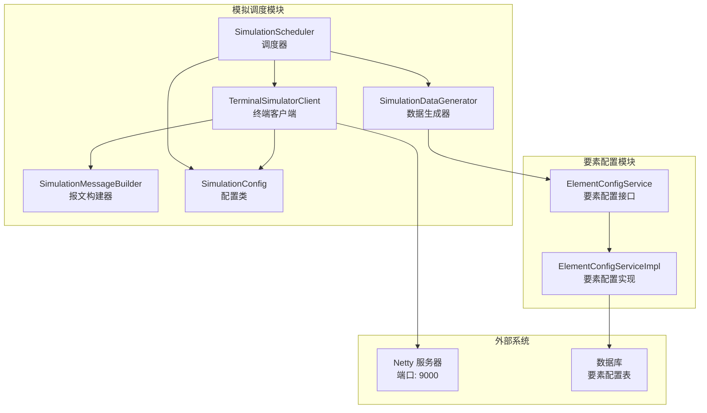
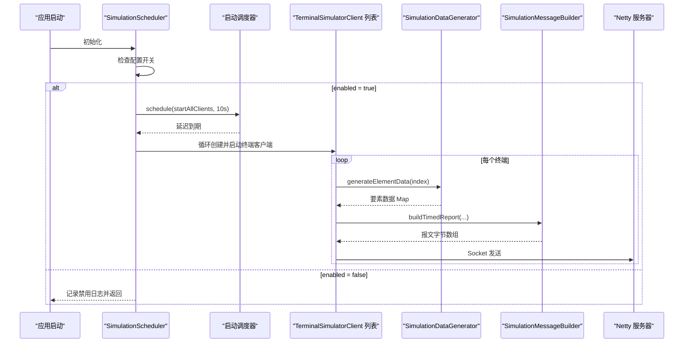
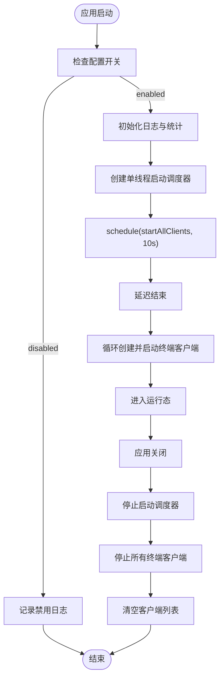
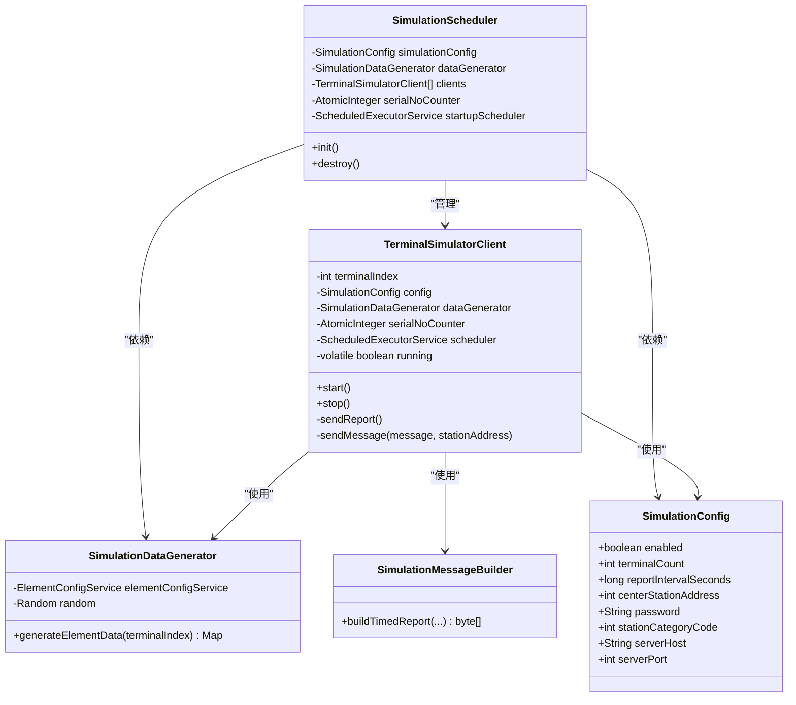
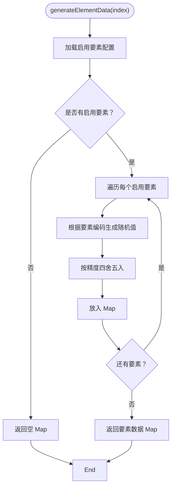
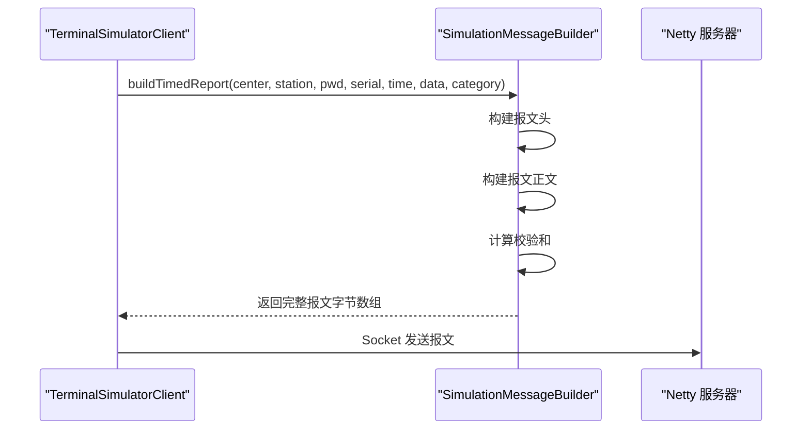
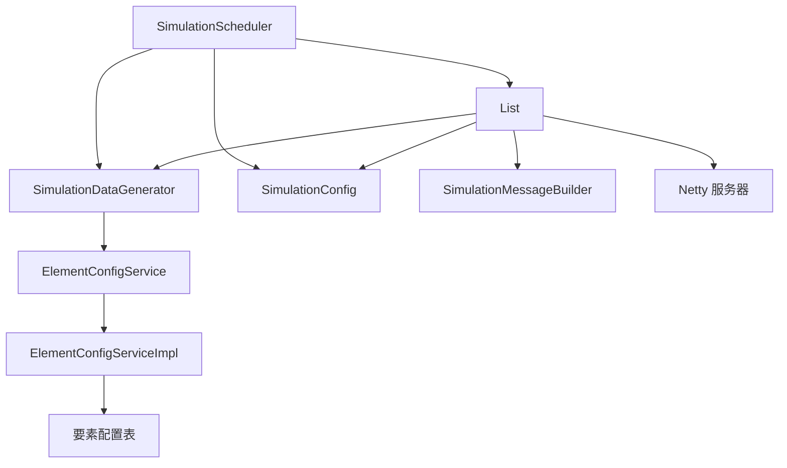

# 模拟调度器

<cite>
**本文档引用的文件**
- [SimulationScheduler.java](file://src/main/java/com/hydro/monitor/simulation/SimulationScheduler.java)
- [TerminalSimulatorClient.java](file://src/main/java/com/hydro/monitor/simulation/TerminalSimulatorClient.java)
- [SimulationDataGenerator.java](file://src/main/java/com/hydro/monitor/simulation/SimulationDataGenerator.java)
- [SimulationMessageBuilder.java](file://src/main/java/com/hydro/monitor/simulation/SimulationMessageBuilder.java)
- [SimulationConfig.java](file://src/main/java/com/hydro/monitor/config/SimulationConfig.java)
- [application.yml](file://src/main/resources/application.yml)
- [ElementConfigService.java](file://src/main/java/com/hydro/monitor/modules/service/ElementConfigService.java)
- [ElementConfigServiceImpl.java](file://src/main/java/com/hydro/monitor/modules/service/impl/ElementConfigServiceImpl.java)
- [SimulationDataGeneratorTest.java](file://src/test/java/com/hydro/monitor/simulation/SimulationDataGeneratorTest.java)
</cite>

## 目录
1. [简介](#简介)
2. [项目结构](#项目结构)
3. [核心组件](#核心组件)
4. [架构总览](#架构总览)
5. [详细组件分析](#详细组件分析)
6. [依赖关系分析](#依赖关系分析)
7. [性能考虑](#性能考虑)
8. [故障排查指南](#故障排查指南)
9. [结论](#结论)
10. [附录](#附录)

## 简介
本文件面向模拟调度器组件的技术文档，系统性阐述其核心设计与实现细节，包括多终端客户端管理、启动调度机制、生命周期管理、配置开关控制、并发运行管理、启动延迟机制、优雅停机策略、异常处理流程、线程池管理、原子计数器使用与内存管理最佳实践，并提供配置参数说明、性能调优建议与故障排查指南。

## 项目结构
模拟调度器位于 simulation 包中，围绕调度器、终端客户端、数据生成器、消息构建器与配置类协同工作，形成完整的模拟上报链路。应用通过 Spring Boot 的配置属性绑定读取 simulation.* 配置项，结合 ElementConfigService 提供的要素配置，动态生成符合 SL 651-2014 协议的定时报文并通过真实 TCP Socket 发送到 Netty 服务器。

图表来源
- [SimulationScheduler.java:1-136](file://src/main/java/com/hydro/monitor/simulation/SimulationScheduler.java#L1-L136)
- [TerminalSimulatorClient.java:1-207](file://src/main/java/com/hydro/monitor/simulation/TerminalSimulatorClient.java#L1-L207)
- [SimulationDataGenerator.java:1-164](file://src/main/java/com/hydro/monitor/simulation/SimulationDataGenerator.java#L1-L164)
- [SimulationMessageBuilder.java:1-447](file://src/main/java/com/hydro/monitor/simulation/SimulationMessageBuilder.java#L1-L447)
- [SimulationConfig.java:1-59](file://src/main/java/com/hydro/monitor/config/SimulationConfig.java#L1-L59)
- [ElementConfigService.java:1-72](file://src/main/java/com/hydro/monitor/modules/service/ElementConfigService.java#L1-L72)
- [ElementConfigServiceImpl.java:1-239](file://src/main/java/com/hydro/monitor/modules/service/impl/ElementConfigServiceImpl.java#L1-L239)

章节来源
- [SimulationScheduler.java:1-136](file://src/main/java/com/hydro/monitor/simulation/SimulationScheduler.java#L1-L136)
- [application.yml:78-86](file://src/main/resources/application.yml#L78-L86)

## 核心组件
- 调度器（SimulationScheduler）：负责应用启动时的初始化与所有终端客户端的批量启动；提供优雅停机逻辑，确保资源回收与连接释放。
- 终端客户端（TerminalSimulatorClient）：每个实例代表一个独立终端，维护自身状态与调度线程池，周期性生成数据并发送报文。
- 数据生成器（SimulationDataGenerator）：基于启用的要素配置动态生成各要素的模拟数据，支持多种要素类型的合理范围与精度。
- 报文构建器（SimulationMessageBuilder）：严格遵循 SL 651-2014 协议规范，构建定时报文字节数组，包含头、正文、校验和等完整字段。
- 配置类（SimulationConfig）：通过 application.yml 的 simulation.* 属性进行绑定，控制模拟功能的开关、终端数量、上报间隔、服务器地址与端口等。
- 要素配置服务（ElementConfigService/ElementConfigServiceImpl）：提供启用要素的映射与列表，支持缓存与降级策略，保障数据生成的动态性与稳定性。

章节来源
- [SimulationScheduler.java:34-136](file://src/main/java/com/hydro/monitor/simulation/SimulationScheduler.java#L34-L136)
- [TerminalSimulatorClient.java:25-207](file://src/main/java/com/hydro/monitor/simulation/TerminalSimulatorClient.java#L25-L207)
- [SimulationDataGenerator.java:26-164](file://src/main/java/com/hydro/monitor/simulation/SimulationDataGenerator.java#L26-L164)
- [SimulationMessageBuilder.java:17-447](file://src/main/java/com/hydro/monitor/simulation/SimulationMessageBuilder.java#L17-L447)
- [SimulationConfig.java:17-59](file://src/main/java/com/hydro/monitor/config/SimulationConfig.java#L17-L59)
- [ElementConfigService.java:17-72](file://src/main/java/com/hydro/monitor/modules/service/ElementConfigService.java#L17-L72)
- [ElementConfigServiceImpl.java:30-239](file://src/main/java/com/hydro/monitor/modules/service/impl/ElementConfigServiceImpl.java#L30-L239)

## 架构总览
模拟调度器采用“调度器统一管理 + 多终端客户端并发执行”的架构。调度器在应用启动后延迟启动，避免与主业务争抢资源；每个终端客户端拥有独立的调度线程池，定时发送定时报文。数据生成器从数据库要素配置表读取启用的要素，动态生成符合协议的数据；报文构建器将数据编码为 SL 651-2014 格式并通过 Socket 发送到 Netty 服务器。

图表来源
- [SimulationScheduler.java:45-96](file://src/main/java/com/hydro/monitor/simulation/SimulationScheduler.java#L45-L96)
- [TerminalSimulatorClient.java:56-90](file://src/main/java/com/hydro/monitor/simulation/TerminalSimulatorClient.java#L56-L90)
- [SimulationDataGenerator.java:37-59](file://src/main/java/com/hydro/monitor/simulation/SimulationDataGenerator.java#L37-L59)
- [SimulationMessageBuilder.java:34-106](file://src/main/java/com/hydro/monitor/simulation/SimulationMessageBuilder.java#L34-L106)

## 详细组件分析

### 调度器（SimulationScheduler）
- 设计要点
  - 通过注解驱动的生命周期方法实现启动与停机管理。
  - 使用独立的单线程调度器延迟启动，避免与应用主流程竞争资源。
  - 通过配置开关控制功能启用/禁用，降低对生产环境的影响。
  - 维护终端客户端列表与全局流水号计数器，保证并发安全。
- 启动流程
  - 检查配置开关，若禁用则直接返回。
  - 初始化日志与统计信息，创建单线程调度器并安排延迟任务。
  - 延迟结束后批量创建并启动终端客户端。
- 停机流程
  - 关闭启动调度器，优雅等待终止或强制关闭。
  - 遍历客户端列表，逐个停止并清理资源，最后清空列表。

图表来源
- [SimulationScheduler.java:45-134](file://src/main/java/com/hydro/monitor/simulation/SimulationScheduler.java#L45-L134)

章节来源
- [SimulationScheduler.java:34-136](file://src/main/java/com/hydro/monitor/simulation/SimulationScheduler.java#L34-L136)

### 终端客户端（TerminalSimulatorClient）
- 设计要点
  - 每个实例代表一个独立终端，内部维护自身的调度线程池与运行状态。
  - 使用固定速率调度发送定时报文，支持立即执行一次以快速响应。
  - 通过共享的原子计数器生成流水号，保证全局唯一且线程安全。
  - 每次发送前生成要素数据，构建报文并通过 Socket 发送至服务器。
- 生命周期管理
  - start：设置运行状态，创建调度线程池，立即执行一次并按固定间隔重复执行。
  - stop：设置运行状态为停止，优雅关闭调度器，捕获中断异常并进行强制关闭。
- 异常处理
  - 发送过程中的异常被记录，避免影响其他终端的运行。
  - Socket 连接在 finally 中确保关闭，防止资源泄露。

图表来源
- [SimulationScheduler.java:34-136](file://src/main/java/com/hydro/monitor/simulation/SimulationScheduler.java#L34-L136)
- [TerminalSimulatorClient.java:25-207](file://src/main/java/com/hydro/monitor/simulation/TerminalSimulatorClient.java#L25-L207)
- [SimulationDataGenerator.java:26-164](file://src/main/java/com/hydro/monitor/simulation/SimulationDataGenerator.java#L26-L164)
- [SimulationMessageBuilder.java:17-447](file://src/main/java/com/hydro/monitor/simulation/SimulationMessageBuilder.java#L17-L447)
- [SimulationConfig.java:17-59](file://src/main/java/com/hydro/monitor/config/SimulationConfig.java#L17-L59)

章节来源
- [TerminalSimulatorClient.java:25-207](file://src/main/java/com/hydro/monitor/simulation/TerminalSimulatorClient.java#L25-L207)

### 数据生成器（SimulationDataGenerator）
- 设计要点
  - 从要素配置服务获取启用的要素列表，动态生成对应要素的模拟数据。
  - 针对不同要素类型（如降雨量、水位、流速、流量、电压等）生成合理范围内的随机值，并保留相应的小数位数。
  - 使用 BigDecimal 进行四舍五入，确保数值精度稳定。
- 动态配置支持
  - 通过 ElementConfigService 的 getAllEnabledConfigs() 获取启用要素，支持运行时调整而无需重启。
  - 若数据库不可用，记录警告并返回空集合，避免阻塞启动流程。

图表来源
- [SimulationDataGenerator.java:37-59](file://src/main/java/com/hydro/monitor/simulation/SimulationDataGenerator.java#L37-L59)
- [SimulationDataGenerator.java:68-151](file://src/main/java/com/hydro/monitor/simulation/SimulationDataGenerator.java#L68-L151)

章节来源
- [SimulationDataGenerator.java:26-164](file://src/main/java/com/hydro/monitor/simulation/SimulationDataGenerator.java#L26-L164)
- [ElementConfigService.java:38-87](file://src/main/java/com/hydro/monitor/modules/service/ElementConfigService.java#L38-L87)
- [ElementConfigServiceImpl.java:80-87](file://src/main/java/com/hydro/monitor/modules/service/impl/ElementConfigServiceImpl.java#L80-L87)

### 报文构建器（SimulationMessageBuilder）
- 设计要点
  - 严格遵循 SL 651-2014 协议，构建定时报文的完整字节序列，包含报文头、正文、报文尾与校验和。
  - 支持多种要素数据的编码，正确计算数据定义位（字节数与小数位数）与 BCD 编码。
  - 提供详细的日志输出，便于调试与审计。
- 关键流程
  - 构建报文头：包含中心站地址、遥测站地址（BCD）、密码（HEX）、功能码、长度与标识。
  - 构建报文正文：包含流水号、发报时间、遥测站地址标识、遥测站分类码、观测时间标识与各要素数据。
  - 计算校验和：对有效字节进行累加求和，取低16位作为校验和。
  - 组装完整报文：头部 + 正文 + 报文尾 + 校验和。

图表来源
- [SimulationMessageBuilder.java:34-106](file://src/main/java/com/hydro/monitor/simulation/SimulationMessageBuilder.java#L34-L106)
- [SimulationMessageBuilder.java:162-269](file://src/main/java/com/hydro/monitor/simulation/SimulationMessageBuilder.java#L162-L269)
- [SimulationMessageBuilder.java:279-285](file://src/main/java/com/hydro/monitor/simulation/SimulationMessageBuilder.java#L279-L285)

章节来源
- [SimulationMessageBuilder.java:17-447](file://src/main/java/com/hydro/monitor/simulation/SimulationMessageBuilder.java#L17-L447)

### 配置类（SimulationConfig）
- 设计要点
  - 通过 @ConfigurationProperties(prefix = "simulation") 绑定 application.yml 中的 simulation.* 配置项。
  - 提供功能开关、终端数量、上报间隔、中心站地址、密码、站分类码、服务器地址与端口等关键参数。
- 默认行为
  - enabled 默认关闭，避免误触发生产环境。
  - terminalCount 默认 16，reportIntervalSeconds 默认 300 秒（5 分钟）。
  - serverHost 默认 127.0.0.1，serverPort 默认 9000。

章节来源
- [SimulationConfig.java:17-59](file://src/main/java/com/hydro/monitor/config/SimulationConfig.java#L17-L59)
- [application.yml:78-86](file://src/main/resources/application.yml#L78-L86)

## 依赖关系分析
- 组件内聚与耦合
  - SimulationScheduler 与 TerminalSimulatorClient 为一对多管理关系，通过列表维护客户端实例。
  - TerminalSimulatorClient 依赖 SimulationDataGenerator 与 SimulationMessageBuilder，形成清晰的职责边界。
  - SimulationDataGenerator 依赖 ElementConfigService，实现数据生成的动态配置能力。
- 外部依赖
  - Netty 服务器：通过 Socket 连接发送报文，端口由配置决定。
  - 数据库：要素配置表提供启用要素的动态映射，ElementConfigServiceImpl 提供缓存与降级策略。

图表来源
- [SimulationScheduler.java:34-136](file://src/main/java/com/hydro/monitor/simulation/SimulationScheduler.java#L34-L136)
- [TerminalSimulatorClient.java:25-207](file://src/main/java/com/hydro/monitor/simulation/TerminalSimulatorClient.java#L25-L207)
- [SimulationDataGenerator.java:26-164](file://src/main/java/com/hydro/monitor/simulation/SimulationDataGenerator.java#L26-L164)
- [ElementConfigService.java:17-72](file://src/main/java/com/hydro/monitor/modules/service/ElementConfigService.java#L17-L72)
- [ElementConfigServiceImpl.java:30-239](file://src/main/java/com/hydro/monitor/modules/service/impl/ElementConfigServiceImpl.java#L30-L239)

章节来源
- [SimulationScheduler.java:34-136](file://src/main/java/com/hydro/monitor/simulation/SimulationScheduler.java#L34-L136)
- [TerminalSimulatorClient.java:25-207](file://src/main/java/com/hydro/monitor/simulation/TerminalSimulatorClient.java#L25-L207)
- [SimulationDataGenerator.java:26-164](file://src/main/java/com/hydro/monitor/simulation/SimulationDataGenerator.java#L26-L164)
- [ElementConfigService.java:17-72](file://src/main/java/com/hydro/monitor/modules/service/ElementConfigService.java#L17-L72)
- [ElementConfigServiceImpl.java:30-239](file://src/main/java/com/hydro/monitor/modules/service/impl/ElementConfigServiceImpl.java#L30-L239)

## 性能考虑
- 线程池管理
  - 启动调度器：单线程调度器，延迟启动，避免与主业务争抢资源。
  - 终端客户端：每个终端独立的单线程调度器，固定速率执行，避免跨终端竞争。
- 原子计数器
  - 使用 AtomicInteger 生成流水号，保证并发安全与高效性。
- 内存管理
  - 报文构建采用预估缓冲区大小，避免频繁扩容；最终返回实际使用的子数组，减少内存占用。
  - Socket 连接在 finally 中确保关闭，防止连接泄漏。
- 要素配置缓存
  - ElementConfigServiceImpl 对要素映射进行缓存，首次加载后复用，降低数据库访问压力。
- 调度延迟
  - 启动延迟 10 秒，给应用主流程充分时间完成初始化，减少启动阶段的资源竞争。

章节来源
- [SimulationScheduler.java:64-72](file://src/main/java/com/hydro/monitor/simulation/SimulationScheduler.java#L64-L72)
- [TerminalSimulatorClient.java:71-86](file://src/main/java/com/hydro/monitor/simulation/TerminalSimulatorClient.java#L71-L86)
- [SimulationMessageBuilder.java:169-172](file://src/main/java/com/hydro/monitor/simulation/SimulationMessageBuilder.java#L169-L172)
- [ElementConfigServiceImpl.java:34-62](file://src/main/java/com/hydro/monitor/modules/service/impl/ElementConfigServiceImpl.java#L34-L62)

## 故障排查指南
- 功能未生效
  - 检查 application.yml 中 simulation.enabled 是否为 true。
  - 确认 Netty 服务器端口与地址配置正确，且服务器处于监听状态。
- 终端未启动
  - 查看调度器日志，确认启动调度器已创建并执行。
  - 检查终端数量配置，确认终端客户端已按数量创建并启动。
- 报文发送失败
  - 查看终端客户端日志，定位 Socket 发送异常原因（连接超时、服务器不可达等）。
  - 确认要素配置表中有启用的要素，否则数据生成为空导致跳过上报。
- 数据异常
  - 检查要素配置表的启用状态与精度设置，确保与预期一致。
  - 使用测试用例验证数据生成范围与精度，参考单元测试断言。
- 资源清理问题
  - 应用关闭时查看调度器与客户端的日志，确认优雅停机流程执行。
  - 如遇停机卡顿，检查线程池关闭等待时间与中断异常处理。

章节来源
- [application.yml:78-86](file://src/main/resources/application.yml#L78-L86)
- [SimulationScheduler.java:101-134](file://src/main/java/com/hydro/monitor/simulation/SimulationScheduler.java#L101-L134)
- [TerminalSimulatorClient.java:95-114](file://src/main/java/com/hydro/monitor/simulation/TerminalSimulatorClient.java#L95-L114)
- [SimulationDataGeneratorTest.java:37-111](file://src/test/java/com/hydro/monitor/simulation/SimulationDataGeneratorTest.java#L37-L111)

## 结论
模拟调度器通过清晰的模块划分与严格的生命周期管理，实现了多终端并发模拟上报的能力。其核心优势在于：
- 通过配置开关实现可控启用，降低对生产环境的影响；
- 启动延迟与独立线程池设计，提升系统稳定性；
- 动态要素配置与协议化报文构建，增强灵活性与兼容性；
- 优雅停机与异常处理，保障资源回收与运行安全。

## 附录

### 配置参数说明
- simulation.enabled：是否启用模拟上报功能（默认 false）
- simulation.terminal-count：模拟终端数量（默认 16）
- simulation.report-interval-seconds：上报间隔（秒，默认 300）
- simulation.center-station-address：中心站地址（默认 2）
- simulation.password：密码（BCD 编码，默认 "a000"）
- simulation.station-category-code：遥测站分类码（默认 48）
- simulation.server-host：服务器地址（默认 "127.0.0.1"）
- simulation.server-port：服务器端口（默认 9000）

章节来源
- [SimulationConfig.java:17-59](file://src/main/java/com/hydro/monitor/config/SimulationConfig.java#L17-L59)
- [application.yml:78-86](file://src/main/resources/application.yml#L78-L86)