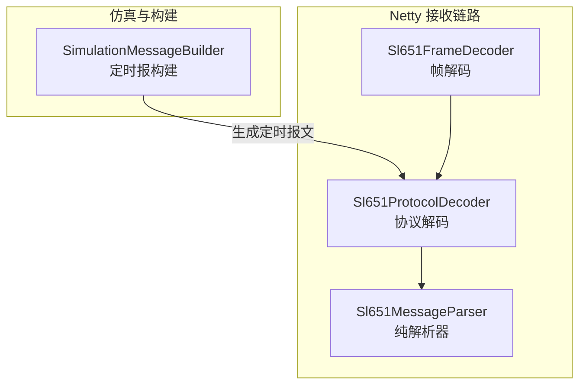
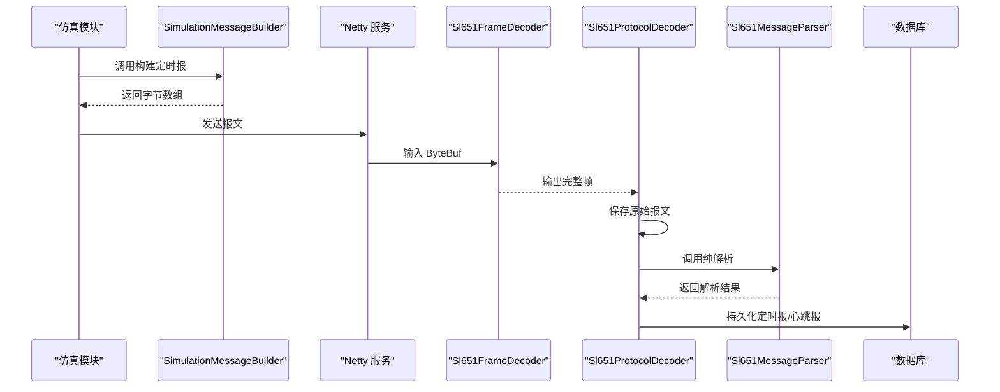
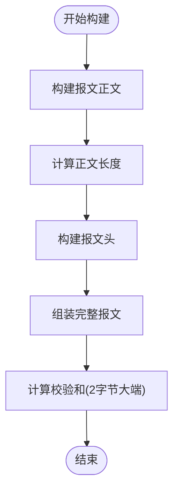
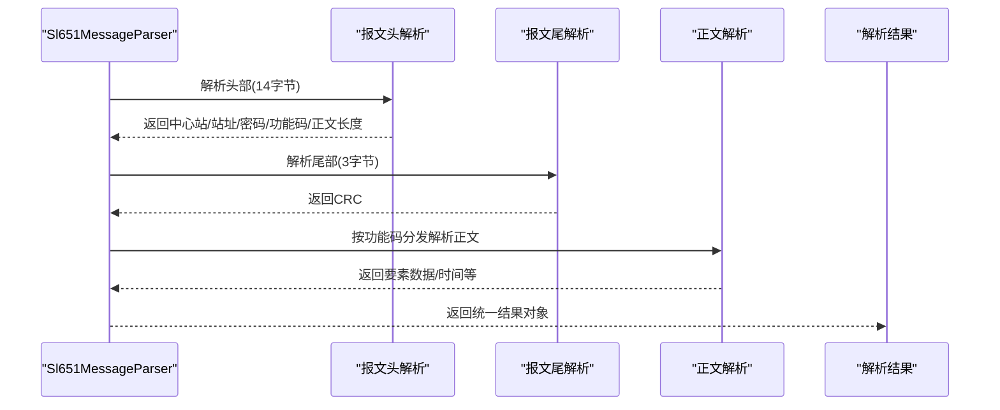
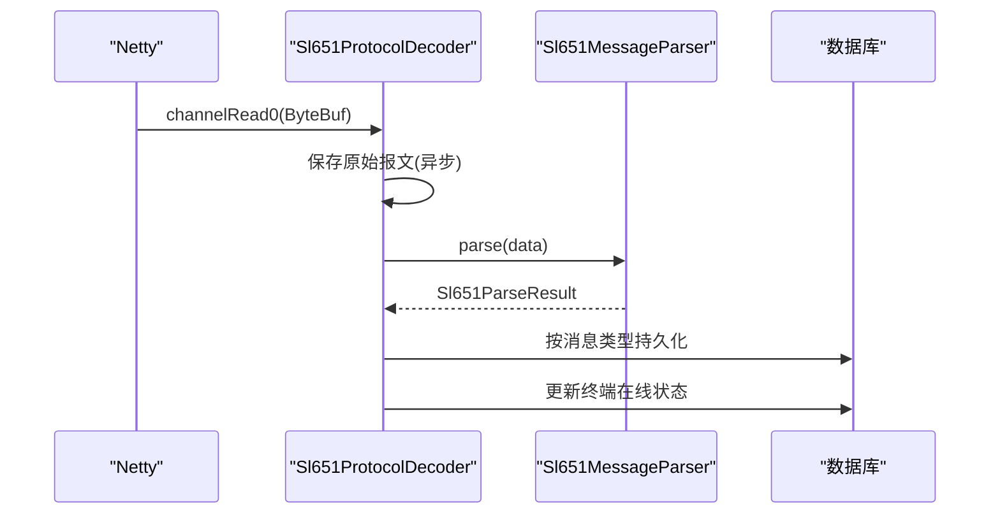
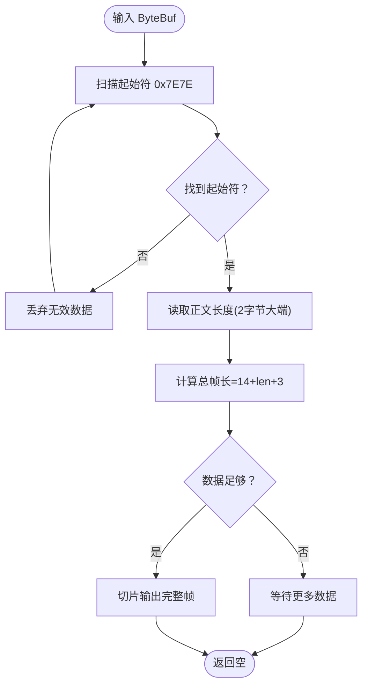
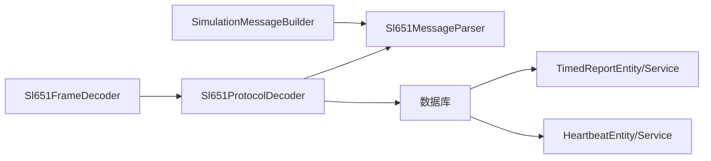

# 消息构建器

<cite>
**本文引用的文件**
- [SimulationMessageBuilder.java](file://src/main/java/com/hydro/monitor/simulation/SimulationMessageBuilder.java)
- [Sl651MessageParser.java](file://src/main/java/com/hydro/monitor/netty/Sl651MessageParser.java)
- [Sl651ProtocolDecoder.java](file://src/main/java/com/hydro/monitor/netty/Sl651ProtocolDecoder.java)
- [Sl651FrameDecoder.java](file://src/main/java/com/hydro/monitor/netty/Sl651FrameDecoder.java)
- [Sl651MessageParserTest.java](file://src/test/java/com/hydro/monitor/netty/Sl651MessageParserTest.java)
- [Sl651ProtocolDecoderTest.java](file://src/test/java/com/hydro/monitor/netty/Sl651ProtocolDecoderTest.java)
- [application.yml](file://src/main/resources/application.yml)
- [TimedReportEntity.java](file://src/main/java/com/hydro/monitor/modules/entity/TimedReportEntity.java)
- [HeartbeatEntity.java](file://src/main/java/com/hydro/monitor/modules/entity/HeartbeatEntity.java)
- [TimedReportService.java](file://src/main/java/com/hydro/monitor/modules/service/TimedReportService.java)
- [HeartbeatService.java](file://src/main/java/com/hydro/monitor/modules/service/HeartbeatService.java)
</cite>

## 目录
1. [简介](#简介)
2. [项目结构](#项目结构)
3. [核心组件](#核心组件)
4. [架构总览](#架构总览)
5. [详细组件分析](#详细组件分析)
6. [依赖分析](#依赖分析)
7. [性能考虑](#性能考虑)
8. [故障排查指南](#故障排查指南)
9. [结论](#结论)
10. [附录](#附录)

## 简介
本文件聚焦“消息构建器”组件，系统性阐述 SL 651-2014 协议的消息封装机制，包括：
- 报文头构造、数据体编码与校验码计算
- 不同类型报文（心跳报文、定时报文）的构建流程与字段映射规则
- 消息序列化过程、字节序处理与协议兼容性保证
- 消息格式验证、长度计算与完整性检查机制
- 配置参数、性能优化策略与调试工具使用指南

消息构建器位于仿真模块，负责按照 SL 651-2014 规范生成定时报文字节数组；同时，系统还提供纯解析器与 Netty 解码链路，用于接收与解析来自 RTU 的真实报文，形成“构建-接收-解析”的闭环。

## 项目结构
与消息构建器直接相关的模块与文件如下：
- 仿真消息构建器：SimulationMessageBuilder.java
- 协议解析器：Sl651MessageParser.java
- Netty 协议解码器：Sl651ProtocolDecoder.java
- Netty 帧解码器：Sl651FrameDecoder.java
- 配置文件：application.yml
- 实体与服务：TimedReportEntity.java、HeartbeatEntity.java、TimedReportService.java、HeartbeatService.java
- 单元测试：Sl651MessageParserTest.java、Sl651ProtocolDecoderTest.java

图表来源
- [SimulationMessageBuilder.java:34-106](file://src/main/java/com/hydro/monitor/simulation/SimulationMessageBuilder.java#L34-L106)
- [Sl651FrameDecoder.java:26-121](file://src/main/java/com/hydro/monitor/netty/Sl651FrameDecoder.java#L26-L121)
- [Sl651ProtocolDecoder.java:39-278](file://src/main/java/com/hydro/monitor/netty/Sl651ProtocolDecoder.java#L39-L278)
- [Sl651MessageParser.java:25-648](file://src/main/java/com/hydro/monitor/netty/Sl651MessageParser.java#L25-L648)

章节来源
- [SimulationMessageBuilder.java:1-447](file://src/main/java/com/hydro/monitor/simulation/SimulationMessageBuilder.java#L1-L447)
- [Sl651MessageParser.java:1-648](file://src/main/java/com/hydro/monitor/netty/Sl651MessageParser.java#L1-L648)
- [Sl651ProtocolDecoder.java:1-278](file://src/main/java/com/hydro/monitor/netty/Sl651ProtocolDecoder.java#L1-L278)
- [Sl651FrameDecoder.java:1-121](file://src/main/java/com/hydro/monitor/netty/Sl651FrameDecoder.java#L1-L121)

## 核心组件
- SimulationMessageBuilder：面向 SL 651-2014 的定时报构建器，负责报文头、正文、校验码与尾部的组装，并提供 BCD 编码、校验和计算等工具方法。
- Sl651MessageParser：纯解析器，无状态、线程安全，负责将原始字节数组解析为结构化对象，支持心跳报（0x2F）与定时报（0x32）。
- Sl651ProtocolDecoder：Netty 通道处理器，负责将 ByteBuf 转换为字节数组、保存原始报文、调用解析器并持久化结果。
- Sl651FrameDecoder：帧解码器，处理 TCP 黏包/拆包，定位起始符、读取正文长度并输出完整帧。

章节来源
- [SimulationMessageBuilder.java:17-106](file://src/main/java/com/hydro/monitor/simulation/SimulationMessageBuilder.java#L17-L106)
- [Sl651MessageParser.java:25-126](file://src/main/java/com/hydro/monitor/netty/Sl651MessageParser.java#L25-L126)
- [Sl651ProtocolDecoder.java:39-89](file://src/main/java/com/hydro/monitor/netty/Sl651ProtocolDecoder.java#L39-L89)
- [Sl651FrameDecoder.java:26-100](file://src/main/java/com/hydro/monitor/netty/Sl651FrameDecoder.java#L26-L100)

## 架构总览
消息构建器在系统中的角色与交互如下：
- 仿真模块使用 SimulationMessageBuilder 生成符合 SL 651-2014 的定时报文字节数组；
- Netty 接收链路通过 Sl651FrameDecoder 识别帧边界，Sl651ProtocolDecoder 负责保存原始报文与调用解析器；
- Sl651MessageParser 对报文进行纯解析，输出结构化结果；
- 解析结果由业务层持久化到数据库（定时报与心跳报分别对应 TimedReportEntity/HeartbeatEntity）。

图表来源
- [SimulationMessageBuilder.java:34-106](file://src/main/java/com/hydro/monitor/simulation/SimulationMessageBuilder.java#L34-L106)
- [Sl651FrameDecoder.java:38-99](file://src/main/java/com/hydro/monitor/netty/Sl651FrameDecoder.java#L38-L99)
- [Sl651ProtocolDecoder.java:54-89](file://src/main/java/com/hydro/monitor/netty/Sl651ProtocolDecoder.java#L54-L89)
- [Sl651MessageParser.java:66-126](file://src/main/java/com/hydro/monitor/netty/Sl651MessageParser.java#L66-L126)

## 详细组件分析

### SimulationMessageBuilder（定时报构建器）
- 报文头构造
  - 起始符：固定 0x7E7E
  - 中心站地址：1 字节
  - 遥测站地址：5 字节 BCD 编码（10 位十进制字符串）
  - 密码：2 字节（HEX 字符串）
  - 功能码：1 字节（0x32 定时报）
  - 上下行标识 + 正文长度：2 字节（大端序，高 4 位为上下行标识，低 12 位为正文长度）
  - 正文开始标识：固定 0x02
- 报文正文构造
  - 流水号：2 字节（大端序）
  - 发报时间：6 字节 BCD（YYMMDDHHmmss）
  - 遥测站地址段：标识符 F1F1 + 地址（5 字节 BCD）+ 分类码（1 字节）
  - 观测时间段：标识符 F0F0 + 时间（5 字节 BCD，YYMMDDHHmm）
  - 要素数据：循环写入，每个要素包含：
    - 标识符（1 字节，协议十六进制值的十进制表示）
    - 数据定义位（1 字节，高 5 位为数据字节数，低 3 位为小数位数）
    - 数据（BCD 编码，字节数由数据定义位决定）
- 校验码与尾部
  - 报文尾：固定 0x03
  - 校验码：2 字节累加和（大端序），覆盖除起始符外的全部字节
- 工具方法
  - BCD 编码：年月日时分秒与年月日时分的转换
  - 数值到 BCD：按小数位数缩放并按每 2 位一组打包
  - 校验和：无符号累加取低 16 位

图表来源
- [SimulationMessageBuilder.java:34-106](file://src/main/java/com/hydro/monitor/simulation/SimulationMessageBuilder.java#L34-L106)
- [SimulationMessageBuilder.java:162-269](file://src/main/java/com/hydro/monitor/simulation/SimulationMessageBuilder.java#L162-L269)
- [SimulationMessageBuilder.java:279-285](file://src/main/java/com/hydro/monitor/simulation/SimulationMessageBuilder.java#L279-L285)

章节来源
- [SimulationMessageBuilder.java:19-106](file://src/main/java/com/hydro/monitor/simulation/SimulationMessageBuilder.java#L19-L106)
- [SimulationMessageBuilder.java:119-157](file://src/main/java/com/hydro/monitor/simulation/SimulationMessageBuilder.java#L119-L157)
- [SimulationMessageBuilder.java:162-269](file://src/main/java/com/hydro/monitor/simulation/SimulationMessageBuilder.java#L162-L269)
- [SimulationMessageBuilder.java:279-363](file://src/main/java/com/hydro/monitor/simulation/SimulationMessageBuilder.java#L279-L363)

### Sl651MessageParser（纯解析器）
- 报文头解析（14 字节）
  - 起始符 0x7E7E、中心站地址、遥测站地址（5 字节 BCD）、密码（2 字节）、功能码（1 字节）、上下行标识 + 正文长度（2 字节大端）、正文开始标识 0x02
- 报文尾解析（3 字节）
  - 结束符 0x03、CRC 校验码（2 字节）
- 功能码分发
  - 0x2F：心跳报（正文：流水号 2B + 发报时间 6B BCD）
  - 0x32：定时报（正文：流水号 2B + 发报时间 6B + F1F1 站地址段 + F0F0 观测时间段 + 要素数据循环）
- 要素数据循环解析
  - 标识符（1 字节）+ 数据定义位（1 字节）+ 数据 N 字节 BCD
  - 数据定义位：低 3 位为小数位数，高 5 位为数据字节数
- 时间解析
  - 发报时间：12 位 BCD（YYMMDDHHmmss）
  - 观测时间：10 位 BCD（YYMMDDHHmm）

图表来源
- [Sl651MessageParser.java:66-126](file://src/main/java/com/hydro/monitor/netty/Sl651MessageParser.java#L66-L126)
- [Sl651MessageParser.java:141-176](file://src/main/java/com/hydro/monitor/netty/Sl651MessageParser.java#L141-L176)
- [Sl651MessageParser.java:196-283](file://src/main/java/com/hydro/monitor/netty/Sl651MessageParser.java#L196-L283)

章节来源
- [Sl651MessageParser.java:358-390](file://src/main/java/com/hydro/monitor/netty/Sl651MessageParser.java#L358-L390)
- [Sl651MessageParser.java:400-414](file://src/main/java/com/hydro/monitor/netty/Sl651MessageParser.java#L400-L414)
- [Sl651MessageParser.java:196-283](file://src/main/java/com/hydro/monitor/netty/Sl651MessageParser.java#L196-L283)

### Sl651ProtocolDecoder（Netty 协议解码器）
- 接收 ByteBuf，转为字节数组并保存原始报文记录（异步）
- 调用 Sl651MessageParser 进行纯解析
- 根据解析结果类型持久化心跳报或定时报
- 更新终端在线状态

图表来源
- [Sl651ProtocolDecoder.java:54-89](file://src/main/java/com/hydro/monitor/netty/Sl651ProtocolDecoder.java#L54-L89)
- [Sl651ProtocolDecoder.java:98-182](file://src/main/java/com/hydro/monitor/netty/Sl651ProtocolDecoder.java#L98-L182)

章节来源
- [Sl651ProtocolDecoder.java:39-89](file://src/main/java/com/hydro/monitor/netty/Sl651ProtocolDecoder.java#L39-L89)
- [Sl651ProtocolDecoder.java:203-249](file://src/main/java/com/hydro/monitor/netty/Sl651ProtocolDecoder.java#L203-L249)

### Sl651FrameDecoder（帧解码器）
- 在 ByteBuf 中扫描起始符 0x7E7E
- 读取功能码后偏移处的正文长度（2 字节大端）
- 计算总帧长 = 14（头）+ 正文长度 + 3（尾）
- 累积够完整帧后输出

图表来源
- [Sl651FrameDecoder.java:38-100](file://src/main/java/com/hydro/monitor/netty/Sl651FrameDecoder.java#L38-L100)

章节来源
- [Sl651FrameDecoder.java:26-100](file://src/main/java/com/hydro/monitor/netty/Sl651FrameDecoder.java#L26-L100)

## 依赖分析
- SimulationMessageBuilder 与 Sl651MessageParser 的一致性
  - 构建器与解析器在字段顺序、BCD 编码、数据定义位布局、校验和计算方式上保持严格一致，确保“构建-解析”双向兼容。
- Netty 解码链路
  - Sl651FrameDecoder 与 Sl651ProtocolDecoder 协同工作，前者负责帧边界识别，后者负责解析与持久化。
- 实体与服务
  - TimedReportEntity/HeartbeatEntity 与 TimedReportService/HeartbeatService 负责数据持久化与查询。

图表来源
- [SimulationMessageBuilder.java:34-106](file://src/main/java/com/hydro/monitor/simulation/SimulationMessageBuilder.java#L34-L106)
- [Sl651MessageParser.java:66-126](file://src/main/java/com/hydro/monitor/netty/Sl651MessageParser.java#L66-L126)
- [Sl651ProtocolDecoder.java:54-89](file://src/main/java/com/hydro/monitor/netty/Sl651ProtocolDecoder.java#L54-L89)
- [TimedReportEntity.java:18-47](file://src/main/java/com/hydro/monitor/modules/entity/TimedReportEntity.java#L18-L47)
- [HeartbeatEntity.java:17-49](file://src/main/java/com/hydro/monitor/modules/entity/HeartbeatEntity.java#L17-L49)

章节来源
- [Sl651ProtocolDecoder.java:41-46](file://src/main/java/com/hydro/monitor/netty/Sl651ProtocolDecoder.java#L41-L46)
- [TimedReportService.java:13-87](file://src/main/java/com/hydro/monitor/modules/service/TimedReportService.java#L13-L87)
- [HeartbeatService.java:12-28](file://src/main/java/com/hydro/monitor/modules/service/HeartbeatService.java#L12-L28)

## 性能考虑
- 构建阶段
  - 使用预分配缓冲区与 System.arraycopy 减少数组拷贝次数；按要素数量估算正文大小，避免扩容。
  - BCD 编码与校验和计算均为 O(n) 线性复杂度。
- 接收与解析阶段
  - Sl651FrameDecoder 采用单次扫描与固定偏移读取，时间复杂度 O(n)。
  - Sl651ProtocolDecoder 异步保存原始报文，避免阻塞 Netty 线程。
- 内存与吞吐
  - 帧解码器设置最大帧长度阈值，防止内存溢出。
  - 解析器无状态、线程安全，适合高并发场景。

[本节为通用性能讨论，无需列出具体文件来源]

## 故障排查指南
- 构建阶段
  - 若出现“构建定时报文失败”，检查输入参数（中心站地址、遥测站地址、密码、流水号、观测时间、要素数据）是否符合协议约束与数据类型要求。
  - 校验和不匹配：确认校验和计算范围覆盖除起始符外的全部字节，且为 2 字节累加和（大端序）。
- 接收与解析阶段
  - 帧边界错误：确认 Sl651FrameDecoder 能正确扫描到 0x7E7E 起始符，且功能码后偏移处的正文长度字段正确。
  - 报文头/尾解析失败：检查起始符、正文开始标识、结束符与 CRC 格式。
  - 功能码未知：解析器仅支持 0x2F（心跳）与 0x32（定时报），其他功能码将返回空。
- 单元测试辅助
  - 使用 Sl651MessageParserTest 与 Sl651ProtocolDecoderTest 提供的样例报文，验证构建与解析的正确性。

章节来源
- [Sl651MessageParserTest.java:31-100](file://src/test/java/com/hydro/monitor/netty/Sl651MessageParserTest.java#L31-L100)
- [Sl651MessageParserTest.java:104-212](file://src/test/java/com/hydro/monitor/netty/Sl651MessageParserTest.java#L104-L212)
- [Sl651ProtocolDecoderTest.java:45-93](file://src/test/java/com/hydro/monitor/netty/Sl651ProtocolDecoderTest.java#L45-L93)

## 结论
消息构建器以 SimulationMessageBuilder 为核心，严格遵循 SL 651-2014 协议规范，实现了定时报文的完整封装；配合纯解析器与 Netty 解码链路，形成从“构建-接收-解析-持久化”的闭环。通过明确的字段映射、严谨的 BCD 编码与校验和计算，以及完善的测试与调试工具，系统在协议兼容性、性能与可维护性方面具备良好表现。

[本节为总结性内容，无需列出具体文件来源]

## 附录

### 配置参数
- application.yml 中与仿真与网络相关的配置项
  - simulation.enabled：是否启用仿真上报
  - simulation.terminal-count：仿真终端数量
  - simulation.report-interval-seconds：上报间隔（秒）
  - simulation.center-station-address：中心站地址
  - simulation.password：密码（BCD 编码）
  - simulation.station-category-code：遥测站分类码
  - netty.server.port：Netty 服务端口

章节来源
- [application.yml:79-86](file://src/main/resources/application.yml#L79-L86)

### 字段映射与数据定义位
- 数据定义位（1 字节）
  - 高 5 位：数据字节数（0-31）
  - 低 3 位：小数位数（0-7）
- 常见要素标识符的小数位数
  - 0x22（5 分钟时段降雨量）：1 位
  - 0x20（当前降雨量）：1 位
  - 0x29（水位）：3 位
  - 0x36（平均流速）：3 位
  - 0x27（瞬时流速）：3 位
  - 0x30（累计流量）：3 位
  - 0x38（电源电压）：3 位

章节来源
- [SimulationMessageBuilder.java:371-382](file://src/main/java/com/hydro/monitor/simulation/SimulationMessageBuilder.java#L371-L382)
- [Sl651MessageParser.java:48-56](file://src/main/java/com/hydro/monitor/netty/Sl651MessageParser.java#L48-L56)

### 校验码与完整性检查
- 校验码：2 字节累加和（大端序），覆盖除起始符外的全部字节
- 报文尾：固定 0x03 + CRC（2 字节）+ 终止符（0x7E）
- 长度计算：总长度 = 14（头）+ 正文长度 + 3（尾）

章节来源
- [SimulationMessageBuilder.java:279-285](file://src/main/java/com/hydro/monitor/simulation/SimulationMessageBuilder.java#L279-L285)
- [Sl651MessageParser.java:400-414](file://src/main/java/com/hydro/monitor/netty/Sl651MessageParser.java#L400-L414)