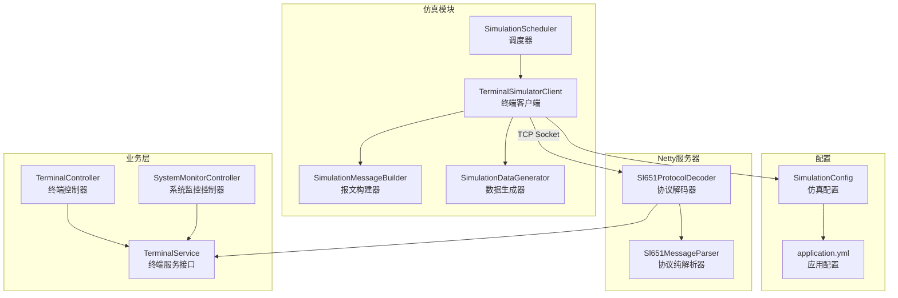
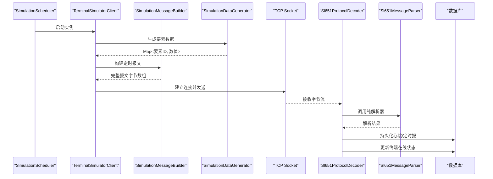
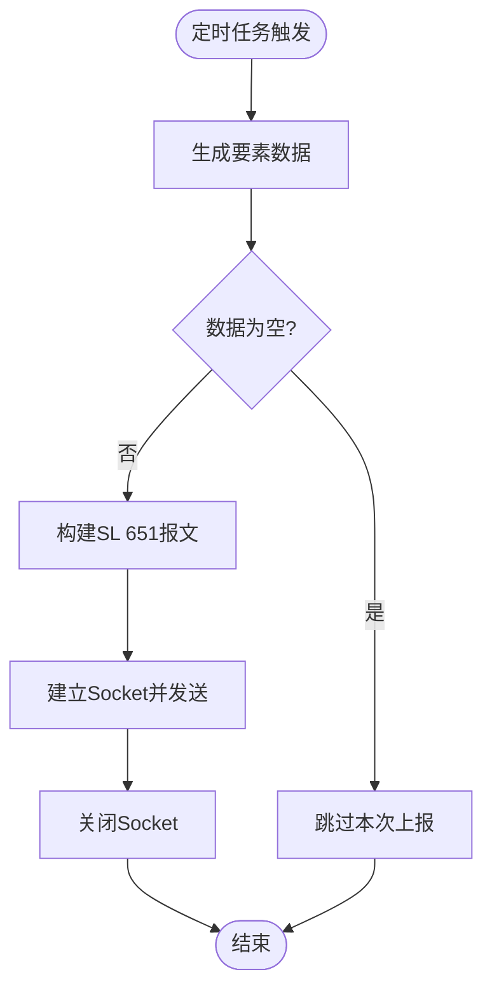
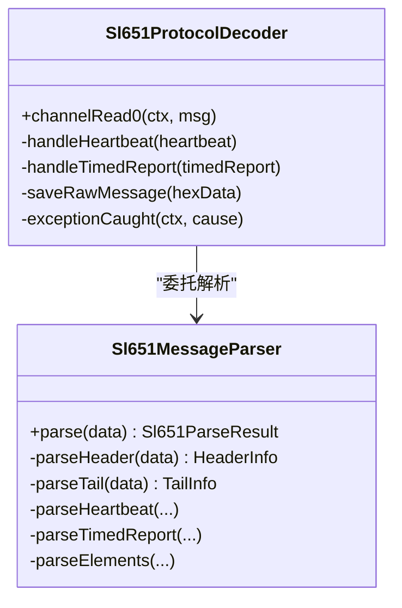
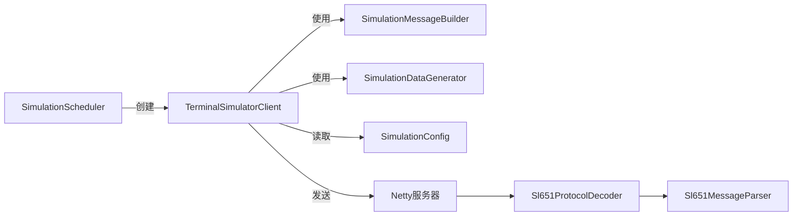

# 终端模拟客户端

<cite>
**本文引用的文件**
- [TerminalSimulatorClient.java](file://src/main/java/com/hydro/monitor/simulation/TerminalSimulatorClient.java)
- [SimulationScheduler.java](file://src/main/java/com/hydro/monitor/simulation/SimulationScheduler.java)
- [SimulationMessageBuilder.java](file://src/main/java/com/hydro/monitor/simulation/SimulationMessageBuilder.java)
- [SimulationDataGenerator.java](file://src/main/java/com/hydro/monitor/simulation/SimulationDataGenerator.java)
- [Sl651ProtocolDecoder.java](file://src/main/java/com/hydro/monitor/netty/Sl651ProtocolDecoder.java)
- [Sl651MessageParser.java](file://src/main/java/com/hydro/monitor/netty/Sl651MessageParser.java)
- [SimulationConfig.java](file://src/main/java/com/hydro/monitor/config/SimulationConfig.java)
- [application.yml](file://src/main/resources/application.yml)
- [TerminalController.java](file://src/main/java/com/hydro/monitor/modules/controller/TerminalController.java)
- [SystemMonitorController.java](file://src/main/java/com/hydro/monitor/modules/controller/SystemMonitorController.java)
- [TerminalService.java](file://src/main/java/com/hydro/monitor/modules/service/TerminalService.java)
- [SimulationDataGeneratorTest.java](file://src/test/java/com/hydro/monitor/simulation/SimulationDataGeneratorTest.java)
</cite>

## 目录
1. [简介](#简介)
2. [项目结构](#项目结构)
3. [核心组件](#核心组件)
4. [架构概览](#架构概览)
5. [详细组件分析](#详细组件分析)
6. [依赖关系分析](#依赖关系分析)
7. [性能考量](#性能考量)
8. [故障排查指南](#故障排查指南)
9. [结论](#结论)
10. [附录](#附录)

## 简介
本技术文档面向“终端模拟客户端”子系统，聚焦于其TCP Socket连接管理、数据传输与连接状态维护机制；并发控制策略、线程安全保证与资源释放流程；与调度器的协作以实现定时上报与动态配置更新；以及连接重试、异常恢复与网络故障处理策略。同时提供客户端配置参数、性能监控指标与故障诊断方法，并讨论在集群环境中的部署策略与负载均衡考虑。

## 项目结构
该子系统位于仿真模块下，围绕“终端模拟调度器”组织多个“终端模拟客户端”，每个客户端负责独立的TCP Socket上报任务。协议解析由Netty侧的解码器与纯解析器共同完成，形成“客户端侧仿真 -> Netty服务器 -> 解码器 -> 业务持久化”的闭环。

图表来源
- [SimulationScheduler.java:1-136](file://src/main/java/com/hydro/monitor/simulation/SimulationScheduler.java#L1-L136)
- [TerminalSimulatorClient.java:1-207](file://src/main/java/com/hydro/monitor/simulation/TerminalSimulatorClient.java#L1-L207)
- [SimulationMessageBuilder.java:1-447](file://src/main/java/com/hydro/monitor/simulation/SimulationMessageBuilder.java#L1-L447)
- [SimulationDataGenerator.java:1-164](file://src/main/java/com/hydro/monitor/simulation/SimulationDataGenerator.java#L1-L164)
- [Sl651ProtocolDecoder.java:1-278](file://src/main/java/com/hydro/monitor/netty/Sl651ProtocolDecoder.java#L1-L278)
- [Sl651MessageParser.java:1-648](file://src/main/java/com/hydro/monitor/netty/Sl651MessageParser.java#L1-L648)
- [SimulationConfig.java:1-59](file://src/main/java/com/hydro/monitor/config/SimulationConfig.java#L1-L59)
- [application.yml:78-86](file://src/main/resources/application.yml#L78-L86)
- [TerminalController.java:1-138](file://src/main/java/com/hydro/monitor/modules/controller/TerminalController.java#L1-L138)
- [SystemMonitorController.java:1-84](file://src/main/java/com/hydro/monitor/modules/controller/SystemMonitorController.java#L1-L84)
- [TerminalService.java:1-79](file://src/main/java/com/hydro/monitor/modules/service/TerminalService.java#L1-L79)

章节来源
- [SimulationScheduler.java:1-136](file://src/main/java/com/hydro/monitor/simulation/SimulationScheduler.java#L1-L136)
- [TerminalSimulatorClient.java:1-207](file://src/main/java/com/hydro/monitor/simulation/TerminalSimulatorClient.java#L1-L207)
- [Sl651ProtocolDecoder.java:1-278](file://src/main/java/com/hydro/monitor/netty/Sl651ProtocolDecoder.java#L1-L278)
- [Sl651MessageParser.java:1-648](file://src/main/java/com/hydro/monitor/netty/Sl651MessageParser.java#L1-L648)
- [SimulationConfig.java:1-59](file://src/main/java/com/hydro/monitor/config/SimulationConfig.java#L1-L59)
- [application.yml:78-86](file://src/main/resources/application.yml#L78-L86)

## 核心组件
- 终端模拟调度器：负责按配置批量启动多个终端客户端，延迟启动以避免瞬时压力。
- 终端模拟客户端：每个实例代表一个独立终端，周期性生成数据、构建报文并通过TCP Socket上报。
- 报文构建器：严格遵循SL 651-2014协议，生成完整帧结构（头、正文、尾、校验）。
- 数据生成器：基于启用的要素配置生成合理范围内的随机数据。
- Netty协议解码器：接收字节流，调用纯解析器进行协议解析，并持久化到数据库。
- 协议纯解析器：无状态、无副作用，专注将原始报文解析为结构化对象。
- 仿真配置：集中管理仿真功能开关、终端数量、上报间隔、服务器地址与端口等参数。
- 控制器与服务：提供终端管理与系统监控接口，支撑运维与可观测性。

章节来源
- [SimulationScheduler.java:17-136](file://src/main/java/com/hydro/monitor/simulation/SimulationScheduler.java#L17-L136)
- [TerminalSimulatorClient.java:15-207](file://src/main/java/com/hydro/monitor/simulation/TerminalSimulatorClient.java#L15-L207)
- [SimulationMessageBuilder.java:9-447](file://src/main/java/com/hydro/monitor/simulation/SimulationMessageBuilder.java#L9-L447)
- [SimulationDataGenerator.java:16-164](file://src/main/java/com/hydro/monitor/simulation/SimulationDataGenerator.java#L16-L164)
- [Sl651ProtocolDecoder.java:25-278](file://src/main/java/com/hydro/monitor/netty/Sl651ProtocolDecoder.java#L25-L278)
- [Sl651MessageParser.java:10-648](file://src/main/java/com/hydro/monitor/netty/Sl651MessageParser.java#L10-L648)
- [SimulationConfig.java:7-59](file://src/main/java/com/hydro/monitor/config/SimulationConfig.java#L7-L59)

## 架构概览
终端模拟客户端采用“单终端一Socket”的方式，通过单线程调度器触发周期性上报。报文构建器严格遵循SL 651-2014协议，解码器在Netty通道中接收并解析，随后持久化至数据库。调度器负责生命周期管理与优雅停机。

图表来源
- [SimulationScheduler.java:78-96](file://src/main/java/com/hydro/monitor/simulation/SimulationScheduler.java#L78-L96)
- [TerminalSimulatorClient.java:119-156](file://src/main/java/com/hydro/monitor/simulation/TerminalSimulatorClient.java#L119-L156)
- [SimulationMessageBuilder.java:34-106](file://src/main/java/com/hydro/monitor/simulation/SimulationMessageBuilder.java#L34-L106)
- [Sl651ProtocolDecoder.java:53-89](file://src/main/java/com/hydro/monitor/netty/Sl651ProtocolDecoder.java#L53-L89)
- [Sl651MessageParser.java:66-126](file://src/main/java/com/hydro/monitor/netty/Sl651MessageParser.java#L66-L126)

## 详细组件分析

### 终端模拟调度器（SimulationScheduler）
- 职责：按配置批量创建并启动终端客户端，延迟启动以降低初始压力；应用销毁时优雅关闭。
- 并发与线程安全：
  - 启动调度器与各客户端各自持有独立的单线程调度器，避免跨实例竞争。
  - 客户端内部通过volatile标记running与原子计数器serialNoCounter保证可见性与一致性。
- 生命周期管理：
  - @PostConstruct延迟10秒后异步启动所有客户端。
  - @PreDestroy优雅关闭启动调度器与所有客户端，确保资源回收。
- 配置依赖：SimulationConfig（开关、数量、间隔、服务器地址与端口）。

章节来源
- [SimulationScheduler.java:45-134](file://src/main/java/com/hydro/monitor/simulation/SimulationScheduler.java#L45-L134)
- [SimulationConfig.java:19-58](file://src/main/java/com/hydro/monitor/config/SimulationConfig.java#L19-L58)

### 终端模拟客户端（TerminalSimulatorClient）
- 连接管理：
  - 每次上报创建新的Socket连接，设置5秒超时，发送完成后立即关闭，避免长连接带来的复杂性。
  - 在finally块中确保Socket关闭，防止资源泄漏。
- 数据传输与协议构建：
  - 生成要素数据后，调用SimulationMessageBuilder构建SL 651-2014定时报文（含头、正文、尾、校验）。
  - 使用中心站地址、遥测站地址（站号）、密码、流水号、观测时间、要素集合与站分类码。
- 定时上报：
  - 使用单线程调度器scheduleAtFixedRate，周期性触发sendReport。
  - 首次立即执行，随后按配置的上报间隔重复。
- 状态维护：
  - 通过AtomicInteger维护全局流水号，保证多客户端间流水号单调递增且在16位范围内循环。
  - 站号由终端索引推导，格式化为10位十进制字符串。
- 错误处理：
  - 上报过程捕获异常并记录日志，不中断后续定时任务。
  - Socket异常时记录失败原因，不影响其他客户端。

图表来源
- [TerminalSimulatorClient.java:119-156](file://src/main/java/com/hydro/monitor/simulation/TerminalSimulatorClient.java#L119-L156)
- [SimulationMessageBuilder.java:34-106](file://src/main/java/com/hydro/monitor/simulation/SimulationMessageBuilder.java#L34-L106)

章节来源
- [TerminalSimulatorClient.java:56-114](file://src/main/java/com/hydro/monitor/simulation/TerminalSimulatorClient.java#L56-L114)
- [TerminalSimulatorClient.java:119-191](file://src/main/java/com/hydro/monitor/simulation/TerminalSimulatorClient.java#L119-L191)

### 报文构建器（SimulationMessageBuilder）
- 协议实现：
  - 严格遵循SL 651-2014帧结构：起始符、报文头（中心站、遥测站地址、密码、功能码、长度、正文开始）、正文、报文尾（0x03）、CRC校验。
  - 报文头14字节，正文包含流水号、发报时间、遥测站地址段（F1F1）、站分类码、观测时间段（F0F0）、要素数据循环。
- 数据编码：
  - 时间字段采用BCD编码（6字节发报时间、5字节观测时间）。
  - 要素数据定义位包含数据字节数与小数位数，按协议要求进行BCD编码。
- 校验与调试：
  - 使用累加和计算CRC校验，输出详细构建日志便于排障。

章节来源
- [SimulationMessageBuilder.java:19-106](file://src/main/java/com/hydro/monitor/simulation/SimulationMessageBuilder.java#L19-L106)
- [SimulationMessageBuilder.java:162-269](file://src/main/java/com/hydro/monitor/simulation/SimulationMessageBuilder.java#L162-L269)
- [SimulationMessageBuilder.java:279-285](file://src/main/java/com/hydro/monitor/simulation/SimulationMessageBuilder.java#L279-L285)

### 数据生成器（SimulationDataGenerator）
- 数据来源：读取启用的要素配置，按要素类型生成合理范围内的随机值。
- 差异化：利用终端索引生成不同的基准值，确保不同终端上报数据具备差异化特征。
- 边界控制：使用BigDecimal四舍五入控制小数位数，保证与协议精度一致。

章节来源
- [SimulationDataGenerator.java:37-162](file://src/main/java/com/hydro/monitor/simulation/SimulationDataGenerator.java#L37-L162)

### Netty协议解码器与纯解析器
- 解码器职责：
  - 接收ByteBuf，保存原始报文，调用纯解析器进行协议解析。
  - 根据解析结果持久化心跳报或定时报，并更新终端在线状态。
- 纯解析器职责：
  - 无状态、无副作用，专注于将原始报文解析为结构化对象（心跳报或定时报）。
  - 支持心跳报（功能码0x2F）与定时报（功能码0x32）两种消息类型。
- 异常处理：
  - 解码器在异常时关闭通道，避免脏数据继续流入。

图表来源
- [Sl651ProtocolDecoder.java:39-278](file://src/main/java/com/hydro/monitor/netty/Sl651ProtocolDecoder.java#L39-L278)
- [Sl651MessageParser.java:25-648](file://src/main/java/com/hydro/monitor/netty/Sl651MessageParser.java#L25-L648)

章节来源
- [Sl651ProtocolDecoder.java:53-89](file://src/main/java/com/hydro/monitor/netty/Sl651ProtocolDecoder.java#L53-L89)
- [Sl651MessageParser.java:66-126](file://src/main/java/com/hydro/monitor/netty/Sl651MessageParser.java#L66-L126)

### 配置与部署
- 仿真配置（SimulationConfig）：
  - enabled：是否启用仿真上报
  - terminalCount：仿真终端数量
  - reportIntervalSeconds：上报间隔（秒）
  - centerStationAddress：中心站地址
  - password：密码（BCD编码）
  - stationCategoryCode：遥测站分类码
  - serverHost/serverPort：目标服务器地址与端口
- 应用配置（application.yml）：
  - simulation.*：覆盖默认仿真参数
  - netty.server.port：Netty监听端口
  - logging.*：日志级别与格式

章节来源
- [SimulationConfig.java:19-58](file://src/main/java/com/hydro/monitor/config/SimulationConfig.java#L19-L58)
- [application.yml:78-86](file://src/main/resources/application.yml#L78-L86)
- [application.yml:43-47](file://src/main/resources/application.yml#L43-L47)

## 依赖关系分析
- 组件内聚与耦合：
  - SimulationScheduler与TerminalSimulatorClient松耦合，通过构造函数注入共享的AtomicInteger与SimulationConfig。
  - TerminalSimulatorClient与SimulationMessageBuilder、SimulationDataGenerator为强内聚的业务单元。
  - Netty解码器与纯解析器职责清晰分离，解码器仅负责桥接与持久化，解析器保持纯函数式特性。
- 外部依赖：
  - Spring容器管理调度器与数据生成器，确保生命周期与依赖注入。
  - Netty提供高性能网络传输与事件驱动模型。
- 循环依赖与风险：
  - 仿真模块与Netty模块边界清晰，无直接循环依赖。

图表来源
- [SimulationScheduler.java:83-92](file://src/main/java/com/hydro/monitor/simulation/SimulationScheduler.java#L83-L92)
- [TerminalSimulatorClient.java:140-151](file://src/main/java/com/hydro/monitor/simulation/TerminalSimulatorClient.java#L140-L151)
- [Sl651ProtocolDecoder.java:66](file://src/main/java/com/hydro/monitor/netty/Sl651ProtocolDecoder.java#L66)

章节来源
- [SimulationScheduler.java:35-96](file://src/main/java/com/hydro/monitor/simulation/SimulationScheduler.java#L35-L96)
- [TerminalSimulatorClient.java:27-51](file://src/main/java/com/hydro/monitor/simulation/TerminalSimulatorClient.java#L27-L51)
- [Sl651ProtocolDecoder.java:47-48](file://src/main/java/com/hydro/monitor/netty/Sl651ProtocolDecoder.java#L47-L48)

## 性能考量
- 并发模型：
  - 每个终端客户端使用单线程调度器，避免锁竞争与上下文切换开销。
  - 全局流水号使用原子计数器，避免同步开销。
- 网络开销：
  - 每次上报新建Socket并立即关闭，避免长连接维护成本；在高并发场景下建议评估连接复用与连接池策略。
- CPU与内存：
  - 报文构建与BCD编码在客户端侧完成，CPU占用与内存分配与要素数量线性相关。
- I/O瓶颈：
  - 客户端侧I/O为短连接发送，主要瓶颈在于网络往返与服务器解析性能。
- 可扩展性：
  - 通过调整terminalCount与reportIntervalSeconds可线性扩展吞吐；建议结合服务器端限流与队列缓冲能力进行压测。

[本节为通用性能讨论，无需具体文件分析]

## 故障排查指南
- 常见问题与定位路径：
  - 上报失败：检查客户端日志中“发送报文失败”记录，确认服务器地址与端口、网络连通性与防火墙策略。
  - 报文解析失败：查看解码器日志中“报文解析失败，丢弃”或“报文头/尾解析失败”，核对报文长度与格式。
  - 数据为空：若要素配置为空，客户端会跳过上报；检查要素配置表启用状态。
  - 端口冲突：确认Netty监听端口未被占用，或在application.yml中调整。
- 调试建议：
  - 启用更详细的日志级别，观察报文构建与解析过程。
  - 使用抓包工具验证SL 651-2014帧结构是否符合预期。
  - 对比要素配置与要素ID映射，确保要素编码正确。
- 单元测试参考：
  - 使用SimulationDataGeneratorTest验证数据生成范围与差异性。

章节来源
- [TerminalSimulatorClient.java:153-155](file://src/main/java/com/hydro/monitor/simulation/TerminalSimulatorClient.java#L153-L155)
- [Sl651ProtocolDecoder.java:70-73](file://src/main/java/com/hydro/monitor/netty/Sl651ProtocolDecoder.java#L70-L73)
- [Sl651MessageParser.java:73-77](file://src/main/java/com/hydro/monitor/netty/Sl651MessageParser.java#L73-L77)
- [SimulationDataGeneratorTest.java:37-82](file://src/test/java/com/hydro/monitor/simulation/SimulationDataGeneratorTest.java#L37-L82)

## 结论
终端模拟客户端通过“单终端一Socket”的简单可靠模型，实现了对SL 651-2014协议的完整支持与稳定上报。调度器负责生命周期管理与优雅停机，客户端内部通过原子计数器与单线程调度器保障线程安全与一致性。配合Netty解码器与纯解析器，形成从仿真到解析再到持久化的完整链路。在生产环境中，建议结合服务器端限流、连接池优化与监控告警，进一步提升稳定性与可观测性。

[本节为总结性内容，无需具体文件分析]

## 附录

### 客户端配置参数
- simulation.enabled：是否启用仿真上报
- simulation.terminal-count：仿真终端数量
- simulation.report-interval-seconds：上报间隔（秒）
- simulation.center-station-address：中心站地址
- simulation.password：密码（BCD编码）
- simulation.station-category-code：遥测站分类码
- simulation.server-host：服务器主机
- simulation.server-port：服务器端口

章节来源
- [application.yml:78-86](file://src/main/resources/application.yml#L78-L86)
- [SimulationConfig.java:19-58](file://src/main/java/com/hydro/monitor/config/SimulationConfig.java#L19-L58)

### 性能监控指标
- 系统运行状态：内存使用、最大内存、CPU使用率、活动线程数（SystemMonitorController提供接口）。
- 终端在线状态：解码器在解析成功后更新终端在线状态与最后上报时间（TerminalService）。
- 报文统计：可通过原始报文保存与解析结果统计上报量与成功率。

章节来源
- [SystemMonitorController.java:34-66](file://src/main/java/com/hydro/monitor/modules/controller/SystemMonitorController.java#L34-L66)
- [Sl651ProtocolDecoder.java:82-87](file://src/main/java/com/hydro/monitor/netty/Sl651ProtocolDecoder.java#L82-L87)
- [TerminalService.java:74-79](file://src/main/java/com/hydro/monitor/modules/service/TerminalService.java#L74-L79)

### 集群部署与负载均衡
- 部署策略：
  - 多实例部署：每个节点运行独立的仿真调度器，按配置启动不同数量的终端客户端。
  - 节点隔离：通过不同的server-host与server-port区分不同集群或环境。
- 负载均衡：
  - 客户端侧采用短连接，天然避免长连接热点；服务器端需具备足够的并发处理能力与连接池配置。
  - 建议在服务器端引入限流与队列缓冲，防止突发流量冲击。
- 配置更新：
  - 通过动态刷新或滚动重启方式更新application.yml中的仿真配置，避免影响正在运行的实例。

[本节为概念性部署建议，无需具体文件分析]