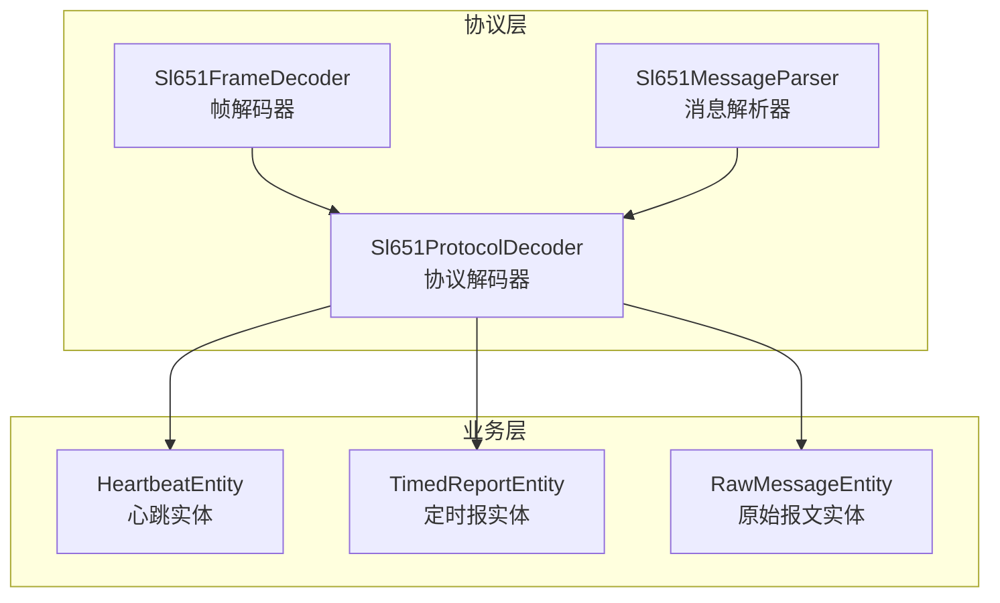
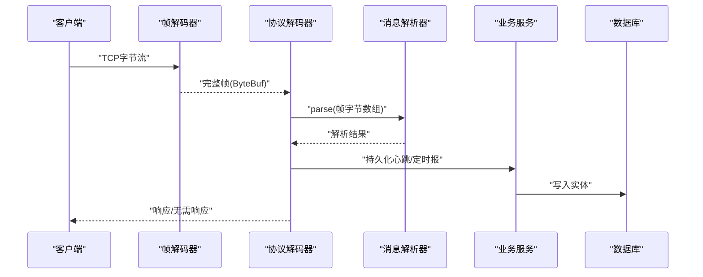
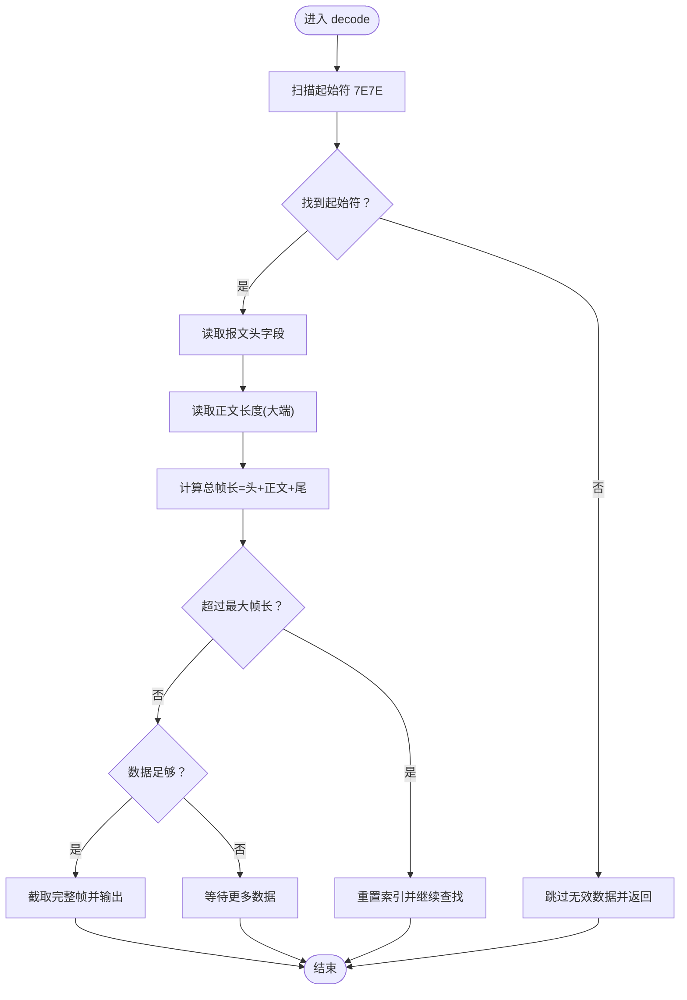
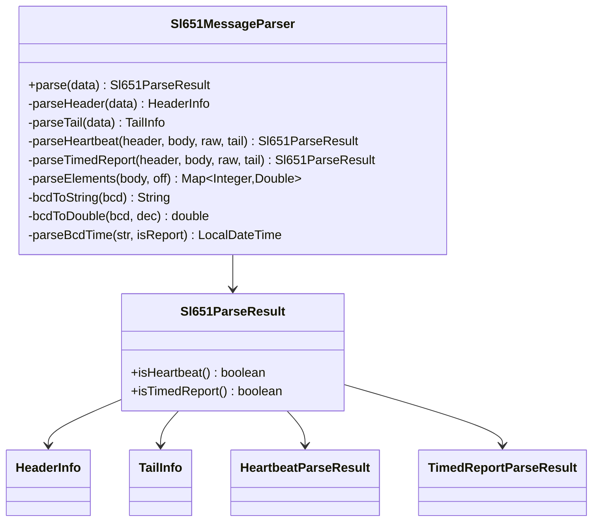
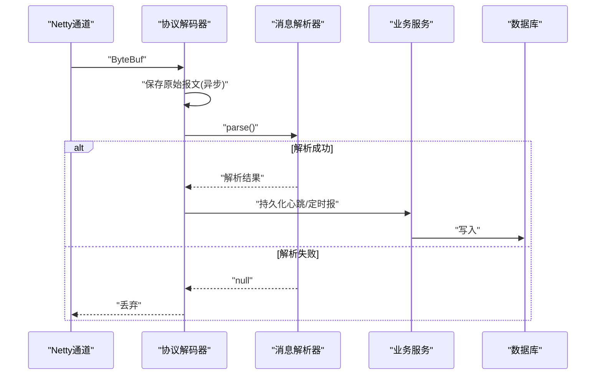
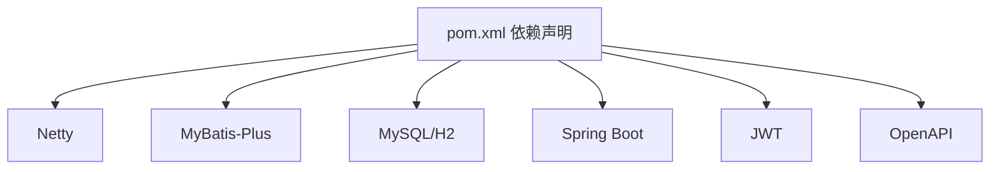

# 协议测试

<cite>
**本文引用的文件**
- [Sl651FrameDecoder.java](file://src/main/java/com/hydro/monitor/netty/Sl651FrameDecoder.java)
- [Sl651MessageParser.java](file://src/main/java/com/hydro/monitor/netty/Sl651MessageParser.java)
- [Sl651ProtocolDecoder.java](file://src/main/java/com/hydro/monitor/netty/Sl651ProtocolDecoder.java)
- [BcdDecodeTest.java](file://src/test/java/com/hydro/monitor/netty/BcdDecodeTest.java)
- [Sl651MessageParserTest.java](file://src/test/java/com/hydro/monitor/netty/Sl651MessageParserTest.java)
- [Sl651ProtocolDecoderTest.java](file://src/test/java/com/hydro/monitor/netty/Sl651ProtocolDecoderTest.java)
- [HeartbeatEntity.java](file://src/main/java/com/hydro/monitor/modules/entity/HeartbeatEntity.java)
- [TimedReportEntity.java](file://src/main/java/com/hydro/monitor/modules/entity/TimedReportEntity.java)
- [RawMessageEntity.java](file://src/main/java/com/hydro/monitor/modules/entity/RawMessageEntity.java)
- [application-test.yml](file://src/test/resources/application-test.yml)
- [application.yml](file://src/main/resources/application.yml)
- [pom.xml](file://pom.xml)
</cite>

## 目录
1. [简介](#简介)
2. [项目结构](#项目结构)
3. [核心组件](#核心组件)
4. [架构总览](#架构总览)
5. [详细组件分析](#详细组件分析)
6. [依赖分析](#依赖分析)
7. [性能考虑](#性能考虑)
8. [故障排查指南](#故障排查指南)
9. [结论](#结论)
10. [附录](#附录)

## 简介
本文件面向“水文监测系统协议测试”，聚焦于 SL 651-2014 协议解析器与协议解码器的测试策略与实践。文档覆盖以下主题：
- BCD 编码测试、协议帧解析测试、消息格式验证测试
- 协议兼容性测试、错误帧处理测试、边界条件测试
- 测试数据构造、协议状态机测试、协议完整性验证
- 自动化测试实现、测试覆盖率分析、协议版本升级测试策略
- 协议测试工具使用与故障诊断方法

## 项目结构
系统采用分层与模块化设计：
- 协议层：帧解码器、消息解析器、协议解码器
- 业务层：服务与实体，负责持久化与业务处理
- 测试层：针对协议解析器与解码器的单元与集成测试
- 配置层：应用与测试配置，支持 Netty 服务器与数据库连接

图表来源
- [Sl651FrameDecoder.java:25-121](file://src/main/java/com/hydro/monitor/netty/Sl651FrameDecoder.java#L25-L121)
- [Sl651MessageParser.java:24-648](file://src/main/java/com/hydro/monitor/netty/Sl651MessageParser.java#L24-L648)
- [Sl651ProtocolDecoder.java:35-278](file://src/main/java/com/hydro/monitor/netty/Sl651ProtocolDecoder.java#L35-L278)
- [HeartbeatEntity.java:15-50](file://src/main/java/com/hydro/monitor/modules/entity/HeartbeatEntity.java#L15-L50)
- [TimedReportEntity.java:15-48](file://src/main/java/com/hydro/monitor/modules/entity/TimedReportEntity.java#L15-L48)
- [RawMessageEntity.java:15-55](file://src/main/java/com/hydro/monitor/modules/entity/RawMessageEntity.java#L15-L55)

章节来源
- [Sl651FrameDecoder.java:10-26](file://src/main/java/com/hydro/monitor/netty/Sl651FrameDecoder.java#L10-L26)
- [Sl651MessageParser.java:10-25](file://src/main/java/com/hydro/monitor/netty/Sl651MessageParser.java#L10-L25)
- [Sl651ProtocolDecoder.java:25-39](file://src/main/java/com/hydro/monitor/netty/Sl651ProtocolDecoder.java#L25-L39)

## 核心组件
- 帧解码器：负责 TCP 黏包/拆包，定位起始符、计算帧长、输出完整帧
- 消息解析器：纯解析器，无状态、无副作用，解析报文头、正文、报文尾，按功能码分发
- 协议解码器：Netty 通道处理器，桥接解析器与业务层，持久化原始报文与解析结果

章节来源
- [Sl651FrameDecoder.java:25-121](file://src/main/java/com/hydro/monitor/netty/Sl651FrameDecoder.java#L25-L121)
- [Sl651MessageParser.java:24-648](file://src/main/java/com/hydro/monitor/netty/Sl651MessageParser.java#L24-L648)
- [Sl651ProtocolDecoder.java:35-278](file://src/main/java/com/hydro/monitor/netty/Sl651ProtocolDecoder.java#L35-L278)

## 架构总览
协议处理链路自下而上：
- 帧解码器将 ByteBuf 流切分为完整帧
- 协议解码器读取帧并调用解析器
- 解析器输出结构化结果
- 解码器根据结果持久化到数据库

图表来源
- [Sl651FrameDecoder.java:37-100](file://src/main/java/com/hydro/monitor/netty/Sl651FrameDecoder.java#L37-L100)
- [Sl651ProtocolDecoder.java:53-89](file://src/main/java/com/hydro/monitor/netty/Sl651ProtocolDecoder.java#L53-L89)
- [Sl651MessageParser.java:66-126](file://src/main/java/com/hydro/monitor/netty/Sl651MessageParser.java#L66-L126)

## 详细组件分析

### 帧解码器测试策略
- 目标：验证起始符识别、正文长度解析、帧长计算、最大帧长限制、缓冲区越界保护
- 关键路径：findSoh、decode、totalFrameSize、MAX_FRAME_LENGTH
- 测试要点：
  - 正常帧：起始符存在、正文长度合法、总帧长不超过上限
  - 异常帧：无起始符、正文长度超限、数据不足
  - 边界条件：刚好等于最小帧长、最大帧长边界、跨缓冲区起始符

图表来源
- [Sl651FrameDecoder.java:37-100](file://src/main/java/com/hydro/monitor/netty/Sl651FrameDecoder.java#L37-L100)

章节来源
- [Sl651FrameDecoder.java:37-121](file://src/main/java/com/hydro/monitor/netty/Sl651FrameDecoder.java#L37-L121)

### 消息解析器测试策略
- 目标：验证纯解析器对心跳报与定时报的解析能力，包括报文头、正文、报文尾、BCD 编码与时序解析
- 关键路径：parse、parseHeader、parseTail、parseHeartbeat、parseTimedReport、parseElements
- 测试要点：
  - 心跳报：功能码 0x2F、流水号、发报时间（BCD）
  - 定时报：功能码 0x32、正文站号、观测时间、要素循环（标识符、定义位、BCD 数据）
  - BCD 编码：字节到十六进制字符串、BCD 到数值、BCD 时间解析
  - 边界与错误：未知功能码、正文长度越界、要素定义位异常

图表来源
- [Sl651MessageParser.java:24-648](file://src/main/java/com/hydro/monitor/netty/Sl651MessageParser.java#L24-L648)

章节来源
- [Sl651MessageParser.java:66-126](file://src/main/java/com/hydro/monitor/netty/Sl651MessageParser.java#L66-L126)
- [Sl651MessageParserTest.java:19-268](file://src/test/java/com/hydro/monitor/netty/Sl651MessageParserTest.java#L19-L268)

### 协议解码器测试策略
- 目标：验证 Netty 通道处理器在真实报文上的行为，包括原始报文保存、解析结果持久化、异常处理
- 关键路径：channelRead0、handleHeartbeat、handleTimedReport、saveRawMessage
- 测试要点：
  - 原始报文保存：从 HEX 提取站址、功能码、方向标识
  - 心跳/定时报持久化：实体对象构建、要素集 JSON 序列化
  - 异常处理：解析失败、持久化异常、通道异常捕获

图表来源
- [Sl651ProtocolDecoder.java:53-89](file://src/main/java/com/hydro/monitor/netty/Sl651ProtocolDecoder.java#L53-L89)
- [Sl651ProtocolDecoder.java:98-182](file://src/main/java/com/hydro/monitor/netty/Sl651ProtocolDecoder.java#L98-L182)
- [Sl651ProtocolDecoder.java:203-249](file://src/main/java/com/hydro/monitor/netty/Sl651ProtocolDecoder.java#L203-L249)

章节来源
- [Sl651ProtocolDecoder.java:53-89](file://src/main/java/com/hydro/monitor/netty/Sl651ProtocolDecoder.java#L53-L89)
- [Sl651ProtocolDecoderTest.java:19-337](file://src/test/java/com/hydro/monitor/netty/Sl651ProtocolDecoderTest.java#L19-L337)

### BCD 编码测试
- 目标：验证 BCD 编码到十六进制字符串的转换，以及解析器中的 BCD 到数值与时间转换
- 测试要点：
  - 单字节 BCD 转十六进制字符串
  - 报文头站号（5字节 BCD）解析
  - BCD 数值解析（定义位含小数位）
  - BCD 时间解析（发报时间 12 位、观测时间 10 位）

章节来源
- [BcdDecodeTest.java:12-64](file://src/test/java/com/hydro/monitor/netty/BcdDecodeTest.java#L12-L64)
- [Sl651MessageParser.java:427-482](file://src/main/java/com/hydro/monitor/netty/Sl651MessageParser.java#L427-L482)

### 协议帧解析测试
- 目标：验证帧解码器在不同场景下的行为，包括正常帧、异常帧、边界帧
- 测试要点：
  - 正常心跳帧与定时报帧的功能码识别
  - 标识符解析（F0 观测时间、F1 遥测站地址、数值型标识符 22/29）
  - 十六进制转换一致性
  - 异常帧处理（长度不足）

章节来源
- [Sl651ProtocolDecoderTest.java:19-337](file://src/test/java/com/hydro/monitor/netty/Sl651ProtocolDecoderTest.java#L19-L337)

### 消息格式验证测试
- 目标：验证解析器对报文头、正文、报文尾的格式校验
- 测试要点：
  - 起始符、正文起始标识、报文尾标识
  - 正文长度与报文范围校验
  - 功能码分发与未知功能码处理

章节来源
- [Sl651MessageParser.java:358-414](file://src/main/java/com/hydro/monitor/netty/Sl651MessageParser.java#L358-L414)
- [Sl651MessageParserTest.java:31-100](file://src/test/java/com/hydro/monitor/netty/Sl651MessageParserTest.java#L31-L100)

### 协议兼容性测试
- 目标：验证解析器对不同要素标识符、不同小数位、不同数据长度的兼容性
- 测试要点：
  - 单要素与多要素报文
  - 不同定义位组合（小数位与数据字节数）
  - 已知要素标识符映射与未知标识符处理

章节来源
- [Sl651MessageParserTest.java:104-212](file://src/test/java/com/hydro/monitor/netty/Sl651MessageParserTest.java#L104-L212)

### 错误帧处理测试
- 目标：验证解析器与解码器对错误帧的健壮性
- 测试要点：
  - 起始符错误、正文长度越界、未知功能码
  - 解析失败时的空结果返回
  - 异常报文长度不足的处理

章节来源
- [Sl651MessageParserTest.java:70-100](file://src/test/java/com/hydro/monitor/netty/Sl651MessageParserTest.java#L70-L100)
- [Sl651ProtocolDecoderTest.java:246-260](file://src/test/java/com/hydro/monitor/netty/Sl651ProtocolDecoderTest.java#L246-L260)

### 边界条件测试
- 目标：验证解析器在极端输入下的行为
- 测试要点：
  - null 输入、空数组
  - 最小帧长、最大帧长
  - 要素数据截断与小数位异常

章节来源
- [Sl651MessageParserTest.java:213-248](file://src/test/java/com/hydro/monitor/netty/Sl651MessageParserTest.java#L213-L248)

### 协议状态机测试
- 目标：验证解析器的状态流转与分支逻辑
- 测试要点：
  - parse 主流程：头→尾→正文→功能码分发
  - parseHeartbeat 与 parseTimedReport 的子流程
  - parseElements 的循环解析与截断逻辑

章节来源
- [Sl651MessageParser.java:66-126](file://src/main/java/com/hydro/monitor/netty/Sl651MessageParser.java#L66-L126)
- [Sl651MessageParser.java:141-176](file://src/main/java/com/hydro/monitor/netty/Sl651MessageParser.java#L141-L176)
- [Sl651MessageParser.java:196-283](file://src/main/java/com/hydro/monitor/netty/Sl651MessageParser.java#L196-L283)
- [Sl651MessageParser.java:292-339](file://src/main/java/com/hydro/monitor/netty/Sl651MessageParser.java#L292-L339)

### 协议完整性验证
- 目标：验证解析结果与原始报文的一致性
- 测试要点：
  - 原始报文 HEX 保存与提取
  - 结果对象包含原始报文字段
  - 要素集 JSON 序列化与映射

章节来源
- [Sl651ProtocolDecoder.java:203-249](file://src/main/java/com/hydro/monitor/netty/Sl651ProtocolDecoder.java#L203-L249)
- [Sl651ProtocolDecoder.java:140-182](file://src/main/java/com/hydro/monitor/netty/Sl651ProtocolDecoder.java#L140-L182)

### 自动化测试实现
- 测试框架：JUnit 5（单元测试）、Spring Boot Test（集成测试）
- 测试数据构造：十六进制字符串转字节数组工具方法
- 测试执行：Maven 插件与 IDE 支持
- 测试隔离：测试配置使用内存数据库（H2）

章节来源
- [Sl651MessageParserTest.java:250-266](file://src/test/java/com/hydro/monitor/netty/Sl651MessageParserTest.java#L250-L266)
- [Sl651ProtocolDecoderTest.java:284-335](file://src/test/java/com/hydro/monitor/netty/Sl651ProtocolDecoderTest.java#L284-L335)
- [application-test.yml:1-29](file://src/test/resources/application-test.yml#L1-L29)

### 测试覆盖率分析
- 建议指标：语句覆盖率、分支覆盖率、行覆盖率
- 覆盖重点：解析主流程、异常路径、边界条件、BCD 转换
- 工具建议：JaCoCo Maven 插件（已在 POM 中配置 Spring Boot 插件，可扩展 JaCoCo）

章节来源
- [pom.xml:155-177](file://pom.xml#L155-L177)

### 协议版本升级测试策略
- 变更影响评估：新增功能码、新增标识符、变更定义位规则
- 测试策略：
  - 向后兼容性：旧功能码与标识符仍需支持
  - 新功能验证：新增功能码与标识符的解析与持久化
  - 回归测试：确保现有功能不受影响
  - 文档与配置更新：要素映射、时间格式等

章节来源
- [Sl651MessageParser.java:108-115](file://src/main/java/com/hydro/monitor/netty/Sl651MessageParser.java#L108-L115)
- [Sl651MessageParser.java:48-56](file://src/main/java/com/hydro/monitor/netty/Sl651MessageParser.java#L48-L56)

### 协议测试工具使用与故障诊断
- 工具使用：
  - 十六进制转换工具：用于构造与验证测试数据
  - 日志输出：解析器与解码器均输出详细日志，便于定位问题
- 故障诊断：
  - 起始符缺失：检查帧解码器 findSoh 与 skip 逻辑
  - 正文长度异常：核对大端序长度字段与总帧长计算
  - BCD 解析失败：检查字节到字符串转换与小数位插入
  - 持久化异常：确认数据库连接与实体映射

章节来源
- [Sl651ProtocolDecoderTest.java:265-280](file://src/test/java/com/hydro/monitor/netty/Sl651ProtocolDecoderTest.java#L265-L280)
- [Sl651MessageParser.java:427-482](file://src/main/java/com/hydro/monitor/netty/Sl651MessageParser.java#L427-L482)
- [Sl651ProtocolDecoder.java:272-276](file://src/main/java/com/hydro/monitor/netty/Sl651ProtocolDecoder.java#L272-L276)

## 依赖分析
- 外部依赖：Netty、MyBatis-Plus、MySQL/H2、Spring Boot、Lombok、JWT、OpenAPI
- 组件耦合：
  - 帧解码器与协议解码器通过 ByteBuf 交互
  - 解析器与解码器通过解析结果对象交互
  - 解码器依赖业务服务进行持久化

图表来源
- [pom.xml:30-153](file://pom.xml#L30-L153)

章节来源
- [pom.xml:21-153](file://pom.xml#L21-L153)

## 性能考虑
- 帧解码器：
  - 使用标记/重置读指针避免重复拷贝
  - 最大帧长限制防止内存溢出
- 解析器：
  - 无状态设计，线程安全，适合并发解析
- 解码器：
  - 原始报文异步保存，避免阻塞 Netty 线程
- 建议优化：
  - 对高频要素进行缓存映射
  - 批量持久化以减少数据库往返

## 故障排查指南
- 常见问题与定位：
  - 起始符错误：检查帧解码器 findSoh 与 skip 逻辑
  - 正文长度越界：核对功能码与长度字段
  - BCD 数值异常：检查定义位与小数位
  - 持久化失败：检查数据库连接与实体映射
- 日志辅助：
  - 解析器与解码器均输出详细日志，包含 HEX 报文与解析结果
- 配置检查：
  - 测试环境使用 H2 内存数据库，生产环境使用 MySQL
  - Netty 端口与 JWT 配置需与部署环境一致

章节来源
- [Sl651FrameDecoder.java:40-57](file://src/main/java/com/hydro/monitor/netty/Sl651FrameDecoder.java#L40-L57)
- [Sl651MessageParser.java:67-125](file://src/main/java/com/hydro/monitor/netty/Sl651MessageParser.java#L67-L125)
- [Sl651ProtocolDecoder.java:58-88](file://src/main/java/com/hydro/monitor/netty/Sl651ProtocolDecoder.java#L58-L88)
- [application-test.yml:1-29](file://src/test/resources/application-test.yml#L1-L29)
- [application.yml:43-86](file://src/main/resources/application.yml#L43-L86)

## 结论
本测试文档围绕 SL 651-2014 协议解析器与解码器构建了系统化的测试策略，覆盖 BCD 编码、帧解析、消息格式验证、兼容性、错误处理与边界条件，并提供了自动化测试实现与故障诊断方法。通过纯解析器与解码器分离的设计，测试具备高内聚、低耦合的特点，便于持续演进与版本升级。

## 附录
- 测试数据构造示例路径：
  - [十六进制字符串转字节数组:258-266](file://src/test/java/com/hydro/monitor/netty/Sl651MessageParserTest.java#L258-L266)
  - [十六进制转换工具方法:287-306](file://src/test/java/com/hydro/monitor/netty/Sl651ProtocolDecoderTest.java#L287-L306)
- 实体映射参考：
  - [心跳实体:15-50](file://src/main/java/com/hydro/monitor/modules/entity/HeartbeatEntity.java#L15-L50)
  - [定时报实体:15-48](file://src/main/java/com/hydro/monitor/modules/entity/TimedReportEntity.java#L15-L48)
  - [原始报文实体:15-55](file://src/main/java/com/hydro/monitor/modules/entity/RawMessageEntity.java#L15-L55)