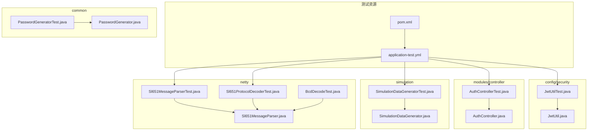
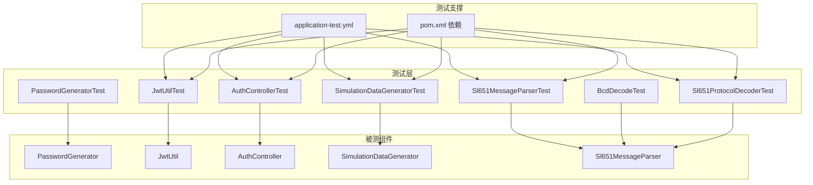
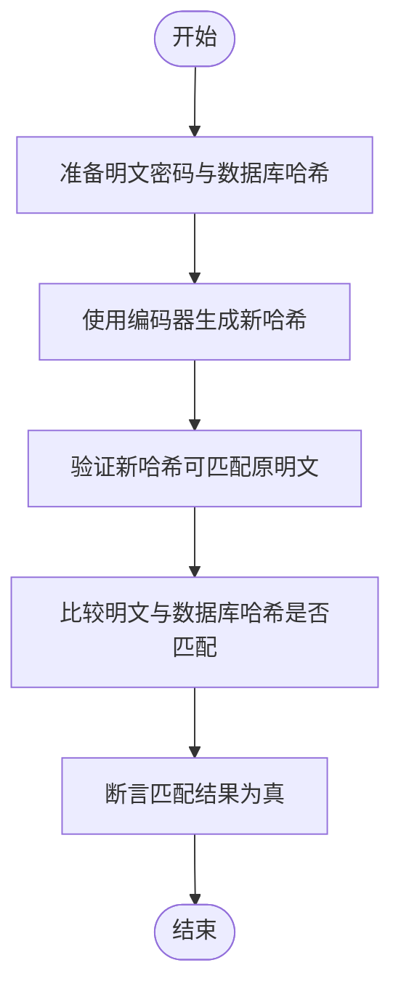
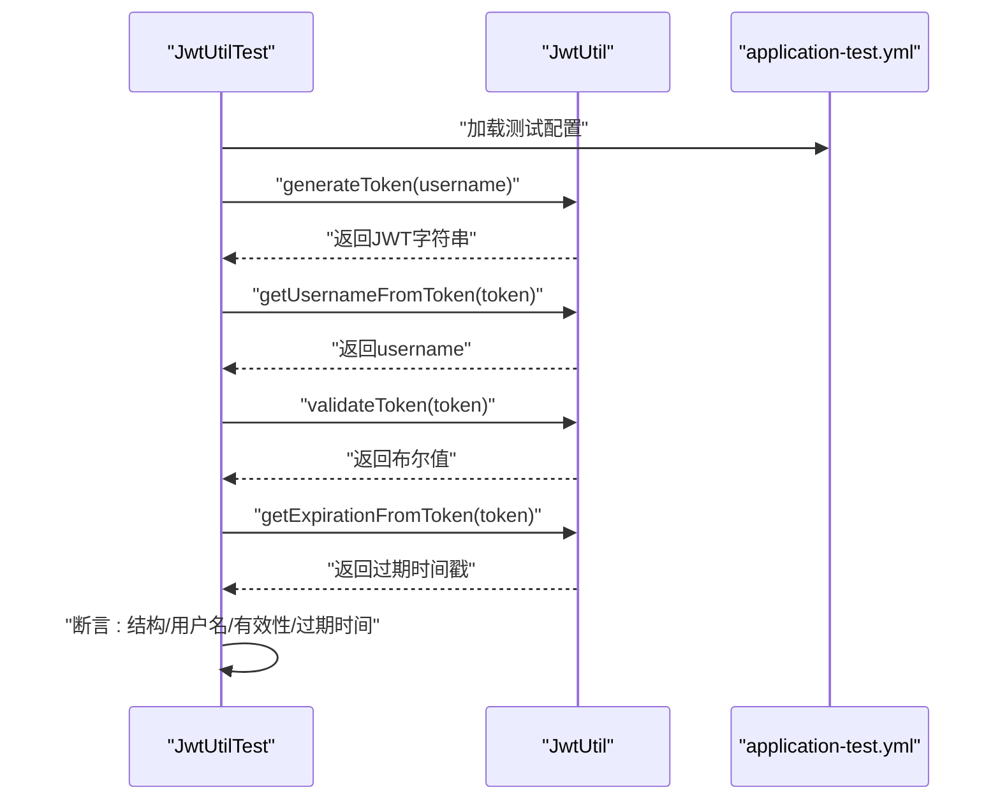
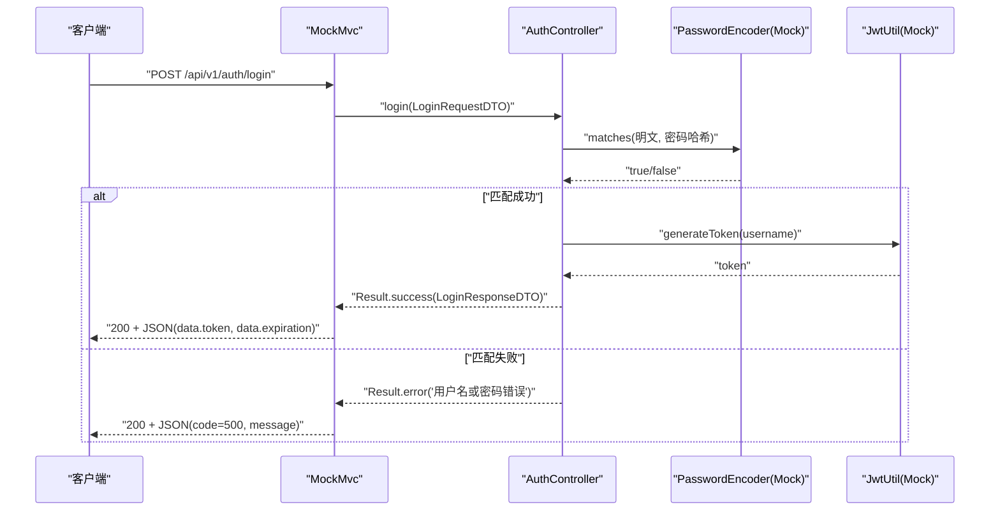
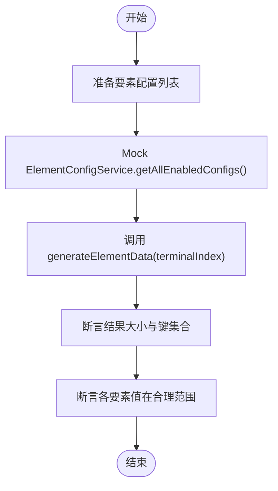
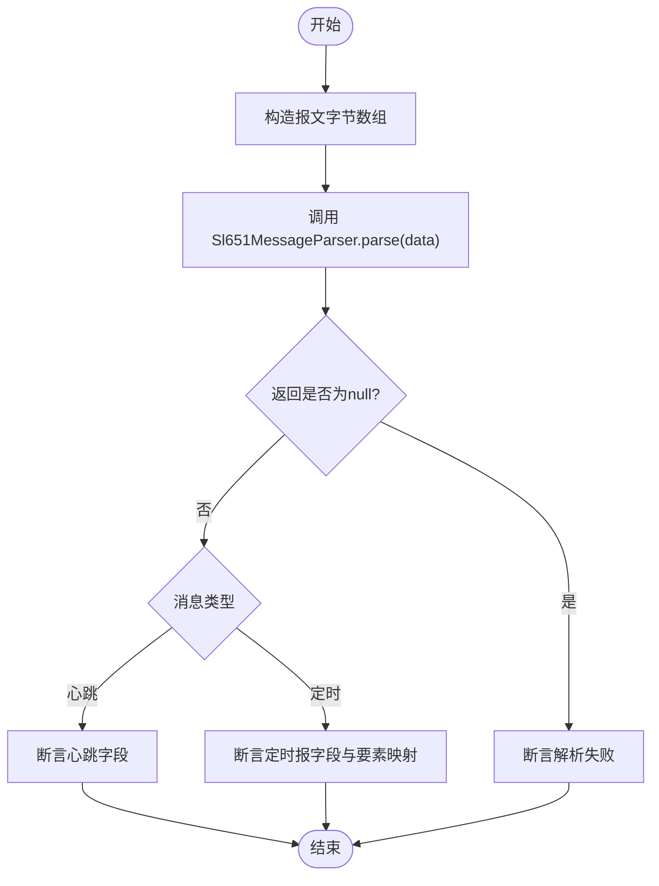
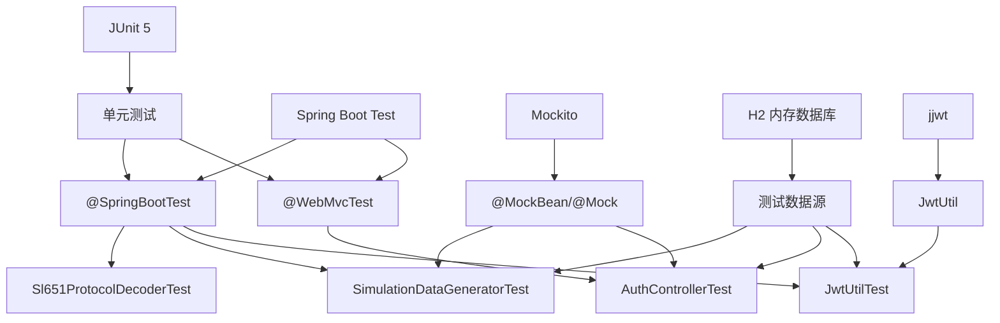

# 单元测试

<cite>
**本文引用的文件**
- [PasswordGeneratorTest.java](file://src/test/java/com/hydro/monitor/common/PasswordGeneratorTest.java)
- [JwtUtilTest.java](file://src/test/java/com/hydro/monitor/config/security/JwtUtilTest.java)
- [AuthControllerTest.java](file://src/test/java/com/hydro/monitor/modules/controller/AuthControllerTest.java)
- [SimulationDataGeneratorTest.java](file://src/test/java/com/hydro/monitor/simulation/SimulationDataGeneratorTest.java)
- [Sl651MessageParserTest.java](file://src/test/java/com/hydro/monitor/netty/Sl651MessageParserTest.java)
- [BcdDecodeTest.java](file://src/test/java/com/hydro/monitor/netty/BcdDecodeTest.java)
- [Sl651ProtocolDecoderTest.java](file://src/test/java/com/hydro/monitor/netty/Sl651ProtocolDecoderTest.java)
- [application-test.yml](file://src/test/resources/application-test.yml)
- [pom.xml](file://pom.xml)
- [PasswordGenerator.java](file://src/main/java/com/hydro/monitor/common/PasswordGenerator.java)
- [JwtUtil.java](file://src/main/java/com/hydro/monitor/config/security/JwtUtil.java)
- [AuthController.java](file://src/main/java/com/hydro/monitor/modules/controller/AuthController.java)
- [SimulationDataGenerator.java](file://src/main/java/com/hydro/monitor/simulation/SimulationDataGenerator.java)
- [Sl651MessageParser.java](file://src/main/java/com/hydro/monitor/netty/Sl651MessageParser.java)
</cite>

## 目录
1. [简介](#简介)
2. [项目结构](#项目结构)
3. [核心组件](#核心组件)
4. [架构总览](#架构总览)
5. [详细组件分析](#详细组件分析)
6. [依赖分析](#依赖分析)
7. [性能考虑](#性能考虑)
8. [故障排查指南](#故障排查指南)
9. [结论](#结论)
10. [附录](#附录)

## 简介
本文件面向水文监测系统的单元测试，系统性阐述 JUnit 测试框架在本项目中的使用方式、测试用例设计原则、Mock 对象的实现方法，并围绕以下关键模块给出测试策略与最佳实践：
- 密码生成器（PasswordGenerator）
- JWT 工具类（JwtUtil）
- 控制器层（AuthController）
- 模拟数据生成器（SimulationDataGenerator）
- 协议解析器（Sl651MessageParser）与相关 Netty 测试

同时覆盖断言编写、异常与边界条件测试、测试数据准备、测试隔离与执行顺序的重要性，并提供代码覆盖率建议与测试维护策略。

## 项目结构
测试代码主要位于 src/test 下，按模块划分：
- common：通用工具类测试（密码生成器）
- config/security：安全配置相关测试（JWT 工具类）
- modules/controller：控制器层测试（认证控制器）
- simulation：模拟数据生成器测试
- netty：协议解析与编解码相关测试（消息解析器、BCD 解析、协议解码器）

测试配置位于 src/test/resources/application-test.yml，使用内存数据库与较短的 JWT 过期时间以提升测试效率与可控性。

**图表来源**
- [application-test.yml:1-29](file://src/test/resources/application-test.yml#L1-L29)
- [pom.xml:125-144](file://pom.xml#L125-L144)
- [PasswordGeneratorTest.java:1-45](file://src/test/java/com/hydro/monitor/common/PasswordGeneratorTest.java#L1-L45)
- [JwtUtilTest.java:1-156](file://src/test/java/com/hydro/monitor/config/security/JwtUtilTest.java#L1-L156)
- [AuthControllerTest.java:1-114](file://src/test/java/com/hydro/monitor/modules/controller/AuthControllerTest.java#L1-L114)
- [SimulationDataGeneratorTest.java:1-112](file://src/test/java/com/hydro/monitor/simulation/SimulationDataGeneratorTest.java#L1-L112)
- [Sl651MessageParserTest.java:1-268](file://src/test/java/com/hydro/monitor/netty/Sl651MessageParserTest.java#L1-L268)
- [BcdDecodeTest.java:1-64](file://src/test/java/com/hydro/monitor/netty/BcdDecodeTest.java#L1-L64)
- [Sl651ProtocolDecoderTest.java:1-337](file://src/test/java/com/hydro/monitor/netty/Sl651ProtocolDecoderTest.java#L1-L337)

**章节来源**
- [application-test.yml:1-29](file://src/test/resources/application-test.yml#L1-L29)
- [pom.xml:125-144](file://pom.xml#L125-L144)

## 核心组件
本节概述与测试直接相关的核心组件及其职责：
- PasswordGenerator：基于 BCrypt 的密码编码与匹配工具，提供静态方法供测试验证哈希一致性。
- JwtUtil：基于 jjwt 的 JWT 生成、解析与校验工具，提供令牌签发、用户名提取、过期时间获取与有效性验证。
- AuthController：对外暴露登录接口，整合密码校验与 JWT 生成，返回统一响应结构。
- SimulationDataGenerator：依据要素配置生成合理范围内的模拟数据，用于终端上报模拟。
- Sl651MessageParser：纯解析器，将原始报文字节数组解析为结构化结果，不依赖外部存储。

这些组件在测试中分别通过：
- 单元测试（纯函数/工具类）直接调用
- WebMvcTest（控制器）结合 MockMvc 与 @MockBean
- SpringBootTest（集成测试）加载上下文与配置

**章节来源**
- [PasswordGenerator.java:1-55](file://src/main/java/com/hydro/monitor/common/PasswordGenerator.java#L1-L55)
- [JwtUtil.java:1-126](file://src/main/java/com/hydro/monitor/config/security/JwtUtil.java#L1-L126)
- [AuthController.java:1-68](file://src/main/java/com/hydro/monitor/modules/controller/AuthController.java#L1-L68)
- [SimulationDataGenerator.java:1-164](file://src/main/java/com/hydro/monitor/simulation/SimulationDataGenerator.java#L1-L164)
- [Sl651MessageParser.java:1-648](file://src/main/java/com/hydro/monitor/netty/Sl651MessageParser.java#L1-L648)

## 架构总览
下图展示测试架构与被测组件的关系，以及测试中常用的断言与 Mock 策略：

**图表来源**
- [PasswordGeneratorTest.java:1-45](file://src/test/java/com/hydro/monitor/common/PasswordGeneratorTest.java#L1-L45)
- [JwtUtilTest.java:1-156](file://src/test/java/com/hydro/monitor/config/security/JwtUtilTest.java#L1-L156)
- [AuthControllerTest.java:1-114](file://src/test/java/com/hydro/monitor/modules/controller/AuthControllerTest.java#L1-L114)
- [SimulationDataGeneratorTest.java:1-112](file://src/test/java/com/hydro/monitor/simulation/SimulationDataGeneratorTest.java#L1-L112)
- [Sl651MessageParserTest.java:1-268](file://src/test/java/com/hydro/monitor/netty/Sl651MessageParserTest.java#L1-L268)
- [BcdDecodeTest.java:1-64](file://src/test/java/com/hydro/monitor/netty/BcdDecodeTest.java#L1-L64)
- [Sl651ProtocolDecoderTest.java:1-337](file://src/test/java/com/hydro/monitor/netty/Sl651ProtocolDecoderTest.java#L1-L337)
- [application-test.yml:1-29](file://src/test/resources/application-test.yml#L1-L29)
- [pom.xml:77-94](file://pom.xml#L77-L94)

## 详细组件分析

### 密码生成器测试策略（PasswordGenerator）
- 测试目标
  - 验证明文密码与已存哈希的匹配
  - 验证新生成哈希的有效性
- 关键断言
  - 使用匹配器验证哈希一致性
  - 使用匹配器验证新哈希可被正确匹配
- 测试要点
  - 使用真实编码器实例进行匹配与编码
  - 输出辅助信息便于人工核对
- 最佳实践
  - 在测试中明确区分“已有哈希”与“新生成哈希”的用途
  - 避免在测试中硬编码生产密钥或敏感信息

**图表来源**
- [PasswordGeneratorTest.java:17-43](file://src/test/java/com/hydro/monitor/common/PasswordGeneratorTest.java#L17-L43)
- [PasswordGenerator.java:22-35](file://src/main/java/com/hydro/monitor/common/PasswordGenerator.java#L22-L35)

**章节来源**
- [PasswordGeneratorTest.java:1-45](file://src/test/java/com/hydro/monitor/common/PasswordGeneratorTest.java#L1-L45)
- [PasswordGenerator.java:1-55](file://src/main/java/com/hydro/monitor/common/PasswordGenerator.java#L1-L55)

### JWT 工具类测试策略（JwtUtil）
- 测试目标
  - 生成 Token 的合法性（三段式结构）
  - 从 Token 提取用户名
  - 有效/无效/空/null Token 的验证
  - 过期时间的正确性与时效性
  - 不同用户名与重复生成的唯一性
- 关键断言
  - Token 分割后应有三段
  - 提取用户名与原始一致
  - 有效 Token 验证为真；无效/空/null 为假
  - 过期时间大于 0 且晚于当前时间
- 测试要点
  - 使用 @SpringBootTest 与 @ActiveProfiles("test") 加载测试配置
  - 通过 application-test.yml 注入较短过期时间与测试密钥
- 最佳实践
  - 使用测试配置避免生产密钥泄露
  - 对时间相关断言加入容差或等待策略

**图表来源**
- [JwtUtilTest.java:27-154](file://src/test/java/com/hydro/monitor/config/security/JwtUtilTest.java#L27-L154)
- [JwtUtil.java:37-86](file://src/main/java/com/hydro/monitor/config/security/JwtUtil.java#L37-L86)
- [application-test.yml:14-17](file://src/test/resources/application-test.yml#L14-L17)

**章节来源**
- [JwtUtilTest.java:1-156](file://src/test/java/com/hydro/monitor/config/security/JwtUtilTest.java#L1-L156)
- [JwtUtil.java:1-126](file://src/main/java/com/hydro/monitor/config/security/JwtUtil.java#L1-L126)
- [application-test.yml:14-17](file://src/test/resources/application-test.yml#L14-L17)

### 控制器层测试策略（AuthController）
- 测试目标
  - 登录成功：返回 200、包含 token 与过期时间
  - 登录失败：用户名或密码错误，返回 500
  - 请求格式错误：返回 400
- 关键断言
  - 状态码与 JSONPath 断言
  - data.token 与 data.expiration 存在性
- Mock 策略
  - 使用 @WebMvcTest 仅加载 Web 层
  - 使用 @MockBean 注入 JwtUtil 与 PasswordEncoder，控制行为
- 最佳实践
  - 使用 MockMvc.perform(...) 模拟 HTTP 请求
  - 通过 when(...).thenReturn(...) 控制外部依赖行为

**图表来源**
- [AuthControllerTest.java:53-100](file://src/test/java/com/hydro/monitor/modules/controller/AuthControllerTest.java#L53-L100)
- [AuthController.java:43-66](file://src/main/java/com/hydro/monitor/modules/controller/AuthController.java#L43-L66)

**章节来源**
- [AuthControllerTest.java:1-114](file://src/test/java/com/hydro/monitor/modules/controller/AuthControllerTest.java#L1-L114)
- [AuthController.java:1-68](file://src/main/java/com/hydro/monitor/modules/controller/AuthController.java#L1-L68)

### 模拟数据生成器测试策略（SimulationDataGenerator）
- 测试目标
  - 正常配置：生成与要素数量一致的数据，数值在合理范围
  - 空配置：返回空映射
  - 不同终端：生成不同的数据（基于终端索引的差异化基线）
- 关键断言
  - Map 非空与大小断言
  - 合理范围断言（如降雨量、水位等）
- Mock 策略
  - 使用 MockitoExtension 与 @Mock 注入 ElementConfigService
  - 通过 when(...).thenReturn(...) 提供测试数据
- 最佳实践
  - 为不同要素提供明确的范围与精度断言
  - 验证空配置与异常路径

**图表来源**
- [SimulationDataGeneratorTest.java:38-110](file://src/test/java/com/hydro/monitor/simulation/SimulationDataGeneratorTest.java#L38-L110)
- [SimulationDataGenerator.java:37-59](file://src/main/java/com/hydro/monitor/simulation/SimulationDataGenerator.java#L37-L59)

**章节来源**
- [SimulationDataGeneratorTest.java:1-112](file://src/test/java/com/hydro/monitor/simulation/SimulationDataGeneratorTest.java#L1-L112)
- [SimulationDataGenerator.java:1-164](file://src/main/java/com/hydro/monitor/simulation/SimulationDataGenerator.java#L1-L164)

### 协议解析器测试策略（Sl651MessageParser）
- 测试目标
  - 心跳报解析：功能码 2F，正文包含流水号与发报时间
  - 定时报解析：功能码 32，正文包含站地址、观测时间与多要素数据
  - 边界与异常：空输入、空数组、未知功能码、报文长度不足、起始符错误
- 关键断言
  - parse 返回结果非空且类型正确
  - 心跳报/定时报字段断言
  - 要素数据映射大小与键存在性
- 最佳实践
  - 使用十六进制构造器构建完整报文
  - 对复杂字段（时间、要素定义位）进行拆解断言
  - 对异常路径断言返回 null

**图表来源**
- [Sl651MessageParserTest.java:31-248](file://src/test/java/com/hydro/monitor/netty/Sl651MessageParserTest.java#L31-L248)
- [Sl651MessageParser.java:66-126](file://src/main/java/com/hydro/monitor/netty/Sl651MessageParser.java#L66-L126)

**章节来源**
- [Sl651MessageParserTest.java:1-268](file://src/test/java/com/hydro/monitor/netty/Sl651MessageParserTest.java#L1-L268)
- [Sl651MessageParser.java:1-648](file://src/main/java/com/hydro/monitor/netty/Sl651MessageParser.java#L1-L648)

### BCD 解析与协议解码器测试
- BCD 解析测试（BcdDecodeTest）
  - 验证 5 字节遥测站地址 BCD 解析
  - 验证字节到十六进制字符串转换
- 协议解码器测试（Sl651ProtocolDecoderTest）
  - 验证功能码 2F（心跳）与 32（定时报）
  - 验证标识符解析（F0/F1/22/29 等）
  - 验证异常报文处理与十六进制转换工具

**章节来源**
- [BcdDecodeTest.java:1-64](file://src/test/java/com/hydro/monitor/netty/BcdDecodeTest.java#L1-L64)
- [Sl651ProtocolDecoderTest.java:1-337](file://src/test/java/com/hydro/monitor/netty/Sl651ProtocolDecoderTest.java#L1-L337)

## 依赖分析
- 测试框架与工具
  - JUnit 5（测试执行与断言）
  - Spring Boot Test（WebMvcTest、SpringBootTest）
  - Mockito（MockBean/Mock）
  - H2 内存数据库（测试数据源）
  - jjwt（JWT 工具类）
- 测试配置
  - application-test.yml 提供测试专用数据源、JWT 密钥与过期时间、日志级别等
- 依赖关系可视化

**图表来源**
- [pom.xml:77-94](file://pom.xml#L77-L94)
- [application-test.yml:3-7](file://src/test/resources/application-test.yml#L3-L7)
- [JwtUtilTest.java:17-22](file://src/test/java/com/hydro/monitor/config/security/JwtUtilTest.java#L17-L22)
- [AuthControllerTest.java:27-37](file://src/test/java/com/hydro/monitor/modules/controller/AuthControllerTest.java#L27-L37)
- [SimulationDataGeneratorTest.java:24-35](file://src/test/java/com/hydro/monitor/simulation/SimulationDataGeneratorTest.java#L24-L35)

**章节来源**
- [pom.xml:77-94](file://pom.xml#L77-L94)
- [application-test.yml:1-29](file://src/test/resources/application-test.yml#L1-L29)

## 性能考虑
- 测试隔离与速度
  - 使用 @WebMvcTest 与 @MockBean 避免启动完整应用上下文，提升控制器测试速度
  - 使用 @SpringBootTest 仅在需要集成验证时启用
- 内存数据库
  - H2 内存数据库减少 IO 与持久化开销，适合高频测试
- 配置优化
  - application-test.yml 中设置较短的 JWT 过期时间，便于测试过期逻辑
- 建议
  - 将纯函数与工具类测试置于独立套件，优先执行
  - 对网络/IO 相关测试采用桩或模拟，避免真实连接

## 故障排查指南
- 常见问题与解决
  - Token 验证失败：检查 application-test.yml 中的密钥与过期时间配置
  - 控制器测试返回 401：需在测试中配置安全上下文或使用 @AutoConfigureTestSecurity
  - 模拟数据为空：确认 ElementConfigService 返回的配置列表非空
  - 协议解析返回 null：检查报文长度、起始符、功能码与正文长度
- 排查步骤
  - 打印原始报文与解析日志
  - 分步断言：先断言 parse 非空，再断言类型与关键字段
  - 使用十六进制工具方法交叉验证

**章节来源**
- [JwtUtilTest.java:72-75](file://src/test/java/com/hydro/monitor/config/security/JwtUtilTest.java#L72-L75)
- [Sl651MessageParserTest.java:72-100](file://src/test/java/com/hydro/monitor/netty/Sl651MessageParserTest.java#L72-L100)
- [application-test.yml:14-17](file://src/test/resources/application-test.yml#L14-L17)

## 结论
本项目的单元测试体系以 JUnit 5 为核心，结合 Spring Boot Test 与 Mockito，覆盖了密码生成、JWT 工具、控制器、模拟数据与协议解析等关键模块。通过合理的断言策略、Mock 对象与测试配置，实现了高内聚、低耦合的测试方案。建议持续完善边界与异常场景覆盖，并结合 CI/CD 确保测试执行的稳定性与可重复性。

## 附录
- 测试断言清单
  - 密码生成器：匹配断言、新哈希断言
  - JWT 工具类：三段式结构、用户名提取、有效性、过期时间、唯一性
  - 控制器：状态码、JSONPath、业务错误码与消息
  - 模拟数据：大小、键集合、数值范围
  - 协议解析：类型判断、字段断言、异常路径
- 代码覆盖率建议
  - 建议核心模块（工具类、解析器、控制器）达到 80%+ 行覆盖率
  - 对边界与异常路径进行专项补充
- 测试维护策略
  - 随着需求演进同步更新测试用例
  - 对外部依赖（JWT 密钥、数据库）使用测试配置隔离
  - 保持测试命名清晰、断言明确、日志可读