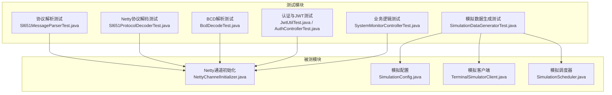
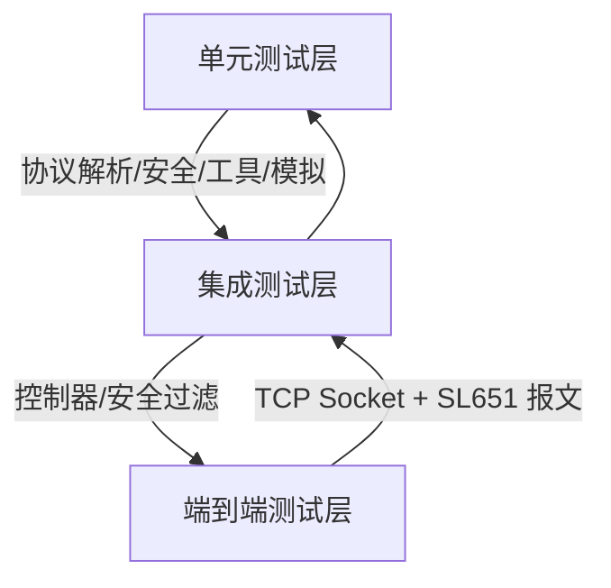
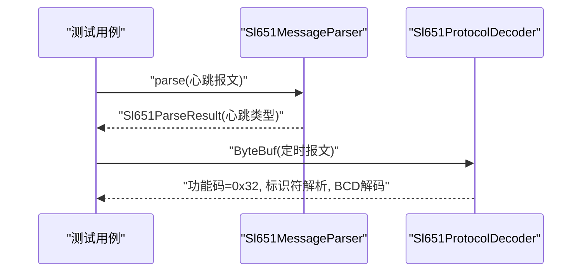
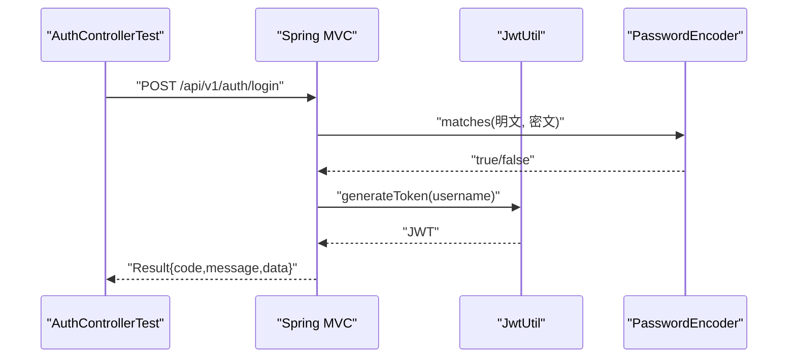
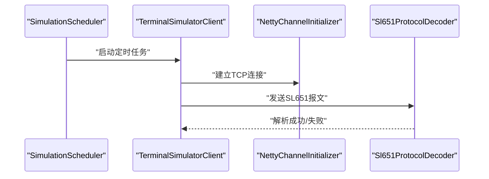
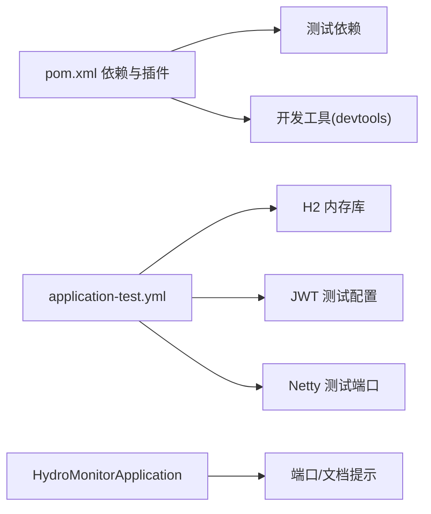

# 测试策略

<cite>
**本文引用的文件**
- [pom.xml](file://pom.xml)
- [application-test.yml](file://src/test/resources/application-test.yml)
- [README.md](file://README.md)
- [HydroMonitorApplication.java](file://src/main/java/com/hydro/monitor/HydroMonitorApplication.java)
- [Sl651MessageParserTest.java](file://src/test/java/com/hydro/monitor/netty/Sl651MessageParserTest.java)
- [Sl651ProtocolDecoderTest.java](file://src/test/java/com/hydro/monitor/netty/Sl651ProtocolDecoderTest.java)
- [BcdDecodeTest.java](file://src/test/java/com/hydro/monitor/netty/BcdDecodeTest.java)
- [JwtUtilTest.java](file://src/test/java/com/hydro/monitor/config/security/JwtUtilTest.java)
- [PasswordGeneratorTest.java](file://src/test/java/com/hydro/monitor/common/PasswordGeneratorTest.java)
- [AuthControllerTest.java](file://src/test/java/com/hydro/monitor/modules/controller/AuthControllerTest.java)
- [SystemMonitorControllerTest.java](file://src/test/java/com/hydro/monitor/modules/controller/SystemMonitorControllerTest.java)
- [SimulationDataGeneratorTest.java](file://src/test/java/com/hydro/monitor/simulation/SimulationDataGeneratorTest.java)
- [NettyChannelInitializer.java](file://src/main/java/com/hydro/monitor/config/NettyChannelInitializer.java)
- [SimulationConfig.java](file://src/main/java/com/hydro/monitor/config/SimulationConfig.java)
- [TerminalSimulatorClient.java](file://src/main/java/com/hydro/monitor/simulation/TerminalSimulatorClient.java)
- [SimulationScheduler.java](file://src/main/java/com/hydro/monitor/simulation/SimulationScheduler.java)
- [init.sql](file://src/main/resources/db/init.sql)
</cite>

## 目录
1. [简介](#简介)
2. [项目结构](#项目结构)
3. [核心组件](#核心组件)
4. [架构总览](#架构总览)
5. [详细组件分析](#详细组件分析)
6. [依赖分析](#依赖分析)
7. [性能考虑](#性能考虑)
8. [故障排查指南](#故障排查指南)
9. [结论](#结论)
10. [附录](#附录)

## 简介
本测试策略文档面向“水文监测系统”，围绕单元测试、集成测试与端到端测试，结合测试金字塔理念，系统阐述测试设计原则、测试用例设计方法、测试数据管理、协议解析测试、认证测试、业务逻辑测试与性能测试的实施方案。同时给出测试框架选择、Mock对象使用、测试环境搭建、覆盖率与质量门禁建议、持续集成配置思路，以及测试自动化、回归测试与冒烟测试的执行策略，并总结测试报告生成、缺陷跟踪与测试维护的最佳实践。

## 项目结构
项目采用 Spring Boot + Netty 的架构，核心模块包括：
- 控制器层：对外提供 REST API
- 安全与认证：基于 Spring Security + JWT
- 协议解析：SL 651-2014 报文解析（纯解析器与 Netty 解码器）
- 业务服务与持久层：MyBatis-Plus + MySQL（测试使用 H2 内存数据库）
- 终端模拟模块：通过 TCP Socket 模拟多 RTU 终端上报数据
- 测试模块：覆盖协议解析、安全、控制器、业务逻辑与模拟数据生成

**图表来源**
- [Sl651MessageParserTest.java:1-268](file://src/test/java/com/hydro/monitor/netty/Sl651MessageParserTest.java#L1-L268)
- [Sl651ProtocolDecoderTest.java:1-337](file://src/test/java/com/hydro/monitor/netty/Sl651ProtocolDecoderTest.java#L1-L337)
- [BcdDecodeTest.java:1-64](file://src/test/java/com/hydro/monitor/netty/BcdDecodeTest.java#L1-L64)
- [JwtUtilTest.java:1-156](file://src/test/java/com/hydro/monitor/config/security/JwtUtilTest.java#L1-L156)
- [AuthControllerTest.java:1-114](file://src/test/java/com/hydro/monitor/modules/controller/AuthControllerTest.java#L1-L114)
- [SystemMonitorControllerTest.java:1-61](file://src/test/java/com/hydro/monitor/modules/controller/SystemMonitorControllerTest.java#L1-L61)
- [SimulationDataGeneratorTest.java:1-112](file://src/test/java/com/hydro/monitor/simulation/SimulationDataGeneratorTest.java#L1-L112)
- [NettyChannelInitializer.java:1-35](file://src/main/java/com/hydro/monitor/config/NettyChannelInitializer.java#L1-L35)
- [SimulationConfig.java:1-58](file://src/main/java/com/hydro/monitor/config/SimulationConfig.java#L1-L58)
- [TerminalSimulatorClient.java:1-44](file://src/main/java/com/hydro/monitor/simulation/TerminalSimulatorClient.java#L1-L44)
- [SimulationScheduler.java:1-43](file://src/main/java/com/hydro/monitor/simulation/SimulationScheduler.java#L1-L43)

**章节来源**
- [pom.xml:1-179](file://pom.xml#L1-L179)
- [application-test.yml:1-29](file://src/test/resources/application-test.yml#L1-L29)
- [README.md:1-124](file://README.md#L1-L124)

## 核心组件
- 测试框架与依赖
  - JUnit 5：单元测试与参数化测试
  - Spring Boot Test + WebMvcTest：控制器层测试
  - Spring Security Test：认证与授权相关测试
  - Mockito：Mock 对象与注入
  - H2 内存数据库：测试环境数据库替代
- 测试配置
  - application-test.yml：H2 内存库、JWT 测试密钥、Netty 测试端口、日志级别
- 关键测试类概览
  - 协议解析：Sl651MessageParserTest、Sl651ProtocolDecoderTest、BcdDecodeTest
  - 安全与认证：JwtUtilTest、AuthControllerTest、PasswordGeneratorTest
  - 控制器：SystemMonitorControllerTest
  - 业务与模拟：SimulationDataGeneratorTest
  - 启动与环境：HydroMonitorApplication（启动日志与端口提示）

**章节来源**
- [pom.xml:125-144](file://pom.xml#L125-L144)
- [application-test.yml:1-29](file://src/test/resources/application-test.yml#L1-L29)
- [HydroMonitorApplication.java:1-36](file://src/main/java/com/hydro/monitor/HydroMonitorApplication.java#L1-L36)

## 架构总览
测试金字塔强调以单元测试为基础，集成测试为中层，端到端测试为顶层。本项目测试覆盖如下：
- 单元测试：协议解析（纯解析器与 Netty 解码器）、BCD 编码、安全工具、密码生成、模拟数据生成
- 集成测试：控制器层（Spring MVC 测试）、安全过滤链（Spring Security Test）
- 端到端测试：通过模拟客户端向 Netty 服务端发送真实协议报文，验证完整链路

[此图为概念性示意，无需图表来源]

## 详细组件分析

### 协议解析测试
- 目标：验证 SL 651-2014 协议解析的正确性，包括心跳报与定时报、标识符解析、BCD 数值解码、边界条件与异常处理。
- 方法：
  - 纯解析器测试：构造标准十六进制报文，断言解析结果字段（站号、密码、功能码、流水号、时间、要素集合等）
  - Netty 解码器测试：使用 ByteBuf 构造报文，断言功能码与标识符解析、BCD 数值解码
  - BCD 解码测试：验证遥测站地址等 BCD 字节序列解析
- 关键断言点：
  - 功能码识别（心跳 0x2F、定时报 0x32）
  - 标识符解析（F0 观测时间、F1 遥测站地址、数值型要素 22/29 等）
  - BCD 数值解码精度与范围
  - 异常报文处理（长度不足、起始符错误、未知功能码）

**图表来源**
- [Sl651MessageParserTest.java:1-268](file://src/test/java/com/hydro/monitor/netty/Sl651MessageParserTest.java#L1-L268)
- [Sl651ProtocolDecoderTest.java:1-337](file://src/test/java/com/hydro/monitor/netty/Sl651ProtocolDecoderTest.java#L1-L337)
- [BcdDecodeTest.java:1-64](file://src/test/java/com/hydro/monitor/netty/BcdDecodeTest.java#L1-L64)

**章节来源**
- [Sl651MessageParserTest.java:1-268](file://src/test/java/com/hydro/monitor/netty/Sl651MessageParserTest.java#L1-L268)
- [Sl651ProtocolDecoderTest.java:1-337](file://src/test/java/com/hydro/monitor/netty/Sl651ProtocolDecoderTest.java#L1-L337)
- [BcdDecodeTest.java:1-64](file://src/test/java/com/hydro/monitor/netty/BcdDecodeTest.java#L1-L64)

### 认证与安全测试
- 目标：验证 JWT 生成、解析、校验流程；控制器层登录接口行为；密码编码一致性。
- 方法：
  - JwtUtilTest：生成 Token 并断言结构、用户名提取、有效性与过期时间
  - AuthControllerTest：使用 WebMvcTest 与 MockBean，模拟密码校验与 Token 生成，断言响应结构与状态码
  - PasswordGeneratorTest：验证 BCrypt 编码与解码一致性
- 关键断言点：
  - Token 结构（三段式）、用户名提取、有效期判断
  - 登录成功/失败场景、请求格式错误
  - 密码哈希一致性

**图表来源**
- [AuthControllerTest.java:1-114](file://src/test/java/com/hydro/monitor/modules/controller/AuthControllerTest.java#L1-L114)
- [JwtUtilTest.java:1-156](file://src/test/java/com/hydro/monitor/config/security/JwtUtilTest.java#L1-L156)
- [PasswordGeneratorTest.java:1-45](file://src/test/java/com/hydro/monitor/common/PasswordGeneratorTest.java#L1-L45)

**章节来源**
- [JwtUtilTest.java:1-156](file://src/test/java/com/hydro/monitor/config/security/JwtUtilTest.java#L1-L156)
- [AuthControllerTest.java:1-114](file://src/test/java/com/hydro/monitor/modules/controller/AuthControllerTest.java#L1-L114)
- [PasswordGeneratorTest.java:1-45](file://src/test/java/com/hydro/monitor/common/PasswordGeneratorTest.java#L1-L45)

### 业务逻辑测试
- 目标：验证系统监控接口的访问控制与数据结构（当前示例为未认证返回 401 的预期行为）。
- 方法：WebMvcTest + MockMvc，断言状态码与数据结构（后续可扩展为集成测试，注入真实服务层）。
- 关键断言点：未认证访问返回 401；认证后返回系统状态结构。

**章节来源**
- [SystemMonitorControllerTest.java:1-61](file://src/test/java/com/hydro/monitor/modules/controller/SystemMonitorControllerTest.java#L1-L61)

### 模拟数据生成测试
- 目标：验证模拟数据生成器根据要素配置生成合理范围内的数值，支持多终端差异化数据。
- 方法：Mock 元素配置服务，断言生成数据的数量、键集合与数值范围。
- 关键断言点：空配置返回空映射；不同终端索引生成差异化数据；数值在预设范围内。

**章节来源**
- [SimulationDataGeneratorTest.java:1-112](file://src/test/java/com/hydro/monitor/simulation/SimulationDataGeneratorTest.java#L1-L112)

### 端到端测试（Netty 通道与模拟上报）
- 目标：通过模拟客户端向 Netty 服务端发送真实协议报文，验证从 TCP Socket 到协议解析的完整链路。
- 方法：
  - 使用 SimulationConfig 配置模拟客户端连接参数（主机、端口、上报间隔等）
  - TerminalSimulatorClient 通过 Socket 发送报文，SimulationScheduler 管理多个客户端
  - 在测试环境中，NettyChannelInitializer 将 Sl651FrameDecoder 与 Sl651ProtocolDecoder 加入管道
- 关键断言点：报文到达、功能码识别、要素解析、入库或业务处理（可结合集成测试验证）

**图表来源**
- [SimulationScheduler.java:1-43](file://src/main/java/com/hydro/monitor/simulation/SimulationScheduler.java#L1-L43)
- [TerminalSimulatorClient.java:1-44](file://src/main/java/com/hydro/monitor/simulation/TerminalSimulatorClient.java#L1-L44)
- [NettyChannelInitializer.java:1-35](file://src/main/java/com/hydro/monitor/config/NettyChannelInitializer.java#L1-L35)

**章节来源**
- [SimulationConfig.java:1-58](file://src/main/java/com/hydro/monitor/config/SimulationConfig.java#L1-L58)
- [TerminalSimulatorClient.java:1-44](file://src/main/java/com/hydro/monitor/simulation/TerminalSimulatorClient.java#L1-L44)
- [SimulationScheduler.java:1-43](file://src/main/java/com/hydro/monitor/simulation/SimulationScheduler.java#L1-L43)
- [NettyChannelInitializer.java:1-35](file://src/main/java/com/hydro/monitor/config/NettyChannelInitializer.java#L1-L35)

## 依赖分析
- 测试依赖与插件
  - spring-boot-starter-test、spring-security-test、H2 数据库、JUnit 5、Mockito
- 测试配置
  - application-test.yml：H2 内存库、JWT 测试密钥、Netty 测试端口、日志级别
- 启动与环境
  - HydroMonitorApplication：打印端口与文档地址，便于本地验证

**图表来源**
- [pom.xml:125-152](file://pom.xml#L125-L152)
- [application-test.yml:1-29](file://src/test/resources/application-test.yml#L1-L29)
- [HydroMonitorApplication.java:1-36](file://src/main/java/com/hydro/monitor/HydroMonitorApplication.java#L1-L36)

**章节来源**
- [pom.xml:125-152](file://pom.xml#L125-L152)
- [application-test.yml:1-29](file://src/test/resources/application-test.yml#L1-L29)
- [HydroMonitorApplication.java:1-36](file://src/main/java/com/hydro/monitor/HydroMonitorApplication.java#L1-L36)

## 性能考虑
- 单元测试优先：协议解析与工具类测试应尽量无外部依赖，保证执行速度与稳定性
- 集成测试聚焦关键路径：控制器与安全过滤链，避免长链路等待
- 端到端测试控制并发：模拟客户端数量与上报间隔需在测试配置中可控，避免资源耗尽
- 数据库测试：H2 内存库具备较快初始化与销毁能力，适合高频测试

[本节为通用指导，无需章节来源]

## 故障排查指南
- 单元测试失败
  - 协议解析：检查报文构造是否符合 SL 651-2014 格式；确认功能码与标识符解析逻辑
  - BCD 解码：核对字节顺序与小数位计算
  - JWT：确认测试配置中的密钥与过期时间
- 集成测试失败
  - 控制器：检查请求体格式、Content-Type、认证头；必要时开启 Spring Security 测试支持
  - 安全过滤：确认测试 Profile 与配置加载
- 端到端测试失败
  - 检查 Netty 服务端口与模拟客户端配置；确认 TCP 连接可达
  - 核对模拟客户端发送的报文是否满足协议格式

**章节来源**
- [Sl651MessageParserTest.java:1-268](file://src/test/java/com/hydro/monitor/netty/Sl651MessageParserTest.java#L1-L268)
- [Sl651ProtocolDecoderTest.java:1-337](file://src/test/java/com/hydro/monitor/netty/Sl651ProtocolDecoderTest.java#L1-L337)
- [BcdDecodeTest.java:1-64](file://src/test/java/com/hydro/monitor/netty/BcdDecodeTest.java#L1-L64)
- [JwtUtilTest.java:1-156](file://src/test/java/com/hydro/monitor/config/security/JwtUtilTest.java#L1-L156)
- [AuthControllerTest.java:1-114](file://src/test/java/com/hydro/monitor/modules/controller/AuthControllerTest.java#L1-L114)
- [SystemMonitorControllerTest.java:1-61](file://src/test/java/com/hydro/monitor/modules/controller/SystemMonitorControllerTest.java#L1-L61)
- [SimulationConfig.java:1-58](file://src/main/java/com/hydro/monitor/config/SimulationConfig.java#L1-L58)

## 结论
本测试策略以测试金字塔为核心，结合协议解析、认证安全、业务逻辑与模拟上报等关键领域，构建了从单元到端到端的完整测试体系。通过合理的测试框架与 Mock 策略、清晰的测试数据管理与测试环境配置，能够有效保障系统质量与交付效率。建议在持续集成中引入覆盖率统计与质量门禁，配合自动化与回归测试，形成闭环的质量保障机制。

[本节为总结，无需章节来源]

## 附录

### 测试金字塔与测试层次
- 单元测试：协议解析、工具类、模拟数据生成
- 集成测试：控制器、安全过滤链、数据库交互（H2）
- 端到端测试：Netty 通道、模拟客户端、真实报文链路

[本节为概念性说明，无需章节来源]

### 测试用例设计与测试数据管理
- 设计原则
  - 覆盖正常路径、边界条件与异常路径
  - 使用参数化测试提升用例密度
  - 使用固定种子或受控随机性保证可重复性
- 测试数据
  - 协议报文：使用十六进制字符串构造，覆盖功能码、标识符、BCD 数值
  - JWT：使用测试密钥与短过期时间
  - 数据库：H2 内存库，初始化脚本见数据库脚本文件

**章节来源**
- [init.sql:1-93](file://src/main/resources/db/init.sql#L1-L93)
- [application-test.yml:1-29](file://src/test/resources/application-test.yml#L1-L29)

### 测试框架与工具
- JUnit 5：测试生命周期与断言
- Spring Boot Test + WebMvcTest：控制器与安全测试
- Spring Security Test：认证与授权测试
- Mockito：Mock Bean 与方法调用验证
- H2：内存数据库替代

**章节来源**
- [pom.xml:125-144](file://pom.xml#L125-L144)

### 测试环境搭建
- 启动应用：HydroMonitorApplication 打印端口与文档地址
- 测试配置：application-test.yml 指定 H2、JWT 与 Netty 端口
- 数据库初始化：使用 init.sql 初始化表结构与默认数据

**章节来源**
- [HydroMonitorApplication.java:1-36](file://src/main/java/com/hydro/monitor/HydroMonitorApplication.java#L1-L36)
- [application-test.yml:1-29](file://src/test/resources/application-test.yml#L1-L29)
- [init.sql:1-93](file://src/main/resources/db/init.sql#L1-L93)

### 覆盖率要求与质量门禁
- 建议指标
  - 单元测试行覆盖率 ≥ 80%
  - 分支覆盖率 ≥ 70%
  - 关键路径（协议解析、安全工具、核心业务）达到 100% 覆盖
- 质量门禁
  - CI 中设置最小覆盖率阈值，低于阈值阻断合并
  - 严重缺陷（P0/P1）必须修复后方可合并

[本节为通用指导，无需章节来源]

### 持续集成配置思路
- 触发策略：推送/PR 触发构建与测试
- 步骤建议：依赖安装 → 编译 → 单元测试（含覆盖率）→ 集成测试 → 端到端测试（可选）
- 结果输出：测试报告、覆盖率报告、日志归档

[本节为通用指导，无需章节来源]

### 测试自动化、回归测试与冒烟测试
- 自动化
  - 单元测试与集成测试在本地与 CI 中自动执行
  - 端到端测试按需执行（如夜间或 PR 合并前）
- 回归测试
  - 新增/修改协议解析与安全模块后重点回归
- 冒烟测试
  - 启动成功、API 文档可达、登录认证可用、Netty 端口监听

**章节来源**
- [README.md:53-59](file://README.md#L53-L59)

### 测试报告生成、缺陷跟踪与测试维护
- 报告生成：JUnit XML 输出 + 覆盖率工具（JaCoCo）生成 HTML 报告
- 缺陷跟踪：使用 Issue 或缺陷管理工具，关联测试用例与失败日志
- 测试维护：定期更新协议样例、调整模拟数据范围、优化测试用例结构

[本节为通用指导，无需章节来源]