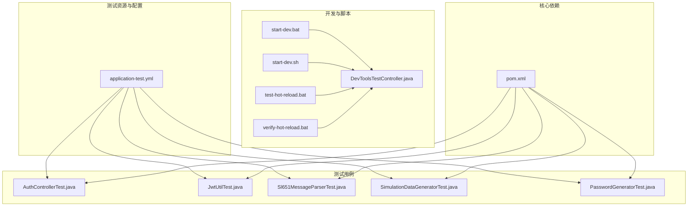
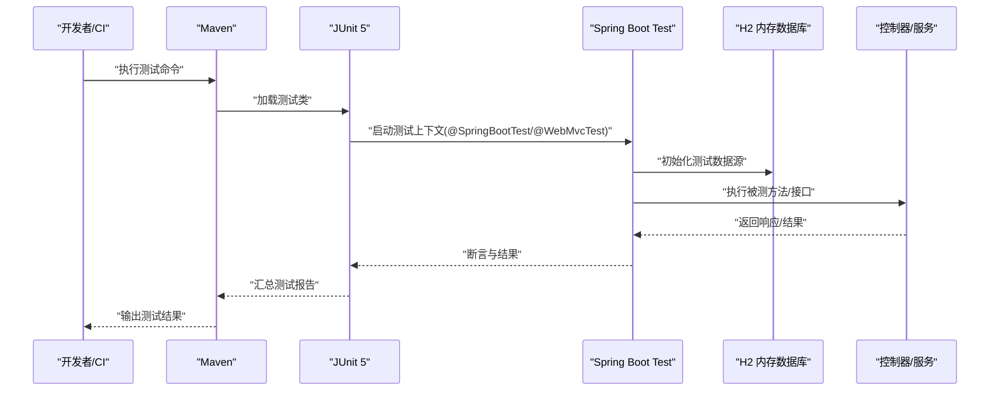
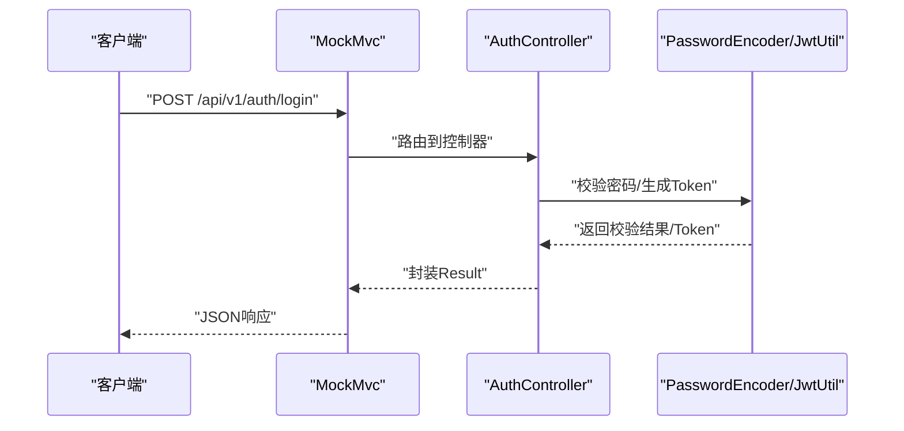
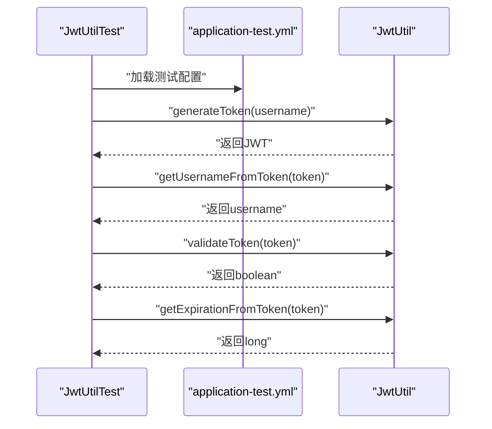
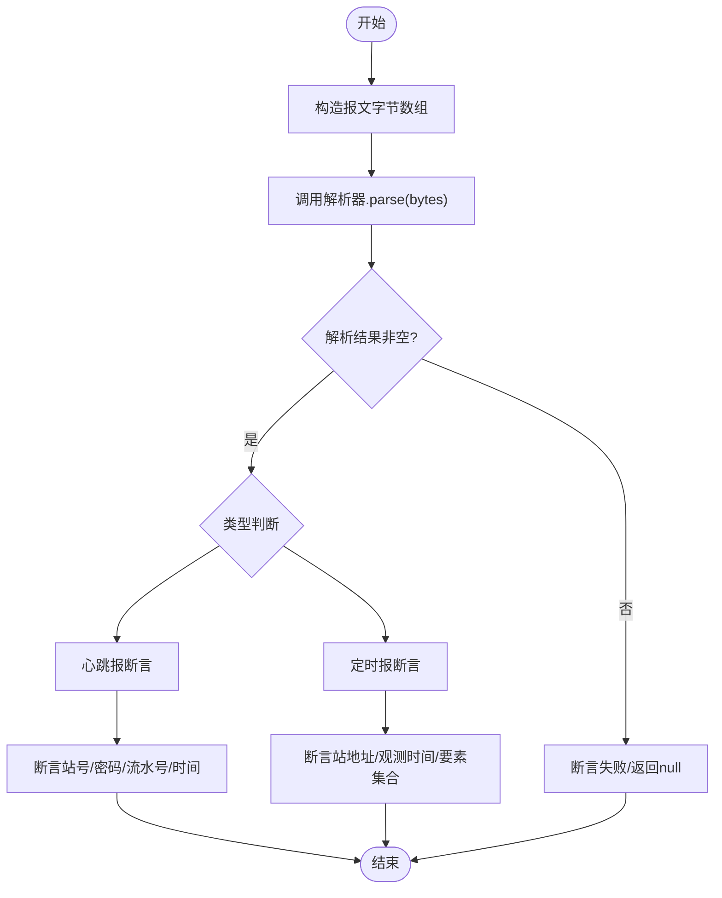
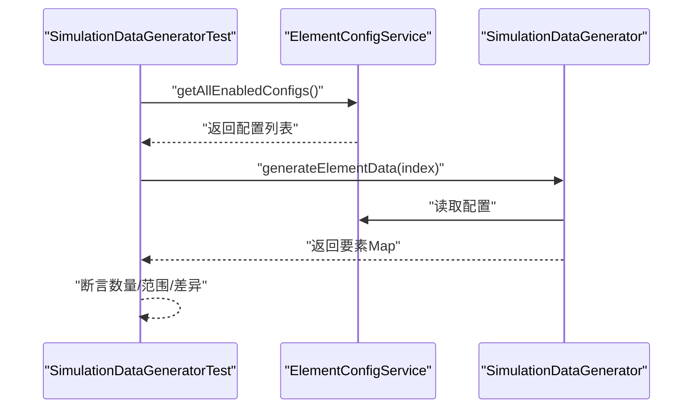
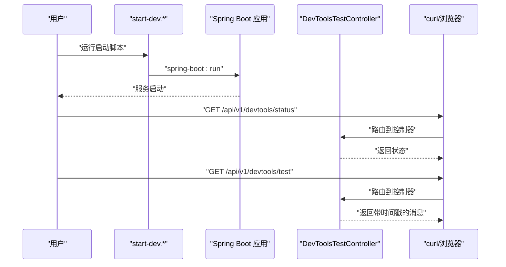
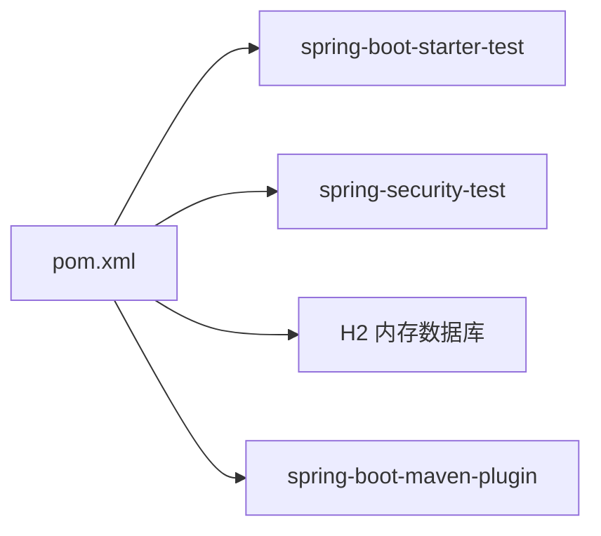

# 测试自动化

<cite>
**本文引用的文件**
- [pom.xml](file://pom.xml)
- [application.yml](file://src/main/resources/application.yml)
- [application-test.yml](file://src/test/resources/application-test.yml)
- [README.md](file://README.md)
- [start-dev.bat](file://start-dev.bat)
- [start-dev.sh](file://start-dev.sh)
- [test-hot-reload.bat](file://test-hot-reload.bat)
- [verify-hot-reload.bat](file://verify-hot-reload.bat)
- [DevToolsTestController.java](file://src/main/java/com/hydro/monitor/modules/controller/DevToolsTestController.java)
- [AuthControllerTest.java](file://src/test/java/com/hydro/monitor/modules/controller/AuthControllerTest.java)
- [JwtUtilTest.java](file://src/test/java/com/hydro/monitor/config/security/JwtUtilTest.java)
- [Sl651MessageParserTest.java](file://src/test/java/com/hydro/monitor/netty/Sl651MessageParserTest.java)
- [SimulationDataGeneratorTest.java](file://src/test/java/com/hydro/monitor/simulation/SimulationDataGeneratorTest.java)
- [PasswordGeneratorTest.java](file://src/test/java/com/hydro/monitor/common/PasswordGeneratorTest.java)
</cite>

## 目录
1. [简介](#简介)
2. [项目结构](#项目结构)
3. [核心组件](#核心组件)
4. [架构总览](#架构总览)
5. [详细组件分析](#详细组件分析)
6. [依赖分析](#依赖分析)
7. [性能考虑](#性能考虑)
8. [故障排除指南](#故障排除指南)
9. [结论](#结论)
10. [附录](#附录)

## 简介
本文件面向“水文监测系统”的测试自动化，聚焦以下目标：
- 测试脚本的编写与组织
- 测试流程的自动化与持续集成配置建议
- 批处理脚本的使用与测试环境自动搭建
- 测试执行自动化与并行化策略
- 测试报告生成、结果分析与失败通知机制
- 测试数据与环境的自动准备
- 测试工具链集成与维护自动化最佳实践
- 故障排除方法与常见问题定位

本项目采用 Spring Boot + Spring MVC Test + JUnit 5 + Mockito + H2 内存数据库进行测试，结合 Maven 插件与批处理脚本实现本地与CI场景下的自动化。

## 项目结构
测试相关的关键位置与职责如下：
- 测试资源与配置
  - 测试配置文件：src/test/resources/application-test.yml，用于切换数据源为 H2 内存库、调整日志级别与 JWT 过期时间等
  - 测试用例目录：src/test/java/com/hydro/monitor 下按模块划分（modules/controller、config/security、netty、simulation、common）
- 开发与测试辅助脚本
  - Windows/Linux 启动脚本：start-dev.bat、start-dev.sh，支持热部署
  - 热部署验证脚本：test-hot-reload.bat、verify-hot-reload.bat
  - 控制器：DevToolsTestController，用于验证热部署
- 核心依赖与构建
  - pom.xml：声明 spring-boot-starter-test、spring-security-test、H2 等测试依赖，并配置 spring-boot-maven-plugin

**图表来源**
- [application-test.yml:1-29](file://src/test/resources/application-test.yml#L1-L29)
- [AuthControllerTest.java:1-114](file://src/test/java/com/hydro/monitor/modules/controller/AuthControllerTest.java#L1-L114)
- [JwtUtilTest.java:1-156](file://src/test/java/com/hydro/monitor/config/security/JwtUtilTest.java#L1-L156)
- [Sl651MessageParserTest.java:1-268](file://src/test/java/com/hydro/monitor/netty/Sl651MessageParserTest.java#L1-L268)
- [SimulationDataGeneratorTest.java:1-112](file://src/test/java/com/hydro/monitor/simulation/SimulationDataGeneratorTest.java#L1-L112)
- [PasswordGeneratorTest.java:1-45](file://src/test/java/com/hydro/monitor/common/PasswordGeneratorTest.java#L1-L45)
- [start-dev.bat:1-28](file://start-dev.bat#L1-L28)
- [start-dev.sh:1-25](file://start-dev.sh#L1-L25)
- [test-hot-reload.bat:1-28](file://test-hot-reload.bat#L1-L28)
- [verify-hot-reload.bat:1-55](file://verify-hot-reload.bat#L1-L55)
- [DevToolsTestController.java:1-64](file://src/main/java/com/hydro/monitor/modules/controller/DevToolsTestController.java#L1-L64)
- [pom.xml:125-152](file://pom.xml#L125-L152)

**章节来源**
- [application-test.yml:1-29](file://src/test/resources/application-test.yml#L1-L29)
- [pom.xml:125-152](file://pom.xml#L125-L152)
- [README.md:1-124](file://README.md#L1-L124)

## 核心组件
- 测试配置与环境
  - application-test.yml 将数据源切换到 H2 内存库，便于快速初始化与回滚；同时降低日志级别以便观察测试输出
- 测试用例类型
  - Web 层测试：AuthControllerTest 使用 @WebMvcTest 与 MockMvc 验证认证接口行为
  - 安全工具测试：JwtUtilTest 使用 @SpringBootTest 与 @ActiveProfiles("test") 验证 JWT 生成、解析与校验
  - 协议解析测试：Sl651MessageParserTest 对纯解析器进行边界与多要素场景验证
  - 模拟数据生成测试：SimulationDataGeneratorTest 验证要素数据生成逻辑与不同终端差异
  - 工具类测试：PasswordGeneratorTest 验证密码编码与匹配
- 开发与测试脚本
  - start-dev.*：统一的本地启动与热部署入口
  - test-hot-reload.bat 与 verify-hot-reload.bat：验证 DevTools 配置与热部署可用性
  - DevToolsTestController：提供热部署状态与测试接口

**章节来源**
- [application-test.yml:1-29](file://src/test/resources/application-test.yml#L1-L29)
- [AuthControllerTest.java:1-114](file://src/test/java/com/hydro/monitor/modules/controller/AuthControllerTest.java#L1-L114)
- [JwtUtilTest.java:1-156](file://src/test/java/com/hydro/monitor/config/security/JwtUtilTest.java#L1-L156)
- [Sl651MessageParserTest.java:1-268](file://src/test/java/com/hydro/monitor/netty/Sl651MessageParserTest.java#L1-L268)
- [SimulationDataGeneratorTest.java:1-112](file://src/test/java/com/hydro/monitor/simulation/SimulationDataGeneratorTest.java#L1-L112)
- [PasswordGeneratorTest.java:1-45](file://src/test/java/com/hydro/monitor/common/PasswordGeneratorTest.java#L1-L45)
- [start-dev.bat:1-28](file://start-dev.bat#L1-L28)
- [start-dev.sh:1-25](file://start-dev.sh#L1-L25)
- [test-hot-reload.bat:1-28](file://test-hot-reload.bat#L1-L28)
- [verify-hot-reload.bat:1-55](file://verify-hot-reload.bat#L1-L55)
- [DevToolsTestController.java:1-64](file://src/main/java/com/hydro/monitor/modules/controller/DevToolsTestController.java#L1-L64)

## 架构总览
下图展示测试自动化在本地与CI中的典型交互路径：Maven 执行测试、JUnit 与 Mockito 驱动测试、H2 提供内存数据库、脚本触发与验证。

**图表来源**
- [pom.xml:125-152](file://pom.xml#L125-L152)
- [application-test.yml:1-29](file://src/test/resources/application-test.yml#L1-L29)
- [AuthControllerTest.java:1-114](file://src/test/java/com/hydro/monitor/modules/controller/AuthControllerTest.java#L1-L114)
- [JwtUtilTest.java:1-156](file://src/test/java/com/hydro/monitor/config/security/JwtUtilTest.java#L1-L156)
- [Sl651MessageParserTest.java:1-268](file://src/test/java/com/hydro/monitor/netty/Sl651MessageParserTest.java#L1-L268)
- [SimulationDataGeneratorTest.java:1-112](file://src/test/java/com/hydro/monitor/simulation/SimulationDataGeneratorTest.java#L1-L112)
- [PasswordGeneratorTest.java:1-45](file://src/test/java/com/hydro/monitor/common/PasswordGeneratorTest.java#L1-L45)

## 详细组件分析

### 认证控制器测试（Web 层）
- 目标：验证登录接口在不同输入下的响应，包括成功、密码错误、用户名错误与请求格式错误
- 方法：使用 @WebMvcTest 与 MockMvc，配合 @MockBean 注入 JwtUtil 与 PasswordEncoder，构造 JSON 请求体并断言响应码与 JSON 字段
- 关键断言：状态码、Result 结构字段、Token 存在性与过期时间存在性

**图表来源**
- [AuthControllerTest.java:1-114](file://src/test/java/com/hydro/monitor/modules/controller/AuthControllerTest.java#L1-L114)

**章节来源**
- [AuthControllerTest.java:1-114](file://src/test/java/com/hydro/monitor/modules/controller/AuthControllerTest.java#L1-L114)

### JWT 工具类测试（集成层）
- 目标：验证 JWT 的生成、解析用户名、有效性校验与过期时间获取
- 方法：@SpringBootTest + @ActiveProfiles("test") 加载真实配置，使用 application-test.yml 中的 JWT 秘钥与过期时间
- 关键断言：Token 结构、用户名一致性、有效性布尔值、过期时间大于当前时间

**图表来源**
- [JwtUtilTest.java:1-156](file://src/test/java/com/hydro/monitor/config/security/JwtUtilTest.java#L1-L156)
- [application-test.yml:14-17](file://src/test/resources/application-test.yml#L14-L17)

**章节来源**
- [JwtUtilTest.java:1-156](file://src/test/java/com/hydro/monitor/config/security/JwtUtilTest.java#L1-L156)
- [application-test.yml:14-17](file://src/test/resources/application-test.yml#L14-L17)

### SL 651 协议解析器测试（纯解析层）
- 目标：验证解析器对心跳报与定时报的解析，覆盖正常、边界与多要素场景
- 方法：构造十六进制字节数组，调用解析器并断言结果类型、站号、流水号、时间、要素集合等
- 关键断言：类型标记、字段取值、要素数量与数值范围

**图表来源**
- [Sl651MessageParserTest.java:1-268](file://src/test/java/com/hydro/monitor/netty/Sl651MessageParserTest.java#L1-L268)

**章节来源**
- [Sl651MessageParserTest.java:1-268](file://src/test/java/com/hydro/monitor/netty/Sl651MessageParserTest.java#L1-L268)

### 模拟数据生成器测试（模拟模块）
- 目标：验证根据要素配置生成合理范围内的数据，且不同终端索引产生差异化数据
- 方法：使用 @ExtendWith(MockitoExtension.class) 与 @Mock 注入 ElementConfigService，断言生成数据大小、范围与差异性
- 关键断言：要素数量、数值范围、不同终端数据差异

**图表来源**
- [SimulationDataGeneratorTest.java:1-112](file://src/test/java/com/hydro/monitor/simulation/SimulationDataGeneratorTest.java#L1-L112)

**章节来源**
- [SimulationDataGeneratorTest.java:1-112](file://src/test/java/com/hydro/monitor/simulation/SimulationDataGeneratorTest.java#L1-L112)

### 密码生成器测试（工具类）
- 目标：验证 BCrypt 编码与匹配逻辑，支持测试数据库中哈希值的验证
- 方法：使用 BCryptPasswordEncoder 对比明文与数据库哈希
- 关键断言：匹配成功、可生成新哈希

**章节来源**
- [PasswordGeneratorTest.java:1-45](file://src/test/java/com/hydro/monitor/common/PasswordGeneratorTest.java#L1-L45)

### 热部署测试与脚本
- 目标：验证 DevTools 热部署是否生效，提供启动、验证与测试脚本
- 方法：start-dev.* 启动应用；DevToolsTestController 提供 /status 与 /test 接口；test-hot-reload.bat 与 verify-hot-reload.bat 辅助验证
- 关键断言：状态接口返回“DevTools已启用”，修改代码后无需重启即可看到变化

**图表来源**
- [start-dev.bat:1-28](file://start-dev.bat#L1-L28)
- [start-dev.sh:1-25](file://start-dev.sh#L1-L25)
- [DevToolsTestController.java:1-64](file://src/main/java/com/hydro/monitor/modules/controller/DevToolsTestController.java#L1-L64)
- [test-hot-reload.bat:1-28](file://test-hot-reload.bat#L1-L28)
- [verify-hot-reload.bat:1-55](file://verify-hot-reload.bat#L1-L55)

**章节来源**
- [start-dev.bat:1-28](file://start-dev.bat#L1-L28)
- [start-dev.sh:1-25](file://start-dev.sh#L1-L25)
- [DevToolsTestController.java:1-64](file://src/main/java/com/hydro/monitor/modules/controller/DevToolsTestController.java#L1-L64)
- [test-hot-reload.bat:1-28](file://test-hot-reload.bat#L1-L28)
- [verify-hot-reload.bat:1-55](file://verify-hot-reload.bat#L1-L55)

## 依赖分析
- 测试依赖
  - spring-boot-starter-test：提供测试所需的基础能力
  - spring-security-test：支持安全相关的测试场景
  - H2：内存数据库，用于快速初始化与隔离测试
- 构建插件
  - spring-boot-maven-plugin：打包与运行 Spring Boot 应用，支持 JVM 参数设置

**图表来源**
- [pom.xml:125-152](file://pom.xml#L125-L152)

**章节来源**
- [pom.xml:125-152](file://pom.xml#L125-L152)

## 性能考虑
- 测试环境隔离：使用 H2 内存数据库，避免磁盘 IO，提升测试速度
- 并行化策略：在 CI 中可按模块拆分测试任务（如 netty、modules、simulation、config），减少串行等待
- 资源复用：测试配置中降低日志级别，减少输出开销；避免在测试中频繁创建昂贵对象
- 依赖注入与 Mock：通过 @MockBean 与 @Mock 注入外部依赖，缩短测试路径

## 故障排除指南
- 热部署未生效
  - 使用 verify-hot-reload.bat 检查 DevTools 依赖与配置是否存在
  - 确认 application.yml 中 devtools 配置项存在
  - 使用 test-hot-reload.bat 触发热部署接口，观察 /status 与 /test 响应
- 测试数据库连接异常
  - 确认 application-test.yml 中 H2 驱动与 URL 配置正确
  - 在 CI 环境中确保 H2 依赖在测试作用域内
- JWT 测试失败
  - 确认 @ActiveProfiles("test") 生效，使用 application-test.yml 中的 JWT 配置
  - 检查生成的 Token 结构与过期时间是否符合预期
- 单元测试断言失败
  - 对照具体测试用例的断言点，确认输入构造与期望值
  - 对于解析器测试，核对十六进制构造是否与协议格式一致

**章节来源**
- [verify-hot-reload.bat:1-55](file://verify-hot-reload.bat#L1-L55)
- [application.yml:34-41](file://src/main/resources/application.yml#L34-L41)
- [application-test.yml:1-29](file://src/test/resources/application-test.yml#L1-L29)
- [JwtUtilTest.java:17-18](file://src/test/java/com/hydro/monitor/config/security/JwtUtilTest.java#L17-L18)
- [Sl651MessageParserTest.java:250-266](file://src/test/java/com/hydro/monitor/netty/Sl651MessageParserTest.java#L250-L266)

## 结论
本项目已具备完善的测试基础：Web 层、安全工具、协议解析、模拟数据与工具类均有针对性测试；测试环境通过 H2 内存库实现快速初始化；开发脚本与热部署控制器保障了本地验证与持续改进。建议在现有基础上进一步完善 CI 流水线（按模块并行）、测试报告生成与失败通知机制，以形成闭环的测试自动化体系。

## 附录
- 快速开始（本地）
  - Windows：双击 start-dev.bat 或在命令行执行
  - Linux/Mac：chmod +x start-dev.sh 后 ./start-dev.sh
- 热部署验证
  - 运行 verify-hot-reload.bat 检查 DevTools 配置
  - 运行 test-hot-reload.bat 触发热部署测试接口
- 测试执行
  - 在项目根目录执行 Maven 测试命令，JUnit 与 Mockito 将自动运行所有测试类

**章节来源**
- [README.md:20-51](file://README.md#L20-L51)
- [start-dev.bat:1-28](file://start-dev.bat#L1-L28)
- [start-dev.sh:1-25](file://start-dev.sh#L1-L25)
- [test-hot-reload.bat:1-28](file://test-hot-reload.bat#L1-L28)
- [verify-hot-reload.bat:1-55](file://verify-hot-reload.bat#L1-L55)