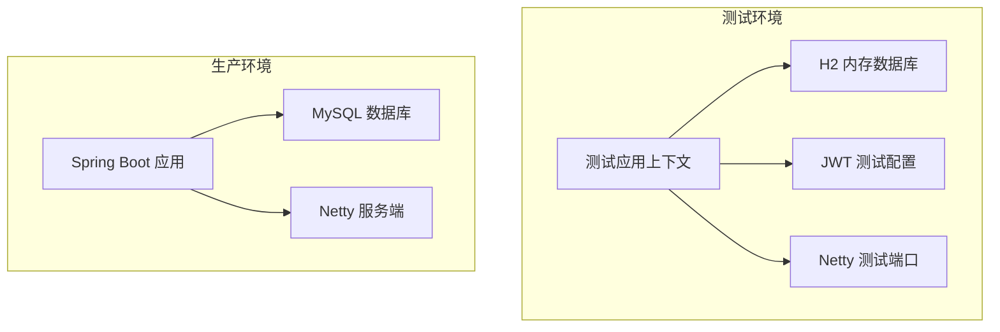
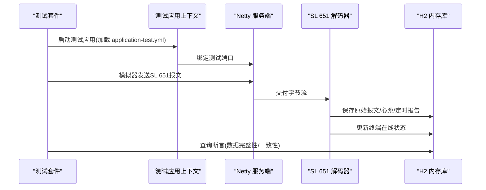
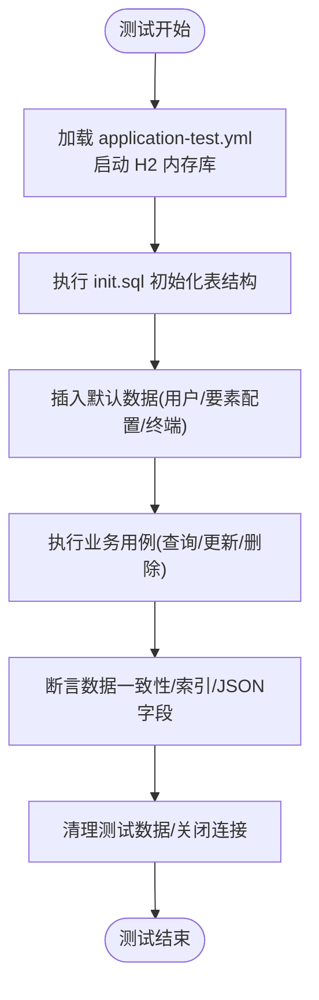
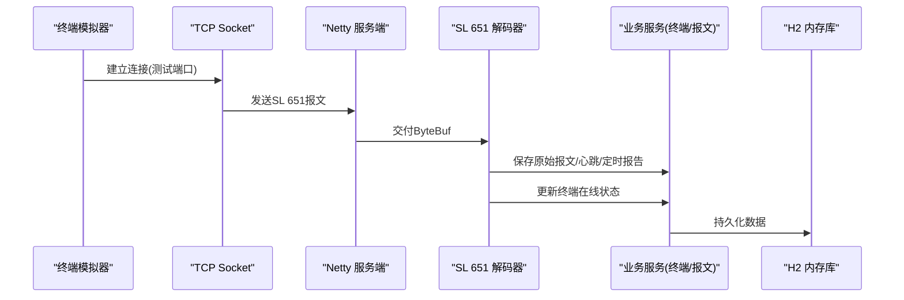
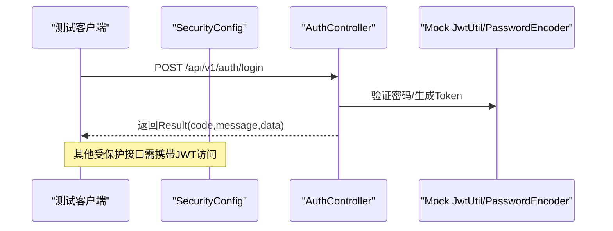
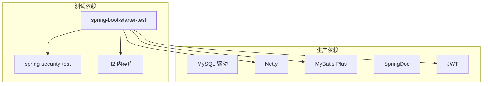

# 集成测试

<cite>
**本文引用的文件**
- [application.yml](file://src/main/resources/application.yml)
- [application-test.yml](file://src/test/resources/application-test.yml)
- [pom.xml](file://pom.xml)
- [HydroMonitorApplication.java](file://src/main/java/com/hydro/monitor/HydroMonitorApplication.java)
- [SecurityConfig.java](file://src/main/java/com/hydro/monitor/config/security/SecurityConfig.java)
- [NettyConfig.java](file://src/main/java/com/hydro/monitor/config/NettyConfig.java)
- [Sl651ProtocolDecoder.java](file://src/main/java/com/hydro/monitor/netty/Sl651ProtocolDecoder.java)
- [SimulationConfig.java](file://src/main/java/com/hydro/monitor/config/SimulationConfig.java)
- [TerminalSimulatorClient.java](file://src/main/java/com/hydro/monitor/simulation/TerminalSimulatorClient.java)
- [TerminalServiceImpl.java](file://src/main/java/com/hydro/monitor/modules/service/impl/TerminalServiceImpl.java)
- [TerminalMapper.java](file://src/main/java/com/hydro/monitor/modules/mapper/TerminalMapper.java)
- [init.sql](file://src/main/resources/db/init.sql)
- [AuthControllerTest.java](file://src/test/java/com/hydro/monitor/modules/controller/AuthControllerTest.java)
- [SystemMonitorControllerTest.java](file://src/test/java/com/hydro/monitor/modules/controller/SystemMonitorControllerTest.java)
- [README.md](file://README.md)
</cite>

## 目录
1. [简介](#简介)
2. [项目结构](#项目结构)
3. [核心组件](#核心组件)
4. [架构总览](#架构总览)
5. [详细组件分析](#详细组件分析)
6. [依赖分析](#依赖分析)
7. [性能考虑](#性能考虑)
8. [故障排查指南](#故障排查指南)
9. [结论](#结论)
10. [附录](#附录)

## 简介
本文件面向水文监测系统的集成测试，聚焦多组件协同工作的测试策略与测试环境配置，覆盖数据库集成测试、网络通信测试与第三方服务集成测试（如JWT鉴权）。文档同时阐述测试数据准备、测试环境隔离、测试执行协调机制，以及测试替身与测试数据库管理、测试数据清理策略，并给出自动化流程、结果验证与回归测试方案，帮助团队建立稳定可靠的集成测试体系。

## 项目结构
系统采用Spring Boot + Netty架构，核心模块包括：
- Web层：REST API控制器
- 安全层：基于JWT的Spring Security过滤链
- 网络层：基于Netty的SL 651协议接入
- 业务层：终端、要素、报文、定时报告等服务
- 数据层：MyBatis-Plus + MySQL（生产）或H2内存数据库（测试）
- 模拟上报：终端模拟器通过TCP向Netty发送SL 651报文

**图表来源**
- [application.yml:1-86](file://src/main/resources/application.yml#L1-L86)
- [application-test.yml:1-29](file://src/test/resources/application-test.yml#L1-L29)
- [pom.xml:125-144](file://pom.xml#L125-L144)

**章节来源**
- [application.yml:1-86](file://src/main/resources/application.yml#L1-L86)
- [application-test.yml:1-29](file://src/test/resources/application-test.yml#L1-L29)
- [pom.xml:125-144](file://pom.xml#L125-L144)
- [README.md:85-106](file://README.md#L85-L106)

## 核心组件
- 应用启动与端口配置：HTTP 8080、Netty 9000；测试环境端口分离以避免冲突
- 安全配置：无状态JWT过滤链，开放认证接口与API文档路径
- 网络协议：Netty解码器负责SL 651报文解析与持久化
- 业务服务：终端服务负责在线状态更新与自动创建
- 测试配置：H2内存库、测试JWT密钥与端口、日志级别

**章节来源**
- [HydroMonitorApplication.java:15-34](file://src/main/java/com/hydro/monitor/HydroMonitorApplication.java#L15-L34)
- [application.yml:1-86](file://src/main/resources/application.yml#L1-L86)
- [application-test.yml:1-29](file://src/test/resources/application-test.yml#L1-L29)
- [SecurityConfig.java:33-52](file://src/main/java/com/hydro/monitor/config/security/SecurityConfig.java#L33-L52)
- [NettyConfig.java:26-86](file://src/main/java/com/hydro/monitor/config/NettyConfig.java#L26-L86)
- [Sl651ProtocolDecoder.java:35-89](file://src/main/java/com/hydro/monitor/netty/Sl651ProtocolDecoder.java#L35-L89)
- [TerminalServiceImpl.java:175-200](file://src/main/java/com/hydro/monitor/modules/service/impl/TerminalServiceImpl.java#L175-L200)

## 架构总览
下图展示集成测试的关键交互：测试应用加载测试配置，启动Netty服务端，使用H2内存数据库，通过模拟器发送SL 651报文，解码器解析并持久化，最终验证数据库与业务状态。

**图表来源**
- [application-test.yml:1-29](file://src/test/resources/application-test.yml#L1-L29)
- [NettyConfig.java:40-70](file://src/main/java/com/hydro/monitor/config/NettyConfig.java#L40-L70)
- [Sl651ProtocolDecoder.java:53-89](file://src/main/java/com/hydro/monitor/netty/Sl651ProtocolDecoder.java#L53-L89)
- [TerminalServiceImpl.java:175-200](file://src/main/java/com/hydro/monitor/modules/service/impl/TerminalServiceImpl.java#L175-L200)

## 详细组件分析

### 数据库集成测试
- 测试数据库：H2内存库，测试期间自动初始化schema与基础数据
- 初始化脚本：包含用户、要素配置、终端等表结构与默认数据
- 断言策略：通过Mapper/Service读取并校验数据一致性、索引有效性与JSON字段正确性

**图表来源**
- [application-test.yml:3-7](file://src/test/resources/application-test.yml#L3-L7)
- [init.sql:1-93](file://src/main/resources/db/init.sql#L1-L93)

**章节来源**
- [application-test.yml:1-29](file://src/test/resources/application-test.yml#L1-L29)
- [init.sql:1-93](file://src/main/resources/db/init.sql#L1-L93)
- [TerminalMapper.java:12-14](file://src/main/java/com/hydro/monitor/modules/mapper/TerminalMapper.java#L12-L14)

### 网络通信测试
- 测试端口：Netty测试端口与HTTP端口分离，避免冲突
- 模拟器：TerminalSimulatorClient通过TCP直连Netty服务端，周期性发送SL 651报文
- 解码器：Sl651ProtocolDecoder解析报文、保存原始记录、持久化心跳/定时报告、更新终端在线状态

**图表来源**
- [application-test.yml:19-22](file://src/test/resources/application-test.yml#L19-L22)
- [TerminalSimulatorClient.java:151-191](file://src/main/java/com/hydro/monitor/simulation/TerminalSimulatorClient.java#L151-L191)
- [Sl651ProtocolDecoder.java:53-89](file://src/main/java/com/hydro/monitor/netty/Sl651ProtocolDecoder.java#L53-L89)
- [TerminalServiceImpl.java:175-200](file://src/main/java/com/hydro/monitor/modules/service/impl/TerminalServiceImpl.java#L175-L200)

**章节来源**
- [application-test.yml:19-22](file://src/test/resources/application-test.yml#L19-L22)
- [TerminalSimulatorClient.java:56-90](file://src/main/java/com/hydro/monitor/simulation/TerminalSimulatorClient.java#L56-L90)
- [Sl651ProtocolDecoder.java:53-89](file://src/main/java/com/hydro/monitor/netty/Sl651ProtocolDecoder.java#L53-L89)
- [TerminalServiceImpl.java:175-200](file://src/main/java/com/hydro/monitor/modules/service/impl/TerminalServiceImpl.java#L175-L200)

### 第三方服务集成测试（JWT）
- 测试JWT：测试配置使用较短过期时间与专用密钥，便于测试场景下的令牌生成与验证
- 安全过滤链：认证接口放行，其余接口需JWT认证
- 控制器测试：使用@WebMvcTest与MockBean模拟JWT工具与密码编码器，验证HTTP响应结构与状态码

**图表来源**
- [application-test.yml:14-17](file://src/test/resources/application-test.yml#L14-L17)
- [SecurityConfig.java:33-52](file://src/main/java/com/hydro/monitor/config/security/SecurityConfig.java#L33-L52)
- [AuthControllerTest.java:51-69](file://src/test/java/com/hydro/monitor/modules/controller/AuthControllerTest.java#L51-L69)

**章节来源**
- [application-test.yml:14-17](file://src/test/resources/application-test.yml#L14-L17)
- [SecurityConfig.java:33-52](file://src/main/java/com/hydro/monitor/config/security/SecurityConfig.java#L33-L52)
- [AuthControllerTest.java:27-114](file://src/test/java/com/hydro/monitor/modules/controller/AuthControllerTest.java#L27-L114)

### 测试数据准备与清理
- 准备：通过init.sql在测试启动时初始化数据库schema与默认数据
- 清理：建议在测试类生命周期内使用事务回滚或删除测试数据，避免污染后续用例
- 隔离：每个测试使用独立命名空间或临时schema（H2支持内存库隔离）

**章节来源**
- [init.sql:1-93](file://src/main/resources/db/init.sql#L1-L93)
- [application-test.yml:3-7](file://src/test/resources/application-test.yml#L3-L7)

### 测试替身与桩
- 控制器层：使用@WebMvcTest与@MockBean替换真实JWT工具与密码编码器，专注于HTTP契约验证
- 网络层：使用真实Netty服务端与模拟器，确保协议解析与持久化链路完整

**章节来源**
- [AuthControllerTest.java:27-46](file://src/test/java/com/hydro/monitor/modules/controller/AuthControllerTest.java#L27-L46)
- [TerminalSimulatorClient.java:151-191](file://src/main/java/com/hydro/monitor/simulation/TerminalSimulatorClient.java#L151-L191)

### 测试环境隔离与执行协调
- 端口隔离：生产HTTP 8080、Netty 9000；测试HTTP与Netty使用不同端口
- 配置隔离：application-test.yml覆盖数据源、JWT与Netty端口
- 启动协调：测试应用启动后，测试套件再启动模拟器发送报文，解码器异步持久化

**章节来源**
- [application.yml:1-86](file://src/main/resources/application.yml#L1-L86)
- [application-test.yml:1-29](file://src/test/resources/application-test.yml#L1-L29)
- [HydroMonitorApplication.java:15-34](file://src/main/java/com/hydro/monitor/HydroMonitorApplication.java#L15-L34)

### 自动化流程与回归测试
- 自动化：Maven集成spring-boot-starter-test与H2，测试生命周期自动管理
- 回归：基于init.sql的初始数据集，重复执行关键路径用例，确保新增改动不影响历史行为
- 结果验证：结合HTTP响应结构、数据库断言与日志输出进行多维度验证

**章节来源**
- [pom.xml:125-144](file://pom.xml#L125-L144)
- [init.sql:43-47](file://src/main/resources/db/init.sql#L43-L47)

## 依赖分析
- 测试依赖：spring-boot-starter-test、spring-security-test、H2内存库
- 生产依赖：MySQL驱动、Netty、MyBatis-Plus、SpringDoc、JWT等
- 配置依赖：application.yml与application-test.yml分别定义运行与测试配置

**图表来源**
- [pom.xml:125-144](file://pom.xml#L125-L144)

**章节来源**
- [pom.xml:125-144](file://pom.xml#L125-L144)

## 性能考虑
- 异步持久化：解码器对原始报文保存采用异步任务，避免阻塞Netty线程
- 端口分离：测试与生产端口分离，减少竞争与抖动
- 内存数据库：H2内存库提升测试执行速度，降低I/O开销
- 日志级别：测试环境降低日志级别，减少输出噪声

**章节来源**
- [Sl651ProtocolDecoder.java:234-244](file://src/main/java/com/hydro/monitor/netty/Sl651ProtocolDecoder.java#L234-L244)
- [application-test.yml:24-28](file://src/test/resources/application-test.yml#L24-L28)

## 故障排查指南
- 端口冲突：确认测试端口与生产端口未冲突；必要时调整application-test.yml中的netty.server.port
- 数据库连接：检查H2内存库URL与凭据；确保init.sql在测试启动时执行
- JWT问题：核对测试JWT密钥与过期时间；确保SecurityConfig放行认证接口
- 报文解析：关注解码器日志输出，定位原始报文保存与要素映射异常
- 终端状态：若终端未在线，检查解码器是否调用终端服务更新在线状态

**章节来源**
- [application-test.yml:19-22](file://src/test/resources/application-test.yml#L19-L22)
- [SecurityConfig.java:41-47](file://src/main/java/com/hydro/monitor/config/security/SecurityConfig.java#L41-L47)
- [Sl651ProtocolDecoder.java:175-182](file://src/main/java/com/hydro/monitor/netty/Sl651ProtocolDecoder.java#L175-L182)
- [TerminalServiceImpl.java:175-200](file://src/main/java/com/hydro/monitor/modules/service/impl/TerminalServiceImpl.java#L175-L200)

## 结论
通过将测试配置、内存数据库、网络协议与业务服务整合，本系统实现了可重复、可隔离且高效的集成测试方案。测试端口与配置的隔离、异步持久化与测试替身的使用，共同保障了测试稳定性与可维护性。建议持续完善回归用例与自动化流程，确保系统演进过程中的质量与一致性。

## 附录
- 快速开始与端口说明参见项目根目录README
- 数据库初始化脚本位于src/main/resources/db/init.sql

**章节来源**
- [README.md:53-58](file://README.md#L53-L58)
- [init.sql:1-93](file://src/main/resources/db/init.sql#L1-L93)