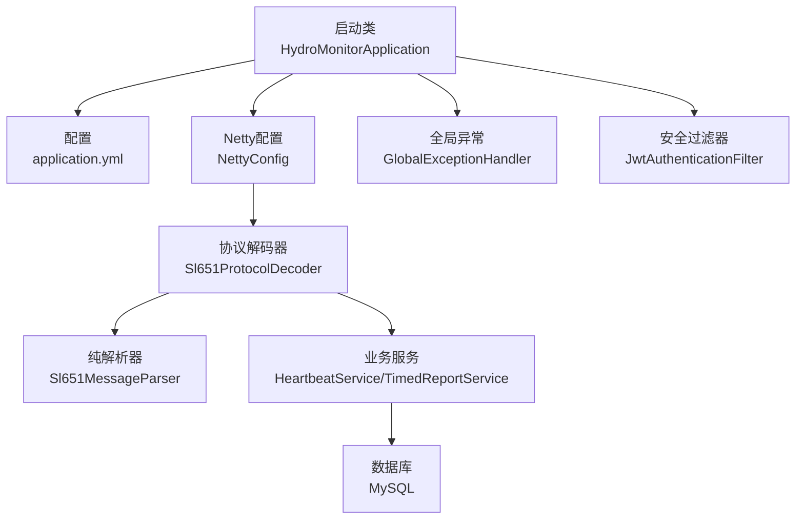
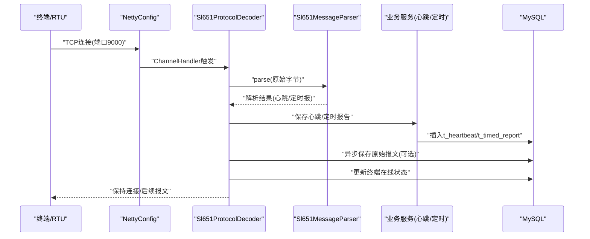
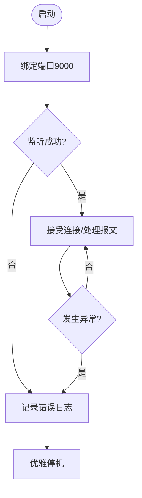
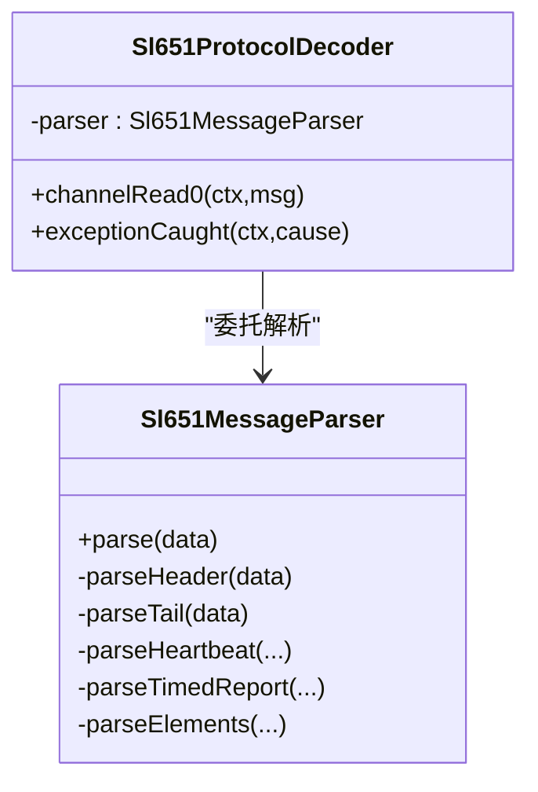
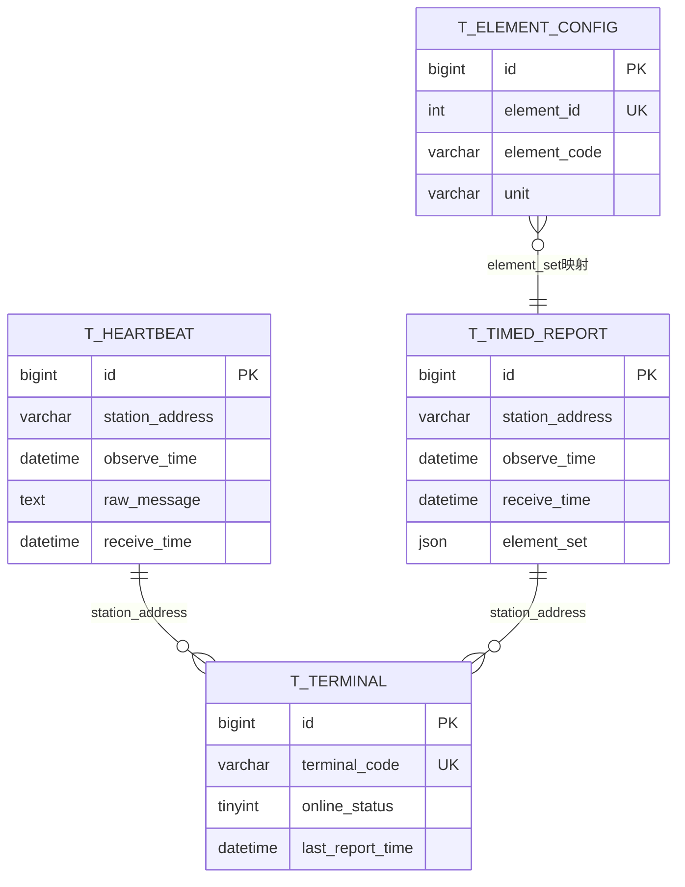
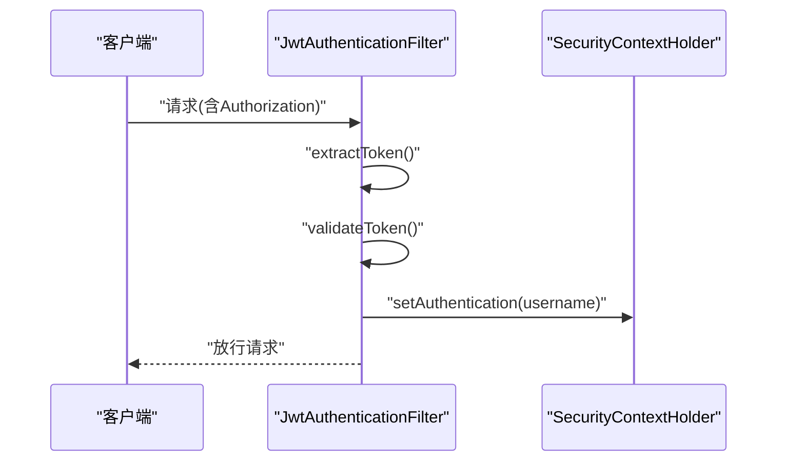
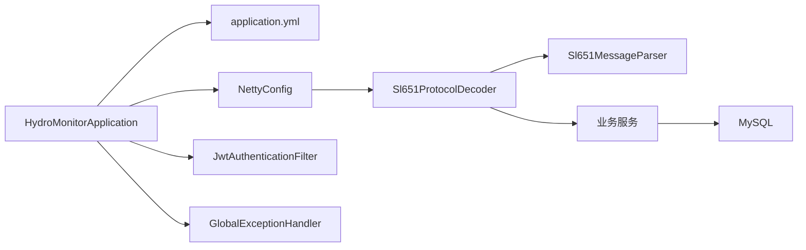
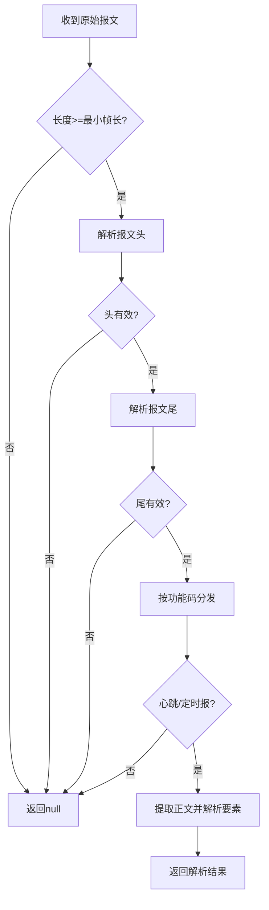

# 故障排查

<cite>
**本文引用的文件**
- [HydroMonitorApplication.java](file://src/main/java/com/hydro/monitor/HydroMonitorApplication.java)
- [application.yml](file://src/main/resources/application.yml)
- [GlobalExceptionHandler.java](file://src/main/java/com/hydro/monitor/common/GlobalExceptionHandler.java)
- [NettyConfig.java](file://src/main/java/com/hydro/monitor/config/NettyConfig.java)
- [Sl651ProtocolDecoder.java](file://src/main/java/com/hydro/monitor/netty/Sl651ProtocolDecoder.java)
- [Sl651MessageParser.java](file://src/main/java/com/hydro/monitor/netty/Sl651MessageParser.java)
- [JwtAuthenticationFilter.java](file://src/main/java/com/hydro/monitor/config/security/JwtAuthenticationFilter.java)
- [TerminalServiceImpl.java](file://src/main/java/com/hydro/monitor/modules/service/impl/TerminalServiceImpl.java)
- [TerminalMapper.java](file://src/main/java/com/hydro/monitor/modules/mapper/TerminalMapper.java)
- [Result.java](file://src/main/java/com/hydro/monitor/common/Result.java)
- [Sl651MessageParserTest.java](file://src/test/java/com/hydro/monitor/netty/Sl651MessageParserTest.java)
- [init.sql](file://src/main/resources/db/init.sql)
- [README.md](file://README.md)
- [check-raw-message.bat](file://check-raw-message.bat)
</cite>

## 目录
1. [简介](#简介)
2. [项目结构](#项目结构)
3. [核心组件](#核心组件)
4. [架构总览](#架构总览)
5. [详细组件分析](#详细组件分析)
6. [依赖分析](#依赖分析)
7. [性能考虑](#性能考虑)
8. [故障排查指南](#故障排查指南)
9. [结论](#结论)
10. [附录](#附录)

## 简介
本指南面向水文监测系统的运维与开发人员，聚焦于系统启动失败、数据库连接异常、网络通信问题、性能瓶颈、协议解析错误、Netty连接问题、数据库操作异常、日志分析方法、应急响应与恢复、备份与回滚等关键场景。文档结合代码与配置，提供可落地的诊断步骤、根因定位技巧与优化建议。

## 项目结构
系统采用Spring Boot + Netty + MyBatis-Plus架构，核心模块包括：
- 启动入口与配置：启动类、应用配置、全局异常处理
- 网络层：Netty服务端配置与协议解码器
- 协议解析：SL 651-2014纯解析器与桥接解码器
- 业务层：终端、心跳、定时报、要素配置等服务与映射
- 安全：JWT认证过滤器
- 数据库：初始化脚本与连接配置

**图表来源**
- [HydroMonitorApplication.java:12-34](file://src/main/java/com/hydro/monitor/HydroMonitorApplication.java#L12-L34)
- [application.yml:1-86](file://src/main/resources/application.yml#L1-L86)
- [NettyConfig.java:23-86](file://src/main/java/com/hydro/monitor/config/NettyConfig.java#L23-L86)
- [Sl651ProtocolDecoder.java:35-89](file://src/main/java/com/hydro/monitor/netty/Sl651ProtocolDecoder.java#L35-L89)
- [Sl651MessageParser.java:24-126](file://src/main/java/com/hydro/monitor/netty/Sl651MessageParser.java#L24-L126)
- [GlobalExceptionHandler.java:15-57](file://src/main/java/com/hydro/monitor/common/GlobalExceptionHandler.java#L15-L57)
- [JwtAuthenticationFilter.java:24-74](file://src/main/java/com/hydro/monitor/config/security/JwtAuthenticationFilter.java#L24-L74)

**章节来源**
- [README.md:85-106](file://README.md#L85-L106)
- [application.yml:1-86](file://src/main/resources/application.yml#L1-L86)

## 核心组件
- 启动类与端口：负责应用启动与端口输出，便于快速确认服务状态
- Netty配置：异步启动服务端，绑定端口，优雅停机
- 协议解码器：接收字节流，委托纯解析器，持久化原始报文与业务数据
- 纯解析器：无状态、无副作用，严格按帧结构解析心跳与定时报
- 全局异常处理：统一捕获运行时异常、权限拒绝与通用异常
- JWT过滤器：从请求头提取令牌并注入认证上下文
- 终端服务：维护终端在线状态与自动创建缺失终端记录

**章节来源**
- [HydroMonitorApplication.java:15-34](file://src/main/java/com/hydro/monitor/HydroMonitorApplication.java#L15-L34)
- [NettyConfig.java:40-85](file://src/main/java/com/hydro/monitor/config/NettyConfig.java#L40-L85)
- [Sl651ProtocolDecoder.java:53-89](file://src/main/java/com/hydro/monitor/netty/Sl651ProtocolDecoder.java#L53-L89)
- [Sl651MessageParser.java:66-126](file://src/main/java/com/hydro/monitor/netty/Sl651MessageParser.java#L66-L126)
- [GlobalExceptionHandler.java:25-56](file://src/main/java/com/hydro/monitor/common/GlobalExceptionHandler.java#L25-L56)
- [JwtAuthenticationFilter.java:31-59](file://src/main/java/com/hydro/monitor/config/security/JwtAuthenticationFilter.java#L31-L59)
- [TerminalServiceImpl.java:175-200](file://src/main/java/com/hydro/monitor/modules/service/impl/TerminalServiceImpl.java#L175-L200)

## 架构总览
系统通过Netty接收SL 651-2014报文，解码器将原始字节转为结构化结果，随后持久化到数据库，并更新终端在线状态。HTTP接口由Spring MVC提供，配合JWT鉴权与全局异常处理。

**图表来源**
- [NettyConfig.java:47-69](file://src/main/java/com/hydro/monitor/config/NettyConfig.java#L47-L69)
- [Sl651ProtocolDecoder.java:53-89](file://src/main/java/com/hydro/monitor/netty/Sl651ProtocolDecoder.java#L53-L89)
- [Sl651MessageParser.java:66-126](file://src/main/java/com/hydro/monitor/netty/Sl651MessageParser.java#L66-L126)
- [init.sql:6-29](file://src/main/resources/db/init.sql#L6-L29)

## 详细组件分析

### Netty服务端与连接问题诊断
- 启动流程：CommandLineRunner在Spring容器启动后异步绑定端口，记录启动日志；异常时记录错误并优雅关闭
- 连接异常：检查端口占用、防火墙、客户端连接超时；关注LoggingHandler输出
- 优雅停机：PreDestroy确保EventLoopGroup释放资源

**图表来源**
- [NettyConfig.java:40-85](file://src/main/java/com/hydro/monitor/config/NettyConfig.java#L40-L85)

**章节来源**
- [NettyConfig.java:40-85](file://src/main/java/com/hydro/monitor/config/NettyConfig.java#L40-L85)

### 协议解析器与报文处理
- 纯解析器：无状态、无副作用，严格按帧头/正文/帧尾解析，支持心跳(0x2F)与定时报(0x32)
- 解码器桥接：接收ByteBuf，保存原始报文，委托解析器，按结果类型持久化并更新终端状态
- 异常处理：解码器捕获通道异常并关闭连接，避免资源泄露

**图表来源**
- [Sl651MessageParser.java:24-126](file://src/main/java/com/hydro/monitor/netty/Sl651MessageParser.java#L24-L126)
- [Sl651ProtocolDecoder.java:35-89](file://src/main/java/com/hydro/monitor/netty/Sl651ProtocolDecoder.java#L35-L89)

**章节来源**
- [Sl651MessageParser.java:66-126](file://src/main/java/com/hydro/monitor/netty/Sl651MessageParser.java#L66-L126)
- [Sl651ProtocolDecoder.java:53-89](file://src/main/java/com/hydro/monitor/netty/Sl651ProtocolDecoder.java#L53-L89)

### 数据库与持久化
- 表结构：心跳表、定时表、要素配置表、终端表、用户表
- 连接配置：驱动、URL、账号密码、时区、MyBatis-Plus驼峰映射与日志
- 原始报文：可选异步落库，便于溯源与二次分析

**图表来源**
- [init.sql:6-92](file://src/main/resources/db/init.sql#L6-L92)

**章节来源**
- [init.sql:6-92](file://src/main/resources/db/init.sql#L6-L92)
- [application.yml:8-33](file://src/main/resources/application.yml#L8-L33)

### 安全与认证
- JWT过滤器：从Authorization头提取Bearer Token，校验后注入SecurityContext
- 全局异常：对权限拒绝与运行时异常进行统一响应

**图表来源**
- [JwtAuthenticationFilter.java:31-59](file://src/main/java/com/hydro/monitor/config/security/JwtAuthenticationFilter.java#L31-L59)
- [GlobalExceptionHandler.java:38-43](file://src/main/java/com/hydro/monitor/common/GlobalExceptionHandler.java#L38-L43)

**章节来源**
- [JwtAuthenticationFilter.java:31-59](file://src/main/java/com/hydro/monitor/config/security/JwtAuthenticationFilter.java#L31-L59)
- [GlobalExceptionHandler.java:25-43](file://src/main/java/com/hydro/monitor/common/GlobalExceptionHandler.java#L25-L43)

## 依赖分析
- 启动类依赖Spring Boot自动装配，加载配置与组件
- NettyConfig依赖NettyChannelInitializer，异步启动服务端
- 解码器依赖纯解析器与业务服务，形成“网络-解析-存储”的链路
- 终端服务依赖Mapper进行读写，自动创建缺失终端

**图表来源**
- [HydroMonitorApplication.java:12-34](file://src/main/java/com/hydro/monitor/HydroMonitorApplication.java#L12-L34)
- [NettyConfig.java:23-86](file://src/main/java/com/hydro/monitor/config/NettyConfig.java#L23-L86)
- [Sl651ProtocolDecoder.java:35-89](file://src/main/java/com/hydro/monitor/netty/Sl651ProtocolDecoder.java#L35-L89)
- [Sl651MessageParser.java:24-126](file://src/main/java/com/hydro/monitor/netty/Sl651MessageParser.java#L24-L126)
- [GlobalExceptionHandler.java:15-57](file://src/main/java/com/hydro/monitor/common/GlobalExceptionHandler.java#L15-L57)
- [JwtAuthenticationFilter.java:24-74](file://src/main/java/com/hydro/monitor/config/security/JwtAuthenticationFilter.java#L24-L74)

**章节来源**
- [application.yml:1-86](file://src/main/resources/application.yml#L1-L86)

## 性能考虑
- Netty线程模型：Boss/Worker线程分离，合理设置SO_BACKLOG与SO_KEEPALIVE
- 异步落库：原始报文异步保存，避免阻塞事件循环
- 解析器无状态：可并发复用，减少锁竞争
- 数据库索引：按站号与时间建立索引，提升查询性能
- 日志级别：生产环境降低日志级别，避免I/O成为瓶颈

[本节为通用指导，无需具体文件引用]

## 故障排查指南

### 启动失败
- 端口冲突：确认8080(HTTP)与9000(Netty)未被占用
- 数据库连接：核对application.yml中的数据库URL、用户名、密码与时区
- DevTools状态：启动日志会输出DevTools启用状态，便于判断热部署是否生效
- 优雅停机：若异常退出，检查NettyConfig的shutdown日志

**章节来源**
- [HydroMonitorApplication.java:15-34](file://src/main/java/com/hydro/monitor/HydroMonitorApplication.java#L15-L34)
- [application.yml:8-13](file://src/main/resources/application.yml#L8-L13)
- [NettyConfig.java:75-85](file://src/main/java/com/hydro/monitor/config/NettyConfig.java#L75-L85)

### 数据库连接异常
- 连接参数：driver-class-name、url、username、password
- 时区与字符集：serverTimezone与charset需与数据库一致
- MyBatis-Plus：开启日志StdOutImpl便于观察SQL
- 初始化脚本：确保数据库与表已创建

**章节来源**
- [application.yml:8-33](file://src/main/resources/application.yml#L8-L33)
- [init.sql:1-92](file://src/main/resources/db/init.sql#L1-L92)

### 网络通信问题
- Netty端口：确认9000端口监听成功
- 客户端连通性：telnet/nc测试端口可达性
- 日志：NettyConfig与解码器均记录关键日志，便于定位
- 异常处理：解码器exceptionCaught会记录并关闭异常通道

**章节来源**
- [NettyConfig.java:47-69](file://src/main/java/com/hydro/monitor/config/NettyConfig.java#L47-L69)
- [Sl651ProtocolDecoder.java:272-276](file://src/main/java/com/hydro/monitor/netty/Sl651ProtocolDecoder.java#L272-L276)

### 协议解析错误
- 报文长度：小于最小帧长直接返回null
- 帧头/帧尾：起始符、正文起始标识、结束符与CRC校验
- 功能码：未知功能码返回null
- 要素解析：数据定义位决定字节数与小数位
- 单元测试：提供多种正常与异常场景，可对照定位问题

**图表来源**
- [Sl651MessageParser.java:73-126](file://src/main/java/com/hydro/monitor/netty/Sl651MessageParser.java#L73-L126)

**章节来源**
- [Sl651MessageParser.java:66-126](file://src/main/java/com/hydro/monitor/netty/Sl651MessageParser.java#L66-L126)
- [Sl651MessageParserTest.java:30-100](file://src/test/java/com/hydro/monitor/netty/Sl651MessageParserTest.java#L30-L100)

### Netty连接问题诊断
- 启动日志：确认端口绑定与监听成功
- 异常通道：exceptionCaught记录异常并关闭连接
- 优雅停机：PreDestroy释放EventLoopGroup
- 建议：开启LoggingHandler以观察握手与数据交互

**章节来源**
- [NettyConfig.java:47-85](file://src/main/java/com/hydro/monitor/config/NettyConfig.java#L47-L85)
- [Sl651ProtocolDecoder.java:272-276](file://src/main/java/com/hydro/monitor/netty/Sl651ProtocolDecoder.java#L272-L276)

### 数据库操作异常
- 心跳/定时入库：解码器内try-catch记录错误，不影响整体流程
- 原始报文：异步保存，异常日志明确站点与功能码
- 终端状态：缺失终端自动创建，避免解析中断
- 建议：检查数据库连接池配置与慢查询日志

**章节来源**
- [Sl651ProtocolDecoder.java:112-118](file://src/main/java/com/hydro/monitor/netty/Sl651ProtocolDecoder.java#L112-L118)
- [Sl651ProtocolDecoder.java:175-181](file://src/main/java/com/hydro/monitor/netty/Sl651ProtocolDecoder.java#L175-L181)
- [Sl651ProtocolDecoder.java:234-244](file://src/main/java/com/hydro/monitor/netty/Sl651ProtocolDecoder.java#L234-L244)
- [TerminalServiceImpl.java:186-199](file://src/main/java/com/hydro/monitor/modules/service/impl/TerminalServiceImpl.java#L186-L199)

### 错误日志分析方法
- 日志级别：root/INFO，com.hydro.monitor/DEBUG，便于区分系统与业务日志
- 异常堆栈：GlobalExceptionHandler统一捕获并记录，便于定位业务异常与权限问题
- Netty异常：exceptionCaught记录通道异常，结合报文头信息快速定位
- 建议：结合单元测试用例，比对期望行为与实际日志

**章节来源**
- [application.yml:62-77](file://src/main/resources/application.yml#L62-L77)
- [GlobalExceptionHandler.java:25-56](file://src/main/java/com/hydro/monitor/common/GlobalExceptionHandler.java#L25-L56)
- [Sl651ProtocolDecoder.java:272-276](file://src/main/java/com/hydro/monitor/netty/Sl651ProtocolDecoder.java#L272-L276)

### 系统性能调优建议
- Netty参数：调整SO_BACKLOG、读写超时、线程数
- 异步化：继续强化异步落库与异步任务
- 缓存：对要素配置等只读数据做缓存
- 监控：接入指标监控，关注连接数、队列长度、解析耗时

[本节为通用指导，无需具体文件引用]

### 内存泄漏检测与GC优化
- GC日志：生产环境开启GC日志，观察Full GC频率与停顿
- 对象池：Netty ByteBuf与Jackson ObjectMapper复用
- 大对象：避免在事件循环中构造大对象，必要时异步处理
- 建议：结合JVM参数与GC策略进行压测与调优

[本节为通用指导，无需具体文件引用]

### 应急响应流程
- 立即确认：服务进程、端口监听、数据库连通性
- 快速隔离：停止异常上游流量，限制重试
- 降级策略：关闭非关键功能（如原始报文异步入库），保证核心解析与入库
- 回滚与修复：回滚最近变更，修复配置或代码缺陷
- 验证恢复：通过单元测试与集成测试验证修复

[本节为通用指导，无需具体文件引用]

### 故障恢复与数据备份
- 备份策略：定期导出数据库，保留schema与数据
- 恢复流程：停止服务、导入备份、校验完整性、启动服务
- 原始报文：可通过脚本检查表是否存在与数据量，辅助定位问题

**章节来源**
- [check-raw-message.bat:8-43](file://check-raw-message.bat#L8-L43)

## 结论
本指南围绕启动、网络、协议、数据库、日志与性能等维度，提供了可操作的诊断路径与优化建议。建议在生产环境中：
- 明确日志级别与轮转策略
- 严格验证协议解析边界条件
- 保障数据库高可用与索引优化
- 建立完善的监控与应急流程

[本节为总结，无需具体文件引用]

## 附录

### 常见错误码与含义
- 500：系统内部错误（通用异常）
- 403：权限拒绝（鉴权失败）

**章节来源**
- [GlobalExceptionHandler.java:25-56](file://src/main/java/com/hydro/monitor/common/GlobalExceptionHandler.java#L25-L56)
- [Result.java:58-77](file://src/main/java/com/hydro/monitor/common/Result.java#L58-L77)

### 关键配置项速查
- 服务器端口：server.port
- 数据源：driver-class-name、url、username、password
- MyBatis-Plus：map-underscore-to-camel-case、日志实现
- Netty端口：netty.server.port
- JWT：secret、expiration
- 日志：root级别、包级别、控制台与文件格式

**章节来源**
- [application.yml:1-86](file://src/main/resources/application.yml#L1-L86)