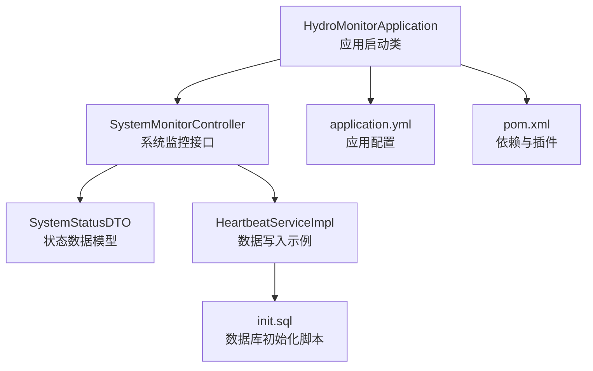
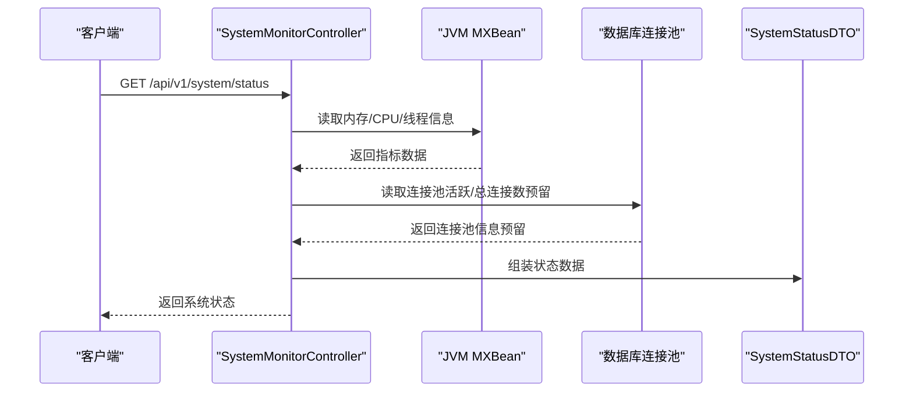
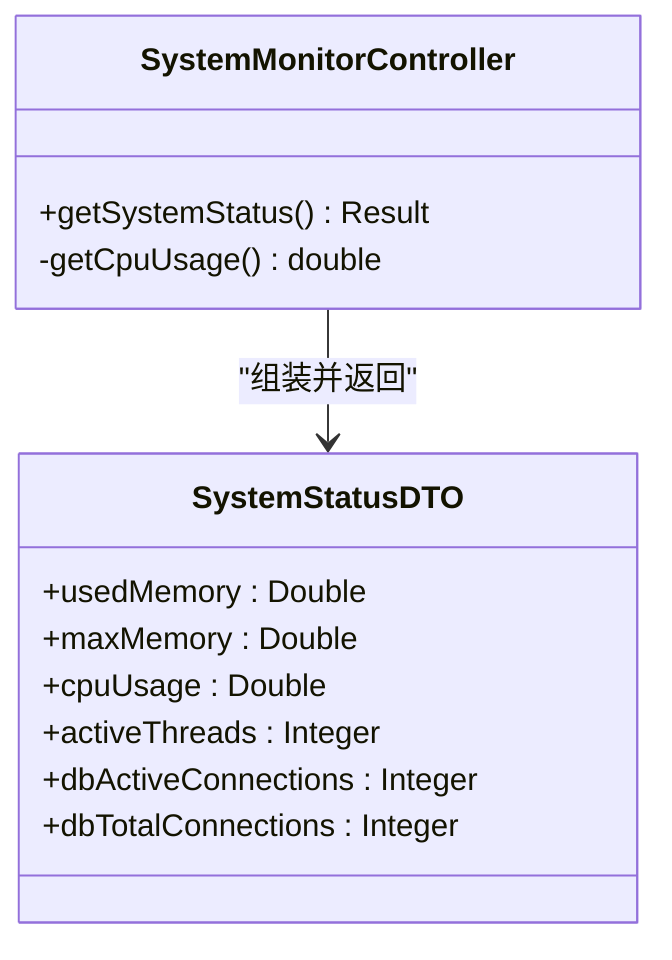
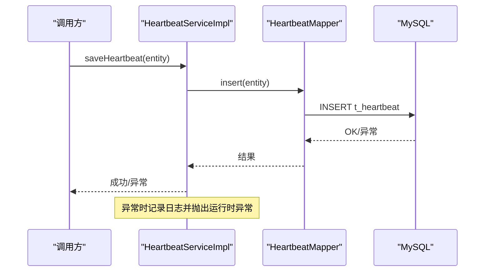
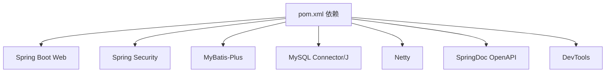

# 健康检查

<cite>
**本文引用的文件**
- [HydroMonitorApplication.java](file://src/main/java/com/hydro/monitor/HydroMonitorApplication.java)
- [application.yml](file://src/main/resources/application.yml)
- [SystemMonitorController.java](file://src/main/java/com/hydro/monitor/modules/controller/SystemMonitorController.java)
- [SystemStatusDTO.java](file://src/main/java/com/hydro/monitor/modules/dto/SystemStatusDTO.java)
- [HeartbeatServiceImpl.java](file://src/main/java/com/hydro/monitor/modules/service/impl/HeartbeatServiceImpl.java)
- [pom.xml](file://pom.xml)
- [init.sql](file://src/main/resources/db/init.sql)
- [README.md](file://README.md)
- [GlobalExceptionHandler.java](file://src/main/java/com/hydro/monitor/common/GlobalExceptionHandler.java)
- [SystemMonitorControllerTest.java](file://src/test/java/com/hydro/monitor/modules/controller/SystemMonitorControllerTest.java)
</cite>

## 目录
1. [引言](#引言)
2. [项目结构](#项目结构)
3. [核心组件](#核心组件)
4. [架构总览](#架构总览)
5. [详细组件分析](#详细组件分析)
6. [依赖分析](#依赖分析)
7. [性能考虑](#性能考虑)
8. [故障排查指南](#故障排查指南)
9. [结论](#结论)
10. [附录](#附录)

## 引言
本指南围绕水文监测系统的健康检查机制展开，结合现有代码实现，系统讲解如何在 Spring Boot 应用中进行系统运行状态监控、数据库连接健康检查以及外部服务可用性检查。同时提供健康检查接口的配置方法、自定义健康指示器的开发思路，以及健康检查结果的解读与故障诊断流程。

## 项目结构
该项目采用标准的 Spring Boot 结构，核心运行入口位于应用启动类，系统监控接口位于控制器层，数据库连接通过 MyBatis-Plus 与 MySQL 驱动集成，日志与安全配置在应用配置文件中集中管理。

**图表来源**
- [HydroMonitorApplication.java:12-35](file://src/main/java/com/hydro/monitor/HydroMonitorApplication.java#L12-L35)
- [SystemMonitorController.java:22-83](file://src/main/java/com/hydro/monitor/modules/controller/SystemMonitorController.java#L22-L83)
- [SystemStatusDTO.java:8-39](file://src/main/java/com/hydro/monitor/modules/dto/SystemStatusDTO.java#L8-L39)
- [application.yml:1-86](file://src/main/resources/application.yml#L1-L86)
- [pom.xml:30-153](file://pom.xml#L30-L153)
- [HeartbeatServiceImpl.java:22-58](file://src/main/java/com/hydro/monitor/modules/service/impl/HeartbeatServiceImpl.java#L22-L58)
- [init.sql:1-32](file://src/main/resources/db/init.sql#L1-L32)

**章节来源**
- [HydroMonitorApplication.java:12-35](file://src/main/java/com/hydro/monitor/HydroMonitorApplication.java#L12-L35)
- [application.yml:1-86](file://src/main/resources/application.yml#L1-L86)
- [pom.xml:30-153](file://pom.xml#L30-L153)
- [README.md:85-106](file://README.md#L85-L106)

## 核心组件
- 应用启动与引导：应用启动类负责应用启动与基础信息输出，便于健康检查时确认进程存活与端口状态。
- 系统监控接口：提供系统运行状态查询，包含内存、CPU、线程数等指标；数据库连接池指标预留扩展点。
- 数据库连接与写入：通过 MyBatis-Plus 的 Mapper/Service 层对数据库进行读写操作，作为数据库健康检查的“写入验证”手段。
- 应用配置：集中管理服务器端口、数据源、日志、Swagger 等配置项，为健康检查提供统一入口。
- 全局异常处理：统一捕获异常，保障健康检查接口的稳定性与一致性。

**章节来源**
- [HydroMonitorApplication.java:15-34](file://src/main/java/com/hydro/monitor/HydroMonitorApplication.java#L15-L34)
- [SystemMonitorController.java:34-82](file://src/main/java/com/hydro/monitor/modules/controller/SystemMonitorController.java#L34-L82)
- [HeartbeatServiceImpl.java:26-35](file://src/main/java/com/hydro/monitor/modules/service/impl/HeartbeatServiceImpl.java#L26-L35)
- [application.yml:1-86](file://src/main/resources/application.yml#L1-L86)
- [GlobalExceptionHandler.java:17-57](file://src/main/java/com/hydro/monitor/common/GlobalExceptionHandler.java#L17-L57)

## 架构总览
下图展示了健康检查相关的系统交互：客户端通过 HTTP 请求访问系统监控接口，接口聚合 JVM 指标与数据库连接池信息，最终返回统一的数据结构。

**图表来源**
- [SystemMonitorController.java:34-82](file://src/main/java/com/hydro/monitor/modules/controller/SystemMonitorController.java#L34-L82)
- [SystemStatusDTO.java:8-39](file://src/main/java/com/hydro/monitor/modules/dto/SystemStatusDTO.java#L8-L39)

## 详细组件分析

### 系统监控控制器
- 职责：提供系统运行状态查询接口，返回内存、CPU、线程数等指标；预留数据库连接池指标字段。
- 实现要点：
  - 使用 JVM MXBean 获取内存与线程信息。
  - 使用操作系统 MXBean 获取 CPU 使用率。
  - 将指标封装为统一 DTO 返回。
- 可扩展点：数据库连接池指标可通过注入数据源或连接池实现类获取活跃/总连接数。

**图表来源**
- [SystemMonitorController.java:22-83](file://src/main/java/com/hydro/monitor/modules/controller/SystemMonitorController.java#L22-L83)
- [SystemStatusDTO.java:8-39](file://src/main/java/com/hydro/monitor/modules/dto/SystemStatusDTO.java#L8-L39)

**章节来源**
- [SystemMonitorController.java:34-82](file://src/main/java/com/hydro/monitor/modules/controller/SystemMonitorController.java#L34-L82)
- [SystemStatusDTO.java:8-39](file://src/main/java/com/hydro/monitor/modules/dto/SystemStatusDTO.java#L8-L39)

### 数据库连接与写入验证
- 职责：通过 Mapper/Service 对数据库执行写入操作，作为数据库健康检查的“写入验证”手段。
- 实现要点：
  - Service 层捕获异常并记录日志，抛出运行时异常以反馈写入失败。
  - 控制器预留数据库连接池指标字段，便于后续接入连接池监控。

**图表来源**
- [HeartbeatServiceImpl.java:26-35](file://src/main/java/com/hydro/monitor/modules/service/impl/HeartbeatServiceImpl.java#L26-L35)

**章节来源**
- [HeartbeatServiceImpl.java:26-35](file://src/main/java/com/hydro/monitor/modules/service/impl/HeartbeatServiceImpl.java#L26-L35)

### 应用配置与健康检查入口
- 服务器端口与健康检查：应用启动后监听 8080 端口，可通过系统层面的端口探测确认进程存活。
- 数据源配置：集中管理 JDBC 驱动、URL、用户名与密码，确保数据库健康检查的连接可用性。
- 日志与 Swagger：统一的日志级别与 API 文档路径，便于定位问题与验证接口可用性。

**章节来源**
- [application.yml:1-86](file://src/main/resources/application.yml#L1-L86)
- [README.md:53-58](file://README.md#L53-L58)

### 全局异常处理与健康检查稳定性
- 职责：统一捕获运行时异常、权限拒绝与通用异常，保证健康检查接口返回一致的错误结构。
- 影响：即使业务层出现异常，健康检查接口也能稳定返回错误信息，便于外部监控系统识别异常。

**章节来源**
- [GlobalExceptionHandler.java:17-57](file://src/main/java/com/hydro/monitor/common/GlobalExceptionHandler.java#L17-L57)

## 依赖分析
- 核心框架：Spring Boot 3.5.9、Spring Security 6、MyBatis-Plus 3.5.9。
- 数据库与驱动：MySQL Connector/J 与 MyBatis-Plus 集成。
- 网络与工具：Netty 4.1、Hutool、Swagger UI。
- 开发工具：Spring Boot DevTools 提供热部署能力。

**图表来源**
- [pom.xml:30-153](file://pom.xml#L30-L153)

**章节来源**
- [pom.xml:30-153](file://pom.xml#L30-L153)

## 性能考虑
- 系统监控接口仅读取 JVM 指标，开销极低，适合高频健康检查。
- 数据库写入验证建议在非高峰时段执行，避免对业务造成压力。
- 日志级别与输出格式已在配置中统一，便于外部日志收集系统进行健康检查与告警。

[本节为通用指导，不直接分析具体文件，故无“章节来源”]

## 故障排查指南
- 进程存活检查：确认应用启动日志与端口输出，验证 8080 端口可达。
- 接口可用性检查：访问系统监控接口，观察返回状态与数据结构。
- 数据库健康检查：通过写入验证（如心跳数据插入）判断数据库连接与权限是否正常。
- 异常定位：关注全局异常处理器的错误响应与日志输出，结合数据库初始化脚本核对表结构与索引。

**章节来源**
- [HydroMonitorApplication.java:15-34](file://src/main/java/com/hydro/monitor/HydroMonitorApplication.java#L15-L34)
- [SystemMonitorControllerTest.java:29-47](file://src/test/java/com/hydro/monitor/modules/controller/SystemMonitorControllerTest.java#L29-L47)
- [init.sql:1-32](file://src/main/resources/db/init.sql#L1-L32)
- [GlobalExceptionHandler.java:17-57](file://src/main/java/com/hydro/monitor/common/GlobalExceptionHandler.java#L17-L57)

## 结论
本项目已具备基础的系统运行状态监控能力与数据库写入验证路径，可作为健康检查的起点。建议后续引入 Spring Boot Actuator 以获得更完善的健康指标与外部可观测性能力，并结合连接池监控与外部服务可用性检查策略，构建完整的健康检查体系。

[本节为总结性内容，不直接分析具体文件，故无“章节来源”]

## 附录

### 健康检查接口配置与使用
- 接口路径：/api/v1/system/status
- 方法：GET
- 认证：当前测试用例显示未认证返回 401，实际生产中需按安全策略配置鉴权。
- 响应：包含内存、CPU、线程数与数据库连接池指标（预留）。

**章节来源**
- [SystemMonitorController.java:34-66](file://src/main/java/com/hydro/monitor/modules/controller/SystemMonitorController.java#L34-L66)
- [SystemMonitorControllerTest.java:29-47](file://src/test/java/com/hydro/monitor/modules/controller/SystemMonitorControllerTest.java#L29-L47)

### 数据库连接健康检查实现原理
- 连接池监控：通过注入数据源或连接池实现类，读取活跃连接数与总连接数。
- 写入验证：通过 Service 层对数据库执行写入操作，捕获异常并记录日志，作为数据库可用性验证。
- 表结构核对：依据初始化脚本核对表是否存在、索引是否完整。

**章节来源**
- [HeartbeatServiceImpl.java:26-35](file://src/main/java/com/hydro/monitor/modules/service/impl/HeartbeatServiceImpl.java#L26-L35)
- [init.sql:1-32](file://src/main/resources/db/init.sql#L1-L32)

### 外部服务可用性检查策略
- 第三方 API 调用状态监控：对外部服务发起轻量级探测请求，记录响应时间与成功率。
- 网络连通性检测：通过定时任务或健康检查脚本验证网络连通性与超时阈值。
- 健康检查结果聚合：将系统、数据库与外部服务健康状态统一上报至监控平台。

[本节为通用指导，不直接分析具体文件，故无“章节来源”]

### 健康检查结果解读与故障诊断流程
- 系统指标解读：内存使用率过高、CPU 使用率异常升高、线程数激增可能预示资源瓶颈。
- 数据库指标解读：活跃连接数持续接近上限、连接超时频繁可能表明连接池配置不足或慢查询。
- 故障诊断流程：先确认进程存活与端口可达，再检查接口返回与日志，最后通过数据库写入验证与表结构核对定位问题。

**章节来源**
- [SystemMonitorController.java:34-82](file://src/main/java/com/hydro/monitor/modules/controller/SystemMonitorController.java#L34-L82)
- [GlobalExceptionHandler.java:17-57](file://src/main/java/com/hydro/monitor/common/GlobalExceptionHandler.java#L17-L57)
- [init.sql:1-32](file://src/main/resources/db/init.sql#L1-L32)