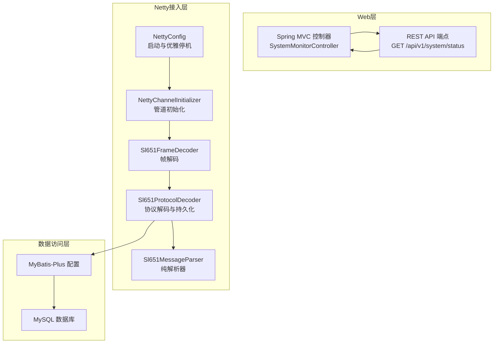
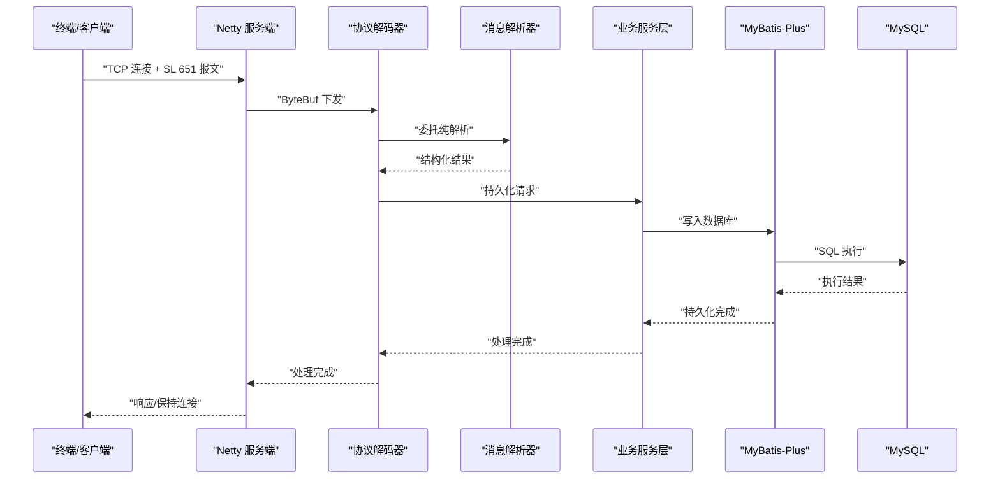
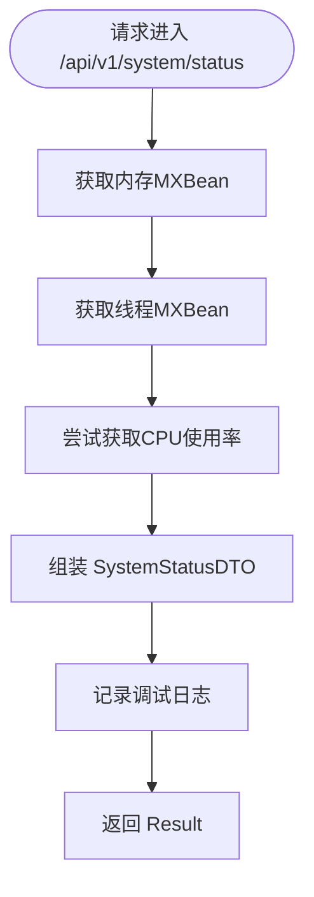
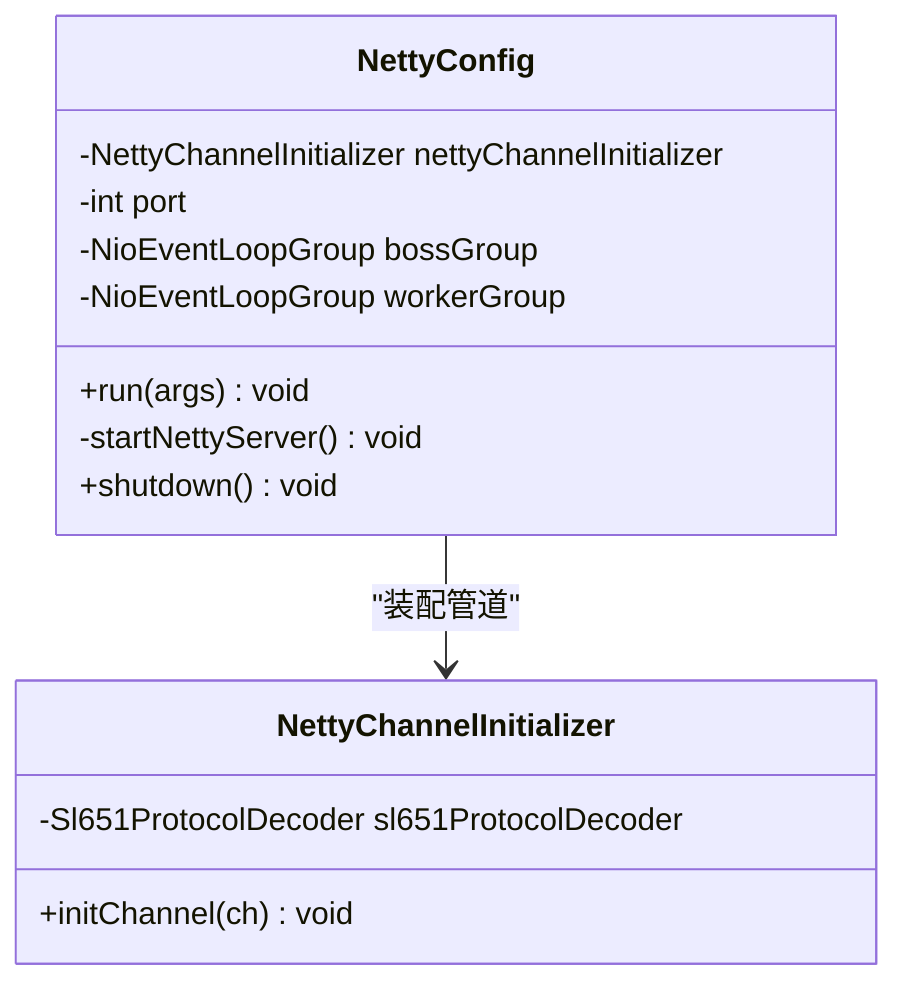
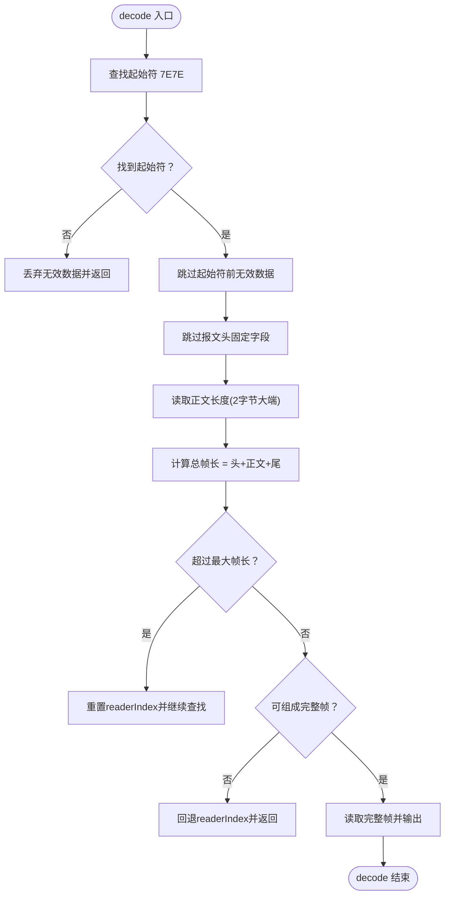
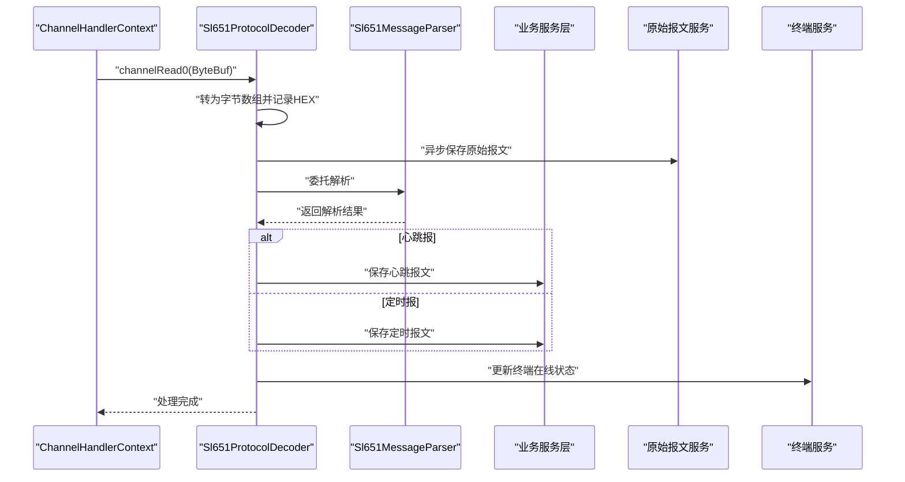
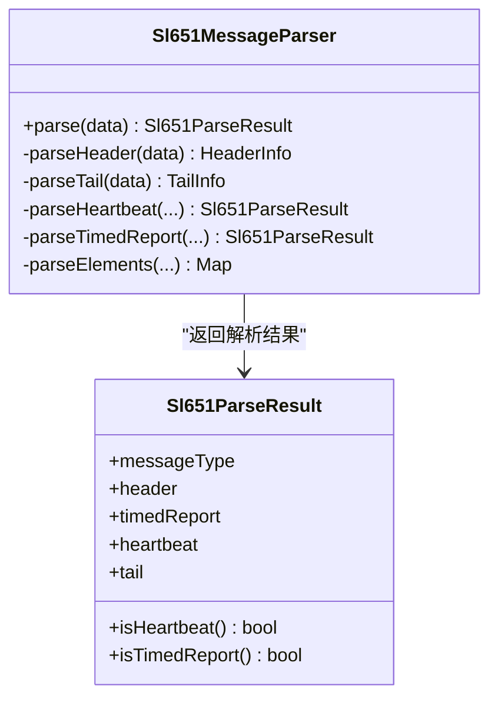
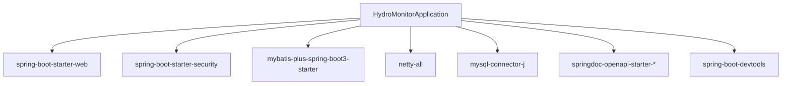

# 性能监控

<cite>
**本文引用的文件**
- [HydroMonitorApplication.java](file://src/main/java/com/hydro/monitor/HydroMonitorApplication.java)
- [NettyConfig.java](file://src/main/java/com/hydro/monitor/config/NettyConfig.java)
- [NettyChannelInitializer.java](file://src/main/java/com/hydro/monitor/config/NettyChannelInitializer.java)
- [Sl651FrameDecoder.java](file://src/main/java/com/hydro/monitor/netty/Sl651FrameDecoder.java)
- [Sl651ProtocolDecoder.java](file://src/main/java/com/hydro/monitor/netty/Sl651ProtocolDecoder.java)
- [Sl651MessageParser.java](file://src/main/java/com/hydro/monitor/netty/Sl651MessageParser.java)
- [SystemMonitorController.java](file://src/main/java/com/hydro/monitor/modules/controller/SystemMonitorController.java)
- [SystemStatusDTO.java](file://src/main/java/com/hydro/monitor/modules/dto/SystemStatusDTO.java)
- [MyBatisPlusConfig.java](file://src/main/java/com/hydro/monitor/config/MyBatisPlusConfig.java)
- [application.yml](file://src/main/resources/application.yml)
- [pom.xml](file://pom.xml)
- [TerminalSimulatorClient.java](file://src/main/java/com/hydro/monitor/simulation/TerminalSimulatorClient.java)
</cite>

## 目录
1. [简介](#简介)
2. [项目结构](#项目结构)
3. [核心组件](#核心组件)
4. [架构总览](#架构总览)
5. [详细组件分析](#详细组件分析)
6. [依赖分析](#依赖分析)
7. [性能考虑](#性能考虑)
8. [故障排查指南](#故障排查指南)
9. [结论](#结论)
10. [附录](#附录)

## 简介
本指南围绕系统性能监控展开，结合当前代码库中已实现的组件，系统性地介绍应用性能指标采集方法（响应时间、吞吐量、并发数等）、Netty连接状态监控（活跃连接数、消息处理延迟、网络I/O性能）、数据库性能监控策略（慢查询分析、连接池利用率、SQL执行性能）、Spring Boot Actuator指标使用建议（内置指标启用与自定义指标创建），并提供性能瓶颈识别方法、优化建议及性能基准测试策略。

## 项目结构
项目采用Spring Boot + Netty的双栈架构：Web层基于Spring MVC提供REST API；IoT接入层基于Netty处理SL 651-2014协议报文，完成帧解码、协议解析与业务落库。系统监控控制器提供JVM内存、CPU、线程数等基础指标查询；数据库访问通过MyBatis-Plus实现；配置集中于application.yml；依赖管理由Maven负责。

图表来源
- [NettyConfig.java:26-87](file://src/main/java/com/hydro/monitor/config/NettyConfig.java#L26-L87)
- [NettyChannelInitializer.java:18-36](file://src/main/java/com/hydro/monitor/config/NettyChannelInitializer.java#L18-L36)
- [Sl651FrameDecoder.java:26-121](file://src/main/java/com/hydro/monitor/netty/Sl651FrameDecoder.java#L26-L121)
- [Sl651ProtocolDecoder.java:39-278](file://src/main/java/com/hydro/monitor/netty/Sl651ProtocolDecoder.java#L39-L278)
- [Sl651MessageParser.java:25-648](file://src/main/java/com/hydro/monitor/netty/Sl651MessageParser.java#L25-L648)
- [MyBatisPlusConfig.java:14-39](file://src/main/java/com/hydro/monitor/config/MyBatisPlusConfig.java#L14-L39)

章节来源
- [HydroMonitorApplication.java:15-35](file://src/main/java/com/hydro/monitor/HydroMonitorApplication.java#L15-L35)
- [application.yml:1-86](file://src/main/resources/application.yml#L1-L86)
- [pom.xml:30-153](file://pom.xml#L30-L153)

## 核心组件
- 系统监控控制器：提供系统运行状态查询，包含内存、CPU、线程数等指标，便于快速掌握运行态。
- Netty服务端配置：异步启动Netty服务端，配置事件循环组、通道选项与日志处理器，支持优雅停机。
- Netty通道初始化器：在每个新连接建立时装配解码器链，确保粘包/半包问题被正确处理。
- SL 651帧解码器：基于起始符与正文长度字段进行帧边界识别，保障后续解析稳定性。
- SL 651协议解码器：接收ByteBuf，调用纯解析器进行协议解析，并将结果持久化到数据库。
- SL 651消息解析器：无状态、线程安全的纯解析器，负责将原始报文解析为结构化对象。
- MyBatis-Plus配置：启用分页拦截器，支持分页查询与最大记录限制。

章节来源
- [SystemMonitorController.java:34-83](file://src/main/java/com/hydro/monitor/modules/controller/SystemMonitorController.java#L34-L83)
- [NettyConfig.java:26-87](file://src/main/java/com/hydro/monitor/config/NettyConfig.java#L26-L87)
- [NettyChannelInitializer.java:18-36](file://src/main/java/com/hydro/monitor/config/NettyChannelInitializer.java#L18-L36)
- [Sl651FrameDecoder.java:26-121](file://src/main/java/com/hydro/monitor/netty/Sl651FrameDecoder.java#L26-L121)
- [Sl651ProtocolDecoder.java:39-278](file://src/main/java/com/hydro/monitor/netty/Sl651ProtocolDecoder.java#L39-L278)
- [Sl651MessageParser.java:25-648](file://src/main/java/com/hydro/monitor/netty/Sl651MessageParser.java#L25-L648)
- [MyBatisPlusConfig.java:14-39](file://src/main/java/com/hydro/monitor/config/MyBatisPlusConfig.java#L14-L39)

## 架构总览
下图展示从客户端到数据库的完整数据通路，以及监控点位：

图表来源
- [Sl651ProtocolDecoder.java:54-89](file://src/main/java/com/hydro/monitor/netty/Sl651ProtocolDecoder.java#L54-L89)
- [Sl651MessageParser.java:66-126](file://src/main/java/com/hydro/monitor/netty/Sl651MessageParser.java#L66-L126)
- [MyBatisPlusConfig.java:24-37](file://src/main/java/com/hydro/monitor/config/MyBatisPlusConfig.java#L24-L37)

## 详细组件分析

### 系统监控控制器（SystemMonitorController）
- 指标采集：内存使用、最大堆、CPU使用率、活跃线程数。
- 数据库连接池指标：当前实现预留字段，但未注入数据源或连接池统计信息。
- 输出：封装为SystemStatusDTO并通过Result统一返回。

图表来源
- [SystemMonitorController.java:34-83](file://src/main/java/com/hydro/monitor/modules/controller/SystemMonitorController.java#L34-L83)
- [SystemStatusDTO.java:8-39](file://src/main/java/com/hydro/monitor/modules/dto/SystemStatusDTO.java#L8-L39)

章节来源
- [SystemMonitorController.java:34-83](file://src/main/java/com/hydro/monitor/modules/controller/SystemMonitorController.java#L34-L83)
- [SystemStatusDTO.java:8-39](file://src/main/java/com/hydro/monitor/modules/dto/SystemStatusDTO.java#L8-L39)

### Netty服务端配置（NettyConfig）
- 启动流程：CommandLineRunner在Spring启动后异步启动Netty服务端。
- 事件循环组：bossGroup与workerGroup分离，提升并发处理能力。
- 通道选项：设置SO_BACKLOG、SO_KEEPALIVE与LoggingHandler辅助调试。
- 优雅停机：PreDestroy释放资源，保证服务下线时的稳定性。

图表来源
- [NettyConfig.java:26-87](file://src/main/java/com/hydro/monitor/config/NettyConfig.java#L26-L87)
- [NettyChannelInitializer.java:18-36](file://src/main/java/com/hydro/monitor/config/NettyChannelInitializer.java#L18-L36)

章节来源
- [NettyConfig.java:26-87](file://src/main/java/com/hydro/monitor/config/NettyConfig.java#L26-L87)
- [NettyChannelInitializer.java:18-36](file://src/main/java/com/hydro/monitor/config/NettyChannelInitializer.java#L18-L36)

### SL 651帧解码器（Sl651FrameDecoder）
- 帧边界识别：扫描起始符“7E7E”，读取功能码后的正文长度字段，计算总帧长。
- 安全阈值：最大帧长度限制，防止异常报文导致内存压力。
- 数据完整性：在可读字节不足时回退readerIndex，等待更多数据。

图表来源
- [Sl651FrameDecoder.java:38-100](file://src/main/java/com/hydro/monitor/netty/Sl651FrameDecoder.java#L38-L100)

章节来源
- [Sl651FrameDecoder.java:26-121](file://src/main/java/com/hydro/monitor/netty/Sl651FrameDecoder.java#L26-L121)

### SL 651协议解码器（Sl651ProtocolDecoder）
- 职责分离：仅负责将ByteBuf转为字节数组，委托纯解析器完成协议解析。
- 持久化：根据解析结果分别调用心跳与定时报服务进行入库。
- 异步落库：原始报文保存采用CompletableFuture异步执行，避免阻塞Netty线程。
- 错误处理：捕获异常并记录日志，保证连接稳定。

图表来源
- [Sl651ProtocolDecoder.java:54-89](file://src/main/java/com/hydro/monitor/netty/Sl651ProtocolDecoder.java#L54-L89)
- [Sl651ProtocolDecoder.java:203-249](file://src/main/java/com/hydro/monitor/netty/Sl651ProtocolDecoder.java#L203-L249)

章节来源
- [Sl651ProtocolDecoder.java:39-278](file://src/main/java/com/hydro/monitor/netty/Sl651ProtocolDecoder.java#L39-L278)

### SL 651消息解析器（Sl651MessageParser）
- 纯解析器：无状态、线程安全，专注于将原始报文解析为结构化对象。
- 功能码分发：根据功能码区分心跳报与定时报，分别解析正文。
- 要素数据：解析要素标识符与数值，支持BCD编码与小数位处理。
- 结果输出：统一返回Sl651ParseResult，包含报文头、尾与具体消息体。

图表来源
- [Sl651MessageParser.java:66-126](file://src/main/java/com/hydro/monitor/netty/Sl651MessageParser.java#L66-L126)
- [Sl651MessageParser.java:626-646](file://src/main/java/com/hydro/monitor/netty/Sl651MessageParser.java#L626-L646)

章节来源
- [Sl651MessageParser.java:25-648](file://src/main/java/com/hydro/monitor/netty/Sl651MessageParser.java#L25-L648)

### 数据库性能监控策略
- 慢查询分析：可通过数据库慢查询日志与性能分析工具定位慢SQL；在应用侧结合MyBatis-Plus的日志配置查看SQL执行情况。
- 连接池利用率：当前系统监控控制器预留了数据库连接池活跃/总连接数字段，但未注入实际连接池统计；建议集成HikariCP或Druid监控。
- SQL执行性能：利用分页拦截器控制单页最大记录数，避免一次性加载过多数据；对高频查询建立必要索引。

章节来源
- [MyBatisPlusConfig.java:24-37](file://src/main/java/com/hydro/monitor/config/MyBatisPlusConfig.java#L24-L37)
- [SystemMonitorController.java:49-60](file://src/main/java/com/hydro/monitor/modules/controller/SystemMonitorController.java#L49-L60)

## 依赖分析
- Spring Boot Starter Web：提供Web框架与嵌入式Tomcat。
- Spring Boot Starter Security：提供安全框架与认证授权能力。
- MyBatis-Plus：提供ORM能力与分页拦截器。
- Netty：提供高性能网络I/O与协议编解码。
- MySQL Connector/J：提供MySQL驱动。
- SpringDoc OpenAPI：提供API文档能力。
- Lombok：减少样板代码。
- Hutool：提供常用工具类。
- Spring Boot DevTools：提供热部署能力。

图表来源
- [pom.xml:30-153](file://pom.xml#L30-L153)

章节来源
- [pom.xml:30-153](file://pom.xml#L30-L153)

## 性能考虑
- 响应时间
  - Web层：通过控制器返回统一包装，建议在网关或过滤器层记录请求开始时间与结束时间，计算端到端响应时间。
  - Netty层：在协议解码器与解析器前后打点，记录从接收ByteBuf到持久化完成的时间，识别瓶颈环节。
- 吞吐量
  - Netty：合理设置worker线程数与SO_BACKLOG，避免队列积压；使用零拷贝与直接缓冲区减少内存复制。
  - 数据库：批量写入、连接池参数调优、SQL优化与索引优化。
- 并发数
  - Netty：分离boss与worker线程组，避免IO阻塞影响其他连接；合理设置空闲检测与超时时间。
  - JVM：监控GC与堆内存使用，避免Full GC导致的长时间停顿。
- 网络I/O性能
  - 帧解码：确保Sl651FrameDecoder正确识别帧边界，避免重复解码与内存浪费。
  - 异步落库：使用CompletableFuture异步保存原始报文，降低主链路阻塞风险。

## 故障排查指南
- Netty启动失败
  - 检查端口占用与权限；确认LoggingHandler输出日志定位异常。
- 报文解析失败
  - 查看协议解码器与解析器日志，确认功能码与正文长度是否符合规范。
- 数据库连接异常
  - 检查数据源配置与连接池参数；关注慢查询与锁等待。
- 系统监控指标缺失
  - 当前数据库连接池指标为预留字段，需注入数据源或连接池监控组件。

章节来源
- [NettyConfig.java:66-69](file://src/main/java/com/hydro/monitor/config/NettyConfig.java#L66-L69)
- [Sl651ProtocolDecoder.java:273-276](file://src/main/java/com/hydro/monitor/netty/Sl651ProtocolDecoder.java#L273-L276)
- [SystemMonitorController.java:49-60](file://src/main/java/com/hydro/monitor/modules/controller/SystemMonitorController.java#L49-L60)

## 结论
本项目在Netty与Spring Boot基础上提供了完善的协议接入与系统监控能力。建议在现有基础上补充Spring Boot Actuator指标、数据库连接池监控、以及端到端性能埋点，形成闭环的性能监控体系。同时，持续优化Netty线程模型与数据库访问路径，配合基准测试验证优化效果。

## 附录
- 性能基准测试策略
  - 场景设计：不同并发连接数、不同报文大小、不同要素数量组合。
  - 指标采集：吞吐量（TPS/RPS）、P99延迟、CPU/内存/GC、数据库QPS与慢查询数。
  - 工具建议：JMH（微基准）、Gatling（负载测试）、Prometheus+Grafana（实时监控）。
- Spring Boot Actuator指标使用建议
  - 启用：添加spring-boot-starter-actuator依赖并在配置中开启所需端点。
  - 内置指标：HTTP请求、JVM、进程、磁盘、线程等。
  - 自定义指标：使用MeterRegistry注册计数器、直方图与时间分布，覆盖关键业务路径。