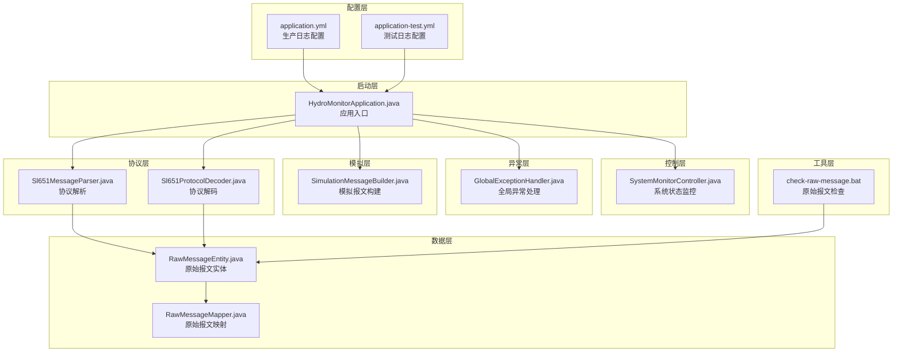
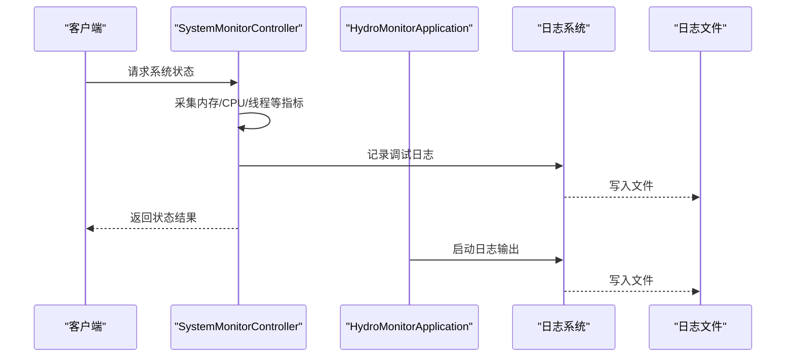
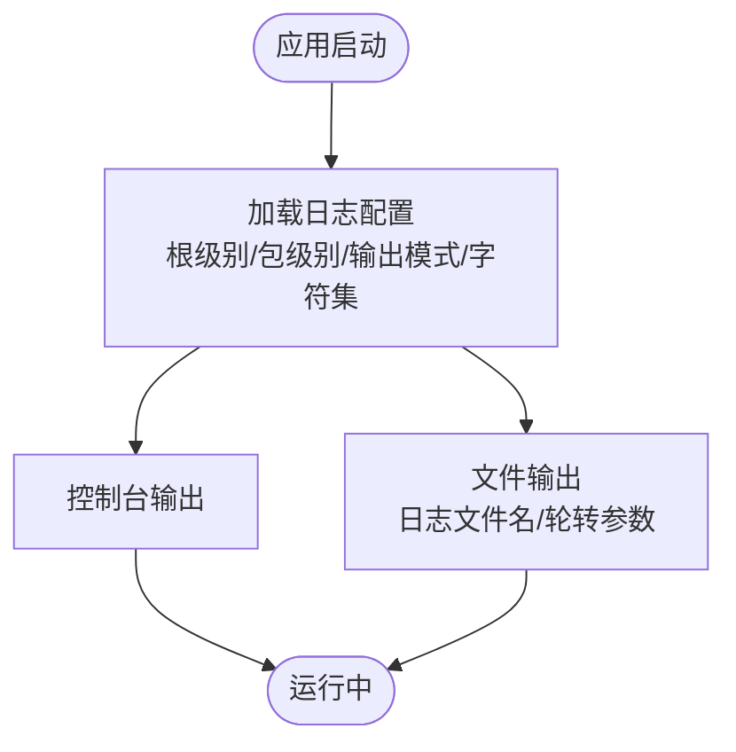
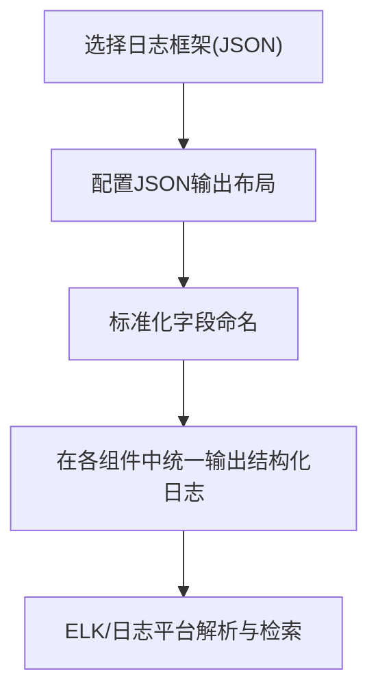
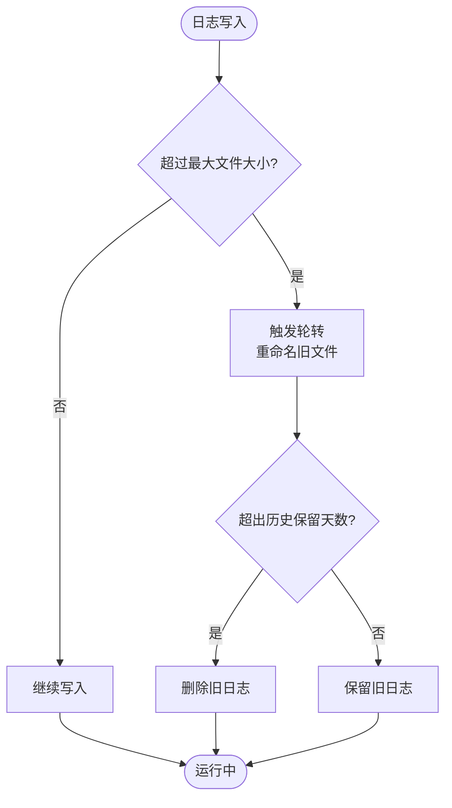
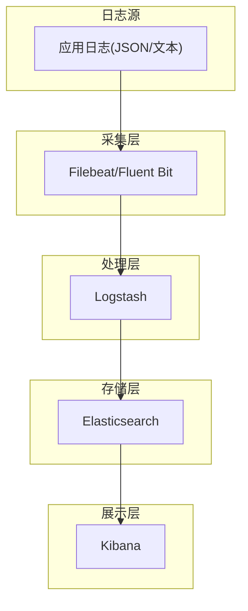
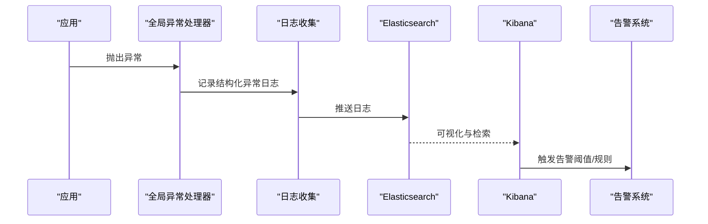
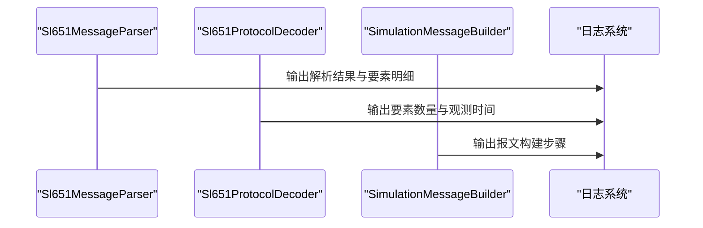
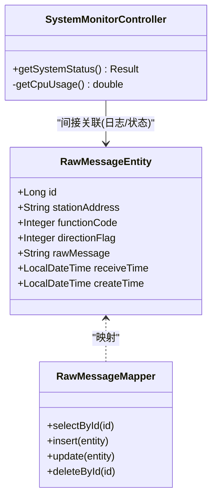
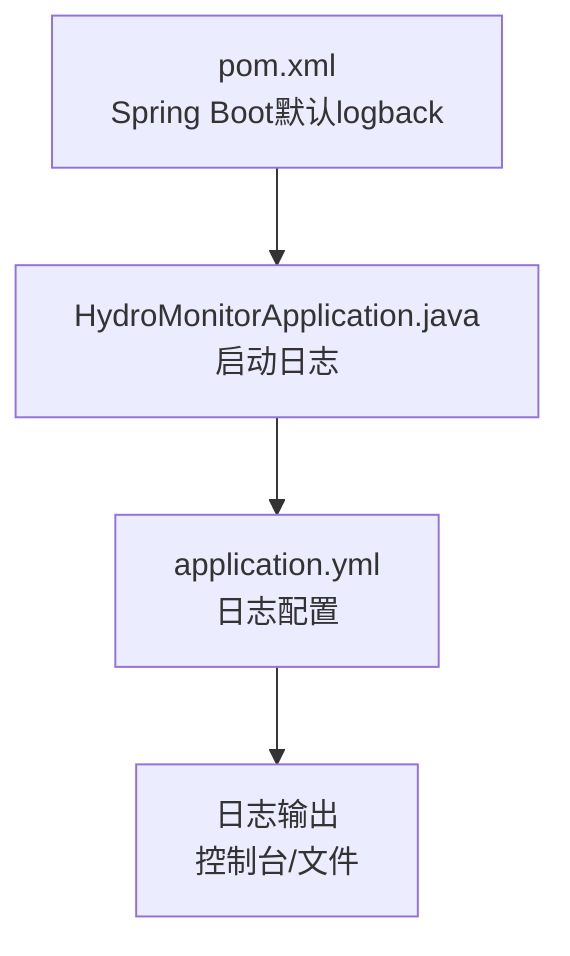

# 日志监控

<cite>
**本文引用的文件**
- [application.yml](file://src/main/resources/application.yml)
- [pom.xml](file://pom.xml)
- [HydroMonitorApplication.java](file://src/main/java/com/hydro/monitor/HydroMonitorApplication.java)
- [GlobalExceptionHandler.java](file://src/main/java/com/hydro/monitor/common/GlobalExceptionHandler.java)
- [SystemMonitorController.java](file://src/main/java/com/hydro/monitor/modules/controller/SystemMonitorController.java)
- [SystemStatusDTO.java](file://src/main/java/com/hydro/monitor/modules/dto/SystemStatusDTO.java)
- [Sl651MessageParser.java](file://src/main/java/com/hydro/monitor/netty/Sl651MessageParser.java)
- [Sl651ProtocolDecoder.java](file://src/main/java/com/hydro/monitor/netty/Sl651ProtocolDecoder.java)
- [SimulationMessageBuilder.java](file://src/main/java/com/hydro/monitor/simulation/SimulationMessageBuilder.java)
- [RawMessageEntity.java](file://src/main/java/com/hydro/monitor/modules/entity/RawMessageEntity.java)
- [RawMessageMapper.java](file://src/main/java/com/hydro/monitor/modules/mapper/RawMessageMapper.java)
- [application-test.yml](file://src/test/resources/application-test.yml)
- [check-raw-message.bat](file://check-raw-message.bat)
- [start-dev.bat](file://start-dev.bat)
</cite>

## 目录
1. [简介](#简介)
2. [项目结构](#项目结构)
3. [核心组件](#核心组件)
4. [架构总览](#架构总览)
5. [详细组件分析](#详细组件分析)
6. [依赖分析](#依赖分析)
7. [性能考虑](#性能考虑)
8. [故障排查指南](#故障排查指南)
9. [结论](#结论)
10. [附录](#附录)

## 简介
本文件面向“日志监控系统”的设计与实践，结合当前代码库现状，系统性梳理日志配置策略（含控制台与文件输出、日志级别管理）、结构化日志实现（JSON 输出与字段标准化建议）、日志轮转与归档策略（按大小与时间）、日志分析工具使用指南（ELK Stack 集成思路）、错误日志自动收集与分析方法，以及异常监控与告警机制的落地路径。由于当前仓库未直接集成 logback 或 log4j2 的 XML 配置文件，本文在不改变现有 Spring Boot 默认日志体系的前提下，给出可操作的优化与扩展建议。

## 项目结构
围绕日志监控的关键文件分布如下：
- 配置层：application.yml（生产日志配置）、application-test.yml（测试日志配置）
- 启动层：HydroMonitorApplication.java（应用入口）
- 控制层：SystemMonitorController.java（系统运行状态监控）
- 异常层：GlobalExceptionHandler.java（全局异常处理与日志记录）
- 协议层：Sl651MessageParser.java、Sl651ProtocolDecoder.java（协议解析与日志输出）
- 模拟层：SimulationMessageBuilder.java（模拟报文构建与日志输出）
- 数据层：RawMessageEntity.java、RawMessageMapper.java（原始报文持久化）
- 工具层：check-raw-message.bat（原始报文检查脚本）

**图表来源**
- [application.yml:62-77](file://src/main/resources/application.yml#L62-L77)
- [application-test.yml:24-29](file://src/test/resources/application-test.yml#L24-L29)
- [HydroMonitorApplication.java:15-34](file://src/main/java/com/hydro/monitor/HydroMonitorApplication.java#L15-L34)
- [SystemMonitorController.java:34-66](file://src/main/java/com/hydro/monitor/modules/controller/SystemMonitorController.java#L34-L66)
- [GlobalExceptionHandler.java:25-56](file://src/main/java/com/hydro/monitor/common/GlobalExceptionHandler.java#L25-L56)
- [Sl651MessageParser.java:546-585](file://src/main/java/com/hydro/monitor/netty/Sl651MessageParser.java#L546-L585)
- [Sl651ProtocolDecoder.java:131-154](file://src/main/java/com/hydro/monitor/netty/Sl651ProtocolDecoder.java#L131-L154)
- [SimulationMessageBuilder.java:153-205](file://src/main/java/com/hydro/monitor/simulation/SimulationMessageBuilder.java#L153-L205)
- [RawMessageEntity.java:15-54](file://src/main/java/com/hydro/monitor/modules/entity/RawMessageEntity.java#L15-L54)
- [RawMessageMapper.java:12-14](file://src/main/java/com/hydro/monitor/modules/mapper/RawMessageMapper.java#L12-L14)
- [check-raw-message.bat:8-45](file://check-azure-message.bat#L8-L45)

**章节来源**
- [application.yml:62-77](file://src/main/resources/application.yml#L62-L77)
- [application-test.yml:24-29](file://src/test/resources/application-test.yml#L24-L29)
- [HydroMonitorApplication.java:15-34](file://src/main/java/com/hydro/monitor/HydroMonitorApplication.java#L15-L34)

## 核心组件
- 日志配置策略
  - 生产环境：通过 application.yml 配置根日志级别、包级日志级别、控制台与文件输出模式、字符集、日志文件名及轮转参数（最大文件大小与保留天数）。
  - 测试环境：通过 application-test.yml 将根日志级别调整为更严格的警告级别，便于快速定位问题。
- 结构化日志实现
  - 当前项目未直接引入 logback 或 log4j2 的 JSON 输出配置；但可通过 Spring Boot 默认日志框架与日志门面（SLF4J）进行统一输出。建议在后续阶段引入 JSON 输出以满足 ELK 等工具链的解析需求。
- 日志轮转与归档
  - application.yml 中已配置文件最大大小与历史保留天数，满足按大小与时间的轮转需求。
- 异常监控与告警
  - GlobalExceptionHandler.java 统一捕获异常并记录日志，返回标准响应；建议结合外部监控平台（如 Prometheus + Alertmanager 或云厂商告警）实现异常告警。

**章节来源**
- [application.yml:62-77](file://src/main/resources/application.yml#L62-L77)
- [application-test.yml:24-29](file://src/test/resources/application-test.yml#L24-L29)
- [GlobalExceptionHandler.java:25-56](file://src/main/java/com/hydro/monitor/common/GlobalExceptionHandler.java#L25-L56)

## 架构总览
下图展示日志在系统中的流向与落点，包括控制台输出、文件输出、异常处理与系统状态监控。

**图表来源**
- [SystemMonitorController.java:34-66](file://src/main/java/com/hydro/monitor/modules/controller/SystemMonitorController.java#L34-L66)
- [HydroMonitorApplication.java:15-34](file://src/main/java/com/hydro/monitor/HydroMonitorApplication.java#L15-L34)
- [application.yml:62-77](file://src/main/resources/application.yml#L62-L77)

## 详细组件分析

### 日志配置策略与级别管理
- 根日志级别与包级日志级别
  - 根日志级别：INFO（生产）
  - 包级日志级别：com.hydro.monitor: DEBUG（便于开发与问题定位）
- 输出模式与字符集
  - 控制台与文件输出模式分别定义了时间戳、线程名、日志级别、Logger 名称与消息内容的格式。
  - 控制台与文件字符集均设置为 UTF-8，确保多语言输出正确。
- 文件输出与轮转
  - 日志文件名：logs/hydro-monitor-backend.log
  - 最大文件大小：10MB
  - 历史保留天数：30 天
- 测试环境日志级别
  - application-test.yml 将根日志级别提升至 WARN，减少测试时的噪声日志。

**图表来源**
- [application.yml:62-77](file://src/main/resources/application.yml#L62-L77)
- [application-test.yml:24-29](file://src/test/resources/application-test.yml#L24-L29)

**章节来源**
- [application.yml:62-77](file://src/main/resources/application.yml#L62-L77)
- [application-test.yml:24-29](file://src/test/resources/application-test.yml#L24-L29)

### 结构化日志实现（JSON 输出与字段标准化）
- 当前现状
  - 项目未直接引入 logback 或 log4j2 的 JSON 输出配置文件；Spring Boot 默认日志输出为文本格式。
- 建议方案
  - 引入 JSON 输出：在 logback 或 log4j2 中配置 JSON 格式布局，输出字段包括时间戳、级别、线程名、Logger 名称、消息体、异常堆栈、应用名、实例 ID、请求 ID 等。
  - 字段标准化：统一字段命名（如 level、timestamp、thread、logger、message、exception、traceId、spanId 等），便于下游 ELK 等工具解析与检索。
  - 结构化字段：对业务关键事件（如协议解析结果、异常发生位置、请求耗时）进行结构化输出，便于聚合统计与告警。
- 影响范围
  - 协议层（Sl651MessageParser.java、Sl651ProtocolDecoder.java）、模拟层（SimulationMessageBuilder.java）、异常层（GlobalExceptionHandler.java）等均需遵循统一的结构化字段规范。

**图表来源**
- [Sl651MessageParser.java:546-585](file://src/main/java/com/hydro/monitor/netty/Sl651MessageParser.java#L546-L585)
- [Sl651ProtocolDecoder.java:131-154](file://src/main/java/com/hydro/monitor/netty/Sl651ProtocolDecoder.java#L131-L154)
- [SimulationMessageBuilder.java:153-205](file://src/main/java/com/hydro/monitor/simulation/SimulationMessageBuilder.java#L153-L205)
- [GlobalExceptionHandler.java:25-56](file://src/main/java/com/hydro/monitor/common/GlobalExceptionHandler.java#L25-L56)

**章节来源**
- [Sl651MessageParser.java:546-585](file://src/main/java/com/hydro/monitor/netty/Sl651MessageParser.java#L546-L585)
- [Sl651ProtocolDecoder.java:131-154](file://src/main/java/com/hydro/monitor/netty/Sl651ProtocolDecoder.java#L131-L154)
- [SimulationMessageBuilder.java:153-205](file://src/main/java/com/hydro/monitor/simulation/SimulationMessageBuilder.java#L153-L205)
- [GlobalExceptionHandler.java:25-56](file://src/main/java/com/hydro/monitor/common/GlobalExceptionHandler.java#L25-L56)

### 日志轮转与归档策略（按大小与时间）
- 现状
  - application.yml 已配置最大文件大小与历史保留天数，满足按大小与时间的轮转需求。
- 建议
  - 在生产环境中，建议结合操作系统层面的 logrotate 或集中式日志平台（如 Fluentd/Fluent Bit/Filebeat）进行归档与远端传输。
  - 对于多实例部署，建议统一日志目录与命名规范，避免日志分散。

**图表来源**
- [application.yml:74-76](file://src/main/resources/application.yml#L74-L76)

**章节来源**
- [application.yml:74-76](file://src/main/resources/application.yml#L74-L76)

### 日志分析工具使用指南（ELK Stack 集成）
- 集成思路
  - Logstash：作为日志采集与预处理节点，负责从日志文件读取、解析 JSON 字段、清洗与增强字段。
  - Elasticsearch：作为索引与检索引擎，建立索引模板，开启字段映射与聚合分析。
  - Kibana：作为可视化界面，创建仪表板与告警规则，实现日志检索、趋势分析与异常告警。
- 适配要点
  - 若采用结构化 JSON 输出，需在 Logstash 中配置 JSON 解析与字段映射；若仍使用文本输出，则需通过正则表达式解析。
  - 建议在日志中加入 traceId/spamId、应用名、实例 ID 等上下文字段，便于跨服务追踪与关联分析。
- 运维建议
  - 对热点日志（如异常日志）设置高优先级索引与更快的刷新频率。
  - 启用索引生命周期管理（ILM），自动归档与删除过期索引。

（本图为概念性流程图，不对应具体源文件）

### 错误日志的自动收集与分析、异常监控与告警
- 自动收集
  - 通过 Filebeat/Fluent Bit 等工具将日志文件实时推送至 Logstash/Elasticsearch。
  - 在 GlobalExceptionHandler.java 中统一记录异常日志，便于集中检索与分析。
- 分析方法
  - 利用 Kibana 的异常趋势图、Top N 异常类型、异常堆栈聚合等能力进行根因分析。
  - 对高频异常设置阈值告警，结合业务 SLA 进行分级处理。
- 告警机制
  - 建议结合外部告警系统（如 Prometheus + Alertmanager、企业微信/钉钉机器人、云厂商告警）实现异常通知与升级。
  - 告警内容建议包含异常类型、发生次数、影响范围、建议处置步骤等。

**图表来源**
- [GlobalExceptionHandler.java:25-56](file://src/main/java/com/hydro/monitor/common/GlobalExceptionHandler.java#L25-L56)

**章节来源**
- [GlobalExceptionHandler.java:25-56](file://src/main/java/com/hydro/monitor/common/GlobalExceptionHandler.java#L25-L56)

### 协议解析与模拟报文的日志输出
- 协议解析日志
  - Sl651MessageParser.java 在解析心跳与定时报时，输出详细的解析结果与要素明细，便于问题定位与审计。
- 协议解码日志
  - Sl651ProtocolDecoder.java 在解码过程中输出要素数量、观测时间等关键信息，有助于验证协议正确性。
- 模拟报文日志
  - SimulationMessageBuilder.java 在构建报文时输出报文头、正文等关键步骤，便于模拟环境下的调试与验证。

**图表来源**
- [Sl651MessageParser.java:546-585](file://src/main/java/com/hydro/monitor/netty/Sl651MessageParser.java#L546-L585)
- [Sl651ProtocolDecoder.java:131-154](file://src/main/java/com/hydro/monitor/netty/Sl651ProtocolDecoder.java#L131-L154)
- [SimulationMessageBuilder.java:153-205](file://src/main/java/com/hydro/monitor/simulation/SimulationMessageBuilder.java#L153-L205)

**章节来源**
- [Sl651MessageParser.java:546-585](file://src/main/java/com/hydro/monitor/netty/Sl651MessageParser.java#L546-L585)
- [Sl651ProtocolDecoder.java:131-154](file://src/main/java/com/hydro/monitor/netty/Sl651ProtocolDecoder.java#L131-L154)
- [SimulationMessageBuilder.java:153-205](file://src/main/java/com/hydro/monitor/simulation/SimulationMessageBuilder.java#L153-L205)

### 原始报文与系统状态监控
- 原始报文
  - RawMessageEntity.java 定义了原始报文的存储结构；RawMessageMapper.java 提供持久化接口；check-raw-message.bat 提供数据库检查与数据预览能力。
- 系统状态监控
  - SystemMonitorController.java 提供系统运行状态查询接口，采集内存、CPU、线程数等指标，并记录调试日志。

**图表来源**
- [RawMessageEntity.java:15-54](file://src/main/java/com/hydro/monitor/modules/entity/RawMessageEntity.java#L15-L54)
- [RawMessageMapper.java:12-14](file://src/main/java/com/hydro/monitor/modules/mapper/RawMessageMapper.java#L12-L14)
- [SystemMonitorController.java:34-66](file://src/main/java/com/hydro/monitor/modules/controller/SystemMonitorController.java#L34-L66)

**章节来源**
- [RawMessageEntity.java:15-54](file://src/main/java/com/hydro/monitor/modules/entity/RawMessageEntity.java#L15-L54)
- [RawMessageMapper.java:12-14](file://src/main/java/com/hydro/monitor/modules/mapper/RawMessageMapper.java#L12-L14)
- [SystemMonitorController.java:34-66](file://src/main/java/com/hydro/monitor/modules/controller/SystemMonitorController.java#L34-L66)

## 依赖分析
- 日志相关依赖
  - pom.xml 中未显式声明 logback 或 log4j2 的依赖，Spring Boot 默认使用 logback；同时设置了 JVM 参数以确保 UTF-8 编码一致。
- 启动与日志
  - HydroMonitorApplication.java 在启动时输出启动信息，配合 application.yml 的日志配置，形成完整的启动与运行日志链路。

**图表来源**
- [pom.xml:167-173](file://pom.xml#L167-L173)
- [HydroMonitorApplication.java:15-34](file://src/main/java/com/hydro/monitor/HydroMonitorApplication.java#L15-L34)
- [application.yml:62-77](file://src/main/resources/application.yml#L62-L77)

**章节来源**
- [pom.xml:167-173](file://pom.xml#L167-L173)
- [HydroMonitorApplication.java:15-34](file://src/main/java/com/hydro/monitor/HydroMonitorApplication.java#L15-L34)
- [application.yml:62-77](file://src/main/resources/application.yml#L62-L77)

## 性能考虑
- 日志级别与输出
  - 生产环境使用 INFO 级别，避免过多调试日志带来的 I/O 压力；仅在问题定位时临时提升到 DEBUG。
- 文件轮转
  - 合理设置最大文件大小与历史保留天数，避免单文件过大影响读写性能与磁盘占用。
- 结构化日志
  - JSON 输出可提升解析效率，但需注意序列化开销；建议对热点日志进行采样或异步输出。
- 异常处理
  - 全局异常处理器统一记录异常，避免重复日志与冗余输出；对频繁发生的异常进行去重与聚合。

（本节为通用指导，不涉及具体文件分析）

## 故障排查指南
- 原始报文未入库
  - 使用 check-raw-message.bat 检查数据库表是否存在、是否有数据、最近记录预览，辅助定位问题。
- 启动与编码问题
  - start-dev.bat 设置了 UTF-8 JVM 参数，确保控制台与文件输出编码一致；若出现乱码，检查该脚本与系统区域设置。
- 日志级别与输出
  - 如需在测试环境查看更多日志，可调整 application-test.yml 的日志级别；生产环境保持 INFO 级别。

**章节来源**
- [check-raw-message.bat:8-45](file://check-raw-message.bat#L8-L45)
- [start-dev.bat:26-26](file://start-dev.bat#L26-L26)
- [application-test.yml:24-29](file://src/test/resources/application-test.yml#L24-L29)

## 结论
当前项目已具备完善的日志配置基础（根级别、包级别、控制台与文件输出、轮转参数），并通过全局异常处理与系统状态监控实现了关键运行信息的记录。为进一步提升日志监控能力，建议引入结构化 JSON 输出与字段标准化，完善 ELK 集成方案，并结合外部告警系统实现异常自动收集与告警。这些改进将在不改变现有 Spring Boot 默认日志体系的前提下，显著增强日志的可观测性与可运维性。

## 附录
- 启动与开发
  - 使用 start-dev.bat 启动应用，支持热部署与 UTF-8 编码设置。
- 配置参考
  - 生产：application.yml
  - 测试：application-test.yml

**章节来源**
- [start-dev.bat:26-26](file://start-dev.bat#L26-L26)
- [application.yml:62-77](file://src/main/resources/application.yml#L62-L77)
- [application-test.yml:24-29](file://src/test/resources/application-test.yml#L24-L29)