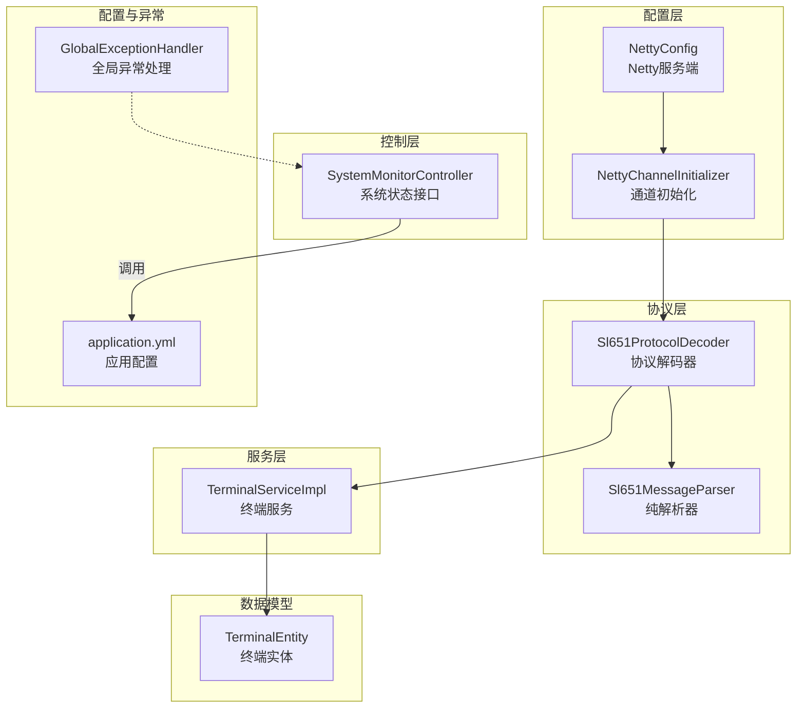
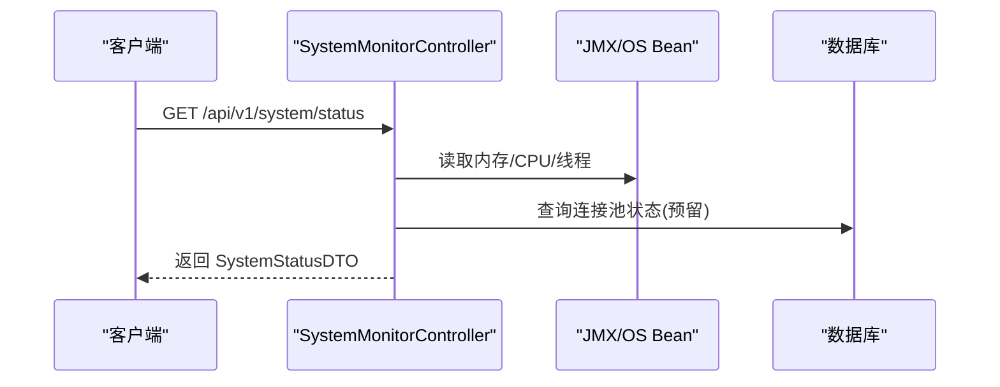
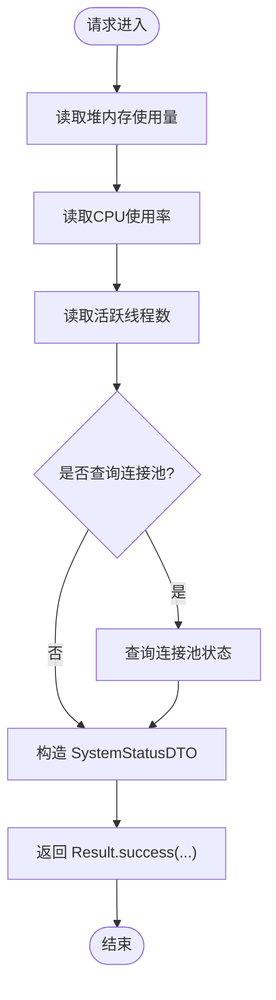
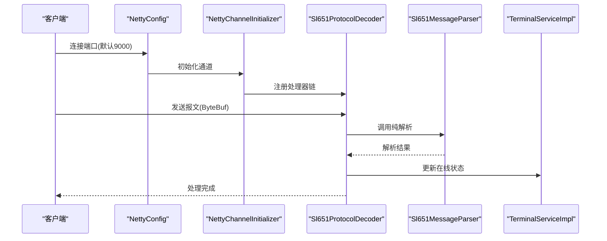
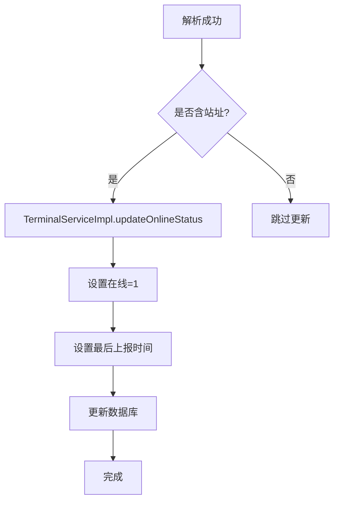
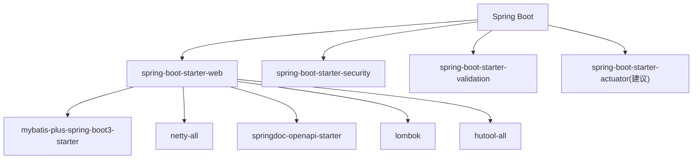
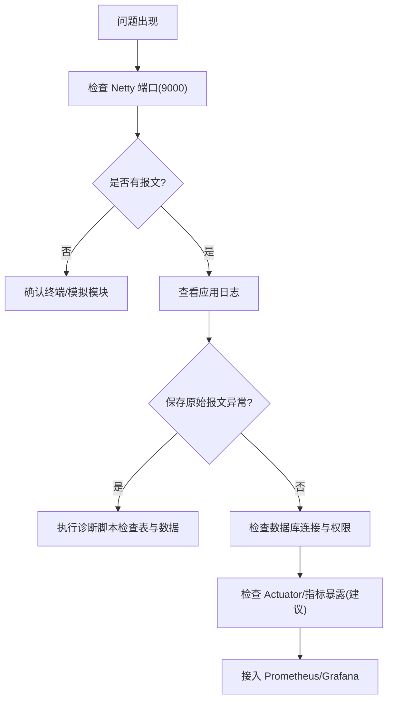

# 监控告警

<cite>
**本文引用的文件**   
- [SystemMonitorController.java](file://src/main/java/com/hydro/monitor/modules/controller/SystemMonitorController.java)
- [SystemStatusDTO.java](file://src/main/java/com/hydro/monitor/modules/dto/SystemStatusDTO.java)
- [Result.java](file://src/main/java/com/hydro/monitor/common/Result.java)
- [NettyConfig.java](file://src/main/java/com/hydro/monitor/config/NettyConfig.java)
- [NettyChannelInitializer.java](file://src/main/java/com/hydro/monitor/config/NettyChannelInitializer.java)
- [Sl651ProtocolDecoder.java](file://src/main/java/com/hydro/monitor/netty/Sl651ProtocolDecoder.java)
- [Sl651MessageParser.java](file://src/main/java/com/hydro/monitor/netty/Sl651MessageParser.java)
- [TerminalServiceImpl.java](file://src/main/java/com/hydro/monitor/modules/service/impl/TerminalServiceImpl.java)
- [TerminalEntity.java](file://src/main/java/com/hydro/monitor/modules/entity/TerminalEntity.java)
- [application.yml](file://src/main/resources/application.yml)
- [GlobalExceptionHandler.java](file://src/main/java/com/hydro/monitor/common/GlobalExceptionHandler.java)
- [SystemMonitorControllerTest.java](file://src/test/java/com/hydro/monitor/modules/controller/SystemMonitorControllerTest.java)
- [Sl651ProtocolDecoderTest.java](file://src/test/java/com/hydro/monitor/netty/Sl651ProtocolDecoderTest.java)
- [Sl651MessageParserTest.java](file://src/test/java/com/hydro/monitor/netty/Sl651MessageParserTest.java)
- [check-raw-message.bat](file://check-raw-message.bat)
- [pom.xml](file://pom.xml)
</cite>

## 目录
1. [简介](#简介)
2. [项目结构](#项目结构)
3. [核心组件](#核心组件)
4. [架构总览](#架构总览)
5. [详细组件分析](#详细组件分析)
6. [依赖分析](#依赖分析)
7. [性能考虑](#性能考虑)
8. [故障排查指南](#故障排查指南)
9. [结论](#结论)
10. [附录](#附录)

## 简介
本指南面向“水文监测系统”的监控与告警，围绕系统运行状态采集、健康检查、告警规则配置、Prometheus/Grafana集成以及日志与错误追踪展开。系统采用 Spring Boot + Netty 架构，提供基于 SL 651-2014 的遥测报文接收与解析，并通过统一响应体与全局异常处理保障可观测性。

## 项目结构
- 控制层：对外暴露系统状态查询接口
- 配置层：Netty 服务端启动、通道初始化与处理器链
- 协议层：SL 651 报文解析与业务落库
- 服务层：终端在线状态维护与数据持久化
- 配置与测试：应用配置、全局异常处理、单元测试与诊断脚本

**图示来源**
- [SystemMonitorController.java:34-66](file://src/main/java/com/hydro/monitor/modules/controller/SystemMonitorController.java#L34-L66)
- [NettyConfig.java:39-70](file://src/main/java/com/hydro/monitor/config/NettyConfig.java#L39-L70)
- [NettyChannelInitializer.java:22-34](file://src/main/java/com/hydro/monitor/config/NettyChannelInitializer.java#L22-L34)
- [Sl651ProtocolDecoder.java:53-89](file://src/main/java/com/hydro/monitor/netty/Sl651ProtocolDecoder.java#L53-L89)
- [Sl651MessageParser.java:66-106](file://src/main/java/com/hydro/monitor/netty/Sl651MessageParser.java#L66-L106)
- [TerminalServiceImpl.java:175-199](file://src/main/java/com/hydro/monitor/modules/service/impl/TerminalServiceImpl.java#L175-L199)
- [TerminalEntity.java:16-74](file://src/main/java/com/hydro/monitor/modules/entity/terminalEntity.java#L16-L74)
- [application.yml:1-86](file://src/main/resources/application.yml#L1-L86)
- [GlobalExceptionHandler.java:15-57](file://src/main/java/com/hydro/monitor/common/GlobalExceptionHandler.java#L15-L57)

**章节来源**
- [application.yml:1-86](file://src/main/resources/application.yml#L1-L86)
- [pom.xml:1-179](file://pom.xml#L1-L179)

## 核心组件
- 系统状态接口：提供内存、CPU、线程数等基础指标；数据库连接池活跃/总数指标预留扩展点
- Netty 服务端：异步启动、优雅停机、通道处理器链
- SL 651 协议解码器：接收报文、调用纯解析器、持久化、更新终端在线状态
- 终端服务：维护在线状态与最后上报时间
- 全局异常处理：统一错误响应，便于监控与告警

**章节来源**
- [SystemMonitorController.java:34-66](file://src/main/java/com/hydro/monitor/modules/controller/SystemMonitorController.java#L34-L66)
- [SystemStatusDTO.java:8-39](file://src/main/java/com/hydro/monitor/modules/dto/SystemStatusDTO.java#L8-L39)
- [NettyConfig.java:39-85](file://src/main/java/com/hydro/monitor/config/NettyConfig.java#L39-L85)
- [Sl651ProtocolDecoder.java:53-89](file://src/main/java/com/hydro/monitor/netty/Sl651ProtocolDecoder.java#L53-L89)
- [TerminalServiceImpl.java:175-199](file://src/main/java/com/hydro/monitor/modules/service/impl/TerminalServiceImpl.java#L175-L199)
- [GlobalExceptionHandler.java:15-57](file://src/main/java/com/hydro/monitor/common/GlobalExceptionHandler.java#L15-L57)

## 架构总览
系统监控与告警涉及“采集—处理—存储—展示—告警”闭环。当前仓库实现了采集与处理的关键节点，建议在生产环境补充 Prometheus Exporter、Grafana 仪表盘与告警规则。

**图示来源**
- [SystemMonitorController.java:34-66](file://src/main/java/com/hydro/monitor/modules/controller/SystemMonitorController.java#L34-L66)
- [SystemStatusDTO.java:8-39](file://src/main/java/com/hydro/monitor/modules/dto/SystemStatusDTO.java#L8-L39)

## 详细组件分析

### 系统监控接口与指标采集
- 接口路径：/api/v1/system/status
- 指标内容：
  - JVM 已用内存（MB）、最大内存（MB）
  - CPU 使用率（%）
  - 活跃线程数
  - 数据库连接池活跃连接数、总连接数（预留）
- 返回体：Result<SystemStatusDTO>，统一响应封装

**图示来源**
- [SystemMonitorController.java:36-66](file://src/main/java/com/hydro/monitor/modules/controller/SystemMonitorController.java#L36-L66)
- [SystemStatusDTO.java:8-39](file://src/main/java/com/hydro/monitor/modules/dto/SystemStatusDTO.java#L8-L39)
- [Result.java:35-50](file://src/main/java/com/hydro/monitor/common/Result.java#L35-L50)

**章节来源**
- [SystemMonitorController.java:34-66](file://src/main/java/com/hydro/monitor/modules/controller/SystemMonitorController.java#L34-L66)
- [SystemStatusDTO.java:8-39](file://src/main/java/com/hydro/monitor/modules/dto/SystemStatusDTO.java#L8-L39)
- [Result.java:12-78](file://src/main/java/com/hydro/monitor/common/Result.java#L12-L78)

### Netty 服务端与通道处理链
- NettyConfig：CommandLineRunner 启动服务端，端口来自配置；优雅停机释放 EventLoopGroup
- NettyChannelInitializer：装配日志处理器（可选）、帧解码器、协议解码器
- Sl651ProtocolDecoder：接收 ByteBuf → 保存原始报文 → 纯解析 → 按类型持久化 → 更新终端在线状态

**图示来源**
- [NettyConfig.java:39-70](file://src/main/java/com/hydro/monitor/config/NettyConfig.java#L39-L70)
- [NettyChannelInitializer.java:22-34](file://src/main/java/com/hydro/monitor/config/NettyChannelInitializer.java#L22-L34)
- [Sl651ProtocolDecoder.java:53-89](file://src/main/java/com/hydro/monitor/netty/Sl651ProtocolDecoder.java#L53-L89)
- [Sl651MessageParser.java:66-106](file://src/main/java/com/hydro/monitor/netty/Sl651MessageParser.java#L66-L106)
- [TerminalServiceImpl.java:175-199](file://src/main/java/com/hydro/monitor/modules/service/impl/TerminalServiceImpl.java#L175-L199)

**章节来源**
- [NettyConfig.java:26-85](file://src/main/java/com/hydro/monitor/config/NettyConfig.java#L26-L85)
- [NettyChannelInitializer.java:16-35](file://src/main/java/com/hydro/monitor/config/NettyChannelInitializer.java#L16-L35)
- [Sl651ProtocolDecoder.java:39-278](file://src/main/java/com/hydro/monitor/netty/Sl651ProtocolDecoder.java#L39-L278)
- [Sl651MessageParser.java:38-606](file://src/main/java/com/hydro/monitor/netty/Sl651MessageParser.java#L38-L606)
- [TerminalServiceImpl.java:175-199](file://src/main/java/com/hydro/monitor/modules/service/impl/TerminalServiceImpl.java#L175-L199)

### 终端在线状态与数据持久化
- 终端实体包含在线状态与最后上报时间字段
- 协议解码器在解析成功后根据站址更新在线状态
- 服务层若终端不存在则自动创建

**图示来源**
- [Sl651ProtocolDecoder.java:82-88](file://src/main/java/com/hydro/monitor/netty/Sl651ProtocolDecoder.java#L82-L88)
- [TerminalServiceImpl.java:175-199](file://src/main/java/com/hydro/monitor/modules/service/impl/TerminalServiceImpl.java#L175-L199)
- [TerminalEntity.java:67-73](file://src/main/java/com/hydro/monitor/modules/entity/TerminalEntity.java#L67-L73)

**章节来源**
- [TerminalServiceImpl.java:175-199](file://src/main/java/com/hydro/monitor/modules/service/impl/TerminalServiceImpl.java#L175-L199)
- [TerminalEntity.java:16-74](file://src/main/java/com/hydro/monitor/modules/entity/TerminalEntity.java#L16-L74)

### 健康检查与可用性
- 当前未实现专用健康检查接口，建议新增 /health 接口返回应用、数据库、外部服务可用性
- 可结合 Spring Boot Actuator（需引入依赖与配置）增强健康检查能力
- 全局异常处理确保错误统一返回，利于监控系统识别异常

**章节来源**
- [GlobalExceptionHandler.java:15-57](file://src/main/java/com/hydro/monitor/common/GlobalExceptionHandler.java#L15-L57)

### 告警规则配置（建议）
- 阈值与级别
  - CPU 使用率 > 80%（警告），> 90%（严重）
  - 内存使用率 > 85%（警告），> 95%（严重）
  - 活跃线程数 > 预设上限（警告）
  - 数据库连接池活跃连接数持续接近上限（警告）
  - Netty 服务端异常或端口不可达（严重）
- 告警级别
  - 信息（Info）、警告（Warn）、严重（Critical）
- 通知渠道
  - 邮件、企业微信、钉钉、短信等（结合具体平台）

说明：以上为通用实践建议，具体阈值需结合业务峰值与硬件规格评估。

### Prometheus 监控集成与 Grafana 仪表盘（建议）
- Prometheus 抓取
  - 若引入 Spring Boot Actuator，可通过 /actuator/prometheus 暴露指标
  - 自定义指标：通过 MeterRegistry 注册系统状态、报文处理速率、异常计数等
- Grafana 仪表盘
  - CPU 使用率、内存使用率、线程数趋势
  - 数据库连接池活跃/总连接数
  - Netty 连接状态与报文吞吐
  - 错误率与异常分布

说明：上述为集成建议，需按实际部署与指标暴露情况调整。

## 依赖分析
- Spring Boot Web/Spring Security/Validation/Actuator（建议引入）
- Netty（已引入）
- MyBatis-Plus（已引入）
- MySQL Connector（已引入）
- Lombok、Hutool、SpringDoc OpenAPI（已引入）
- 日志与 DevTools（已引入）

**图示来源**
- [pom.xml:30-153](file://pom.xml#L30-L153)

**章节来源**
- [pom.xml:1-179](file://pom.xml#L1-L179)

## 性能考虑
- Netty 异步非阻塞：报文解析与持久化分离，避免阻塞事件循环
- 异步保存原始报文：使用 CompletableFuture.runAsync，降低主链路延迟
- 分页拦截器：MyBatis-Plus 分页限制，防止超大数据量查询
- 日志级别：生产环境建议提升日志级别，减少高频日志对性能影响

**章节来源**
- [Sl651ProtocolDecoder.java:234-249](file://src/main/java/com/hydro/monitor/netty/Sl651ProtocolDecoder.java#L234-L249)
- [MyBatisPlusConfig.java:23-37](file://src/main/java/com/hydro/monitor/config/MyBatisPlusConfig.java#L23-L37)
- [application.yml:62-77](file://src/main/resources/application.yml#L62-L77)

## 故障排查指南
- 原始报文保存问题诊断
  - 使用批处理脚本检查数据库表是否存在、是否有数据、查看最近记录
  - 关联 Netty 服务端是否启动、是否有终端发送报文、应用日志是否有异常
- 单元测试辅助定位
  - 协议解析与解码器测试覆盖功能码、标识符、数值解析等场景
  - 系统监控接口测试关注认证与数据结构
- 全局异常处理
  - 统一捕获业务异常、权限异常与通用异常，便于监控系统识别错误

**图示来源**
- [check-raw-message.bat:8-45](file://check-raw-message.bat#L8-L45)
- [Sl651ProtocolDecoder.java:203-249](file://src/main/java/com/hydro/monitor/netty/Sl651ProtocolDecoder.java#L203-L249)
- [SystemMonitorControllerTest.java:29-47](file://src/test/java/com/hydro/monitor/modules/controller/SystemMonitorControllerTest.java#L29-L47)
- [Sl651ProtocolDecoderTest.java:45-68](file://src/test/java/com/hydro/monitor/netty/Sl651ProtocolDecoderTest.java#L45-L68)
- [Sl651MessageParserTest.java:31-100](file://src/test/java/com/hydro/monitor/netty/Sl651MessageParserTest.java#L31-L100)

**章节来源**
- [check-raw-message.bat:1-46](file://check-raw-message.bat#L1-L46)
- [Sl651ProtocolDecoderTest.java:39-198](file://src/test/java/com/hydro/monitor/netty/Sl651ProtocolDecoderTest.java#L39-L198)
- [Sl651MessageParserTest.java:1-137](file://src/test/java/com/hydro/monitor/netty/Sl651MessageParserTest.java#L1-L137)
- [SystemMonitorControllerTest.java:1-61](file://src/test/java/com/hydro/monitor/modules/controller/SystemMonitorControllerTest.java#L1-L61)
- [GlobalExceptionHandler.java:15-57](file://src/main/java/com/hydro/monitor/common/GlobalExceptionHandler.java#L15-L57)

## 结论
本系统已具备基础系统状态采集与 Netty 报文处理能力，建议在生产环境中补充健康检查接口、Prometheus 指标暴露、Grafana 仪表盘与完善的告警规则，形成闭环的监控与告警体系，确保水文监测系统的稳定运行与快速故障定位。

## 附录
- 配置要点
  - Netty 服务端端口：application.yml 中 netty.server.port
  - 日志级别与输出：application.yml 中 logging.level 与 logging.file
  - JWT 密钥与过期：application.yml 中 jwt.secret 与 jwt.expiration
- 建议引入的依赖（按需）
  - Spring Boot Actuator：/actuator/health、/actuator/prometheus
  - Micrometer + Prometheus：指标导出
  - SpringDoc：OpenAPI 文档与 Swagger UI

**章节来源**
- [application.yml:43-86](file://src/main/resources/application.yml#L43-L86)
- [pom.xml:30-153](file://pom.xml#L30-L153)