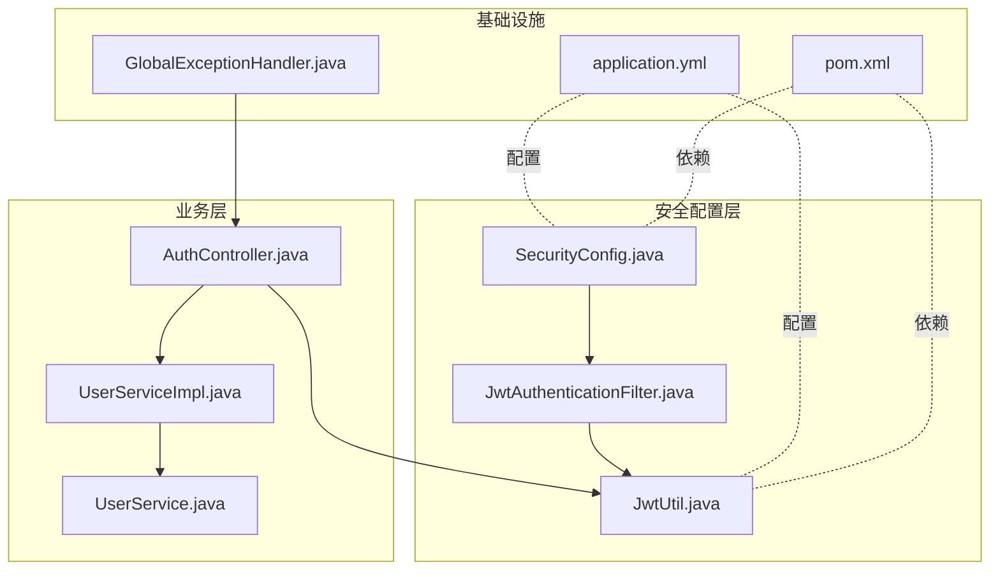
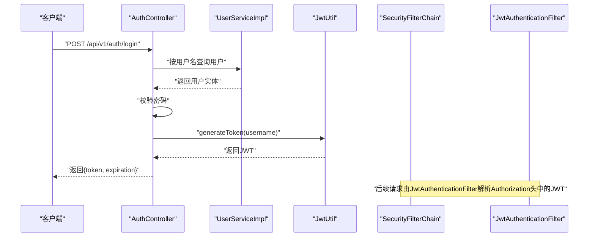
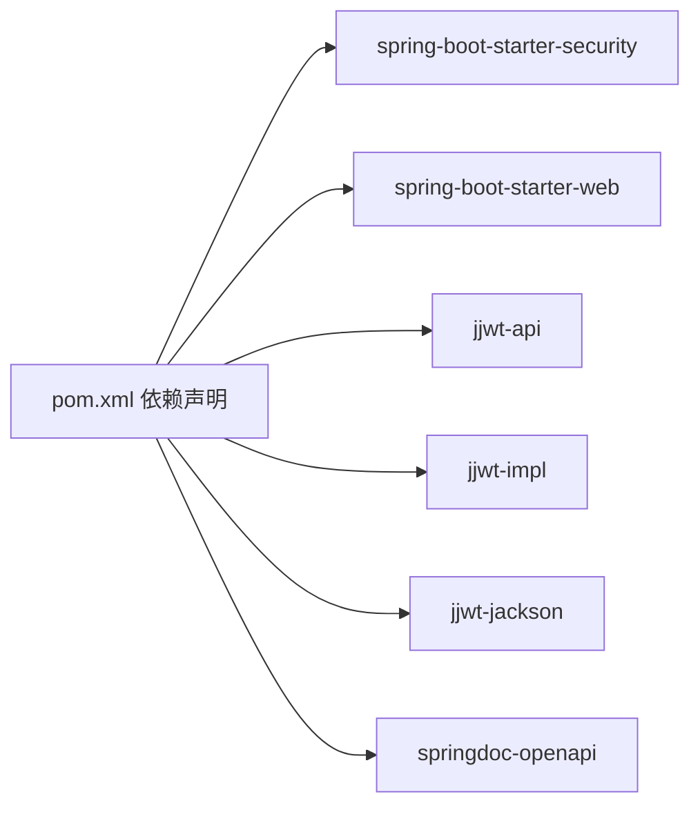

# 安全加固

<cite>
**本文引用的文件**
- [SecurityConfig.java](file://src/main/java/com/hydro/monitor/config/security/SecurityConfig.java)
- [JwtAuthenticationFilter.java](file://src/main/java/com/hydro/monitor/config/security/JwtAuthenticationFilter.java)
- [JwtUtil.java](file://src/main/java/com/hydro/monitor/config/security/JwtUtil.java)
- [AuthController.java](file://src/main/java/com/hydro/monitor/modules/controller/AuthController.java)
- [application.yml](file://src/main/resources/application.yml)
- [GlobalExceptionHandler.java](file://src/main/java/com/hydro/monitor/common/GlobalExceptionHandler.java)
- [pom.xml](file://pom.xml)
- [JwtUtilTest.java](file://src/test/java/com/hydro/monitor/config/security/JwtUtilTest.java)
- [AuthControllerTest.java](file://src/test/java/com/hydro/monitor/modules/controller/AuthControllerTest.java)
- [Result.java](file://src/main/java/com/hydro/monitor/common/Result.java)
- [LoginResponseDTO.java](file://src/main/java/com/hydro/monitor/modules/dto/LoginResponseDTO.java)
- [UserService.java](file://src/main/java/com/hydro/monitor/modules/service/UserService.java)
- [UserServiceImpl.java](file://src/main/java/com/hydro/monitor/modules/service/impl/UserServiceImpl.java)
- [README.md](file://README.md)
</cite>

## 目录
1. [引言](#引言)
2. [项目结构](#项目结构)
3. [核心组件](#核心组件)
4. [架构总览](#架构总览)
5. [详细组件分析](#详细组件分析)
6. [依赖分析](#依赖分析)
7. [性能考虑](#性能考虑)
8. [故障排查指南](#故障排查指南)
9. [结论](#结论)
10. [附录](#附录)

## 引言
本指南面向水文监测系统的安全加固工作，聚焦以下目标：
- Spring Security 配置优化：安全过滤器链、CSRF 与 CORS 策略建议
- JWT 安全配置：密钥管理、过期时间与令牌刷新机制
- 网络安全加固：防火墙、端口管理与 SSL/TLS 加密
- 漏洞扫描与渗透测试：OWASP Top 10 防护与常见攻击防护
- 安全日志、异常监控与安全事件响应流程

本指南基于仓库现有实现进行分析，并提供可操作的加固建议。

## 项目结构
后端采用 Spring Boot 3 + Spring Security 6 + Netty 的技术栈，安全相关代码集中在安全配置、JWT 工具与认证控制器中；全局异常处理统一输出错误信息；配置文件集中管理 JWT、日志与网络端口等参数。

图表来源
- [SecurityConfig.java:1-76](file://src/main/java/com/hydro/monitor/config/security/SecurityConfig.java#L1-L76)
- [JwtAuthenticationFilter.java:1-75](file://src/main/java/com/hydro/monitor/config/security/JwtAuthenticationFilter.java#L1-L75)
- [JwtUtil.java:1-126](file://src/main/java/com/hydro/monitor/config/security/JwtUtil.java#L1-L126)
- [AuthController.java:1-68](file://src/main/java/com/hydro/monitor/modules/controller/AuthController.java#L1-L68)
- [application.yml:1-86](file://src/main/resources/application.yml#L1-L86)
- [GlobalExceptionHandler.java:1-58](file://src/main/java/com/hydro/monitor/common/GlobalExceptionHandler.java#L1-L58)
- [pom.xml:1-179](file://pom.xml#L1-L179)

章节来源
- [SecurityConfig.java:1-76](file://src/main/java/com/hydro/monitor/config/security/SecurityConfig.java#L1-L76)
- [application.yml:1-86](file://src/main/resources/application.yml#L1-L86)

## 核心组件
- 安全过滤器链：禁用 CSRF，无状态会话，公开接口放行，其余接口需认证，并在用户名密码过滤器之前添加 JWT 过滤器。
- JWT 工具：支持生成、解析、验证与过期判断，密钥与过期时间来自配置文件。
- 认证控制器：接收用户名/密码，校验后签发 JWT，返回 token 与过期时间。
- 全局异常处理：捕获权限拒绝与通用异常，统一输出标准响应体。
- 配置中心：集中管理 JWT 密钥、过期时间、日志级别与端口等。

章节来源
- [SecurityConfig.java:33-52](file://src/main/java/com/hydro/monitor/config/security/SecurityConfig.java#L33-L52)
- [JwtUtil.java:37-48](file://src/main/java/com/hydro/monitor/config/security/JwtUtil.java#L37-L48)
- [AuthController.java:41-66](file://src/main/java/com/hydro/monitor/modules/controller/AuthController.java#L41-L66)
- [GlobalExceptionHandler.java:25-56](file://src/main/java/com/hydro/monitor/common/GlobalExceptionHandler.java#L25-L56)
- [application.yml:48-51](file://src/main/resources/application.yml#L48-L51)

## 架构总览
下图展示认证流程与安全过滤器链交互：

图表来源
- [AuthController.java:41-66](file://src/main/java/com/hydro/monitor/modules/controller/AuthController.java#L41-L66)
- [UserServiceImpl.java:123-129](file://src/main/java/com/hydro/monitor/modules/service/impl/UserServiceImpl.java#L123-L129)
- [JwtUtil.java:37-48](file://src/main/java/com/hydro/monitor/config/security/JwtUtil.java#L37-L48)
- [SecurityConfig.java:34-52](file://src/main/java/com/hydro/monitor/config/security/SecurityConfig.java#L34-L52)
- [JwtAuthenticationFilter.java:32-59](file://src/main/java/com/hydro/monitor/config/security/JwtAuthenticationFilter.java#L32-L59)

## 详细组件分析

### Spring Security 配置优化
- CSRF 禁用：因使用 JWT 无状态认证，禁用 CSRF 符合设计。
- 会话策略：STATELESS，避免会话劫持与服务端状态膨胀。
- 授权规则：对认证接口与文档接口放行，其余接口要求认证。
- 过滤器链：在用户名密码过滤器前插入 JWT 过滤器，确保鉴权上下文提前建立。

建议补充：
- CORS 策略：如前端跨域访问，需显式配置允许的源、方法与头部，避免默认宽松策略导致风险。
- 安全响应头：建议增加 HSTS、X-Content-Type-Options、X-Frame-Options、Referrer-Policy 等。
- 最小权限与细粒度授权：结合角色/权限注解对具体接口进行更严格的访问控制。

章节来源
- [SecurityConfig.java:34-52](file://src/main/java/com/hydro/monitor/config/security/SecurityConfig.java#L34-L52)

### JWT 安全配置
- 密钥管理：密钥来源于配置文件，需在生产环境替换为强随机密钥并妥善保管。
- 过期时间：默认 24 小时，可通过配置调整；建议结合刷新机制降低风险暴露窗口。
- 令牌签发：登录成功后生成 JWT 并返回给客户端，客户端后续请求需在 Authorization 头中携带 Bearer Token。
- 令牌验证：JWT 过滤器从请求头提取 Token，调用工具类验证有效性与未过期。

建议补充：
- 令牌刷新：当前实现未提供刷新接口，建议新增刷新端点，使用短期访问令牌与长期刷新令牌，配合安全存储与撤销机制。
- 密钥轮换：支持密钥热切换与历史密钥验证，保障迁移期间的连续性。
- Token 存储：前端避免明文存储，建议使用 HttpOnly Cookie 或安全存储方案。

章节来源
- [JwtUtil.java:25-29](file://src/main/java/com/hydro/monitor/config/security/JwtUtil.java#L25-L29)
- [JwtUtil.java:37-48](file://src/main/java/com/hydro/monitor/config/security/JwtUtil.java#L37-L48)
- [JwtUtil.java:67-75](file://src/main/java/com/hydro/monitor/config/security/JwtUtil.java#L67-L75)
- [application.yml:48-51](file://src/main/resources/application.yml#L48-L51)
- [AuthController.java:59-65](file://src/main/java/com/hydro/monitor/modules/controller/AuthController.java#L59-L65)

### 认证流程与异常处理
- 登录流程：控制器接收用户名/密码，查询用户并校验密码，成功则生成 JWT 返回。
- 异常处理：全局异常处理器对权限拒绝与通用异常进行统一处理，返回标准响应体。

建议补充：
- 登录失败防爆破：集成速率限制与账户锁定策略。
- 审计日志：记录登录尝试、成功与失败事件，便于追踪与告警。

章节来源
- [AuthController.java:41-66](file://src/main/java/com/hydro/monitor/modules/controller/AuthController.java#L41-L66)
- [GlobalExceptionHandler.java:25-56](file://src/main/java/com/hydro/monitor/common/GlobalExceptionHandler.java#L25-L56)
- [Result.java:35-77](file://src/main/java/com/hydro/monitor/common/Result.java#L35-L77)
- [LoginResponseDTO.java:8-19](file://src/main/java/com/hydro/monitor/modules/dto/LoginResponseDTO.java#L8-L19)

### JWT 过滤器与请求拦截
- 过滤器逻辑：从 Authorization 头提取 Bearer Token，验证通过后在 SecurityContext 中设置认证信息。
- 异常处理：验证失败时记录错误日志，不影响请求继续传递。

建议补充：
- 严格校验：对空 Token、格式错误、签名失败等情况快速失败并返回明确错误。
- 性能优化：缓存密钥与常用解析结果，减少重复计算。

章节来源
- [JwtAuthenticationFilter.java:32-59](file://src/main/java/com/hydro/monitor/config/security/JwtAuthenticationFilter.java#L32-L59)
- [JwtAuthenticationFilter.java:67-73](file://src/main/java/com/hydro/monitor/config/security/JwtAuthenticationFilter.java#L67-L73)

### 单元测试与行为验证
- JWT 工具测试：覆盖生成、解析、验证、过期时间等关键路径。
- 认证控制器测试：覆盖登录成功、失败与请求格式错误场景。

建议补充：
- 安全测试：增加对无效 Token、篡改 Token、过期 Token 的边界测试。
- 渗透测试：结合自动化工具与手工测试，验证 SQL 注入、命令注入、XSS、CSRF 等。

章节来源
- [JwtUtilTest.java:36-154](file://src/test/java/com/hydro/monitor/config/security/JwtUtilTest.java#L36-L154)
- [AuthControllerTest.java:51-112](file://src/test/java/com/hydro/monitor/modules/controller/AuthControllerTest.java#L51-L112)

## 依赖分析
- Spring Security 6：提供安全过滤器链与认证管理器。
- JWT（JJWT）：提供签发、解析与验证能力。
- SpringDoc OpenAPI：提供 API 文档与 UI，需纳入安全放行范围。

图表来源
- [pom.xml:30-108](file://pom.xml#L30-L108)

章节来源
- [pom.xml:30-108](file://pom.xml#L30-L108)

## 性能考虑
- 无状态会话：避免服务端会话存储，降低内存与扩展压力。
- JWT 解析：建议缓存密钥与解析结果，减少重复计算。
- 过滤器链：仅在必要处进行解析与验证，避免冗余开销。
- 日志级别：生产环境适当降低日志量，避免 I/O 影响。

## 故障排查指南
- 登录失败
  - 检查用户名是否存在与密码是否匹配。
  - 查看全局异常处理器返回的错误码与消息。
- JWT 验证失败
  - 检查请求头 Authorization 是否为 Bearer Token。
  - 核对密钥与过期时间配置是否正确。
  - 关注过滤器日志与工具类异常记录。
- 权限拒绝
  - 确认接口授权规则与放行列表。
  - 检查用户角色与权限是否满足。

章节来源
- [AuthController.java:48-57](file://src/main/java/com/hydro/monitor/modules/controller/AuthController.java#L48-L57)
- [GlobalExceptionHandler.java:38-43](file://src/main/java/com/hydro/monitor/common/GlobalExceptionHandler.java#L38-L43)
- [JwtAuthenticationFilter.java:54-56](file://src/main/java/com/hydro/monitor/config/security/JwtAuthenticationFilter.java#L54-L56)
- [SecurityConfig.java:41-47](file://src/main/java/com/hydro/monitor/config/security/SecurityConfig.java#L41-L47)

## 结论
当前系统已具备基于 JWT 的无状态认证与基础安全过滤器链配置。建议在生产环境中完善 CORS 策略、增强安全响应头、实施令牌刷新与密钥轮换、强化日志与审计，并结合 OWASP Top 10 进行渗透测试与持续监控，以形成闭环的安全加固体系。

## 附录

### 生产环境加固清单
- 密钥管理
  - 使用强随机密钥并安全存储，定期轮换。
  - 参考：[application.yml:48-51](file://src/main/resources/application.yml#L48-L51)
- 过期时间与刷新
  - 合理设置过期时间，提供安全的刷新机制。
  - 参考：[JwtUtil.java:25-29](file://src/main/java/com/hydro/monitor/config/security/JwtUtil.java#L25-L29)
- CORS 与 CSRF
  - 显式配置允许的源、方法与头部；因使用 JWT，CSRF 已禁用。
  - 参考：[SecurityConfig.java:36-37](file://src/main/java/com/hydro/monitor/config/security/SecurityConfig.java#L36-L37)
- 网络安全
  - 仅开放必要端口，启用 HTTPS，配置防火墙规则。
  - 参考：[application.yml:1-2](file://src/main/resources/application.yml#L1-L2)
- 漏洞扫描与渗透测试
  - 结合自动化工具与手工测试，覆盖 OWASP Top 10。
  - 参考：[README.md:108-113](file://README.md#L108-L113)
- 安全日志与事件响应
  - 统一异常处理与审计日志，建立告警与应急响应流程。
  - 参考：[GlobalExceptionHandler.java:25-56](file://src/main/java/com/hydro/monitor/common/GlobalExceptionHandler.java#L25-L56)