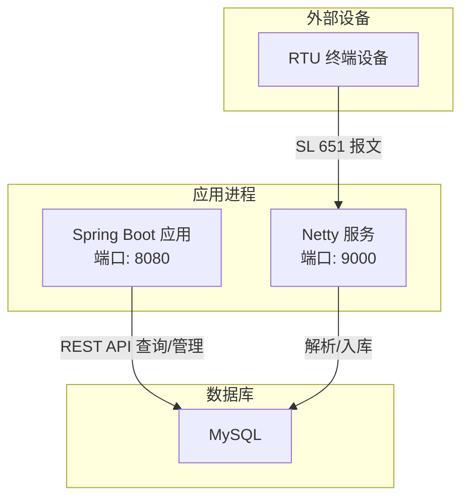
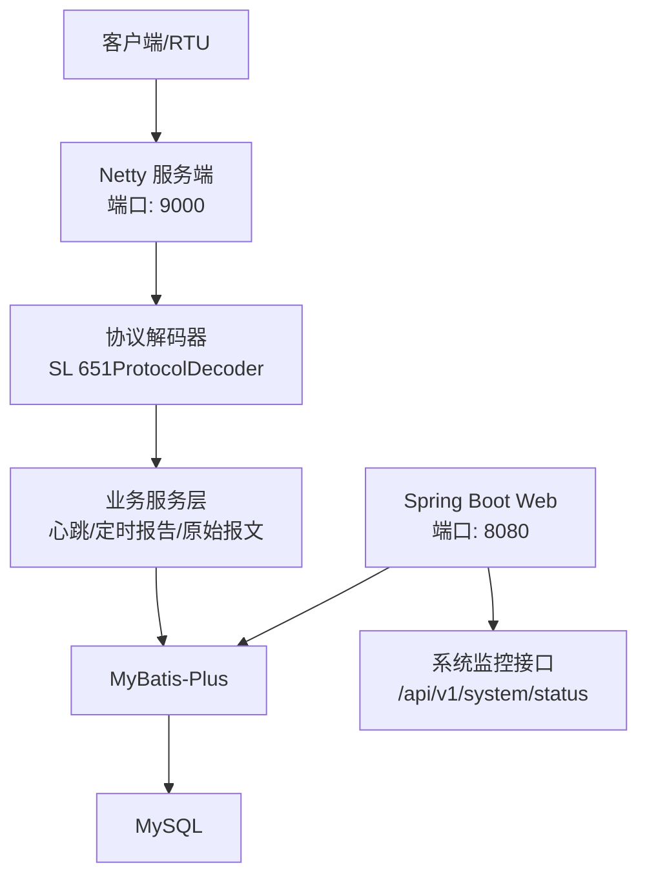
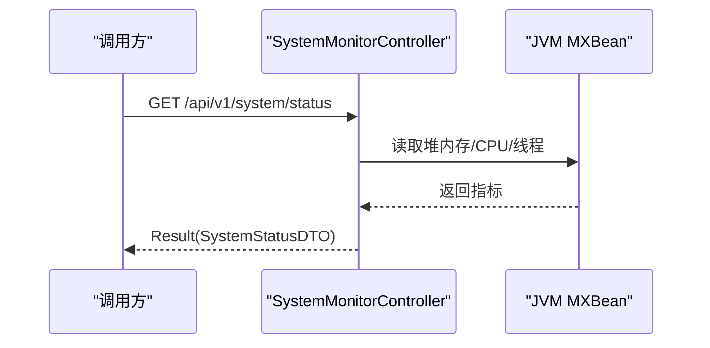
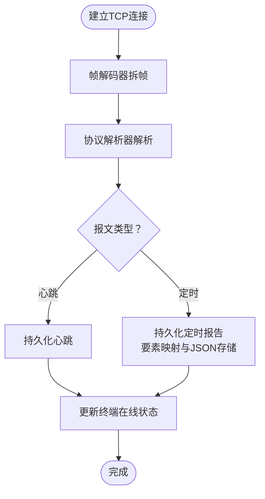
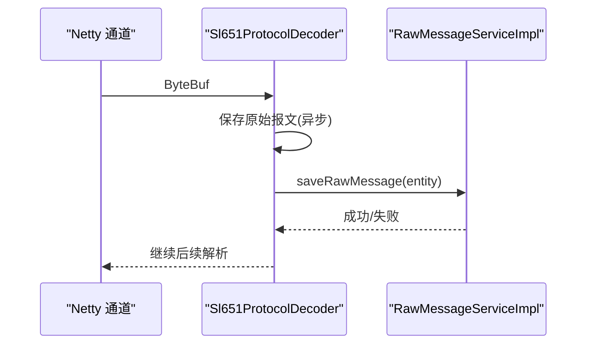
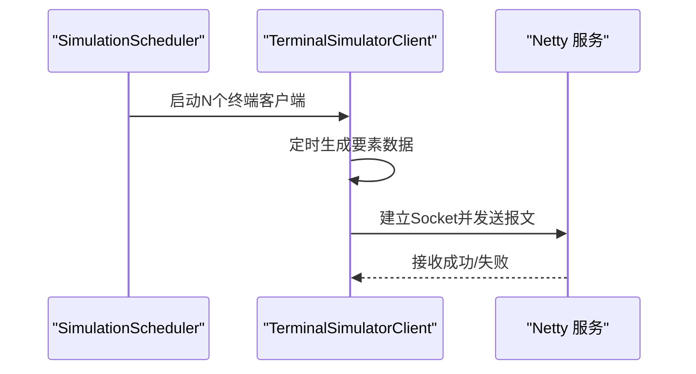
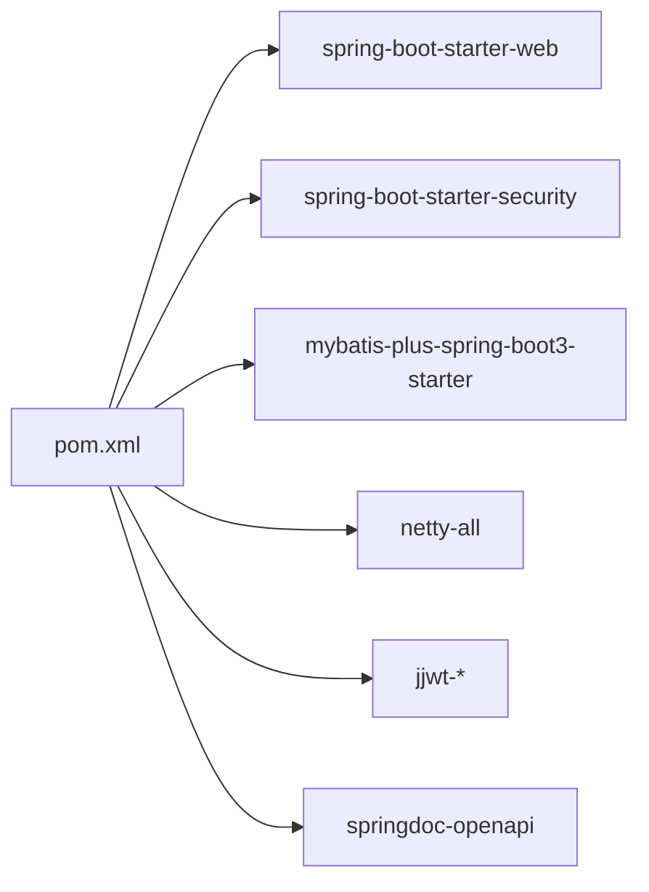

# 容量规划

<cite>
**本文引用的文件**
- [HydroMonitorApplication.java](file://src/main/java/com/hydro/monitor/HydroMonitorApplication.java)
- [application.yml](file://src/main/resources/application.yml)
- [pom.xml](file://pom.xml)
- [README.md](file://README.md)
- [SystemMonitorController.java](file://src/main/java/com/hydro/monitor/modules/controller/SystemMonitorController.java)
- [SystemStatusDTO.java](file://src/main/java/com/hydro/monitor/modules/dto/SystemStatusDTO.java)
- [NettyConfig.java](file://src/main/java/com/hydro/monitor/config/NettyConfig.java)
- [NettyChannelInitializer.java](file://src/main/java/com/hydro/monitor/config/NettyChannelInitializer.java)
- [Sl651ProtocolDecoder.java](file://src/main/java/com/hydro/monitor/netty/Sl651ProtocolDecoder.java)
- [SimulationScheduler.java](file://src/main/java/com/hydro/monitor/simulation/SimulationScheduler.java)
- [TerminalSimulatorClient.java](file://src/main/java/com/hydro/monitor/simulation/TerminalSimulatorClient.java)
- [HeartbeatServiceImpl.java](file://src/main/java/com/hydro/monitor/modules/service/impl/HeartbeatServiceImpl.java)
- [RawMessageServiceImpl.java](file://src/main/java/com/hydro/monitor/modules/service/impl/RawMessageServiceImpl.java)
- [init.sql](file://src/main/resources/db/init.sql)
</cite>

## 目录
1. [简介](#简介)
2. [项目结构](#项目结构)
3. [核心组件](#核心组件)
4. [架构总览](#架构总览)
5. [详细组件分析](#详细组件分析)
6. [依赖分析](#依赖分析)
7. [性能考量](#性能考量)
8. [容量监控指标](#容量监控指标)
9. [扩容策略](#扩容策略)
10. [成本优化建议](#成本优化建议)
11. [容量规划模板](#容量规划模板)
12. [实施案例](#实施案例)
13. [故障排查指南](#故障排查指南)
14. [结论](#结论)

## 简介
本指南面向水文监测系统的容量规划与运维优化，围绕CPU、内存、网络带宽与存储空间的使用趋势进行预测与评估，结合系统当前架构（Spring Boot + Netty + MySQL + MyBatis-Plus），给出扩容策略（垂直与水平）、成本优化路径、容量监控指标与预警阈值，并提供可落地的容量规划模板与实施案例。

## 项目结构
系统采用分层架构：Web层（Spring MVC）、业务层（Service）、持久层（MyBatis-Plus）、网络接入层（Netty）。核心端口包括HTTP 8080与Netty 9000；系统提供基础的系统状态监控接口，便于容量评估与告警。

图表来源
- [HydroMonitorApplication.java:15-34](file://src/main/java/com/hydro/monitor/HydroMonitorApplication.java#L15-L34)
- [application.yml:1-86](file://src/main/resources/application.yml#L1-L86)
- [NettyConfig.java:47-70](file://src/main/java/com/hydro/monitor/config/NettyConfig.java#L47-L70)

章节来源
- [README.md:85-106](file://README.md#L85-L106)
- [application.yml:1-86](file://src/main/resources/application.yml#L1-L86)
- [HydroMonitorApplication.java:15-34](file://src/main/java/com/hydro/monitor/HydroMonitorApplication.java#L15-L34)

## 核心组件
- 启动入口与端口：应用启动后打印HTTP 8080与Netty 9000端口，便于定位服务与监控。
- 系统监控接口：提供内存、CPU、线程数等基础指标，便于容量评估。
- Netty 网络层：基于 NIO EventLoopGroup 的高性能网络服务，负责 SL 651 报文接入与解析。
- 业务处理：心跳与定时报文解析、要素映射、原始报文落库与异步处理。
- 数据持久化：MySQL 表结构包含心跳、定时报、要素配置、终端设备等，支持分页查询与索引。

章节来源
- [HydroMonitorApplication.java:15-34](file://src/main/java/com/hydro/monitor/HydroMonitorApplication.java#L15-L34)
- [SystemMonitorController.java:34-66](file://src/main/java/com/hydro/monitor/modules/controller/SystemMonitorController.java#L34-L66)
- [NettyConfig.java:47-70](file://src/main/java/com/hydro/monitor/config/NettyConfig.java#L47-L70)
- [Sl651ProtocolDecoder.java:53-89](file://src/main/java/com/hydro/monitor/netty/Sl651ProtocolDecoder.java#L53-L89)
- [init.sql:6-92](file://src/main/resources/db/init.sql#L6-L92)

## 架构总览
系统以“HTTP API + Netty 接入 + MySQL 存储”为核心，网络侧采用 Netty 的事件循环模型处理并发连接，业务侧通过 MyBatis-Plus 进行数据持久化。系统状态监控接口提供基础资源指标，便于容量规划与告警。

图表来源
- [NettyConfig.java:47-70](file://src/main/java/com/hydro/monitor/config/NettyConfig.java#L47-L70)
- [NettyChannelInitializer.java:22-34](file://src/main/java/com/hydro/monitor/config/NettyChannelInitializer.java#L22-L34)
- [Sl651ProtocolDecoder.java:35-48](file://src/main/java/com/hydro/monitor/netty/Sl651ProtocolDecoder.java#L35-L48)
- [SystemMonitorController.java:22-26](file://src/main/java/com/hydro/monitor/modules/controller/SystemMonitorController.java#L22-L26)

## 详细组件分析

### 系统监控接口与指标
- 提供内存使用、最大内存、CPU 使用率、活跃线程数等指标，便于容量评估。
- 当前实现未暴露数据库连接池指标，建议在生产环境注入数据源以获取活跃/总连接数。

图表来源
- [SystemMonitorController.java:34-66](file://src/main/java/com/hydro/monitor/modules/controller/SystemMonitorController.java#L34-L66)
- [SystemStatusDTO.java:8-39](file://src/main/java/com/hydro/monitor/modules/dto/SystemStatusDTO.java#L8-L39)

章节来源
- [SystemMonitorController.java:34-66](file://src/main/java/com/hydro/monitor/modules/controller/SystemMonitorController.java#L34-L66)
- [SystemStatusDTO.java:8-39](file://src/main/java/com/hydro/monitor/modules/dto/SystemStatusDTO.java#L8-L39)

### Netty 网络接入与处理流程
- 事件循环组：bossGroup(1) + workerGroup(默认线程数)，SO_BACKLOG=128，SO_KEEPALIVE=true。
- 管道：Sl651FrameDecoder（帧拆分）+ Sl651ProtocolDecoder（协议解析与入库）。
- 异常处理：通道异常时关闭连接，避免资源泄漏。

图表来源
- [NettyConfig.java:47-70](file://src/main/java/com/hydro/monitor/config/NettyConfig.java#L47-L70)
- [NettyChannelInitializer.java:22-34](file://src/main/java/com/hydro/monitor/config/NettyChannelInitializer.java#L22-L34)
- [Sl651ProtocolDecoder.java:53-89](file://src/main/java/com/hydro/monitor/netty/Sl651ProtocolDecoder.java#L53-L89)

章节来源
- [NettyConfig.java:47-70](file://src/main/java/com/hydro/monitor/config/NettyConfig.java#L47-L70)
- [NettyChannelInitializer.java:22-34](file://src/main/java/com/hydro/monitor/config/NettyChannelInitializer.java#L22-L34)
- [Sl651ProtocolDecoder.java:53-89](file://src/main/java/com/hydro/monitor/netty/Sl651ProtocolDecoder.java#L53-L89)

### 原始报文记录与异步入库
- 接收报文后先保存原始报文记录，采用异步任务避免阻塞Netty线程。
- 解析报文头提取站址、功能码、方向标识，便于后续审计与重放。

图表来源
- [Sl651ProtocolDecoder.java:203-249](file://src/main/java/com/hydro/monitor/netty/Sl651ProtocolDecoder.java#L203-L249)
- [RawMessageServiceImpl.java:32-52](file://src/main/java/com/hydro/monitor/modules/service/impl/RawMessageServiceImpl.java#L32-L52)

章节来源
- [Sl651ProtocolDecoder.java:203-249](file://src/main/java/com/hydro/monitor/netty/Sl651ProtocolDecoder.java#L203-L249)
- [RawMessageServiceImpl.java:32-52](file://src/main/java/com/hydro/monitor/modules/service/impl/RawMessageServiceImpl.java#L32-L52)

### 终端模拟上报（开发/压测）
- 支持通过配置开启/关闭，可设定终端数量、上报间隔、中心站地址、密码、站分类码。
- 使用真实 TCP Socket 连接向 Netty 服务发送 SL 651 报文，便于压测与联调。

图表来源
- [SimulationScheduler.java:45-96](file://src/main/java/com/hydro/monitor/simulation/SimulationScheduler.java#L45-L96)
- [TerminalSimulatorClient.java:56-90](file://src/main/java/com/hydro/monitor/simulation/TerminalSimulatorClient.java#L56-L90)
- [application.yml:79-86](file://src/main/resources/application.yml#L79-L86)

章节来源
- [SimulationScheduler.java:45-96](file://src/main/java/com/hydro/monitor/simulation/SimulationScheduler.java#L45-L96)
- [TerminalSimulatorClient.java:56-90](file://src/main/java/com/hydro/monitor/simulation/TerminalSimulatorClient.java#L56-L90)
- [application.yml:79-86](file://src/main/resources/application.yml#L79-L86)

## 依赖分析
- 核心技术栈：Spring Boot 3.5.9、Netty 4.1、MyBatis-Plus、MySQL 8.0+、SpringDoc。
- 端口与配置：HTTP 8080、Netty 9000；JWT 密钥、日志级别、模拟上报开关等。
- 依赖插件：Spring Boot Maven 插件、UTF-8 编码参数。

图表来源
- [pom.xml:30-153](file://pom.xml#L30-L153)

章节来源
- [pom.xml:21-28](file://pom.xml#L21-L28)
- [pom.xml:30-153](file://pom.xml#L30-L153)
- [application.yml:1-86](file://src/main/resources/application.yml#L1-L86)

## 性能考量
- 网络并发：Netty 默认 worker 线程数取决于 CPU 核心数，可通过调整线程组规模或事件循环参数优化高并发场景。
- 数据库写入：心跳与定时报告均采用插入操作，建议对高频写入表建立合适的索引与分区策略，减少锁竞争。
- 异步处理：原始报文保存采用异步任务，降低对网络线程的影响，但需关注线程池队列与拒绝策略。
- 解析复杂度：要素映射与 JSON 序列化存在额外开销，建议在要素数量较多时评估序列化成本。

章节来源
- [NettyConfig.java:47-70](file://src/main/java/com/hydro/monitor/config/NettyConfig.java#L47-L70)
- [Sl651ProtocolDecoder.java:140-182](file://src/main/java/com/hydro/monitor/netty/Sl651ProtocolDecoder.java#L140-L182)
- [RawMessageServiceImpl.java:32-52](file://src/main/java/com/hydro/monitor/modules/service/impl/RawMessageServiceImpl.java#L32-L52)

## 容量监控指标
- CPU 使用率：系统监控接口提供 CPU 使用率，建议结合系统负载与GC情况进行综合评估。
- 内存：JVM 堆内存使用与最大值，关注Full GC频率与停顿时间。
- 线程数：活跃线程数反映并发压力，Netty 线程池与业务线程池需分别监控。
- 数据库连接：建议注入数据源以获取活跃/总连接数，避免连接池耗尽。
- 网络指标：Netty 连接数、读写速率、丢包/超时统计（可扩展）。
- 存储指标：表大小、索引大小、磁盘IO、慢查询日志。

章节来源
- [SystemMonitorController.java:34-66](file://src/main/java/com/hydro/monitor/modules/controller/SystemMonitorController.java#L34-L66)
- [SystemStatusDTO.java:8-39](file://src/main/java/com/hydro/monitor/modules/dto/SystemStatusDTO.java#L8-L39)

## 扩容策略
- 垂直扩容（纵向）：提升单机CPU/内存/磁盘IOPS，适用于短期峰值或数据量增长初期。
- 水平扩容（横向）：增加实例节点，配合负载均衡与数据库读写分离，适用于长期稳定增长。
- 选择标准：
  - 若CPU/内存接近上限且GC频繁，优先垂直扩容。
  - 若网络并发高、连接数多，优先水平扩容并优化Netty线程组。
  - 若数据库写入成为瓶颈，优先读写分离与分库分表。
- 实施步骤：
  - 评估当前资源使用趋势与峰值。
  - 制定容量基线与预警阈值。
  - 选择扩容方式并进行压测验证。
  - 渐进式上线与回滚预案。

章节来源
- [NettyConfig.java:47-70](file://src/main/java/com/hydro/monitor/config/NettyConfig.java#L47-L70)
- [application.yml:1-86](file://src/main/resources/application.yml#L1-L86)

## 成本优化建议
- 资源配置优化：根据容量监控指标与业务峰值，合理设置JVM堆大小、Netty线程数与数据库连接池。
- 资源利用率提升：通过异步处理、批量入库、缓存热点查询结果等方式降低CPU与IO压力。
- 成本控制策略：生产禁用模拟上报模块；按需启用DevTools；使用云资源自动伸缩与预留实例组合。

章节来源
- [README.md:108-114](file://README.md#L108-L114)
- [application.yml:79-86](file://src/main/resources/application.yml#L79-L86)

## 容量规划模板
- 业务场景与目标
  - 场景描述：水文监测数据采集与分析
  - 目标：满足N个终端并发上报，保障T响应时间，P可用性
- 资源需求预测
  - CPU：峰值CPU使用率、平均CPU使用率、GC停顿
  - 内存：堆内存峰值、元空间、直接内存
  - 网络：并发连接数、吞吐量、丢包率
  - 存储：数据量增长速率、索引与归档策略
- 预警阈值
  - CPU > X%
  - 内存使用率 > Y%
  - 活跃线程数 > Z
  - 数据库连接池空闲 < 10%
  - 网络连接数 > W
- 评估方法
  - 压测：模拟N终端、M条/秒上报
  - 监控：持续采集KPI并对比阈值
  - 回归：变更后回归验证

（本节为模板说明，不直接分析具体文件）

## 实施案例
- 案例一：高峰期并发压力
  - 现状：Netty连接数激增，CPU升高，数据库写入延迟上升
  - 处置：水平扩容+优化数据库写入批次；启用异步落库；增加索引覆盖
- 案例二：存储增长过快
  - 现状：原始报文表增长迅速，查询变慢
  - 处置：按月/季度归档旧数据；压缩历史数据；分表分库
- 案例三：开发测试干扰生产
  - 现状：模拟上报模块开启导致网络与数据库压力
  - 处置：生产环境关闭模拟上报；仅在测试环境启用

章节来源
- [README.md:108-114](file://README.md#L108-L114)
- [Sl651ProtocolDecoder.java:203-249](file://src/main/java/com/hydro/monitor/netty/Sl651ProtocolDecoder.java#L203-L249)
- [init.sql:6-92](file://src/main/resources/db/init.sql#L6-L92)

## 故障排查指南
- Netty 启动失败
  - 检查端口占用与权限；确认配置项正确；查看日志异常堆栈
- 报文解析失败
  - 检查报文长度与格式；核对要素配置映射；查看解析器日志
- 数据库写入异常
  - 检查连接池配置与慢查询；确认表结构与索引；评估写入批次
- 系统监控缺失
  - 确认系统监控接口可用；检查JVM MXBean可用性；补充数据源指标

章节来源
- [NettyConfig.java:66-70](file://src/main/java/com/hydro/monitor/config/NettyConfig.java#L66-L70)
- [Sl651ProtocolDecoder.java:70-73](file://src/main/java/com/hydro/monitor/netty/Sl651ProtocolDecoder.java#L70-L73)
- [RawMessageServiceImpl.java:44-51](file://src/main/java/com/hydro/monitor/modules/service/impl/RawMessageServiceImpl.java#L44-L51)
- [SystemMonitorController.java:73-82](file://src/main/java/com/hydro/monitor/modules/controller/SystemMonitorController.java#L73-L82)

## 结论
本指南基于系统现有架构与组件，给出了容量规划的预测方法、扩容策略、成本优化与监控指标体系，并提供了模板与案例。建议在生产环境中完善数据库连接池监控、网络指标采集与存储归档策略，持续迭代容量基线与阈值，确保系统在业务增长中保持稳定与高效。