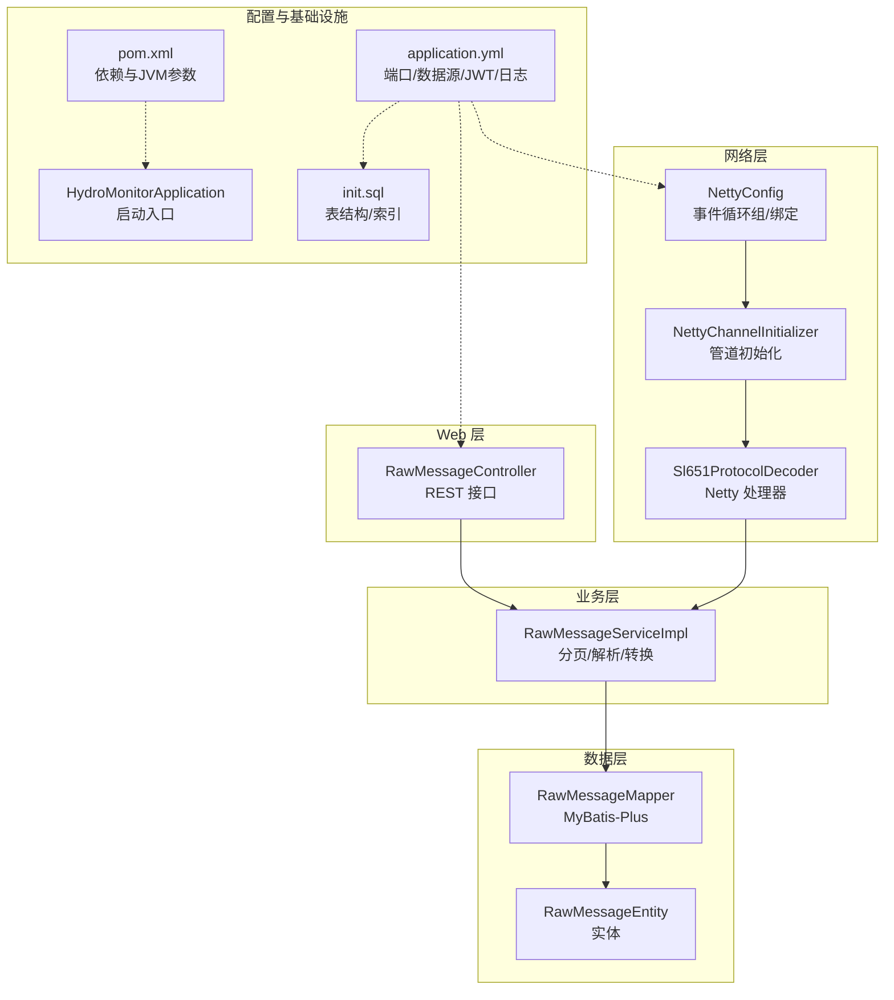
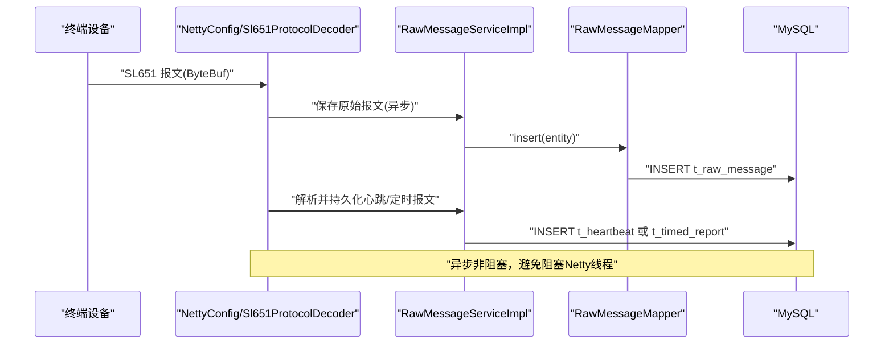
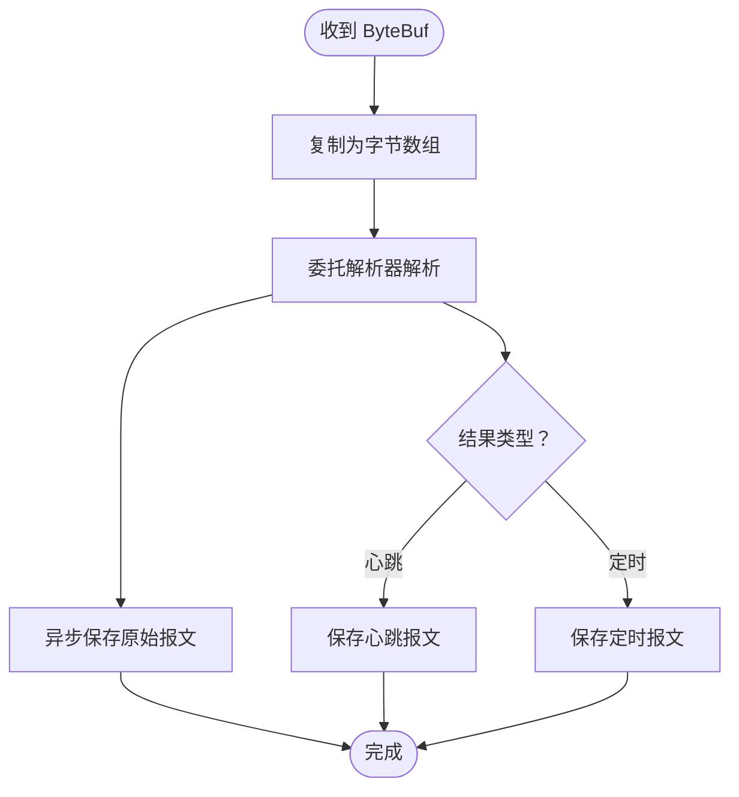
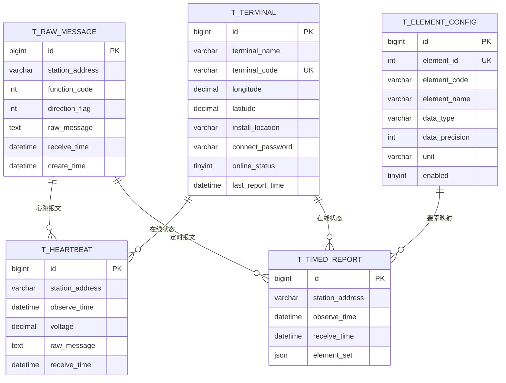
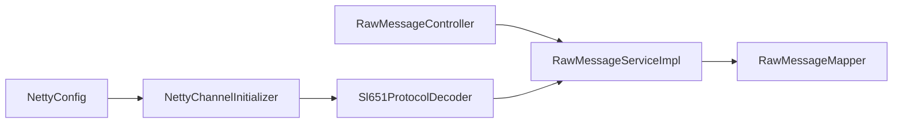

# 性能优化

<cite>
**本文引用的文件**
- [application.yml](file://src/main/resources/application.yml)
- [pom.xml](file://pom.xml)
- [HydroMonitorApplication.java](file://src/main/java/com/hydro/monitor/HydroMonitorApplication.java)
- [NettyConfig.java](file://src/main/java/com/hydro/monitor/config/NettyConfig.java)
- [NettyChannelInitializer.java](file://src/main/java/com/hydro/monitor/config/NettyChannelInitializer.java)
- [Sl651ProtocolDecoder.java](file://src/main/java/com/hydro/monitor/netty/Sl651ProtocolDecoder.java)
- [MyBatisPlusConfig.java](file://src/main/java/com/hydro/monitor/config/MyBatisPlusConfig.java)
- [RawMessageController.java](file://src/main/java/com/hydro/monitor/modules/controller/RawMessageController.java)
- [RawMessageServiceImpl.java](file://src/main/java/com/hydro/monitor/modules/service/impl/RawMessageServiceImpl.java)
- [RawMessageMapper.java](file://src/main/java/com/hydro/monitor/modules/mapper/RawMessageMapper.java)
- [RawMessageEntity.java](file://src/main/java/com/hydro/monitor/modules/entity/RawMessageEntity.java)
- [init.sql](file://src/main/resources/db/init.sql)
- [SimulationConfig.java](file://src/main/java/com/hydro/monitor/config/SimulationConfig.java)
- [SystemStatusDTO.java](file://src/main/java/com/hydro/monitor/modules/dto/SystemStatusDTO.java)
</cite>

## 目录
1. [简介](#简介)
2. [项目结构](#项目结构)
3. [核心组件](#核心组件)
4. [架构总览](#架构总览)
5. [详细组件分析](#详细组件分析)
6. [依赖分析](#依赖分析)
7. [性能考虑](#性能考虑)
8. [故障排查指南](#故障排查指南)
9. [结论](#结论)
10. [附录](#附录)

## 简介
本指南面向水文监测系统在高并发、低延迟场景下的性能优化需求，围绕以下主题展开：JVM 参数调优（堆内存、GC、线程池）、数据库查询优化（索引、SQL、连接池）、Netty 网络通信优化（线程模型、缓冲区、背压）、Spring Boot 应用优化（启动、内存、并发）。文档结合代码库实际实现，给出可落地的优化策略、配置示例路径、性能测试方法与监控指标。

## 项目结构
系统采用 Spring Boot + MyBatis-Plus + Netty 的组合：
- Web 层：REST 控制器负责对外接口
- 业务层：服务实现处理数据流转与持久化
- 数据层：MyBatis-Plus 访问 MySQL
- 网络层：Netty 接收 SL651 协议报文，解析后入库
- 配置层：YAML 配置、Maven 构建参数、启动入口

**图表来源**
- [HydroMonitorApplication.java:15-34](file://src/main/java/com/hydro/monitor/HydroMonitorApplication.java#L15-L34)
- [NettyConfig.java:47-70](file://src/main/java/com/hydro/monitor/config/NettyConfig.java#L47-L70)
- [NettyChannelInitializer.java:18-34](file://src/main/java/com/hydro/monitor/config/NettyChannelInitializer.java#L18-L34)
- [Sl651ProtocolDecoder.java:39-89](file://src/main/java/com/hydro/monitor/netty/Sl651ProtocolDecoder.java#L39-L89)
- [RawMessageController.java:25-45](file://src/main/java/com/hydro/monitor/modules/controller/RawMessageController.java#L25-L45)
- [RawMessageServiceImpl.java:26-79](file://src/main/java/com/hydro/monitor/modules/service/impl/RawMessageServiceImpl.java#L26-L79)
- [RawMessageMapper.java:12-14](file://src/main/java/com/hydro/monitor/modules/mapper/RawMessageMapper.java#L12-L14)
- [RawMessageEntity.java:16-54](file://src/main/java/com/hydro/monitor/modules/entity/RawMessageEntity.java#L16-L54)
- [application.yml:1-86](file://src/main/resources/application.yml#L1-L86)
- [pom.xml:155-177](file://pom.xml#L155-L177)
- [init.sql:1-93](file://src/main/resources/db/init.sql#L1-L93)

**章节来源**
- [application.yml:1-86](file://src/main/resources/application.yml#L1-L86)
- [pom.xml:155-177](file://pom.xml#L155-L177)
- [HydroMonitorApplication.java:15-34](file://src/main/java/com/hydro/monitor/HydroMonitorApplication.java#L15-L34)

## 核心组件
- Netty 服务端：异步启动、NIO 事件循环组、管道处理器链
- SL651 协议解码器：将 ByteBuf 转换为结构化报文并持久化
- MyBatis-Plus 分页拦截器：统一分页能力
- 原始报文控制器与服务：分页查询、详情查询、报文解析
- 数据库初始化脚本：定义表结构与索引

**章节来源**
- [NettyConfig.java:26-85](file://src/main/java/com/hydro/monitor/config/NettyConfig.java#L26-L85)
- [Sl651ProtocolDecoder.java:39-89](file://src/main/java/com/hydro/monitor/netty/Sl651ProtocolDecoder.java#L39-L89)
- [MyBatisPlusConfig.java:14-38](file://src/main/java/com/hydro/monitor/config/MyBatisPlusConfig.java#L14-L38)
- [RawMessageController.java:25-80](file://src/main/java/com/hydro/monitor/modules/controller/RawMessageController.java#L25-L80)
- [RawMessageServiceImpl.java:26-110](file://src/main/java/com/hydro/monitor/modules/service/impl/RawMessageServiceImpl.java#L26-L110)
- [init.sql:6-92](file://src/main/resources/db/init.sql#L6-L92)

## 架构总览
系统通过 Netty 接收 SL651 报文，解析后分别持久化心跳与定时报文；同时提供 REST 接口用于查询与解析历史报文。数据库层面采用 MySQL，MyBatis-Plus 提供分页与逻辑删除支持。

**图表来源**
- [Sl651ProtocolDecoder.java:54-89](file://src/main/java/com/hydro/monitor/netty/Sl651ProtocolDecoder.java#L54-L89)
- [RawMessageServiceImpl.java:33-52](file://src/main/java/com/hydro/monitor/modules/service/impl/RawMessageServiceImpl.java#L33-L52)
- [RawMessageMapper.java:12-14](file://src/main/java/com/hydro/monitor/modules/mapper/RawMessageMapper.java#L12-L14)
- [init.sql:6-29](file://src/main/resources/db/init.sql#L6-L29)

## 详细组件分析

### Netty 网络通信优化
- 线程模型
  - 使用 NIO 事件循环组，boss 1 个线程处理 accept，worker 默认线程数由 CPU 核心数决定，适合高并发连接
  - 可通过 JVM 参数或配置调整线程数，平衡 CPU 与内存占用
- 管道与处理器
  - 管道顺序：帧解码器 → 协议解析器，减少重复解析成本
  - 使用共享的纯解析器实例，避免状态共享导致的线程安全问题
- 缓冲区管理
  - 读取 ByteBuf 后复制为字节数组，避免引用计数与生命周期问题
  - 建议在高频路径避免频繁分配，可考虑对象池或重用策略
- 背压处理
  - 当前未显式设置写缓冲阈值与背压策略，建议在生产环境增加写缓冲上限与饱和策略，防止 OOM
- 异步持久化
  - 原始报文入库使用异步任务，避免阻塞 Netty IO 线程，提升吞吐

**图表来源**
- [Sl651ProtocolDecoder.java:54-89](file://src/main/java/com/hydro/monitor/netty/Sl651ProtocolDecoder.java#L54-L89)
- [Sl651ProtocolDecoder.java:203-249](file://src/main/java/com/hydro/monitor/netty/Sl651ProtocolDecoder.java#L203-L249)

**章节来源**
- [NettyConfig.java:47-70](file://src/main/java/com/hydro/monitor/config/NettyConfig.java#L47-L70)
- [NettyChannelInitializer.java:18-34](file://src/main/java/com/hydro/monitor/config/NettyChannelInitializer.java#L18-L34)
- [Sl651ProtocolDecoder.java:39-89](file://src/main/java/com/hydro/monitor/netty/Sl651ProtocolDecoder.java#L39-L89)

### 数据库查询优化
- 索引设计
  - t_heartbeat/t_timed_report/t_terminal 均建立按 station_address 与 observe_time 的索引，满足按站点与时间范围查询
  - t_element_config 建有唯一索引 uk_element_id 与普通索引 idx_enabled，便于快速映射与过滤
- SQL 优化
  - 分页查询通过 MyBatis-Plus 分页拦截器实现，限制单页最大记录数，避免超大数据集扫描
  - 查询条件仅包含必要字段，避免 SELECT *
- 连接池配置
  - application.yml 中未显式配置连接池参数，建议补充 HikariCP 的连接池大小、空闲超时、连接生命周期等参数，确保在高并发下稳定

**图表来源**
- [init.sql:6-92](file://src/main/resources/db/init.sql#L6-L92)
- [RawMessageEntity.java:16-54](file://src/main/java/com/hydro/monitor/modules/entity/RawMessageEntity.java#L16-L54)

**章节来源**
- [init.sql:6-92](file://src/main/resources/db/init.sql#L6-L92)
- [MyBatisPlusConfig.java:23-37](file://src/main/java/com/hydro/monitor/config/MyBatisPlusConfig.java#L23-L37)
- [application.yml:9-13](file://src/main/resources/application.yml#L9-L13)

### Spring Boot 应用性能优化
- 启动时间优化
  - DevTools 已启用，开发阶段热部署提升迭代效率；生产环境建议关闭
  - Maven 插件已设置 JVM 编码参数，保证日志与输出一致性
- 内存使用优化
  - 通过 JVM 参数控制堆大小与 GC 策略（见“性能考虑”章节）
- 并发处理优化
  - Netty 使用共享解析器与异步持久化，避免阻塞 IO 线程
  - 控制器层使用分页查询，避免一次性加载大量数据

**章节来源**
- [application.yml:35-41](file://src/main/resources/application.yml#L35-L41)
- [pom.xml:155-177](file://pom.xml#L155-L177)
- [HydroMonitorApplication.java:15-34](file://src/main/java/com/hydro/monitor/HydroMonitorApplication.java#L15-L34)

## 依赖分析
- 组件耦合
  - NettyConfig 依赖 NettyChannelInitializer，后者依赖 Sl651ProtocolDecoder
  - Sl651ProtocolDecoder 依赖多个业务服务与 RawMessageService，存在跨层调用
  - RawMessageController 依赖 RawMessageService，RawMessageServiceImpl 依赖 RawMessageMapper
- 外部依赖
  - MySQL 驱动、MyBatis-Plus、Netty、JWT、SpringDoc、Hutool、DevTools

**图表来源**
- [NettyConfig.java:28-58](file://src/main/java/com/hydro/monitor/config/NettyConfig.java#L28-L58)
- [NettyChannelInitializer.java:18-34](file://src/main/java/com/hydro/monitor/config/NettyChannelInitializer.java#L18-L34)
- [Sl651ProtocolDecoder.java:39-48](file://src/main/java/com/hydro/monitor/netty/Sl651ProtocolDecoder.java#L39-L48)
- [RawMessageController.java:27-41](file://src/main/java/com/hydro/monitor/modules/controller/RawMessageController.java#L27-L41)
- [RawMessageServiceImpl.java:28-52](file://src/main/java/com/hydro/monitor/modules/service/impl/RawMessageServiceImpl.java#L28-L52)
- [RawMessageMapper.java:12-14](file://src/main/java/com/hydro/monitor/modules/mapper/RawMessageMapper.java#L12-L14)

**章节来源**
- [NettyConfig.java:26-85](file://src/main/java/com/hydro/monitor/config/NettyConfig.java#L26-L85)
- [Sl651ProtocolDecoder.java:39-89](file://src/main/java/com/hydro/monitor/netty/Sl651ProtocolDecoder.java#L39-L89)
- [RawMessageServiceImpl.java:26-79](file://src/main/java/com/hydro/monitor/modules/service/impl/RawMessageServiceImpl.java#L26-L79)

## 性能考虑
- JVM 参数调优策略
  - 堆内存配置
    - 初始堆大小与最大堆大小：依据峰值内存与 GC 行为设定，避免频繁 Full GC
    - 新生代比例：优先降低晋升年龄，缩短老年代压力
  - 垃圾回收器选择
    - 生产环境推荐 G1 或 ZGC（JDK 17+），降低停顿时间
    - 开启并行收集器需谨慎，避免尖峰停顿
  - 线程池优化
    - Netty worker 线程数：CPU 核心数 × 2，结合压测结果微调
    - 异步持久化线程池：使用有界队列与拒绝策略，防止内存暴涨
- 数据库查询优化
  - 索引设计：按查询模式建立复合索引，如 (station_address, receive_time)
  - SQL 优化：避免 N+1 查询，批量插入与更新
  - 连接池配置：HikariCP 的最小/最大连接数、连接超时、空闲超时
- Netty 网络通信优化
  - 线程模型：根据并发连接与消息量调整 boss/worker 线程数
  - 缓冲区：复用 ByteBuf，避免频繁分配；合理设置读写水位
  - 背压：设置写缓冲阈值与饱和策略，防止下游拥塞
- Spring Boot 应用优化
  - 启动时间：移除不必要的自动配置与懒加载 Bean
  - 内存使用：合理设置 JVM 参数与 GC 策略，监控堆外内存
  - 并发处理：使用异步与限流策略，避免线程池耗尽

[本节为通用性能指导，不直接分析具体文件]

## 故障排查指南
- Netty 异常
  - 发生异常时主动关闭通道，避免半开连接
  - 检查日志级别与输出格式，定位解析失败原因
- 数据库连接问题
  - 核对连接池参数与数据库负载，避免连接泄漏
  - 关注慢查询日志，结合索引设计优化
- 应用监控
  - 使用 SystemStatusDTO 中的指标（内存、CPU、线程数、数据库连接）进行基线对比
  - 结合日志与指标平台，定位瓶颈

**章节来源**
- [Sl651ProtocolDecoder.java:272-276](file://src/main/java/com/hydro/monitor/netty/Sl651ProtocolDecoder.java#L272-L276)
- [application.yml:62-77](file://src/main/resources/application.yml#L62-L77)
- [SystemStatusDTO.java:8-39](file://src/main/java/com/hydro/monitor/modules/dto/SystemStatusDTO.java#L8-L39)

## 结论
通过合理的 JVM 参数、数据库索引与连接池、Netty 线程模型与背压策略以及 Spring Boot 的启动与并发优化，水文监测系统可在高并发场景下保持稳定与高性能。建议在生产环境逐步引入容量规划与压测流程，持续监控关键指标并迭代优化。

[本节为总结性内容，不直接分析具体文件]

## 附录

### 配置示例路径
- 端口与数据源
  - [application.yml:1-13](file://src/main/resources/application.yml#L1-L13)
- MyBatis-Plus 分页拦截器
  - [MyBatisPlusConfig.java:23-37](file://src/main/java/com/hydro/monitor/config/MyBatisPlusConfig.java#L23-L37)
- Netty 端口与线程模型
  - [NettyConfig.java:30-49](file://src/main/java/com/hydro/monitor/config/NettyConfig.java#L30-L49)
- 日志与 DevTools
  - [application.yml:62-77](file://src/main/resources/application.yml#L62-L77)
- Maven 构建与 JVM 参数
  - [pom.xml:155-177](file://pom.xml#L155-L177)

### 性能测试方法
- 压测工具：JMeter/LoadRunner/Locust
- 场景设计：并发连接数、消息吞吐、解析时延、数据库写入延迟
- 指标采集：TPS、P99 延迟、GC 次数与时长、数据库 QPS、连接池使用率

[本节为通用方法指导，不直接分析具体文件]