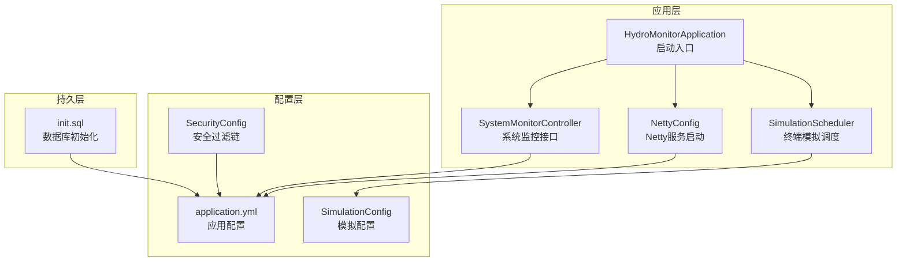
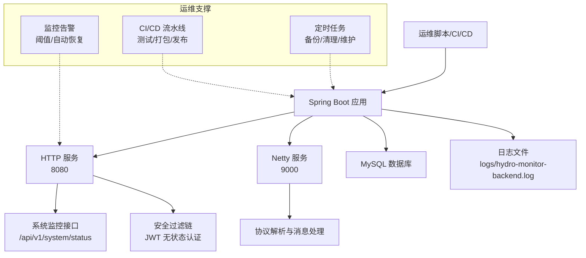
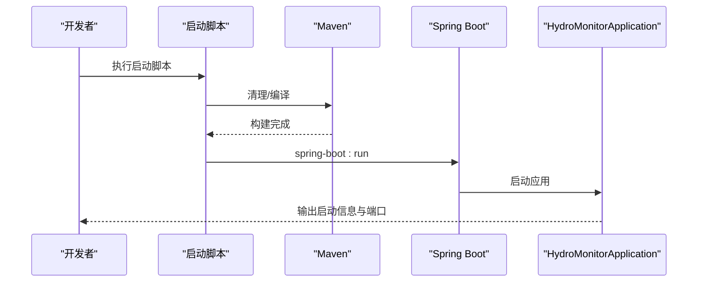
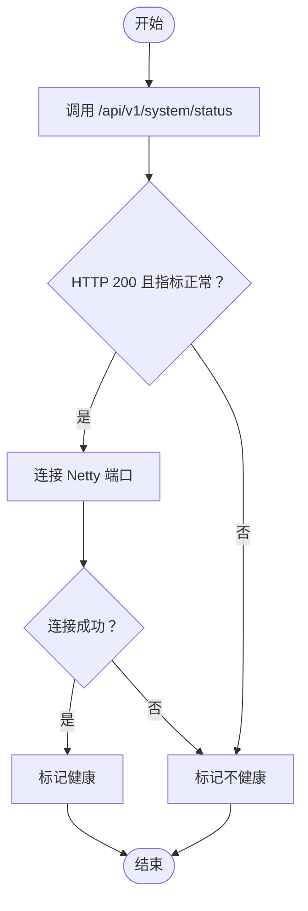
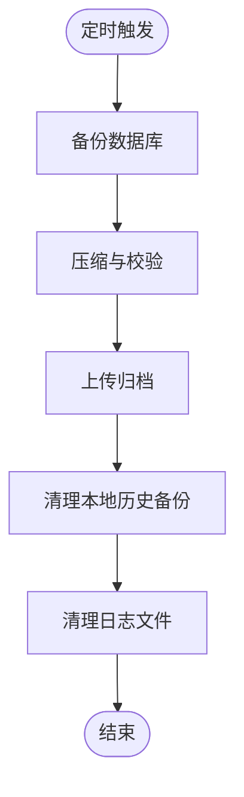
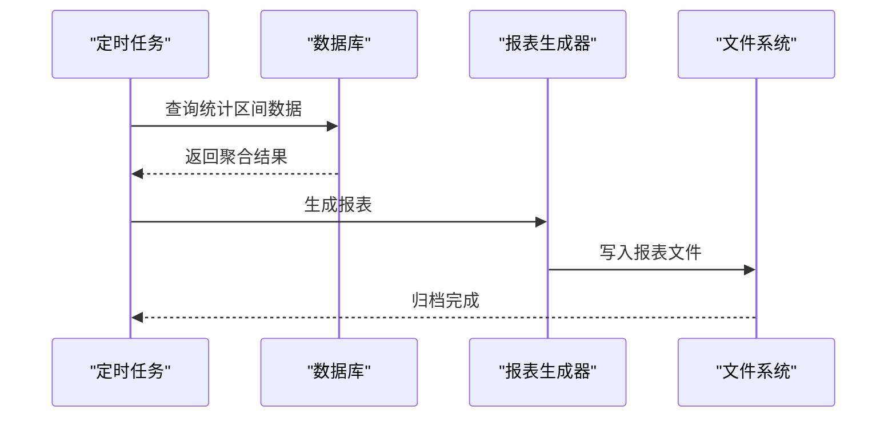
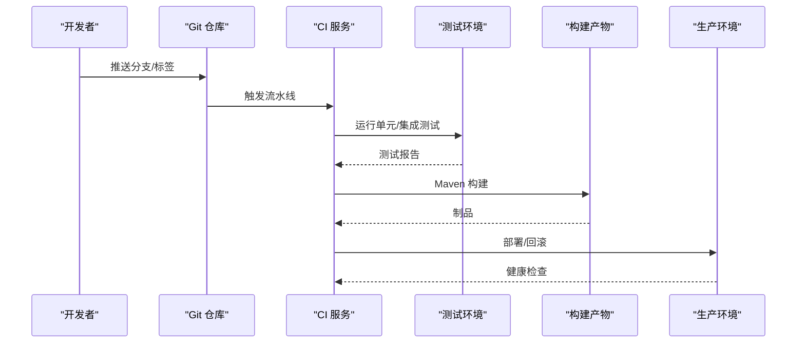
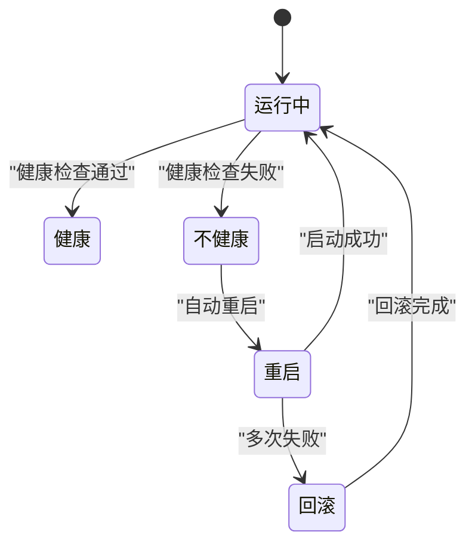
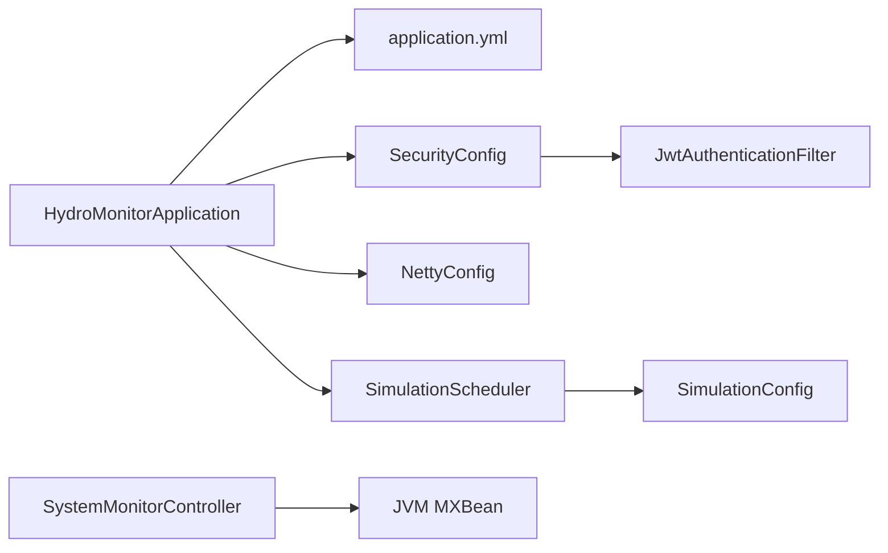

# 自动化运维

<cite>
**本文引用的文件**
- [README.md](file://README.md)
- [pom.xml](file://pom.xml)
- [application.yml](file://src/main/resources/application.yml)
- [start-dev.sh](file://start-dev.sh)
- [start-dev.bat](file://start-dev.bat)
- [HydroMonitorApplication.java](file://src/main/java/com/hydro/monitor/HydroMonitorApplication.java)
- [NettyConfig.java](file://src/main/java/com/hydro/monitor/config/NettyConfig.java)
- [SimulationConfig.java](file://src/main/java/com/hydro/monitor/config/SimulationConfig.java)
- [SimulationScheduler.java](file://src/main/java/com/hydro/monitor/simulation/SimulationScheduler.java)
- [SystemMonitorController.java](file://src/main/java/com/hydro/monitor/modules/controller/SystemMonitorController.java)
- [SecurityConfig.java](file://src/main/java/com/hydro/monitor/config/security/SecurityConfig.java)
- [GlobalExceptionHandler.java](file://src/main/java/com/hydro/monitor/common/GlobalExceptionHandler.java)
- [init.sql](file://src/main/resources/db/init.sql)
- [application-test.yml](file://src/test/resources/application-test.yml)
- [SystemMonitorControllerTest.java](file://src/test/java/com/hydro/monitor/modules/controller/SystemMonitorControllerTest.java)
</cite>

## 目录
1. [简介](#简介)
2. [项目结构](#项目结构)
3. [核心组件](#核心组件)
4. [架构总览](#架构总览)
5. [详细组件分析](#详细组件分析)
6. [依赖关系分析](#依赖关系分析)
7. [性能考虑](#性能考虑)
8. [故障排查指南](#故障排查指南)
9. [结论](#结论)
10. [附录](#附录)

## 简介
本方案面向水文监测系统的自动化运维，围绕以下目标展开：  
- 运维脚本：启动脚本、停止脚本与健康检查脚本  
- 定时任务：数据备份、日志清理、系统维护  
- 批量工具：数据迁移、报表生成、系统监控  
- CI/CD 流水线：自动化测试、打包部署、版本发布  
- 监控告警与故障自动恢复：指标采集、阈值告警、自动重启与回滚  
- 最佳实践：可重复、可观测、可恢复、可审计  

本项目采用 Spring Boot 3 + Netty + Spring Security + MyBatis-Plus 技术栈，提供 HTTP 服务（8080）、Netty 服务（9000）以及系统监控接口，便于构建完善的自动化运维体系。

## 项目结构
项目采用标准的 Spring Boot 结构，主要目录与职责如下：
- src/main/java/com/hydro/monitor：核心代码
  - config：配置类（Netty、安全、模拟配置）
  - simulation：终端模拟模块（独立子系统）
  - modules/controller/service/mapper/entity/dto/vo：业务模块分层
  - common：公共组件（全局异常处理、结果封装、密码生成等）
  - netty：协议解析与网络层
  - HydroMonitorApplication：启动入口
- src/main/resources：资源文件
  - application.yml：应用配置（端口、数据库、日志、JWT、Netty、模拟等）
  - db：数据库初始化与迁移脚本
- src/test：测试代码与测试配置
- 入门脚本：start-dev.sh / start-dev.bat（热部署启动）

图表来源
- [HydroMonitorApplication.java:12-35](file://src/main/java/com/hydro/monitor/HydroMonitorApplication.java#L12-L35)
- [SystemMonitorController.java:22-83](file://src/main/java/com/hydro/monitor/modules/controller/SystemMonitorController.java#L22-L83)
- [NettyConfig.java:24-86](file://src/main/java/com/hydro/monitor/config/NettyConfig.java#L24-L86)
- [SimulationScheduler.java:30-135](file://src/main/java/com/hydro/monitor/simulation/SimulationScheduler.java#L30-L135)
- [application.yml:1-86](file://src/main/resources/application.yml#L1-L86)
- [SecurityConfig.java:20-75](file://src/main/java/com/hydro/monitor/config/security/SecurityConfig.java#L20-L75)
- [SimulationConfig.java:14-58](file://src/main/java/com/hydro/monitor/config/SimulationConfig.java#L14-L58)
- [init.sql:1-93](file://src/main/resources/db/init.sql#L1-L93)

章节来源
- [README.md:85-106](file://README.md#L85-L106)
- [pom.xml:1-179](file://pom.xml#L1-L179)
- [application.yml:1-86](file://src/main/resources/application.yml#L1-L86)

## 核心组件
- 启动入口与热部署：Spring Boot 启动类负责应用启动与 DevTools 状态提示；启动脚本提供跨平台热部署启动流程。
- Netty 服务：CommandLineRunner 方式在应用启动后异步绑定端口，优雅停机释放资源。
- 系统监控：提供系统运行状态接口，采集内存、线程、CPU 等指标。
- 安全与异常：基于 JWT 的无状态认证，统一异常处理。
- 终端模拟：可配置开关、并发调度、优雅停机。
- 数据库：初始化脚本定义核心表结构与默认数据。

章节来源
- [HydroMonitorApplication.java:12-35](file://src/main/java/com/hydro/monitor/HydroMonitorApplication.java#L12-L35)
- [NettyConfig.java:24-86](file://src/main/java/com/hydro/monitor/config/NettyConfig.java#L24-L86)
- [SystemMonitorController.java:22-83](file://src/main/java/com/hydro/monitor/modules/controller/SystemMonitorController.java#L22-L83)
- [SecurityConfig.java:20-75](file://src/main/java/com/hydro/monitor/config/security/SecurityConfig.java#L20-L75)
- [GlobalExceptionHandler.java:15-57](file://src/main/java/com/hydro/monitor/common/GlobalExceptionHandler.java#L15-L57)
- [SimulationScheduler.java:30-135](file://src/main/java/com/hydro/monitor/simulation/SimulationScheduler.java#L30-L135)
- [init.sql:1-93](file://src/main/resources/db/init.sql#L1-L93)

## 架构总览
系统由 HTTP 服务（Spring MVC）与 Netty 服务组成，配合安全过滤链与系统监控接口，形成可观测、可扩展的运维基座。

图表来源
- [HydroMonitorApplication.java:12-35](file://src/main/java/com/hydro/monitor/HydroMonitorApplication.java#L12-L35)
- [SystemMonitorController.java:22-83](file://src/main/java/com/hydro/monitor/modules/controller/SystemMonitorController.java#L22-L83)
- [NettyConfig.java:24-86](file://src/main/java/com/hydro/monitor/config/NettyConfig.java#L24-L86)
- [SecurityConfig.java:20-75](file://src/main/java/com/hydro/monitor/config/security/SecurityConfig.java#L20-L75)
- [application.yml:1-86](file://src/main/resources/application.yml#L1-L86)

## 详细组件分析

### 启动脚本与停止脚本
- 跨平台启动脚本：提供自动清理、编译与热部署启动流程，Windows 与 Linux/Mac 行为一致，均调用 Maven 插件启动应用。
- 停止脚本建议：由于应用未提供内置停止命令，推荐通过进程管理方式停止（如 PID 文件或容器信号），或在 CI/CD 中使用容器生命周期管理。

图表来源
- [start-dev.sh:1-25](file://start-dev.sh#L1-L25)
- [start-dev.bat:1-28](file://start-dev.bat#L1-L28)
- [HydroMonitorApplication.java:12-35](file://src/main/java/com/hydro/monitor/HydroMonitorApplication.java#L12-L35)

章节来源
- [start-dev.sh:1-25](file://start-dev.sh#L1-L25)
- [start-dev.bat:1-28](file://start-dev.bat#L1-L28)
- [HydroMonitorApplication.java:12-35](file://src/main/java/com/hydro/monitor/HydroMonitorApplication.java#L12-L35)

### 健康检查脚本
- HTTP 健康检查：通过系统监控接口获取运行状态，结合返回码与关键指标判断健康。
- Netty 健康检查：尝试连接 Netty 端口，验证服务可用性。
- 建议：将健康检查集成到容器探针或外部监控系统，周期性拉取并记录。

图表来源
- [SystemMonitorController.java:22-83](file://src/main/java/com/hydro/monitor/modules/controller/SystemMonitorController.java#L22-L83)
- [application.yml:43-47](file://src/main/resources/application.yml#L43-L47)

章节来源
- [SystemMonitorController.java:22-83](file://src/main/java/com/hydro/monitor/modules/controller/SystemMonitorController.java#L22-L83)
- [application.yml:43-47](file://src/main/resources/application.yml#L43-L47)

### 定时任务配置
- 数据备份：建议每日定时触发数据库逻辑备份（mysqldump），并压缩归档与远端同步。
- 日志清理：按大小与天数轮转，保留最近 30 天日志。
- 系统维护：清理模拟数据（生产禁用模拟模块）、统计报表生成与归档。

图表来源
- [application.yml:62-77](file://src/main/resources/application.yml#L62-L77)
- [init.sql:1-93](file://src/main/resources/db/init.sql#L1-L93)

章节来源
- [application.yml:62-77](file://src/main/resources/application.yml#L62-L77)
- [init.sql:1-93](file://src/main/resources/db/init.sql#L1-L93)

### 批量操作工具开发
- 数据迁移：基于数据库脚本与迁移工具，按版本顺序执行 SQL，确保幂等与回滚策略。
- 报表生成：定时从 t_timed_report 与 t_heartbeat 汇总生成报表，导出至 CSV/Excel 并归档。
- 系统监控：通过系统监控接口与日志分析，建立关键指标看板与趋势分析。

图表来源
- [init.sql:19-29](file://src/main/resources/db/init.sql#L19-L29)
- [application.yml:62-77](file://src/main/resources/application.yml#L62-L77)

章节来源
- [init.sql:19-29](file://src/main/resources/db/init.sql#L19-L29)
- [application.yml:62-77](file://src/main/resources/application.yml#L62-L77)

### CI/CD 流水线配置
- 自动化测试：在测试环境加载 application-test.yml，使用 H2 内存数据库进行单元与集成测试。
- 打包部署：使用 Maven 插件构建，产物可部署至容器或裸机。
- 版本发布：建议以 Git 标签驱动版本号，配合制品库与发布说明。

图表来源
- [pom.xml:155-176](file://pom.xml#L155-L176)
- [application-test.yml:1-29](file://src/test/resources/application-test.yml#L1-L29)
- [SystemMonitorControllerTest.java:20-60](file://src/test/java/com/hydro/monitor/modules/controller/SystemMonitorControllerTest.java#L20-L60)

章节来源
- [pom.xml:155-176](file://pom.xml#L155-L176)
- [application-test.yml:1-29](file://src/test/resources/application-test.yml#L1-L29)
- [SystemMonitorControllerTest.java:20-60](file://src/test/java/com/hydro/monitor/modules/controller/SystemMonitorControllerTest.java#L20-L60)

### 监控告警与故障自动恢复
- 指标采集：系统监控接口返回内存、CPU、线程数等指标；Netty 服务端日志记录启动/关闭事件。
- 阈值告警：对内存使用率、线程数、CPU 使用率设置阈值，超限触发告警。
- 自动恢复：健康检查失败时，触发应用重启或容器重建；必要时回滚至上一稳定版本。

图表来源
- [SystemMonitorController.java:22-83](file://src/main/java/com/hydro/monitor/modules/controller/SystemMonitorController.java#L22-L83)
- [NettyConfig.java:75-85](file://src/main/java/com/hydro/monitor/config/NettyConfig.java#L75-L85)

章节来源
- [SystemMonitorController.java:22-83](file://src/main/java/com/hydro/monitor/modules/controller/SystemMonitorController.java#L22-L83)
- [NettyConfig.java:75-85](file://src/main/java/com/hydro/monitor/config/NettyConfig.java#L75-L85)

### 最佳实践
- 配置分离：生产禁用模拟模块，启用 HTTPS，修改 JWT 密钥。
- 日志策略：控制台与文件日志统一编码与轮转，保留合理历史。
- 安全策略：无状态认证、最小权限、敏感信息加密存储。
- 可靠性：优雅停机、健康检查、自动重启与回滚。

章节来源
- [application.yml:1-86](file://src/main/resources/application.yml#L1-L86)
- [SecurityConfig.java:20-75](file://src/main/java/com/hydro/monitor/config/security/SecurityConfig.java#L20-L75)
- [GlobalExceptionHandler.java:15-57](file://src/main/java/com/hydro/monitor/common/GlobalExceptionHandler.java#L15-L57)

## 依赖关系分析
- 启动入口依赖配置与组件扫描，Netty 作为 CommandLineRunner 在应用启动后异步启动。
- 系统监控接口依赖 JVM MXBean 获取运行时信息。
- 安全配置依赖 JWT 过滤器链，异常处理统一返回 Result 包装。
- 终端模拟模块通过配置类读取模拟参数，调度器管理客户端生命周期。

图表来源
- [HydroMonitorApplication.java:12-35](file://src/main/java/com/hydro/monitor/HydroMonitorApplication.java#L12-L35)
- [NettyConfig.java:24-86](file://src/main/java/com/hydro/monitor/config/NettyConfig.java#L24-L86)
- [SystemMonitorController.java:22-83](file://src/main/java/com/hydro/monitor/modules/controller/SystemMonitorController.java#L22-L83)
- [SecurityConfig.java:20-75](file://src/main/java/com/hydro/monitor/config/security/SecurityConfig.java#L20-L75)
- [SimulationScheduler.java:30-135](file://src/main/java/com/hydro/monitor/simulation/SimulationScheduler.java#L30-L135)
- [SimulationConfig.java:14-58](file://src/main/java/com/hydro/monitor/config/SimulationConfig.java#L14-L58)

章节来源
- [HydroMonitorApplication.java:12-35](file://src/main/java/com/hydro/monitor/HydroMonitorApplication.java#L12-L35)
- [NettyConfig.java:24-86](file://src/main/java/com/hydro/monitor/config/NettyConfig.java#L24-L86)
- [SystemMonitorController.java:22-83](file://src/main/java/com/hydro/monitor/modules/controller/SystemMonitorController.java#L22-L83)
- [SecurityConfig.java:20-75](file://src/main/java/com/hydro/monitor/config/security/SecurityConfig.java#L20-L75)
- [SimulationScheduler.java:30-135](file://src/main/java/com/hydro/monitor/simulation/SimulationScheduler.java#L30-L135)
- [SimulationConfig.java:14-58](file://src/main/java/com/hydro/monitor/config/SimulationConfig.java#L14-L58)

## 性能考虑
- Netty 事件循环组与通道选项：合理设置 SO_BACKLOG 与 keepalive，避免连接积压。
- JVM 参数：统一编码与日志输出编码，减少字符集转换开销。
- 数据库连接：生产环境建议使用连接池监控与慢查询分析。
- 监控开销：系统监控接口仅做轻量采样，避免频繁高成本操作。

## 故障排查指南
- 启动失败：检查数据库连接、端口占用与 JVM 编码参数。
- Netty 无法启动：确认端口可用、线程池与通道初始化无异常。
- 系统监控异常：确认 JDK 版本支持的 MXBean 可用性。
- 权限问题：核对安全过滤链与 JWT 密钥配置。
- 日志异常：检查日志文件路径与权限，确认轮转策略生效。

章节来源
- [NettyConfig.java:47-70](file://src/main/java/com/hydro/monitor/config/NettyConfig.java#L47-L70)
- [SystemMonitorController.java:73-82](file://src/main/java/com/hydro/monitor/modules/controller/SystemMonitorController.java#L73-L82)
- [SecurityConfig.java:33-51](file://src/main/java/com/hydro/monitor/config/security/SecurityConfig.java#L33-L51)
- [GlobalExceptionHandler.java:15-57](file://src/main/java/com/hydro/monitor/common/GlobalExceptionHandler.java#L15-L57)
- [application.yml:62-77](file://src/main/resources/application.yml#L62-L77)

## 结论
通过启动/停止/健康检查脚本、定时任务、批量工具、CI/CD 流水线与监控告警体系，可实现水文监测系统的自动化运维闭环。建议在生产环境中严格遵循配置分离、安全加固与可观测性原则，持续优化性能与可靠性。

## 附录
- 快速开始与访问地址：HTTP 服务、Netty 服务、API 文档与默认账户信息详见项目说明。
- 数据库初始化：提供完整的建表与默认数据插入脚本，便于快速部署。

章节来源
- [README.md:20-64](file://README.md#L20-L64)
- [init.sql:1-93](file://src/main/resources/db/init.sql#L1-L93)