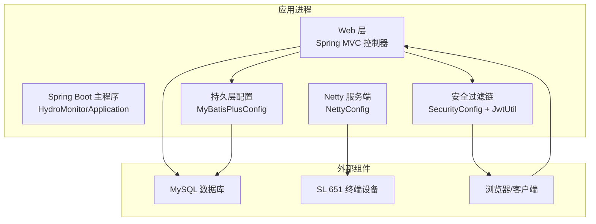
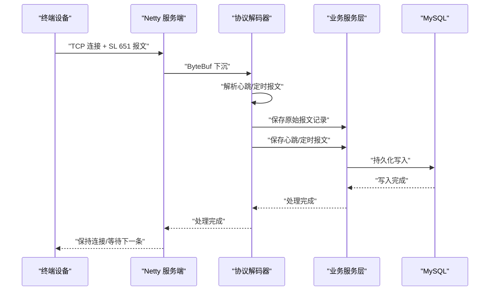
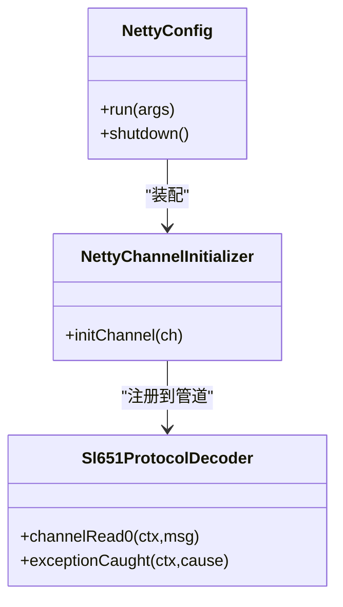
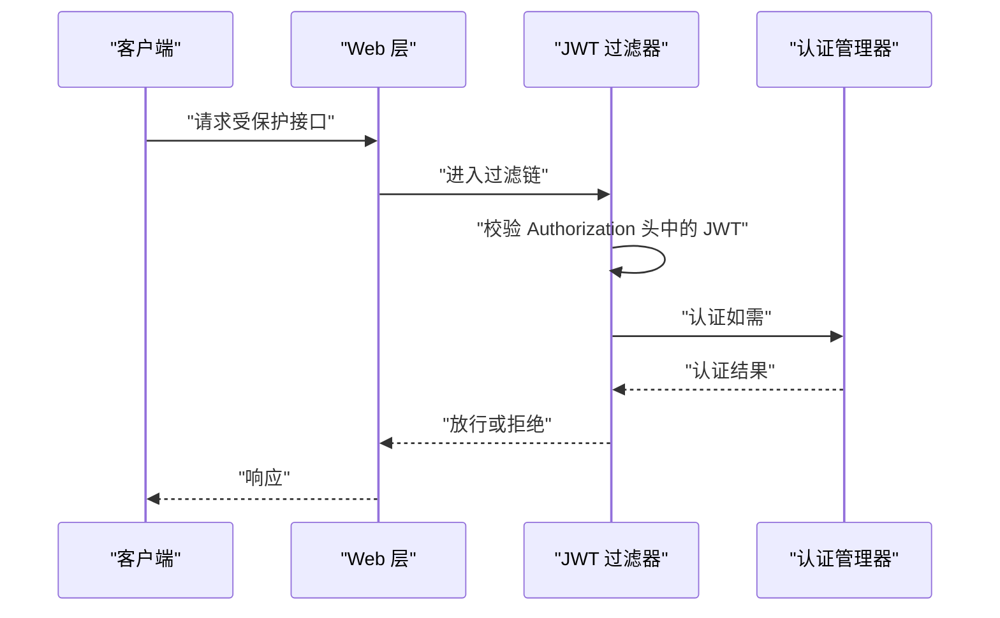
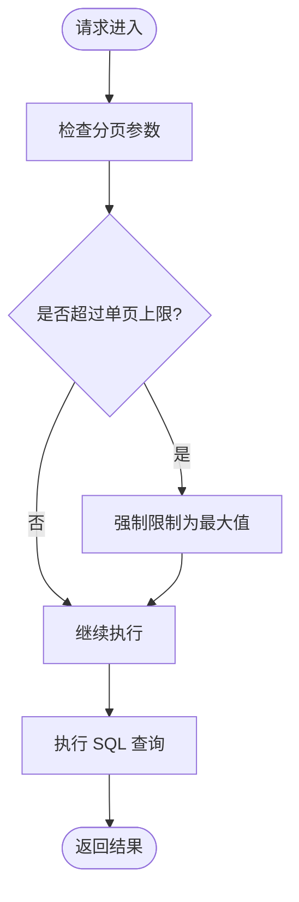
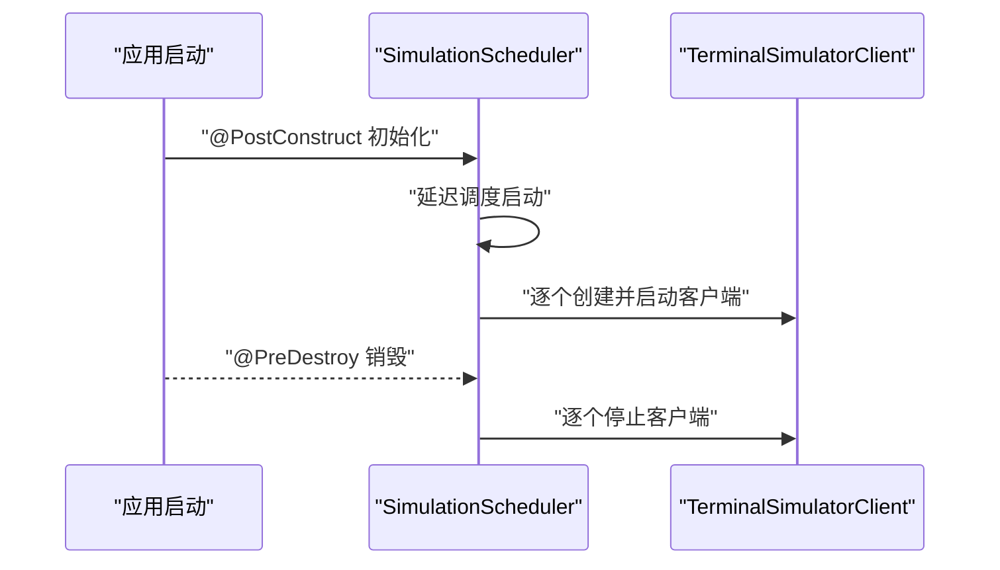
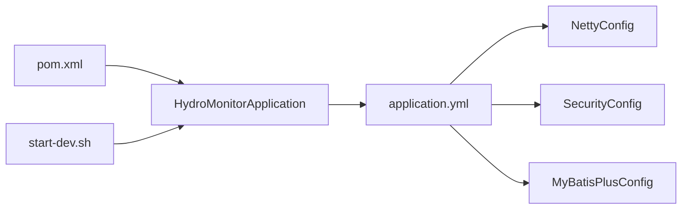

# 运维优化

<cite>
**本文引用的文件**
- [HydroMonitorApplication.java](file://src/main/java/com/hydro/monitor/HydroMonitorApplication.java)
- [application.yml](file://src/main/resources/application.yml)
- [pom.xml](file://pom.xml)
- [README.md](file://README.md)
- [NettyConfig.java](file://src/main/java/com/hydro/monitor/config/NettyConfig.java)
- [NettyChannelInitializer.java](file://src/main/java/com/hydro/monitor/config/NettyChannelInitializer.java)
- [Sl651ProtocolDecoder.java](file://src/main/java/com/hydro/monitor/netty/Sl651ProtocolDecoder.java)
- [SecurityConfig.java](file://src/main/java/com/hydro/monitor/config/security/SecurityConfig.java)
- [JwtUtil.java](file://src/main/java/com/hydro/monitor/config/security/JwtUtil.java)
- [MyBatisPlusConfig.java](file://src/main/java/com/hydro/monitor/config/MyBatisPlusConfig.java)
- [SystemMonitorController.java](file://src/main/java/com/hydro/monitor/modules/controller/SystemMonitorController.java)
- [SimulationScheduler.java](file://src/main/java/com/hydro/monitor/simulation/SimulationScheduler.java)
- [init.sql](file://src/main/resources/db/init.sql)
- [start-dev.sh](file://start-dev.sh)
</cite>

## 目录
1. [简介](#简介)
2. [项目结构](#项目结构)
3. [核心组件](#核心组件)
4. [架构总览](#架构总览)
5. [详细组件分析](#详细组件分析)
6. [依赖分析](#依赖分析)
7. [性能考虑](#性能考虑)
8. [故障排查指南](#故障排查指南)
9. [结论](#结论)
10. [附录](#附录)

## 简介
本指南面向水文监测系统的运维团队，聚焦于系统性能优化、高可用与集群部署、容量规划、运维自动化、安全加固以及版本升级与回滚策略。通过对现有代码与配置的深入分析，结合系统实际运行特征（HTTP + Netty 并行服务、JWT 认证、MyBatis-Plus 分页、SL 651 协议解析、模拟上报模块等），给出可落地的优化建议与最佳实践。

## 项目结构
系统采用 Spring Boot 3 + Netty 的混合架构：Web 层通过 Spring MVC 提供 REST API，Netty 独立监听 9000 端口处理 SL 651 协议报文；数据库使用 MySQL，ORM 采用 MyBatis-Plus；安全通过 Spring Security + JWT 实现；开发阶段提供热部署支持。

图表来源
- [HydroMonitorApplication.java:15-34](file://src/main/java/com/hydro/monitor/HydroMonitorApplication.java#L15-L34)
- [NettyConfig.java:47-70](file://src/main/java/com/hydro/monitor/config/NettyConfig.java#L47-L70)
- [SecurityConfig.java:34-52](file://src/main/java/com/hydro/monitor/config/security/SecurityConfig.java#L34-L52)
- [MyBatisPlusConfig.java:24-37](file://src/main/java/com/hydro/monitor/config/MyBatisPlusConfig.java#L24-L37)

章节来源
- [README.md:85-106](file://README.md#L85-L106)
- [application.yml:1-86](file://src/main/resources/application.yml#L1-L86)

## 核心组件
- 启动与端口：应用在 8080 端口提供 HTTP 服务，Netty 在 9000 端口提供 SL 651 协议接入。
- 安全体系：基于无状态会话的 JWT 认证，开放部分公开接口路径。
- ORM 与分页：MyBatis-Plus 配置了分页拦截器，限制单页最大 500 条。
- 协议处理：Netty 管道包含帧解码器与协议解析器，解析心跳与定时报文并落库。
- 模拟上报：独立的模拟调度器，支持按配置启停与并发终端模拟。

章节来源
- [HydroMonitorApplication.java:30-31](file://src/main/java/com/hydro/monitor/HydroMonitorApplication.java#L30-L31)
- [application.yml:49-51](file://src/main/resources/application.yml#L49-L51)
- [SecurityConfig.java:41-49](file://src/main/java/com/hydro/monitor/config/security/SecurityConfig.java#L41-L49)
- [MyBatisPlusConfig.java:24-37](file://src/main/java/com/hydro/monitor/config/MyBatisPlusConfig.java#L24-L37)
- [NettyChannelInitializer.java:22-34](file://src/main/java/com/hydro/monitor/config/NettyChannelInitializer.java#L22-L34)
- [SimulationScheduler.java:45-96](file://src/main/java/com/hydro/monitor/simulation/SimulationScheduler.java#L45-L96)

## 架构总览
系统采用“HTTP + Netty 并行”的混合架构，HTTP 负责 API 与管理功能，Netty 负责高并发 SL 651 报文接入。安全层统一在 Web 层通过 JWT 过滤链实现，持久层通过 MyBatis-Plus 统一管理。

图表来源
- [NettyConfig.java:47-70](file://src/main/java/com/hydro/monitor/config/NettyConfig.java#L47-L70)
- [Sl651ProtocolDecoder.java:54-89](file://src/main/java/com/hydro/monitor/netty/Sl651ProtocolDecoder.java#L54-L89)

## 详细组件分析

### Netty 服务端与协议处理
- NettyConfig：启动 boss/worker 线程组，绑定端口，设置 SO_BACKLOG、SO_KEEPALIVE，优雅停机。
- NettyChannelInitializer：在管道中加入帧解码器与协议解码器。
- Sl651ProtocolDecoder：负责将 ByteBuf 转换为解析结果，异步保存原始报文，同步处理心跳/定时报文并更新终端在线状态。

图表来源
- [NettyConfig.java:26-85](file://src/main/java/com/hydro/monitor/config/NettyConfig.java#L26-L85)
- [NettyChannelInitializer.java:18-35](file://src/main/java/com/hydro/monitor/config/NettyChannelInitializer.java#L18-L35)
- [Sl651ProtocolDecoder.java:39-89](file://src/main/java/com/hydro/monitor/netty/Sl651ProtocolDecoder.java#L39-L89)

章节来源
- [NettyConfig.java:47-70](file://src/main/java/com/hydro/monitor/config/NettyConfig.java#L47-L70)
- [NettyChannelInitializer.java:22-34](file://src/main/java/com/hydro/monitor/config/NettyChannelInitializer.java#L22-L34)
- [Sl651ProtocolDecoder.java:54-89](file://src/main/java/com/hydro/monitor/netty/Sl651ProtocolDecoder.java#L54-L89)

### 安全与认证
- SecurityConfig：禁用 CSRF，无状态会话，开放公开路径，其他接口需认证。
- JwtUtil：生成与校验 JWT，支持从 Token 获取用户名与过期时间。

图表来源
- [SecurityConfig.java:34-52](file://src/main/java/com/hydro/monitor/config/security/SecurityConfig.java#L34-L52)
- [JwtUtil.java:37-48](file://src/main/java/com/hydro/monitor/config/security/JwtUtil.java#L37-L48)

章节来源
- [SecurityConfig.java:34-52](file://src/main/java/com/hydro/monitor/config/security/SecurityConfig.java#L34-L52)
- [JwtUtil.java:67-75](file://src/main/java/com/hydro/monitor/config/security/JwtUtil.java#L67-L75)

### 数据持久化与分页
- MyBatisPlusConfig：配置分页拦截器，限制单页最大 500 条，溢出不处理。
- SystemMonitorController：提供系统状态查询接口，包含内存、线程数、CPU 使用率等指标。

图表来源
- [MyBatisPlusConfig.java:28-32](file://src/main/java/com/hydro/monitor/config/MyBatisPlusConfig.java#L28-L32)

章节来源
- [MyBatisPlusConfig.java:24-37](file://src/main/java/com/hydro/monitor/config/MyBatisPlusConfig.java#L24-L37)
- [SystemMonitorController.java:36-66](file://src/main/java/com/hydro/monitor/modules/controller/SystemMonitorController.java#L36-L66)

### 模拟上报模块
- SimulationScheduler：按配置启动多个终端模拟客户端，延迟启动，优雅停机。

图表来源
- [SimulationScheduler.java:45-96](file://src/main/java/com/hydro/monitor/simulation/SimulationScheduler.java#L45-L96)
- [SimulationScheduler.java:101-134](file://src/main/java/com/hydro/monitor/simulation/SimulationScheduler.java#L101-L134)

章节来源
- [SimulationScheduler.java:45-96](file://src/main/java/com/hydro/monitor/simulation/SimulationScheduler.java#L45-L96)
- [SimulationScheduler.java:101-134](file://src/main/java/com/hydro/monitor/simulation/SimulationScheduler.java#L101-L134)

## 依赖分析
- 启动入口：HydroMonitorApplication 负责启动 Spring 上下文与输出端口信息。
- 配置中心：application.yml 统一管理端口、数据源、MyBatis-Plus、Netty、JWT、日志、模拟上报等配置。
- 构建与 JVM：pom.xml 中通过 spring-boot-maven-plugin 设置 JVM 参数，确保编码一致。
- 开发脚本：start-dev.sh 提供清理、编译、热部署启动流程。

图表来源
- [HydroMonitorApplication.java:15-34](file://src/main/java/com/hydro/monitor/HydroMonitorApplication.java#L15-L34)
- [application.yml:1-86](file://src/main/resources/application.yml#L1-L86)
- [pom.xml:158-174](file://pom.xml#L158-L174)
- [start-dev.sh:8-25](file://start-dev.sh#L8-L25)

章节来源
- [HydroMonitorApplication.java:15-34](file://src/main/java/com/hydro/monitor/HydroMonitorApplication.java#L15-L34)
- [application.yml:1-86](file://src/main/resources/application.yml#L1-L86)
- [pom.xml:158-174](file://pom.xml#L158-L174)
- [start-dev.sh:8-25](file://start-dev.sh#L8-L25)

## 性能考虑

### JVM 参数调优
- 编码一致性：已在构建插件中设置 JVM 编码参数，确保控制台与文件输出一致。
- 建议补充（生产环境）：
  - 堆大小与 GC：根据吞吐量与延迟目标选择合适的 GC 策略与堆大小。
  - 线程模型：Netty boss/worker 线程数与 CPU 核心数匹配，避免过多上下文切换。
  - 直接内存：Netty 大量使用直接内存，需预留足够内存并开启足够文件描述符。
  - 监控：开启 GC 日志与线程 dump，配合系统监控指标定位瓶颈。

章节来源
- [pom.xml:168-173](file://pom.xml#L168-L173)
- [NettyConfig.java:48-49](file://src/main/java/com/hydro/monitor/config/NettyConfig.java#L48-L49)

### 数据库查询优化
- 分页限制：单页最大 500 条，避免一次性返回大量数据。
- 索引设计：心跳与定时报表均对站址与观测时间建立索引，有利于高频查询。
- 写入路径：原始报文异步保存，避免阻塞 Netty 线程。
- 建议：
  - 对高频查询条件建立复合索引（如站址+观测时间）。
  - 定期归档历史数据，减少主表膨胀。
  - 使用只读副本支撑报表查询，主库专注写入。

章节来源
- [MyBatisPlusConfig.java:30](file://src/main/java/com/hydro/monitor/config/MyBatisPlusConfig.java#L30)
- [init.sql:15-17](file://src/main/resources/db/init.sql#L15-L17)
- [init.sql:27-29](file://src/main/resources/db/init.sql#L27-L29)
- [Sl651ProtocolDecoder.java:234-244](file://src/main/java/com/hydro/monitor/netty/Sl651ProtocolDecoder.java#L234-L244)

### 网络通信优化
- Netty 参数：设置合理的 SO_BACKLOG、SO_KEEPALIVE，避免连接积压。
- 空闲检测：可在管道中加入 IdleStateHandler，及时清理僵尸连接。
- 帧边界：SL 651 帧解码器按起始符与长度字段切分，保证粘包半包处理正确。
- 建议：
  - 根据并发连接数调整线程组规模。
  - 对长连接设置超时与心跳保活。
  - 使用连接池与限流策略防止突发流量冲击。

章节来源
- [NettyConfig.java:55-58](file://src/main/java/com/hydro/monitor/config/NettyConfig.java#L55-L58)
- [NettyChannelInitializer.java:30](file://src/main/java/com/hydro/monitor/config/NettyChannelInitializer.java#L30)

### 负载均衡与高可用
- 负载均衡：在网关或反向代理层（如 Nginx/LVS）做 HTTP 与 TCP 负载均衡。
- Netty 集群：多实例部署，共享数据库；每实例独立监听 9000 端口，避免冲突。
- 会话无状态：JWT 无状态，便于横向扩展。
- 健康检查：暴露健康端点，结合探针实现自动摘除与恢复。

章节来源
- [SecurityConfig.java:39](file://src/main/java/com/hydro/monitor/config/security/SecurityConfig.java#L39)
- [application.yml:44-46](file://src/main/resources/application.yml#L44-L46)

### 容量规划
- 资源预测：基于终端数量、上报频率、报文大小估算 QPS 与带宽。
- 存储规划：按月/年增长率评估数据增长，预留归档与冷数据空间。
- 扩容策略：先水平扩展（增加实例），再垂直扩展（提升规格）。
- 成本优化：利用数据库分区/分表、压缩存储、冷热分离降低存储成本。

章节来源
- [SimulationScheduler.java:78-96](file://src/main/java/com/hydro/monitor/simulation/SimulationScheduler.java#L78-L96)
- [application.yml:79-84](file://src/main/resources/application.yml#L79-L84)

### 运维自动化
- 启动脚本：start-dev.sh 提供清理、编译、热部署启动流程，适合本地开发。
- 生产建议：
  - 使用 systemd 或容器编排（Kubernetes）管理生命周期。
  - 定时任务：清理过期模拟数据、归档历史数据、备份数据库。
  - 批量工具：导出报表、迁移数据、批量导入要素配置。

章节来源
- [start-dev.sh:8-25](file://start-dev.sh#L8-L25)
- [README.md:110-113](file://README.md#L110-L113)

### 安全加固
- 密钥管理：生产环境替换默认 JWT 密钥，使用密钥管理服务（KMS）轮换。
- 传输安全：启用 HTTPS，配置 TLS 版本与套件，禁用弱加密算法。
- 权限最小化：数据库账号权限最小化，区分读写账号。
- 审计与告警：开启数据库审计、应用日志审计，配置异常告警。
- 漏洞扫描与渗透测试：定期进行静态分析与动态测试，修复高危漏洞。

章节来源
- [application.yml:49-51](file://src/main/resources/application.yml#L49-L51)
- [README.md:112-113](file://README.md#L112-L113)

### 版本升级与回滚
- 升级策略：灰度发布，先小范围验证，再逐步扩大。
- 回滚机制：保留上一版本镜像与配置，数据库变更采用可逆迁移。
- 兼容性测试：接口契约测试、协议兼容性测试、数据库迁移一致性校验。

章节来源
- [pom.xml:158-174](file://pom.xml#L158-L174)
- [init.sql:1-93](file://src/main/resources/db/init.sql#L1-L93)

## 故障排查指南
- Netty 启动失败：检查端口占用、线程组初始化、异常捕获与优雅停机。
- 协议解析异常：确认帧解码器与报文格式，查看日志中 HEX 显示与解析结果。
- 数据库连接问题：核对连接串、账号权限、连接池配置与慢查询。
- JWT 认证失败：检查密钥一致性、过期时间、请求头格式。
- 系统监控：通过系统状态接口观察内存、线程、CPU 使用情况，结合日志定位瓶颈。

章节来源
- [NettyConfig.java:66-70](file://src/main/java/com/hydro/monitor/config/NettyConfig.java#L66-L70)
- [Sl651ProtocolDecoder.java:273-276](file://src/main/java/com/hydro/monitor/netty/Sl651ProtocolDecoder.java#L273-L276)
- [SystemMonitorController.java:36-66](file://src/main/java/com/hydro/monitor/modules/controller/SystemMonitorController.java#L36-L66)

## 结论
本指南基于现有代码与配置，提出了面向生产的性能优化、高可用与运维自动化建议。建议优先落实安全加固、容量规划与自动化运维，再结合业务峰值进行 JVM 与数据库深度优化，最终形成可演进的运维体系。

## 附录
- 端口与服务
  - HTTP 服务：8080
  - Netty 服务：9000
  - API 文档：/swagger-ui.html
- 默认账户
  - 用户名：admin
  - 密码：admin123
- 生产注意事项
  - 禁用模拟模块
  - 修改 JWT 密钥
  - 启用 HTTPS
  - 定期清理模拟数据

章节来源
- [HydroMonitorApplication.java:30-33](file://src/main/java/com/hydro/monitor/HydroMonitorApplication.java#L30-L33)
- [README.md:60-64](file://README.md#L60-L64)
- [README.md:110-113](file://README.md#L110-L113)