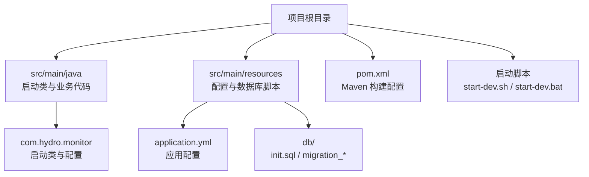
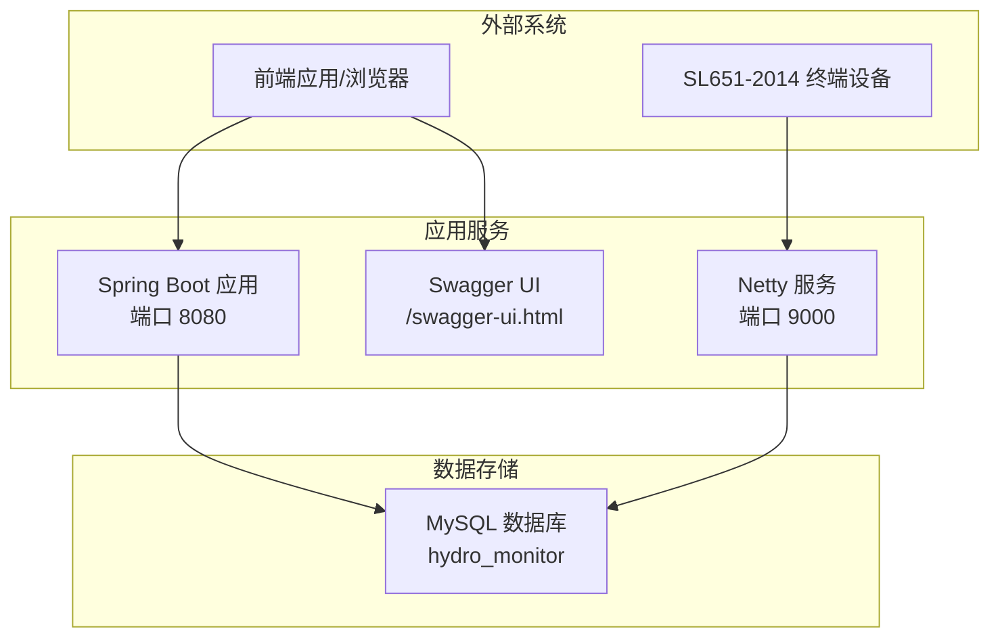
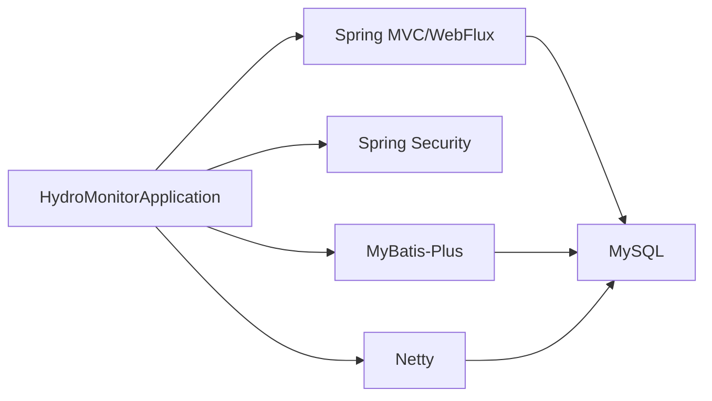

# 部署指南

<cite>
**本文引用的文件**
- [pom.xml](file://pom.xml)
- [application.yml](file://src/main/resources/application.yml)
- [README.md](file://README.md)
- [HydroMonitorApplication.java](file://src/main/java/com/hydro/monitor/HydroMonitorApplication.java)
- [DevToolsTestController.java](file://src/main/java/com/hydro/monitor/modules/controller/DevToolsTestController.java)
- [start-dev.sh](file://start-dev.sh)
- [start-dev.bat](file://start-dev.bat)
- [test-hot-reload.bat](file://test-hot-reload.bat)
- [verify-hot-reload.bat](file://verify-hot-reload.bat)
- [init.sql](file://src/main/resources/db/init.sql)
- [migration_raw_message.sql](file://src/main/resources/db/migration_raw_message.sql)
- [migration_timed_report.sql](file://src/main/resources/db/migration_timed_report.sql)
</cite>

## 目录
1. [简介](#简介)
2. [项目结构](#项目结构)
3. [核心组件](#核心组件)
4. [架构总览](#架构总览)
5. [详细组件分析](#详细组件分析)
6. [依赖关系分析](#依赖关系分析)
7. [性能考虑](#性能考虑)
8. [故障排除指南](#故障排除指南)
9. [结论](#结论)
10. [附录](#附录)

## 简介
本指南面向运维与开发团队，提供水文监测系统在生产环境的完整部署流程，涵盖服务器环境准备、JDK 17安装、MySQL数据库初始化、应用打包与部署、环境变量与启动参数配置、开发与生产环境差异策略、DevTools热重载使用方法、部署脚本操作、常见问题排查以及部署验证步骤。同时给出系统要求、硬件配置建议与部署前准备清单，帮助您安全、稳定地完成系统上线。

## 项目结构
项目采用标准的 Spring Boot Maven 工程结构，核心目录与文件如下：
- 核心启动类位于 src/main/java/com/hydro/monitor/HydroMonitorApplication.java
- 配置文件位于 src/main/resources/application.yml
- 数据库初始化与迁移脚本位于 src/main/resources/db/
- Maven 构建配置位于 pom.xml
- 开发环境热部署脚本位于根目录 start-dev.sh/start-dev.bat 及相关测试脚本

图表来源
- [HydroMonitorApplication.java:1-36](file://src/main/java/com/hydro/monitor/HydroMonitorApplication.java#L1-L36)
- [application.yml:1-86](file://src/main/resources/application.yml#L1-L86)
- [pom.xml:1-179](file://pom.xml#L1-L179)

章节来源
- [README.md:85-106](file://README.md#L85-L106)

## 核心组件
- Spring Boot 应用启动类：负责应用引导与运行时检查（如 DevTools 状态）
- 配置中心：application.yml 提供服务器端口、数据库连接、日志、JWT、Swagger、Netty、模拟上报等配置
- 数据库：MySQL 8.0+，包含心跳、定时报文、要素配置、终端设备等核心表，并提供初始化与迁移脚本
- 网络服务：基于 Netty 的 9000 端口服务，处理 SL 651-2014 协议报文
- 开发工具：Spring Boot DevTools 支持热部署，提升开发效率

章节来源
- [HydroMonitorApplication.java:12-35](file://src/main/java/com/hydro/monitor/HydroMonitorApplication.java#L12-L35)
- [application.yml:1-86](file://src/main/resources/application.yml#L1-L86)
- [init.sql:1-93](file://src/main/resources/db/init.sql#L1-L93)

## 架构总览
系统采用前后端分离架构，后端通过 Spring Boot 提供 REST API 与 Netty 网络服务，前端通过 Swagger UI 访问 API 文档。数据库负责持久化原始报文、定时报文、要素配置与用户信息。

图表来源
- [application.yml:1-86](file://src/main/resources/application.yml#L1-L86)
- [init.sql:1-93](file://src/main/resources/db/init.sql#L1-L93)

## 详细组件分析

### 服务器环境准备
- 操作系统：推荐 Linux（CentOS/RHEL 7+/Ubuntu 18.04+）或 Windows Server 2016+
- 硬件配置建议：
  - CPU：至少 2 核心，建议 4 核以上
  - 内存：至少 4GB，建议 8GB 以上
  - 存储：系统盘 50GB+，数据盘根据日志与报文量评估
  - 网络：开放 8080（HTTP）、9000（Netty）、3306（MySQL）端口
- 防火墙与安全组：确保上述端口放行；生产环境建议开启 HTTPS 与访问控制
- 时间同步：配置 NTP 保持系统时间一致

章节来源
- [README.md:108-114](file://README.md#L108-L114)

### JDK 17 安装
- 系统要求：Java 17（本项目明确指定）
- 安装方式（以 Ubuntu 为例）：
  - 使用官方 OpenJDK 17 或 Oracle JDK 17
  - 配置 JAVA_HOME 与 PATH 环境变量
  - 验证：java -version 与 javac -version
- 生产环境建议：
  - 使用容器镜像（如 openjdk:17-jre-slim）统一运行环境
  - 固定 JDK 版本，避免升级导致的兼容性问题

章节来源
- [pom.xml:21-28](file://pom.xml#L21-L28)

### MySQL 数据库配置与初始化
- 数据库版本：MySQL 8.0+
- 初始化步骤：
  1) 创建数据库与用户（可参考 init.sql 中的创建语句）
  2) 执行初始化脚本：初始化核心表（心跳、定时报文、要素配置、终端设备、用户）
  3) 执行迁移脚本：将定时报文表从旧字段结构迁移到 JSON 结构
  4) 校验数据完整性与索引
- 生产环境注意事项：
  - 使用强密码与最小权限原则
  - 开启二进制日志与备份策略
  - 配置字符集与排序规则（utf8mb4、utf8mb4_unicode_ci）

章节来源
- [init.sql:1-93](file://src/main/resources/db/init.sql#L1-L93)
- [migration_raw_message.sql:1-14](file://src/main/resources/db/migration_raw_message.sql#L1-L14)
- [migration_timed_report.sql:1-44](file://src/main/resources/db/migration_timed_report.sql#L1-L44)

### Maven 构建与 Spring Boot 打包
- 构建命令（示例）：
  - 清理与编译：mvn clean compile
  - 打包：mvn package
  - 生成可执行 JAR：mvn spring-boot:build-image（可选，生成容器镜像）
- 构建产物：
  - target/hydro-monitor-1.0.0.jar（可直接运行）
  - 可选：Docker 镜像（如启用 build-image）
- 关键构建配置：
  - Java 版本：17
  - 排除 Lombok 注解处理器
  - 设置 JVM 编码参数（UTF-8）

章节来源
- [pom.xml:155-177](file://pom.xml#L155-L177)

### 环境变量与启动参数配置
- 应用配置（application.yml）：
  - 服务器端口：server.port
  - 数据库连接：spring.datasource.url、username、password
  - Jackson 时区与日期格式：spring.jackson.*
  - MyBatis-Plus：spring.mybatis-plus.*
  - DevTools：spring.devtools.restart/livereload
  - Netty 端口：netty.server.port
  - JWT：jwt.secret、jwt.expiration
  - Swagger：springdoc.api-docs.path、springdoc.swagger-ui.path
  - 日志：logging.level、pattern、file
  - 模拟上报：simulation.enabled、terminal-count、report-interval-seconds 等
- 启动参数（示例）：
  - JVM 参数：-Dfile.encoding=UTF-8、-Dconsole.encoding=UTF-8
  - Spring Boot 运行参数：通过 -Dspring-boot.run.jvmArguments 传入
- 生产环境建议：
  - 将敏感配置移至环境变量或密钥管理服务
  - 禁用模拟上报（simulation.enabled=false）
  - 修改 JWT 密钥为强随机值
  - 启用 HTTPS 并配置 SSL 证书

章节来源
- [application.yml:1-86](file://src/main/resources/application.yml#L1-L86)
- [pom.xml:160-174](file://pom.xml#L160-L174)

### 开发环境与生产环境部署策略
- 开发环境（DevTools 热重载）：
  - 使用 start-dev.sh/start-dev.bat 自动编译并启动应用
  - DevTools 自动监听 src/main/java 变更并触发重启
  - 热加载生效范围：静态资源除外（exclude: static/**,public/**）
- 生产环境（无 DevTools）：
  - 使用打包后的可执行 JAR 运行
  - 禁用模拟上报与 DevTools
  - 使用 systemd 或 Docker 管理进程与日志轮转
  - 配置健康检查与监控告警

章节来源
- [start-dev.sh:1-25](file://start-dev.sh#L1-L25)
- [start-dev.bat:1-28](file://start-dev.bat#L1-L28)
- [application.yml:34-42](file://src/main/resources/application.yml#L34-L42)

### DevTools 热重载功能使用
- 功能说明：
  - DevTools 在开发模式下启用，支持代码变更自动重启与浏览器实时刷新
  - 通过 DevToolsTestController 提供测试接口与状态查询
- 使用步骤：
  1) 启动应用：start-dev.bat 或 ./start-dev.sh
  2) 访问测试接口：GET /api/v1/devtools/test
  3) 修改 DevToolsTestController 代码并保存
  4) 再次访问测试接口，观察无需重启即可看到变化
- 验证脚本：
  - verify-hot-reload.bat：检查 DevTools 依赖、配置、脚本与控制器是否存在
  - test-hot-reload.bat：启动应用并等待后发起测试请求

章节来源
- [DevToolsTestController.java:1-64](file://src/main/java/com/hydro/monitor/modules/controller/DevToolsTestController.java#L1-L64)
- [verify-hot-reload.bat:1-55](file://verify-hot-reload.bat#L1-L55)
- [test-hot-reload.bat:1-28](file://test-hot-reload.bat#L1-L28)

### 部署脚本使用方法
- Windows：双击 start-dev.bat 或命令行执行
- Linux/Mac：chmod +x start-dev.sh 后 ./start-dev.sh
- 脚本功能：
  - 清理旧构建
  - 编译项目
  - 启动应用（支持热部署）
- 生产部署建议：
  - 使用 systemd 或 Docker Compose 管理服务
  - 配置日志轮转与健康检查
  - 使用反向代理（Nginx/Tengine）暴露服务

章节来源
- [start-dev.sh:1-25](file://start-dev.sh#L1-L25)
- [start-dev.bat:1-28](file://start-dev.bat#L1-L28)

### 部署验证步骤
- 服务可用性：
  - 访问 HTTP 服务：http://localhost:8080
  - 访问 API 文档：http://localhost:8080/swagger-ui.html
  - 访问 Netty 服务：localhost:9000（SL 651-2014 协议）
- 数据库连通性：
  - 确认 application.yml 中的数据库连接信息正确
  - 执行初始化与迁移脚本后验证表结构与数据
- DevTools 验证（开发环境）：
  - 使用 verify-hot-reload.bat 检查依赖与配置
  - 使用 test-hot-reload.bat 测试热部署效果
- 性能与稳定性：
  - 查看日志文件（logs/hydro-monitor-backend.log）
  - 监控内存、CPU、磁盘与数据库连接池

章节来源
- [README.md:53-59](file://README.md#L53-L59)
- [application.yml:62-77](file://src/main/resources/application.yml#L62-L77)

## 依赖关系分析
- 构建与运行依赖：
  - Spring Boot 3.5.9、Spring Security 6、MyBatis-Plus 3.5.9、Netty 4.1、MySQL Connector/J
  - DevTools 仅用于开发环境
- 运行时依赖链：
  - 应用启动类 -> Spring Boot 自动装配 -> Web/Swagger/Security/MyBatis-Plus/Netty
  - 数据访问层 -> MyBatis-Plus -> MySQL
  - 网络层 -> Netty -> SL 651-2014 协议解析

图表来源
- [pom.xml:30-153](file://pom.xml#L30-L153)
- [HydroMonitorApplication.java:12-35](file://src/main/java/com/hydro/monitor/HydroMonitorApplication.java#L12-L35)

章节来源
- [pom.xml:30-153](file://pom.xml#L30-L153)

## 性能考虑
- JVM 参数优化：
  - 设置合适的堆大小（-Xms/-Xmx）
  - 启用 G1GC 并调整 GC 参数
  - 设置文件编码与控制台编码（UTF-8）
- 数据库优化：
  - 为高频查询字段建立索引（如遥测站地址、观测时间）
  - 合理分页与查询条件，避免全表扫描
  - 定期维护与统计信息更新
- 网络与协议：
  - Netty 线程模型与缓冲区大小按并发量调优
  - SL 651-2014 解析逻辑尽量减少字符串拼接与正则
- 日志与监控：
  - 控制日志级别，避免过多 I/O
  - 使用异步日志或集中式日志收集
  - 配置健康检查与指标监控

## 故障排除指南
- 启动失败（端口占用）：
  - 检查 8080/9000 端口占用情况，修改 application.yml 中的端口
- 数据库连接异常：
  - 核对 application.yml 中的数据库 URL、用户名、密码
  - 确认 MySQL 服务运行与网络可达
- DevTools 不生效：
  - 确认 pom.xml 中已引入 spring-boot-devtools
  - 使用 verify-hot-reload.bat 检查依赖与配置
  - 确保修改了 src/main/java 下的文件
- 热部署不触发：
  - 检查 spring.devtools.restart.exclude 配置
  - 确认未修改 static/** 或 public/** 目录下的静态资源
- 日志问题：
  - 检查 logging.file 配置与权限
  - 查看 logs/hydro-monitor-backend.log

章节来源
- [application.yml:1-86](file://src/main/resources/application.yml#L1-L86)
- [verify-hot-reload.bat:1-55](file://verify-hot-reload.bat#L1-L55)

## 结论
通过本部署指南，您可以完成从服务器环境准备到应用上线的全流程操作。开发环境建议使用 DevTools 提升迭代效率，生产环境需严格禁用模拟上报与 DevTools，强化安全与稳定性。结合脚本化与自动化手段，可显著降低部署成本并提升可靠性。

## 附录

### 系统要求与硬件建议
- 操作系统：Linux（推荐 CentOS/RHEL 7+/Ubuntu 18.04+）或 Windows Server 2016+
- JDK：Java 17
- 数据库：MySQL 8.0+
- 网络：开放 8080（HTTP）、9000（Netty）、3306（MySQL）
- 硬件：CPU≥2 核、内存≥4GB（建议 8GB+）、存储充足

章节来源
- [README.md:74-84](file://README.md#L74-L84)

### 部署前准备清单
- 服务器与网络配置完成
- JDK 17 安装并配置环境变量
- MySQL 8.0+ 安装并创建数据库
- 执行 init.sql 与迁移脚本
- application.yml 中数据库与端口配置正确
- DevTools 依赖与配置检查通过（开发环境）
- 启动脚本可执行（Linux/Mac 需 chmod +x）

章节来源
- [init.sql:1-93](file://src/main/resources/db/init.sql#L1-L93)
- [migration_raw_message.sql:1-14](file://src/main/resources/db/migration_raw_message.sql#L1-L14)
- [migration_timed_report.sql:1-44](file://src/main/resources/db/migration_timed_report.sql#L1-L44)
- [application.yml:1-86](file://src/main/resources/application.yml#L1-L86)
- [verify-hot-reload.bat:1-55](file://verify-hot-reload.bat#L1-L55)