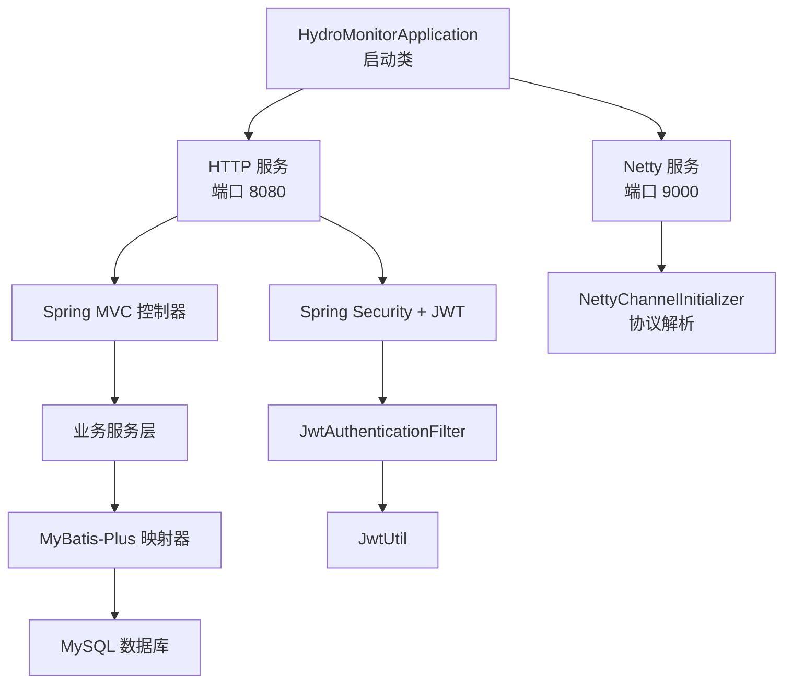
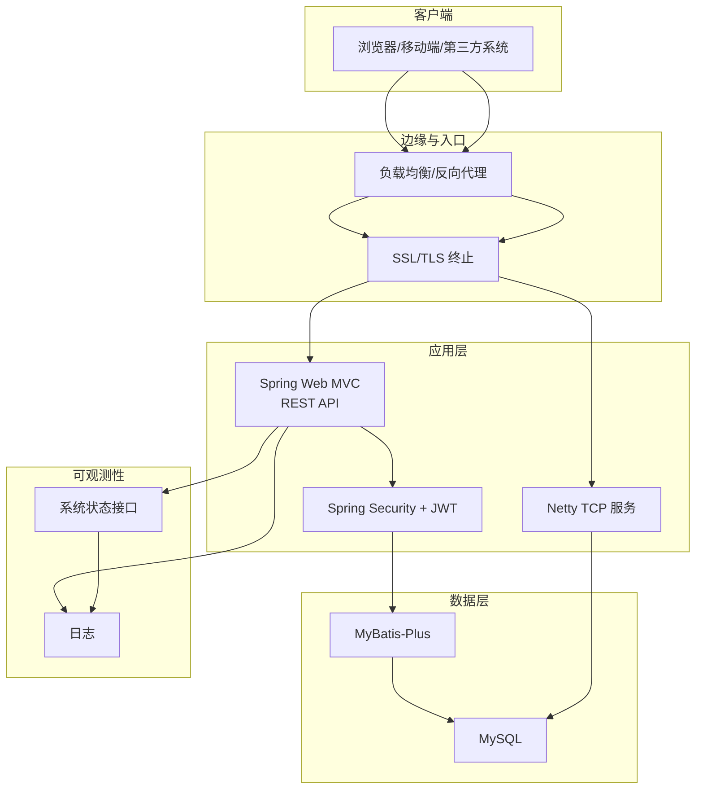
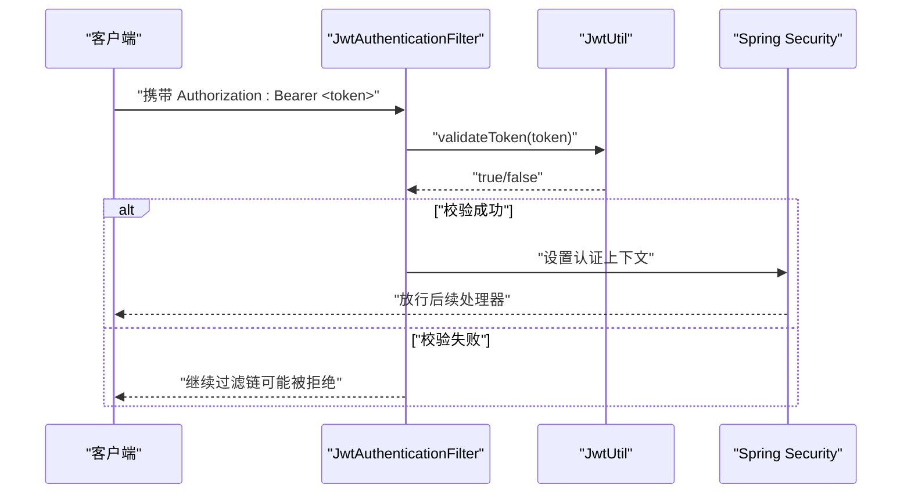
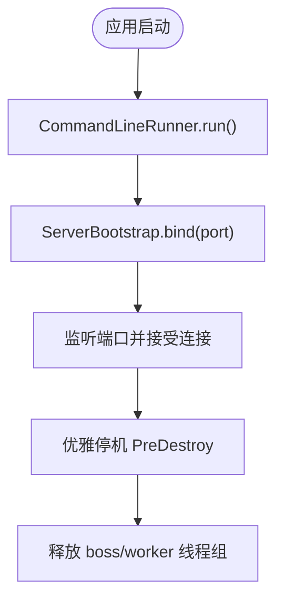
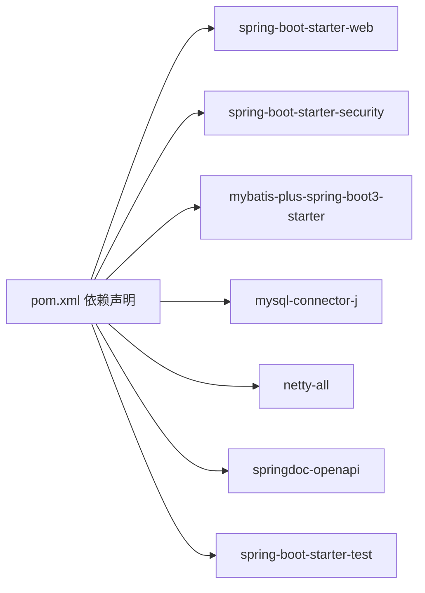

# 部署运维

<cite>
**本文引用的文件**
- [README.md](file://README.md)
- [pom.xml](file://pom.xml)
- [application.yml](file://src/main/resources/application.yml)
- [HydroMonitorApplication.java](file://src/main/java/com/hydro/monitor/HydroMonitorApplication.java)
- [SecurityConfig.java](file://src/main/java/com/hydro/monitor/config/security/SecurityConfig.java)
- [JwtAuthenticationFilter.java](file://src/main/java/com/hydro/monitor/config/security/JwtAuthenticationFilter.java)
- [JwtUtil.java](file://src/main/java/com/hydro/monitor/config/security/JwtUtil.java)
- [NettyConfig.java](file://src/main/java/com/hydro/monitor/config/NettyConfig.java)
- [MyBatisPlusConfig.java](file://src/main/java/com/hydro/monitor/config/MyBatisPlusConfig.java)
- [SystemMonitorController.java](file://src/main/java/com/hydro/monitor/modules/controller/SystemMonitorController.java)
- [AuthController.java](file://src/main/java/com/hydro/monitor/modules/controller/AuthController.java)
- [init.sql](file://src/main/resources/db/init.sql)
- [start-dev.sh](file://start-dev.sh)
- [start-dev.bat](file://start-dev.bat)
- [JwtUtilTest.java](file://src/test/java/com/hydro/monitor/config/security/JwtUtilTest.java)
- [AuthControllerTest.java](file://src/test/java/com/hydro/monitor/modules/controller/AuthControllerTest.java)
</cite>

## 目录
1. [简介](#简介)
2. [项目结构](#项目结构)
3. [核心组件](#核心组件)
4. [架构总览](#架构总览)
5. [详细组件分析](#详细组件分析)
6. [依赖关系分析](#依赖关系分析)
7. [性能考量](#性能考量)
8. [故障排查指南](#故障排查指南)
9. [结论](#结论)
10. [附录](#附录)

## 简介
本指南面向生产环境部署与运维，覆盖服务器准备、依赖安装、应用打包与部署配置；阐述容器化（Docker）、Kubernetes 集群部署与微服务架构下的部署策略；解释监控告警、日志管理与性能指标；包含负载均衡、SSL 证书与网络安全策略；提供故障排查、应急响应与灾难恢复建议；说明 CI/CD 流水线、自动化部署与版本发布管理；并给出运维最佳实践、成本优化与扩展性规划建议。

## 项目结构
系统采用 Spring Boot 3 + Netty 的混合架构，提供 HTTP REST API 与 TCP 网络协议服务，内置数据库初始化脚本与开发期热部署脚本。核心模块包括：
- 启动入口与端口配置
- 安全与认证（Spring Security + JWT）
- 网络服务（Netty TCP）
- 数据持久化（MyBatis-Plus + MySQL）
- 监控与系统状态接口
- 开发期热部署脚本

图表来源
- [HydroMonitorApplication.java:1-36](file://src/main/java/com/hydro/monitor/HydroMonitorApplication.java#L1-L36)
- [application.yml:1-86](file://src/main/resources/application.yml#L1-L86)
- [SecurityConfig.java:1-76](file://src/main/java/com/hydro/monitor/config/security/SecurityConfig.java#L1-L76)
- [JwtAuthenticationFilter.java:1-75](file://src/main/java/com/hydro/monitor/config/security/JwtAuthenticationFilter.java#L1-L75)
- [JwtUtil.java:1-126](file://src/main/java/com/hydro/monitor/config/security/JwtUtil.java#L1-L126)
- [NettyConfig.java:1-87](file://src/main/java/com/hydro/monitor/config/NettyConfig.java#L1-L87)
- [MyBatisPlusConfig.java:1-39](file://src/main/java/com/hydro/monitor/config/MyBatisPlusConfig.java#L1-L39)
- [init.sql:1-93](file://src/main/resources/db/init.sql#L1-L93)

章节来源
- [README.md:85-106](file://README.md#L85-L106)
- [pom.xml:1-179](file://pom.xml#L1-L179)
- [application.yml:1-86](file://src/main/resources/application.yml#L1-L86)

## 核心组件
- 启动与端口
  - HTTP 服务端口：8080
  - Netty TCP 服务端口：9000
  - Swagger 文档路径：/swagger-ui.html
- 安全与认证
  - 基于无状态会话（JWT）
  - 授权规则：/api/v1/auth/** 免认证；其他接口需认证
  - 密码编码器：BCrypt
- 数据库与持久化
  - MySQL 8.0+
  - MyBatis-Plus 分页拦截器（MySQL）
- 日志与监控
  - 控制台与文件日志，UTF-8 编码
  - 系统状态接口（内存、线程、CPU 简化指标）

章节来源
- [HydroMonitorApplication.java:15-34](file://src/main/java/com/hydro/monitor/HydroMonitorApplication.java#L15-L34)
- [application.yml:1-86](file://src/main/resources/application.yml#L1-L86)
- [SecurityConfig.java:33-52](file://src/main/java/com/hydro/monitor/config/security/SecurityConfig.java#L33-L52)
- [JwtUtil.java:25-29](file://src/main/java/com/hydro/monitor/config/security/JwtUtil.java#L25-L29)
- [MyBatisPlusConfig.java:23-37](file://src/main/java/com/hydro/monitor/config/MyBatisPlusConfig.java#L23-L37)
- [SystemMonitorController.java:34-66](file://src/main/java/com/hydro/monitor/modules/controller/SystemMonitorController.java#L34-L66)

## 架构总览
系统由 Spring Web MVC 提供 REST API，Netty 提供 SL 651-2014 协议接入；安全层通过 JWT 过滤器完成认证；持久层使用 MyBatis-Plus；日志与监控贯穿各层。

图表来源
- [SecurityConfig.java:33-52](file://src/main/java/com/hydro/monitor/config/security/SecurityConfig.java#L33-L52)
- [JwtAuthenticationFilter.java:31-59](file://src/main/java/com/hydro/monitor/config/security/JwtAuthenticationFilter.java#L31-L59)
- [NettyConfig.java:40-70](file://src/main/java/com/hydro/monitor/config/NettyConfig.java#L40-L70)
- [MyBatisPlusConfig.java:23-37](file://src/main/java/com/hydro/monitor/config/MyBatisPlusConfig.java#L23-L37)
- [SystemMonitorController.java:34-66](file://src/main/java/com/hydro/monitor/modules/controller/SystemMonitorController.java#L34-L66)

## 详细组件分析

### 安全与认证（Spring Security + JWT）
- 过滤链
  - 禁用 CSRF，无状态会话
  - 公开路径免认证（认证、Swagger）
  - 其余接口需认证
- JWT 过滤器
  - 从 Authorization 头提取 Bearer Token
  - 校验通过后写入 SecurityContext
- JWT 工具
  - HMAC-SHA 签名密钥来自配置
  - 默认过期时间 24 小时

图表来源
- [JwtAuthenticationFilter.java:31-59](file://src/main/java/com/hydro/monitor/config/security/JwtAuthenticationFilter.java#L31-L59)
- [JwtUtil.java:67-75](file://src/main/java/com/hydro/monitor/config/security/JwtUtil.java#L67-L75)
- [SecurityConfig.java:33-52](file://src/main/java/com/hydro/monitor/config/security/SecurityConfig.java#L33-L52)

章节来源
- [SecurityConfig.java:33-52](file://src/main/java/com/hydro/monitor/config/security/SecurityConfig.java#L33-L52)
- [JwtAuthenticationFilter.java:31-74](file://src/main/java/com/hydro/monitor/config/security/JwtAuthenticationFilter.java#L31-L74)
- [JwtUtil.java:37-48](file://src/main/java/com/hydro/monitor/config/security/JwtUtil.java#L37-L48)

### Netty 网络服务
- 启动时机：CommandLineRunner，在应用启动后异步绑定端口
- 线程模型：boss/worker 组合
- 优雅停机：PreDestroy 释放事件循环组
- 适配器：NettyChannelInitializer（协议解析组件）

图表来源
- [NettyConfig.java:40-85](file://src/main/java/com/hydro/monitor/config/NettyConfig.java#L40-L85)

章节来源
- [NettyConfig.java:26-85](file://src/main/java/com/hydro/monitor/config/NettyConfig.java#L26-L85)

### 数据持久化与分页
- MyBatis-Plus 拦截器
  - MySQL 分页拦截器
  - 最大单页限制 500
  - 溢出处理策略（false）

章节来源
- [MyBatisPlusConfig.java:23-37](file://src/main/java/com/hydro/monitor/config/MyBatisPlusConfig.java#L23-L37)

### 系统监控与状态接口
- 接口：/api/v1/system/status
- 指标：堆内存使用、最大堆、线程数、CPU 使用率（简化）
- 日志级别：INFO/DEBUG 控制台与文件输出

章节来源
- [SystemMonitorController.java:34-66](file://src/main/java/com/hydro/monitor/modules/controller/SystemMonitorController.java#L34-L66)
- [application.yml:62-77](file://src/main/resources/application.yml#L62-L77)

### 认证控制器
- 登录接口：/api/v1/auth/login
- 流程：查询用户 → 校验密码 → 生成 JWT → 返回 token 与过期时间

章节来源
- [AuthController.java:41-66](file://src/main/java/com/hydro/monitor/modules/controller/AuthController.java#L41-L66)

## 依赖关系分析
- 运行时依赖
  - Spring Boot Web、Security、Validation
  - MyBatis-Plus（含 JSqlParser）
  - MySQL Connector/J
  - Netty
  - SpringDoc OpenAPI
  - Lombok、Hutool
- 构建与打包
  - spring-boot-maven-plugin
  - JVM 参数设置 UTF-8 编码

图表来源
- [pom.xml:30-153](file://pom.xml#L30-L153)

章节来源
- [pom.xml:30-153](file://pom.xml#L30-L153)

## 性能考量
- 端口与并发
  - HTTP 8080、Netty 9000 并行提供服务
  - Netty boss/worker 线程组可按 CPU 核心数调优
- 数据库与分页
  - 分页最大 500 条，避免超大数据集一次性返回
  - 建议对高频查询字段建立索引（已有示例索引）
- 日志与监控
  - 生产环境建议降低控制台日志级别，仅输出文件日志
  - 定期轮转与清理日志文件，避免磁盘压力
- JVM 与容器
  - 设置合适的堆大小与 GC 参数
  - Docker/K8s 中设置资源限制与探针

## 故障排查指南
- 启动失败
  - 检查数据库连接参数与可达性
  - 查看应用日志定位异常
- 认证失败
  - 核对 JWT 密钥与过期时间
  - 检查密码编码一致性（BCrypt）
- 网络接入异常
  - Netty 端口占用与防火墙
  - 协议解析器初始化是否成功
- 数据库问题
  - 初始化 SQL 是否执行
  - 表结构与索引是否完整
- 监控与日志
  - 系统状态接口返回值是否异常
  - 日志文件大小与轮转策略

章节来源
- [application.yml:9-13](file://src/main/resources/application.yml#L9-L13)
- [init.sql:1-93](file://src/main/resources/db/init.sql#L1-L93)
- [SystemMonitorController.java:34-66](file://src/main/java/com/hydro/monitor/modules/controller/SystemMonitorController.java#L34-L66)
- [JwtUtilTest.java:36-45](file://src/test/java/com/hydro/monitor/config/security/JwtUtilTest.java#L36-L45)
- [AuthControllerTest.java:51-69](file://src/test/java/com/hydro/monitor/modules/controller/AuthControllerTest.java#L51-L69)

## 结论
本指南提供了从服务器准备到生产部署、从容器化到 Kubernetes 的实施路径，结合安全、监控、日志与性能优化建议，帮助团队稳定交付与持续运维水文监测系统。

## 附录

### 生产环境部署流程（步骤概览）
- 服务器准备
  - 操作系统：推荐 Linux（Ubuntu/CentOS）
  - JDK：Java 17
  - 数据库：MySQL 8.0+（独立实例或云数据库）
  - 网络：开放 8080（HTTP）、9000（Netty）、反向代理端口
- 依赖安装
  - 安装 Maven（用于构建）
  - 安装 Docker（可选，用于容器化）
- 应用打包
  - 使用 Maven 打包生成可执行 JAR
  - 或构建 Docker 镜像（见容器化章节）
- 部署配置
  - 准备 application.yml 生产配置（数据库、JWT、日志、模拟开关）
  - 准备 systemd 或 Docker 服务管理
- 启动与验证
  - 启动应用与 Netty 服务
  - 访问 /swagger-ui.html 与 /api/v1/system/status
  - 验证登录与数据接口

章节来源
- [README.md:20-58](file://README.md#L20-L58)
- [application.yml:1-86](file://src/main/resources/application.yml#L1-L86)

### 容器化部署（Docker）
- 建议
  - 使用多阶段构建减少镜像体积
  - 挂载外部配置文件与日志目录
  - 为数据库准备独立容器或使用云数据库
- 运行
  - 暴露端口 8080、9000
  - 设置环境变量覆盖 application.yml 中敏感配置
  - 使用健康检查与重启策略

[本节为概念性指导，不直接对应具体源文件]

### Kubernetes 集群部署
- 建议
  - 使用 Deployment 管理副本数与滚动升级
  - 使用 Service 暴露 8080、9000
  - 使用 ConfigMap 管理配置，Secret 管理密钥
  - 使用 HPA 根据 CPU/自定义指标扩缩容
  - 使用 Ingress/Nginx 提供 TLS 终止与路由
- 安全
  - Pod 安全策略与 RBAC
  - 网络策略限制入站/出站流量
- 监控与日志
  - 集成 Prometheus/Grafana 与日志收集（如 ELK/Fluent Bit）

[本节为概念性指导，不直接对应具体源文件]

### 微服务架构下的部署策略
- 服务拆分
  - 按业务域拆分（如认证、终端、报表、消息）
- 通信
  - REST API + 消息队列（可选）
- 配置与注册
  - 使用配置中心与服务发现
- 部署
  - 各服务独立容器化与 K8s 部署
  - 统一网关与鉴权

[本节为概念性指导，不直接对应具体源文件]

### 监控告警、日志与性能指标
- 监控
  - 系统状态接口：内存、线程、CPU
  - 自定义指标：数据库连接池、Netty 连接数、请求延迟
- 告警
  - 基于阈值的告警（CPU、内存、连接数、错误率）
- 日志
  - 文件日志轮转与集中收集
  - 结构化日志便于检索与分析

章节来源
- [SystemMonitorController.java:34-66](file://src/main/java/com/hydro/monitor/modules/controller/SystemMonitorController.java#L34-L66)
- [application.yml:62-77](file://src/main/resources/application.yml#L62-L77)

### 负载均衡、SSL 证书与网络安全
- 负载均衡
  - Nginx/HAProxy/云负载均衡
  - 健康检查与会话保持（如需）
- SSL 证书
  - 使用 Let’s Encrypt 或企业证书
  - 在反向代理终止 TLS，后端使用 HTTP
- 网络安全
  - 防火墙与安全组仅开放必要端口
  - 网络隔离与最小权限原则

[本节为概念性指导，不直接对应具体源文件]

### 故障排查与应急响应
- 常见问题
  - 数据库不可达、JWT 密钥不一致、端口冲突
- 应急响应
  - 快速回滚至上一稳定版本
  - 临时关闭高风险功能（如模拟模块）
- 灾难恢复
  - 数据库备份与恢复演练
  - 多可用区部署与异地容灾

[本节为概念性指导，不直接对应具体源文件]

### CI/CD 流水线、自动化部署与版本发布
- 流水线建议
  - 触发：代码合并至主分支
  - 步骤：代码检出 → 单元测试 → 打包 → 构建镜像 → 推送仓库 → 部署到预生产 → 自动化测试 → 部署到生产
- 版本发布
  - 语义化版本与变更日志
  - 回滚策略与金丝雀发布

[本节为概念性指导，不直接对应具体源文件]

### 运维最佳实践、成本优化与扩展性规划
- 最佳实践
  - 配置外置化、密钥管理、审计日志
  - 健康检查与自动重启
- 成本优化
  - 合理的资源配额与自动伸缩
  - 存储生命周期管理与压缩
- 扩展性规划
  - 读写分离、缓存、消息队列
  - 微服务化与事件驱动架构

[本节为概念性指导，不直接对应具体源文件]