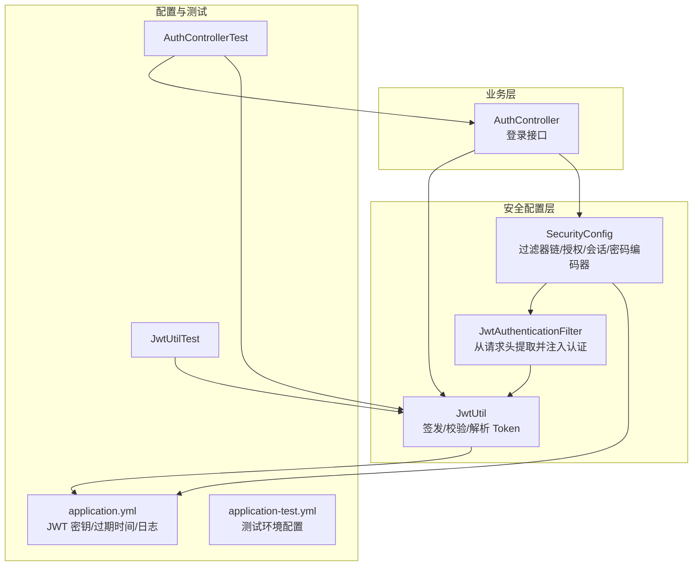
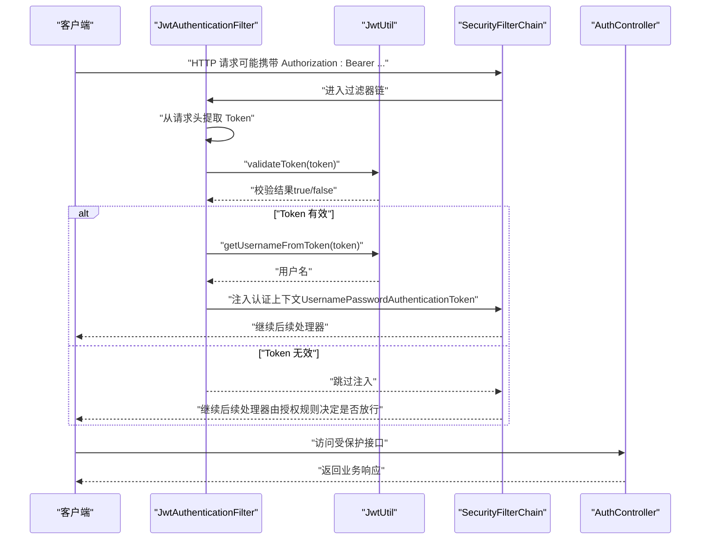
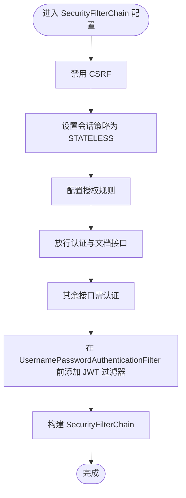
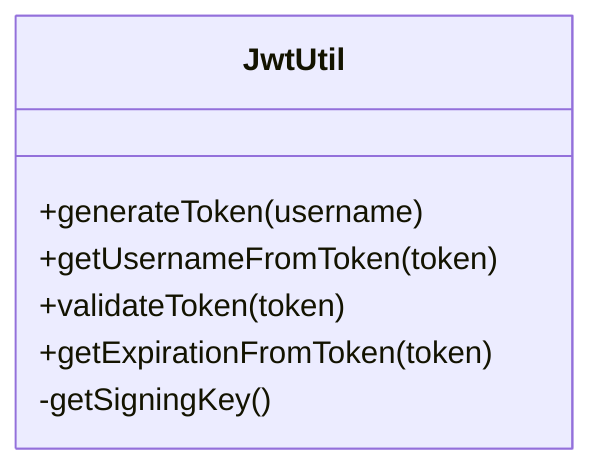
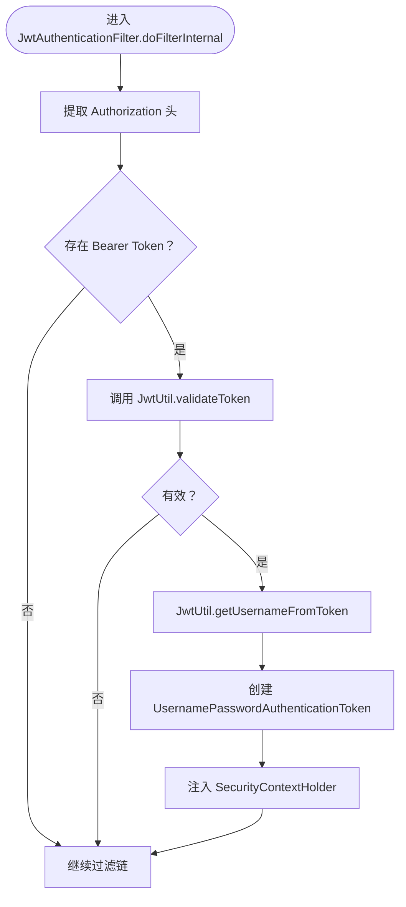
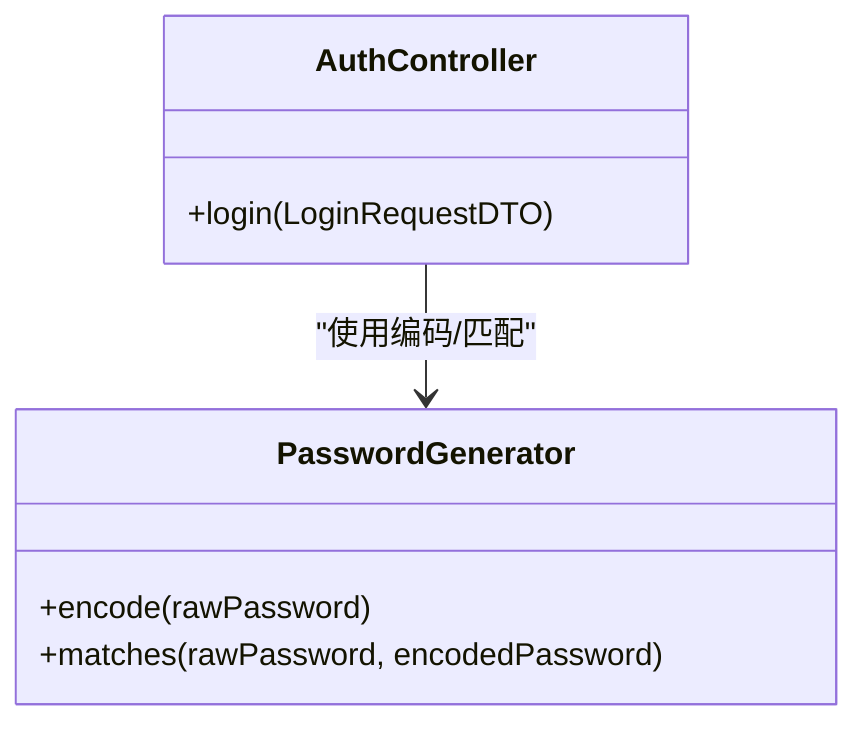
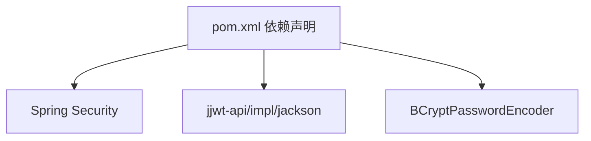

# 安全配置管理

<cite>
**本文引用的文件列表**
- [SecurityConfig.java](file://src/main/java/com/hydro/monitor/config/security/SecurityConfig.java)
- [JwtUtil.java](file://src/main/java/com/hydro/monitor/config/security/JwtUtil.java)
- [JwtAuthenticationFilter.java](file://src/main/java/com/hydro/monitor/config/security/JwtAuthenticationFilter.java)
- [application.yml](file://src/main/resources/application.yml)
- [application-test.yml](file://src/test/resources/application-test.yml)
- [AuthController.java](file://src/main/java/com/hydro/monitor/modules/controller/AuthController.java)
- [PasswordGenerator.java](file://src/main/java/com/hydro/monitor/common/PasswordGenerator.java)
- [JwtUtilTest.java](file://src/test/java/com/hydro/monitor/config/security/JwtUtilTest.java)
- [AuthControllerTest.java](file://src/test/java/com/hydro/monitor/modules/controller/AuthControllerTest.java)
- [pom.xml](file://pom.xml)
</cite>

## 目录
1. [简介](#简介)
2. [项目结构](#项目结构)
3. [核心组件](#核心组件)
4. [架构总览](#架构总览)
5. [详细组件分析](#详细组件分析)
6. [依赖关系分析](#依赖关系分析)
7. [性能考量](#性能考量)
8. [故障排查指南](#故障排查指南)
9. [结论](#结论)
10. [附录](#附录)

## 简介
本文件面向水文监测系统的安全配置管理，聚焦于基于 JWT 的认证与授权、Spring Security 配置策略、密码加密、会话管理、CSRF 防护、安全最佳实践、常见漏洞预防、审计与测试验证、日志与监控以及生产环境加固与合规要求。文档以代码为依据，结合配置文件与测试用例，帮助开发者与运维人员正确理解并实施安全配置。

## 项目结构
安全相关的核心文件集中在配置包与资源目录中：
- 安全配置类：SecurityConfig（过滤器链、授权规则、会话策略、密码编码器）
- JWT 工具类：JwtUtil（密钥、过期时间、签发与校验）
- JWT 认证过滤器：JwtAuthenticationFilter（从请求头提取 Token 并注入认证上下文）
- 控制器：AuthController（登录接口，使用密码编码器与 JWT 工具类）
- 配置文件：application.yml（JWT 密钥与过期时间、日志级别等）
- 测试配置：application-test.yml（测试环境的 JWT 过期时间与数据源）
- 单元测试：JwtUtilTest、AuthControllerTest（覆盖 JWT 生成与登录流程）

图表来源
- [SecurityConfig.java:33-52](file://src/main/java/com/hydro/monitor/config/security/SecurityConfig.java#L33-L52)
- [JwtAuthenticationFilter.java:31-59](file://src/main/java/com/hydro/monitor/config/security/JwtAuthenticationFilter.java#L31-L59)
- [JwtUtil.java:37-48](file://src/main/java/com/hydro/monitor/config/security/JwtUtil.java#L37-L48)
- [AuthController.java:41-66](file://src/main/java/com/hydro/monitor/modules/controller/AuthController.java#L41-L66)
- [application.yml:48-51](file://src/main/resources/application.yml#L48-L51)
- [application-test.yml:14-17](file://src/test/resources/application-test.yml#L14-L17)

章节来源
- [SecurityConfig.java:33-52](file://src/main/java/com/hydro/monitor/config/security/SecurityConfig.java#L33-L52)
- [JwtAuthenticationFilter.java:31-59](file://src/main/java/com/hydro/monitor/config/security/JwtAuthenticationFilter.java#L31-L59)
- [JwtUtil.java:37-48](file://src/main/java/com/hydro/monitor/config/security/JwtUtil.java#L37-L48)
- [AuthController.java:41-66](file://src/main/java/com/hydro/monitor/modules/controller/AuthController.java#L41-L66)
- [application.yml:48-51](file://src/main/resources/application.yml#L48-L51)
- [application-test.yml:14-17](file://src/test/resources/application-test.yml#L14-L17)

## 核心组件
- 过滤器链与授权规则：禁用 CSRF，无状态会话，公开接口放行，其余接口需认证。
- JWT 工具类：提供签发 Token、解析用户名、校验有效性、获取过期时间等能力。
- JWT 认证过滤器：从 Authorization 头提取 Bearer Token，校验后注入认证上下文。
- 密码加密：使用 BCryptPasswordEncoder，服务层与工具类均采用统一编码策略。
- 登录接口：AuthController 调用密码编码器与 JWT 工具类完成认证与 Token 发放。

章节来源
- [SecurityConfig.java:33-52](file://src/main/java/com/hydro/monitor/config/security/SecurityConfig.java#L33-L52)
- [JwtUtil.java:37-48](file://src/main/java/com/hydro/monitor/config/security/JwtUtil.java#L37-L48)
- [JwtAuthenticationFilter.java:31-59](file://src/main/java/com/hydro/monitor/config/security/JwtAuthenticationFilter.java#L31-L59)
- [AuthController.java:41-66](file://src/main/java/com/hydro/monitor/modules/controller/AuthController.java#L41-L66)
- [PasswordGenerator.java:12-35](file://src/main/java/com/hydro/monitor/common/PasswordGenerator.java#L12-L35)

## 架构总览
下图展示从客户端到服务端的认证流程，包括过滤器链、JWT 解析与认证上下文注入。

图表来源
- [JwtAuthenticationFilter.java:31-59](file://src/main/java/com/hydro/monitor/config/security/JwtAuthenticationFilter.java#L31-L59)
- [JwtUtil.java:67-75](file://src/main/java/com/hydro/monitor/config/security/JwtUtil.java#L67-L75)
- [SecurityConfig.java:33-52](file://src/main/java/com/hydro/monitor/config/security/SecurityConfig.java#L33-L52)
- [AuthController.java:41-66](file://src/main/java/com/hydro/monitor/modules/controller/AuthController.java#L41-L66)

## 详细组件分析

### Spring Security 配置策略
- CSRF 禁用：因使用 JWT，无需 CSRF 保护。
- 会话策略：STATELESS，无 Session，适合无状态 API。
- 授权规则：
  - 公开接口：认证相关与 Swagger 文档接口放行。
  - 其余接口：需认证。
- 密码编码器：BCryptPasswordEncoder，统一用于用户密码存储与比对。
- 认证管理器：基于 DaoAuthenticationProvider，配合密码编码器。

图表来源
- [SecurityConfig.java:33-52](file://src/main/java/com/hydro/monitor/config/security/SecurityConfig.java#L33-L52)

章节来源
- [SecurityConfig.java:33-52](file://src/main/java/com/hydro/monitor/config/security/SecurityConfig.java#L33-L52)

### JWT 配置参数与安全含义
- 密钥（jwt.secret）：用于 HMAC-SHA 对称签名，必须足够随机且保密，建议使用强随机密钥并在生产环境使用密钥管理服务。
- 过期时间（jwt.expiration）：毫秒单位，默认 24 小时；测试环境为 1 小时。过期时间越短，风险暴露窗口越小，但用户体验下降；应结合业务场景权衡。
- 加密算法：当前使用 HMAC-SHA（由密钥派生），属于对称算法，适合无状态 API 场景；如需更强的密钥管理，可考虑 RS256（RSA）并配合密钥轮换。

图表来源
- [JwtUtil.java:37-48](file://src/main/java/com/hydro/monitor/config/security/JwtUtil.java#L37-L48)
- [JwtUtil.java:122-124](file://src/main/java/com/hydro/monitor/config/security/JwtUtil.java#L122-L124)

章节来源
- [JwtUtil.java:25-29](file://src/main/java/com/hydro/monitor/config/security/JwtUtil.java#L25-L29)
- [application.yml:48-51](file://src/main/resources/application.yml#L48-L51)
- [application-test.yml:14-17](file://src/test/resources/application-test.yml#L14-L17)

### JWT 认证过滤器
- 提取逻辑：从 Authorization 头读取 Bearer Token。
- 校验与注入：若 Token 有效，解析用户名并创建认证对象注入 SecurityContext。
- 异常处理：捕获异常并记录日志，不影响后续过滤链执行。

图表来源
- [JwtAuthenticationFilter.java:31-59](file://src/main/java/com/hydro/monitor/config/security/JwtAuthenticationFilter.java#L31-L59)
- [JwtUtil.java:67-75](file://src/main/java/com/hydro/monitor/config/security/JwtUtil.java#L67-L75)

章节来源
- [JwtAuthenticationFilter.java:31-59](file://src/main/java/com/hydro/monitor/config/security/JwtAuthenticationFilter.java#L31-L59)
- [JwtUtil.java:56-59](file://src/main/java/com/hydro/monitor/config/security/JwtUtil.java#L56-L59)

### 密码加密配置
- 存储策略：使用 BCryptPasswordEncoder 对密码进行编码存储。
- 比对策略：登录时使用 matches 方法进行比对。
- 工具类：PasswordGenerator 提供静态方法封装编码与匹配逻辑，便于工具化生成哈希。

图表来源
- [PasswordGenerator.java:12-35](file://src/main/java/com/hydro/monitor/common/PasswordGenerator.java#L12-L35)
- [AuthController.java:53-57](file://src/main/java/com/hydro/monitor/modules/controller/AuthController.java#L53-L57)

章节来源
- [PasswordGenerator.java:12-35](file://src/main/java/com/hydro/monitor/common/PasswordGenerator.java#L12-L35)
- [AuthController.java:53-57](file://src/main/java/com/hydro/monitor/modules/controller/AuthController.java#L53-L57)

### 会话管理与 CSRF 防护
- 会话管理：无状态（STATELESS），避免服务端维护会话，降低会话劫持风险。
- CSRF 防护：禁用 CSRF，适用于无状态 API；若未来引入表单登录，需重新评估并启用 CSRF 保护。

章节来源
- [SecurityConfig.java:37-39](file://src/main/java/com/hydro/monitor/config/security/SecurityConfig.java#L37-L39)

### 权限控制规则
- 公开接口：认证相关路径与 Swagger 文档路径放行。
- 其他接口：全部需要认证。
- 规则定义：authorizeHttpRequests 中明确声明。

章节来源
- [SecurityConfig.java:41-47](file://src/main/java/com/hydro/monitor/config/security/SecurityConfig.java#L41-L47)

## 依赖关系分析
- 依赖组件：
  - Spring Security：提供过滤器链、认证管理器、密码编码器。
  - JWT（jjwt）：提供 Token 签发与解析能力。
  - BCrypt：提供密码编码与匹配。
- 关键依赖版本与坐标见 Maven POM。

图表来源
- [pom.xml:77-94](file://pom.xml#L77-L94)

章节来源
- [pom.xml:77-94](file://pom.xml#L77-L94)

## 性能考量
- 无状态设计：避免会话存储，降低服务端内存压力。
- 密码编码成本：BCrypt 默认迭代次数较高，登录校验有一定 CPU 开销，可通过配置调整或缓存策略优化。
- Token 校验：每次请求均需解析与校验，建议在网关层或边缘层做限流与缓存。

## 故障排查指南
- Token 无效：
  - 检查密钥一致性与过期时间。
  - 确认请求头格式为 Bearer Token。
- 登录失败：
  - 核对用户名是否存在与密码是否匹配。
  - 查看日志中警告与错误输出。
- 授权异常：
  - 确认授权规则与请求路径是否匹配。
  - 检查过滤器链顺序与自定义过滤器是否正确注入。

章节来源
- [JwtUtilTest.java:62-76](file://src/test/java/com/hydro/monitor/config/security/JwtUtilTest.java#L62-L76)
- [AuthControllerTest.java:76-100](file://src/test/java/com/hydro/monitor/modules/controller/AuthControllerTest.java#L76-L100)
- [AuthController.java:48-57](file://src/main/java/com/hydro/monitor/modules/controller/AuthController.java#L48-L57)

## 结论
本项目采用无状态 JWT 认证，结合 Spring Security 的过滤器链与授权规则，实现了简洁而安全的认证体系。通过 BCrypt 密码编码、严格的授权规则与日志记录，满足了水文监测系统的安全需求。建议在生产环境中进一步强化密钥管理、启用 HTTPS、完善审计与监控，并按需引入更严格的权限控制与审计策略。

## 附录

### 安全配置最佳实践
- 密钥管理：使用强随机密钥，定期轮换，结合密钥管理服务（KMS）。
- 过期时间：根据业务风险与用户体验平衡，短期令牌配合刷新机制。
- 算法选择：对称算法适合无状态 API；如需更强密钥管理可考虑 RS256。
- 传输安全：生产环境启用 HTTPS，防止中间人攻击。
- 权限最小化：基于角色与资源的细粒度授权。
- 审计与监控：记录登录、认证失败、敏感操作等事件，建立告警机制。

### 常见安全漏洞与预防
- JWT 重放：缩短过期时间、引入黑名单或一次性令牌。
- 密码泄露：仅存储哈希，避免明文或弱加密。
- CSRF：当前禁用，若引入表单登录需启用并使用 SameSite Cookie。
- 会话固定：无状态设计天然避免，保持无状态策略。
- 信息泄露：避免在错误消息中暴露敏感信息。

### 安全配置的审计方法
- 密钥与过期时间：检查配置文件与环境变量，确认未硬编码在代码中。
- 授权规则：核对放行路径与受保护路径，确保最小暴露面。
- 日志级别：生产环境避免输出敏感信息，保留审计日志。
- 依赖版本：定期更新依赖，修复已知漏洞。

### 测试验证步骤
- JWT 工具类测试：验证 Token 生成、解析、过期时间与有效性。
- 登录接口测试：验证用户名/密码错误、请求格式错误等边界情况。
- 过滤器链测试：结合 Security 测试支持验证未认证访问被拒绝。

章节来源
- [JwtUtilTest.java:36-154](file://src/test/java/com/hydro/monitor/config/security/JwtUtilTest.java#L36-L154)
- [AuthControllerTest.java:50-112](file://src/test/java/com/hydro/monitor/modules/controller/AuthControllerTest.java#L50-L112)

### 安全日志与监控
- 日志配置：控制台与文件输出，设置合适的日志级别与编码。
- 审计事件：记录登录、认证失败、敏感操作等事件，便于追踪与告警。

章节来源
- [application.yml:62-76](file://src/main/resources/application.yml#L62-L76)

### 生产环境加固与合规要求
- 禁用模拟模块：生产环境关闭模拟上报功能。
- 修改密钥：使用强随机密钥并妥善保管。
- 启用 HTTPS：配置 SSL 证书，强制 HTTPS。
- 最小权限：仅开放必要端口与接口，严格控制访问来源。
- 审计与合规：满足数据保护与访问审计要求，定期进行安全评估。

章节来源
- [application.yml:80-84](file://src/main/resources/application.yml#L80-L84)
- [README.md:108-113](file://README.md#L108-L113)