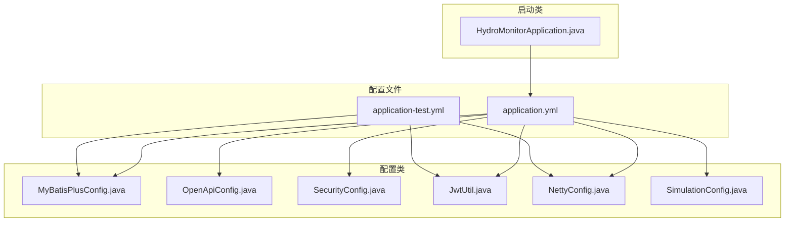
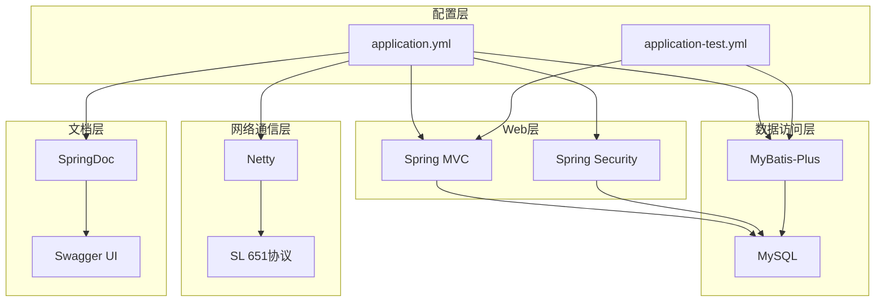
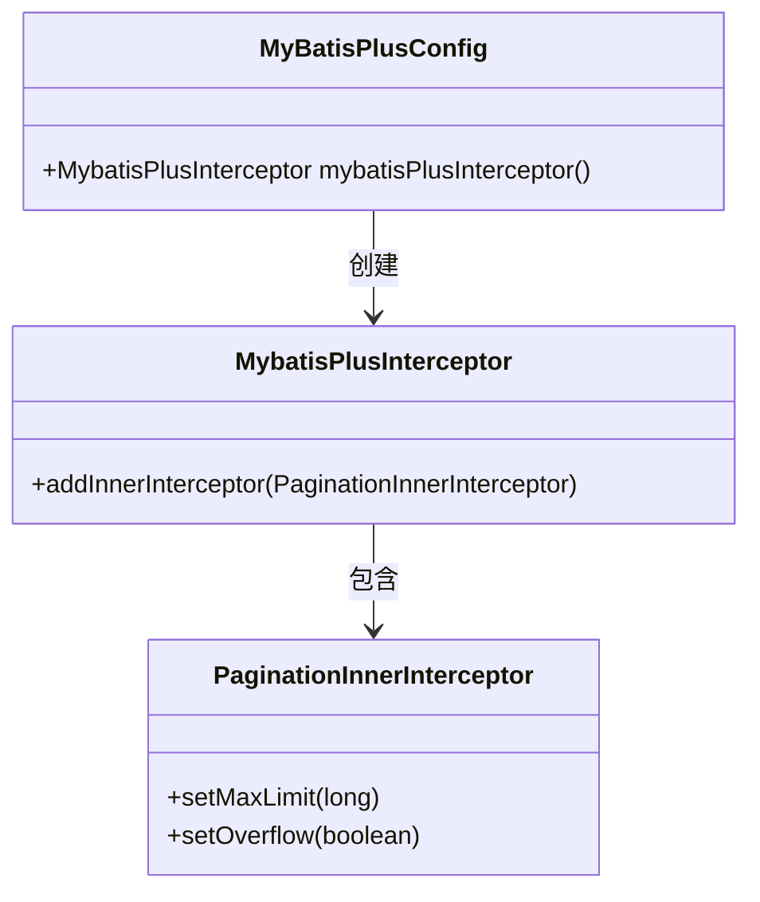
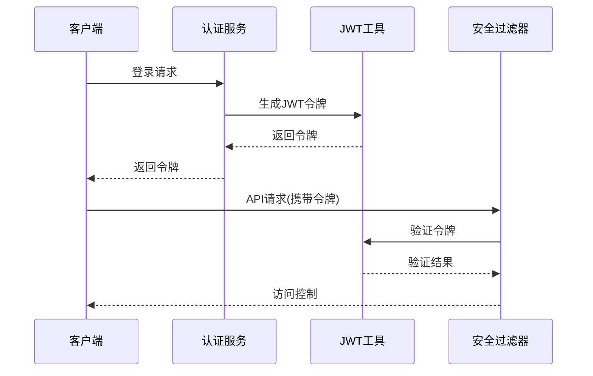
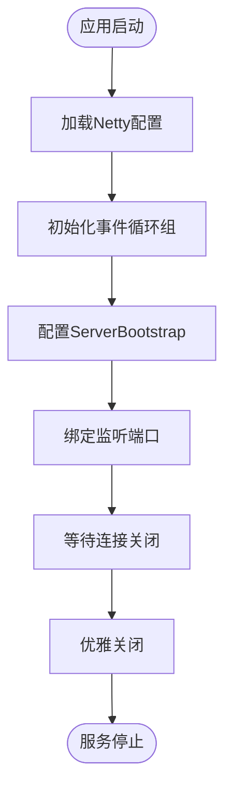
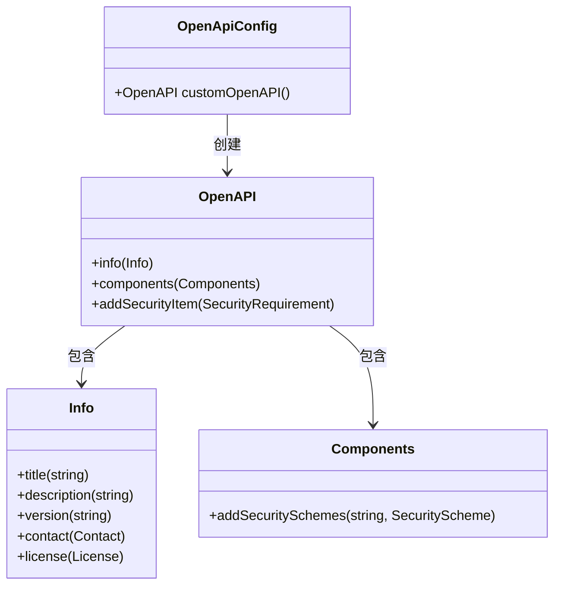
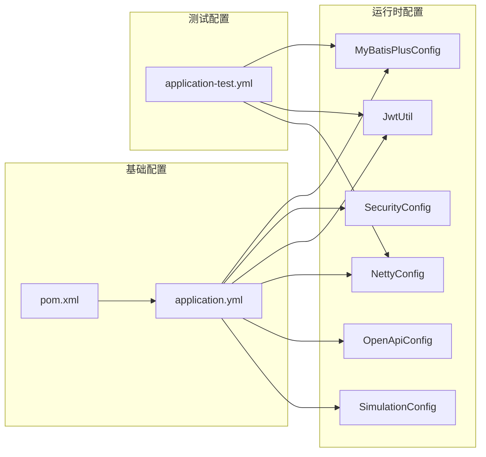

# 应用配置详解

<cite>
**本文引用的文件**
- [application.yml](file://src/main/resources/application.yml)
- [application-test.yml](file://src/test/resources/application-test.yml)
- [MyBatisPlusConfig.java](file://src/main/java/com/hydro/monitor/config/MyBatisPlusConfig.java)
- [OpenApiConfig.java](file://src/main/java/com/hydro/monitor/config/OpenApiConfig.java)
- [SecurityConfig.java](file://src/main/java/com/hydro/monitor/config/security/SecurityConfig.java)
- [JwtUtil.java](file://src/main/java/com/hydro/monitor/config/security/JwtUtil.java)
- [NettyConfig.java](file://src/main/java/com/hydro/monitor/config/NettyConfig.java)
- [SimulationConfig.java](file://src/main/java/com/hydro/monitor/config/SimulationConfig.java)
- [HydroMonitorApplication.java](file://src/main/java/com/hydro/monitor/HydroMonitorApplication.java)
- [pom.xml](file://pom.xml)
</cite>

## 目录
1. [简介](#简介)
2. [项目结构](#项目结构)
3. [核心配置项详解](#核心配置项详解)
4. [架构概览](#架构概览)
5. [详细组件分析](#详细组件分析)
6. [依赖关系分析](#依赖关系分析)
7. [性能考虑](#性能考虑)
8. [故障排除指南](#故障排除指南)
9. [结论](#结论)

## 简介

水文监测系统是一个基于Spring Boot 3.5.9构建的高性能水文监测数据采集与分析平台。本文档深入解析application.yml中的各项配置参数，涵盖服务器端口配置、应用名称设置、Jackson序列化配置、MyBatis-Plus全局配置等核心配置项，并详细说明DevTools开发工具配置、日志级别配置、Swagger文档配置等开发辅助配置。

## 项目结构

该项目采用标准的Spring Boot项目结构，主要配置文件位于`src/main/resources/application.yml`，测试配置位于`src/test/resources/application-test.yml`。核心配置类分布在`src/main/java/com/hydro/monitor/config/`目录下。



**图表来源**
- [application.yml:1-86](file://src/main/resources/application.yml#L1-L86)
- [MyBatisPlusConfig.java:1-39](file://src/main/java/com/hydro/monitor/config/MyBatisPlusConfig.java#L1-L39)
- [OpenApiConfig.java:1-52](file://src/main/java/com/hydro/monitor/config/OpenApiConfig.java#L1-L52)

## 核心配置项详解

### 服务器端口配置

**配置位置**: `server.port`
- **默认值**: 8080
- **作用**: 配置Spring Boot Web服务器监听的HTTP端口
- **推荐值**: 8080（生产环境建议使用80或443端口）
- **注意事项**: 端口必须在系统可用范围内且未被占用

**配置位置**: `netty.server.port`
- **默认值**: 9000
- **作用**: 配置Netty协议服务器监听的端口
- **推荐值**: 9000（与HTTP端口区分）
- **注意事项**: 与HTTP服务端口保持分离，避免端口冲突

### 应用名称设置

**配置位置**: `spring.application.name`
- **默认值**: hydro-monitor
- **作用**: 设置应用名称，用于日志、监控和注册中心识别
- **推荐值**: 符合项目标识的名称
- **影响范围**: 影响日志输出、服务发现等

### 数据源配置

**配置位置**: `spring.datasource`
- **driver-class-name**: `com.mysql.cj.jdbc.Driver`
- **url**: `jdbc:mysql://localhost:3306/hydro_monitor?useUnicode=true&characterEncoding=utf8&serverTimezone=Asia/Shanghai&useSSL=false`
- **username**: `root`
- **password**: `12345678`

**配置要点**:
- 支持Unicode字符集和UTF-8编码
- 使用亚洲时区上海时间
- 禁用SSL连接
- 生产环境建议使用环境变量或加密配置

### Jackson序列化配置

**配置位置**: `spring.jackson`
- **date-format**: `yyyy-MM-dd HH:mm:ss`
- **time-zone**: `Asia/Shanghai`
- **serialization.write-dates-as-timestamps**: `false`

**配置要点**:
- 统一日期时间格式
- 设置默认时区为东八区
- 禁用时间戳序列化，使用可读格式

### MyBatis-Plus全局配置

**配置位置**: `spring.mybatis-plus`
- **map-underscore-to-camel-case**: `true`
- **log-impl**: `org.apache.ibatis.logging.stdout.StdOutImpl`
- **id-type**: `assign_id`
- **logic-delete-field**: `deleted`
- **logic-delete-value**: `1`
- **logic-not-delete-value**: `0`

**配置要点**:
- 自动驼峰命名转换
- 启用SQL日志输出
- 使用雪花算法ID生成
- 配置逻辑删除字段

### DevTools开发工具配置

**配置位置**: `spring.devtools`
- **restart.enabled**: `true`
- **additional-paths**: `src/main/java`
- **exclude**: `static/**,public/**`
- **livereload.enabled**: `true`

**配置要点**:
- 启用自动重启功能
- 监控Java源代码变化
- 排除静态资源文件
- 启用LiveReload实时刷新

### JWT配置

**配置位置**: `jwt`
- **secret**: `hydro-monitor-secret-key-for-jwt-token-generation-2024`
- **expiration**: `86400000`（毫秒，即24小时）

**配置要点**:
- 使用强随机密钥
- 默认24小时有效期
- 生产环境建议使用更短的有效期

### SpringDoc (Swagger)配置

**配置位置**: `springdoc`
- **api-docs.path**: `/v3/api-docs`
- **swagger-ui.path**: `/swagger-ui.html`
- **tags-sorter**: `alpha`
- **operations-sorter**: `alpha`

**配置要点**:
- API文档路径
- Swagger UI界面路径
- 排序方式为字母顺序

### 日志配置

**配置位置**: `logging`
- **root级别**: `INFO`
- **包级别**: `com.hydro.monitor: DEBUG`
- **控制台模式**: `%d{yyyy-MM-dd HH:mm:ss} [%thread] %-5level %logger{36} - %msg%n`
- **文件模式**: `%d{yyyy-MM-dd HH:mm:ss.SSS} [%thread] %-5level %logger{36} - %msg%n`
- **文件名称**: `logs/hydro-monitor-backend.log`
- **文件大小**: `10MB`
- **保留天数**: `30`

**配置要点**:
- 控制台和文件输出统一编码
- 滚动日志文件管理
- 区分根日志和业务日志级别

### 终端模拟上报配置

**配置位置**: `simulation`
- **enabled**: `true`
- **terminal-count**: `16`
- **report-interval-seconds**: `300`
- **center-station-address**: `2`
- **password**: `"a000"`
- **station-category-code**: `48`

**配置要点**:
- 开发测试环境的模拟数据生成
- 可调节模拟终端数量和上报频率

## 架构概览

系统采用多层架构设计，配置贯穿各个层次：



**图表来源**
- [application.yml:1-86](file://src/main/resources/application.yml#L1-L86)
- [MyBatisPlusConfig.java:1-39](file://src/main/java/com/hydro/monitor/config/MyBatisPlusConfig.java#L1-L39)
- [SecurityConfig.java:1-76](file://src/main/java/com/hydro/monitor/config/security/SecurityConfig.java#L1-L76)

## 详细组件分析

### MyBatis-Plus配置组件

MyBatis-Plus通过Java配置类实现分页拦截器的注入：



**图表来源**
- [MyBatisPlusConfig.java:24-37](file://src/main/java/com/hydro/monitor/config/MyBatisPlusConfig.java#L24-L37)

**配置要点**:
- 分页拦截器最大限制500条记录
- 溢出处理策略为false（返回空数据）
- 专为MySQL数据库配置

### JWT安全配置组件

JWT工具类负责令牌的生成、验证和解析：



**图表来源**
- [JwtUtil.java:37-48](file://src/main/java/com/hydro/monitor/config/security/JwtUtil.java#L37-L48)
- [SecurityConfig.java:48-49](file://src/main/java/com/hydro/monitor/config/security/SecurityConfig.java#L48-L49)

**配置要点**:
- HMAC-SHA256签名算法
- 默认24小时有效期
- 支持令牌过期检查

### Netty网络配置组件

Netty服务端通过CommandLineRunner实现异步启动：



**图表来源**
- [NettyConfig.java:40-70](file://src/main/java/com/hydro/monitor/config/NettyConfig.java#L40-L70)

**配置要点**:
- Boss线程组1个，Worker线程组默认
- SO_BACKLOG队列长度128
- SO_KEEPALIVE保持连接

### Swagger文档配置组件

SpringDoc OpenAPI提供API文档生成和UI展示：



**图表来源**
- [OpenApiConfig.java:28-50](file://src/main/java/com/hydro/monitor/config/OpenApiConfig.java#L28-L50)

**配置要点**:
- Bearer Token认证方案
- 全局安全要求
- 自定义联系人和许可证信息

## 依赖关系分析

系统配置之间存在复杂的依赖关系：



**图表来源**
- [application.yml:1-86](file://src/main/resources/application.yml#L1-L86)
- [pom.xml:1-179](file://pom.xml#L1-L179)
- [application-test.yml:1-29](file://src/test/resources/application-test.yml#L1-L29)

### 配置优先级规则

Spring Boot遵循以下配置优先级（从高到低）：
1. 命令行参数
2. SPRING_APPLICATION_JSON环境变量
3. 系统环境变量
4. application-{profile}.yml
5. application.yml
6. @PropertySource注解
7. 默认属性

### 配置参数依赖关系

- **数据库配置**依赖MySQL驱动和连接池
- **JWT配置**依赖Spring Security和JJWT库
- **Netty配置**依赖Netty框架
- **Swagger配置**依赖SpringDoc OpenAPI
- **DevTools配置**依赖Spring Boot DevTools

## 性能考虑

### 数据库连接池优化
- 建议配置连接池大小：`spring.datasource.hikari.maximum-pool-size=20`
- 设置连接超时时间：`spring.datasource.hikari.connection-timeout=30000`
- 配置空闲超时：`spring.datasource.hikari.idle-timeout=600000`

### 缓存策略
- 启用MyBatis二级缓存：`spring.cache.type=caffeine`
- 配置缓存过期时间：`spring.cache.cache-names=elementConfig`
- 设置缓存容量：`spring.cache.caffeine.spec=maximumSize=1000,expireAfterWrite=600s`

### 并发处理优化
- Netty线程数配置：`netty.worker-threads=CPU核心数*2`
- 请求队列长度：`netty.backlog=1024`
- 连接超时设置：`netty.connect-timeout=5000ms`

## 故障排除指南

### 常见配置错误及解决方案

#### 1. 数据库连接失败
**症状**: 应用启动时报数据库连接异常
**可能原因**:
- 数据库URL配置错误
- 用户名或密码不正确
- MySQL服务未启动

**解决方法**:
```yaml
spring:
  datasource:
    url: jdbc:mysql://localhost:3306/hydro_monitor?useUnicode=true&characterEncoding=utf8&serverTimezone=Asia/Shanghai&useSSL=false
    username: root
    password: your_password
```

#### 2. JWT令牌验证失败
**症状**: API调用返回401未授权
**可能原因**:
- JWT密钥不匹配
- 令牌过期
- 令牌格式错误

**解决方法**:
```yaml
jwt:
  secret: your_secure_secret_key
  expiration: 86400000  # 24小时
```

#### 3. Netty端口冲突
**症状**: Netty服务启动失败
**可能原因**: 端口9000已被占用
**解决方法**:
```yaml
netty:
  server:
    port: 9001  # 更改为其他可用端口
```

#### 4. Swagger文档无法访问
**症状**: 访问Swagger UI页面404
**可能原因**: SpringDoc配置不正确
**解决方法**:
```yaml
springdoc:
  api-docs:
    path: /v3/api-docs
  swagger-ui:
    path: /swagger-ui.html
```

### 配置修改最佳实践

#### 1. 环境隔离
为不同环境创建独立配置文件：
- 开发环境：`application-dev.yml`
- 测试环境：`application-test.yml`
- 生产环境：`application-prod.yml`

#### 2. 敏感信息保护
使用环境变量或加密配置：
```yaml
spring:
  datasource:
    username: ${DB_USERNAME:root}
    password: ${DB_PASSWORD:}
```

#### 3. 动态配置更新
启用配置刷新：
```yaml
management:
  endpoints:
    web:
      exposure:
        include: refresh
```

#### 4. 监控配置健康检查
```yaml
management:
  health:
    db:
      enabled: true
    ping:
      enabled: true
```

### 配置验证工具

使用以下命令验证配置有效性：

```bash
# 验证YAML语法
yamllint application.yml

# 检查配置属性
curl http://localhost:8080/actuator/configprops

# 查看健康状态
curl http://localhost:8080/actuator/health
```

## 结论

水文监测系统的配置体系体现了现代Spring Boot应用的最佳实践。通过合理的配置分层、清晰的依赖关系和完善的错误处理机制，系统实现了高可用性和易维护性。

关键配置要点总结：
- **安全性**: JWT认证、HTTPS、输入验证
- **性能**: 连接池优化、缓存策略、并发处理
- **可观测性**: 日志配置、健康检查、指标监控
- **开发效率**: DevTools热部署、Swagger文档、测试配置

建议在生产环境中进一步完善配置，包括数据库连接池优化、安全加固、监控告警等方面的配置，以确保系统的稳定运行和高效维护。