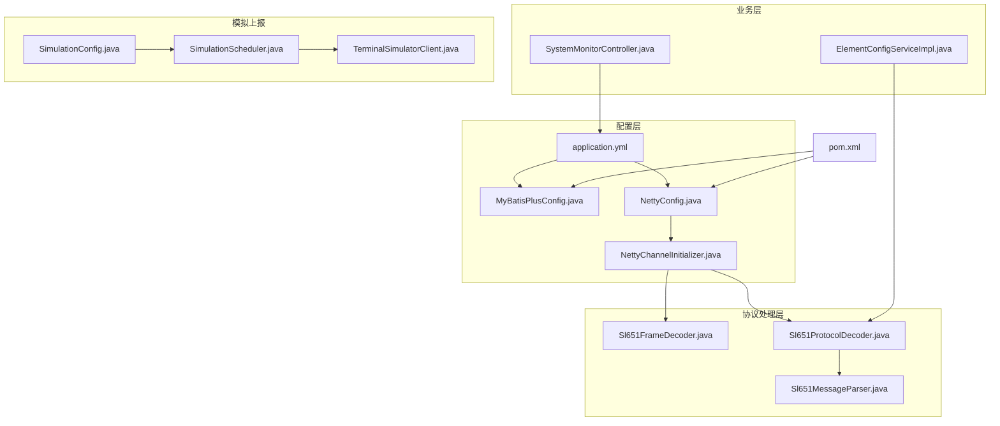
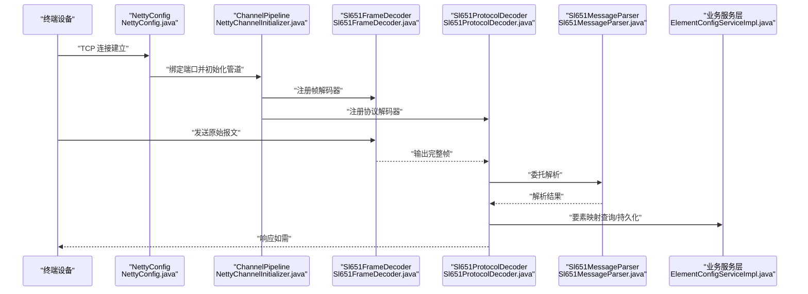
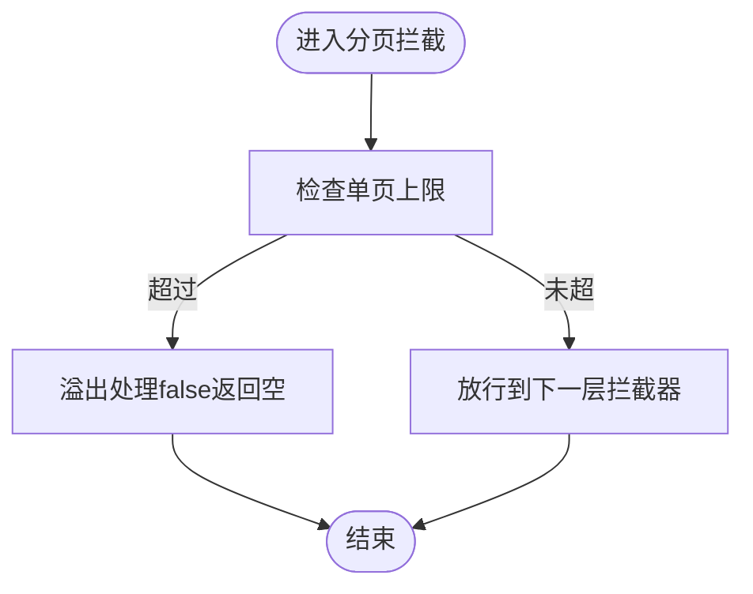
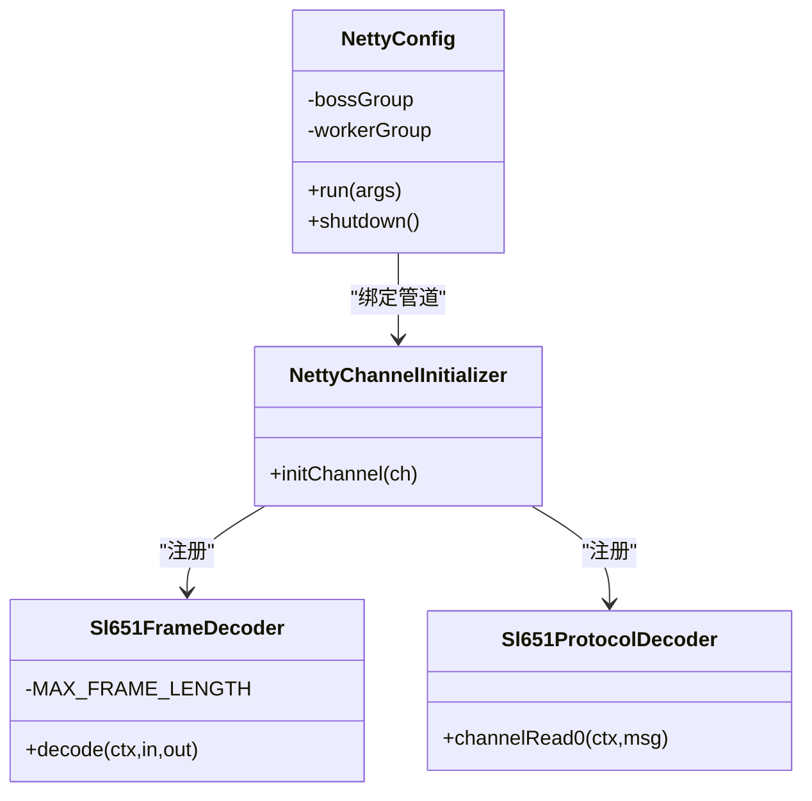
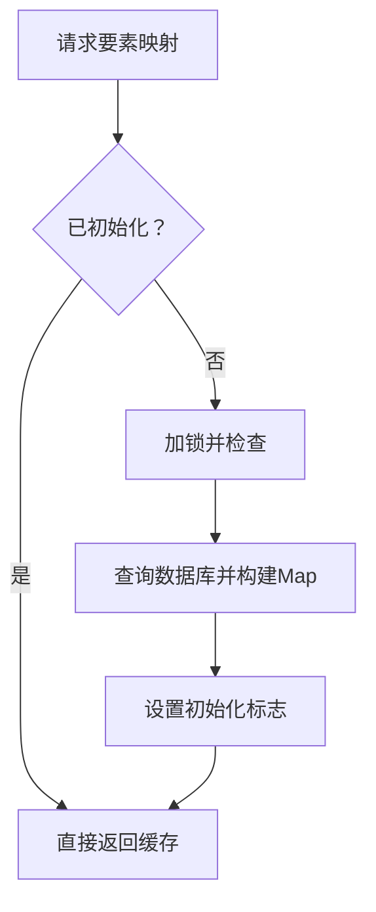
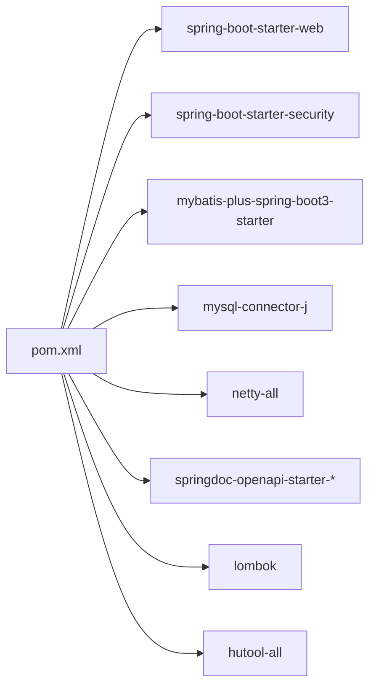

# 性能配置优化

<cite>
**本文引用的文件**
- [application.yml](file://src/main/resources/application.yml)
- [MyBatisPlusConfig.java](file://src/main/java/com/hydro/monitor/config/MyBatisPlusConfig.java)
- [NettyConfig.java](file://src/main/java/com/hydro/monitor/config/NettyConfig.java)
- [NettyChannelInitializer.java](file://src/main/java/com/hydro/monitor/config/NettyChannelInitializer.java)
- [Sl651FrameDecoder.java](file://src/main/java/com/hydro/monitor/netty/Sl651FrameDecoder.java)
- [Sl651ProtocolDecoder.java](file://src/main/java/com/hydro/monitor/netty/Sl651ProtocolDecoder.java)
- [Sl651MessageParser.java](file://src/main/java/com/hydro/monitor/netty/Sl651MessageParser.java)
- [ElementConfigServiceImpl.java](file://src/main/java/com/hydro/monitor/modules/service/impl/ElementConfigServiceImpl.java)
- [SystemMonitorController.java](file://src/main/java/com/hydro/monitor/modules/controller/SystemMonitorController.java)
- [SimulationConfig.java](file://src/main/java/com/hydro/monitor/config/SimulationConfig.java)
- [SimulationScheduler.java](file://src/main/java/com/hydro/monitor/simulation/SimulationScheduler.java)
- [TerminalSimulatorClient.java](file://src/main/java/com/hydro/monitor/simulation/TerminalSimulatorClient.java)
- [pom.xml](file://pom.xml)
</cite>

## 目录
1. [简介](#简介)
2. [项目结构](#项目结构)
3. [核心组件](#核心组件)
4. [架构总览](#架构总览)
5. [详细组件分析](#详细组件分析)
6. [依赖分析](#依赖分析)
7. [性能考虑](#性能考虑)
8. [故障排查指南](#故障排查指南)
9. [结论](#结论)
10. [附录](#附录)

## 简介
本文件面向水文监测系统的性能配置优化，围绕数据库连接池、线程池、缓存、Netty网络栈、MyBatis-Plus、日志级别、异步处理与并发控制、性能监控指标与瓶颈定位、高并发调优与资源限制等方面，结合代码实现给出可落地的优化建议与最佳实践。

## 项目结构
系统采用 Spring Boot + Netty 架构，核心模块包括：
- 配置层：application.yml、MyBatisPlusConfig、NettyConfig、NettyChannelInitializer
- 协议处理层：Sl651FrameDecoder、Sl651ProtocolDecoder、Sl651MessageParser
- 业务层：要素配置缓存、系统监控接口
- 模拟上报：SimulationConfig、SimulationScheduler、TerminalSimulatorClient
- 依赖与构建：pom.xml

**图表来源**
- [application.yml:1-86](file://src/main/resources/application.yml#L1-L86)
- [MyBatisPlusConfig.java:1-39](file://src/main/java/com/hydro/monitor/config/MyBatisPlusConfig.java#L1-L39)
- [NettyConfig.java:1-87](file://src/main/java/com/hydro/monitor/config/NettyConfig.java#L1-L87)
- [NettyChannelInitializer.java:1-36](file://src/main/java/com/hydro/monitor/config/NettyChannelInitializer.java#L1-L36)
- [Sl651FrameDecoder.java:1-121](file://src/main/java/com/hydro/monitor/netty/Sl651FrameDecoder.java#L1-L121)
- [Sl651ProtocolDecoder.java:1-278](file://src/main/java/com/hydro/monitor/netty/Sl651ProtocolDecoder.java#L1-L278)
- [Sl651MessageParser.java:1-648](file://src/main/java/com/hydro/monitor/netty/Sl651MessageParser.java#L1-L648)
- [ElementConfigServiceImpl.java:1-239](file://src/main/java/com/hydro/monitor/modules/service/impl/ElementConfigServiceImpl.java#L1-L239)
- [SystemMonitorController.java:1-84](file://src/main/java/com/hydro/monitor/modules/controller/SystemMonitorController.java#L1-L84)
- [SimulationConfig.java:1-58](file://src/main/java/com/hydro/monitor/config/SimulationConfig.java#L1-L58)
- [SimulationScheduler.java:1-111](file://src/main/java/com/hydro/monitor/simulation/SimulationScheduler.java#L1-L111)
- [TerminalSimulatorClient.java:42-81](file://src/main/java/com/hydro/monitor/simulation/TerminalSimulatorClient.java#L42-L81)
- [pom.xml:1-179](file://pom.xml#L1-L179)

**章节来源**
- [application.yml:1-86](file://src/main/resources/application.yml#L1-L86)
- [pom.xml:1-179](file://pom.xml#L1-L179)

## 核心组件
- 数据库与ORM：Spring Boot 默认数据源 + MyBatis-Plus 分页拦截器
- 网络通信：Netty 服务端 + 自定义协议帧解码器 + 协议解析器
- 缓存：要素映射缓存（懒加载 + 双重检查锁 + 失败降级）
- 日志：控制台与文件日志级别、格式与滚动策略
- 模拟上报：可配置的终端模拟器集群，异步定时上报

**章节来源**
- [MyBatisPlusConfig.java:1-39](file://src/main/java/com/hydro/monitor/config/MyBatisPlusConfig.java#L1-L39)
- [NettyConfig.java:1-87](file://src/main/java/com/hydro/monitor/config/NettyConfig.java#L1-L87)
- [Sl651FrameDecoder.java:1-121](file://src/main/java/com/hydro/monitor/netty/Sl651FrameDecoder.java#L1-L121)
- [Sl651ProtocolDecoder.java:1-278](file://src/main/java/com/hydro/monitor/netty/Sl651ProtocolDecoder.java#L1-L278)
- [ElementConfigServiceImpl.java:1-239](file://src/main/java/com/hydro/monitor/modules/service/impl/ElementConfigServiceImpl.java#L1-L239)
- [application.yml:1-86](file://src/main/resources/application.yml#L1-L86)

## 架构总览
系统采用“Netty 接收 + 协议解析 + 业务持久化”的流水线式处理。Netty 作为高性能网络框架负责接入与粘包/拆包；协议层完成报文结构化；业务层进行持久化与状态更新；缓存层降低数据库访问压力；监控接口提供运行态指标。

**图表来源**
- [NettyConfig.java:1-87](file://src/main/java/com/hydro/monitor/config/NettyConfig.java#L1-L87)
- [NettyChannelInitializer.java:1-36](file://src/main/java/com/hydro/monitor/config/NettyChannelInitializer.java#L1-L36)
- [Sl651FrameDecoder.java:1-121](file://src/main/java/com/hydro/monitor/netty/Sl651FrameDecoder.java#L1-L121)
- [Sl651ProtocolDecoder.java:1-278](file://src/main/java/com/hydro/monitor/netty/Sl651ProtocolDecoder.java#L1-L278)
- [Sl651MessageParser.java:1-648](file://src/main/java/com/hydro/monitor/netty/Sl651MessageParser.java#L1-L648)
- [ElementConfigServiceImpl.java:1-239](file://src/main/java/com/hydro/monitor/modules/service/impl/ElementConfigServiceImpl.java#L1-L239)

## 详细组件分析

### 数据库连接池与MyBatis-Plus配置
- 连接池
  - 项目使用 Spring Boot 默认数据源（HikariCP）。可在 application.yml 中增加连接池参数（如连接数、空闲超时、生命周期等）以适配高并发场景。
  - 建议关注参数：maximum-pool-size、minimum-idle、connection-timeout、idle-timeout、max-lifetime。
- MyBatis-Plus
  - 已配置分页拦截器，设置最大单页限制与溢出处理策略，避免超大数据量查询导致内存压力。
  - 建议开启 SQL 日志（开发/测试）与慢查询日志（生产），并配合数据库慢查询分析工具定位热点 SQL。
  - 批量操作：可通过批量插入/更新接口减少往返次数；注意分批大小与事务边界，避免单事务过大。
  - 逻辑删除：已启用逻辑删除字段，避免物理删除带来的索引重建成本。

**图表来源**
- [MyBatisPlusConfig.java:24-37](file://src/main/java/com/hydro/monitor/config/MyBatisPlusConfig.java#L24-L37)

**章节来源**
- [MyBatisPlusConfig.java:1-39](file://src/main/java/com/hydro/monitor/config/MyBatisPlusConfig.java#L1-L39)
- [application.yml:8-33](file://src/main/resources/application.yml#L8-L33)

### Netty网络配置与性能调优
- 端口配置
  - 通过 application.yml 的 netty.server.port 控制监听端口，默认 9000；测试环境提供不同端口以隔离。
- 线程模型
  - bossGroup(1) + workerGroup(默认) 的 NIO 线程模型；worker 线程数通常与 CPU 核数相关，可根据吞吐需求调整。
- 缓冲区与背压
  - 建议设置合理的 SO_RCVBUF/SO_SNDBUF，避免过小导致频繁唤醒、过大导致内存占用。
  - 帧解码器已内置最大帧长度保护，防止异常报文导致内存溢出。
- 连接超时与空闲检测
  - 可在 ChannelPipeline 中加入 IdleStateHandler 进行读/写空闲检测，及时清理僵尸连接。
- 日志与调试
  - 可临时启用 LoggingHandler 输出网络事件日志，便于定位粘包/拆包问题。

**图表来源**
- [NettyConfig.java:1-87](file://src/main/java/com/hydro/monitor/config/NettyConfig.java#L1-L87)
- [NettyChannelInitializer.java:1-36](file://src/main/java/com/hydro/monitor/config/NettyChannelInitializer.java#L1-L36)
- [Sl651FrameDecoder.java:1-121](file://src/main/java/com/hydro/monitor/netty/Sl651FrameDecoder.java#L1-L121)
- [Sl651ProtocolDecoder.java:1-278](file://src/main/java/com/hydro/monitor/netty/Sl651ProtocolDecoder.java#L1-L278)

**章节来源**
- [NettyConfig.java:1-87](file://src/main/java/com/hydro/monitor/config/NettyConfig.java#L1-L87)
- [NettyChannelInitializer.java:1-36](file://src/main/java/com/hydro/monitor/config/NettyChannelInitializer.java#L1-L36)
- [Sl651FrameDecoder.java:1-121](file://src/main/java/com/hydro/monitor/netty/Sl651FrameDecoder.java#L1-L121)
- [application.yml:43-47](file://src/main/resources/application.yml#L43-L47)

### 缓存配置与优化
- 要素映射缓存
  - 采用懒加载 + 双重检查锁 + volatile 变量，首次访问加载启用的要素映射，后续直接命中 Map。
  - 失败降级：加载异常时回退到默认硬编码映射，保证系统可用性。
  - 变更触发：当要素配置被新增/更新/删除时，清空缓存标记，下次访问重新加载。
- 建议
  - 将 Map 存储在本地缓存容器中，避免跨节点共享；若需分布式缓存，建议引入 Redis 并设置合理 TTL。
  - 对高频访问的要素映射可考虑本地缓存预热，启动阶段提前加载。

**图表来源**
- [ElementConfigServiceImpl.java:38-63](file://src/main/java/com/hydro/monitor/modules/service/impl/ElementConfigServiceImpl.java#L38-L63)

**章节来源**
- [ElementConfigServiceImpl.java:1-239](file://src/main/java/com/hydro/monitor/modules/service/impl/ElementConfigServiceImpl.java#L1-L239)

### 日志级别与异步处理配置
- 日志级别
  - application.yml 中配置了 root 与包级别的日志级别、控制台与文件格式、滚动策略；生产环境建议提升至 INFO，避免过多 DEBUG/INFO 带来的 IO 压力。
- 异步处理
  - 原始报文保存采用 CompletableFuture.runAsync 异步落库，避免阻塞 Netty 线程；建议结合线程池参数与队列容量控制背压。
- 并发控制
  - Netty 默认 worker 线程数可按 CPU 核数与负载调优；业务线程池（如模拟上报）建议使用有界队列与拒绝策略。

**章节来源**
- [application.yml:62-77](file://src/main/resources/application.yml#L62-L77)
- [Sl651ProtocolDecoder.java:234-244](file://src/main/java/com/hydro/monitor/netty/Sl651ProtocolDecoder.java#L234-L244)

### 性能监控指标与瓶颈识别
- 系统监控接口
  - 提供内存、CPU、线程数等基础指标；数据库连接池指标目前为占位，建议注入 HikariDataSource 获取活跃/总连接数。
- 建议采集
  - JVM GC、堆外内存、线程池队列长度、数据库连接池等待时间、慢查询数、错误率、吞吐量。
- 瓶颈识别
  - 通过 APM/埋点/指标面板定位：CPU 热点（解析/序列化）、IO 热点（数据库/磁盘）、网络瓶颈（背压/拥塞）。

**章节来源**
- [SystemMonitorController.java:1-84](file://src/main/java/com/hydro/monitor/modules/controller/SystemMonitorController.java#L1-L84)

### 高并发场景下的配置调优与资源限制
- Netty
  - worker 线程数：CPU 核数 × 2 ~ 4；根据 RTT 与带宽计算最优线程数。
  - 缓冲区：合理设置 SO_RCVBUF/SO_SNDBUF，避免频繁系统调用。
  - 空闲检测：启用 IdleStateHandler，定期清理空闲连接。
- 数据库
  - 连接池：maximum-pool-size 与数据库最大连接数匹配；设置 connection-timeout 与 max-lifetime。
  - 读写分离/分库分表：按站点/时间维度拆分，降低单表压力。
- 缓存
  - 本地缓存 + 分布式缓存双写，设置合理 TTL 与失效策略。
- 日志
  - 生产环境关闭详细日志，必要时使用采样日志或异步日志。
- 模拟上报
  - 通过 SimulationConfig 控制终端数量与上报频率，避免对生产环境造成干扰。

**章节来源**
- [SimulationConfig.java:1-58](file://src/main/java/com/hydro/monitor/config/SimulationConfig.java#L1-L58)
- [SimulationScheduler.java:1-111](file://src/main/java/com/hydro/monitor/simulation/SimulationScheduler.java#L1-L111)
- [TerminalSimulatorClient.java:42-81](file://src/main/java/com/hydro/monitor/simulation/TerminalSimulatorClient.java#L42-L81)

## 依赖分析
- 核心依赖
  - Spring Boot Web、Security、Validation
  - MyBatis-Plus（含 JSqlParser）
  - MySQL Connector/J
  - Netty
  - SpringDoc OpenAPI
  - Lombok、Hutool
- 构建与打包
  - Maven 插件设置 JVM 编码参数，确保日志与文本处理一致性。

**图表来源**
- [pom.xml:30-153](file://pom.xml#L30-L153)

**章节来源**
- [pom.xml:1-179](file://pom.xml#L1-L179)

## 性能考虑
- 数据库层
  - 合理设置分页大小与查询条件，避免全表扫描；为高频查询字段建立索引。
  - 使用批量操作与事务合并，减少网络往返。
- 网络层
  - 采用零拷贝与直接内存（Netty 默认），减少内存复制。
  - 优化序列化方式（如 Protobuf/JSON），降低序列化开销。
- 缓存层
  - 读多写少场景优先缓存热点数据；写少读多场景采用缓存预热。
- 日志与监控
  - 生产环境降低日志级别，使用异步日志；结合 APM 做全链路追踪。
- 并发与限流
  - 对外部接口与数据库接口做限流与熔断，避免雪崩效应。

## 故障排查指南
- Netty 连接异常
  - 检查端口占用与防火墙；确认 IdleStateHandler 是否正确清理空闲连接。
- 解码失败
  - 关注 Sl651FrameDecoder 的最大帧长度与起始符扫描逻辑；必要时开启 LoggingHandler 定位。
- 数据库连接耗尽
  - 检查连接池参数与慢查询；确认事务未长时间持有连接。
- 缓存未命中
  - 确认缓存初始化流程与异常降级路径；检查变更后缓存清理是否生效。
- 日志风暴
  - 降低日志级别或启用采样；检查是否有大量重复告警。

**章节来源**
- [Sl651FrameDecoder.java:37-100](file://src/main/java/com/hydro/monitor/netty/Sl651FrameDecoder.java#L37-L100)
- [Sl651ProtocolDecoder.java:272-277](file://src/main/java/com/hydro/monitor/netty/Sl651ProtocolDecoder.java#L272-L277)
- [SystemMonitorController.java:49-51](file://src/main/java/com/hydro/monitor/modules/controller/SystemMonitorController.java#L49-L51)

## 结论
通过合理的数据库连接池与分页策略、Netty 线程模型与缓冲区调优、要素映射缓存与异步落库、以及完善的日志与监控体系，水文监测系统可在高并发场景下保持稳定与高效。建议在生产环境中持续观察关键指标，结合 APM 与数据库慢查询分析工具，迭代优化参数与架构。

## 附录
- 关键配置项参考
  - 数据库连接池：maximum-pool-size、minimum-idle、connection-timeout、idle-timeout、max-lifetime
  - MyBatis-Plus：分页拦截器上限、溢出策略、SQL 日志
  - Netty：SO_BACKLOG、SO_KEEPALIVE、worker 线程数、缓冲区大小、IdleStateHandler
  - 日志：root 与包级别、控制台/文件格式、滚动策略
  - 模拟上报：terminalCount、reportIntervalSeconds、serverHost/serverPort