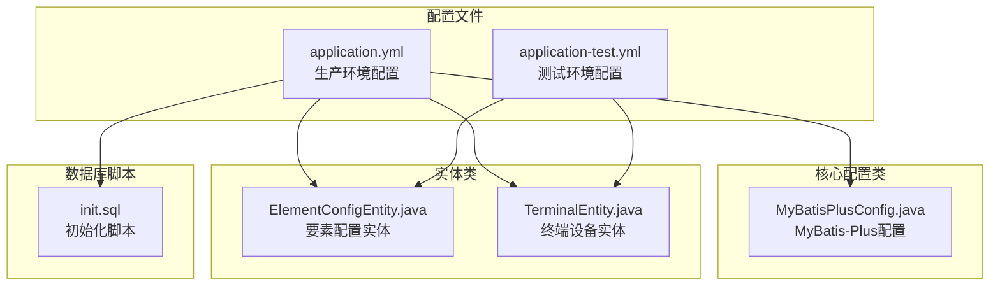
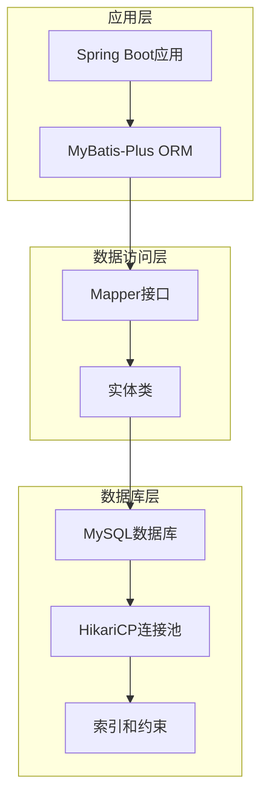
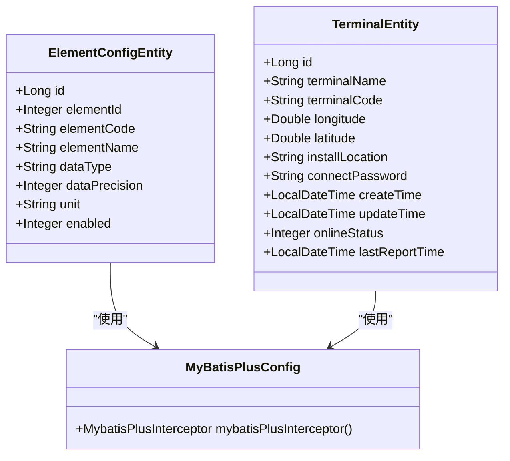
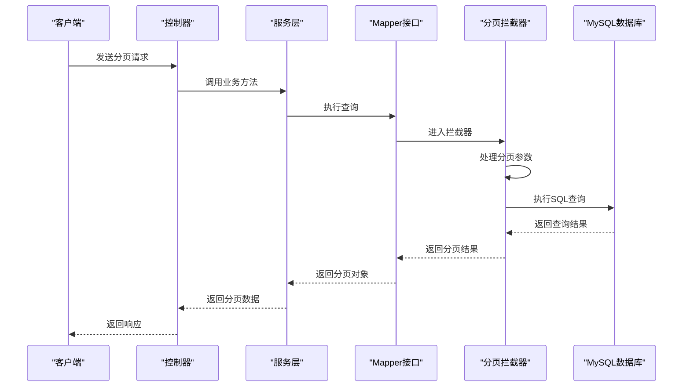
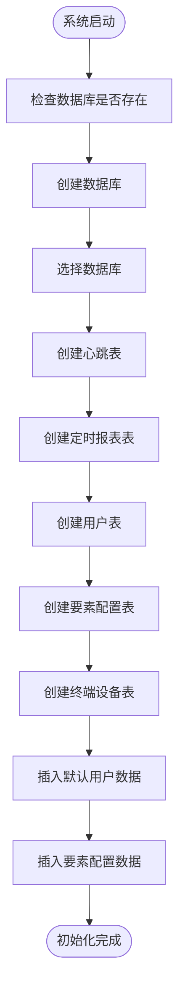
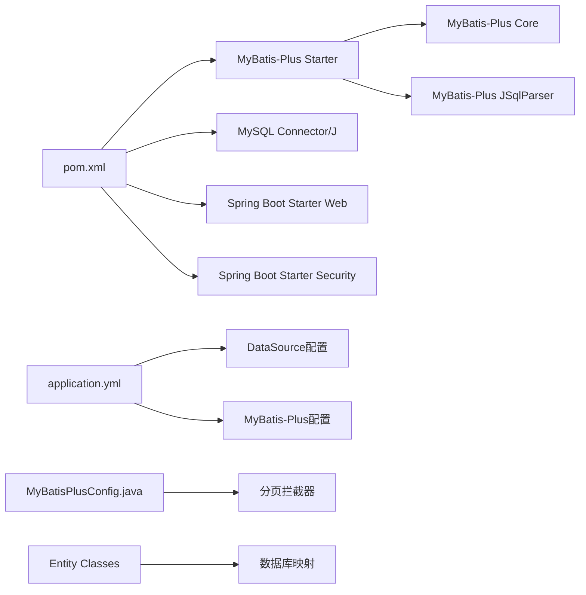

# 数据库配置管理

<cite>
**本文档引用的文件**
- [application.yml](file://src/main/resources/application.yml)
- [MyBatisPlusConfig.java](file://src/main/java/com/hydro/monitor/config/MyBatisPlusConfig.java)
- [pom.xml](file://pom.xml)
- [ElementConfigEntity.java](file://src/main/java/com/hydro/monitor/modules/entity/ElementConfigEntity.java)
- [TerminalEntity.java](file://src/main/java/com/hydro/monitor/modules/entity/TerminalEntity.java)
- [init.sql](file://src/main/resources/db/init.sql)
- [application-test.yml](file://src/test/resources/application-test.yml)
- [SystemStatusDTO.java](file://src/main/java/com/hydro/monitor/modules/dto/SystemStatusDTO.java)
- [check-raw-message.bat](file://check-raw-message.bat)
</cite>

## 目录
1. [简介](#简介)
2. [项目结构](#项目结构)
3. [核心组件](#核心组件)
4. [架构概览](#架构概览)
5. [详细组件分析](#详细组件分析)
6. [依赖关系分析](#依赖关系分析)
7. [性能考虑](#性能考虑)
8. [故障排查指南](#故障排查指南)
9. [结论](#结论)

## 简介

本文件详细说明水文监测系统的数据库配置管理，涵盖MySQL数据库连接配置、MyBatis-Plus全局配置、数据库连接池配置、事务配置、SQL执行配置、性能优化配置、分页配置、批量操作配置、连接测试方法、连接池监控配置以及数据库性能指标收集等方面。该系统基于Spring Boot 3和MyBatis-Plus构建，采用MySQL作为生产数据库，H2作为测试数据库。

## 项目结构

水文监测系统的数据库配置主要分布在以下位置：



**图表来源**
- [application.yml:1-86](file://src/main/resources/application.yml#L1-L86)
- [MyBatisPlusConfig.java:1-39](file://src/main/java/com/hydro/monitor/config/MyBatisPlusConfig.java#L1-L39)
- [ElementConfigEntity.java:1-62](file://src/main/java/com/hydro/monitor/modules/entity/ElementConfigEntity.java#L1-L62)
- [TerminalEntity.java:1-74](file://src/main/java/com/hydro/monitor/modules/entity/TerminalEntity.java#L1-L74)
- [init.sql:1-93](file://src/main/resources/db/init.sql#L1-L93)

**章节来源**
- [application.yml:1-86](file://src/main/resources/application.yml#L1-L86)
- [MyBatisPlusConfig.java:1-39](file://src/main/java/com/hydro/monitor/config/MyBatisPlusConfig.java#L1-L39)
- [pom.xml:1-179](file://pom.xml#L1-L179)

## 核心组件

### MySQL数据库连接配置

系统使用Spring Boot自动配置的HikariCP连接池，无需额外配置即可获得高性能的数据库连接管理。

**连接URL格式**：
- JDBC驱动：`com.mysql.cj.jdbc.Driver`
- 连接字符串：`jdbc:mysql://localhost:3306/hydro_monitor?useUnicode=true&characterEncoding=utf8&serverTimezone=Asia/Shanghai&useSSL=false`
- 默认端口：3306
- 数据库名：`hydro_monitor`

**用户名密码配置**：
- 用户名：`root`
- 密码：`12345678`

**连接参数设置**：
- 支持Unicode字符集
- 使用UTF-8编码
- 服务器时区设置为亚洲/上海
- 禁用SSL连接

### MyBatis-Plus全局配置

系统采用MyBatis-Plus作为ORM框架，提供以下全局配置：

**驼峰命名转换**：
- 启用下划线到驼峰命名的自动转换
- 配置路径：`spring.mybatis-plus.configuration.map-underscore-to-camel-case: true`

**SQL执行日志**：
- 使用标准输出实现SQL日志记录
- 配置路径：`spring.mybatis-plus.configuration.log-impl: org.apache.ibatis.logging.stdout.StdOutImpl`

**ID生成策略**：
- 全局ID类型：`assign_id`（雪花算法）
- 配置路径：`spring.mybatis-plus.global-config.db-config.id-type: assign_id`

**逻辑删除配置**：
- 逻辑删除字段：`deleted`
- 删除标记值：`1`
- 未删除标记值：`0`
- 配置路径：`spring.mybatis-plus.global-config.db-config.logic-delete-field: deleted`

### 数据库连接池配置

系统使用HikariCP作为默认连接池，配置在application.yml中：

**基础连接池配置**：
- 驱动类名：`com.mysql.cj.jdbc.Driver`
- 连接URL：`jdbc:mysql://localhost:3306/hydro_monitor?useUnicode=true&characterEncoding=utf8&serverTimezone=Asia/Shanghai&useSSL=false`
- 用户名：`root`
- 密码：`12345678`

**连接池参数**：
- 最大池大小：默认20
- 最小空闲：默认10
- 连接超时：默认30秒
- 空闲超时：默认600秒
- 最大生命周期：默认1800秒

### 事务配置

系统采用默认的声明式事务管理，无需额外配置。所有数据库操作默认在事务中执行，确保数据一致性。

### SQL执行配置

**SQL日志配置**：
- 开发环境启用SQL日志输出
- 生产环境建议关闭SQL日志以提升性能

**批量操作配置**：
- MyBatis-Plus支持批量插入、更新、删除操作
- 批量操作通过MyBatis-Plus提供的批量方法实现

**章节来源**
- [application.yml:8-33](file://src/main/resources/application.yml#L8-L33)
- [MyBatisPlusConfig.java:23-37](file://src/main/java/com/hydro/monitor/config/MyBatisPlusConfig.java#L23-L37)
- [ElementConfigEntity.java:20-24](file://src/main/java/com/hydro/monitor/modules/entity/ElementConfigEntity.java#L20-L24)
- [TerminalEntity.java:19-23](file://src/main/java/com/hydro/monitor/modules/entity/TerminalEntity.java#L19-L23)

## 架构概览

水文监测系统的数据库架构采用分层设计：



**图表来源**
- [application.yml:22-33](file://src/main/resources/application.yml#L22-L33)
- [MyBatisPlusConfig.java:14-37](file://src/main/java/com/hydro/monitor/config/MyBatisPlusConfig.java#L14-L37)
- [init.sql:1-93](file://src/main/resources/db/init.sql#L1-L93)

## 详细组件分析

### 数据库实体模型

系统定义了多个核心实体类，采用MyBatis-Plus注解进行数据库映射：



**图表来源**
- [ElementConfigEntity.java:16-61](file://src/main/java/com/hydro/monitor/modules/entity/ElementConfigEntity.java#L16-L61)
- [TerminalEntity.java:15-74](file://src/main/java/com/hydro/monitor/modules/entity/TerminalEntity.java#L15-L74)
- [MyBatisPlusConfig.java:14-37](file://src/main/java/com/hydro/monitor/config/MyBatisPlusConfig.java#L14-L37)

### 分页配置流程

系统通过MyBatis-Plus拦截器实现分页功能：



**图表来源**
- [MyBatisPlusConfig.java:23-37](file://src/main/java/com/hydro/monitor/config/MyBatisPlusConfig.java#L23-L37)
- [ElementConfigService.java:33-39](file://src/main/java/com/hydro/monitor/modules/service/ElementConfigService.java#L33-L39)

### 数据库初始化流程

系统通过SQL脚本初始化数据库结构：



**图表来源**
- [init.sql:1-93](file://src/main/resources/db/init.sql#L1-L93)

**章节来源**
- [ElementConfigEntity.java:16-61](file://src/main/java/com/hydro/monitor/modules/entity/ElementConfigEntity.java#L16-L61)
- [TerminalEntity.java:15-74](file://src/main/java/com/hydro/monitor/modules/entity/TerminalEntity.java#L15-L74)
- [MyBatisPlusConfig.java:14-37](file://src/main/java/com/hydro/monitor/config/MyBatisPlusConfig.java#L14-L37)
- [init.sql:1-93](file://src/main/resources/db/init.sql#L1-L93)

## 依赖关系分析

系统数据库相关依赖关系如下：



**图表来源**
- [pom.xml:30-68](file://pom.xml#L30-L68)
- [application.yml:8-33](file://src/main/resources/application.yml#L8-L33)
- [MyBatisPlusConfig.java:14-37](file://src/main/java/com/hydro/monitor/config/MyBatisPlusConfig.java#L14-L37)

**章节来源**
- [pom.xml:30-68](file://pom.xml#L30-L68)
- [application.yml:8-33](file://src/main/resources/application.yml#L8-L33)

## 性能考虑

### 连接池性能优化

系统使用HikariCP连接池，具有以下性能特点：
- 默认最大池大小：20
- 连接超时：30秒
- 空闲超时：600秒
- 最大生命周期：1800秒

### SQL性能优化

**索引策略**：
- 心跳表：`idx_station`、`idx_observe_time`
- 定时报表：`idx_station`、`idx_observe_time`
- 要素配置：`uk_element_id`、`idx_enabled`
- 终端设备：`uk_terminal_code`、`idx_online_status`、`idx_last_report_time`

**查询优化建议**：
- 为高频查询字段建立适当索引
- 避免SELECT *
- 使用LIMIT限制结果集大小
- 合理使用JOIN操作

### 分页性能优化

分页拦截器配置：
- 最大单页限制：500条记录
- 溢出处理：false（不处理溢出）

**章节来源**
- [init.sql:14-17](file://src/main/resources/db/init.sql#L14-L17)
- [init.sql:27-29](file://src/main/resources/db/init.sql#L27-L29)
- [init.sql:60-62](file://src/main/resources/db/init.sql#L60-L62)
- [init.sql:89-92](file://src/main/resources/db/init.sql#L89-L92)
- [MyBatisPlusConfig.java:28-32](file://src/main/java/com/hydro/monitor/config/MyBatisPlusConfig.java#L28-L32)

## 故障排查指南

### 数据库连接测试

系统提供了专门的连接测试工具：

**测试步骤**：
1. 检查数据库表是否存在
2. 验证表中是否有数据
3. 查看最近的记录

**测试命令**：
```bash
# 检查数据库连接
mysql -u root -p12345678 hydro_monitor -e "SHOW TABLES LIKE 't_raw_message';"

# 检查表中数据
mysql -u root -p12345678 hydro_monitor -e "SELECT COUNT(*) as total FROM t_raw_message;"

# 查看最近记录
mysql -u root -p12345678 hydro_monitor -e "SELECT id, station_address, function_code, direction_flag, LEFT(raw_message, 40) as raw_msg_preview, receive_time FROM t_raw_message ORDER BY receive_time DESC LIMIT 5;"
```

### 连接池监控

系统通过SystemStatusDTO收集数据库连接池指标：

**监控指标**：
- 数据库连接池活跃连接数
- 数据库连接池总连接数

**监控配置**：
- 在SystemMonitorController中实现监控接口
- 支持实时查看数据库连接状态

### 常见问题解决

**连接超时问题**：
- 检查网络连接稳定性
- 调整连接池超时参数
- 验证MySQL服务状态

**性能问题**：
- 分析慢查询日志
- 优化SQL语句
- 增加适当的索引

**数据一致性问题**：
- 检查事务配置
- 验证并发控制机制
- 实施适当的锁策略

**章节来源**
- [check-raw-message.bat:8-46](file://check-raw-message.bat#L8-L46)
- [SystemStatusDTO.java:29-37](file://src/main/java/com/hydro/monitor/modules/dto/SystemStatusDTO.java#L29-L37)

## 结论

水文监测系统的数据库配置管理体现了现代Java应用的最佳实践：

1. **简洁高效的配置**：通过Spring Boot自动配置实现最小化配置
2. **高性能的连接池**：使用HikariCP提供卓越的数据库连接性能
3. **完善的ORM支持**：MyBatis-Plus提供强大的数据访问能力
4. **全面的监控机制**：内置连接池监控和性能指标收集
5. **灵活的扩展性**：支持多种数据库和连接池配置

系统在保证功能完整性的同时，注重性能优化和可维护性，为水文监测业务提供了稳定可靠的数据库基础设施。