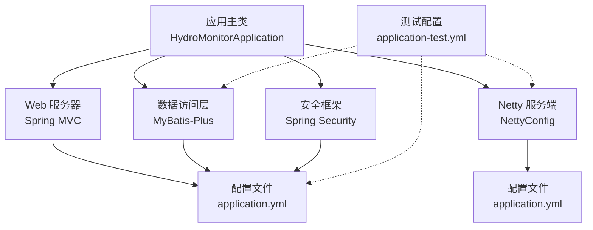
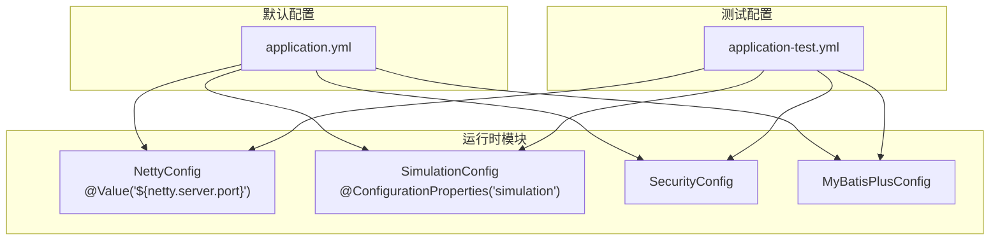
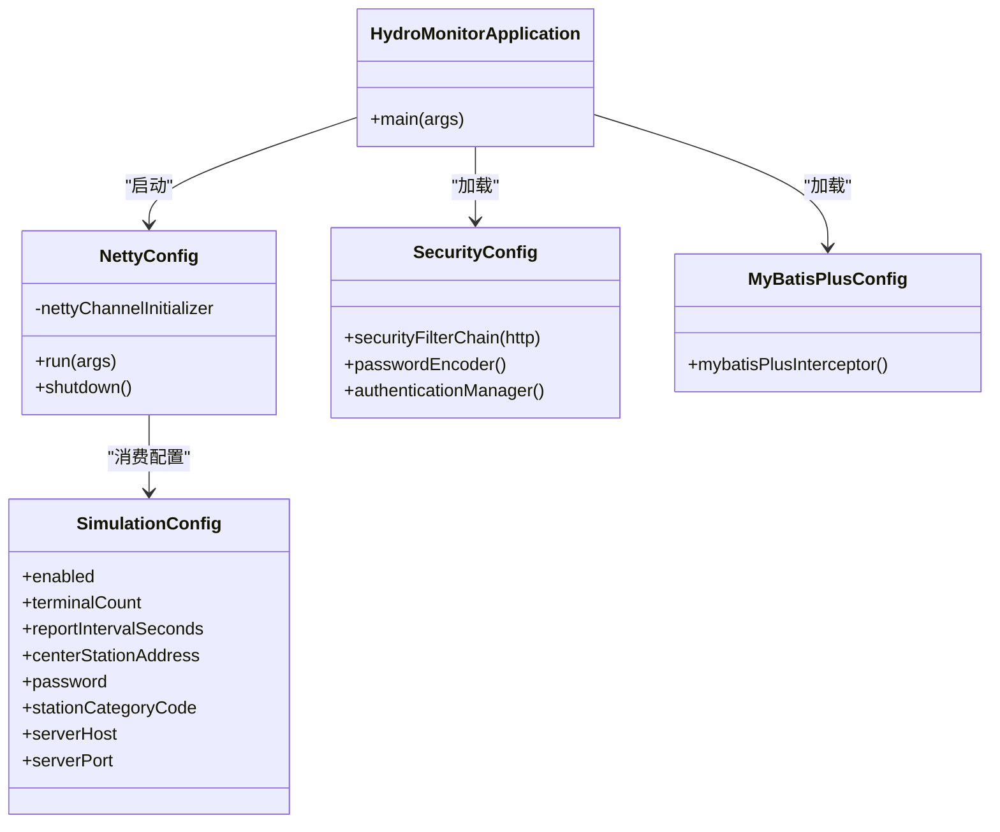

# 环境配置管理

<cite>
**本文引用的文件**
- [application.yml](file://src/main/resources/application.yml)
- [application-test.yml](file://src/test/resources/application-test.yml)
- [pom.xml](file://pom.xml)
- [start-dev.sh](file://start-dev.sh)
- [start-dev.bat](file://start-dev.bat)
- [HydroMonitorApplication.java](file://src/main/java/com/hydro/monitor/HydroMonitorApplication.java)
- [NettyConfig.java](file://src/main/java/com/hydro/monitor/config/NettyConfig.java)
- [SimulationConfig.java](file://src/main/java/com/hydro/monitor/config/SimulationConfig.java)
- [SecurityConfig.java](file://src/main/java/com/hydro/monitor/config/security/SecurityConfig.java)
- [MyBatisPlusConfig.java](file://src/main/java/com/hydro/monitor/config/MyBatisPlusConfig.java)
</cite>

## 目录
1. [简介](#简介)
2. [项目结构](#项目结构)
3. [核心组件](#核心组件)
4. [架构总览](#架构总览)
5. [详细组件分析](#详细组件分析)
6. [依赖分析](#依赖分析)
7. [性能考虑](#性能考虑)
8. [故障排查指南](#故障排查指南)
9. [结论](#结论)
10. [附录](#附录)

## 简介
本文件面向水文监测系统多环境配置管理，系统采用 Spring Boot 3 + Netty 架构，提供开发、测试、生产三套环境的配置差异与管理策略说明。重点涵盖以下方面：
- application.yml 与 application-test.yml 的配置继承与覆盖机制
- Profile 激活方式、环境变量注入与外部配置文件加载顺序
- 不同环境下的数据库连接、日志级别、性能参数等关键配置项
- 环境切换操作步骤、配置验证方法与冲突解决策略
- Docker 容器化部署时的配置管理策略

## 项目结构
系统采用标准 Spring Boot 项目结构，配置文件位于 resources 目录，测试配置位于 test/resources 目录。启动入口为应用主类，开发脚本提供热部署能力。

图表来源
- [HydroMonitorApplication.java:15-34](file://src/main/java/com/hydro/monitor/HydroMonitorApplication.java#L15-L34)
- [NettyConfig.java:26-42](file://src/main/java/com/hydro/monitor/config/NettyConfig.java#L26-L42)
- [MyBatisPlusConfig.java:14-38](file://src/main/java/com/hydro/monitor/config/MyBatisPlusConfig.java#L14-L38)
- [SecurityConfig.java:20-52](file://src/main/java/com/hydro/monitor/config/security/SecurityConfig.java#L20-L52)

章节来源
- [HydroMonitorApplication.java:12-34](file://src/main/java/com/hydro/monitor/HydroMonitorApplication.java#L12-L34)
- [application.yml:1-86](file://src/main/resources/application.yml#L1-L86)
- [application-test.yml:1-29](file://src/test/resources/application-test.yml#L1-L29)

## 核心组件
- 应用主类负责启动并输出启动信息，包含 HTTP 端口、Netty 端口、Swagger 访问路径等关键信息。
- NettyConfig 通过 @Value 注入 netty.server.port，实现端口配置的外部化。
- SimulationConfig 通过 @ConfigurationProperties(prefix="simulation") 将 simulation.* 配置映射为强类型对象。
- MyBatisPlusConfig 与 SecurityConfig 作为基础设施配置，分别提供分页拦截器与安全过滤链。
- application.yml 提供默认开发环境配置；application-test.yml 提供测试环境覆盖配置。

章节来源
- [HydroMonitorApplication.java:15-34](file://src/main/java/com/hydro/monitor/HydroMonitorApplication.java#L15-L34)
- [NettyConfig.java:30-31](file://src/main/java/com/hydro/monitor/config/NettyConfig.java#L30-L31)
- [SimulationConfig.java:16-58](file://src/main/java/com/hydro/monitor/config/SimulationConfig.java#L16-L58)
- [MyBatisPlusConfig.java:24-37](file://src/main/java/com/hydro/monitor/config/MyBatisPlusConfig.java#L24-L37)
- [SecurityConfig.java:34-51](file://src/main/java/com/hydro/monitor/config/security/SecurityConfig.java#L34-L51)

## 架构总览
下图展示配置在不同环境中的加载与覆盖关系，以及关键模块如何消费配置。

图表来源
- [application.yml:43-86](file://src/main/resources/application.yml#L43-L86)
- [application-test.yml:1-29](file://src/test/resources/application-test.yml#L1-L29)
- [NettyConfig.java:30-31](file://src/main/java/com/hydro/monitor/config/NettyConfig.java#L30-L31)
- [SimulationConfig.java:16-58](file://src/main/java/com/hydro/monitor/config/SimulationConfig.java#L16-L58)

## 详细组件分析

### 配置继承与覆盖机制（application.yml 与 application-test.yml）
- 继承关系：application-test.yml 作为测试环境专用配置，其键值会覆盖 application.yml 中同名键的值。
- 覆盖范围：
  - 数据源：测试环境使用内存数据库驱动与内存数据库 URL，开发环境使用 MySQL。
  - JWT：测试环境缩短了 token 过期时间，便于测试。
  - Netty：测试环境使用不同端口，避免与开发环境冲突。
  - 日志：测试环境设置根日志级别为更严格的级别，便于定位问题。
- 未显式声明的键：未在 application-test.yml 中声明的键仍沿用 application.yml 的默认值。

章节来源
- [application.yml:8-13](file://src/main/resources/application.yml#L8-L13)
- [application-test.yml:3-7](file://src/test/resources/application-test.yml#L3-L7)
- [application-test.yml:14-17](file://src/test/resources/application-test.yml#L14-L17)
- [application-test.yml:19-22](file://src/test/resources/application-test.yml#L19-L22)
- [application-test.yml:24-28](file://src/test/resources/application-test.yml#L24-L28)

### Profile 激活方式与外部配置加载顺序
- Profile 激活方式：
  - Maven 启动参数：通过命令行参数或脚本传递 Spring Profile，例如在启动脚本中追加 Spring Boot 运行参数以指定 active profile。
  - 环境变量：通过环境变量设置 Spring Profile，常见为 SPRING_PROFILES_ACTIVE。
  - 外部配置文件：Spring Boot 支持从多个位置加载配置，优先级从高到低依次为：
    1) 命令行参数
    2) 系统环境变量
    3) 用户目录下的配置文件（~/.spring-boot/)
    4) 当前工作目录下的配置文件（./config/）
    5) 当前工作目录下的配置文件（./）
    6) application-{profile}.yml 或 application-{profile}.properties
    7) application.yml 或 application.properties
- 在本项目中，测试配置文件 application-test.yml 与 application.yml 并列存在，测试运行时会优先加载 application-test.yml 中的键值，从而覆盖默认配置。

章节来源
- [start-dev.sh:25-26](file://start-dev.sh#L25-L26)
- [start-dev.bat:26-27](file://start-dev.bat#L26-L27)
- [application.yml:1-86](file://src/main/resources/application.yml#L1-L86)
- [application-test.yml:1-29](file://src/test/resources/application-test.yml#L1-L29)

### 环境变量注入与外部配置
- Netty 端口：通过 @Value 注入 netty.server.port，允许外部传参覆盖默认值。
- 模拟上报配置：通过 @ConfigurationProperties(prefix="simulation") 将 simulation.* 映射为 SimulationConfig 对象，便于在不同环境以外部配置文件或环境变量进行注入。
- 开发脚本：启动脚本设置了 JVM 编码参数，确保控制台输出与日志编码一致。

章节来源
- [NettyConfig.java:30-31](file://src/main/java/com/hydro/monitor/config/NettyConfig.java#L30-L31)
- [SimulationConfig.java:16-58](file://src/main/java/com/hydro/monitor/config/SimulationConfig.java#L16-L58)
- [start-dev.sh:25-26](file://start-dev.sh#L25-L26)
- [start-dev.bat:26-27](file://start-dev.bat#L26-L27)

### 关键配置项（按环境对比）
- 开发环境（application.yml）
  - 数据库：MySQL，本地开发库，用户名/密码为开发默认值。
  - 日志：root/INFO，包级别 DEBUG，控制台与文件编码 UTF-8，文件滚动大小与历史天数。
  - Netty：默认端口 9000。
  - JWT：较长过期时间，适合本地调试。
  - Swagger：开放 API 文档与 UI 访问路径。
  - DevTools：热部署开启，便于快速迭代。
- 测试环境（application-test.yml）
  - 数据库：H2 内存数据库，驱动与 URL 为内存模式。
  - JWT：较短过期时间，便于测试 token 刷新逻辑。
  - Netty：端口与开发环境不同，避免冲突。
  - 日志：根级别提升，便于测试阶段快速定位问题。
- 生产环境（建议策略）
  - 数据库：使用生产数据库实例，配置连接池与 SSL。
  - 日志：root/WARN 或更高，避免生产日志风暴。
  - Netty：使用独立端口，结合防火墙与负载均衡。
  - JWT：使用随机密钥与合理过期时间，定期轮换。
  - Swagger：关闭或仅在内网可用，避免泄露接口信息。
  - DevTools：关闭，避免不必要的开销与安全风险。

章节来源
- [application.yml:8-13](file://src/main/resources/application.yml#L8-L13)
- [application.yml:62-77](file://src/main/resources/application.yml#L62-L77)
- [application.yml:43-47](file://src/main/resources/application.yml#L43-L47)
- [application.yml:48-51](file://src/main/resources/application.yml#L48-L51)
- [application-test.yml:3-7](file://src/test/resources/application-test.yml#L3-L7)
- [application-test.yml:14-17](file://src/test/resources/application-test.yml#L14-L17)
- [application-test.yml:19-22](file://src/test/resources/application-test.yml#L19-L22)
- [application-test.yml:24-28](file://src/test/resources/application-test.yml#L24-L28)

### 环境切换操作步骤
- 开发环境
  - 使用开发脚本启动，自动编译并启用 DevTools 热部署。
  - 访问 Swagger 文档与 Netty 端口进行联调。
- 测试环境
  - 运行测试时，Spring Boot 自动加载 application-test.yml 并覆盖默认配置。
  - 如需手动指定 Profile，可在启动脚本中追加 Spring Boot 运行参数。
- 生产环境
  - 通过环境变量或外部配置文件设置 SPRING_PROFILES_ACTIVE=prod。
  - 将敏感配置放入外部配置文件或环境变量，避免硬编码。

章节来源
- [HydroMonitorApplication.java:27-33](file://src/main/java/com/hydro/monitor/HydroMonitorApplication.java#L27-L33)
- [start-dev.sh:25-26](file://start-dev.sh#L25-L26)
- [start-dev.bat:26-27](file://start-dev.bat#L26-L27)

### 配置验证方法
- 启动日志：观察启动输出中是否正确识别 DevTools 状态、HTTP 端口、Netty 端口与 Swagger 路径。
- 功能验证：通过 Swagger UI 调用接口，检查 JWT 登录、数据访问与 Netty 消息收发。
- 日志级别：在测试环境可临时降低日志级别以便排查问题；生产环境保持较高级别。
- 端口占用：确认 Netty 端口未被占用，避免启动失败。

章节来源
- [HydroMonitorApplication.java:27-33](file://src/main/java/com/hydro/monitor/HydroMonitorApplication.java#L27-L33)
- [application-test.yml:24-28](file://src/test/resources/application-test.yml#L24-L28)

### 配置冲突解决方案
- 键重复：若 application-test.yml 与 application.yml 同一键重复，后者会被前者覆盖。
- 端口冲突：测试环境使用不同 Netty 端口，避免与开发环境冲突。
- 数据库驱动：确保驱动类名与 URL 匹配，测试环境使用内存数据库驱动，开发/生产使用对应驱动。
- 日志级别：生产环境避免使用 DEBUG 级别，防止日志风暴。

章节来源
- [application-test.yml:19-22](file://src/test/resources/application-test.yml#L19-L22)
- [application.yml:10-13](file://src/main/resources/application.yml#L10-L13)
- [application-test.yml:3-7](file://src/test/resources/application-test.yml#L3-L7)

### Docker 容器化部署策略
- 配置注入
  - 环境变量：通过环境变量设置 SPRING_PROFILES_ACTIVE、数据库连接信息、JWT 密钥与过期时间等。
  - 外部配置文件：挂载外部 application-prod.yml 至容器内，覆盖默认配置。
  - 命令行参数：在 docker run 中追加 --spring-boot.run.jvmArguments 以设置 JVM 编码等参数。
- 安全性
  - 敏感配置（数据库密码、JWT 密钥）建议通过环境变量或密钥管理服务注入，避免写入镜像。
  - 关闭 DevTools，避免不必要的热部署与调试功能暴露。
- 性能与日志
  - 生产环境日志级别设置为 WARN 或更高，控制文件滚动大小与历史天数。
  - Netty 端口与 HTTP 端口通过环境变量或外部配置文件统一管理，便于横向扩展。

章节来源
- [pom.xml:168-173](file://pom.xml#L168-L173)
- [application.yml:62-77](file://src/main/resources/application.yml#L62-L77)
- [application.yml:43-47](file://src/main/resources/application.yml#L43-L47)

## 依赖分析
- 启动类依赖：HydroMonitorApplication 依赖 Spring Boot 自动装配，自动加载配置并启动 Web 与 Netty 服务。
- Netty 依赖：NettyConfig 依赖 NettyChannelInitializer，通过 @Value 注入端口配置。
- 配置依赖：SimulationConfig 依赖 application.yml 中的 simulation.* 键，实现强类型配置映射。
- 安全与数据访问：SecurityConfig 与 MyBatisPlusConfig 依赖 application.yml 中的 spring.security 与 mybatis-plus 配置。

图表来源
- [HydroMonitorApplication.java:15-34](file://src/main/java/com/hydro/monitor/HydroMonitorApplication.java#L15-L34)
- [NettyConfig.java:26-86](file://src/main/java/com/hydro/monitor/config/NettyConfig.java#L26-L86)
- [SimulationConfig.java:16-58](file://src/main/java/com/hydro/monitor/config/SimulationConfig.java#L16-L58)
- [SecurityConfig.java:20-75](file://src/main/java/com/hydro/monitor/config/security/SecurityConfig.java#L20-L75)
- [MyBatisPlusConfig.java:14-38](file://src/main/java/com/hydro/monitor/config/MyBatisPlusConfig.java#L14-L38)

章节来源
- [HydroMonitorApplication.java:12-34](file://src/main/java/com/hydro/monitor/HydroMonitorApplication.java#L12-L34)
- [NettyConfig.java:26-86](file://src/main/java/com/hydro/monitor/config/NettyConfig.java#L26-L86)
- [SimulationConfig.java:16-58](file://src/main/java/com/hydro/monitor/config/SimulationConfig.java#L16-L58)
- [SecurityConfig.java:20-75](file://src/main/java/com/hydro/monitor/config/security/SecurityConfig.java#L20-L75)
- [MyBatisPlusConfig.java:14-38](file://src/main/java/com/hydro/monitor/config/MyBatisPlusConfig.java#L14-L38)

## 性能考虑
- 日志级别：生产环境建议使用 WARN 或更高，避免大量 DEBUG 日志影响性能。
- Netty 端口：测试与开发环境使用不同端口，避免端口竞争导致启动失败。
- DevTools：开发环境启用热部署，生产环境关闭以减少资源消耗。
- 数据库连接：生产环境使用连接池与 SSL，避免频繁建立连接带来的延迟。

章节来源
- [application.yml:62-77](file://src/main/resources/application.yml#L62-L77)
- [application-test.yml:19-22](file://src/test/resources/application-test.yml#L19-L22)
- [application.yml:35-41](file://src/main/resources/application.yml#L35-L41)

## 故障排查指南
- 启动失败
  - 检查数据库连接信息与驱动类名是否匹配。
  - 确认 Netty 端口未被占用。
  - 查看启动日志中 DevTools 状态与端口输出。
- 测试失败
  - 确认测试配置文件已正确加载，数据库驱动与 URL 是否为内存数据库。
  - 检查 JWT 过期时间是否过短导致测试中断。
- 日志过多
  - 降低日志级别或调整文件滚动策略，避免磁盘空间不足。

章节来源
- [HydroMonitorApplication.java:27-33](file://src/main/java/com/hydro/monitor/HydroMonitorApplication.java#L27-L33)
- [application-test.yml:3-7](file://src/test/resources/application-test.yml#L3-L7)
- [application-test.yml:14-17](file://src/test/resources/application-test.yml#L14-L17)
- [application.yml:62-77](file://src/main/resources/application.yml#L62-L77)

## 结论
本系统通过 application.yml 与 application-test.yml 的明确覆盖关系，实现了开发、测试环境的清晰分离。配合 Profile 激活、环境变量注入与外部配置文件加载顺序，能够满足多环境部署需求。生产环境建议通过外部配置文件与环境变量注入敏感信息，并关闭 DevTools 与调试功能，确保安全性与稳定性。

## 附录
- 开发脚本提供了自动编译与热部署能力，便于快速迭代。
- 启动类输出关键信息，有助于快速验证配置是否生效。

章节来源
- [start-dev.sh:1-26](file://start-dev.sh#L1-L26)
- [start-dev.bat:1-27](file://start-dev.bat#L1-L27)
- [HydroMonitorApplication.java:27-33](file://src/main/java/com/hydro/monitor/HydroMonitorApplication.java#L27-L33)