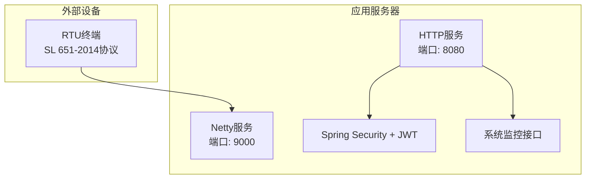
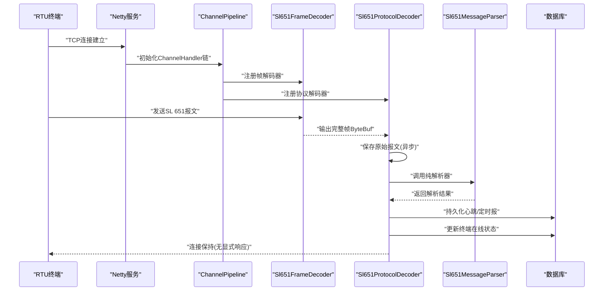
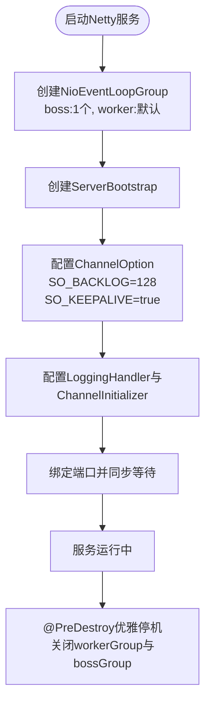
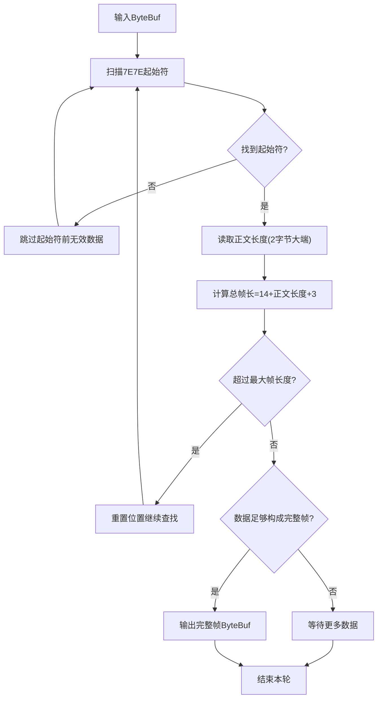
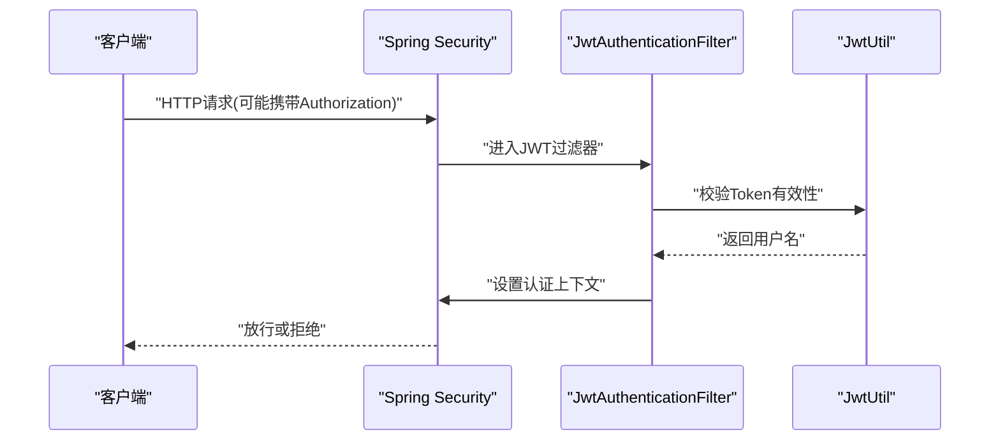
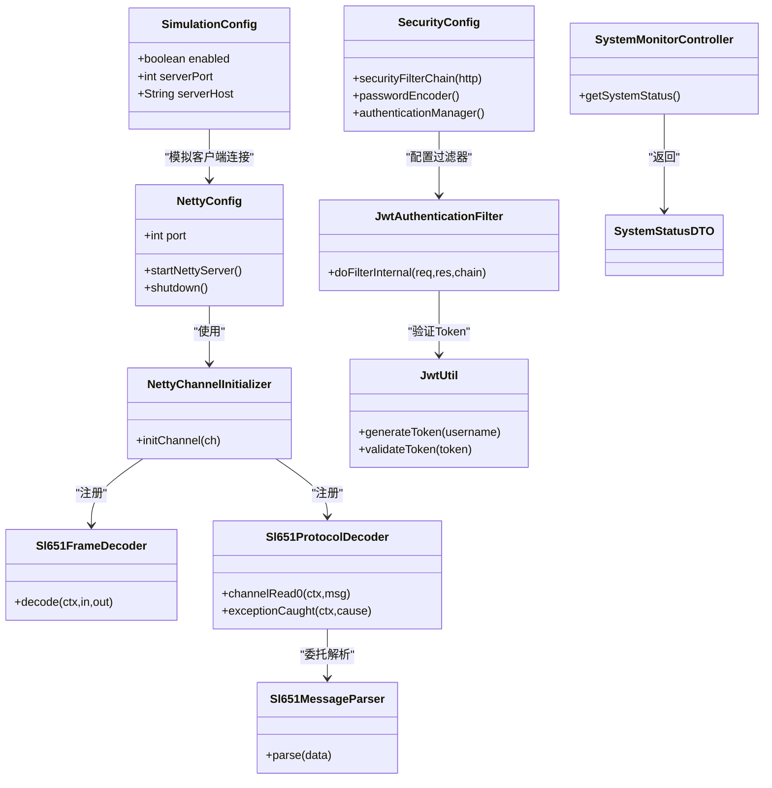

# 网络配置管理

<cite>
**本文档引用的文件**
- [NettyConfig.java](file://src/main/java/com/hydro/monitor/config/NettyConfig.java)
- [NettyChannelInitializer.java](file://src/main/java/com/hydro/monitor/config/NettyChannelInitializer.java)
- [Sl651FrameDecoder.java](file://src/main/java/com/hydro/monitor/netty/Sl651FrameDecoder.java)
- [Sl651ProtocolDecoder.java](file://src/main/java/com/hydro/monitor/netty/Sl651ProtocolDecoder.java)
- [Sl651MessageParser.java](file://src/main/java/com/hydro/monitor/netty/Sl651MessageParser.java)
- [application.yml](file://src/main/resources/application.yml)
- [SecurityConfig.java](file://src/main/java/com/hydro/monitor/config/security/SecurityConfig.java)
- [JwtAuthenticationFilter.java](file://src/main/java/com/hydro/monitor/config/security/JwtAuthenticationFilter.java)
- [JwtUtil.java](file://src/main/java/com/hydro/monitor/config/security/JwtUtil.java)
- [SystemMonitorController.java](file://src/main/java/com/hydro/monitor/modules/controller/SystemMonitorController.java)
- [SystemStatusDTO.java](file://src/main/java/com/hydro/monitor/modules/dto/SystemStatusDTO.java)
- [SimulationConfig.java](file://src/main/java/com/hydro/monitor/config/SimulationConfig.java)
- [README.md](file://README.md)
- [DEVELOPER_GUIDE.md](file://DEVELOPER_GUIDE.md)
</cite>

## 目录
1. [简介](#简介)
2. [项目结构](#项目结构)
3. [核心组件](#核心组件)
4. [架构概览](#架构概览)
5. [详细组件分析](#详细组件分析)
6. [依赖关系分析](#依赖关系分析)
7. [性能考虑](#性能考虑)
8. [故障排查指南](#故障排查指南)
9. [结论](#结论)
10. [附录](#附录)

## 简介
本文件面向水文监测系统的网络配置管理，围绕Netty服务器配置、网络协议配置、Socket选项配置、网络I/O参数、防火墙与访问控制、网络安全、性能调优、连接池与负载均衡、故障排查与监控等维度进行全面说明。文档以代码为依据，结合配置文件与架构设计，帮助读者理解并优化网络配置。

## 项目结构
系统采用Spring Boot + Netty的混合架构，HTTP服务与Netty网络服务分离部署：
- HTTP服务（Spring MVC）：端口由application.yml配置，默认8080
- Netty服务：端口由application.yml配置，默认9000，专门用于接收SL 651-2014协议报文
- 安全体系：Spring Security + JWT，保护REST API接口
- 监控体系：系统状态监控接口，提供内存、CPU、线程数等指标

**图表来源**
- [application.yml:1-86](file://src/main/resources/application.yml#L1-L86)
- [README.md:53-58](file://README.md#L53-L58)

**章节来源**
- [application.yml:1-86](file://src/main/resources/application.yml#L1-L86)
- [README.md:53-58](file://README.md#L53-L58)

## 核心组件
- NettyConfig：Netty服务端启动器，实现CommandLineRunner，在Spring Boot启动后异步绑定端口并启动服务
- NettyChannelInitializer：Channel管道初始化器，配置帧解码器与协议解码器
- Sl651FrameDecoder：基于起始符与正文长度的帧解码器，处理TCP粘包/拆包
- Sl651ProtocolDecoder：Netty处理器，负责接收ByteBuf、保存原始报文、调用纯解析器并持久化
- Sl651MessageParser：纯解析器，无状态、线程安全，负责SL 651协议的结构化解析
- SecurityConfig + JwtAuthenticationFilter + JwtUtil：基于JWT的无状态认证体系
- SystemMonitorController + SystemStatusDTO：系统运行状态监控接口
- SimulationConfig：终端模拟上报配置（含Netty服务器地址与端口）

**章节来源**
- [NettyConfig.java:26-87](file://src/main/java/com/hydro/monitor/config/NettyConfig.java#L26-L87)
- [NettyChannelInitializer.java:18-35](file://src/main/java/com/hydro/monitor/config/NettyChannelInitializer.java#L18-L35)
- [Sl651FrameDecoder.java:26-121](file://src/main/java/com/hydro/monitor/netty/Sl651FrameDecoder.java#L26-L121)
- [Sl651ProtocolDecoder.java:39-278](file://src/main/java/com/hydro/monitor/netty/Sl651ProtocolDecoder.java#L39-L278)
- [Sl651MessageParser.java:25-648](file://src/main/java/com/hydro/monitor/netty/Sl651MessageParser.java#L25-L648)
- [SecurityConfig.java:22-76](file://src/main/java/com/hydro/monitor/config/security/SecurityConfig.java#L22-L76)
- [JwtAuthenticationFilter.java:27-75](file://src/main/java/com/hydro/monitor/config/security/JwtAuthenticationFilter.java#L27-L75)
- [JwtUtil.java:23-126](file://src/main/java/com/hydro/monitor/config/security/JwtUtil.java#L23-L126)
- [SystemMonitorController.java:27-84](file://src/main/java/com/hydro/monitor/modules/controller/SystemMonitorController.java#L27-L84)
- [SystemStatusDTO.java:8-40](file://src/main/java/com/hydro/monitor/modules/dto/SystemStatusDTO.java#L8-L40)
- [SimulationConfig.java:14-58](file://src/main/java/com/hydro/monitor/config/SimulationConfig.java#L14-L58)

## 架构概览
系统网络架构分为三层：
- 接入层：Netty服务接收RTU上报的SL 651-2014协议报文
- 协议层：Sl651FrameDecoder进行帧边界识别，Sl651ProtocolDecoder作为Netty处理器
- 业务层：Sl651MessageParser纯解析，随后持久化到数据库并更新终端状态

**图表来源**
- [NettyChannelInitializer.java:22-34](file://src/main/java/com/hydro/monitor/config/NettyChannelInitializer.java#L22-L34)
- [Sl651FrameDecoder.java:38-100](file://src/main/java/com/hydro/monitor/netty/Sl651FrameDecoder.java#L38-L100)
- [Sl651ProtocolDecoder.java:54-89](file://src/main/java/com/hydro/monitor/netty/Sl651ProtocolDecoder.java#L54-L89)
- [Sl651MessageParser.java:66-126](file://src/main/java/com/hydro/monitor/netty/Sl651MessageParser.java#L66-L126)

## 详细组件分析

### Netty服务器配置参数
- 监听端口：来源于application.yml的netty.server.port，默认9000
- 线程模型：bossGroup=1个线程，workerGroup由系统自动分配（通常为CPU核数×2）
- Socket选项：
  - SO_BACKLOG=128：半连接队列长度
  - SO_KEEPALIVE=true：启用TCP保活
- 日志处理器：LoggingHandler用于调试（可选）
- 关闭策略：@PreDestroy优雅停机，先关闭workerGroup再关闭bossGroup

**图表来源**
- [NettyConfig.java:47-85](file://src/main/java/com/hydro/monitor/config/NettyConfig.java#L47-L85)

**章节来源**
- [NettyConfig.java:30-85](file://src/main/java/com/hydro/monitor/config/NettyConfig.java#L30-L85)
- [application.yml:43-47](file://src/main/resources/application.yml#L43-L47)

### 网络协议配置（SL 651-2014）
- 帧格式：起始符7E7E + 报文头 + 正文 + 报文尾
- 帧边界识别：基于7E7E起始符与正文长度字段进行帧分割
- 最大帧长度：4096字节，防止内存溢出
- 正文长度字段：2字节大端序
- 总帧长计算：报文头固定长度14 + 正文长度 + 报文尾长度3

**图表来源**
- [Sl651FrameDecoder.java:38-100](file://src/main/java/com/hydro/monitor/netty/Sl651FrameDecoder.java#L38-L100)

**章节来源**
- [Sl651FrameDecoder.java:26-121](file://src/main/java/com/hydro/monitor/netty/Sl651FrameDecoder.java#L26-L121)

### Socket选项与网络I/O配置
- SO_BACKLOG：半连接队列长度，决定排队等待三次握手完成的连接数
- SO_KEEPALIVE：启用TCP保活，检测空闲连接是否存活
- LoggingHandler：可选的日志处理器，便于调试
- ChannelPipeline：按顺序注册帧解码器与协议解码器

**章节来源**
- [NettyConfig.java:55-58](file://src/main/java/com/hydro/monitor/config/NettyConfig.java#L55-L58)
- [NettyChannelInitializer.java:22-34](file://src/main/java/com/hydro/monitor/config/NettyChannelInitializer.java#L22-L34)

### 网络安全与访问控制
- 无状态认证：基于JWT的无状态认证，SessionCreationPolicy.STATELESS
- 授权规则：/api/v1/auth/**与Swagger相关路径公开访问；其他接口需认证
- Authorization头：Bearer Token格式
- 密钥与过期时间：来源于application.yml的jwt.secret与jwt.expiration

**图表来源**
- [SecurityConfig.java:34-52](file://src/main/java/com/hydro/monitor/config/security/SecurityConfig.java#L34-L52)
- [JwtAuthenticationFilter.java:32-59](file://src/main/java/com/hydro/monitor/config/security/JwtAuthenticationFilter.java#L32-L59)
- [JwtUtil.java:67-75](file://src/main/java/com/hydro/monitor/config/security/JwtUtil.java#L67-L75)

**章节来源**
- [SecurityConfig.java:22-76](file://src/main/java/com/hydro/monitor/config/security/SecurityConfig.java#L22-L76)
- [JwtAuthenticationFilter.java:27-75](file://src/main/java/com/hydro/monitor/config/security/JwtAuthenticationFilter.java#L27-L75)
- [JwtUtil.java:23-126](file://src/main/java/com/hydro/monitor/config/security/JwtUtil.java#L23-L126)
- [application.yml:48-51](file://src/main/resources/application.yml#L48-L51)

### 网络性能调优参数
- 线程模型：workerGroup线程数默认由系统自动分配，可根据CPU核数与并发需求调整
- 缓冲区：ByteBuf按需读取，Sl651FrameDecoder内置最大帧长度限制，防止内存溢出
- 异步处理：原始报文保存采用CompletableFuture异步执行，避免阻塞Netty线程
- 监控指标：系统监控接口提供内存、CPU、线程数等基础指标

**章节来源**
- [NettyConfig.java:48-49](file://src/main/java/com/hydro/monitor/config/NettyConfig.java#L48-L49)
- [Sl651FrameDecoder.java:35](file://src/main/java/com/hydro/monitor/netty/Sl651FrameDecoder.java#L35)
- [Sl651ProtocolDecoder.java:234-244](file://src/main/java/com/hydro/monitor/netty/Sl651ProtocolDecoder.java#L234-L244)
- [SystemMonitorController.java:34-66](file://src/main/java/com/hydro/monitor/modules/controller/SystemMonitorController.java#L34-L66)

### 连接池与负载均衡配置
- 连接池：HTTP服务的数据库连接池配置位于application.yml的spring.datasource，但未显示具体Hikari配置项
- 负载均衡：系统未实现内部负载均衡；可通过外部反向代理（如Nginx）实现多实例负载均衡
- Netty模拟客户端：SimulationConfig提供serverHost与serverPort，便于本地压力测试

**章节来源**
- [application.yml:9-13](file://src/main/resources/application.yml#L9-L13)
- [SimulationConfig.java:50-57](file://src/main/java/com/hydro/monitor/config/SimulationConfig.java#L50-L57)

### 网络故障排查与配置验证
- 端口占用：若8080/9000被占用，修改application.yml对应端口或释放端口
- 数据库连接：确认MySQL服务、URL、用户名、密码正确
- JWT验证：确认Authorization头格式为Bearer <token>，Token未过期
- 配置验证：启动日志包含HTTP端口与Netty端口信息，验证服务是否正常启动

**章节来源**
- [DEVELOPER_GUIDE.md:743-787](file://DEVELOPER_GUIDE.md#L743-L787)
- [README.md:222-232](file://README.md#L222-L232)

## 依赖关系分析

**图表来源**
- [NettyConfig.java:28](file://src/main/java/com/hydro/monitor/config/NettyConfig.java#L28)
- [NettyChannelInitializer.java:20](file://src/main/java/com/hydro/monitor/config/NettyChannelInitializer.java#L20)
- [Sl651ProtocolDecoder.java:41-48](file://src/main/java/com/hydro/monitor/netty/Sl651ProtocolDecoder.java#L41-L48)
- [SecurityConfig.java:24](file://src/main/java/com/hydro/monitor/config/security/SecurityConfig.java#L24)
- [JwtAuthenticationFilter.java:29](file://src/main/java/com/hydro/monitor/config/security/JwtAuthenticationFilter.java#L29)
- [JwtUtil.java:25-29](file://src/main/java/com/hydro/monitor/config/security/JwtUtil.java#L25-L29)
- [SystemMonitorController.java:53-60](file://src/main/java/com/hydro/monitor/modules/controller/SystemMonitorController.java#L53-L60)
- [SimulationConfig.java:22-57](file://src/main/java/com/hydro/monitor/config/SimulationConfig.java#L22-L57)

**章节来源**
- [NettyConfig.java:26-87](file://src/main/java/com/hydro/monitor/config/NettyConfig.java#L26-L87)
- [NettyChannelInitializer.java:18-35](file://src/main/java/com/hydro/monitor/config/NettyChannelInitializer.java#L18-L35)
- [Sl651ProtocolDecoder.java:39-278](file://src/main/java/com/hydro/monitor/netty/Sl651ProtocolDecoder.java#L39-L278)
- [Sl651MessageParser.java:25-648](file://src/main/java/com/hydro/monitor/netty/Sl651MessageParser.java#L25-L648)
- [SecurityConfig.java:22-76](file://src/main/java/com/hydro/monitor/config/security/SecurityConfig.java#L22-L76)
- [JwtAuthenticationFilter.java:27-75](file://src/main/java/com/hydro/monitor/config/security/JwtAuthenticationFilter.java#L27-L75)
- [JwtUtil.java:23-126](file://src/main/java/com/hydro/monitor/config/security/JwtUtil.java#L23-L126)
- [SystemMonitorController.java:27-84](file://src/main/java/com/hydro/monitor/modules/controller/SystemMonitorController.java#L27-L84)
- [SystemStatusDTO.java:8-40](file://src/main/java/com/hydro/monitor/modules/dto/SystemStatusDTO.java#L8-L40)
- [SimulationConfig.java:14-58](file://src/main/java/com/hydro/monitor/config/SimulationConfig.java#L14-L58)

## 性能考虑
- 线程模型：workerGroup线程数默认由系统自动分配，建议根据CPU核数与并发连接数进行调优
- 缓冲区：最大帧长度限制为4096字节，避免过大报文导致内存压力
- 异步持久化：原始报文保存采用异步执行，降低对网络线程的影响
- 监控指标：通过系统监控接口获取内存、CPU、线程数等指标，辅助性能分析

**章节来源**
- [Sl651FrameDecoder.java:35](file://src/main/java/com/hydro/monitor/netty/Sl651FrameDecoder.java#L35)
- [Sl651ProtocolDecoder.java:234-244](file://src/main/java/com/hydro/monitor/netty/Sl651ProtocolDecoder.java#L234-L244)
- [SystemMonitorController.java:34-66](file://src/main/java/com/hydro/monitor/modules/controller/SystemMonitorController.java#L34-L66)

## 故障排查指南
- 端口被占用：检查8080/9000端口占用情况，修改application.yml或释放端口
- 数据库连接失败：确认MySQL服务、URL、用户名、密码正确
- JWT验证失败：确认Authorization头格式为Bearer <token>，Token未过期
- 配置验证：启动日志包含HTTP端口与Netty端口信息，验证服务是否正常启动

**章节来源**
- [DEVELOPER_GUIDE.md:743-787](file://DEVELOPER_GUIDE.md#L743-L787)
- [README.md:222-232](file://README.md#L222-L232)

## 结论
本系统在网络配置方面采用简洁高效的Netty架构，配合SL 651-2014协议解析与JWT安全体系，满足水文监测场景的高并发与协议兼容需求。通过合理的线程模型、缓冲区限制与异步处理，系统具备良好的性能与稳定性。建议在生产环境中结合外部负载均衡与完善的监控告警体系，进一步提升可用性与可观测性。

## 附录
- 端口配置：HTTP服务8080，Netty服务9000
- JWT配置：secret与expiration来自application.yml
- 监控接口：/api/v1/system/status
- 模拟配置：simulation.*，含serverHost与serverPort

**章节来源**
- [application.yml:1-86](file://src/main/resources/application.yml#L1-L86)
- [README.md:53-58](file://README.md#L53-L58)
- [SystemMonitorController.java:34-66](file://src/main/java/com/hydro/monitor/modules/controller/SystemMonitorController.java#L34-L66)
- [SimulationConfig.java:14-58](file://src/main/java/com/hydro/monitor/config/SimulationConfig.java#L14-L58)