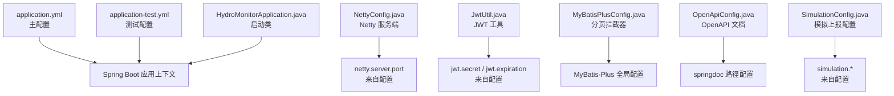
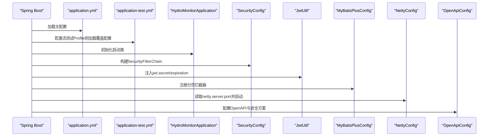
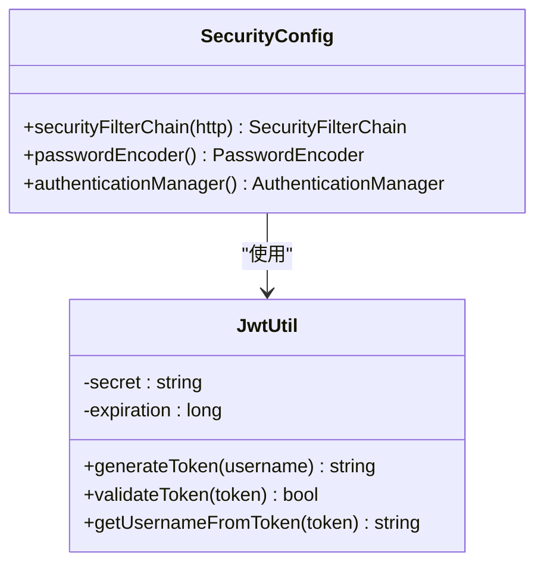
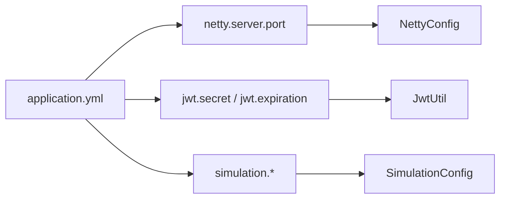

# 配置管理

<cite>
**本文引用的文件**
- [application.yml](file://src/main/resources/application.yml)
- [application-test.yml](file://src/test/resources/application-test.yml)
- [pom.xml](file://pom.xml)
- [HydroMonitorApplication.java](file://src/main/java/com/hydro/monitor/HydroMonitorApplication.java)
- [SecurityConfig.java](file://src/main/java/com/hydro/monitor/config/security/SecurityConfig.java)
- [JwtUtil.java](file://src/main/java/com/hydro/monitor/config/security/JwtUtil.java)
- [MyBatisPlusConfig.java](file://src/main/java/com/hydro/monitor/config/MyBatisPlusConfig.java)
- [NettyConfig.java](file://src/main/java/com/hydro/monitor/config/NettyConfig.java)
- [OpenApiConfig.java](file://src/main/java/com/hydro/monitor/config/OpenApiConfig.java)
- [SimulationConfig.java](file://src/main/java/com/hydro/monitor/config/SimulationConfig.java)
- [start-dev.sh](file://start-dev.sh)
- [start-dev.bat](file://start-dev.bat)
</cite>

## 目录
1. [简介](#简介)
2. [项目结构与配置文件定位](#项目结构与配置文件定位)
3. [核心配置项详解](#核心配置项详解)
4. [多环境配置策略与切换](#多环境配置策略与切换)
5. [架构概览与配置交互](#架构概览与配置交互)
6. [组件级配置深度解析](#组件级配置深度解析)
7. [依赖关系与耦合分析](#依赖关系与耦合分析)
8. [性能与容量配置建议](#性能与容量配置建议)
9. [安全配置与敏感信息保护](#安全配置与敏感信息保护)
10. [配置验证、冲突排查与性能影响分析](#配置验证冲突排查与性能影响分析)
11. [容器化与外部配置中心集成](#容器化与外部配置中心集成)
12. [配置热更新机制与最佳实践](#配置热更新机制与最佳实践)
13. [故障排查指南](#故障排查指南)
14. [结论](#结论)
15. [附录：配置清单与参考路径](#附录配置清单与参考路径)

## 简介
本文件面向水文监测系统的配置管理，围绕 application.yml 及其测试覆盖文件，系统性梳理各项配置参数、多环境管理策略、安全与性能优化、日志与监控、以及容器化与外部配置中心的集成思路。文档同时给出配置验证方法、冲突排查流程与性能影响分析，帮助研发与运维团队建立可追溯、可审计、可演进的配置管理体系。

## 项目结构与配置文件定位
- 应用主配置位于 resources 根目录，键值采用层级命名空间组织，便于按模块拆分与读取。
- 测试环境配置位于测试资源目录，通过覆盖主配置实现隔离。
- 启动入口类负责打印运行态信息，便于快速核对端口与功能开关。
- 关键组件通过注解或属性读取配置，形成“配置驱动行为”的设计。

图表来源
- [application.yml:1-86](file://src/main/resources/application.yml#L1-L86)
- [application-test.yml:1-29](file://src/test/resources/application-test.yml#L1-L29)
- [HydroMonitorApplication.java:15-34](file://src/main/java/com/hydro/monitor/HydroMonitorApplication.java#L15-L34)
- [NettyConfig.java:30-31](file://src/main/java/com/hydro/monitor/config/NettyConfig.java#L30-L31)
- [JwtUtil.java:25-29](file://src/main/java/com/hydro/monitor/config/security/JwtUtil.java#L25-L29)
- [MyBatisPlusConfig.java:24-37](file://src/main/java/com/hydro/monitor/config/MyBatisPlusConfig.java#L24-L37)
- [OpenApiConfig.java:28-49](file://src/main/java/com/hydro/monitor/config/OpenApiConfig.java#L28-L49)
- [SimulationConfig.java:16-58](file://src/main/java/com/hydro/monitor/config/SimulationConfig.java#L16-L58)

章节来源
- [application.yml:1-86](file://src/main/resources/application.yml#L1-L86)
- [application-test.yml:1-29](file://src/test/resources/application-test.yml#L1-L29)
- [HydroMonitorApplication.java:15-34](file://src/main/java/com/hydro/monitor/HydroMonitorApplication.java#L15-L34)

## 核心配置项详解
以下按模块梳理关键配置键及其作用、默认值与调优要点：

- 服务器与应用元信息
  - server.port：HTTP 服务端口（默认 8080）
  - spring.application.name：应用名称（默认 hydro-monitor）

- 数据源与持久层
  - spring.datasource.*：驱动、URL、用户名、密码
  - spring.jackson.*：日期格式、时区、序列化策略
  - spring.mybatis-plus.configuration.*：下划线转驼峰、日志实现
  - spring.mybatis-plus.global-config.db-config.*：ID 策略、逻辑删除字段与值

- 开发工具与热重载
  - spring.devtools.restart.*：启用、额外监听路径、排除静态资源
  - spring.devtools.livereload：浏览器实时刷新

- Netty 协议服务
  - netty.server.port：协议服务端口（默认 9000）

- JWT 安全令牌
  - jwt.secret：签名密钥（建议替换为强密钥）
  - jwt.expiration：过期时间（毫秒）

- 文档与调试
  - springdoc.api-docs.path / springdoc.swagger-ui.path：OpenAPI 文档与 UI 访问路径
  - logging.level.* / logging.pattern.* / logging.file.*：日志级别、格式、文件滚动策略

- 终端模拟上报
  - simulation.enabled / simulation.terminal-count / simulation.report-interval-seconds / simulation.center-station-address / simulation.password / simulation.station-category-code / simulation.server-host / simulation.server-port：模拟上报功能的开关与参数

章节来源
- [application.yml:1-86](file://src/main/resources/application.yml#L1-L86)

## 多环境配置策略与切换
- 开发环境
  - 使用主配置 application.yml，启用 DevTools 热重载与 LiveReload，便于本地迭代。
  - 启动脚本提供一键编译与启动，支持 UTF-8 编码参数传递。

- 测试环境
  - application-test.yml 覆盖数据源为内存数据库、调整 JWT 过期时间、修改 Netty 端口、降低根日志级别，确保测试稳定性与隔离性。

- 生产环境
  - 建议通过外部配置中心或环境变量注入敏感参数（如数据库凭据、JWT 密钥、Netty 端口），避免硬编码在仓库中。
  - 通过 Spring Profile 切换不同环境配置文件，结合 CI/CD 注入环境变量与密文。

- 切换方式
  - 通过命令行参数或环境变量指定激活 Profile，实现配置文件与外部变量的叠加与覆盖。
  - 对于非敏感参数，可在 CI/CD 中以环境变量注入；对于敏感参数，建议使用密文存储与解密流程。

章节来源
- [application.yml:1-86](file://src/main/resources/application.yml#L1-L86)
- [application-test.yml:1-29](file://src/test/resources/application-test.yml#L1-L29)
- [start-dev.sh:1-25](file://start-dev.sh#L1-L25)
- [start-dev.bat:1-28](file://start-dev.bat#L1-L28)

## 架构概览与配置交互
配置在系统中的交互路径如下：应用启动时加载 application.yml，随后根据 Profile 加载测试或生产覆盖配置；各组件通过注解读取配置并生效。

图表来源
- [application.yml:1-86](file://src/main/resources/application.yml#L1-L86)
- [application-test.yml:1-29](file://src/test/resources/application-test.yml#L1-L29)
- [HydroMonitorApplication.java:15-34](file://src/main/java/com/hydro/monitor/HydroMonitorApplication.java#L15-L34)
- [SecurityConfig.java:34-52](file://src/main/java/com/hydro/monitor/config/security/SecurityConfig.java#L34-L52)
- [JwtUtil.java:25-29](file://src/main/java/com/hydro/monitor/config/security/JwtUtil.java#L25-L29)
- [MyBatisPlusConfig.java:24-37](file://src/main/java/com/hydro/monitor/config/MyBatisPlusConfig.java#L24-L37)
- [NettyConfig.java:30-31](file://src/main/java/com/hydro/monitor/config/NettyConfig.java#L30-L31)
- [OpenApiConfig.java:28-49](file://src/main/java/com/hydro/monitor/config/OpenApiConfig.java#L28-L49)

## 组件级配置深度解析

### 安全配置（Spring Security + JWT）
- 安全过滤链禁用 CSRF，设置会话为无状态，开放认证与文档相关路径，其余接口需认证。
- JWT 工具从配置读取密钥与过期时间，生成与校验令牌。

图表来源
- [SecurityConfig.java:24-75](file://src/main/java/com/hydro/monitor/config/security/SecurityConfig.java#L24-L75)
- [JwtUtil.java:25-29](file://src/main/java/com/hydro/monitor/config/security/JwtUtil.java#L25-L29)

章节来源
- [SecurityConfig.java:34-52](file://src/main/java/com/hydro/monitor/config/security/SecurityConfig.java#L34-L52)
- [JwtUtil.java:37-48](file://src/main/java/com/hydro/monitor/config/security/JwtUtil.java#L37-L48)

### 持久层与分页配置（MyBatis-Plus）
- 注册分页拦截器，设置最大单页限制与溢出策略，保证查询性能与安全性。

章节来源
- [MyBatisPlusConfig.java:24-37](file://src/main/java/com/hydro/monitor/config/MyBatisPlusConfig.java#L24-L37)

### 协议服务（Netty）
- 通过 @Value 读取 netty.server.port，启动服务端并注册通道初始化器，支持优雅停机。

章节来源
- [NettyConfig.java:30-31](file://src/main/java/com/hydro/monitor/config/NettyConfig.java#L30-L31)
- [NettyConfig.java:47-70](file://src/main/java/com/hydro/monitor/config/NettyConfig.java#L47-L70)

### 文档与调试（OpenAPI + 日志）
- OpenAPI 配置提供标题、描述、联系人、许可证与全局安全方案（Bearer JWT）。
- 日志配置定义控制台与文件输出格式、字符集与滚动策略。

章节来源
- [OpenApiConfig.java:28-49](file://src/main/java/com/hydro/monitor/config/OpenApiConfig.java#L28-L49)
- [application.yml:62-77](file://src/main/resources/application.yml#L62-L77)

### 模拟上报配置（SimulationConfig）
- 通过 @ConfigurationProperties 绑定 simulation.* 前缀的配置，支持开关、终端数量、上报间隔、中心站地址、密码、分类码、服务器地址与端口。

章节来源
- [SimulationConfig.java:16-58](file://src/main/java/com/hydro/monitor/config/SimulationConfig.java#L16-L58)
- [application.yml:78-86](file://src/main/resources/application.yml#L78-L86)

## 依赖关系与耦合分析
- 配置与组件的耦合点主要体现在：
  - NettyConfig 与 application.yml 的 netty.server.port 键耦合
  - JwtUtil 与 application.yml 的 jwt.secret 与 jwt.expiration 键耦合
  - SimulationConfig 与 application.yml 的 simulation.* 键耦合
- 通过 @Value 与 @ConfigurationProperties 的组合，实现“声明式”配置注入，降低硬编码与分散配置带来的风险。

图表来源
- [application.yml:44-51](file://src/main/resources/application.yml#L44-L51)
- [application.yml:49-51](file://src/main/resources/application.yml#L49-L51)
- [application.yml:79-86](file://src/main/resources/application.yml#L79-L86)
- [NettyConfig.java:30-31](file://src/main/java/com/hydro/monitor/config/NettyConfig.java#L30-L31)
- [JwtUtil.java:25-29](file://src/main/java/com/hydro/monitor/config/security/JwtUtil.java#L25-L29)
- [SimulationConfig.java:16-58](file://src/main/java/com/hydro/monitor/config/SimulationConfig.java#L16-L58)

## 性能与容量配置建议
- 数据库连接与事务
  - 控制连接池大小与超时，避免高并发下的连接争用。
  - 合理设置 MyBatis-Plus 分页上限，防止大页扫描导致的性能问题。
- Netty 服务
  - 根据并发连接数与消息吞吐量调整 boss/worker 线程组规模，设置合理的 SO_BACKLOG 与 SO_KEEPALIVE。
  - 结合 IdleStateHandler 监控空闲连接，及时回收资源。
- 日志与监控
  - 生产环境建议将 root 日志级别提升至 WARN 或 ERROR，并将业务包级别设为 INFO，减少 IO 压力。
  - 文件滚动策略按大小与天数限制，避免磁盘膨胀。
- 应用启动与热重载
  - DevTools 仅限开发环境使用，避免在生产开启导致不必要的开销。

章节来源
- [MyBatisPlusConfig.java:28-32](file://src/main/java/com/hydro/monitor/config/MyBatisPlusConfig.java#L28-L32)
- [NettyConfig.java:52-58](file://src/main/java/com/hydro/monitor/config/NettyConfig.java#L52-L58)
- [application.yml:62-77](file://src/main/resources/application.yml#L62-L77)
- [application.yml:35-41](file://src/main/resources/application.yml#L35-L41)

## 安全配置与敏感信息保护
- 敏感参数（数据库凭据、JWT 密钥、Netty 端口）应通过环境变量或外部配置中心注入，不在仓库中保留明文。
- JWT 密钥长度建议至少 256 位，定期轮换；过期时间应结合业务场景权衡（开发可短、生产可适中）。
- 开放的文档路径与认证规则需严格审查，避免泄露内部接口。
- 生产环境禁用 DevTools 与 LiveReload，避免暴露开发特性。

章节来源
- [application.yml:10-13](file://src/main/resources/application.yml#L10-L13)
- [application.yml:49-51](file://src/main/resources/application.yml#L49-L51)
- [SecurityConfig.java:41-47](file://src/main/java/com/hydro/monitor/config/security/SecurityConfig.java#L41-L47)
- [application-test.yml:14-17](file://src/test/resources/application-test.yml#L14-L17)

## 配置验证、冲突排查与性能影响分析
- 配置验证
  - 启动日志中确认端口与功能开关（HTTP/Netty/Swagger/DevTools）是否符合预期。
  - 通过最小化配置集（仅保留必要键）启动，逐步增加配置以定位冲突。
- 冲突排查
  - Profile 激活顺序：主配置 → 覆盖配置 → 环境变量 → 命令行参数（优先级逐级提升）。
  - 若出现端口占用，优先检查 netty.server.port 与 server.port 是否重复。
  - 若 JWT 校验失败，检查 jwt.secret 与 jwt.expiration 是否匹配客户端期望。
- 性能影响
  - 过大的分页上限与频繁的大查询会放大数据库压力。
  - 日志级别过低（DEBUG/TRACE）在高并发下可能造成 IO 瓶颈。
  - DevTools 热重载在生产环境不应启用，避免额外的类扫描与重启成本。

章节来源
- [HydroMonitorApplication.java:27-33](file://src/main/java/com/hydro/monitor/HydroMonitorApplication.java#L27-L33)
- [application.yml:28-32](file://src/main/resources/application.yml#L28-L32)
- [application.yml:64-66](file://src/main/resources/application.yml#L64-L66)

## 容器化与外部配置中心集成
- Docker 容器化
  - 将 application.yml 打包进镜像，敏感参数通过环境变量注入（如 DATABASE_URL、JWT_SECRET、NETTY_PORT）。
  - 使用只读文件系统与最小权限原则，避免容器内写入配置文件。
- 外部配置中心
  - 建议对接 Spring Cloud Config 或云厂商配置中心，实现配置集中管理、灰度发布与密文解密。
  - 配置热更新可通过 Spring Cloud Bus 或健康检查触发刷新，但需评估组件对配置变更的兼容性。

[本节为概念性指导，不直接对应具体源码文件]

## 配置热更新机制与最佳实践
- Spring Boot Actuator
  - 暴露 refresh 端点，结合 @RefreshScope 对支持的 Bean 进行刷新（需谨慎评估副作用）。
- 外部配置中心
  - 通过事件或轮询机制推送配置变更，客户端拉取后合并生效。
- 最佳实践
  - 仅对无状态或可重建的配置进行热更新；对数据库连接、线程池等有状态配置，建议配合滚动重启。
  - 建立配置变更审批与回滚流程，记录变更历史与影响范围。

[本节为通用实践说明，不直接对应具体源码文件]

## 故障排查指南
- 端口冲突
  - 确认 server.port 与 netty.server.port 是否重复，或被其他进程占用。
- 数据库连接失败
  - 检查 spring.datasource.url、username、password 是否正确，驱动版本与数据库版本兼容。
- JWT 认证异常
  - 校验 jwt.secret 与 jwt.expiration 是否一致，客户端是否携带正确的 Bearer Token。
- 日志异常
  - 检查 logging.file.name、max-size、max-history 是否导致磁盘空间不足。
- 模拟上报无效
  - 确认 simulation.enabled 为 true，且 serverHost/serverPort 指向正确的 Netty 服务。

章节来源
- [application.yml:10-13](file://src/main/resources/application.yml#L10-L13)
- [application.yml:49-51](file://src/main/resources/application.yml#L49-L51)
- [application.yml:79-86](file://src/main/resources/application.yml#L79-L86)
- [application.yml:73-77](file://src/main/resources/application.yml#L73-L77)

## 结论
本配置体系以 application.yml 为核心，辅以测试覆盖与启动脚本，实现了开发、测试、生产的差异化管理。通过 @Value 与 @ConfigurationProperties 的声明式注入，将配置与组件解耦，提升了可维护性与可移植性。建议在生产环境中强化外部配置中心与密文管理，完善配置审计与变更流程，持续优化性能与安全基线。

## 附录：配置清单与参考路径
- 服务器与应用
  - server.port → [application.yml:2](file://src/main/resources/application.yml#L2)
  - spring.application.name → [application.yml:5-6](file://src/main/resources/application.yml#L5-L6)
- 数据源与持久层
  - spring.datasource.* → [application.yml:9-13](file://src/main/resources/application.yml#L9-L13)
  - spring.jackson.* → [application.yml:16-20](file://src/main/resources/application.yml#L16-L20)
  - spring.mybatis-plus.* → [application.yml:23-32](file://src/main/resources/application.yml#L23-L32)
- 开发工具
  - spring.devtools.restart.* → [application.yml:35-41](file://src/main/resources/application.yml#L35-L41)
- Netty
  - netty.server.port → [application.yml:46](file://src/main/resources/application.yml#L46)
- JWT
  - jwt.secret / jwt.expiration → [application.yml:50-51](file://src/main/resources/application.yml#L50-L51)
- 文档与调试
  - springdoc.* → [application.yml:54-60](file://src/main/resources/application.yml#L54-L60)
  - logging.* → [application.yml:63-77](file://src/main/resources/application.yml#L63-L77)
- 模拟上报
  - simulation.* → [application.yml:79-86](file://src/main/resources/application.yml#L79-L86)
- 测试覆盖
  - spring.datasource.* → [application-test.yml:3-7](file://src/test/resources/application-test.yml#L3-L7)
  - jwt.* → [application-test.yml:14-17](file://src/test/resources/application-test.yml#L14-L17)
  - netty.* → [application-test.yml:20-22](file://src/test/resources/application-test.yml#L20-L22)
  - logging.* → [application-test.yml:25-28](file://src/test/resources/application-test.yml#L25-L28)
- 启动与热重载
  - 启动类打印信息 → [HydroMonitorApplication.java:27-33](file://src/main/java/com/hydro/monitor/HydroMonitorApplication.java#L27-L33)
  - 开发脚本 → [start-dev.sh:25](file://start-dev.sh#L25), [start-dev.bat:26](file://start-dev.bat#L26)