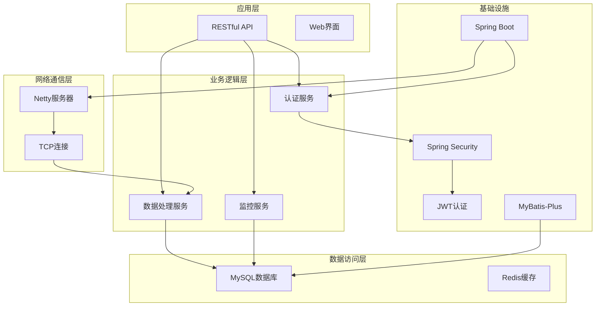
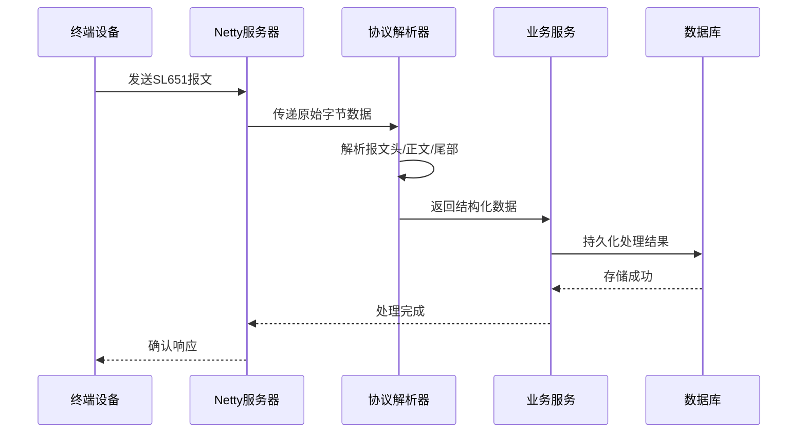
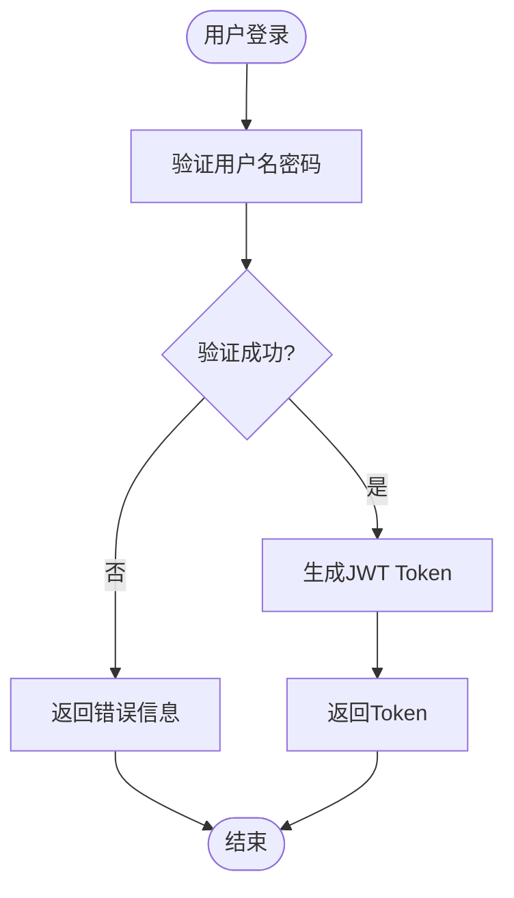
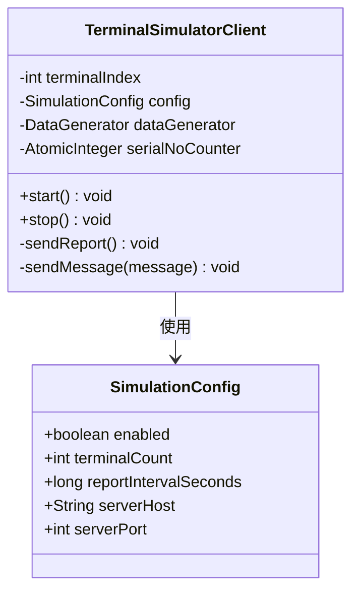
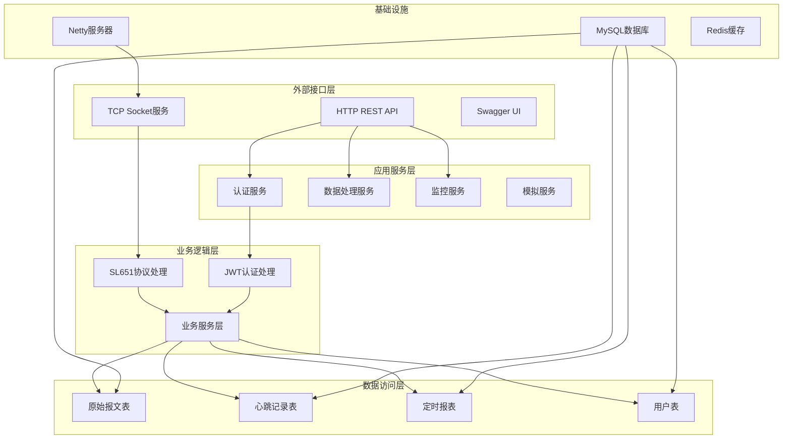
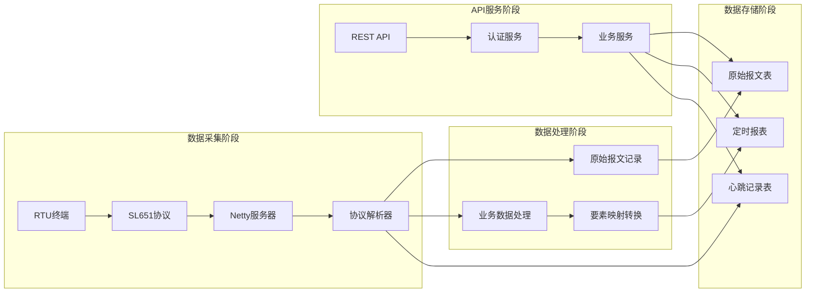

# 项目概述

<cite>
**本文档引用的文件**
- [README.md](file://README.md)
- [pom.xml](file://pom.xml)
- [application.yml](file://src/main/resources/application.yml)
- [HydroMonitorApplication.java](file://src/main/java/com/hydro/monitor/HydroMonitorApplication.java)
- [Sl651ProtocolDecoder.java](file://src/main/java/com/hydro/monitor/netty/Sl651ProtocolDecoder.java)
- [Sl651MessageParser.java](file://src/main/java/com/hydro/monitor/netty/Sl651MessageParser.java)
- [SecurityConfig.java](file://src/main/java/com/hydro/monitor/config/security/SecurityConfig.java)
- [JwtUtil.java](file://src/main/java/com/hydro/monitor/config/security/JwtUtil.java)
- [AuthController.java](file://src/main/java/com/hydro/monitor/modules/controller/AuthController.java)
- [UserServiceImpl.java](file://src/main/java/com/hydro/monitor/modules/service/impl/UserServiceImpl.java)
- [NettyConfig.java](file://src/main/java/com/hydro/monitor/config/NettyConfig.java)
- [SimulationConfig.java](file://src/main/java/com/hydro/monitor/config/SimulationConfig.java)
- [TerminalSimulatorClient.java](file://src/main/java/com/hydro/monitor/simulation/TerminalSimulatorClient.java)
- [RawMessageEntity.java](file://src/main/java/com/hydro/monitor/modules/entity/RawMessageEntity.java)
</cite>

## 目录
1. [项目简介](#项目简介)
2. [技术架构](#技术架构)
3. [核心特性](#核心特性)
4. [系统架构图](#系统架构图)
5. [技术优势](#技术优势)
6. [应用场景](#应用场景)
7. [差异化特点](#差异化特点)
8. [总结](#总结)

## 项目简介

水文监测系统后端是一个基于现代Java技术栈构建的高性能水文监测数据采集与分析平台。该项目专门针对SL 651-2014国家标准协议设计，能够实时接收、解析和处理来自各类水文监测终端的数据报文。

### 项目定位

该系统旨在为水利部门、环境监测机构和相关企业提供一套完整的水文数据采集解决方案，支持多种水文要素的实时监测、历史数据存储和数据分析功能。

### 核心价值

- **标准化协议支持**：完全符合SL 651-2014国家标准
- **高性能数据处理**：基于Netty的异步非阻塞架构
- **安全保障**：集成Spring Security + JWT认证机制
- **可扩展性**：模块化设计，便于功能扩展
- **易维护性**：完善的日志记录和监控机制

## 技术架构

### 技术栈选择

项目采用业界领先的现代化技术栈，确保系统的高性能、稳定性和可维护性：

**图表来源**
- [pom.xml:30-153](file://pom.xml#L30-L153)
- [application.yml:4-86](file://src/main/resources/application.yml#L4-L86)

### 核心依赖关系

| 技术组件 | 版本 | 作用描述 |
|---------|------|----------|
| Java | 17 | 现代化语言特性支持 |
| Spring Boot | 3.5.9 | 应用框架核心 |
| Netty | 4.1.118 | 高性能网络通信 |
| Spring Security 6 | - | 安全认证框架 |
| MyBatis-Plus | 3.5.9 | ORM持久层框架 |
| MySQL | 8.0+ | 关系型数据库 |
| SpringDoc | 2.8.9 | API文档生成 |

**章节来源**
- [pom.xml:21-28](file://pom.xml#L21-L28)
- [pom.xml:30-153](file://pom.xml#L30-L153)

## 核心特性

### 1. SL 651-2014协议处理能力

系统实现了完整的SL 651-2014国家标准协议解析，支持以下功能：

- **心跳报文处理**：实时监测终端在线状态
- **定时报文解析**：处理各类水文要素数据
- **报文完整性校验**：CRC校验和数据验证
- **多要素支持**：包括水位、降雨量、流速、流量等

**图表来源**
- [Sl651ProtocolDecoder.java:54-89](file://src/main/java/com/hydro/monitor/netty/Sl651ProtocolDecoder.java#L54-L89)
- [Sl651MessageParser.java:66-126](file://src/main/java/com/hydro/monitor/netty/Sl651MessageParser.java#L66-L126)

### 2. JWT认证机制

系统采用Spring Security 6 + JWT实现安全的RESTful API访问：

- **无状态认证**：基于Token的无状态会话管理
- **权限控制**：细粒度的接口访问控制
- **安全配置**：CSRF防护和会话管理
- **密码加密**：BCrypt密码哈希算法

**图表来源**
- [AuthController.java:41-66](file://src/main/java/com/hydro/monitor/modules/controller/AuthController.java#L41-L66)
- [SecurityConfig.java:34-52](file://src/main/java/com/hydro/monitor/config/security/SecurityConfig.java#L34-L52)

### 3. 原始报文记录功能

系统具备完整的原始报文记录能力：

- **完整报文保存**：记录原始十六进制数据
- **报文头信息提取**：解析站址、功能码、方向标识
- **异步处理**：避免阻塞Netty主线程
- **查询统计**：支持按条件查询和统计分析

**章节来源**
- [Sl651ProtocolDecoder.java:203-249](file://src/main/java/com/hydro/monitor/netty/Sl651ProtocolDecoder.java#L203-L249)
- [RawMessageEntity.java:15-55](file://src/main/java/com/hydro/monitor/modules/entity/RawMessageEntity.java#L15-L55)

### 4. 终端模拟模块

提供完整的终端模拟功能，支持多终端并发模拟：

- **多终端支持**：可配置16个并发模拟终端
- **定时上报**：支持自定义上报间隔
- **数据生成**：随机生成符合SL 651协议的数据
- **连接管理**：TCP Socket连接池管理

**图表来源**
- [TerminalSimulatorClient.java:25-51](file://src/main/java/com/hydro/monitor/simulation/TerminalSimulatorClient.java#L25-L51)
- [SimulationConfig.java:14-59](file://src/main/java/com/hydro/monitor/config/SimulationConfig.java#L14-L59)

**章节来源**
- [TerminalSimulatorClient.java:119-156](file://src/main/java/com/hydro/monitor/simulation/TerminalSimulatorClient.java#L119-L156)

## 系统架构图

### 整体架构设计

**图表来源**
- [HydroMonitorApplication.java:15-34](file://src/main/java/com/hydro/monitor/HydroMonitorApplication.java#L15-L34)
- [NettyConfig.java:40-70](file://src/main/java/com/hydro/monitor/config/NettyConfig.java#L40-L70)

### 数据流处理流程

**图表来源**
- [Sl651ProtocolDecoder.java:98-182](file://src/main/java/com/hydro/monitor/netty/Sl651ProtocolDecoder.java#L98-L182)
- [Sl651MessageParser.java:196-283](file://src/main/java/com/hydro/monitor/netty/Sl651MessageParser.java#L196-L283)

## 技术优势

### 1. 高性能架构

- **异步非阻塞**：基于Netty的事件驱动架构
- **连接池管理**：高效的TCP连接复用
- **内存优化**：合理的内存分配策略
- **并发处理**：多线程并行处理能力

### 2. 安全可靠

- **认证授权**：完善的用户认证和权限控制
- **数据加密**：敏感数据的加密存储
- **访问控制**：细粒度的接口访问权限
- **审计日志**：完整的操作审计记录

### 3. 易于维护

- **模块化设计**：清晰的功能模块划分
- **配置管理**：集中化的配置管理
- **监控告警**：完善的系统监控机制
- **文档完善**：详细的开发和使用文档

## 应用场景

### 1. 水利监测

- **河流水位监测**：实时监测河流水位变化
- **水库水位管理**：水库水位的长期监测
- **洪水预警系统**：基于水位数据的洪水预警
- **水资源管理**：水资源的合理调配和管理

### 2. 环境监测

- **降雨量监测**：降水量的实时统计和分析
- **水质监测**：水质参数的长期跟踪
- **生态监测**：生态环境变化的监测
- **污染源监控**：工业污染源的实时监控

### 3. 农业应用

- **农田灌溉**：基于气象数据的智能灌溉
- **农业气象**：农业生产环境的监测
- **病虫害预警**：基于环境数据的病虫害预测
- **设施农业**：温室环境的自动化控制

## 差异化特点

### 1. 标准化程度高

- **完全符合国家标准**：严格遵循SL 651-2014协议
- **兼容性强**：支持多种厂商的RTU终端
- **互操作性好**：与其他水文监测系统良好对接

### 2. 技术先进性

- **现代化技术栈**：采用最新的Java 17和Spring Boot 3
- **高性能架构**：基于Netty的高性能网络处理
- **云原生支持**：支持容器化部署和微服务架构

### 3. 功能完整性

- **端到端解决方案**：从数据采集到分析展示的完整链路
- **可视化支持**：提供直观的数据可视化界面
- **报表生成功能**：支持各种格式的统计报表
- **移动端适配**：支持移动设备的访问和操作

### 4. 开发友好性

- **开源免费**：完全开源，无使用限制
- **文档完善**：详细的开发和部署文档
- **社区支持**：活跃的开发者社区
- **二次开发便利**：良好的扩展性和定制性

## 总结

水文监测系统后端项目是一个技术先进、功能完善、易于维护的现代化水文数据采集与分析平台。通过采用最新的技术栈和设计理念，系统不仅满足了SL 651-2014国家标准的要求，还提供了丰富的功能特性和优秀的性能表现。

### 核心价值体现

- **技术领先性**：采用Java 17 + Spring Boot 3 + Netty 4.1的最新技术组合
- **标准合规性**：完全符合SL 651-2014国家标准协议
- **实用价值**：为水利部门和相关企业提供完整的水文监测解决方案
- **开源贡献**：为国内水文监测领域的开源生态做出贡献

### 发展前景

随着国家对水文监测工作的重视和技术的发展，该系统具有广阔的应用前景和发展空间。通过持续的功能完善和技术升级，有望成为国内水文监测领域的重要技术支撑平台。