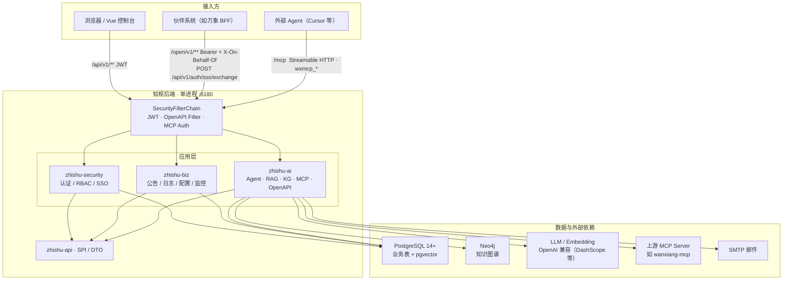
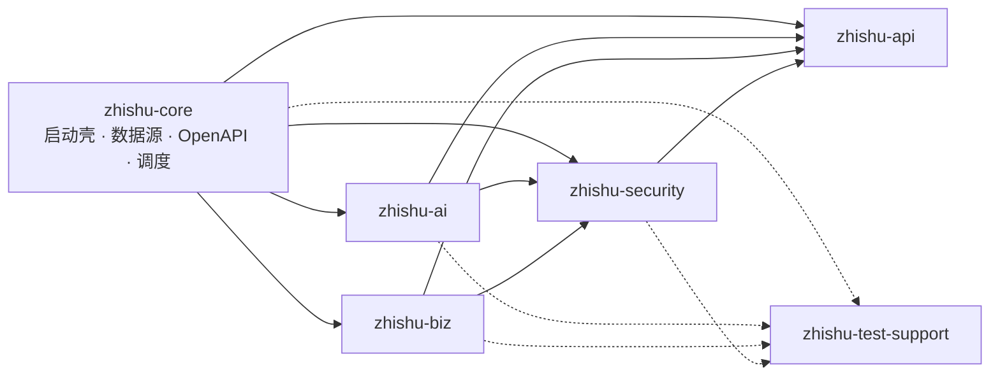
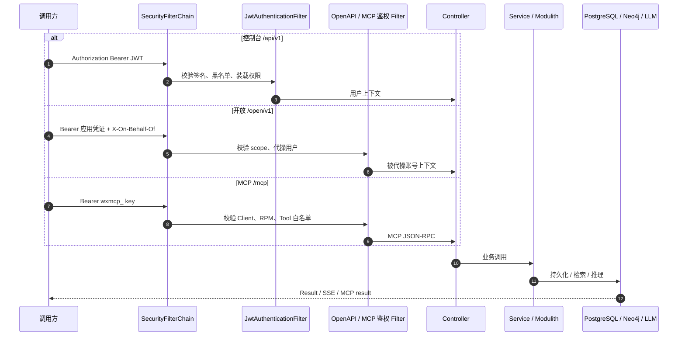
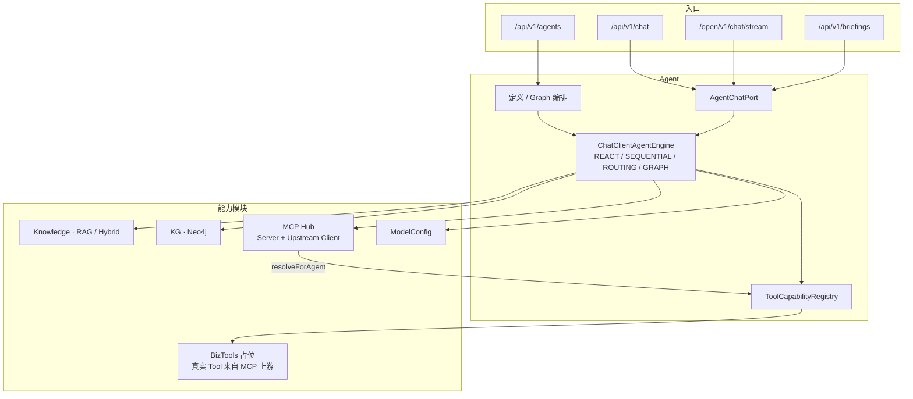
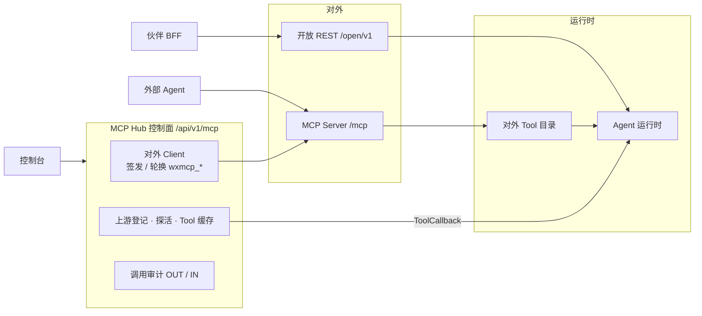
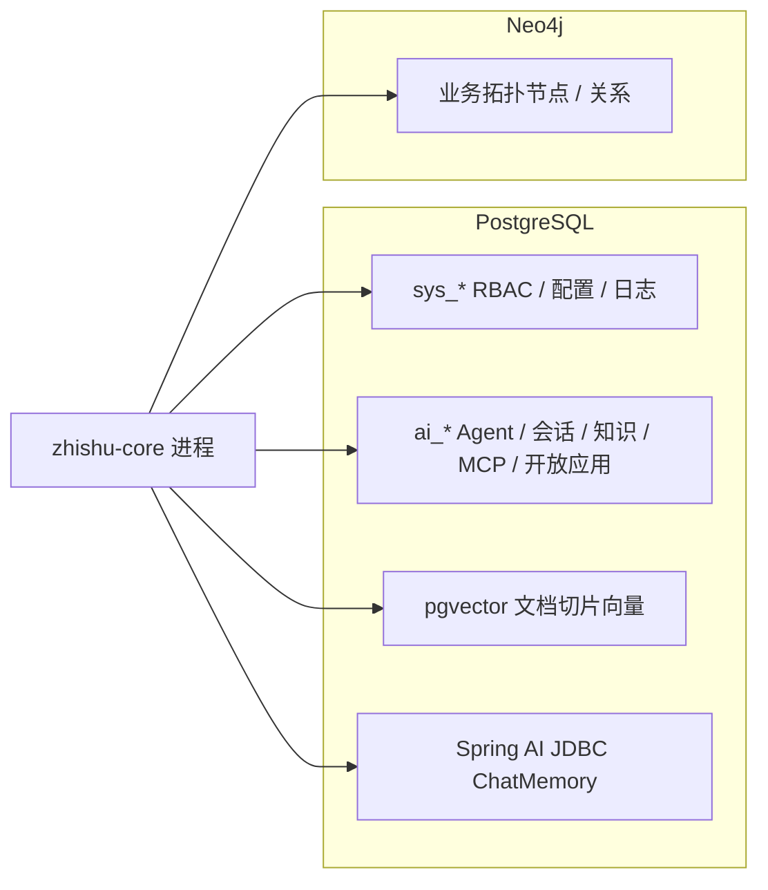

# 知枢可集成框架 · 后端

[Java](https://openjdk.org/projects/jdk/21/)
[Spring Boot](https://spring.io/projects/spring-boot)
[License: MIT](../LICENSE)
[Demo](https://yunqi.datafuturex.cn)

**版本**: v1.0.0　·　简称 **ZSIF**（ZhiShu Integrable Framework）

基于 **Java 21**、**Spring Boot 4**、**Spring Security 7**、**MyBatis-Plus** 与 **Spring Modulith** 的企业数字化应用建设后端，提供统一技术架构、业务组件与完整的 RBAC 权限体系。

**在线演示**：[https://yunqi.datafuturex.cn](https://yunqi.datafuturex.cn)

## 开源源码路径

本项目与前端同属 **zhishu-integrable-framework** 单体仓库（monorepo），托管于 GitHub 与 Gitee，内容同步，任选其一克隆即可。本文档对应仓库内 `**backend/`** 目录（后端源码）。


| 类型     | 地址                                                                                               | 说明               |
| ------ | ------------------------------------------------------------------------------------------------ | ---------------- |
| 在线演示   | [https://yunqi.datafuturex.cn](https://yunqi.datafuturex.cn)                                     | 可直接体验系统功能        |
| GitHub | `git@github.com:DataFutureX/zhishu-integrable-framework.git` | 主仓库，默认 `origin` |


| 路径                                                        | 内容说明                          |
| --------------------------------------------------------- | ----------------------------- |
| `frontend/`                                               | 前端源码（Vue 3）                   |
| `backend/`                                                | 后端源码（本 README 所在目录，Maven 父工程） |
| [`../README.md`](../README.md)（仓库根目录） | 前后端快速开始（演示 / 联调） |
| `backend/zhishu-api/`                                | 跨模块 SPI / DTO，避免循环依赖          |
| `backend/zhishu-security/`                           | 认证鉴权、用户/角色/菜单/单位、JWT、验证码、伙伴 SSO |
| `backend/zhishu-biz/`                                | 公告、操作日志、系统配置、系统监控（Spring Modulith） |
| `backend/zhishu-ai/`                                 | Agent / RAG / 图谱 / MCP Hub / 开放 API / 简报（同进程） |
| `backend/zhishu-core/`                               | 启动壳、配置文件、数据库初始化脚本            |
| `backend/zhishu-core/src/main/resources/db/init.sql` | 系统库初始化（用户/角色/菜单） |
| `backend/zhishu-core/src/main/resources/db/init_ai.sql` | AI 表初始化（pgvector / Agent / MCP / 简报） |
| [`../LICENSE`](../LICENSE)（仓库根目录） | MIT 开源许可证 |
| `backend/README.md`                                       | 本说明文档                         |


## 目录

1. [开源源码路径](#开源源码路径)
2. [特性](#特性)
3. [技术架构](#技术架构)
   - [总览](#总览)
   - [技术栈](#技术栈)
   - [模块依赖](#模块依赖分)
   - [请求处理链路](#请求处理链路分)
   - [AI 内核](#ai-内核分)
   - [开放能力](#开放能力rest-与-mcp-双平面分)
   - [数据与存储](#数据与存储分)
   - [项目结构](#项目结构)
4. [快速开始](#快速开始)
5. [核心功能模块](#核心功能模块)
6. [API 接口概览](#api-接口概览)
7. [数据库设计](#数据库设计)
8. [安全与鉴权](#安全与鉴权)
9. [开发规范与最佳实践](#开发规范与最佳实践)
10. [常见问题与故障排查](#常见问题与故障排查)
11. [配置速查](#配置速查)
12. [参与贡献](#参与贡献)
13. [许可证](#许可证)

## 特性

- **多模块 Maven 工程**：`api` → `security` → `biz` / `ai` → `core`，依赖单向，职责清晰
- **Spring Security 7 + JWT**：无状态鉴权、Token 黑名单、方法级 `@PreAuthorize`
- **登录安全**：滑动验证码 + RSA 凭证加密 + 可配置失败锁定
- **RBAC 权限模型**：用户 → 角色 → 菜单（含 BUTTON 权限码）
- **公告 SSE 推送**：发布后实时推送给在线用户
- **操作日志**：拦截器异步记录，支持按月分表
- **系统监控**：JVM / OS / DB / Web / 业务 / 分表 / 存储综合指标
- **OpenAPI**：SpringDoc Swagger UI（开发环境可用）

## 技术架构

采用 **总分** 呈现：先给出运行时总览，再按 Maven 模块、请求链路、AI 内核、开放面、数据层展开。

### 总览

知枢后端是 **单进程 Spring Boot 应用**（`zhishu-core` 启动，默认 `:8180`）。前端、伙伴系统、外部 MCP Client 分别走三条入口；进程内按 Maven 模块分层，AI 能力以 Spring Modulith 应用模块隔离。



| 入口 | 鉴权 | 典型调用方 | 能力范围 |
| ---- | ---- | ---------- | -------- |
| `/api/v1/**` | 知枢 JWT（控制台登录或 SSO 换票） | 本仓 Vue 前端 | 全量管理与 AI 工作台 |
| `/open/v1/**` | 开放应用凭证 + `X-On-Behalf-Of` | 伙伴后端 BFF | 对话流、知识问答、Agent 目录、图谱写入 |
| `/mcp` | `wxmcp_*` API Key | 外部 MCP Client | 标准 MCP Tool 调用（对外目录由 Hub 配置） |
| `POST /api/v1/auth/sso/exchange` | 伙伴 Ticket（RSA / SM2） | 伙伴门户跳转 | 换发知枢 JWT |

> `zhishu-ai` **不单独占端口**，与 `zhishu-core` 同进程装配。监测类业务 Tool 已迁出，经 MCP Hub 登记上游消费。

### 技术栈


| 技术              | 版本      | 说明                                    |
| --------------- | ------- | ------------------------------------- |
| Java            | 21      | record、text blocks、pattern matching 等 |
| Spring Boot     | 4.1.0   | 核心框架                                  |
| Spring Security | 7.x     | SecurityFilterChain + 方法级鉴权           |
| MyBatis-Plus    | 3.5.17  | `mybatis-plus-spring-boot4-starter`   |
| Spring Modulith | 2.1.0   | biz / AI 领域模块边界                        |
| Spring AI       | 2.0     | ChatClient、Tool Calling、pgvector、MCP   |
| PostgreSQL      | 14+     | 关系库 + pgvector                           |
| Neo4j           | 5.x     | 知识图谱（可选）                              |
| JWT (jjwt)      | 0.12.6  | Token 签发与校验                           |
| SpringDoc       | 3.1.0   | OpenAPI / Swagger UI                  |
| Lombok          | 1.18.38 | 简化样板代码                                |
| Hutool          | 5.8.23  | 工具库                                   |


> 本工程**不包含 Netty / SL651 / IoT 采集**；监测 Tool 由伙伴 MCP 上游提供。AI 栈另含 Spring AI 2.0、pgvector、Neo4j Driver。

### 模块依赖（分）

依赖单向：`core` 组装运行时，业务模块只依赖更底层的契约与安全能力。



| 模块 | 职责 |
| ---- | ---- |
| **zhishu-api** | 跨模块 SPI / DTO（如 `AuthAuditApi`、`LoginSecuritySettingsApi`），切断 security ↔ biz 循环依赖 |
| **zhishu-security** | 认证鉴权、用户/角色/菜单/单位、JWT、滑动验证码、登录 RSA 加密、伙伴 SSO、公共 `Result` |
| **zhishu-biz** | 公告（含 SSE）、操作日志、系统配置、系统监控；Spring Modulith 应用模块 |
| **zhishu-ai** | Agent、Chat、知识库、图谱、MCP Hub、开放 API、内部控制台简报；与 core **同进程** |
| **zhishu-core** | `YqapApplication` 启动壳：数据源、MyBatis-Plus、OpenAPI UI、异步/调度、静态资源、配置 |
| **zhishu-test-support** | 集成测试夹具（不进入运行时类路径） |

### 请求处理链路（分）



匿名放行（其余默认需登录）：`/api/v1/auth/**`、`GET /api/v1/system-config`、`/api/v1/system/health`、`/open/v1/**`、`/mcp/**`、`/uploads/**`；dev 另放行 Swagger。`/open/v1` 与 `/mcp` 在 Security 层 `permitAll`，由专用 Filter 完成真实鉴权。

### AI 内核（分）

`zhishu-ai` 以 Spring Modulith 划分应用模块：跨模块只走 `:: api` Named Interface。对话统一经 `AgentChatPort` 进入运行时。



| 应用模块 | 包 | 说明 |
| -------- | -- | ---- |
| Agent | `ai.agent` | 智能体 CRUD、工作流 Graph、试运行、运行记录 |
| Chat | `ai.chat` | 多轮会话、问答历史、观测；调用 `AgentChatPort` |
| Knowledge | `ai.knowledge` | 文档入库、向量化、Hybrid 检索、文档问答 |
| KnowledgeGraph | `ai.kg` | Neo4j 同步 / 查询 / 可视化；开放写入 `/open/v1/kg` |
| Mcp | `ai.mcp` | 对外 Streamable HTTP Server + 上游 Client + Hub 管理与审计 |
| ModelConfig | `ai.modelconfig` | 运行时模型与密钥（入库加密） |
| Briefing | `ai.briefing` | **仅内部控制台**：调度、站内铃、邮件；不提供开放 API |
| BizTools | `ai.biztools` | 监测 Tool 端口，当前空实现 |
| Platform / Shared | `ai.platform` / `ai.shared` | OPEN 模块：Web 装配与共享类型 |

工作流类型：`REACT` | `SEQUENTIAL` | `ROUTING` | `GRAPH`。内核能力：`RAG`、`MEMORY`、`WORKFLOW_GRAPH`、`MCP_TOOLS`、`KNOWLEDGE_GRAPH`、`BRIEFING`。

### 开放能力：REST 与 MCP 双平面（分）



| 开放 REST | Scope | 说明 |
| --------- | ----- | ---- |
| `POST /open/v1/chat` | `chat` | 同步对话（外部自建简报等后台任务） |
| `POST /open/v1/chat/stream` | `chat` | Agent 流式对话（可带 `agentId`） |
| `POST /open/v1/knowledges/qa/stream` | `knowledges` | 文档 RAG 问答 |
| `GET /open/v1/agents` | `chat` | Agent 目录（外部自建简报时选用） |
| `POST /open/v1/kg/upsert` | `kg` | 图谱节点推送 |

简报生成/投递 **不走开放 API**；外部系统自行调度后调用 `/open/v1/chat`。MCP 上游协议仅允许 Streamable HTTP / SSE，生产禁止 STDIO / COMMAND。

### 数据与存储（分）



初始化脚本：`zhishu-core/src/main/resources/db/init.sql`（系统库）+ `init_ai.sql`（pgvector / Agent / MCP / 简报）。

### 项目结构

```
zhishu-integrable-framework/
├── LICENSE
├── README.md                            # 前后端快速开始
├── frontend/                            # Vue 3 控制台
├── sdk/yunqi-sso-partner-sdk/           # 伙伴 SSO Java SDK（部署在伙伴侧）
└── backend/                             # Maven 父工程
    ├── zhishu-api/                      # SPI / DTO
    ├── zhishu-security/                 # 认证鉴权 / RBAC / SSO
    │   └── src/main/java/cn/datafuturex/zhishu/
    │       ├── captcha/                # 滑动验证码
    │       ├── common/                  # Result, PageResult, GlobalExceptionHandler
    │       ├── config/security/         # SecurityConfig, JwtUtil, JwtAuthenticationFilter
    │       ├── modules/controller/     # Auth, User, Role, Menu, Unit
    │       └── security/sso/           # Ticket 换票 RSA / SM2
    ├── zhishu-biz/
    │   └── .../biz/
    │       ├── announcement/             # 公告 + SSE
    │       ├── operationlog/            # 操作日志 + AuthAuditApi 实现
    │       ├── systemconfig/            # 系统配置 + LoginSecuritySettingsApi 实现
    │       └── systemmonitor/           # 运维监控 + 月分表
    ├── zhishu-ai/
    │   └── .../ai/
    │       ├── agent/ · chat/ · knowledge/ · kg/
    │       ├── mcp/ · modelconfig/ · briefing/ · biztools/
    │       │       ├── openapi/                # /open/v1 控制器与鉴权
    │       ├── platform/ · shared/
    ├── zhishu-core/
    │   └── src/main/
    │       ├── java/.../YqapApplication.java
    │       └── resources/
    │           ├── application.yml · application-{dev|test|prod}.yml
    │           └── db/init.sql · init_ai.sql
    ├── zhishu-test-support/
    ├── pom.xml
    ├── start-dev.bat / start-dev.sh
    └── README.md
```

## 快速开始

> 前后端联调总览见仓库根目录 [README.md](../README.md)。

### 环境要求

- JDK **21+**
- Maven **3.9+**
- PostgreSQL **14+**

### 1. 克隆仓库

```bash
git clone git@github.com:DataFutureX/zhishu-integrable-framework.git
cd zhishu-integrable-framework/backend
```

### 2. 初始化数据库

```bash
psql -U postgres -c "CREATE DATABASE zhishu_integrable_framework WITH ENCODING 'UTF8' TEMPLATE template0;"
psql -U postgres -d zhishu_integrable_framework -f zhishu-core/src/main/resources/db/init.sql
psql -U postgres -d zhishu_integrable_framework -f zhishu-core/src/main/resources/db/init_ai.sql
```

默认库名：`zhishu_integrable_framework`  
默认管理员：**admin / admin123**

> **安全提示**：默认账户仅用于本地开发。上线前务必修改默认密码，并更换 `jwt.secret` 等敏感配置。

### 3. 修改配置

编辑 `zhishu-core/src/main/resources/application-dev.yml`：

```yaml
yunqi:
  datasource:
    host: localhost
    port: 5432
    database: zhishu_integrable_framework
    username: postgres
    password: 你的密码
```

数据源使用自定义前缀 `yunqi.datasource.*`（非 `spring.datasource`）。

### 4. 启动应用

**方式一：启动脚本（推荐）**

```bash
# Windows
start-dev.bat

# Linux / macOS
chmod +x start-dev.sh
./start-dev.sh
```

脚本会执行 `mvn clean` → `compile` → `mvn -pl zhishu-core -am spring-boot:run`。

**方式二：Maven**

```bash
mvn -pl zhishu-core -am spring-boot:run -DskipTests
```

**方式三：打包运行**

```bash
mvn clean package -DskipTests
java -jar zhishu-core/target/zhishu-core-1.0.0.jar
```

### 5. 验证服务

启动成功日志示例：

```
===========================================
云起应用平台启动成功！
DevTools状态: 已启用 - 支持热部署
HTTP端口: 8180
Swagger文档: http://localhost:8180/swagger-ui.html
===========================================
```


| 地址                                                                                       | 说明             |
| ---------------------------------------------------------------------------------------- | -------------- |
| [http://localhost:8180](http://localhost:8180)                                           | HTTP 服务（dev）   |
| [http://localhost:8180/swagger-ui.html](http://localhost:8180/swagger-ui.html)           | API 文档（dev 放行） |
| [http://localhost:8180/api/v1/system/health](http://localhost:8180/api/v1/system/health) | 健康检查（无需登录）     |


### 环境切换


| Profile   | 激活方式                          | 要点                                        |
| --------- | ----------------------------- | ----------------------------------------- |
| `dev`（默认） | —                             | 端口 8080，Swagger 放行，DEBUG 日志               |
| `test`    | `SPRING_PROFILES_ACTIVE=test` | 环境变量可覆盖库连接                                |
| `prod`    | `SPRING_PROFILES_ACTIVE=prod` | 必须设置 `YUNQI_DB_*`、`JWT_SECRET`；关闭 Swagger |


生产示例：

```bash
export SPRING_PROFILES_ACTIVE=prod
export YUNQI_DB_HOST=db.example.com
export YUNQI_DB_USERNAME=yunqi
export YUNQI_DB_PASSWORD=********
export JWT_SECRET=your-long-random-secret
java -jar zhishu-core/target/zhishu-core-1.0.0.jar
```

### 常用命令

```bash
# 编译（跳过测试）
mvn clean compile -DskipTests

# 运行轻量单元测试（MockMvc，不连业务库）
# Windows: test-unit.bat  |  Linux/macOS: ./test-unit.sh
mvn test

# 全量接口真实 HTTP 集成测试（需 PostgreSQL 测试库，见下文）
# Windows: verify-api.bat
mvn -pl zhishu-core -am verify

# 打包
mvn clean package -DskipTests

# 指定环境启动（默认 dev）
mvn -pl zhishu-core -am spring-boot:run -Dspring-boot.run.profiles=prod
```

### API 集成测试（真实 HTTP + 入库 + 清理）

对全部 REST 接口做主路径集成验证：`@SpringBootTest(RANDOM_PORT)` 发真实 HTTP，数据写入 PostgreSQL 测试库，用例结束后按 `apitest_` 前缀/追踪 ID **物理删除**，并生成中文 HTML 报告。

**前置条件**

1. 已创建库 `zhishu_integrable_framework_test`（可用环境变量 `YUNQI_DB_NAME` 覆盖）
2. 对测试库执行 [init.sql](zhishu-core/src/main/resources/db/init.sql)，确保存在管理员 `admin / admin123`
3. 连接参数与 [application-test.yml](zhishu-core/src/main/resources/application-test.yml) 一致，可用 `YUNQI_DB_HOST/PORT/USERNAME/PASSWORD` 覆盖
4. **禁止**对生产库执行本套 IT

**执行与报告**

```bash
cd backend
# Windows：先切 UTF-8 代码页，或直接双击 verify-api.bat
chcp 65001
mvn -pl zhishu-core -am verify
```

报告路径（用浏览器打开，勿用系统默认记事本乱码预览）：

- 构建产物：`backend/zhishu-core/target/api-test-report/index.html`
- 仓库文档目录（每次覆盖最新一份）：[`docs/api-test-report/index.html`](../docs/api-test-report/index.html)

报告标题含**测试时间**；正文含**平台基本信息**（名称/版本/Java/Spring Boot/OS/编码等）、开始/结束时间、耗时、目标接口、输入、输出、测试过程、通过/失败。仅保留最新一份 `index.html`（不生成时间戳归档）。控制台成功提示为英文路径行：`[ApiTestReport] HTML report written to: ...` / `Docs copy written to: ...`。

IT 使用 profile `test` + `api-it`（关闭验证码/RSA/分表，便于稳定登录与清理）。现有 `zhishu-security` / `zhishu-biz` 的 `@WebMvcTest` 仍通过 `mvn test` 运行，不依赖 PostgreSQL。

## 核心功能模块

### 1. 认证与登录安全

登录流程（前端对接顺序）：

1. `GET /api/v1/auth/public-key` — 获取 RSA 公钥与 `keyId`
2. `GET /api/v1/auth/captcha` — 获取滑动验证码
3. `POST /api/v1/auth/captcha/verify` — 校验，获得 `captchaToken`
4. `POST /api/v1/auth/login` — 提交加密后的用户名/密码 + `captchaToken` + `keyId`，返回 JWT
5. 后续请求头：`Authorization: Bearer <token>`（SSE 可用 query `?token=`）
6. `POST /api/v1/auth/logout` — Token 加入黑名单

**登录请求体**（`LoginRequestDTO`）：

```json
{
  "username": "<RSA加密后的用户名>",
  "password": "<RSA加密后的密码>",
  "captchaToken": "<验证码通过令牌>",
  "keyId": "<公钥标识>"
}
```

相关配置（`application.yml`）：

```yaml
yunqi:
  captcha:
    enabled: true
    expire-seconds: 120
    token-expire-seconds: 300
    tolerance: 5
  login-crypto:
    enabled: true
    key-size: 2048
    key-expire-seconds: 300
```

失败锁定策略来自 `sys_config`（通过 `LoginSecuritySettingsApi` 读取），可在系统设置中调整。

### 2. 用户 / 角色 / 菜单 / 单位（RBAC）

- **用户** `sys_user.role` → 角色编码（如 `ADMIN` / `USER`）
- **角色** ↔ **菜单** 经 `sys_role_menu` 关联
- 菜单类型：`DIRECTORY` / `MENU` / `PAGE` / `BUTTON`
- 按钮权限码 = `sys_menu.route_name`（与 `PermissionConstants` 对齐）
- `ADMIN` 角色拥有全部启用的 BUTTON 权限

常用权限常量见 `PermissionConstants`，例如：


| 常量值                                                            | 用途    |
| -------------------------------------------------------------- | ----- |
| `system:user:query` / `add` / `edit` / `remove` / `assignRole` | 用户管理  |
| `system:role:*` / `system:role:assignMenu`                     | 角色与授权 |
| `system:menu:*`                                                | 菜单管理  |
| `system:unit:*`                                                | 单位管理  |
| `system:config:edit`                                           | 系统配置  |
| `system:monitor:query`                                         | 运维监控  |
| `system:operlog:query`                                         | 操作日志  |
| `system:announcement:*`                                        | 公告    |


### 3. 系统配置

- 单例表 `sys_config`（`id=1`）
- `GET /api/v1/system-config` **公开**（登录页展示系统名/图标等）
- `PUT /api/v1/system-config`、`POST /api/v1/system-config/icon` 需 `system:config:edit`
- 图标上传目录：`yunqi.upload.path`（默认 `uploads`），静态映射 `/uploads/**`

### 4. 公告管理 + SSE

- 草稿 → 发布 / 撤回；已读 / 全部已读
- `GET /api/v1/announcements/stream`：`TEXT_EVENT_STREAM`，事件名 `connected` / `announcement`
- 发布时通过 `AnnouncementSseService` 推送给已连接客户端

### 5. 操作日志

- `OperationLogRequestFilter` + `OperationLogInterceptor` 自动采集
- 异步写入线程池 `operationLogExecutor`；敏感字段脱敏（`OperationLogUtils`）
- 登录审计由 `AuthAuditApiImpl` 实现 api 模块 SPI
- 查询：`GET /api/v1/operation-logs/page`（需 `system:operlog:query`）

### 6. 系统监控与月分表

- `GET /api/v1/system/status`：综合状态（应用/JVM/OS/DB/Web/业务/分表/存储）
- `GET /api/v1/system/health`：轻量健康检查（permitAll）
- `MonthlyTableShardingManager`：按策略预建月表（`CREATE TABLE … LIKE`）

分表配置示例：

```yaml
yunqi:
  table-sharding:
    enabled: true
    strategies:
      - name: operation-log
        display-name: 操作日志
        table-prefix: sys_operation_log_
        template-table: sys_operation_log
        months-behind: 6
        months-ahead: 1
        auto-create: true
```

运行时物理表形如 `sys_operation_log_202607`。

## API 接口概览

统一响应：`Result<T>`（`code` / `message` / `data`）；分页：`PageResult<T>`。  
除注明外，均需 `Authorization: Bearer <token>`。完整契约以 Swagger 为准。

### 认证 — `/api/v1/auth`


| 方法   | 路径                | 鉴权  | 说明       |
| ---- | ----------------- | --- | -------- |
| GET  | `/public-key`     | 公开  | RSA 公钥   |
| GET  | `/captcha`        | 公开  | 滑动验证码    |
| POST | `/captcha/verify` | 公开  | 校验验证码    |
| POST | `/login`          | 公开  | 登录       |
| POST | `/logout`         | 登录  | 登出 / 黑名单 |


### 用户 — `/api/v1/users`


| 方法              | 路径                                     | 权限                   |
| --------------- | -------------------------------------- | -------------------- |
| GET/PUT         | `/me`、`/me/password`                   | 登录                   |
| GET             | `/page`、`/{id}`、`/username/{username}` | `system:user:query`  |
| POST/PUT/DELETE | `/`、`/{id}`                            | add / edit / remove  |
| PUT             | `/{id}/status`、`/{id}/password/reset`  | `system:user:edit`   |
| GET/PUT         | `/{id}/role`                           | query 或 `assignRole` |


### 角色 — `/api/v1/roles`


| 方法              | 路径              | 权限                                   |
| --------------- | --------------- | ------------------------------------ |
| GET             | `/page`、`/{id}` | `system:role:query`                  |
| GET             | `/list`         | role:query 或 user:assignRole / query |
| GET/PUT         | `/{id}/menus`   | query 或 `assignMenu`                 |
| POST/PUT/DELETE | `/`、`/{id}`     | add / edit / remove                  |


### 菜单 — `/api/v1/menus`


| 方法              | 路径                                          | 权限                           |
| --------------- | ------------------------------------------- | ---------------------------- |
| GET             | `/tree`                                     | menu:query 或 role:assignMenu |
| GET             | `/current-user`、`/current-user/permissions` | 登录                           |
| GET             | `/role/{roleCode}`、`/{id}`                  | menu:query 等                 |
| POST/PUT/DELETE | `/`、`/{id}`                                 | add / edit / remove          |


### 单位 — `/api/v1/units`


| 方法              | 路径                              | 权限                  |
| --------------- | ------------------------------- | ------------------- |
| GET             | `/page`、`/tree`、`/list`、`/{id}` | `system:unit:query` |
| POST/PUT/DELETE | `/`、`/{id}`                     | add / edit / remove |


### 公告 — `/api/v1/announcements`


| 方法              | 路径                                                            | 权限                            |
| --------------- | ------------------------------------------------------------- | ----------------------------- |
| GET             | `/stream`、`/unread-count`、`/recent`、`/published/page`、`/{id}` | 登录                            |
| GET             | `/page`                                                       | `system:announcement:query`   |
| POST/PUT/DELETE | `/`、`/{id}`                                                   | add / edit / remove           |
| PUT             | `/{id}/publish`、`/{id}/revoke`                                | `system:announcement:publish` |
| PUT             | `/{id}/read`、`/read-all`                                      | 登录                            |


### 操作日志 — `/api/v1/operation-logs`


| 方法  | 路径              | 权限                     |
| --- | --------------- | ---------------------- |
| GET | `/page`、`/{id}` | `system:operlog:query` |


### 系统配置 — `/api/v1/system-config`


| 方法   | 路径      | 权限                   |
| ---- | ------- | -------------------- |
| GET  | `/`     | 公开                   |
| PUT  | `/`     | `system:config:edit` |
| POST | `/icon` | `system:config:edit` |


### 系统监控 — `/api/v1/system`


| 方法  | 路径        | 权限                     |
| --- | --------- | ---------------------- |
| GET | `/status` | `system:monitor:query` |
| GET | `/health` | 公开                     |


## 数据库设计

### 核心表（`init.sql`）


| 表名                      | 说明                                       |
| ----------------------- | ---------------------------------------- |
| `sys_user`              | 用户（BCrypt 密码，`role` 为角色编码）               |
| `sys_role`              | 角色                                       |
| `sys_menu`              | 菜单树（含 BUTTON）                            |
| `sys_role_menu`         | 角色-菜单                                    |
| `sys_unit`              | 单位树                                      |
| `sys_config`            | 系统配置单例（含登录锁定字段）                          |
| `sys_announcement`      | 公告                                       |
| `sys_announcement_read` | 公告已读                                     |
| `sys_operation_log`     | 操作日志模板表；运行时另有 `sys_operation_log_yyyyMM` |


### 主键与逻辑删除

- 主键策略：雪花算法 `IdType.ASSIGN_ID`（配置 `id-type: assign_id`）
- 逻辑删除字段：`deleted`（1 删除 / 0 未删除）；部分表以业务 `status` 管理启停

> 系统表用 `init.sql`，AI 表另执行 `init_ai.sql`（需 `vector` 扩展）。已有库可用 `db/patch_*.sql`。

## 安全与鉴权

### FilterChain 放行路径

见 `SecurityConfig`：

- `/api/v1/auth/**`
- `/api/v1/system-config`（GET 公开；写操作仍需登录 + `@PreAuthorize`）
- `/api/v1/system/health`
- `/uploads/**`
- 当 `yunqi.security.api-docs-permit-all=true` 时：Swagger / OpenAPI 相关路径

其余请求 `authenticated()`，业务接口再叠加方法级权限。

### JWT

```yaml
jwt:
  secret: zhishu-secret-key-for-jwt-token-generation-2024  # prod 必须用环境变量覆盖
  expiration: 86400000  # 24 小时
```

- 过滤器：`JwtAuthenticationFilter`（Bearer 或 query `token`）
- 登出、改密、禁用用户会将 Token 加入黑名单（`TokenBlacklistService`）

### 密码

统一使用 `BCryptPasswordEncoder`。

## 开发规范与最佳实践

### 编码约定


| 约定            | 做法                                                             |
| ------------- | -------------------------------------------------------------- |
| 依赖注入          | `@RequiredArgsConstructor` + `private final`，禁止字段 `@Autowired` |
| 日志            | `@Slf4j`，禁止 `System.out.println`                               |
| DTO / VO      | 优先 `record`                                                    |
| 时间            | 业务代码使用 `java.time`                                             |
| Controller 返回 | 统一 `Result<T>`（SSE 端点除外）                                       |
| URL           | `/api/v1/...`，小写连字符                                            |
| Service       | 接口与 `impl` 分离                                                  |
| SPI           | 接口放 `zhishu-api`，实现放 biz，由 security 调用                    |


### 新增业务模块建议

1. 在 `zhishu-biz` 下新建包，并添加 `package-info.java` + `@ApplicationModule`
2. 按 `controller / dto / vo / entity / mapper / service` 分层
3. 按钮权限写入 `sys_menu`（`menu_type=BUTTON`）并在 `PermissionConstants` 增加常量
4. 需要跨模块回调时，在 api 定义 SPI，biz 提供实现

### 本地调试建议

- 使用 `start-dev.bat` / `start-dev.sh` 启用 DevTools 热部署
- 开发环境已放行 Swagger，可用 [http://localhost:8180/swagger-ui.html](http://localhost:8180/swagger-ui.html) 调试
- 日志文件：`logs/zhishu-backend.log`（相对启动目录）
- 控制台统一 UTF-8（`CONSOLE_LOG_CHARSET=UTF-8`）；Windows 请先 `chcp 65001`，或直接用 `start-dev.bat` / `test-unit.bat` / `verify-api.bat`

## 常见问题与故障排查

### 1. 启动失败：数据库连接被拒

- 确认 PostgreSQL 已启动，且已执行 `init.sql` 与 `init_ai.sql` 初始化 `zhishu_integrable_framework`
- 检查 `application-dev.yml` 中 `yunqi.datasource` 账号密码
- 生产环境确认已导出 `YUNQI_DB_HOST` / `USERNAME` / `PASSWORD`

### 2. 401 Unauthorized

- 是否携带 `Authorization: Bearer <token>`
- Token 是否过期（默认 24h）或已被 logout / 改密 / 禁用拉黑
- 登录流程是否跳过了验证码或 RSA（`yunqi.captcha` / `login-crypto` 开启时不可跳过）

### 3. 403 Forbidden

- 当前角色缺少对应 BUTTON 权限（`hasAuthority('…')`）
- 用管理员 `admin` 验证，或给角色分配相应菜单按钮

### 4. Swagger 无法访问

- 确认 `dev` profile：`yunqi.security.api-docs-permit-all=true`
- `prod` 默认关闭 `springdoc.*.enabled`

### 5. 操作日志查不到近期数据

- 确认月分表已创建（监控页或库中查看 `sys_operation_log_yyyyMM`）
- 检查 `yunqi.table-sharding.enabled` 与策略配置

### 6. 多模块编译找不到类

始终从 `backend/` 目录（Maven 父工程根）构建，并对启动模块加 `-am`：

```bash
mvn -pl zhishu-core -am clean compile -DskipTests
```

## 配置速查


| 配置项                                      | 默认 / 说明                                   |
| ---------------------------------------- | ----------------------------------------- |
| `spring.profiles.active`                 | `dev`（可用环境变量 `SPRING_PROFILES_ACTIVE` 覆盖） |
| `server.port`                            | `8080`                                    |
| `jwt.secret` / `jwt.expiration`          | 见 `application.yml`；prod 必须覆盖 secret      |
| `yunqi.datasource.*`                     | 数据库连接（`application-*.yml`）                |
| `yunqi.captcha.*`                        | 滑动验证码                                     |
| `yunqi.login-crypto.*`                   | 登录 RSA 加密                                 |
| `yunqi.upload.path`                      | `uploads`                                 |
| `yunqi.security.api-docs-permit-all`     | `false`（dev 为 `true`）                     |
| `yunqi.table-sharding.*`                 | 操作日志月分表                                   |
| `spring.servlet.multipart.max-file-size` | `10MB`                                    |
| `springdoc.swagger-ui.path`              | `/swagger-ui.html`                        |
| `logging.file.name`                      | `logs/zhishu-backend.log`            |


主类：`cn.datafuturex.zhishu.YqapApplication`（模块 `zhishu-core`）

## 参与贡献

1. Fork 本仓库并创建特性分支
2. 提交清晰的中文或英文 commit message
3. 发起 Pull Request，说明变更动机与验证方式

问题反馈请通过 Issue 描述复现步骤与环境信息。

## 许可证

本项目基于 [MIT License](../LICENSE) 开源。源码路径见上文 [开源源码路径](#开源源码路径)。