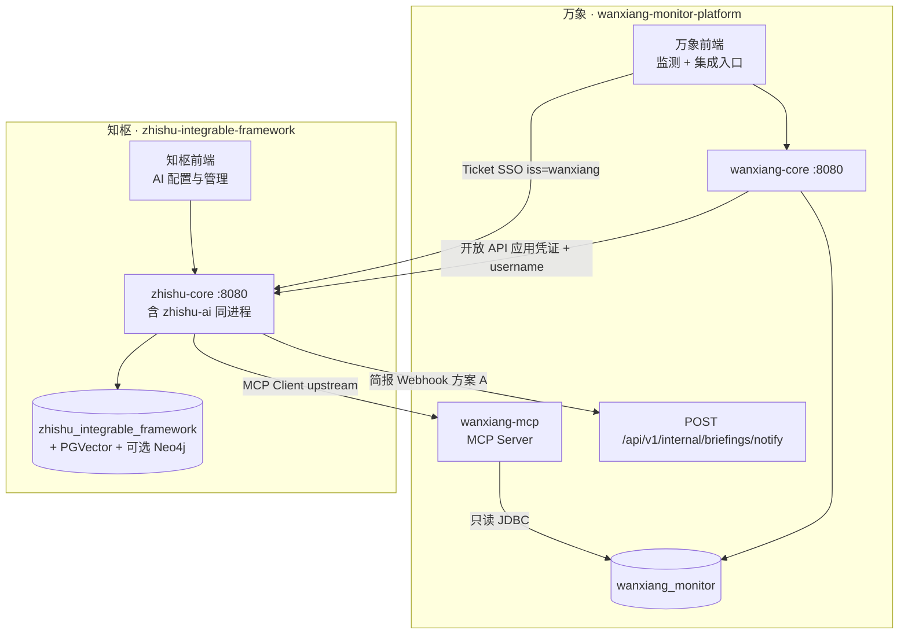

# 知枢拆分最终方案

**状态：** 已定稿（实施指引）  
**日期：** 2026-08-19  
**关联文档：** [知枢产品分层.md](./知枢产品分层.md) · [云起SSO与双边开发平台.md](./云起SSO与双边开发平台.md) · 知枢仓 `zhishu-integrable-framework/docs/万象接入联调实现步骤.md`

本文是 **万象 ↔ 知枢** 拆分的最终工程方案：两工程、两库、模块归属、集成契约与分阶段实施清单。根目录 `ai-assistant` 在完成迁移后 **退役**。

---

## 1. 定稿决策

| 项 | 结论 |
|----|------|
| 工程数量 | **两个 Git 仓库**：`zhishu-integrable-framework`（知枢）、`wanxiang-monitor-platform`（万象） |
| 数据库 | **两个库**：`zhishu_integrable_framework`、`wanxiang_monitor` |
| 知枢 AI 承载 | 知枢 `backend/zhishu-ai` 模块，承接原 `ai-assistant` 全部 AI 能力 |
| 知枢进程 | **`zhishu-ai` + `zhishu-core` 合并同进程**，由 `zhishu-core` 唯一启动，**`:8080` 单端口** |
| 万象 Tool 承载 | 万象 `backend/wanxiang-mcp` 模块，封装原 `biztools` 为 MCP Server |
| 控制台访问 | 万象签发 Ticket → 知枢 SSO 换票 → 知枢业务 JWT |
| 业务集成 | 知枢开放 **问答 + AI 简报** API；万象服务端调用 |
| 简报投递 | **方案 A**：知枢 Webhook → 万象 `POST /api/v1/internal/briefings/notify` |
| 图谱数据 | 引擎在知枢；拓扑内容由万象推送或经 MCP，知枢不扫万象业务表 |

---

## 2. 目标架构



### 2.1 硬边界

| | 知枢 | 万象 |
|--|------|------|
| Git 仓 | `zhishu-integrable-framework` | `wanxiang-monitor-platform` |
| 进程 | **一个**：`zhishu-core`（聚合 `zhishu-ai`）`:8080` | `wanxiang-core` + `wanxiang-mcp` |
| 库 | `zhishu_integrable_framework` | `wanxiang_monitor` |
| Agent / RAG / 图谱引擎 / MCP Hub | 全在 `zhishu-ai` | 无 |
| 监测/巡检/NL2SQL Tool | 无直查业务表 | 全在 `wanxiang-mcp` |
| 用户/RBAC（控制台） | 知枢 `sys_user` + 本地 RBAC | 万象自有；Ticket 仅用于进知枢 |
| 工程 ACL | 无 | 仅在 `wanxiang-mcp` Tool 内过滤 |

原则：**知枢不认识 `t_terminal`；万象不实现 Agent。**

---

## 3. 知枢工程结构（同仓同进程）

```text
zhishu-integrable-framework/
├── backend/
│   ├── zhishu-api              # SPI / DTO
│   ├── zhishu-security         # SSO 换票 + JWT + RBAC
│   ├── zhishu-biz              # 公告、日志、系统配置等
│   ├── zhishu-ai               # 【新增】Agent / RAG / KG / MCP Hub / 开放 API / 简报
│   └── zhishu-core             # 【唯一启动】依赖 security + biz + ai，:8080
├── frontend/                   # 含迁入的 AI 管理页（原万象 views/ai/*）
└── sdk/yunqi-sso-partner-sdk/
```

### 3.1 Maven 与启动

- `zhishu-ai`：**jar 模块**，非独立 Boot。
- `zhishu-core`：`pom.xml` 增加 `dependency` → `zhishu-ai`；`@SpringBootApplication` 扫描 `cn.datafuturex.zhishu` 及迁入的 AI 包。
- **不再** 单独启动 `:8180`；前端代理 **仅** `/api` → `:8080`（废除 `/ai-api` → 8180）。

### 3.2 HTTP 路径规划

| 能力 | 路径前缀 | 鉴权 |
|------|----------|------|
| 控制台 / RBAC / SSO | `/api/v1/**`（现有） | 知枢业务 JWT |
| AI 管理与运行时 | `/api/v1/agents/**`、`/knowledges/**`、`/chat/**`、`/mcp/**`、`/kg/**`、`/briefings/**` | 知枢业务 JWT |
| 开放 API（万象集成） | `/open/v1/chat/**`、`/open/v1/knowledges/**`、`/open/v1/briefings/**` | 应用凭证 + on-behalf-of |

### 3.3 知枢库表（仅 `zhishu_integrable_framework`）

从现 `ai-assistant` 迁入，**不含**万象业务表：

| 类别 | 表（示例） |
|------|------------|
| Agent | `ai_agent`、`ai_agent_run`、Graph 相关 |
| 知识库 | `knowledges_category`、`knowledges`、`vector_store` |
| 会话 | `qa_history`、Spring AI chat memory 表 |
| 配置 | `ai_model_config` |
| MCP | `ai_mcp_*`、`ai_agent_mcp_upstream` |
| 简报 | `ai_briefing_schedule`、`ai_briefing_delivery` |
| 图谱 | `ai_kg_sync_watermark`（若用 Neo4j） |
| 开放 API | `open_app`、`open_app_credential`（新建） |

---

## 4. 万象工程结构

```text
wanxiang-monitor-platform/
├── backend/
│   ├── wanxiang-api
│   ├── wanxiang-security         # 本地 JWT + Ticket 签发（SDK）
│   ├── wanxiang-biz / iot / ...
│   ├── wanxiang-core             # :8080 业务
│   └── wanxiang-mcp              # 【新增】MCP Server，只读 wanxiang_monitor
├── frontend/                     # 监测业务 + 「进入知枢」+ 嵌入问答/简报（调开放 API）
└── ai-assistant/                 # 【迁移完成后删除】
```

### 4.1 `wanxiang-mcp` 职责

- 从原 `ai-assistant/biztools` 迁入：`MonitoringBizTools`、`InspectionBizTools`、`StationDataTools`、`Nl2SqlBizTools` 等。
- 暴露 Spring AI **Streamable HTTP MCP Server**（路径与端口在实现时固定，供知枢 upstream 登记）。
- 鉴权：知枢 upstream 凭证 + **on-behalf-of username**；Tool 内按 `sys_user_project` 等做工程 ACL。
- **禁止** 知枢进程 JDBC 连接 `wanxiang_monitor`。

### 4.2 迁出的 Tool 清单（与现 `McpOutboundCatalog` 对齐）

- 遥测：`queryStationLatestElements`、`queryStationHistoryElements`、`compareStations`
- 监测在线/工程/告警：`getTerminalOnlineOverview`、`queryTerminalOnlineStatus`、`listTerminals`、`listProjects`、`queryRecentAlerts`、`queryAlertTrends`
- 巡检：计划/任务/异常/摘要相关 Tool
- NL2SQL：`describeBizSchema`、`executeReadonlySql`
- 图谱只读 Tool（过渡期可选）：长期改为万象推送 + 知枢引擎

---

## 5. `ai-assistant` 模块归属

| 原模块 | 去向 |
|--------|------|
| `agent` / `chat` / `knowledge` / `modelconfig` | 知枢 `zhishu-ai` |
| `mcp`（Hub、上游登记、Client） | 知枢 `zhishu-ai` |
| `kg` 查询 / 可视化 / GraphRAG 骨架 | 知枢 `zhishu-ai` |
| `kg.sync`（扫万象表） | **删除或改为接收万象推送** |
| `briefing` 调度与生成 | 知枢 `zhishu-ai` |
| `biztools` 全部 | 万象 `wanxiang-mcp` |
| `platform.auth` introspect 万象 | **删除** |
| `shared` | 按边界拆到两侧 DTO |

### 5.1 `AgentCapability` 收口（知枢）

**保留（内核）：** `RAG`、`MEMORY`、`WORKFLOW_GRAPH`、`MCP_TOOLS`（动态上游）、`KNOWLEDGE_GRAPH`（引擎）、`BRIEFING`

**移除（改由 `wanxiang-mcp` upstream 提供）：** `STATION_*`、`ONLINE`、`PROJECT`、`ALERT`、`INSPECTION_*`、`NL2SQL`

---

## 6. 集成契约

### 6.1 控制台：单点登录

| 项 | 值 |
|----|-----|
| 协议 | 伙伴 Ticket 换票（非 OIDC） |
| 万象 `iss` | `wanxiang` |
| 知枢 `aud` | `zhishu-integrable-framework` |
| 映射 | `ticket.username`（无则 `sub`）= 知枢 `sys_user.username` |
| 开通 | 知枢预开通账号；**一期无 JIT** |
| 跳转 | `{ZHISHU_WEB}/sso/callback?ticket=...&redirect=/...` |

详见知枢仓：`docs/单点登录对接说明.md`、`docs/万象接入联调实现步骤.md`。

### 6.2 运行时：知枢开放 API（万象服务端调用）

| 能力 | 建议路径 | 用途 |
|------|----------|------|
| 知识/文档问答（流式） | `POST /open/v1/knowledges/qa/stream` | 工作台知识检索 |
| Agent 对话（流式） | `POST /open/v1/chat/stream` | 嵌入研判 |
| AI 简报 · 立即生成 | `POST /open/v1/briefings/generate` | 手动触发 |
| AI 简报 · 投递查询 | `GET /open/v1/briefings/deliveries` | 历史/对账 |

**请求头示例：**

```http
Authorization: Bearer <知枢开放应用 token>
X-On-Behalf-Of: zhangsan
Content-Type: application/json
```

- 浏览器 **不** 携带万象 JWT 直连知枢开放 API。
- 应用凭证由万象服务端保管，经 BFF 代理转发。

### 6.3 MCP：知枢 Agent → 万象数据

1. 万象启动 `wanxiang-mcp`，暴露 MCP 端点。
2. 知枢 MCP Hub 登记 upstream：`code=wanxiang-monitor`。
3. Agent 绑定该 upstream；运行时 Tool Calling 打到万象。
4. 知枢删除内嵌 `biztools` 与硬编码 `McpOutboundCatalog` 监测目录。

### 6.4 简报投递：方案 A（Webhook）

**流向：**

```
知枢 zhishu-ai
  ├─ 调度 / 立即生成 → Agent 产出 Markdown
  ├─ 写入知枢 ai_briefing_delivery
  └─ POST → 万象 /api/v1/internal/briefings/notify
              ├─ 站内铃 / SSE
              └─ 可选 SMTP（读万象 sys_config）
```

**万象侧（待实现）：**

| 项 | 约定 |
|----|------|
| 路径 | `POST /api/v1/internal/briefings/notify` |
| 安全 | IP 白名单 + 共享 HMAC / 内部 API Key（对齐现有 internal 接口） |
| 幂等 | 知枢 `deliveryId` 去重 |
| 职责 | 推站内铃、可选发邮件；**不** 反向写知枢库 |

**知枢 → 万象 请求体（建议）：**

```json
{
  "deliveryId": "知枢投递主键",
  "scheduleId": "可选",
  "username": "与万象/知枢对齐的登录名",
  "title": "简报标题",
  "contentMarkdown": "...",
  "generatedAt": "2026-08-19T10:00:00+08:00",
  "channel": "WEBHOOK"
}
```

**失败策略：**

- 5xx / 超时：知枢标记失败或待重试，有限次重试。
- 4xx（用户不存在）：记失败，不无限重试。
- 知枢控制台可查本库投递；万象工作台以本地铃/列表为准。

**与开放 API 分工：**

| 动作 | 调用方 |
|------|--------|
| 用户点「立即生成」 | 万象 → 知枢 `POST /open/v1/briefings/generate` |
| 生成完成推送到人 | 知枢 → 万象 Webhook |
| 查历史 | 万象 → 知枢 `GET /open/v1/briefings/deliveries` 或本地铃数据 |

---

## 7. 前端归属

| 页面 | 归属 |
|------|------|
| `views/ai/*` 管理类（Agent、知识库、MCP Hub、模型、图谱配置） | **知枢 frontend** |
| 万象工作台嵌入「对话 / 简报 / 知识问一句」 | **万象 frontend**，调 **开放 API** |
| 「进入知枢」按钮 | **万象 frontend**，Ticket SSO |

万象菜单逐步移除 `ai:agent:*` 等 AI 管理权限，只保留入口与集成页。

---

## 8. 分阶段实施

### 阶段 0 · 脚手架（约 3～5 天）

| # | 知枢 | 万象 |
|---|------|------|
| 0.1 | 新建 `backend/zhishu-ai` jar 模块；`zhishu-core` 依赖并扫包 | 新建 `backend/wanxiang-mcp` |
| 0.2 | AI 表 SQL 写入 `zhishu-core/.../db/` | MCP 仅配 `wanxiang_monitor` 数据源 |
| 0.3 | 确认单进程 `:8080`，无独立 8180 启动类规划 | — |

**验收：** 两模块 `mvn compile`；知枢库可 init AI 表。

### 阶段 1 · SSO（约 3～5 天，可与 0 并行）

| # | 万象 | 知枢 |
|---|------|------|
| 1.1 | 接入 `yunqi-sso-partner-sdk`；「进入知枢」签发 Ticket | 确认 `aud`、公钥、换票 |
| 1.2 | 用户名与知枢 `sys_user` 对齐清单 | 预留 AI 菜单路由 |

**验收：** 万象已登录用户一键进入知枢控制台。

### 阶段 2 · 迁 AI 到 `zhishu-ai`（约 1.5～2 周）

按顺序：`modelconfig` → `knowledge` → `chat` → `agent` → `mcp` hub → `kg` → `briefing`；  
鉴权挂知枢 Security，**删除 introspect 依赖**；前端 AI 页迁入知枢 `frontend`。

**验收：** 仅知枢工程可完成：登录 → 上传文档 → RAG → Agent 对话（无监测 Tool）。

### 阶段 3 · `wanxiang-mcp` + upstream（约 1.5～2 周）

| # | 万象 | 知枢 |
|---|------|------|
| 3.1 | 迁入 biztools，发布 MCP Server | 登记 `wanxiang-monitor` upstream |
| 3.2 | MCP 鉴权 + on-behalf-of | Agent 改绑 upstream；删业务 `AgentCapability` |
| 3.3 | — | 删除内嵌 `biztools` |

**验收：** 关 MCP 则监测 Agent 不可用；开 MCP 则 Tool 回万象且 ACL 生效。

### 阶段 4 · 开放 API + 简报 Webhook（约 1 周）

| # | 知枢 | 万象 |
|---|------|------|
| 4.1 | `/open/v1/**` + 应用凭证表 | 注册开放应用 |
| 4.2 | 简报成功后 POST Webhook | 实现 `/internal/briefings/notify` |
| 4.3 | 去掉 briefing 对万象库 / `sys_user` / `sys_config` 的 JDBC | 工作台改调开放 API |

**验收：** 万象用户不登录知枢也能在工作台问答/收简报；配置仍 SSO 进知枢。

### 阶段 5 · 两库分离 + 退役 `ai-assistant`（约 1 周）

| # | 动作 |
|---|------|
| 5.1 | 知枢数据源 **仅** `zhishu_integrable_framework` |
| 5.2 | 图谱：万象推送 upsert；删除 `KgSourceReader` 扫万象表 |
| 5.3 | 删除万象根目录 `ai-assistant`、前端 `/ai-api` 代理 |
| 5.4 | 更新三仓文档与联调清单 |

**验收：** 知枢无万象 JDBC；万象无 AI 独立进程；全链路 E2E 通过。

---

## 9. 合并进程注意事项

1. **包扫描**：`zhishu-core` 启动类覆盖 `cn.datafuturex.zhishu` 与迁入 AI 包（过渡期可暂留 `com.datafuturex.assistant`）。
2. **Spring Modulith**：`zhishu-ai` 经 `zhishu-api` / security 暴露 Port，避免与 biz 环依赖。
3. **连接池**：同进程单主库；禁止配置万象业务库（MCP 化后）。
4. **迁移 profile**：若短期只读万象库，用 `wanxiang.readonly.enabled=false` 默认关闭，阶段 5 删除。

---

## 10. 退役清单（万象仓）

| 对象 | 动作 |
|------|------|
| 根目录 `ai-assistant/` | 删除（能力已迁知枢 + wanxiang-mcp） |
| `frontend` `/ai-api` → 8180 | 删除；AI 管理页迁知枢 |
| `PlatformAuthClient` / introspect 调用链 | 删除 |
| 万象 `sys_menu` 中 AI 管理菜单 | 迁知枢或只留入口 |
| `InternalAuthController` introspect | 可保留给其它内部用途，**不再** 供知枢 AI 使用 |

---

## 11. 验收总表

| 场景 | 预期 |
|------|------|
| 万象 → 知枢控制台 | Ticket SSO，无二次密码 |
| 知枢配 Agent / 知识库 | 仅知枢库，无万象 JDBC |
| 万象工作台问答 | 调 `/open/v1/**`，应用凭证 + username |
| Agent 查监测数据 | 知枢 MCP → `wanxiang-mcp`，工程 ACL 在万象 |
| AI 简报定时/立即 | 知枢生成 → Webhook → 万象站内铃/邮件 |
| 关万象 MCP | RAG/对话仍可用；监测 Tool 不可用 |
| 仅启知枢 + 万象 MCP | 无 `ai-assistant` 进程仍可跑通核心链路 |

---

## 12. 修订记录

| 版本 | 日期 | 说明 |
|------|------|------|
| 1.1 | 2026-08-19 | 阶段 5：退役 ai-assistant；图谱改为万象推送；联调清单 |
| 1.0 | 2026-08-19 | 定稿：两工程两库；zhishu-ai 与 core 同进程同仓；wanxiang-mcp；SSO + 开放 API；简报 Webhook 方案 A |
