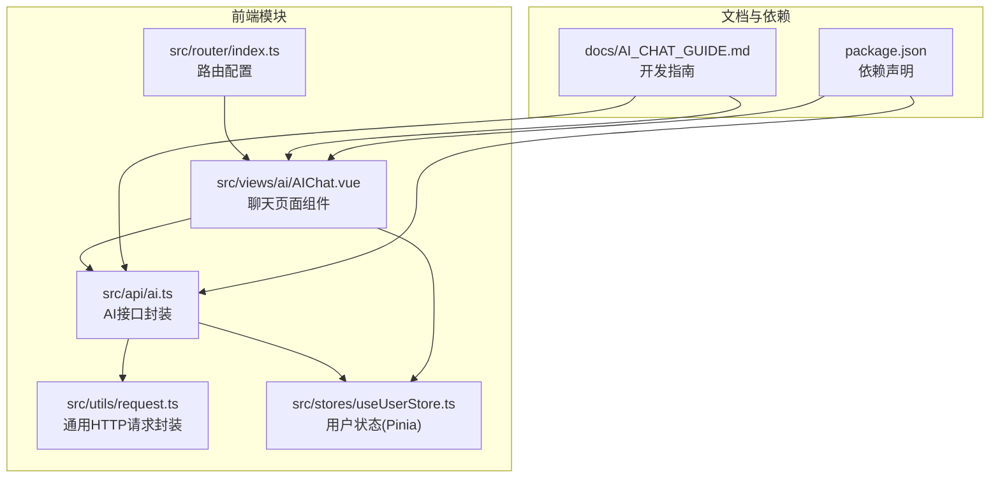
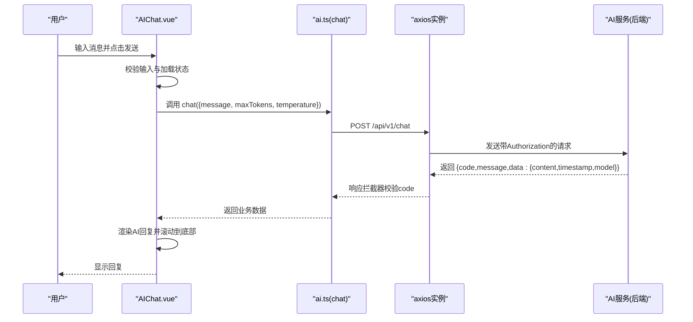
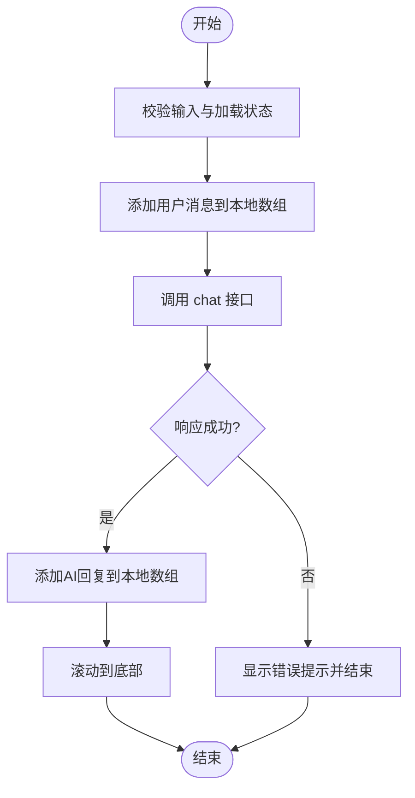
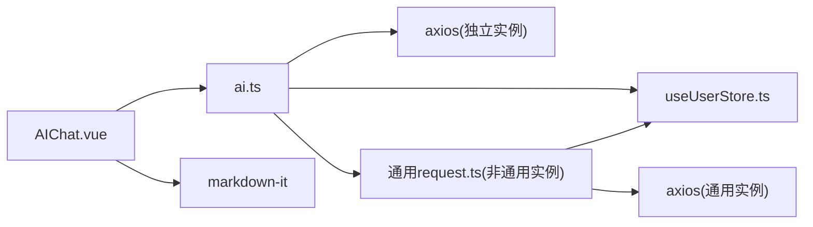

# AI智能助手API

<cite>
**本文引用的文件**
- [src/api/ai.ts](file://src/api/ai.ts)
- [src/views/ai/AIChat.vue](file://src/views/ai/AIChat.vue)
- [src/utils/request.ts](file://src/utils/request.ts)
- [src/stores/useUserStore.ts](file://src/stores/useUserStore.ts)
- [src/router/index.ts](file://src/router/index.ts)
- [docs/AI_CHAT_GUIDE.md](file://docs/AI_CHAT_GUIDE.md)
- [package.json](file://package.json)
</cite>

## 目录
1. [简介](#简介)
2. [项目结构](#项目结构)
3. [核心组件](#核心组件)
4. [架构总览](#架构总览)
5. [详细组件分析](#详细组件分析)
6. [依赖关系分析](#依赖关系分析)
7. [性能考虑](#性能考虑)
8. [故障排查指南](#故障排查指南)
9. [结论](#结论)
10. [附录](#附录)

## 简介
本文件为水文监测系统的AI智能助手模块提供完整的API文档与集成指南。重点覆盖：
- RESTful接口规范：聊天消息发送、健康检查、诊断接口
- WebSocket实时通信现状与替代方案
- 消息实体模型、参数配置、响应格式与状态码
- 聊天流程示例、消息格式规范与错误处理
- 与后端AI服务的集成方式、消息队列与实时通信机制
- 前端集成指南与用户体验优化建议

说明：当前前端实现采用RESTful HTTP调用，未发现WebSocket或消息队列相关代码；如需实时流式输出，建议后端提供WebSocket或Server-Sent Events（SSE）接口。

## 项目结构
AI智能助手模块位于前端工程中，核心文件包括API封装、聊天视图组件、路由配置与用户状态管理。

**图表来源**
- [src/api/ai.ts:1-113](file://src/api/ai.ts#L1-L113)
- [src/views/ai/AIChat.vue:1-519](file://src/views/ai/AIChat.vue#L1-L519)
- [src/utils/request.ts:1-180](file://src/utils/request.ts#L1-L180)
- [src/stores/useUserStore.ts:1-200](file://src/stores/useUserStore.ts#L1-L200)
- [src/router/index.ts:1-136](file://src/router/index.ts#L1-L136)
- [docs/AI_CHAT_GUIDE.md:1-405](file://docs/AI_CHAT_GUIDE.md#L1-L405)
- [package.json:1-48](file://package.json#L1-L48)

**章节来源**
- [src/api/ai.ts:1-113](file://src/api/ai.ts#L1-L113)
- [src/views/ai/AIChat.vue:1-519](file://src/views/ai/AIChat.vue#L1-L519)
- [src/router/index.ts:27-41](file://src/router/index.ts#L27-L41)

## 核心组件
- AI接口封装：提供RESTful接口调用、请求/响应拦截器、认证头注入、统一错误提示。
- 聊天视图组件：负责UI交互、消息渲染（Markdown）、滚动定位、加载态与健康检查。
- 通用HTTP封装：统一响应数据结构、大整数安全处理、全局错误提示与登录态处理。
- 用户状态管理：Token持久化、用户信息缓存、登录/登出逻辑。
- 路由配置：AI助手菜单与页面路由，权限守卫。

**章节来源**
- [src/api/ai.ts:8-77](file://src/api/ai.ts#L8-L77)
- [src/views/ai/AIChat.vue:92-229](file://src/views/ai/AIChat.vue#L92-L229)
- [src/utils/request.ts:52-151](file://src/utils/request.ts#L52-L151)
- [src/stores/useUserStore.ts:18-199](file://src/stores/useUserStore.ts#L18-L199)
- [src/router/index.ts:27-41](file://src/router/index.ts#L27-L41)

## 架构总览
前端通过独立的AI服务实例发起HTTP请求，携带认证信息，后端AI服务返回标准化业务数据。聊天组件负责消息渲染与交互体验。

**图表来源**
- [src/views/ai/AIChat.vue:164-202](file://src/views/ai/AIChat.vue#L164-L202)
- [src/api/ai.ts:96-98](file://src/api/ai.ts#L96-L98)
- [src/api/ai.ts:32-45](file://src/api/ai.ts#L32-L45)

## 详细组件分析

### RESTful接口规范

- 基础URL与环境变量
  - 开发环境：/ai-api/api/v1
  - 生产环境：VITE_AI_API_BASE_URL + /api/v1
  - 超时：30秒
  - Content-Type：application/json;charset=UTF-8

- 认证与拦截器
  - 请求拦截：从localStorage读取token并附加Authorization头
  - 响应拦截：根据业务code判断成功/失败，统一错误提示；401时触发登出

- 接口定义
  - 发送聊天消息
    - 方法：POST
    - 路径：/api/v1/chat
    - 请求体：ChatRequestDTO
    - 响应体：ChatResponseVO
  - 健康检查
    - 方法：GET
    - 路径：/api/v1/chat/health
    - 响应：字符串状态
  - 诊断服务
    - 方法：GET
    - 路径：/api/v1/chat/diagnose
    - 响应：字符串诊断信息

- 数据模型
  - ChatRequestDTO
    - message: string（必填）
    - maxTokens?: number（可选，默认2000）
    - temperature?: number（可选，默认0.7）
  - ChatResponseVO
    - content: string（AI回复内容）
    - timestamp: string（ISO时间戳字符串）
    - model: string（使用的模型名称）

- 状态码
  - 成功：200
  - 参数错误：400
  - 未授权：401
  - 拒绝访问：403
  - 地址不存在：404
  - 服务器错误：500
  - 其他：网络连接异常或具体状态码

**章节来源**
- [src/api/ai.ts:9-15](file://src/api/ai.ts#L9-L15)
- [src/api/ai.ts:18-30](file://src/api/ai.ts#L18-L30)
- [src/api/ai.ts:32-77](file://src/api/ai.ts#L32-L77)
- [src/api/ai.ts:80-90](file://src/api/ai.ts#L80-L90)
- [src/api/ai.ts:96-112](file://src/api/ai.ts#L96-L112)
- [docs/AI_CHAT_GUIDE.md:77-93](file://docs/AI_CHAT_GUIDE.md#L77-L93)
- [docs/AI_CHAT_GUIDE.md:108-130](file://docs/AI_CHAT_GUIDE.md#L108-L130)

### 聊天流程与消息机制

- 消息实体模型
  - 前端消息数组元素：{ role: 'user' | 'assistant', content: string, timestamp: Date }
  - 后端响应：ChatResponseVO（含时间戳字符串，前端转换为Date）

- 会话管理
  - 当前实现：无显式会话ID；消息历史保存在组件本地数组中
  - 上下文保持：后端AI服务根据当前请求上下文进行理解与回复
  - 历史查询：前端未提供历史查询接口；可在后端新增历史接口后扩展

- 发送接收机制
  - 用户输入校验与禁用重复提交
  - 添加用户消息到本地数组
  - 调用chat接口，等待响应
  - 添加AI回复到本地数组并滚动到底部
  - 错误处理：统一ElMessage提示

- Markdown渲染
  - 使用markdown-it解析AI回复内容
  - 支持HTML、链接识别、排版优化、换行
  - 用户消息保持纯文本

**图表来源**
- [src/views/ai/AIChat.vue:164-202](file://src/views/ai/AIChat.vue#L164-L202)
- [src/views/ai/AIChat.vue:131-147](file://src/views/ai/AIChat.vue#L131-L147)

**章节来源**
- [src/views/ai/AIChat.vue:100-104](file://src/views/ai/AIChat.vue#L100-L104)
- [src/views/ai/AIChat.vue:164-202](file://src/views/ai/AIChat.vue#L164-L202)
- [src/views/ai/AIChat.vue:131-147](file://src/views/ai/AIChat.vue#L131-L147)

### 健康检查与诊断

- 健康检查
  - GET /api/v1/chat/health
  - 用途：检测AI服务可用性
  - 前端：点击“健康检查”按钮触发，成功/失败分别提示

- 诊断服务
  - GET /api/v1/chat/diagnose
  - 用途：获取后端诊断信息（如模型版本、服务状态等）

**章节来源**
- [src/api/ai.ts:103-112](file://src/api/ai.ts#L103-L112)
- [src/views/ai/AIChat.vue:210-219](file://src/views/ai/AIChat.vue#L210-L219)

### 前端集成指南

- 环境变量
  - VITE_AI_API_BASE_URL：生产环境AI服务地址
  - 开发环境：/ai-api/api/v1（由前端代理转发）

- 依赖安装
  - markdown-it：Markdown解析渲染
  - @types/markdown-it：类型支持

- 页面访问
  - 登录后在左侧菜单选择“AI助手 > 智能问答”

- 快捷键
  - Ctrl + Enter 发送消息

- 用户体验优化建议
  - 限制单次回复长度，避免超长Markdown导致渲染延迟
  - 对代码块、表格等复杂内容进行懒加载或分段展示
  - 提供“清空对话”按钮，便于重新开始
  - 增加“发送中”指示器与防抖，提升交互流畅度

**章节来源**
- [docs/AI_CHAT_GUIDE.md:25-52](file://docs/AI_CHAT_GUIDE.md#L25-L52)
- [docs/AI_CHAT_GUIDE.md:179-245](file://docs/AI_CHAT_GUIDE.md#L179-L245)
- [package.json:14-26](file://package.json#L14-L26)
- [src/router/index.ts:27-41](file://src/router/index.ts#L27-L41)

## 依赖关系分析

**图表来源**
- [src/views/ai/AIChat.vue:97-98](file://src/views/ai/AIChat.vue#L97-L98)
- [src/api/ai.ts:1-2](file://src/api/ai.ts#L1-L2)
- [src/stores/useUserStore.ts:1-4](file://src/stores/useUserStore.ts#L1-L4)
- [src/utils/request.ts:1-3](file://src/utils/request.ts#L1-L3)

**章节来源**
- [src/api/ai.ts:1-2](file://src/api/ai.ts#L1-L2)
- [src/views/ai/AIChat.vue:97-98](file://src/views/ai/AIChat.vue#L97-L98)
- [src/utils/request.ts:1-3](file://src/utils/request.ts#L1-L3)

## 性能考虑
- 渲染性能
  - 短文本即时渲染
  - 中等文本（1-10KB）< 100ms
  - 长文本（>10KB）可能略有延迟
  - 建议分段传输或限制单次回复长度
- 优化建议
  - 懒加载图片（若AI返回图片URL）
  - 缓存渲染结果（相同消息可复用）
  - 减少一次性插入大量DOM节点

**章节来源**
- [docs/AI_CHAT_GUIDE.md:348-362](file://docs/AI_CHAT_GUIDE.md#L348-L362)

## 故障排查指南
- 发送消息失败
  - 可能原因：后端服务未启动、网络异常、API地址配置错误
  - 解决方案：检查后端服务运行状态、点击“健康检查”、查看控制台错误
- 响应超时
  - 可能原因：网络延迟、AI处理时间过长、服务器负载过高
  - 解决方案：检查网络、简化问题描述、稍后重试
- Markdown渲染异常
  - 可能原因：依赖未安装、渲染函数调用错误、CSS样式缺失
  - 解决方案：确认依赖安装、检查控制台错误、验证样式加载
- 菜单不显示
  - 可能原因：路由配置未生效、缓存问题
  - 解决方案：清除浏览器缓存、重启开发服务器、检查路由配置

**章节来源**
- [docs/AI_CHAT_GUIDE.md:297-345](file://docs/AI_CHAT_GUIDE.md#L297-L345)

## 结论
- 当前AI智能助手采用RESTful接口，具备完整的聊天发送、健康检查与诊断能力。
- 前端通过拦截器统一处理认证与错误，组件内实现消息渲染与交互体验。
- 若需实时流式输出，建议后端提供WebSocket或SSE接口，前端再行集成。
- 建议后续扩展：历史查询接口、会话管理、流式渲染与性能优化。

[无需章节来源]

## 附录

### API定义总览

- 发送聊天消息
  - 方法：POST
  - 路径：/api/v1/chat
  - 请求体：ChatRequestDTO
  - 响应体：ChatResponseVO
- 健康检查
  - 方法：GET
  - 路径：/api/v1/chat/health
  - 响应：字符串
- 诊断服务
  - 方法：GET
  - 路径：/api/v1/chat/diagnose
  - 响应：字符串

**章节来源**
- [src/api/ai.ts:96-112](file://src/api/ai.ts#L96-L112)
- [docs/AI_CHAT_GUIDE.md:75-130](file://docs/AI_CHAT_GUIDE.md#L75-L130)

### 环境变量与依赖

- 环境变量
  - VITE_AI_API_BASE_URL：生产环境AI服务地址
- 依赖
  - markdown-it：Markdown解析渲染
  - @types/markdown-it：类型支持

**章节来源**
- [docs/AI_CHAT_GUIDE.md:25-36](file://docs/AI_CHAT_GUIDE.md#L25-L36)
- [package.json:14-26](file://package.json#L14-L26)