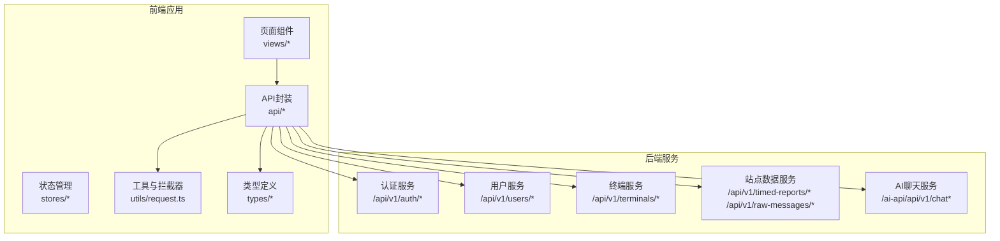
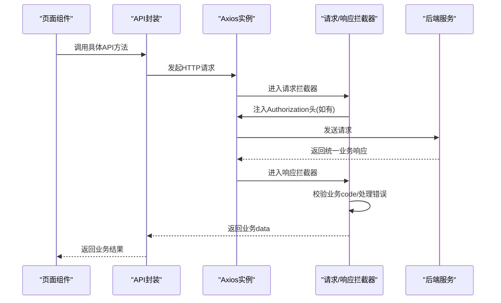
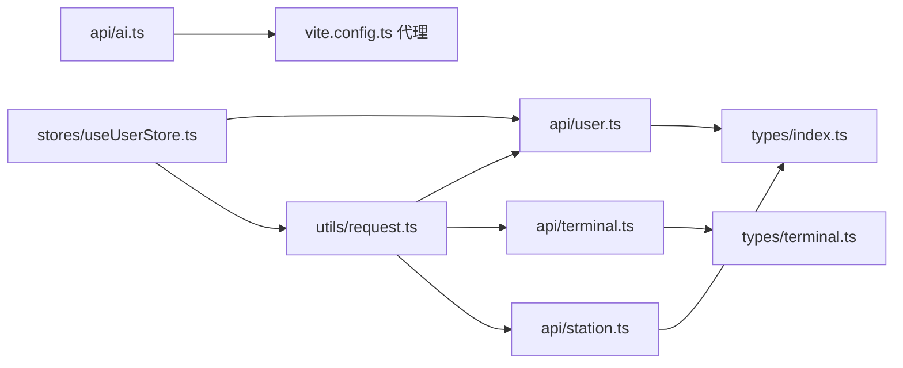

# API接口文档

<cite>
**本文引用的文件**
- [src/api/user.ts](file://src/api/user.ts)
- [src/api/terminal.ts](file://src/api/terminal.ts)
- [src/api/station.ts](file://src/api/station.ts)
- [src/api/ai.ts](file://src/api/ai.ts)
- [src/utils/request.ts](file://src/utils/request.ts)
- [src/types/index.ts](file://src/types/index.ts)
- [src/types/terminal.ts](file://src/types/terminal.ts)
- [src/stores/useUserStore.ts](file://src/stores/useUserStore.ts)
- [vite.config.ts](file://vite.config.ts)
- [README.md](file://README.md)
- [docs/GUIDE.md](file://docs/GUIDE.md)
- [docs/DATA_MODULE.md](file://docs/DATA_MODULE.md)
</cite>

## 目录
1. [简介](#简介)
2. [项目结构](#项目结构)
3. [核心组件](#核心组件)
4. [架构总览](#架构总览)
5. [详细组件分析](#详细组件分析)
6. [依赖关系分析](#依赖关系分析)
7. [性能考量](#性能考量)
8. [故障排除指南](#故障排除指南)
9. [结论](#结论)
10. [附录](#附录)

## 简介
本文件为“水文监测管理系统”的API接口文档，覆盖用户管理、终端设备、AI聊天以及水文站点数据四大模块。文档面向前后端开发者与集成方，提供RESTful API端点规范、请求/响应格式、认证与权限、错误处理、版本管理与最佳实践等内容，并给出常见使用场景的请求/响应示例路径。

## 项目结构
前端通过统一的HTTP客户端封装调用后端API，采用Axios实例与拦截器实现统一鉴权、错误处理与响应数据预处理；各业务模块在src/api下按功能拆分，类型定义集中在src/types目录，状态管理使用Pinia。

**图表来源**
- [src/api/user.ts:100-179](file://src/api/user.ts#L100-L179)
- [src/api/terminal.ts:10-59](file://src/api/terminal.ts#L10-L59)
- [src/api/station.ts:68-115](file://src/api/station.ts#L68-L115)
- [src/api/ai.ts:8-113](file://src/api/ai.ts#L8-L113)
- [src/utils/request.ts:52-180](file://src/utils/request.ts#L52-L180)
- [vite.config.ts:33-51](file://vite.config.ts#L33-L51)

**章节来源**
- [README.md:17-34](file://README.md#L17-L34)
- [docs/GUIDE.md:71-95](file://docs/GUIDE.md#L71-L95)
- [vite.config.ts:33-51](file://vite.config.ts#L33-L51)

## 核心组件
- 统一HTTP客户端与拦截器：负责基础URL、超时、请求头、鉴权头注入、响应数据预处理（大整数保护）、业务状态码处理与错误提示。
- 业务API封装：按模块拆分，提供类型安全的请求与响应接口。
- 用户状态管理：登录、Token持久化、用户信息获取与角色判定。
- 环境与代理：开发环境通过Vite代理转发至后端，AI服务独立代理。

**章节来源**
- [src/utils/request.ts:52-180](file://src/utils/request.ts#L52-L180)
- [src/stores/useUserStore.ts:18-200](file://src/stores/useUserStore.ts#L18-L200)
- [vite.config.ts:33-51](file://vite.config.ts#L33-L51)

## 架构总览
前端通过Axios实例发起请求，统一在拦截器中注入Authorization头（若存在），后端返回统一业务响应结构，拦截器再进行状态码判断与错误处理，最终向业务层返回纯业务数据。

**图表来源**
- [src/utils/request.ts:77-151](file://src/utils/request.ts#L77-L151)
- [src/api/user.ts:106-108](file://src/api/user.ts#L106-L108)
- [src/api/terminal.ts:16-18](file://src/api/terminal.ts#L16-L18)
- [src/api/station.ts:74-80](file://src/api/station.ts#L74-L80)
- [src/api/ai.ts:96-98](file://src/api/ai.ts#L96-L98)

## 详细组件分析

### 用户管理API
- 基础URL前缀：/api/v1
- 认证方式：JWT Bearer Token（通过拦截器自动注入）
- 业务响应结构：统一包装，成功时返回data字段

端点一览
- 登录
  - 方法：POST
  - 路径：/auth/login
  - 请求体：用户名、密码
  - 响应：token、expiration
  - 示例路径：[登录接口定义:100-108](file://src/api/user.ts#L100-L108)

- 获取当前用户信息
  - 方法：GET
  - 路径：/users/{id}
  - 路径参数：id（支持string或number）
  - 响应：用户实体（含密码字段）
  - 示例路径：[用户详情接口:110-118](file://src/api/user.ts#L110-L118)

- 根据用户名查询用户
  - 方法：GET
  - 路径：/users/username/{username}
  - 路径参数：username
  - 响应：用户视图对象（不含密码）
  - 示例路径：[按用户名查询:120-128](file://src/api/user.ts#L120-L128)

- 分页查询用户列表
  - 方法：GET
  - 路径：/users/page
  - 查询参数：username、realName、phone、role、status、pageNum、pageSize
  - 响应：分页结果（records为UserVO[]）
  - 示例路径：[用户分页查询:130-138](file://src/api/user.ts#L130-L138)

- 查询用户详情
  - 方法：GET
  - 路径：/users/{id}
  - 路径参数：id
  - 响应：用户实体
  - 示例路径：[用户详情查询:140-148](file://src/api/user.ts#L140-L148)

- 创建用户
  - 方法：POST
  - 路径：/users
  - 请求体：username、realName、password、role、email、phone、status
  - 响应：创建后的用户实体
  - 示例路径：[创建用户:150-158](file://src/api/user.ts#L150-L158)

- 更新用户
  - 方法：PUT
  - 路径：/users
  - 请求体：id必填，其余可选
  - 响应：更新后的用户实体
  - 示例路径：[更新用户:160-168](file://src/api/user.ts#L160-L168)

- 删除用户
  - 方法：DELETE
  - 路径：/users/{id}
  - 路径参数：id
  - 响应：删除结果
  - 示例路径：[删除用户:170-178](file://src/api/user.ts#L170-L178)

请求/响应类型
- 登录请求/响应：[类型定义:5-15](file://src/api/user.ts#L5-L15)
- 用户实体/视图对象：[类型定义:17-46](file://src/api/user.ts#L17-L46)
- 分页参数/结果：[类型定义:48-68](file://src/api/user.ts#L48-L68)
- 创建/更新请求：[类型定义:70-96](file://src/api/user.ts#L70-L96)

认证与权限
- 登录成功后，前端将token保存于localStorage并在后续请求中通过拦截器自动附加Authorization头。
- 若后端返回业务code为401，拦截器触发登出流程并跳转登录页。
- 示例路径：[拦截器与登出逻辑:95-116](file://src/utils/request.ts#L95-L116)、[用户状态管理:85-94](file://src/stores/useUserStore.ts#L85-L94)

错误处理
- 业务code非200：统一弹出错误消息并reject。
- HTTP状态码映射：400/401/403/404/500/503等对应不同提示。
- 示例路径：[响应拦截器错误处理:117-150](file://src/utils/request.ts#L117-L150)

版本管理
- 基础URL包含/v1版本前缀，便于未来升级。
- 示例路径：[基础URL配置:53-58](file://src/utils/request.ts#L53-L58)

最佳实践
- 前端对大整数字段进行字符串化处理，避免JS精度丢失。
- 对必填字段进行前端校验，减少无效请求。
- 使用分页查询避免一次性拉取过多数据。

**章节来源**
- [src/api/user.ts:100-179](file://src/api/user.ts#L100-L179)
- [src/utils/request.ts:52-180](file://src/utils/request.ts#L52-L180)
- [src/stores/useUserStore.ts:18-200](file://src/stores/useUserStore.ts#L18-L200)
- [src/types/index.ts:1-51](file://src/types/index.ts#L1-L51)

### 终端设备API
- 基础URL前缀：/api/v1
- 认证方式：同用户管理模块

端点一览
- 分页查询终端列表
  - 方法：GET
  - 路径：/terminals/page
  - 查询参数：terminalName、terminalCode、onlineStatus、pageNum、pageSize
  - 响应：分页结果（records为TerminalEntity[]）
  - 示例路径：[终端分页查询:10-18](file://src/api/terminal.ts#L10-L18)

- 查询终端详情
  - 方法：GET
  - 路径：/terminals/{id}
  - 路径参数：id
  - 响应：终端实体
  - 示例路径：[终端详情查询:20-28](file://src/api/terminal.ts#L20-L28)

- 创建终端
  - 方法：POST
  - 路径：/terminals
  - 请求体：terminalName、terminalCode、longitude、latitude、installLocation、connectPassword
  - 响应：创建后的终端实体
  - 示例路径：[创建终端:30-38](file://src/api/terminal.ts#L30-L38)

- 更新终端
  - 方法：PUT
  - 路径：/terminals
  - 请求体：id必填，其余可选
  - 响应：更新后的终端实体
  - 示例路径：[更新终端:40-48](file://src/api/terminal.ts#L40-L48)

- 删除终端
  - 方法：DELETE
  - 路径：/terminals/{id}
  - 路径参数：id
  - 响应：删除结果
  - 示例路径：[删除终端:50-58](file://src/api/terminal.ts#L50-L58)

请求/响应类型
- 终端实体/查询/创建/更新：[类型定义:3-84](file://src/types/terminal.ts#L3-L84)

最佳实践
- 使用onlineStatus进行在线状态筛选。
- 对经纬度字段进行有效性校验。

**章节来源**
- [src/api/terminal.ts:10-59](file://src/api/terminal.ts#L10-L59)
- [src/types/terminal.ts:3-84](file://src/types/terminal.ts#L3-L84)

### AI聊天API
- 基础URL前缀：/ai-api/api/v1（开发环境通过Vite代理）
- 认证方式：JWT Bearer Token（通过拦截器自动注入）

端点一览
- 发送聊天消息
  - 方法：POST
  - 路径：/chat
  - 请求体：message、maxTokens、temperature
  - 响应：content、timestamp、model
  - 示例路径：[发送聊天消息:79-98](file://src/api/ai.ts#L79-L98)

- 健康检查
  - 方法：GET
  - 路径：/chat/health
  - 响应：字符串状态
  - 示例路径：[健康检查:100-105](file://src/api/ai.ts#L100-L105)

- 诊断AI服务
  - 方法：GET
  - 路径：/chat/diagnose
  - 响应：字符串诊断信息
  - 示例路径：[诊断AI服务:107-112](file://src/api/ai.ts#L107-L112)

请求/响应类型
- ChatRequestDTO/ChatResponseVO：[类型定义:80-90](file://src/api/ai.ts#L80-L90)

错误处理
- 业务code非200：统一弹出错误消息并reject。
- HTTP状态码映射：400/401/403/404/500等对应不同提示。
- 示例路径：[AI服务响应拦截器:32-77](file://src/api/ai.ts#L32-L77)

最佳实践
- 为长耗时请求设置合理timeout。
- 对AI服务可用性进行健康检查与诊断。

**章节来源**
- [src/api/ai.ts:8-113](file://src/api/ai.ts#L8-L113)
- [vite.config.ts:46-50](file://vite.config.ts#L46-L50)

### 水文站点数据API
- 基础URL前缀：/api/v1
- 认证方式：同用户管理模块

端点一览
- 分页查询所有遥测站最新数据
  - 方法：GET
  - 路径：/timed-reports/latest
  - 查询参数：pageNum、pageSize、stationCode（可选）
  - 响应：分页结果（records为StationLatestData[]）
  - 示例路径：[最新数据分页:68-80](file://src/api/station.ts#L68-L80)

- 分页查询定时报
  - 方法：POST
  - 路径：/timed-reports/page
  - 请求体：pageNum、pageSize、startTime、endTime、stationCode
  - 响应：分页结果（records为TimedReportEntity[]）
  - 示例路径：[定时报分页:82-90](file://src/api/station.ts#L82-L90)

- 根据遥测站编号查询定时数据
  - 方法：GET
  - 路径：/timed-reports/station/{stationCode}
  - 路径参数：stationCode
  - 查询参数：pageNum、pageSize
  - 响应：分页结果（records为TimedReportEntity[]）
  - 示例路径：[按站点查询定时数据:92-104](file://src/api/station.ts#L92-L104)

- 分页查询原始报文
  - 方法：POST
  - 路径：/raw-messages/page
  - 请求体：pageNum、pageSize、stationCode、functionCode
  - 响应：分页结果（records为RawMessageEntity[]）
  - 示例路径：[原始报文分页:106-115](file://src/api/station.ts#L106-L115)

请求/响应类型
- 数据模型与查询参数：[类型定义:4-115](file://src/api/station.ts#L4-L115)

数据结构说明
- StationLatestData：包含站点编号、名称、在线状态、观测时间、电压、要素集合、原始报文、接收时间等。
- TimedReportEntity：与StationLatestData类似，但字段略有差异。
- ElementItem：要素编码、名称、值、单位。
- RawMessageEntity：包含站点编号、名称、功能码、原始报文、长度、接收时间、解析状态与错误信息等。

最佳实践
- 动态要素列：根据elementSet自动生成列，避免固定列导致扩展困难。
- 数值格式化：依据要素类型自动选择小数位数，提升可读性。
- 前端过滤：支持按站点名称/编号、在线状态、时间范围等条件筛选。

**章节来源**
- [src/api/station.ts:68-115](file://src/api/station.ts#L68-L115)
- [docs/DATA_MODULE.md:43-152](file://docs/DATA_MODULE.md#L43-L152)

## 依赖关系分析
- 统一HTTP客户端依赖Axios与拦截器，贯穿所有业务API。
- 业务API封装依赖类型定义，确保请求/响应强类型。
- 用户状态管理依赖API与拦截器，实现登录、登出与鉴权。
- Vite代理配置将/api与/ai-api分别转发至后端与AI服务。

**图表来源**
- [src/utils/request.ts:52-180](file://src/utils/request.ts#L52-L180)
- [src/api/user.ts:1-179](file://src/api/user.ts#L1-L179)
- [src/api/terminal.ts:1-59](file://src/api/terminal.ts#L1-L59)
- [src/api/station.ts:1-115](file://src/api/station.ts#L1-L115)
- [src/api/ai.ts:8-113](file://src/api/ai.ts#L8-L113)
- [src/types/index.ts:1-51](file://src/types/index.ts#L1-L51)
- [src/types/terminal.ts:1-84](file://src/types/terminal.ts#L1-L84)
- [src/stores/useUserStore.ts:18-200](file://src/stores/useUserStore.ts#L18-L200)
- [vite.config.ts:33-51](file://vite.config.ts#L33-L51)

**章节来源**
- [src/utils/request.ts:52-180](file://src/utils/request.ts#L52-L180)
- [src/api/user.ts:1-179](file://src/api/user.ts#L1-L179)
- [src/api/terminal.ts:1-59](file://src/api/terminal.ts#L1-L59)
- [src/api/station.ts:1-115](file://src/api/station.ts#L1-L115)
- [src/api/ai.ts:8-113](file://src/api/ai.ts#L8-L113)
- [src/types/index.ts:1-51](file://src/types/index.ts#L1-L51)
- [src/types/terminal.ts:1-84](file://src/types/terminal.ts#L1-L84)
- [src/stores/useUserStore.ts:18-200](file://src/stores/useUserStore.ts#L18-L200)
- [vite.config.ts:33-51](file://vite.config.ts#L33-L51)

## 性能考量
- 超时设置：通用HTTP客户端超时15秒，AI服务客户端超时30秒，可根据网络状况调整。
- 大整数保护：响应预处理阶段对超过安全范围的大整数进行字符串化，避免精度丢失。
- 分页查询：优先使用分页接口，避免一次性传输大量数据。
- 代理与CDN：开发环境通过Vite代理减少跨域开销；生产环境建议后端开启缓存与CDN加速静态资源。
- 并发控制：避免同时发起大量请求，必要时引入节流/队列策略。

**章节来源**
- [src/utils/request.ts:53-75](file://src/utils/request.ts#L53-L75)
- [src/api/ai.ts:9-15](file://src/api/ai.ts#L9-L15)

## 故障排除指南
- 未授权/登录失效
  - 现象：业务code为401，自动触发登出并跳转登录页。
  - 处理：重新登录获取新token，确认后端JWT签发与有效期配置。
  - 示例路径：[拦截器登出逻辑:104-109](file://src/utils/request.ts#L104-L109)

- 参数错误/请求失败
  - 现象：HTTP状态码400/404/500/503等。
  - 处理：检查请求参数、路径拼写与后端接口文档一致性。
  - 示例路径：[HTTP状态码映射:121-143](file://src/utils/request.ts#L121-L143)

- AI服务异常
  - 现象：AI接口返回业务错误或网络异常。
  - 处理：使用健康检查与诊断接口定位问题，检查AI服务部署与网络连通性。
  - 示例路径：[AI健康检查/诊断:100-112](file://src/api/ai.ts#L100-L112)

- 环境变量与代理
  - 现象：/api或/ai-api请求无法到达后端。
  - 处理：确认VITE_API_BASE_URL/VITE_AI_API_BASE_URL与代理配置一致。
  - 示例路径：[代理配置:37-50](file://vite.config.ts#L37-L50)

**章节来源**
- [src/utils/request.ts:117-150](file://src/utils/request.ts#L117-L150)
- [src/api/ai.ts:32-77](file://src/api/ai.ts#L32-L77)
- [vite.config.ts:37-50](file://vite.config.ts#L37-L50)

## 结论
本API文档基于前端代码实现梳理，明确了用户管理、终端设备、AI聊天与水文站点数据四大模块的端点规范、认证与权限、错误处理与最佳实践。建议后端在接口契约、响应结构与错误码方面保持稳定，前端按本文档进行集成与联调，确保系统的一致性与可维护性。

## 附录

### 版本管理与环境变量
- 基础URL包含/v1版本前缀，便于未来演进。
- 开发环境通过Vite代理将/api与/ai-api转发至后端与AI服务。
- 示例路径：[基础URL与代理:53-58](file://src/utils/request.ts#L53-L58)、[代理配置:37-50](file://vite.config.ts#L37-L50)

### 常见使用场景示例（示例路径）
- 用户登录并获取当前用户信息
  - [登录接口:100-108](file://src/api/user.ts#L100-L108)
  - [用户信息获取:120-128](file://src/api/user.ts#L120-L128)
  - [拦截器注入Authorization:78-88](file://src/utils/request.ts#L78-L88)

- 分页查询终端列表
  - [终端分页查询:10-18](file://src/api/terminal.ts#L10-L18)

- 查询站点最新数据并动态渲染要素列
  - [最新数据分页:68-80](file://src/api/station.ts#L68-L80)
  - [动态要素列与格式化:155-210](file://docs/DATA_MODULE.md#L155-L210)

- AI聊天消息发送
  - [发送聊天消息:79-98](file://src/api/ai.ts#L79-L98)
  - [AI响应拦截器:32-77](file://src/api/ai.ts#L32-L77)