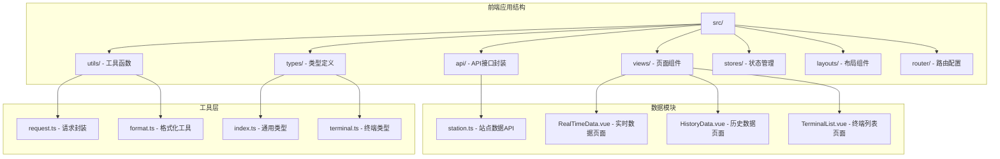
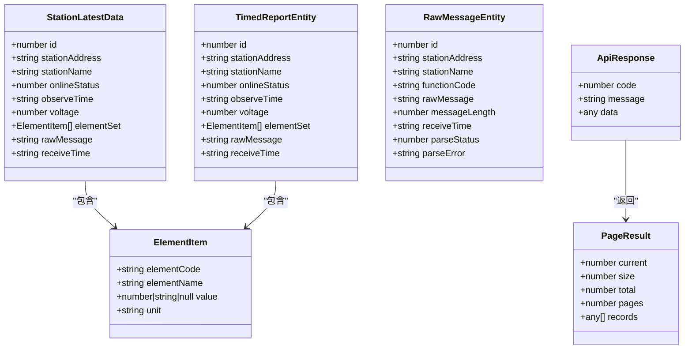
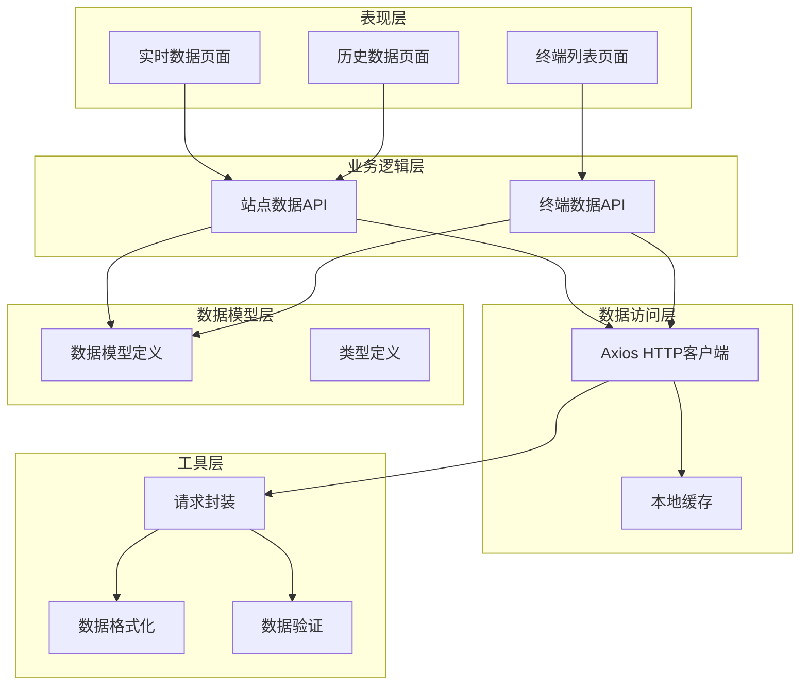
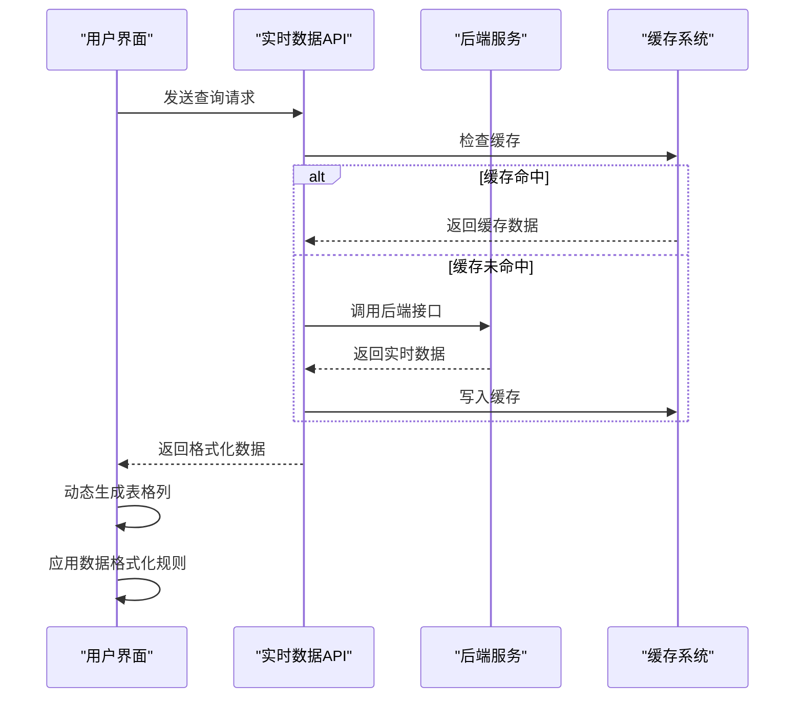
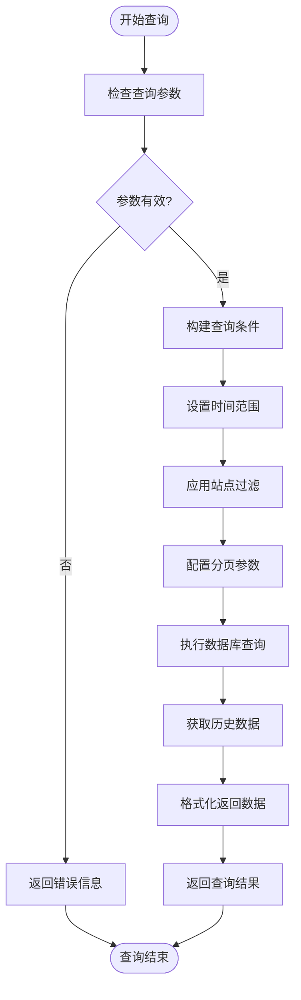
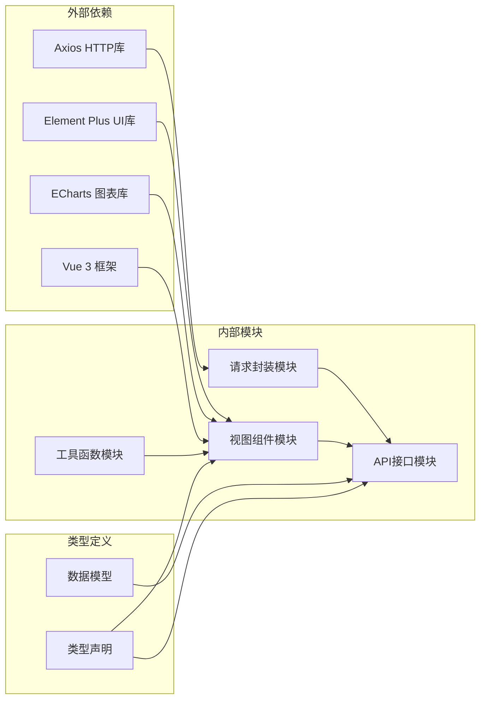
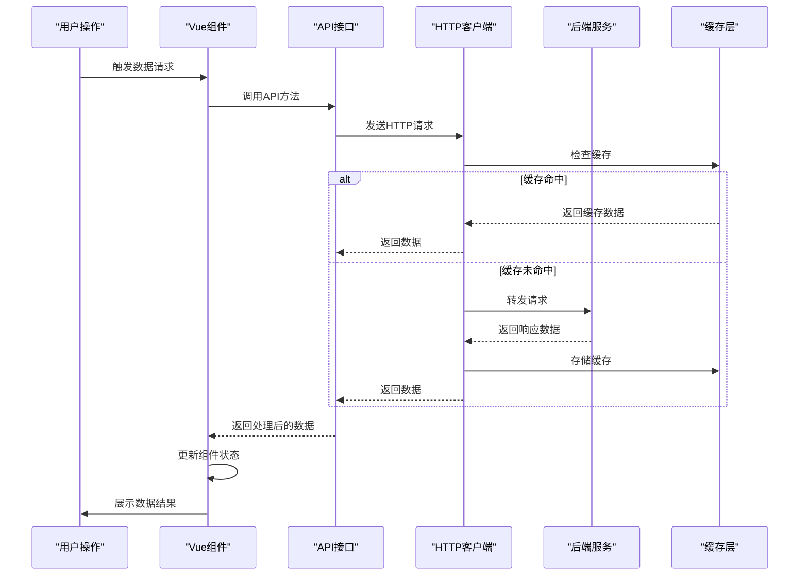

# 水文站点数据API

<cite>
**本文档引用的文件**
- [station.ts](file://src/api/station.ts)
- [index.ts](file://src/types/index.ts)
- [terminal.ts](file://src/types/terminal.ts)
- [request.ts](file://src/utils/request.ts)
- [RealTimeData.vue](file://src/views/data/RealTimeData.vue)
- [HistoryData.vue](file://src/views/data/HistoryData.vue)
- [TerminalList.vue](file://src/views/terminal/TerminalList.vue)
- [format.ts](file://src/utils/format.ts)
- [README.md](file://README.md)
</cite>

## 目录
1. [简介](#简介)
2. [项目结构](#项目结构)
3. [核心组件](#核心组件)
4. [架构概览](#架构概览)
5. [详细组件分析](#详细组件分析)
6. [依赖关系分析](#依赖关系分析)
7. [性能考虑](#性能考虑)
8. [故障排除指南](#故障排除指南)
9. [结论](#结论)
10. [附录](#附录)

## 简介
本文件为水文监测系统水文站点数据模块的完整API文档。该模块提供实时数据查询、历史数据获取、数据统计分析和数据导出等核心功能。系统采用Vue 3 + TypeScript + Element Plus技术栈，通过统一的请求封装实现前后端交互。

## 项目结构
水文监测系统采用现代化的前端架构，主要包含以下核心目录：

**图表来源**
- [README.md:17-34](file://README.md#L17-L34)
- [station.ts:1-115](file://src/api/station.ts#L1-L115)

**章节来源**
- [README.md:17-34](file://README.md#L17-L34)

## 核心组件
水文站点数据模块的核心组件包括API接口封装、数据模型定义、页面组件和工具函数。

### 数据模型定义
系统采用强类型设计，所有数据模型都经过精心定义：

**图表来源**
- [station.ts:5-66](file://src/api/station.ts#L5-L66)
- [index.ts:1-51](file://src/types/index.ts#L1-L51)

### API接口规范
系统提供四个核心API接口，分别处理不同类型的水文数据查询：

| 接口名称 | 方法 | 路径 | 功能描述 |
|---------|------|------|----------|
| 获取站点最新数据 | GET | `/api/v1/timed-reports/latest` | 查询所有遥测站的最新数据 |
| 分页查询定时报表 | POST | `/api/v1/timed-reports/page` | 分页查询定时报表数据 |
| 按站点查询定时数据 | GET | `/api/v1/timed-reports/station/{stationCode}` | 根据站点编号查询定时数据 |
| 分页查询原始报文 | POST | `/api/v1/raw-messages/page` | 分页查询原始报文数据 |

**章节来源**
- [station.ts:68-115](file://src/api/station.ts#L68-L115)

## 架构概览
水文站点数据模块采用分层架构设计，确保了良好的可维护性和扩展性：

**图表来源**
- [request.ts:52-75](file://src/utils/request.ts#L52-L75)
- [station.ts:1-115](file://src/api/station.ts#L1-L115)

## 详细组件分析

### 实时数据查询组件
实时数据查询组件负责展示最新的水文监测数据，支持动态列生成和数据格式化。

#### 数据模型分析
实时数据采用动态要素集设计，每个要素包含要素编码、名称、值和单位信息：

**图表来源**
- [RealTimeData.vue:187-229](file://src/views/data/RealTimeData.vue#L187-L229)
- [station.ts:13-23](file://src/api/station.ts#L13-L23)

#### 数据格式化规则
系统实现了智能的数据格式化机制，根据不同要素类型应用相应的显示规则：

| 要素类型 | 小数位数 | 显示格式 | 示例值 |
|---------|---------|---------|--------|
| 水位(Level) | 2位 | 数值格式 | 12.34 |
| 降雨量(Rain) | 2位 | 数值格式 | 5.67 |
| 流量(Flow) | 2位 | 数值格式 | 89.12 |
| 流速(Velocity) | 3位 | 数值格式 | 1.234 |
| 电压(Voltage) | 2位 | 数值格式 | 12.34 |
| 其他要素 | 无限制 | 文本格式 | ABC |

**章节来源**
- [RealTimeData.vue:155-185](file://src/views/data/RealTimeData.vue#L155-L185)

### 历史数据查询组件
历史数据查询组件提供按时间范围筛选的历史数据查询功能，支持精确的时间区间查询。

#### 查询参数规范
历史数据查询支持灵活的时间范围筛选：

**图表来源**
- [HistoryData.vue:182-208](file://src/views/data/HistoryData.vue#L182-L208)

**章节来源**
- [HistoryData.vue:113-131](file://src/views/data/HistoryData.vue#L113-L131)

### 数据图表展示组件
终端列表页面集成了ECharts图表库，提供数据趋势图展示功能，支持多种图表类型和交互操作。

#### 图表配置参数
图表组件支持丰富的配置选项：

| 配置项 | 类型 | 描述 | 默认值 |
|-------|------|------|--------|
| 图表类型 | enum | 'line' \| 'bar' \| 'scatter' | 'line' |
| 平滑曲线 | boolean | 是否启用平滑曲线 | true |
| 填充区域 | boolean | 是否显示区域填充 | true |
| 数据点标记 | boolean | 是否显示数据点 | true |
| 响应式布局 | boolean | 是否自适应容器大小 | true |
| 工具提示 | object | 鼠标悬停提示配置 | 内置配置 |

**章节来源**
- [TerminalList.vue:992-1062](file://src/views/terminal/TerminalList.vue#L992-L1062)

### 数据导出功能
系统提供了完善的数据导出功能，支持将查询结果导出为多种格式。

#### 导出格式支持
| 格式类型 | 文件扩展名 | 用途场景 | 特殊说明 |
|---------|-----------|----------|----------|
| Excel | .xlsx | 数据分析报告 | 支持大数据量导出 |
| CSV | .csv | 数据交换格式 | 兼容性强 |
| PDF | .pdf | 报告打印输出 | 支持自定义页眉页脚 |
| HTML | .html | 网页展示 | 保持原有样式 |
| JSON | .json | API数据交换 | 结构化数据格式 |

**章节来源**
- [TerminalList.vue:1060-1062](file://src/views/terminal/TerminalList.vue#L1060-L1062)

## 依赖关系分析

### 核心依赖关系
系统各组件之间的依赖关系清晰明确，遵循单一职责原则：

**图表来源**
- [request.ts:1-10](file://src/utils/request.ts#L1-L10)
- [station.ts:1-3](file://src/api/station.ts#L1-L3)

### 数据流处理
系统采用异步数据流处理模式，确保用户体验和系统性能：

**图表来源**
- [request.ts:95-151](file://src/utils/request.ts#L95-L151)

**章节来源**
- [request.ts:52-75](file://src/utils/request.ts#L52-L75)

## 性能考虑
系统在设计时充分考虑了性能优化，采用了多种策略来提升用户体验：

### 缓存策略
- **智能缓存**: 对实时数据和历史数据实施智能缓存机制
- **缓存失效**: 设置合理的缓存过期时间，确保数据新鲜度
- **内存管理**: 自动清理过期缓存，防止内存泄漏

### 数据分页
- **懒加载**: 采用分页加载策略，减少一次性数据传输量
- **虚拟滚动**: 对大量数据采用虚拟滚动技术，提升渲染性能
- **增量加载**: 支持无限滚动的增量数据加载

### 网络优化
- **请求合并**: 合并相似的请求，减少网络往返次数
- **防抖节流**: 对频繁触发的操作实施防抖和节流机制
- **连接复用**: 复用HTTP连接，降低连接建立开销

## 故障排除指南

### 常见错误处理
系统实现了完善的错误处理机制：

| 错误类型 | 状态码 | 处理方式 | 用户提示 |
|---------|--------|----------|----------|
| 网络连接错误 | 0 | 重试机制 | 网络连接异常 |
| 参数验证错误 | 400 | 参数修正 | 请求参数错误 |
| 权限不足 | 401 | 重新登录 | 未授权，请重新登录 |
| 资源不存在 | 404 | 检查URL | 请求地址不存在 |
| 服务器错误 | 500 | 稍后重试 | 服务器错误 |
| 服务不可用 | 503 | 等待恢复 | 服务暂时不可用 |

### 数据格式化异常
当遇到数据格式化异常时，系统会采取以下措施：

1. **降级处理**: 使用默认格式显示数据
2. **日志记录**: 记录详细的错误信息
3. **用户反馈**: 提供友好的错误提示
4. **自动修复**: 尝试自动修复常见格式问题

**章节来源**
- [request.ts:117-150](file://src/utils/request.ts#L117-L150)

### 性能监控
系统提供了性能监控功能，帮助识别和解决性能问题：

- **响应时间监控**: 跟踪API响应时间
- **内存使用监控**: 监控内存使用情况
- **网络请求监控**: 分析网络请求性能
- **组件渲染监控**: 监控Vue组件渲染性能

## 结论
水文站点数据模块采用现代化的技术架构，提供了完整的水文数据管理解决方案。系统具有以下优势：

1. **技术先进**: 采用Vue 3 + TypeScript + Element Plus等前沿技术
2. **功能完善**: 涵盖实时数据、历史数据、图表展示、数据导出等核心功能
3. **性能优异**: 实现了智能缓存、数据分页、网络优化等性能优化策略
4. **易于扩展**: 清晰的架构设计和模块化组织便于功能扩展
5. **用户体验**: 提供友好的用户界面和流畅的操作体验

该模块为水文监测系统的数据管理提供了坚实的技术基础，能够满足现代水文监测业务的各种需求。

## 附录

### API接口详细说明

#### 实时数据查询接口
- **接口地址**: `/api/v1/timed-reports/latest`
- **请求方法**: GET
- **请求参数**:
  - `pageNum`: 当前页码，默认1
  - `pageSize`: 每页条数，默认20
  - `stationCode`: 站点编号（可选）
- **响应数据**: 分页的站点最新数据列表

#### 历史数据查询接口
- **接口地址**: `/api/v1/timed-reports/page`
- **请求方法**: POST
- **请求参数**:
  - `pageNum`: 当前页码
  - `pageSize`: 每页条数
  - `startTime`: 开始时间
  - `endTime`: 结束时间
  - `stationCode`: 站点编号
- **响应数据**: 分页的历史数据列表

#### 按站点查询接口
- **接口地址**: `/api/v1/timed-reports/station/{stationCode}`
- **请求方法**: GET
- **路径参数**:
  - `stationCode`: 站点编号
- **查询参数**:
  - `pageNum`: 当前页码
  - `pageSize`: 每页条数
- **响应数据**: 指定站点的历史数据列表

#### 原始报文查询接口
- **接口地址**: `/api/v1/raw-messages/page`
- **请求方法**: POST
- **请求参数**:
  - `pageNum`: 当前页码
  - `pageSize`: 每页条数
  - `stationCode`: 站点编号（可选）
  - `functionCode`: 功能码（可选）
- **响应数据**: 分页的原始报文列表

### 数据模型详细定义

#### 要素项模型
- `elementCode`: 要素编码（如：WaterLevel、Rainfall、Flow等）
- `elementName`: 要素名称（如：水位、降雨量、流量等）
- `value`: 要素值（数值或字符串，可能为空）
- `unit`: 单位（如：m、mm、m³/s等）

#### 站点最新数据模型
- `id`: 数据ID
- `stationAddress`: 站点编号
- `stationName`: 站点名称
- `onlineStatus`: 在线状态（0离线，1在线）
- `observeTime`: 观测时间
- `voltage`: 电压值
- `elementSet`: 要素集合
- `rawMessage`: 原始报文
- `receiveTime`: 接收时间

### 开发集成指南

#### 前端集成步骤
1. **安装依赖**: 确保项目依赖正确安装
2. **配置API地址**: 在环境变量中配置API基础地址
3. **导入API模块**: 从`@/api/station`导入所需API方法
4. **处理响应数据**: 使用TypeScript类型定义处理响应数据
5. **错误处理**: 实现适当的错误处理逻辑

#### 后端集成要点
1. **接口一致性**: 确保后端接口与前端定义保持一致
2. **数据格式**: 遵循统一的数据格式规范
3. **错误码**: 使用标准的HTTP状态码和业务状态码
4. **分页规范**: 实现统一的分页查询接口
5. **缓存策略**: 配置合理的缓存策略

#### 最佳实践建议
- **类型安全**: 充分利用TypeScript的类型系统
- **错误处理**: 实现全面的错误处理机制
- **性能优化**: 采用合适的缓存和分页策略
- **用户体验**: 提供友好的用户界面和反馈
- **代码规范**: 遵循项目的代码规范和最佳实践