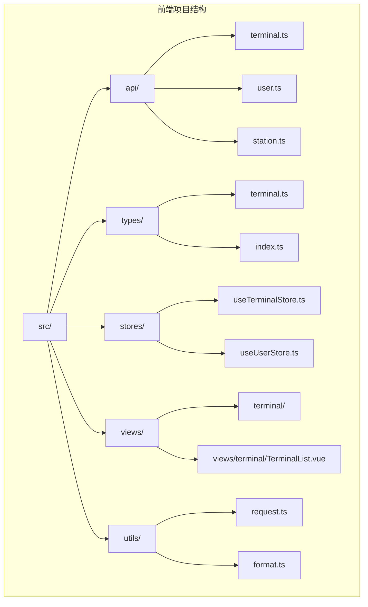
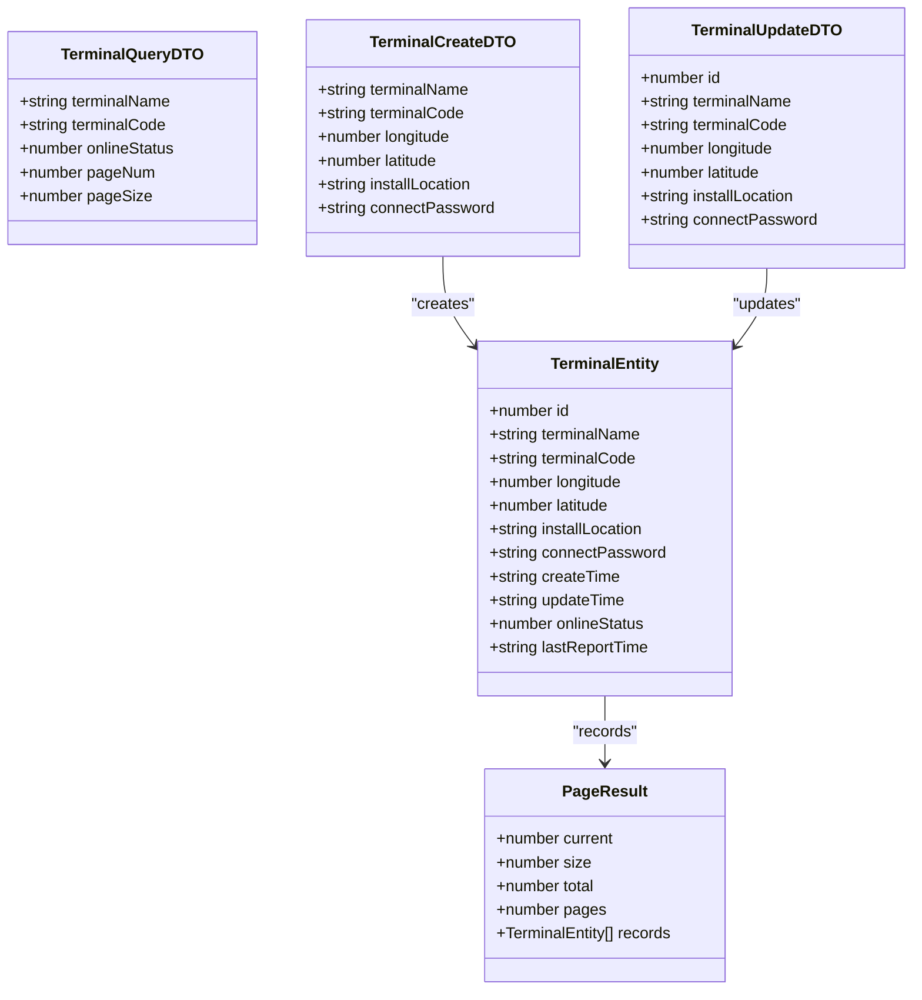
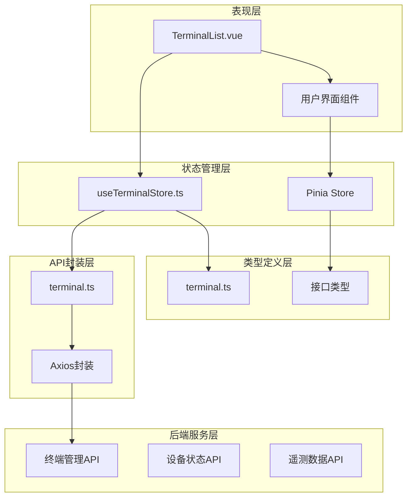
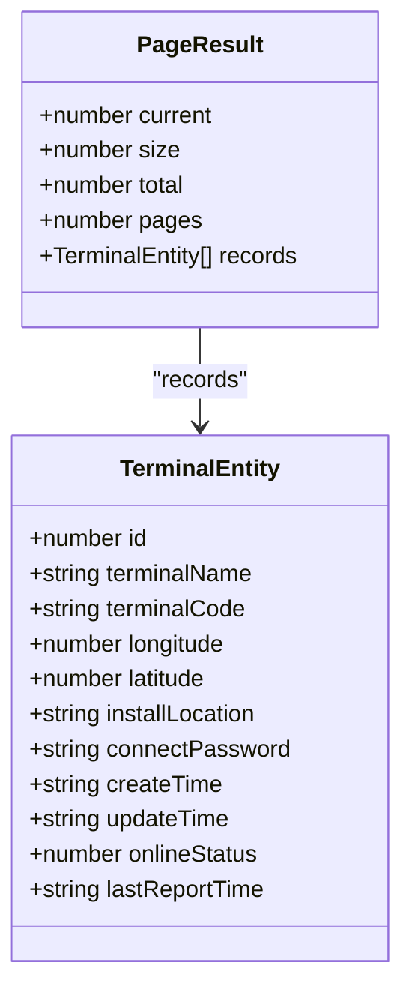
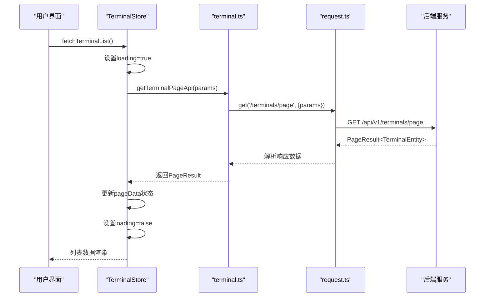
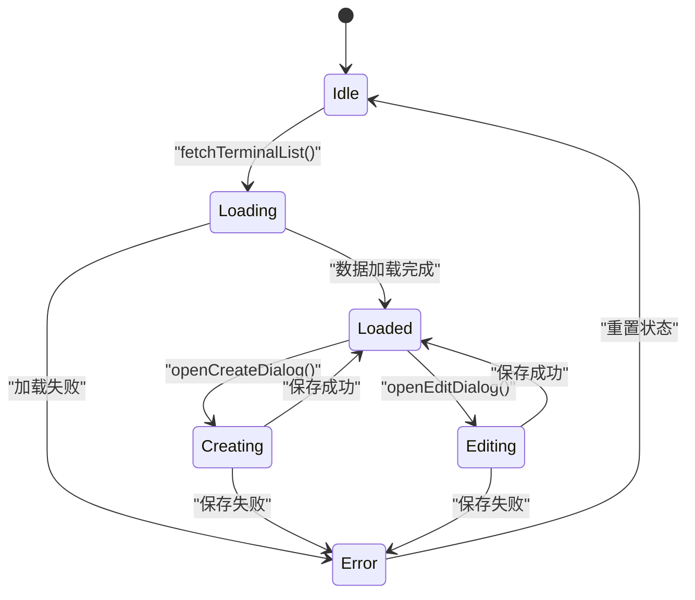
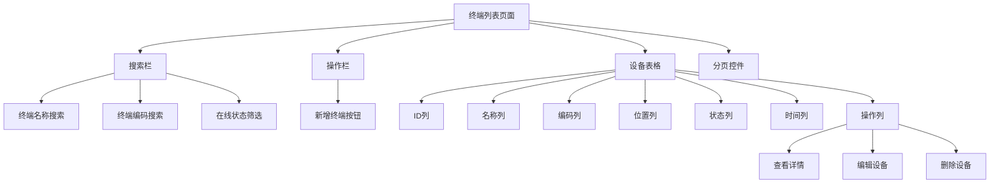
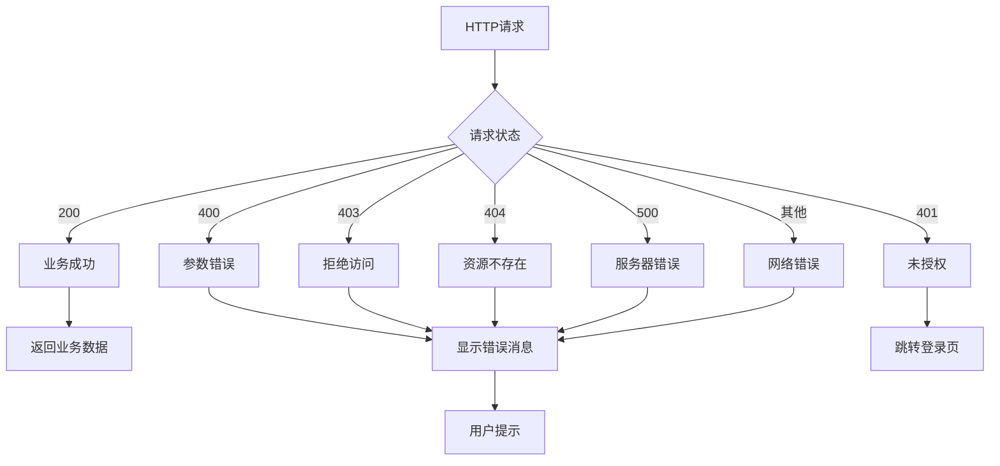

# 终端设备管理API

<cite>
**本文档引用的文件**
- [src/api/terminal.ts](file://src/api/terminal.ts)
- [src/types/terminal.ts](file://src/types/terminal.ts)
- [src/stores/useTerminalStore.ts](file://src/stores/useTerminalStore.ts)
- [src/views/terminal/TerminalList.vue](file://src/views/terminal/TerminalList.vue)
- [src/utils/request.ts](file://src/utils/request.ts)
- [src/api/station.ts](file://src/api/station.ts)
- [src/router/index.ts](file://src/router/index.ts)
</cite>

## 目录
1. [简介](#简介)
2. [项目结构](#项目结构)
3. [核心组件](#核心组件)
4. [架构概览](#架构概览)
5. [详细组件分析](#详细组件分析)
6. [依赖关系分析](#依赖关系分析)
7. [性能考虑](#性能考虑)
8. [故障排除指南](#故障排除指南)
9. [结论](#结论)

## 简介

水文监测系统的终端设备管理模块是一个基于Vue 3 + TypeScript + Element Plus的现代化管理后台，专门用于管理水文监测终端设备。该模块提供了完整的终端设备生命周期管理功能，包括设备的增删改查、状态监控、设备配置和批量操作等功能。

系统采用前后端分离架构，前端使用Vue 3的Composition API和TypeScript进行开发，通过Axios进行HTTP通信，使用Pinia进行状态管理，Element Plus作为UI框架。

## 项目结构

终端设备管理模块在项目中的组织结构如下：



**图表来源**
- [src/api/terminal.ts:1-59](file://src/api/terminal.ts#L1-L59)
- [src/types/terminal.ts:1-84](file://src/types/terminal.ts#L1-L84)
- [src/stores/useTerminalStore.ts:1-294](file://src/stores/useTerminalStore.ts#L1-L294)

**章节来源**
- [src/api/terminal.ts:1-59](file://src/api/terminal.ts#L1-L59)
- [src/types/terminal.ts:1-84](file://src/types/terminal.ts#L1-L84)
- [src/stores/useTerminalStore.ts:1-294](file://src/stores/useTerminalStore.ts#L1-L294)

## 核心组件

### 终端实体模型

终端设备的核心数据模型定义如下：



**图表来源**
- [src/types/terminal.ts:6-18](file://src/types/terminal.ts#L6-L18)
- [src/types/terminal.ts:25-31](file://src/types/terminal.ts#L25-L31)
- [src/types/terminal.ts:51-58](file://src/types/terminal.ts#L51-L58)
- [src/types/terminal.ts:65-73](file://src/types/terminal.ts#L65-L73)
- [src/types/terminal.ts:36-42](file://src/types/terminal.ts#L36-L42)

### 在线状态枚举

系统定义了标准的在线状态枚举：

| 枚举值 | 名称 | 描述 |
|--------|------|------|
| 0 | OFFLINE | 离线状态 |
| 1 | ONLINE | 在线状态 |

**章节来源**
- [src/types/terminal.ts:75-84](file://src/types/terminal.ts#L75-L84)

## 架构概览

终端设备管理模块采用分层架构设计，各层职责清晰：



**图表来源**
- [src/views/terminal/TerminalList.vue:1-800](file://src/views/terminal/TerminalList.vue#L1-L800)
- [src/stores/useTerminalStore.ts:1-294](file://src/stores/useTerminalStore.ts#L1-L294)
- [src/api/terminal.ts:1-59](file://src/api/terminal.ts#L1-L59)

## 详细组件分析

### API接口规范

#### 设备列表查询

**接口定义**
- 方法: GET
- 路径: `/terminals/page`
- 功能: 分页查询终端设备列表

**请求参数**

| 参数名 | 类型 | 必填 | 描述 | 默认值 |
|--------|------|------|------|--------|
| terminalName | string | 否 | 终端名称 | - |
| terminalCode | string | 否 | 终端编码 | - |
| onlineStatus | number | 否 | 在线状态(0离线,1在线) | - |
| pageNum | number | 否 | 页码 | 1 |
| pageSize | number | 否 | 每页大小 | 20 |

**响应数据结构**



**图表来源**
- [src/types/terminal.ts:36-42](file://src/types/terminal.ts#L36-L42)
- [src/types/terminal.ts:6-18](file://src/types/terminal.ts#L6-L18)

**接口实现流程**



**图表来源**
- [src/stores/useTerminalStore.ts:72-93](file://src/stores/useTerminalStore.ts#L72-L93)
- [src/api/terminal.ts:16-18](file://src/api/terminal.ts#L16-L18)
- [src/utils/request.ts:155-157](file://src/utils/request.ts#L155-L157)

**章节来源**
- [src/api/terminal.ts:10-18](file://src/api/terminal.ts#L10-L18)
- [src/stores/useTerminalStore.ts:72-93](file://src/stores/useTerminalStore.ts#L72-L93)

#### 设备详情获取

**接口定义**
- 方法: GET
- 路径: `/terminals/{id}`
- 功能: 获取指定终端设备的详细信息

**请求参数**

| 参数名 | 类型 | 必填 | 描述 |
|--------|------|------|------|
| id | number | 是 | 终端设备ID |

**响应数据结构**
- 返回: TerminalEntity 类型的完整设备信息

**章节来源**
- [src/api/terminal.ts:20-28](file://src/api/terminal.ts#L20-L28)
- [src/stores/useTerminalStore.ts:99-113](file://src/stores/useTerminalStore.ts#L99-L113)

#### 设备创建

**接口定义**
- 方法: POST
- 路径: `/terminals`
- 功能: 创建新的终端设备

**请求体参数**

| 参数名 | 类型 | 必填 | 描述 |
|--------|------|------|------|
| terminalName | string | 是 | 终端名称 |
| terminalCode | string | 是 | 终端编码 |
| longitude | number | 否 | 经度 |
| latitude | number | 否 | 纬度 |
| installLocation | string | 否 | 安装位置 |
| connectPassword | string | 否 | 连接密码 |

**响应数据结构**
- 返回: 新创建的 TerminalEntity 对象

**章节来源**
- [src/api/terminal.ts:30-38](file://src/api/terminal.ts#L30-L38)
- [src/types/terminal.ts:51-58](file://src/types/terminal.ts#L51-L58)

#### 设备更新

**接口定义**
- 方法: PUT
- 路径: `/terminals`
- 功能: 更新现有终端设备信息

**请求体参数**

| 参数名 | 类型 | 必填 | 描述 |
|--------|------|------|------|
| id | number | 是 | 终端设备ID |
| terminalName | string | 否 | 终端名称 |
| terminalCode | string | 否 | 终端编码 |
| longitude | number | 否 | 经度 |
| latitude | number | 否 | 纬度 |
| installLocation | string | 否 | 安装位置 |
| connectPassword | string | 否 | 连接密码 |

**响应数据结构**
- 返回: 更新后的 TerminalEntity 对象

**章节来源**
- [src/api/terminal.ts:40-48](file://src/api/terminal.ts#L40-L48)
- [src/types/terminal.ts:65-73](file://src/types/terminal.ts#L65-L73)

#### 设备删除

**接口定义**
- 方法: DELETE
- 路径: `/terminals/{id}`
- 功能: 删除指定的终端设备

**请求参数**

| 参数名 | 类型 | 必填 | 描述 |
|--------|------|------|------|
| id | number | 是 | 终端设备ID |

**响应数据结构**
- 返回: 删除操作结果（通常为成功状态）

**章节来源**
- [src/api/terminal.ts:50-58](file://src/api/terminal.ts#L50-L58)
- [src/stores/useTerminalStore.ts:165-180](file://src/stores/useTerminalStore.ts#L165-L180)

### 状态管理机制

终端设备管理使用Pinia进行状态管理，核心状态包括：



**图表来源**
- [src/stores/useTerminalStore.ts:24-48](file://src/stores/useTerminalStore.ts#L24-L48)

**章节来源**
- [src/stores/useTerminalStore.ts:19-294](file://src/stores/useTerminalStore.ts#L19-L294)

### 用户界面集成

终端设备管理界面提供了完整的CRUD操作体验：



**图表来源**
- [src/views/terminal/TerminalList.vue:1-107](file://src/views/terminal/TerminalList.vue#L1-L107)

**章节来源**
- [src/views/terminal/TerminalList.vue:1-800](file://src/views/terminal/TerminalList.vue#L1-L800)

## 依赖关系分析

终端设备管理模块的依赖关系如下：

```mermaid
graph TB
subgraph "外部依赖"
A[Axios]
B[Element Plus]
C[Vue 3]
D[Pinia]
E[Vue Router]
end
subgraph "内部模块"
F[terminal.ts]
G[useTerminalStore.ts]
H[TerminalList.vue]
I[request.ts]
J[terminal.ts(types)]
end
F --> I
G --> F
H --> G
H --> J
I --> A
G --> D
H --> B
F --> C
G --> E
```

**图表来源**
- [src/api/terminal.ts:1](file://src/api/terminal.ts#L1)
- [src/stores/useTerminalStore.ts:1](file://src/stores/useTerminalStore.ts#L1)
- [src/utils/request.ts:1](file://src/utils/request.ts#L1)

**章节来源**
- [src/api/terminal.ts:1-59](file://src/api/terminal.ts#L1-L59)
- [src/stores/useTerminalStore.ts:1-294](file://src/stores/useTerminalStore.ts#L1-L294)
- [src/utils/request.ts:1-180](file://src/utils/request.ts#L1-L180)

## 性能考虑

### 前端性能优化

1. **懒加载策略**: 使用Vue Router的懒加载机制，按需加载组件
2. **状态缓存**: 使用Pinia进行状态缓存，避免重复请求
3. **虚拟滚动**: 对于大量数据的表格，可以考虑实现虚拟滚动
4. **防抖处理**: 对搜索和筛选操作进行防抖处理

### 网络请求优化

1. **请求拦截器**: 统一处理Token认证和错误处理
2. **响应转换**: 自动处理大整数精度问题
3. **代理配置**: 开发环境使用代理解决跨域问题

## 故障排除指南

### 常见错误处理

系统使用统一的错误处理机制：



**图表来源**
- [src/utils/request.ts:96-151](file://src/utils/request.ts#L96-L151)

### 错误码说明

| 错误码 | 描述 | 处理建议 |
|--------|------|----------|
| 200 | 请求成功 | 正常处理响应数据 |
| 400 | 请求参数错误 | 检查请求参数格式 |
| 401 | 未授权，请重新登录 | 清除Token并跳转登录页 |
| 403 | 拒绝访问 | 检查用户权限 |
| 404 | 请求地址不存在 | 检查API路径 |
| 500 | 服务器错误 | 重试请求或联系管理员 |
| 503 | 服务不可用 | 稍后重试 |

**章节来源**
- [src/utils/request.ts:96-151](file://src/utils/request.ts#L96-L151)

### 调试技巧

1. **浏览器开发者工具**: 使用Network标签查看API请求和响应
2. **状态检查**: 使用Vue DevTools检查Pinia状态变化
3. **日志输出**: 在关键位置添加console.log进行调试
4. **环境配置**: 检查.env文件中的API地址配置

## 结论

水文监测系统的终端设备管理模块是一个功能完整、架构清晰的现代化管理后台。该模块提供了完善的终端设备生命周期管理功能，包括：

1. **完整的CRUD操作**: 支持终端设备的创建、读取、更新和删除
2. **状态监控**: 实时显示设备在线状态和最后上报时间
3. **分页查询**: 支持大数据量的高效查询
4. **用户友好**: 提供直观的图形界面和良好的用户体验
5. **技术先进**: 采用Vue 3 + TypeScript + Element Plus等现代技术栈

该模块为前端开发者提供了清晰的集成指南，包括API接口规范、数据结构定义、错误处理机制等，便于快速集成和扩展。