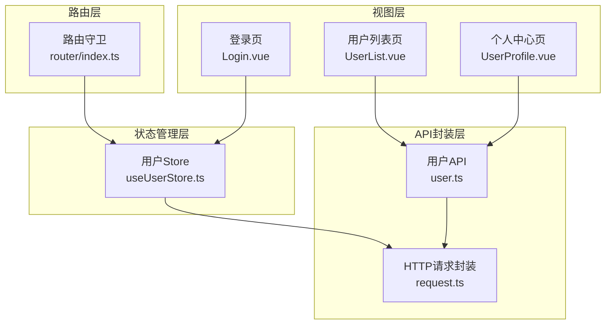
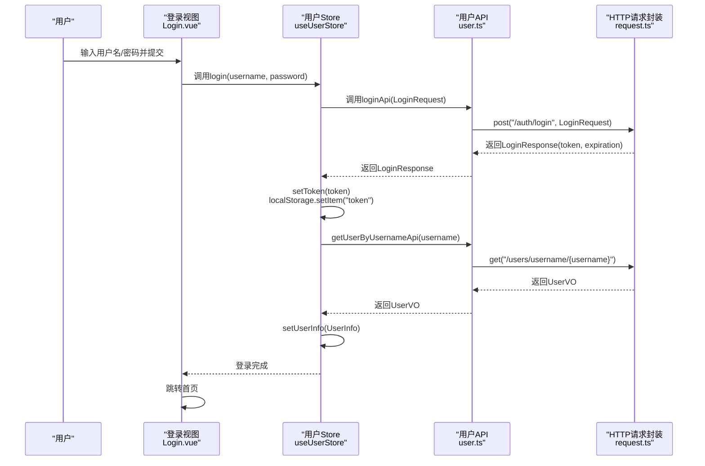
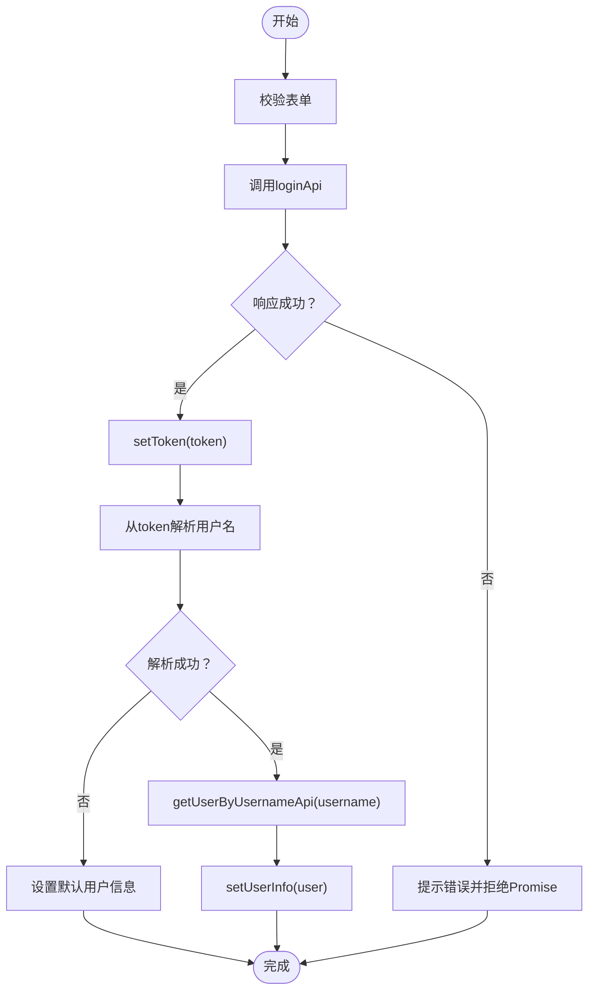
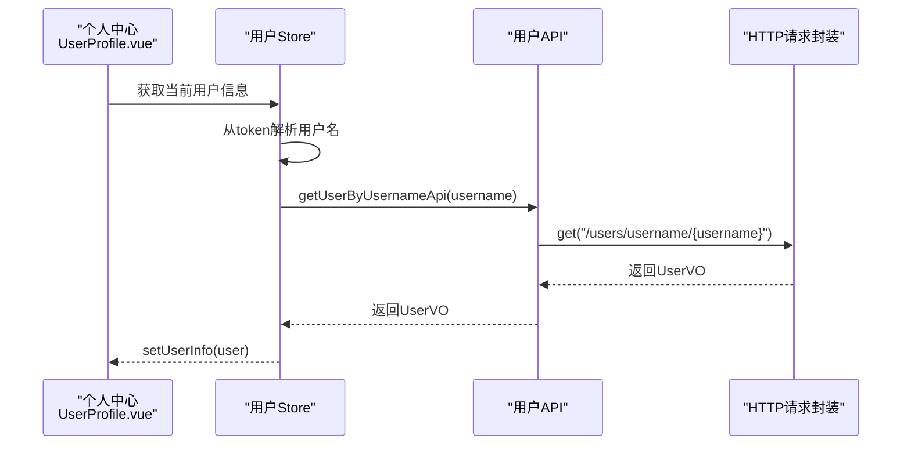
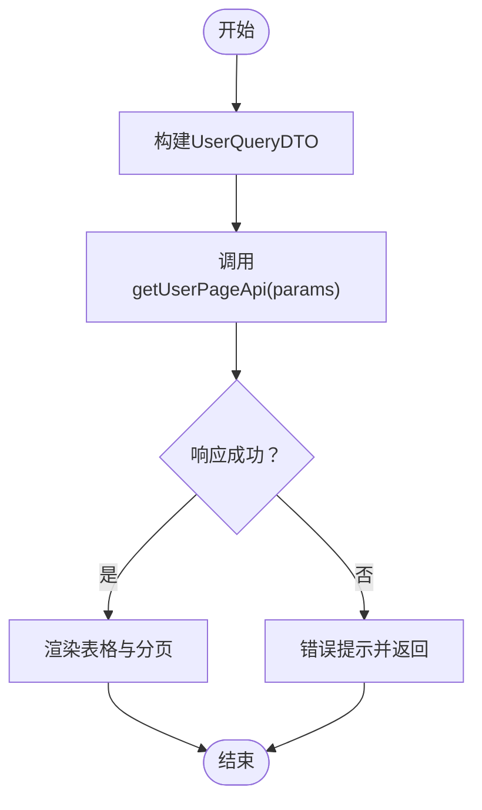
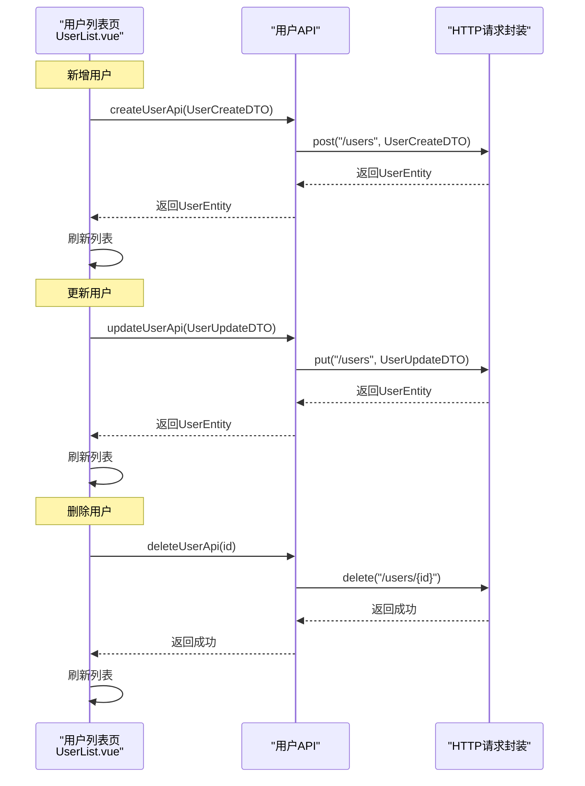
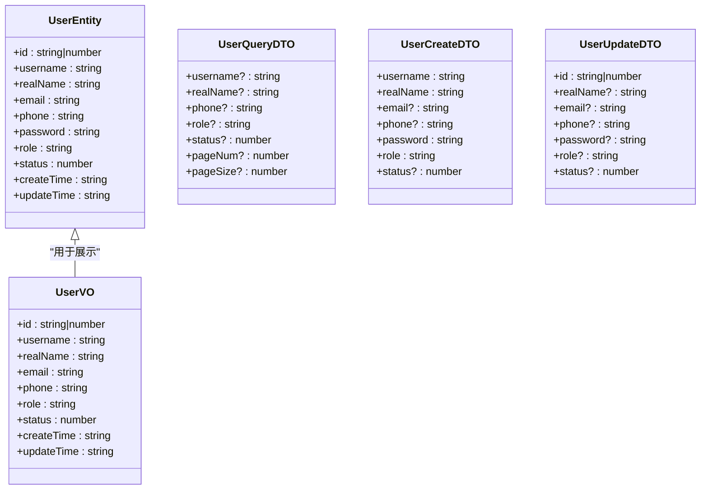
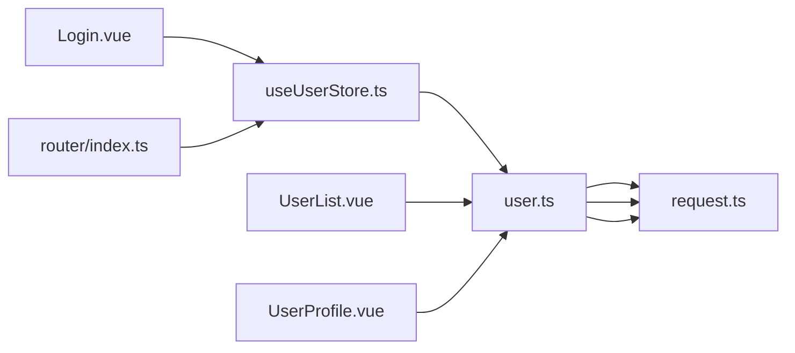

# 认证与用户管理API

<cite>
**本文档引用的文件**
- [src/api/user.ts](file://src/api/user.ts)
- [src/stores/useUserStore.ts](file://src/stores/useUserStore.ts)
- [src/utils/request.ts](file://src/utils/request.ts)
- [src/views/login/Login.vue](file://src/views/login/Login.vue)
- [src/views/user/UserList.vue](file://src/views/user/UserList.vue)
- [src/views/user/UserProfile.vue](file://src/views/user/UserProfile.vue)
- [src/router/index.ts](file://src/router/index.ts)
- [src/types/index.ts](file://src/types/index.ts)
- [-v3-api-docs.md](file://-v3-api-docs.md)
</cite>

## 目录
1. [简介](#简介)
2. [项目结构](#项目结构)
3. [核心组件](#核心组件)
4. [架构总览](#架构总览)
5. [详细组件分析](#详细组件分析)
6. [依赖关系分析](#依赖关系分析)
7. [性能考虑](#性能考虑)
8. [故障排除指南](#故障排除指南)
9. [结论](#结论)
10. [附录](#附录)

## 简介
本文件为水文监测系统的认证与用户管理模块提供完整的API文档与前端集成指南。内容覆盖：
- 用户登录认证与JWT令牌获取机制
- 用户信息查询、分页查询与CRUD操作
- 用户实体模型、用户VO模型、查询参数DTO、创建/更新DTO的字段说明
- 请求与响应示例、错误处理方案
- 认证流程、权限验证机制与安全考虑
- 前端集成步骤与最佳实践

## 项目结构
认证与用户管理相关代码主要分布在以下模块：
- API封装层：统一的HTTP请求与响应处理
- 状态管理层：Pinia Store管理用户会话与权限
- 视图层：登录页、用户列表页、个人中心页
- 路由层：全局路由守卫与鉴权控制
- 类型定义：通用响应、分页、用户状态与角色枚举

**图表来源**
- [src/views/login/Login.vue:114-134](file://src/views/login/Login.vue#L114-L134)
- [src/views/user/UserList.vue:302-315](file://src/views/user/UserList.vue#L302-L315)
- [src/views/user/UserProfile.vue:204-226](file://src/views/user/UserProfile.vue#L204-L226)
- [src/stores/useUserStore.ts:61-83](file://src/stores/useUserStore.ts#L61-L83)
- [src/utils/request.ts:52-75](file://src/utils/request.ts#L52-L75)
- [src/api/user.ts:106-108](file://src/api/user.ts#L106-L108)
- [src/router/index.ts:116-129](file://src/router/index.ts#L116-L129)

**章节来源**
- [src/views/login/Login.vue:1-408](file://src/views/login/Login.vue#L1-L408)
- [src/views/user/UserList.vue:1-617](file://src/views/user/UserList.vue#L1-L617)
- [src/views/user/UserProfile.vue:1-376](file://src/views/user/UserProfile.vue#L1-L376)
- [src/stores/useUserStore.ts:1-200](file://src/stores/useUserStore.ts#L1-L200)
- [src/utils/request.ts:1-180](file://src/utils/request.ts#L1-L180)
- [src/api/user.ts:1-179](file://src/api/user.ts#L1-L179)
- [src/router/index.ts:1-136](file://src/router/index.ts#L1-L136)

## 核心组件
- 用户API模块：提供登录、用户信息查询、分页查询、CRUD等接口的类型定义与调用封装
- 用户Store：负责JWT Token的持久化、用户信息缓存、登录状态判断与权限判定
- HTTP请求封装：统一的Axios实例、请求头注入Authorization、响应拦截与错误处理
- 登录视图：表单校验、调用Store登录、跳转首页
- 用户列表视图：多维查询、分页、新增/编辑/删除、状态切换
- 个人中心视图：用户信息展示与更新、密码修改（预留）
- 路由守卫：基于Token的鉴权控制

**章节来源**
- [src/api/user.ts:1-179](file://src/api/user.ts#L1-L179)
- [src/stores/useUserStore.ts:1-200](file://src/stores/useUserStore.ts#L1-L200)
- [src/utils/request.ts:1-180](file://src/utils/request.ts#L1-L180)
- [src/views/login/Login.vue:114-134](file://src/views/login/Login.vue#L114-L134)
- [src/views/user/UserList.vue:302-503](file://src/views/user/UserList.vue#L302-L503)
- [src/views/user/UserProfile.vue:204-310](file://src/views/user/UserProfile.vue#L204-L310)
- [src/router/index.ts:116-129](file://src/router/index.ts#L116-L129)

## 架构总览
认证与用户管理采用前后端分离架构，前端通过Axios统一发起HTTP请求，后端返回标准业务响应结构。登录成功后，前端将JWT Token保存至本地存储，并在后续请求中通过请求拦截器自动附加Authorization头。

**图表来源**
- [src/views/login/Login.vue:114-134](file://src/views/login/Login.vue#L114-L134)
- [src/stores/useUserStore.ts:61-83](file://src/stores/useUserStore.ts#L61-L83)
- [src/api/user.ts:106-108](file://src/api/user.ts#L106-L108)
- [src/utils/request.ts:77-93](file://src/utils/request.ts#L77-L93)

**章节来源**
- [src/views/login/Login.vue:114-134](file://src/views/login/Login.vue#L114-L134)
- [src/stores/useUserStore.ts:61-125](file://src/stores/useUserStore.ts#L61-L125)
- [src/api/user.ts:106-128](file://src/api/user.ts#L106-L128)
- [src/utils/request.ts:77-116](file://src/utils/request.ts#L77-L116)

## 详细组件分析

### 用户登录认证
- 接口路径：POST /api/v1/auth/login
- 请求体：LoginRequest（username, password）
- 响应体：LoginResponse（token, expiration）
- 前端实现要点：
  - 登录成功后将token写入localStorage
  - 使用token解析用户名并调用“按用户名查询用户”接口获取用户信息
  - 将用户信息写入sessionStorage以便刷新后恢复

**图表来源**
- [src/views/login/Login.vue:114-134](file://src/views/login/Login.vue#L114-L134)
- [src/stores/useUserStore.ts:61-125](file://src/stores/useUserStore.ts#L61-L125)

**章节来源**
- [src/views/login/Login.vue:114-134](file://src/views/login/Login.vue#L114-L134)
- [src/stores/useUserStore.ts:61-125](file://src/stores/useUserStore.ts#L61-L125)
- [-v3-api-docs.md:2914-2989](file://-v3-api-docs.md#L2914-L2989)

### 用户信息查询
- 按ID查询用户详情：GET /api/v1/users/{id} → UserEntity
- 按用户名查询用户：GET /api/v1/users/username/{username} → UserVO
- 个人中心使用“按用户名查询用户”接口获取当前用户信息

**图表来源**
- [src/views/user/UserProfile.vue:204-226](file://src/views/user/UserProfile.vue#L204-L226)
- [src/stores/useUserStore.ts:100-125](file://src/stores/useUserStore.ts#L100-L125)
- [src/api/user.ts:126-128](file://src/api/user.ts#L126-L128)

**章节来源**
- [src/views/user/UserProfile.vue:204-226](file://src/views/user/UserProfile.vue#L204-L226)
- [src/stores/useUserStore.ts:100-125](file://src/stores/useUserStore.ts#L100-L125)
- [src/api/user.ts:116-128](file://src/api/user.ts#L116-L128)

### 分页查询与多维检索
- 接口路径：GET /api/v1/users/page
- 查询参数：UserQueryDTO（username, realName, phone, role, status, pageNum, pageSize）
- 响应体：PageResult<UserVO>（current, size, total, pages, records）

**图表来源**
- [src/views/user/UserList.vue:302-315](file://src/views/user/UserList.vue#L302-L315)
- [src/api/user.ts:136-138](file://src/api/user.ts#L136-L138)

**章节来源**
- [src/views/user/UserList.vue:215-224](file://src/views/user/UserList.vue#L215-L224)
- [src/views/user/UserList.vue:302-315](file://src/views/user/UserList.vue#L302-L315)
- [src/api/user.ts:51-68](file://src/api/user.ts#L51-L68)
- [src/api/user.ts:136-138](file://src/api/user.ts#L136-L138)

### 用户CRUD操作
- 创建用户：POST /api/v1/users → UserEntity
- 更新用户：PUT /api/v1/users → UserEntity
- 删除用户：DELETE /api/v1/users/{id}

**图表来源**
- [src/views/user/UserList.vue:456-503](file://src/views/user/UserList.vue#L456-L503)
- [src/api/user.ts:156-178](file://src/api/user.ts#L156-L178)

**章节来源**
- [src/views/user/UserList.vue:456-503](file://src/views/user/UserList.vue#L456-L503)
- [src/api/user.ts:75-96](file://src/api/user.ts#L75-L96)
- [src/api/user.ts:156-178](file://src/api/user.ts#L156-L178)

### 用户实体模型与DTO
- 用户实体（UserEntity）：包含密码字段，用于后端返回
- 用户VO（UserVO）：用于列表展示，不含密码
- 查询参数DTO（UserQueryDTO）：支持多维检索与分页
- 创建DTO（UserCreateDTO）：必填字段username、realName、password、role
- 更新DTO（UserUpdateDTO）：必填字段id，其余可选

**图表来源**
- [src/api/user.ts:19-46](file://src/api/user.ts#L19-L46)
- [src/api/user.ts:51-96](file://src/api/user.ts#L51-L96)

**章节来源**
- [src/api/user.ts:19-96](file://src/api/user.ts#L19-L96)

### 错误处理与安全考虑
- 响应拦截器统一处理业务状态码与HTTP状态码，401时自动登出并跳转登录页
- 请求拦截器自动附加Authorization: Bearer token
- Token解析：从JWT payload中提取用户名字段（支持sub、username、preferred_username）
- 大整数处理：预处理JSON响应中的大整数，避免JavaScript精度丢失

**章节来源**
- [src/utils/request.ts:95-151](file://src/utils/request.ts#L95-L151)
- [src/stores/useUserStore.ts:132-150](file://src/stores/useUserStore.ts#L132-L150)
- [src/utils/request.ts:22-50](file://src/utils/request.ts#L22-L50)

## 依赖关系分析
- 登录流程依赖：Login.vue → useUserStore.login → user.ts.loginApi → request.ts
- 用户信息获取依赖：useUserStore.fetchUserInfo → user.ts.getUserByUsernameApi → request.ts
- 用户列表依赖：UserList.vue → user.ts.getUserPageApi → request.ts
- 权限控制依赖：router.beforeEach → localStorage.token

**图表来源**
- [src/views/login/Login.vue:114-134](file://src/views/login/Login.vue#L114-L134)
- [src/stores/useUserStore.ts:61-83](file://src/stores/useUserStore.ts#L61-L83)
- [src/views/user/UserList.vue:302-315](file://src/views/user/UserList.vue#L302-L315)
- [src/views/user/UserProfile.vue:204-226](file://src/views/user/UserProfile.vue#L204-L226)
- [src/router/index.ts:116-129](file://src/router/index.ts#L116-L129)

**章节来源**
- [src/views/login/Login.vue:114-134](file://src/views/login/Login.vue#L114-L134)
- [src/views/user/UserList.vue:302-315](file://src/views/user/UserList.vue#L302-L315)
- [src/views/user/UserProfile.vue:204-226](file://src/views/user/UserProfile.vue#L204-L226)
- [src/stores/useUserStore.ts:61-125](file://src/stores/useUserStore.ts#L61-L125)
- [src/router/index.ts:116-129](file://src/router/index.ts#L116-L129)

## 性能考虑
- 分页查询：合理设置pageNum与pageSize，避免一次性加载过多数据
- 大整数处理：前端已内置预处理逻辑，确保ID等字段的精确显示
- 缓存策略：用户信息缓存在sessionStorage，减少重复请求
- 请求合并：批量删除使用Promise.all并发处理多个删除请求

**章节来源**
- [src/views/user/UserList.vue:403-432](file://src/views/user/UserList.vue#L403-L432)
- [src/utils/request.ts:22-50](file://src/utils/request.ts#L22-L50)
- [src/stores/useUserStore.ts:172-183](file://src/stores/useUserStore.ts#L172-L183)

## 故障排除指南
- 登录失败：检查用户名/密码是否正确；查看Element Plus消息提示；确认后端接口可达
- 401未授权：响应拦截器会自动清除token并跳转登录页；检查token是否过期
- 网络错误：检查网络连通性与代理配置；确认基础URL与环境变量正确
- ID精度丢失：确认后端返回为字符串格式；前端已内置大整数预处理
- 用户信息获取失败：store会回退到默认管理员信息，不影响主流程

**章节来源**
- [src/utils/request.ts:95-151](file://src/utils/request.ts#L95-L151)
- [src/stores/useUserStore.ts:119-125](file://src/stores/useUserStore.ts#L119-L125)

## 结论
本认证与用户管理模块通过清晰的API封装、完善的前端状态管理与路由守卫，实现了安全、易用的用户认证与管理体验。前端遵循统一的响应与请求处理规范，具备良好的扩展性与维护性。

## 附录

### API规范摘要
- 登录接口
  - 方法：POST
  - 路径：/api/v1/auth/login
  - 请求体：LoginRequest
  - 响应体：LoginResponse
- 用户信息查询
  - 按ID：GET /api/v1/users/{id} → UserEntity
  - 按用户名：GET /api/v1/users/username/{username} → UserVO
- 分页查询
  - 方法：GET
  - 路径：/api/v1/users/page
  - 查询参数：UserQueryDTO
  - 响应体：PageResult<UserVO>
- 用户CRUD
  - 创建：POST /api/v1/users → UserEntity
  - 更新：PUT /api/v1/users → UserEntity
  - 删除：DELETE /api/v1/users/{id}

**章节来源**
- [src/api/user.ts:106-178](file://src/api/user.ts#L106-L178)
- [src/api/user.ts:51-68](file://src/api/user.ts#L51-L68)
- [-v3-api-docs.md:2914-2989](file://-v3-api-docs.md#L2914-L2989)

### 前端集成最佳实践
- 在路由守卫中检查token，未登录跳转登录页
- 登录成功后同时保存token与用户信息，并刷新页面
- 使用统一的错误提示与401自动登出机制
- 分页查询时合理设置pageNum与pageSize，避免超大数据量
- 批量删除使用并发请求提升效率

**章节来源**
- [src/router/index.ts:116-129](file://src/router/index.ts#L116-L129)
- [src/stores/useUserStore.ts:61-83](file://src/stores/useUserStore.ts#L61-L83)
- [src/views/user/UserList.vue:403-432](file://src/views/user/UserList.vue#L403-L432)