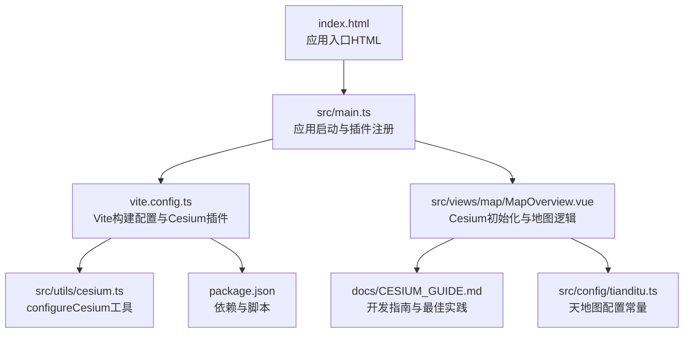
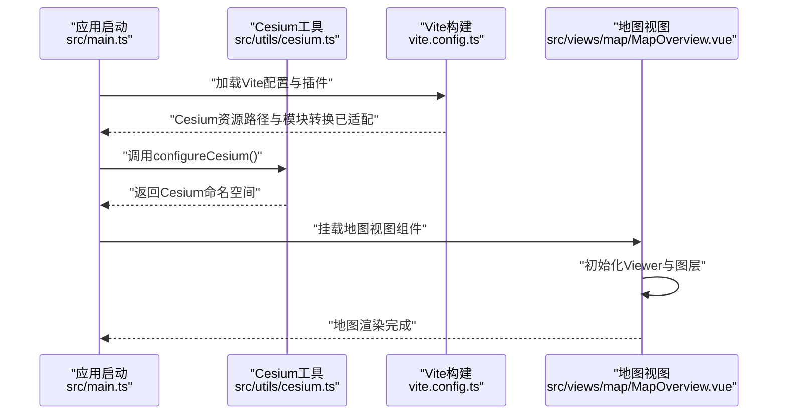
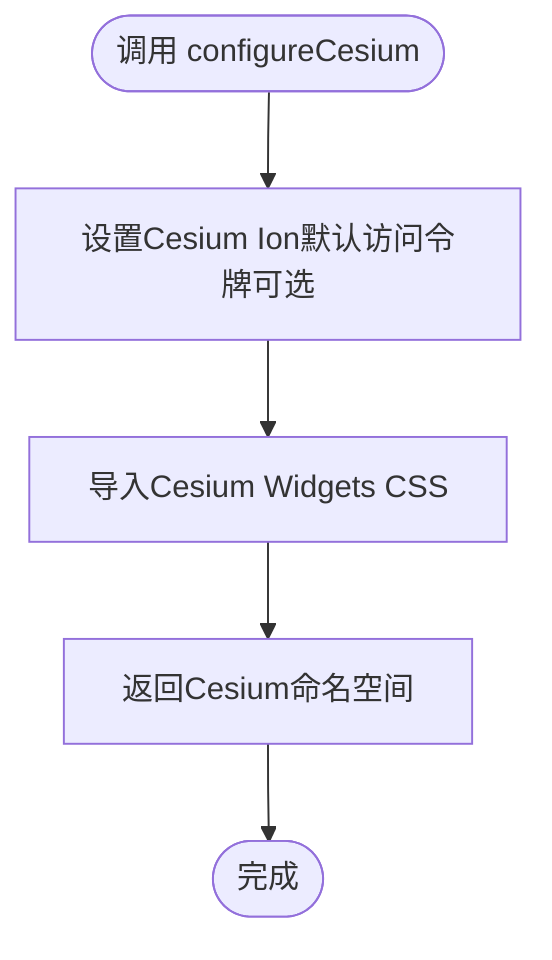
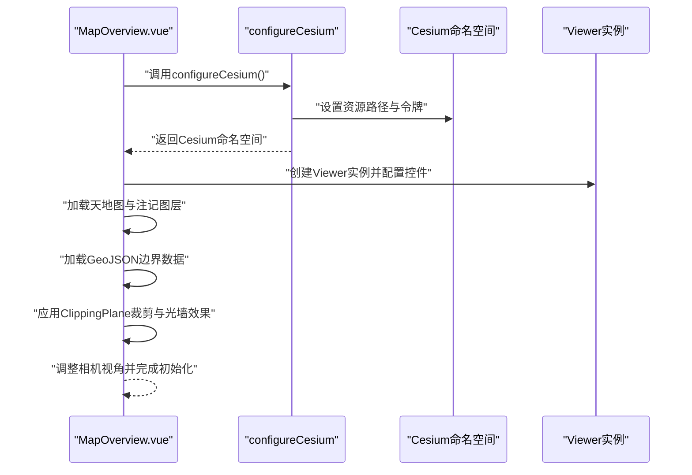
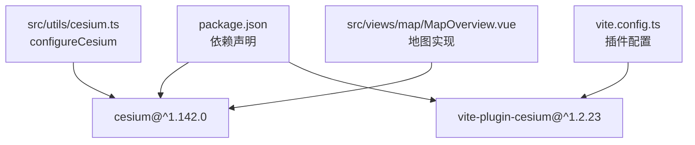

# Cesium配置与初始化

<cite>
**本文档引用的文件**
- [src/utils/cesium.ts](file://src/utils/cesium.ts)
- [vite.config.ts](file://vite.config.ts)
- [package.json](file://package.json)
- [src/views/map/MapOverview.vue](file://src/views/map/MapOverview.vue)
- [docs/CESIUM_GUIDE.md](file://docs/CESIUM_GUIDE.md)
- [index.html](file://index.html)
- [src/config/tianditu.ts](file://src/config/tianditu.ts)
- [DOCUMENTATION_INDEX.md](file://DOCUMENTATION_INDEX.md)
</cite>

## 目录
1. [简介](#简介)
2. [项目结构](#项目结构)
3. [核心组件](#核心组件)
4. [架构总览](#架构总览)
5. [详细组件分析](#详细组件分析)
6. [依赖关系分析](#依赖关系分析)
7. [性能考虑](#性能考虑)
8. [故障排除指南](#故障排除指南)
9. [结论](#结论)
10. [附录](#附录)

## 简介
本文件面向在Vite环境中集成Cesium 3D地图引擎的开发者，系统阐述Cesium在Vite下的兼容性配置、资源路径设置、初始化流程与最佳实践。重点包括：
- configureCesium函数的实现原理与作用域
- Cesium对象的配置选项与默认参数
- Cesium Ion访问令牌的配置方式
- CSS样式的引入与构建工具适配
- 版本兼容性、性能优化与调试模式
- 完整初始化示例与常见配置错误的解决方案

## 项目结构
该项目采用Vue 3 + Vite + TypeScript技术栈，Cesium相关配置集中在工具模块、构建配置与地图视图组件中。

**图表来源**
- [index.html:1-14](file://index.html#L1-L14)
- [src/main.ts:1-26](file://src/main.ts#L1-L26)
- [vite.config.ts:1-68](file://vite.config.ts#L1-L68)
- [src/utils/cesium.ts:1-19](file://src/utils/cesium.ts#L1-L19)
- [src/views/map/MapOverview.vue:1-649](file://src/views/map/MapOverview.vue#L1-L649)
- [docs/CESIUM_GUIDE.md:1-635](file://docs/CESIUM_GUIDE.md#L1-L635)
- [src/config/tianditu.ts:1-28](file://src/config/tianditu.ts#L1-L28)
- [package.json:1-48](file://package.json#L1-L48)

**章节来源**
- [index.html:1-14](file://index.html#L1-L14)
- [src/main.ts:1-26](file://src/main.ts#L1-L26)
- [vite.config.ts:1-68](file://vite.config.ts#L1-L68)
- [src/utils/cesium.ts:1-19](file://src/utils/cesium.ts#L1-L19)
- [src/views/map/MapOverview.vue:1-649](file://src/views/map/MapOverview.vue#L1-L649)
- [docs/CESIUM_GUIDE.md:1-635](file://docs/CESIUM_GUIDE.md#L1-L635)
- [src/config/tianditu.ts:1-28](file://src/config/tianditu.ts#L1-L28)
- [package.json:1-48](file://package.json#L1-L48)

## 核心组件
- configureCesium工具：集中处理Cesium资源路径与可选的Ion令牌配置，返回Cesium命名空间，供业务模块统一使用。
- Vite Cesium插件：通过vite-plugin-cesium自动处理CommonJS/ESM转换、资源路径与代码分割，解决Vite环境下Cesium的兼容性问题。
- 地图视图组件：封装Cesium Viewer初始化、图层配置、数据加载与可视化效果，提供完整的3D地图体验。

**章节来源**
- [src/utils/cesium.ts:1-19](file://src/utils/cesium.ts#L1-L19)
- [vite.config.ts:1-68](file://vite.config.ts#L1-L68)
- [src/views/map/MapOverview.vue:1-649](file://src/views/map/MapOverview.vue#L1-L649)

## 架构总览
Cesium在本项目中的集成遵循“构建期适配 + 运行期配置”的双层策略：
- 构建期：Vite插件自动注入资源路径、处理模块转换，保证Cesium在开发与生产环境均能正确加载。
- 运行期：configureCesium集中设置默认访问令牌与资源路径；地图组件负责Viewer实例化与场景配置。

**图表来源**
- [src/main.ts:1-26](file://src/main.ts#L1-L26)
- [src/utils/cesium.ts:1-19](file://src/utils/cesium.ts#L1-L19)
- [vite.config.ts:1-68](file://vite.config.ts#L1-L68)
- [src/views/map/MapOverview.vue:1-649](file://src/views/map/MapOverview.vue#L1-L649)

## 详细组件分析

### configureCesium函数实现原理
- 职责：集中设置Cesium资源路径与可选的Cesium Ion默认访问令牌，返回Cesium命名空间。
- 资源路径：通过显式导入Cesium Widgets CSS，确保UI控件样式正确加载。
- 环境变量：可通过环境变量注入Cesium Ion令牌，便于在不同环境间切换。
- 返回值：返回Cesium命名空间，供业务模块统一引用。

**图表来源**
- [src/utils/cesium.ts:10-15](file://src/utils/cesium.ts#L10-L15)

**章节来源**
- [src/utils/cesium.ts:1-19](file://src/utils/cesium.ts#L1-L19)

### Cesium对象的配置选项与默认参数
- 资源路径：通过插件自动配置，无需手动指定。
- 访问令牌：可通过环境变量注入，默认为空字符串（禁用）。
- CSS样式：显式导入widgets.css，确保控件样式生效。
- 版本：当前使用Cesium v1.142.0，具备ClippingPlane等高级功能。

**章节来源**
- [src/utils/cesium.ts:6-15](file://src/utils/cesium.ts#L6-L15)
- [docs/CESIUM_GUIDE.md:3-6](file://docs/CESIUM_GUIDE.md#L3-L6)
- [package.json:18](file://package.json#L18)

### Cesium Ion访问令牌配置
- 环境变量方式：在运行时通过环境变量设置默认令牌，便于CI/CD与多环境部署。
- 代码方式：可在configureCesium中直接赋值，适用于临时调试或演示场景。
- 注意事项：令牌需与Cesium平台配置一致，避免跨域与鉴权问题。

**章节来源**
- [src/utils/cesium.ts:11-12](file://src/utils/cesium.ts#L11-L12)
- [src/views/map/MapOverview.vue:79-80](file://src/views/map/MapOverview.vue#L79-L80)

### CSS样式的引入与构建工具适配
- 样式引入：在工具模块与视图组件中分别显式导入widgets.css，确保控件样式可用。
- 构建适配：Vite插件自动处理Cesium资源路径与模块转换，避免CommonJS/ESM冲突。
- 容器样式：视图组件内对Cesium容器进行尺寸与布局控制，并可隐藏版权水印。

**章节来源**
- [src/utils/cesium.ts:7](file://src/utils/cesium.ts#L7)
- [src/views/map/MapOverview.vue:58-59](file://src/views/map/MapOverview.vue#L58-L59)
- [vite.config.ts:16](file://vite.config.ts#L16)
- [src/views/map/MapOverview.vue:625-647](file://src/views/map/MapOverview.vue#L625-L647)

### 初始化流程与最佳实践
- 初始化顺序：先配置Cesium，再创建Viewer，随后加载图层与数据。
- 图层配置：优先使用天地图等第三方底图服务，结合注记层提升可读性。
- 数据加载：使用GeoJSON加载边界数据，结合ClippingPlane实现精确裁剪。
- 性能优化：控制标签显示范围、使用纹理复用、合理设置3D拉伸高度。
- 调试模式：开启帧率显示与控制台日志，便于定位性能瓶颈。

**图表来源**
- [src/views/map/MapOverview.vue:77-124](file://src/views/map/MapOverview.vue#L77-L124)
- [src/utils/cesium.ts:10-15](file://src/utils/cesium.ts#L10-L15)

**章节来源**
- [src/views/map/MapOverview.vue:77-124](file://src/views/map/MapOverview.vue#L77-L124)
- [docs/CESIUM_GUIDE.md:80-99](file://docs/CESIUM_GUIDE.md#L80-L99)

### 天地图配置与集成
- 配置常量：提供天地图API密钥、URL与默认中心点等配置项，便于统一管理。
- 图层实现：在视图组件中配置卫星影像与注记图层，支持最大级别与版权信息。
- Token管理：支持硬编码或从配置文件读取，建议在生产环境使用受控的密钥管理方案。

**章节来源**
- [src/config/tianditu.ts:4-27](file://src/config/tianditu.ts#L4-L27)
- [src/views/map/MapOverview.vue:129-162](file://src/views/map/MapOverview.vue#L129-L162)

### 版本兼容性与功能特性
- 版本：当前使用Cesium v1.142.0，支持ClippingPlaneCollection等高级功能。
- 裁剪功能：通过ClippingPlane实现精确多边形裁剪，支持边缘样式与动画效果。
- 3D效果：结合PolygonGraphics与WallGraphics实现立体拉伸与发光墙效果。
- 性能优化：提供标签显示范围、缩放与深度测试等优化配置。

**章节来源**
- [docs/CESIUM_GUIDE.md:3-6](file://docs/CESIUM_GUIDE.md#L3-L6)
- [docs/CESIUM_GUIDE.md:208-290](file://docs/CESIUM_GUIDE.md#L208-L290)
- [docs/CESIUM_GUIDE.md:520-560](file://docs/CESIUM_GUIDE.md#L520-L560)

## 依赖关系分析
- 依赖管理：Cesium与vite-plugin-cesium在package.json中声明，确保版本兼容与功能可用。
- 构建插件：vite.config.ts中启用vite-plugin-cesium，自动处理Cesium资源路径与模块转换。
- 运行时依赖：configureCesium与视图组件共同依赖Cesium命名空间，形成清晰的分层结构。

**图表来源**
- [package.json:18](file://package.json#L18)
- [package.json:44](file://package.json#L44)
- [vite.config.ts:7](file://vite.config.ts#L7)
- [vite.config.ts:16](file://vite.config.ts#L16)
- [src/utils/cesium.ts:6](file://src/utils/cesium.ts#L6)
- [src/views/map/MapOverview.vue:57](file://src/views/map/MapOverview.vue#L57)

**章节来源**
- [package.json:1-48](file://package.json#L1-L48)
- [vite.config.ts:1-68](file://vite.config.ts#L1-L68)
- [src/utils/cesium.ts:1-19](file://src/utils/cesium.ts#L1-L19)
- [src/views/map/MapOverview.vue:1-649](file://src/views/map/MapOverview.vue#L1-L649)

## 性能考虑
- 标签显示范围：通过DistanceDisplayCondition限制标签显示距离，减少渲染开销。
- 标签缩放：使用NearFarScalar按距离自动缩放标签，提升可读性与性能。
- 深度测试：禁用标签深度测试，确保其始终位于最前端。
- 纹理复用：在创建光墙时复用Canvas纹理，避免重复生成。
- 数据简化：降低GeoJSON精度或数量，减少边界计算与渲染压力。
- 动画与特效：谨慎使用ClippingPlane动画与发光效果，避免帧率下降。

**章节来源**
- [docs/CESIUM_GUIDE.md:522-560](file://docs/CESIUM_GUIDE.md#L522-L560)
- [src/views/map/MapOverview.vue:390-404](file://src/views/map/MapOverview.vue#L390-L404)
- [src/views/map/MapOverview.vue:532-538](file://src/views/map/MapOverview.vue#L532-L538)

## 故障排除指南
- 模块导入错误：出现与mersenne-twister相关的导入错误时，确认已安装并启用vite-plugin-cesium插件。
- 天地图图层无法加载：检查Token是否正确、是否有效以及是否存在CORS问题。
- GeoJSON文件无法显示：确认文件路径、格式与CORS设置，查看浏览器控制台错误信息。
- 性能问题：减少标记点数量、调整标签显示范围、简化数据与禁用不必要的视觉效果。
- TypeScript类型错误：避免直接给Entity属性赋值基础类型，需重新创建Graphics对象。
- 调试技巧：开启帧率显示与控制台日志，检查裁剪状态、实体数量与边缘宽度等关键参数。

**章节来源**
- [docs/CESIUM_GUIDE.md:397-460](file://docs/CESIUM_GUIDE.md#L397-L460)
- [docs/CESIUM_GUIDE.md:562-590](file://docs/CESIUM_GUIDE.md#L562-L590)

## 结论
本项目通过Vite插件与configureCesium工具实现了Cesium在现代前端工程中的无缝集成。借助统一的资源路径配置、可选的访问令牌设置与完善的初始化流程，开发者可以在Vite环境下快速搭建高性能的3D地图应用。配合详细的性能优化与调试指南，能够有效提升开发效率与用户体验。

## 附录
- 相关文档索引：项目文档索引中提供了Cesium配置、集成完成、Vite兼容性修复与版本说明等系列文档，便于进一步查阅与扩展。

**章节来源**
- [DOCUMENTATION_INDEX.md:138-205](file://DOCUMENTATION_INDEX.md#L138-L205)