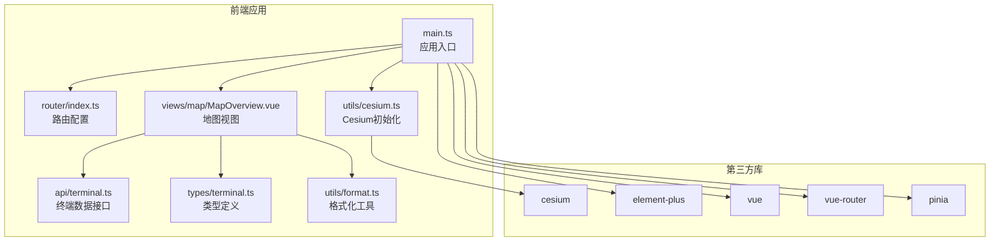
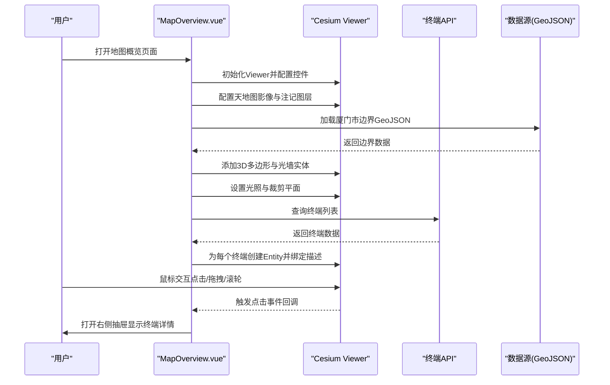
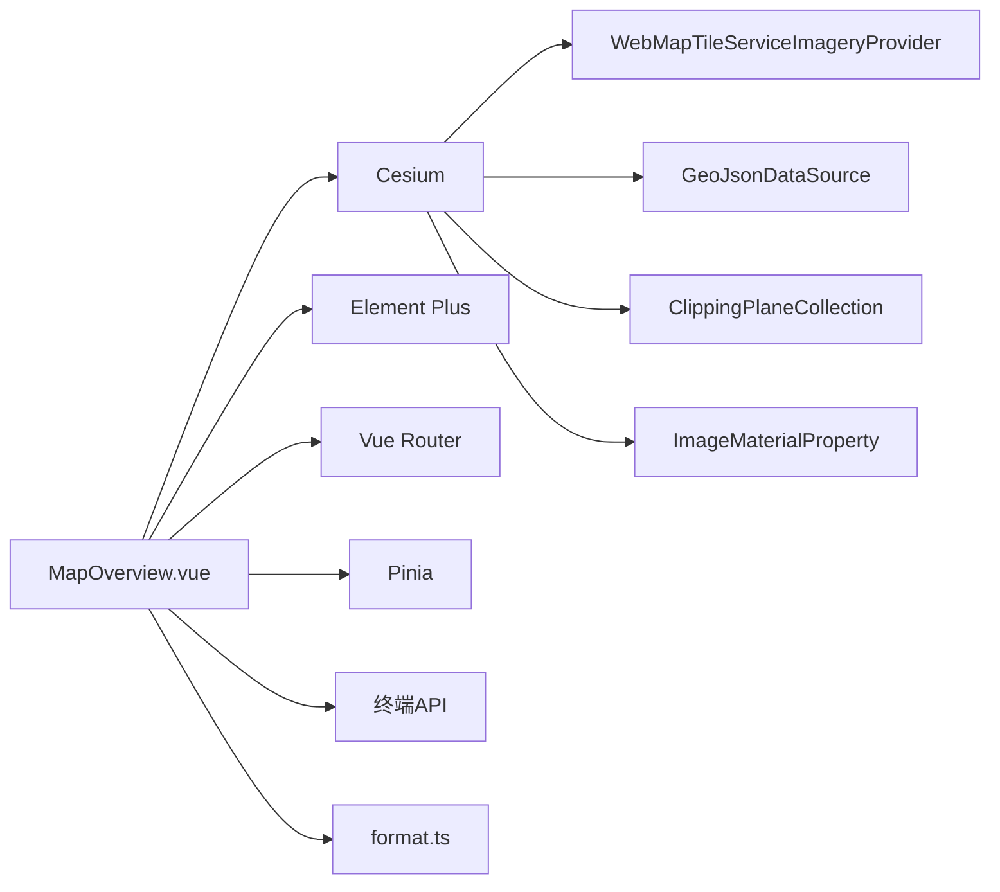

# 地图交互与操作

<cite>
**本文档引用的文件**
- [MapOverview.vue](file://src/views/map/MapOverview.vue)
- [cesium.ts](file://src/utils/cesium.ts)
- [main.ts](file://src/main.ts)
- [router/index.ts](file://src/router/index.ts)
- [terminal.ts](file://src/api/terminal.ts)
- [terminal.ts](file://src/types/terminal.ts)
- [format.ts](file://src/utils/format.ts)
- [vite.config.ts](file://vite.config.ts)
- [package.json](file://package.json)
- [CESIUM_GUIDE.md](file://docs/CESIUM_GUIDE.md)
- [厦门市.geojson](file://厦门市.geojson)
</cite>

## 目录
1. [简介](#简介)
2. [项目结构](#项目结构)
3. [核心组件](#核心组件)
4. [架构总览](#架构总览)
5. [详细组件分析](#详细组件分析)
6. [依赖关系分析](#依赖关系分析)
7. [性能考虑](#性能考虑)
8. [故障排查指南](#故障排查指南)
9. [结论](#结论)
10. [附录](#附录)

## 简介
本文件面向开发者，系统梳理并讲解基于 Cesium 的地图交互与操作功能，包括：
- 地图交互控制：缩放、平移、旋转、视角切换
- 鼠标事件处理：点击、右键菜单、拖拽
- 键盘快捷键支持
- 标注添加、编辑、删除与信息面板
- 测量工具、区域选择与标记
- 动画效果、过渡动画与视觉反馈
- 触摸设备支持、移动端适配与响应式设计

本指南结合项目中的 MapOverview.vue 实现与配套文档，提供从架构到细节的完整说明，并给出优化建议与常见问题排查方法。

## 项目结构
本项目采用 Vue 3 + TypeScript + Vite 架构，地图功能集中在 MapOverview.vue 中，Cesium 初始化与配置位于 utils/cesium.ts，路由与主入口在 router/index.ts 与 main.ts 中。

图表来源
- [main.ts:1-26](file://src/main.ts#L1-L26)
- [router/index.ts:1-136](file://src/router/index.ts#L1-L136)
- [MapOverview.vue:52-623](file://src/views/map/MapOverview.vue#L52-L623)
- [cesium.ts:1-19](file://src/utils/cesium.ts#L1-L19)
- [terminal.ts:1-59](file://src/api/terminal.ts#L1-L59)
- [terminal.ts:1-84](file://src/types/terminal.ts#L1-L84)
- [format.ts:1-102](file://src/utils/format.ts#L1-L102)

章节来源
- [main.ts:1-26](file://src/main.ts#L1-L26)
- [router/index.ts:1-136](file://src/router/index.ts#L1-L136)
- [MapOverview.vue:52-623](file://src/views/map/MapOverview.vue#L52-L623)
- [cesium.ts:1-19](file://src/utils/cesium.ts#L1-L19)
- [terminal.ts:1-59](file://src/api/terminal.ts#L1-L59)
- [terminal.ts:1-84](file://src/types/terminal.ts#L1-L84)
- [format.ts:1-102](file://src/utils/format.ts#L1-L102)

## 核心组件
- 地图视图组件：负责 Viewer 初始化、图层配置、实体标注、交互事件绑定、抽屉信息面板、销毁清理等
- Cesium 初始化工具：统一处理 Cesium 资源路径与兼容性
- 路由与主入口：注册 Element Plus、Vue Router、Pinia，挂载应用
- 终端数据接口与类型：提供终端列表查询、实体类型定义与分页结果类型

章节来源
- [MapOverview.vue:52-623](file://src/views/map/MapOverview.vue#L52-L623)
- [cesium.ts:1-19](file://src/utils/cesium.ts#L1-L19)
- [main.ts:1-26](file://src/main.ts#L1-L26)
- [router/index.ts:1-136](file://src/router/index.ts#L1-L136)
- [terminal.ts:1-59](file://src/api/terminal.ts#L1-L59)
- [terminal.ts:1-84](file://src/types/terminal.ts#L1-L84)

## 架构总览
地图交互架构围绕 Cesium Viewer 展开，通过配置天地图影像与注记图层、加载 GeoJSON 边界、创建 3D 多边形与光墙实体、设置光照与裁剪平面，实现厦门区域的沉浸式可视化。终端点位标注通过 Entity 实现，点击后弹出抽屉式信息面板；组件生命周期内完成 Viewer 的创建与销毁，保证资源释放。

图表来源
- [MapOverview.vue:77-124](file://src/views/map/MapOverview.vue#L77-L124)
- [MapOverview.vue:129-162](file://src/views/map/MapOverview.vue#L129-L162)
- [MapOverview.vue:302-462](file://src/views/map/MapOverview.vue#L302-L462)
- [MapOverview.vue:467-557](file://src/views/map/MapOverview.vue#L467-L557)
- [terminal.ts:16-18](file://src/api/terminal.ts#L16-L18)

## 详细组件分析

### 地图初始化与控件配置
- 初始化 Viewer：启用底图选择器、全屏按钮、地理编码器、场景模式选择器、导航帮助按钮、动画与时间线关闭等
- 设置初始视角：厦门市中心经纬度与高度，设定方向角、俯仰角、翻滚角
- 配置天地图图层：卫星影像与注记双图层叠加，设置最大级别与版权信息
- 加载边界与3D效果：GeoJSON 数据源加载，为每个行政区创建 PolygonGraphics 并设置拉伸高度、轮廓线、分类类型
- 光墙与裁剪：创建 ImageMaterialProperty 发光纹理，沿边界生成垂直墙面；通过 ClippingPlane 实现精确裁剪，突出显示厦门市范围

章节来源
- [MapOverview.vue:77-124](file://src/views/map/MapOverview.vue#L77-L124)
- [MapOverview.vue:129-162](file://src/views/map/MapOverview.vue#L129-L162)
- [MapOverview.vue:302-462](file://src/views/map/MapOverview.vue#L302-L462)
- [MapOverview.vue:467-557](file://src/views/map/MapOverview.vue#L467-L557)

### 鼠标事件与交互
- 点击事件：为每个终端 Entity 设置 description，点击后触发信息框显示；抽屉中展示终端详情并提供“查看详情”跳转
- 右键菜单：当前实现未显式绑定右键菜单，但 Cesium Viewer 默认支持右键平移与上下文菜单，可根据业务扩展
- 拖拽与旋转：Viewer 默认支持鼠标拖拽旋转、滚轮缩放、中键平移等，无需额外绑定
- 抽屉交互：抽屉关闭时清空当前选中终端，避免状态残留

章节来源
- [MapOverview.vue:541-556](file://src/views/map/MapOverview.vue#L541-L556)
- [MapOverview.vue:588-604](file://src/views/map/MapOverview.vue#L588-L604)

### 键盘快捷键支持
- 当前实现未显式绑定键盘快捷键
- 可通过 Cesium 的 Camera 或 Scene 的输入处理器扩展：例如监听键盘事件，实现 W/A/S/D 相机移动、数字键切换图层等
- 建议在组件挂载时注册键盘事件监听，在卸载时移除，避免内存泄漏

章节来源
- [MapOverview.vue:606-622](file://src/views/map/MapOverview.vue#L606-L622)

### 标注的添加、编辑与删除
- 添加：加载终端数据后，遍历列表创建 Entity，设置点位、标签、图标与描述
- 编辑：当前实现未提供直接在地图上编辑终端位置的功能；可在终端管理页面通过“从地图选择”打开独立地图选择器，选择后回填经纬度
- 删除：当前实现未提供直接在地图上删除终端的功能；可在终端管理页面删除对应记录

章节来源
- [MapOverview.vue:490-557](file://src/views/map/MapOverview.vue#L490-L557)
- [MapOverview.vue:588-604](file://src/views/map/MapOverview.vue#L588-L604)

### 弹窗显示与信息面板
- 抽屉式信息面板：右侧滑出，展示终端基本信息与状态，底部提供“查看详情”按钮跳转至终端列表
- 信息格式化：使用 formatDateTime 将时间戳格式化为可读字符串

章节来源
- [MapOverview.vue:6-48](file://src/views/map/MapOverview.vue#L6-L48)
- [MapOverview.vue:588-604](file://src/views/map/MapOverview.vue#L588-L604)
- [format.ts:6-26](file://src/utils/format.ts#L6-L26)

### 测量工具、区域选择与标记
- 测量工具：当前未集成 Cesium 自带测量工具或第三方测量插件
- 区域选择：可通过 ClippingPlane 实现区域裁剪，当前已实现精确多边形裁剪，突出显示厦门市范围
- 标记：终端点位为固定标记；若需动态标记，可在点击地图时创建临时 Entity，并提供确认/取消操作

章节来源
- [MapOverview.vue:206-297](file://src/views/map/MapOverview.vue#L206-L297)
- [MapOverview.vue:302-462](file://src/views/map/MapOverview.vue#L302-L462)

### 动画效果、过渡动画与视觉反馈
- 飞行动画：viewer.flyTo 将相机飞行到边界数据范围，设置持续时间与偏航/俯仰/距离
- 光墙与发光：通过 Canvas 渐变纹理与 ImageMaterialProperty 实现光墙效果
- 裁剪边缘：ClippingPlaneCollection 设置边缘宽度与颜色，形成青色光边
- 视觉反馈：标签禁用深度测试，始终显示在最前；光照增强立体感

章节来源
- [MapOverview.vue:447-455](file://src/views/map/MapOverview.vue#L447-L455)
- [MapOverview.vue:168-199](file://src/views/map/MapOverview.vue#L168-L199)
- [MapOverview.vue:283-296](file://src/views/map/MapOverview.vue#L283-L296)
- [MapOverview.vue:430-436](file://src/views/map/MapOverview.vue#L430-L436)

### 触摸设备支持、移动端适配与响应式设计
- 触摸支持：Cesium Viewer 默认支持触摸手势（缩放、旋转、平移），无需额外配置
- 响应式布局：地图容器使用百分比尺寸，配合 SCSS 样式使地图随窗口变化自适应
- 移动端适配：建议在移动端开启移动端优化选项（如禁用部分控件、简化标签显示范围）

章节来源
- [MapOverview.vue:625-649](file://src/views/map/MapOverview.vue#L625-L649)

## 依赖关系分析
- Cesium：地图引擎，提供 Viewer、Entity、Graphics、ClippingPlane、ImageMaterialProperty 等能力
- Element Plus：UI 组件库，提供抽屉、描述列表、按钮等
- Vue Router：路由管理，控制页面跳转与权限
- Pinia：状态管理，便于跨组件共享状态
- 天地图：通过 WebMapTileServiceImageryProvider 加载卫星影像与注记

图表来源
- [MapOverview.vue:52-623](file://src/views/map/MapOverview.vue#L52-L623)
- [terminal.ts:16-18](file://src/api/terminal.ts#L16-L18)
- [format.ts:1-102](file://src/utils/format.ts#L1-L102)

章节来源
- [MapOverview.vue:52-623](file://src/views/map/MapOverview.vue#L52-L623)
- [terminal.ts:1-59](file://src/api/terminal.ts#L1-L59)
- [format.ts:1-102](file://src/utils/format.ts#L1-L102)

## 性能考虑
- 标签显示范围：通过 distanceDisplayCondition 控制标签显示距离，减少渲染压力
- 标签缩放：使用 NearFarScalar 根据距离自动缩放标签
- 深度测试：禁用标签深度测试，确保始终在最前显示
- 纹理复用：创建一次发光纹理并在多个光墙实体中复用
- 裁剪平面数量：裁剪平面数量与边界点数成正比，注意性能影响
- 飞行动画：合理设置飞行持续时间与偏航/俯仰，避免过度动画导致卡顿

章节来源
- [MapOverview.vue:447-455](file://src/views/map/MapOverview.vue#L447-L455)
- [MapOverview.vue:168-199](file://src/views/map/MapOverview.vue#L168-L199)
- [MapOverview.vue:283-296](file://src/views/map/MapOverview.vue#L283-L296)

## 故障排查指南
- Cesium 模块导入错误：确保使用 vite-plugin-cesium 插件并正确配置
- 天地图图层无法加载：检查 tiandituToken 是否正确、是否存在跨域问题
- GeoJSON 文件路径错误：确认厦门市.geojson 文件存在于项目根目录且格式正确
- 性能问题：减少同时显示的标记点数量、调整标签显示范围与简化数据
- TypeScript 类型错误：重新创建 Graphics 对象而非直接赋值基础类型属性

章节来源
- [CESIUM_GUIDE.md:397-459](file://docs/CESIUM_GUIDE.md#L397-L459)

## 结论
本项目基于 Cesium 实现了完整的地图交互与可视化功能，涵盖底图配置、边界加载、3D 效果、光墙与裁剪、终端标注与信息面板等。通过合理的性能优化与响应式设计，能够在桌面与移动端提供良好的用户体验。未来可进一步扩展键盘快捷键、测量工具、区域选择与动态标记等功能，以满足更复杂的业务需求。

## 附录
- Vite 配置：vite.config.ts 中引入 vite-plugin-cesium 插件，自动处理 Cesium 资源路径与兼容性
- 依赖安装：package.json 中包含 cesium、@types/cesium、vite-plugin-cesium 等依赖

章节来源
- [vite.config.ts](file://vite.config.ts)
- [package.json:14-46](file://package.json#L14-L46)