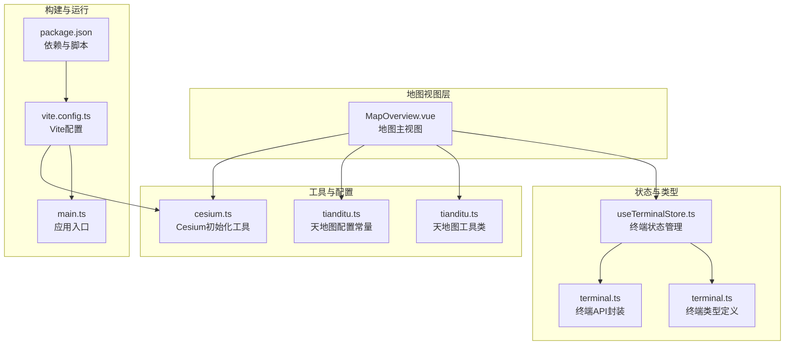
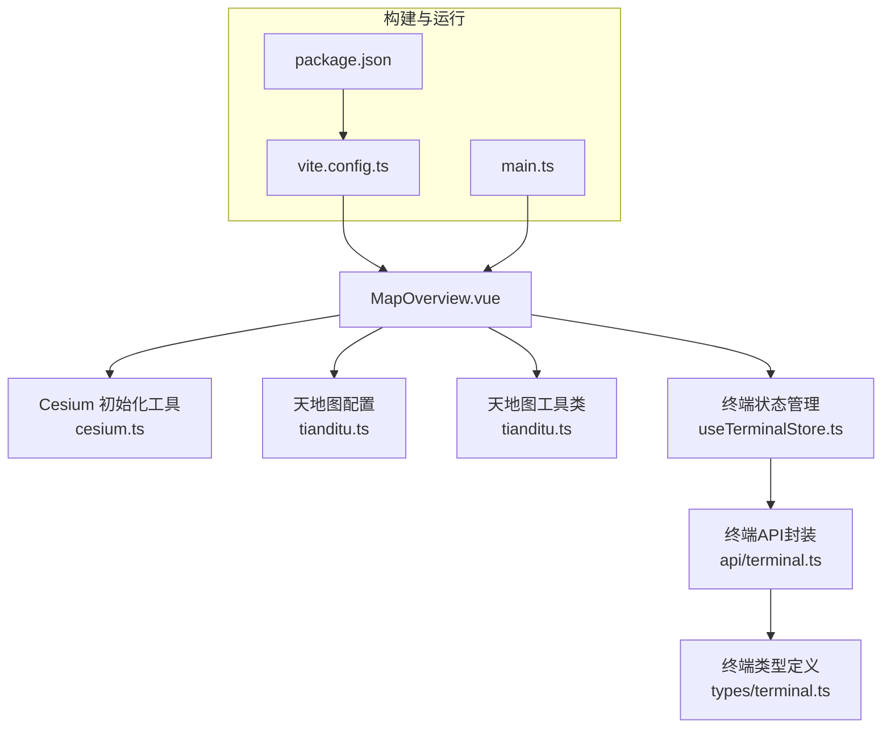
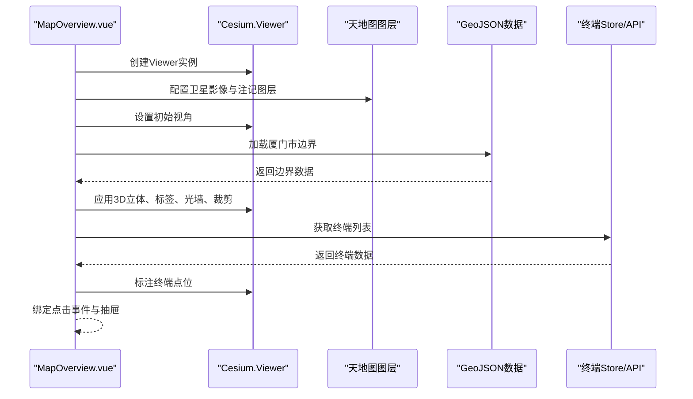
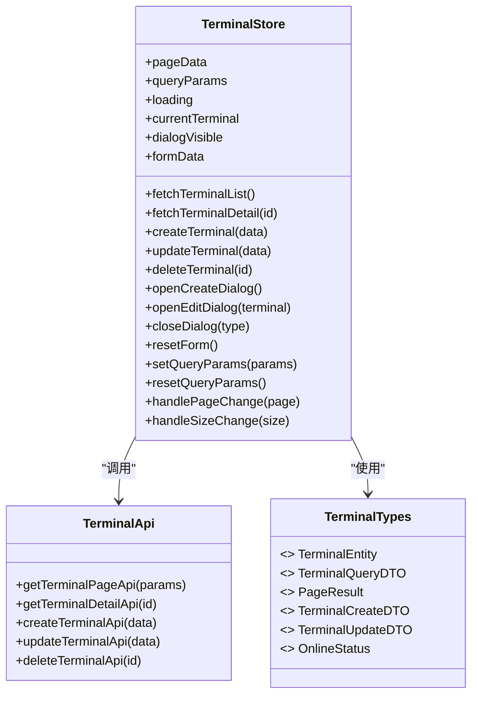
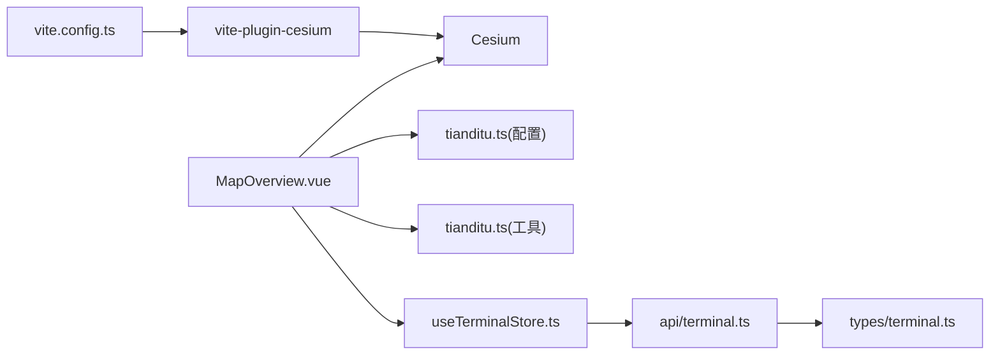

# 地图集成

<cite>
**本文档引用的文件**
- [src/utils/cesium.ts](file://src/utils/cesium.ts)
- [src/config/tianditu.ts](file://src/config/tianditu.ts)
- [src/utils/tianditu.ts](file://src/utils/tianditu.ts)
- [src/views/map/MapOverview.vue](file://src/views/map/MapOverview.vue)
- [src/stores/useTerminalStore.ts](file://src/stores/useTerminalStore.ts)
- [src/types/terminal.ts](file://src/types/terminal.ts)
- [src/api/terminal.ts](file://src/api/terminal.ts)
- [docs/CESIUM_GUIDE.md](file://docs/CESIUM_GUIDE.md)
- [docs/GUIDE.md](file://docs/GUIDE.md)
- [vite.config.ts](file://vite.config.ts)
- [src/main.ts](file://src/main.ts)
- [package.json](file://package.json)
- [厦门市.geojson](file://厦门市.geojson)
</cite>

## 目录
1. [简介](#简介)
2. [项目结构](#项目结构)
3. [核心组件](#核心组件)
4. [架构总览](#架构总览)
5. [详细组件分析](#详细组件分析)
6. [依赖关系分析](#依赖关系分析)
7. [性能考虑](#性能考虑)
8. [故障排查指南](#故障排查指南)
9. [结论](#结论)
10. [附录](#附录)

## 简介
本文件面向水文监测管理系统中的地图集成模块，系统性阐述 Cesium 3D 地图引擎的集成方式、天地图服务的配置与地图功能实现，覆盖地图初始化、图层管理、交互操作、性能优化、终端设备标注、区域边界显示与动态更新机制、坐标系统与投影转换、精度控制、扩展方案与自定义标注、特殊效果实现、业务数据融合与实时/历史数据可视化等内容。文档旨在为开发者提供从零到一的地图开发指南与最佳实践。

## 项目结构
地图相关的核心文件集中在 views/map、utils、config、stores、types、api 等目录中，并通过 Vite 插件与依赖配置实现 Cesium 的兼容性与按需加载。

图表来源
- [src/views/map/MapOverview.vue:1-649](file://src/views/map/MapOverview.vue#L1-L649)
- [src/utils/cesium.ts:1-19](file://src/utils/cesium.ts#L1-L19)
- [src/config/tianditu.ts:1-28](file://src/config/tianditu.ts#L1-L28)
- [src/utils/tianditu.ts:1-68](file://src/utils/tianditu.ts#L1-L68)
- [src/stores/useTerminalStore.ts:1-294](file://src/stores/useTerminalStore.ts#L1-L294)
- [src/types/terminal.ts:1-84](file://src/types/terminal.ts#L1-L84)
- [src/api/terminal.ts:1-59](file://src/api/terminal.ts#L1-L59)
- [vite.config.ts:1-68](file://vite.config.ts#L1-L68)
- [src/main.ts:1-26](file://src/main.ts#L1-L26)
- [package.json:1-48](file://package.json#L1-L48)

章节来源
- [src/views/map/MapOverview.vue:1-649](file://src/views/map/MapOverview.vue#L1-L649)
- [vite.config.ts:1-68](file://vite.config.ts#L1-L68)
- [package.json:1-48](file://package.json#L1-L48)

## 核心组件
- Cesium 初始化与兼容性：通过工具函数统一配置 Cesium 资源路径与可选的 Cesium Ion 访问令牌，保证 Vite 环境下的模块兼容。
- 天地图配置与图层：集中配置天地图 API Key、服务地址、默认中心点与缩放级别；在地图中加载天地图卫星影像与注记图层。
- 地图主视图：负责 Viewer 初始化、底图配置、厦门市边界加载与3D立体效果、光墙与裁剪效果、终端标注与抽屉详情交互。
- 终端状态管理：封装终端分页查询、详情、增删改等操作，支撑地图标注与详情联动。
- 类型与API：定义终端实体与查询参数类型，封装终端接口调用，确保数据一致性与类型安全。

章节来源
- [src/utils/cesium.ts:1-19](file://src/utils/cesium.ts#L1-L19)
- [src/config/tianditu.ts:1-28](file://src/config/tianditu.ts#L1-L28)
- [src/utils/tianditu.ts:1-68](file://src/utils/tianditu.ts#L1-L68)
- [src/views/map/MapOverview.vue:77-124](file://src/views/map/MapOverview.vue#L77-L124)
- [src/stores/useTerminalStore.ts:23-294](file://src/stores/useTerminalStore.ts#L23-L294)
- [src/types/terminal.ts:6-84](file://src/types/terminal.ts#L6-L84)
- [src/api/terminal.ts:16-59](file://src/api/terminal.ts#L16-L59)

## 架构总览
地图模块采用“视图组件 + 工具函数 + 配置常量 + 状态管理 + 类型与API”的分层设计，Cesium 与天地图服务通过独立工具与配置模块解耦，便于扩展与维护。

图表来源
- [src/views/map/MapOverview.vue:1-649](file://src/views/map/MapOverview.vue#L1-L649)
- [src/utils/cesium.ts:1-19](file://src/utils/cesium.ts#L1-L19)
- [src/config/tianditu.ts:1-28](file://src/config/tianditu.ts#L1-L28)
- [src/utils/tianditu.ts:1-68](file://src/utils/tianditu.ts#L1-L68)
- [src/stores/useTerminalStore.ts:1-294](file://src/stores/useTerminalStore.ts#L1-L294)
- [src/api/terminal.ts:1-59](file://src/api/terminal.ts#L1-L59)
- [src/types/terminal.ts:1-84](file://src/types/terminal.ts#L1-L84)
- [vite.config.ts:1-68](file://vite.config.ts#L1-L68)
- [src/main.ts:1-26](file://src/main.ts#L1-L26)
- [package.json:1-48](file://package.json#L1-L48)

## 详细组件分析

### Cesium 初始化与兼容性
- 作用：解决 Vite + Cesium 的兼容性问题，设置 Cesium 资源路径，可选配置 Cesium Ion 访问令牌。
- 关键点：
  - 导入 Cesium 与 Widgets 样式。
  - 返回 Cesium 实例供其他模块使用。
- 适用场景：在任意需要使用 Cesium 的组件或工具中统一初始化。

章节来源
- [src/utils/cesium.ts:1-19](file://src/utils/cesium.ts#L1-L19)

### 天地图配置与工具
- 配置项：API Key、API 地址、默认中心点、默认缩放级别、定位缩放级别。
- 工具类：封装天地图 API 脚本加载、可用性检查与实例获取，避免重复加载与异步错误。

章节来源
- [src/config/tianditu.ts:4-27](file://src/config/tianditu.ts#L4-L27)
- [src/utils/tianditu.ts:14-68](file://src/utils/tianditu.ts#L14-L68)

### 地图主视图（MapOverview）
- 初始化流程：
  - 创建 Viewer 实例，配置控件与场景参数。
  - 配置天地图影像与注记图层。
  - 设置初始视角（厦门中心）。
  - 加载厦门市边界 GeoJSON，设置3D立体、标签、光墙与裁剪效果。
  - 加载终端数据并在地图上标注。
- 图层管理：
  - 移除默认底图，添加天地图卫星影像与注记图层，设置最大级别与版权信息。
- 区域边界与效果：
  - 读取 GeoJSON 文件，使用 GeoJsonDataSource 加载。
  - 为每个行政区创建 PolygonGraphics 并设置拉伸高度、轮廓与半透明填充。
  - 生成光墙实体沿边界垂直墙，使用 ImageMaterialProperty 与自定义发光纹理。
  - 可选裁剪效果：通过 ClippingPlaneCollection 对地球进行多边形裁剪，实现“悬浮岛”视觉效果。
- 终端标注与交互：
  - 通过终端 Store 获取终端列表，按在线状态设置点位颜色。
  - 使用 Entity 的 point、label、billboard 标注点位，贴地显示。
  - 点击实体弹出描述信息抽屉，支持查看详情跳转。
- 生命周期：
  - onMounted 初始化地图，onUnmounted 清理标记与销毁 Viewer。

图表来源
- [src/views/map/MapOverview.vue:77-124](file://src/views/map/MapOverview.vue#L77-L124)
- [src/views/map/MapOverview.vue:129-162](file://src/views/map/MapOverview.vue#L129-L162)
- [src/views/map/MapOverview.vue:302-462](file://src/views/map/MapOverview.vue#L302-L462)
- [src/views/map/MapOverview.vue:467-557](file://src/views/map/MapOverview.vue#L467-L557)

章节来源
- [src/views/map/MapOverview.vue:77-124](file://src/views/map/MapOverview.vue#L77-L124)
- [src/views/map/MapOverview.vue:129-162](file://src/views/map/MapOverview.vue#L129-L162)
- [src/views/map/MapOverview.vue:302-462](file://src/views/map/MapOverview.vue#L302-L462)
- [src/views/map/MapOverview.vue:467-557](file://src/views/map/MapOverview.vue#L467-L557)

### 终端状态管理与API
- 状态管理：封装分页查询、详情、创建、更新、删除等动作，维护 loading、dialogVisible、formData 等状态。
- 类型定义：明确终端实体、查询参数、分页结果与在线状态枚举。
- API 封装：提供分页查询、详情、增删改接口，统一响应拦截与错误提示。

图表来源
- [src/stores/useTerminalStore.ts:23-294](file://src/stores/useTerminalStore.ts#L23-L294)
- [src/api/terminal.ts:16-59](file://src/api/terminal.ts#L16-L59)
- [src/types/terminal.ts:6-84](file://src/types/terminal.ts#L6-L84)

章节来源
- [src/stores/useTerminalStore.ts:23-294](file://src/stores/useTerminalStore.ts#L23-L294)
- [src/api/terminal.ts:16-59](file://src/api/terminal.ts#L16-L59)
- [src/types/terminal.ts:6-84](file://src/types/terminal.ts#L6-L84)

### 地图坐标系统、投影与精度控制
- 坐标系统：Cesium 默认使用 WGS84 地心坐标系（Cartesian3），地图标注与边界均基于经纬度（度）转换为笛卡尔坐标。
- 投影转换：Cesium 内部进行球面到平面的投影与渲染，无需额外配置。
- 精度控制：
  - GeoJSON 边界精度取决于厦门市.geojson 文件的坐标精度。
  - 标注点位精度由终端经纬度字段决定，建议保留小数位至 6 位以满足水文监测需求。
  - 光墙与裁剪效果的精度受边界点数量与 ClippingPlane 数量影响，可通过简化边界或降低裁剪平面密度优化性能。

章节来源
- [src/views/map/MapOverview.vue:302-462](file://src/views/map/MapOverview.vue#L302-L462)
- [src/views/map/MapOverview.vue:467-557](file://src/views/map/MapOverview.vue#L467-L557)

### 动态更新机制
- 实时数据：终端 Store 提供分页查询与详情接口，地图通过加载终端数据并标注点位实现动态更新。
- 历史数据：当前地图视图未直接展示历史数据，可在数据模块中实现时间轴与历史轨迹可视化，再与地图联动。
- 状态联动：终端在线状态影响点位颜色，抽屉详情支持跳转到终端管理页面。

章节来源
- [src/stores/useTerminalStore.ts:69-180](file://src/stores/useTerminalStore.ts#L69-L180)
- [src/views/map/MapOverview.vue:467-557](file://src/views/map/MapOverview.vue#L467-L557)

### 自定义标注与特殊效果
- 自定义标注：通过 Entity 的 point、label、billboard 组合实现点位、标签与图标标注，支持贴地显示与距离条件显示。
- 特殊效果：
  - 光墙：沿边界创建垂直墙，使用 ImageMaterialProperty 与自定义发光纹理。
  - 裁剪：通过 ClippingPlaneCollection 对地球进行多边形裁剪，实现“悬浮岛”效果。
  - 3D 立体：为 PolygonGraphics 设置 extrudedHeight 实现拉伸，配合光照增强立体感。

章节来源
- [src/views/map/MapOverview.vue:168-199](file://src/views/map/MapOverview.vue#L168-L199)
- [src/views/map/MapOverview.vue:206-297](file://src/views/map/MapOverview.vue#L206-L297)
- [src/views/map/MapOverview.vue:344-387](file://src/views/map/MapOverview.vue#L344-L387)

### 地图与业务数据的结合
- 数据来源：终端 Store 通过 API 获取终端列表，地图加载后在实体上绑定描述信息与点击事件。
- 交互流程：点击点位弹出抽屉，展示终端详情，支持查看详情跳转。
- 扩展思路：将实时水位、流量等业务指标映射到点位颜色、尺寸或标签，实现数据驱动的可视化。

章节来源
- [src/views/map/MapOverview.vue:542-556](file://src/views/map/MapOverview.vue#L542-L556)
- [src/stores/useTerminalStore.ts:69-180](file://src/stores/useTerminalStore.ts#L69-L180)

## 依赖关系分析
- Cesium 与 Vite：通过 vite-plugin-cesium 插件自动处理 CommonJS/ESM 转换与资源路径，提升兼容性与开发体验。
- 天地图服务：通过配置常量与工具类加载天地图脚本与图层，避免硬编码与重复加载。
- 终端数据：通过 Pinia Store 与 API 封装实现数据的统一管理与响应式更新。

图表来源
- [vite.config.ts:1-68](file://vite.config.ts#L1-L68)
- [src/views/map/MapOverview.vue:1-649](file://src/views/map/MapOverview.vue#L1-L649)
- [src/utils/tianditu.ts:1-68](file://src/utils/tianditu.ts#L1-L68)
- [src/stores/useTerminalStore.ts:1-294](file://src/stores/useTerminalStore.ts#L1-L294)
- [src/api/terminal.ts:1-59](file://src/api/terminal.ts#L1-L59)
- [src/types/terminal.ts:1-84](file://src/types/terminal.ts#L1-L84)

章节来源
- [vite.config.ts:1-68](file://vite.config.ts#L1-L68)
- [package.json:14-46](file://package.json#L14-L46)

## 性能考虑
- 标签显示范围：通过 distanceDisplayCondition 控制标签显示距离，减少渲染负担。
- 标签缩放：使用 NearFarScalar 根据距离自动缩放标签大小。
- 深度测试：对标签禁用深度测试，确保始终在最前面显示。
- 纹理复用：在函数外部创建发光纹理并复用，避免重复创建。
- 裁剪平面数量：裁剪平面数量与边界点数量成正比，过多会影响性能，可通过简化边界或降低密度优化。
- 相机视角：合理设置飞行时长与偏航角，平衡视觉效果与性能。

章节来源
- [src/views/map/MapOverview.vue:529-531](file://src/views/map/MapOverview.vue#L529-L531)
- [src/views/map/MapOverview.vue:194-196](file://src/views/map/MapOverview.vue#L194-L196)
- [src/views/map/MapOverview.vue:430-432](file://src/views/map/MapOverview.vue#L430-L432)
- [docs/CESIUM_GUIDE.md:520-560](file://docs/CESIUM_GUIDE.md#L520-L560)

## 故障排查指南
- Cesium 模块导入错误：确认已安装并启用 vite-plugin-cesium 插件。
- 天地图图层无法加载：检查 tiandituToken 是否正确、Token 是否有效、是否存在 CORS 错误。
- 厦门市边界无法显示：确认厦门市.geojson 文件存在、文件格式正确、无 CORS 错误。
- 性能问题：减少同时显示的标记点数量、调整标签显示距离、简化 GeoJSON 数据、禁用不必要的视觉效果。
- TypeScript 类型错误：重新创建 Graphics 对象而非直接赋值基础类型属性。

章节来源
- [docs/CESIUM_GUIDE.md:397-460](file://docs/CESIUM_GUIDE.md#L397-L460)
- [docs/GUIDE.md:174-270](file://docs/GUIDE.md#L174-L270)

## 结论
本地图集成方案通过 Cesium 3D 引擎与天地图服务的组合，实现了厦门市边界3D立体展示、光墙与裁剪特效、终端设备标注与详情交互。借助 Pinia Store 与 API 封装，实现了业务数据与地图的紧密耦合。通过合理的性能优化策略与扩展方案，可进一步支持实时与历史数据的可视化展示，满足水文监测管理系统的复杂需求。

## 附录
- 快速开始与依赖安装：参见 Cesium 开发指南与项目启动指南。
- Vite 配置：启用 vite-plugin-cesium 插件，自动处理 Cesium 兼容性。
- 天地图 Token 配置：在 MapOverview.vue 中替换为实际 Token。
- GeoJSON 文件：确保项目根目录包含厦门市.geojson 文件。

章节来源
- [docs/CESIUM_GUIDE.md:22-76](file://docs/CESIUM_GUIDE.md#L22-L76)
- [docs/GUIDE.md:9-68](file://docs/GUIDE.md#L9-L68)
- [vite.config.ts:14-27](file://vite.config.ts#L14-L27)
- [src/views/map/MapOverview.vue:60-64](file://src/views/map/MapOverview.vue#L60-L64)