# 天地图服务集成

<cite>
**本文档引用的文件**
- [tianditu.ts](file://src/config/tianditu.ts)
- [tianditu.ts](file://src/utils/tianditu.ts)
- [MapOverview.vue](file://src/views/map/MapOverview.vue)
- [TerminalList.vue](file://src/views/terminal/TerminalList.vue)
- [cesium.ts](file://src/utils/cesium.ts)
- [vite.config.ts](file://vite.config.ts)
- [package.json](file://package.json)
- [main.ts](file://src/main.ts)
</cite>

## 目录
1. [简介](#简介)
2. [项目结构](#项目结构)
3. [核心组件](#核心组件)
4. [架构概览](#架构概览)
5. [详细组件分析](#详细组件分析)
6. [依赖关系分析](#依赖关系分析)
7. [性能考虑](#性能考虑)
8. [故障排除指南](#故障排除指南)
9. [结论](#结论)

## 简介

本文档详细介绍了天地图服务在Hydro Monitor前端项目中的集成实现。项目采用现代化的Vue 3 + TypeScript技术栈，集成了Cesium三维地球引擎和天地图Web服务，提供了完整的地图底图服务、坐标系转换、投影系统以及丰富的可视化效果。

天地图是中国地质调查局提供的国家地理信息公共服务平台，支持多种地图服务类型，包括卫星影像、街道地图、地形图等。本项目通过两种方式实现了天地图的集成：Cesium WebMapTileServiceImageryProvider用于三维地球场景，以及传统的天地图JavaScript API用于二维地图选择器。

## 项目结构

项目采用模块化的组织方式，主要分为以下几个核心部分：

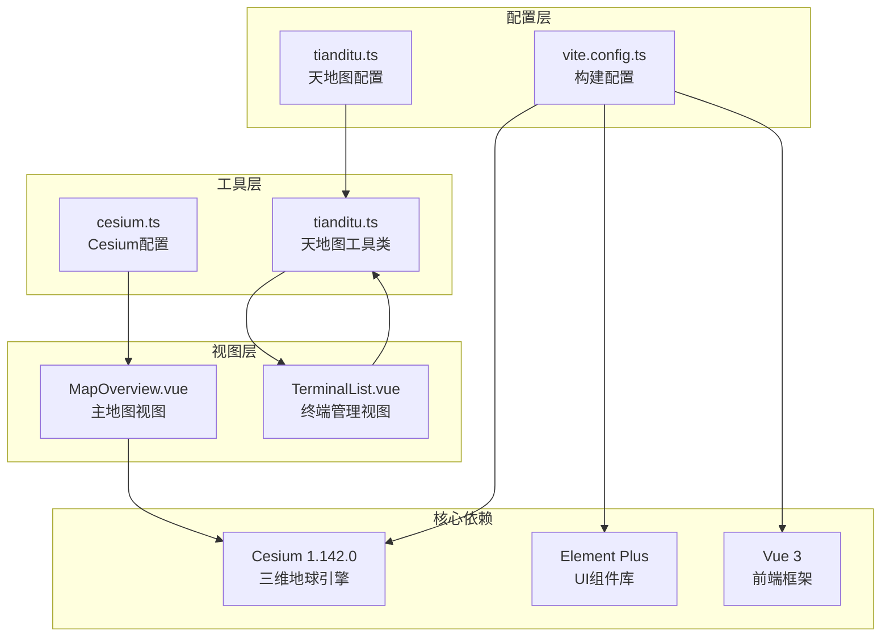

**图表来源**
- [tianditu.ts:1-28](file://src/config/tianditu.ts#L1-L28)
- [vite.config.ts:1-68](file://vite.config.ts#L1-L68)
- [MapOverview.vue:1-649](file://src/views/map/MapOverview.vue#L1-L649)

**章节来源**
- [tianditu.ts:1-28](file://src/config/tianditu.ts#L1-L28)
- [vite.config.ts:1-68](file://vite.config.ts#L1-L68)
- [package.json:1-48](file://package.json#L1-L48)

## 核心组件

### 天地图配置管理

项目通过集中式的配置文件管理天地图的所有参数设置：

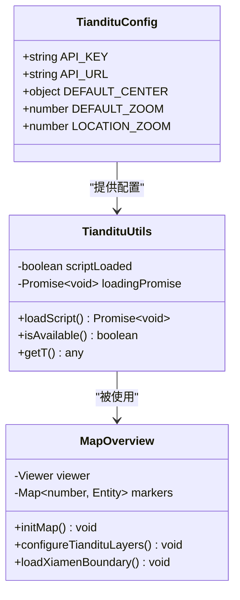

**图表来源**
- [tianditu.ts:4-27](file://src/config/tianditu.ts#L4-L27)
- [tianditu.ts:7-67](file://src/utils/tianditu.ts#L7-L67)
- [MapOverview.vue:77-162](file://src/views/map/MapOverview.vue#L77-L162)

### Cesium集成配置

项目使用专门的工具类来处理Cesium的初始化和配置：

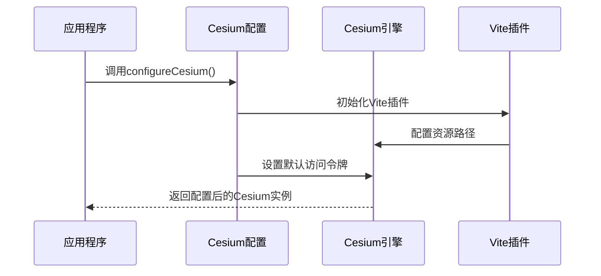

**图表来源**
- [cesium.ts:9-15](file://src/utils/cesium.ts#L9-L15)
- [vite.config.ts:7-16](file://vite.config.ts#L7-L16)

**章节来源**
- [tianditu.ts:4-27](file://src/config/tianditu.ts#L4-L27)
- [tianditu.ts:7-67](file://src/utils/tianditu.ts#L7-L67)
- [cesium.ts:1-19](file://src/utils/cesium.ts#L1-L19)

## 架构概览

项目采用双层地图服务架构，既支持传统的二维地图选择器，又提供高级的三维地球可视化：

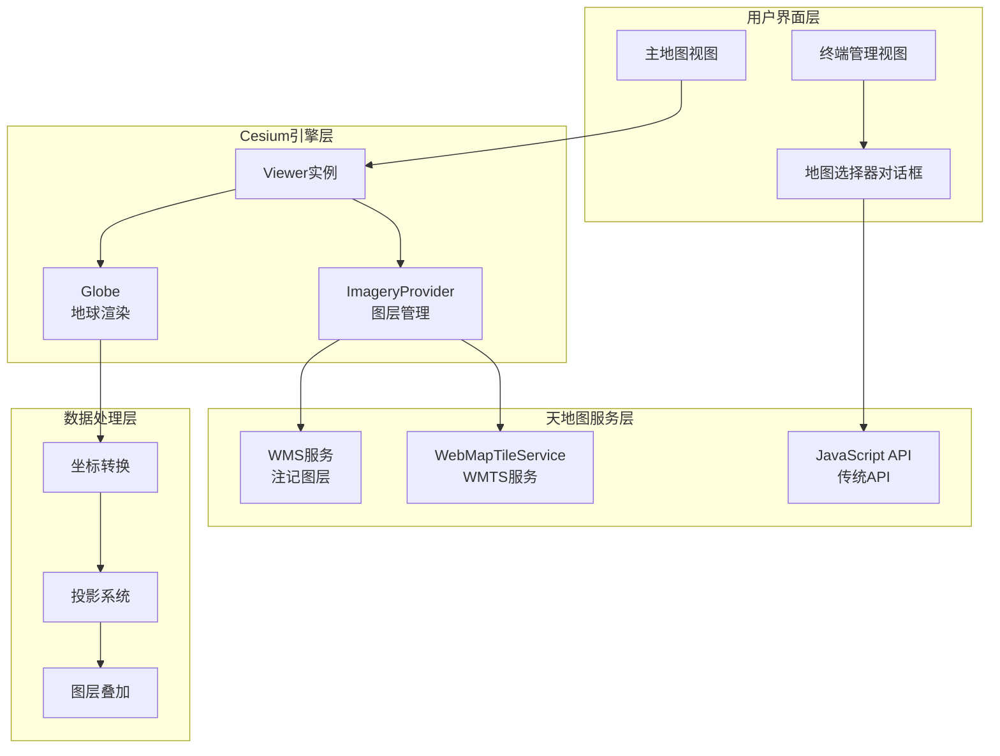

**图表来源**
- [MapOverview.vue:100-162](file://src/views/map/MapOverview.vue#L100-L162)
- [TerminalList.vue:1190-1243](file://src/views/terminal/TerminalList.vue#L1190-L1243)

## 详细组件分析

### 天地图配置系统

#### API密钥配置

天地图API密钥是访问服务的关键凭证，项目提供了灵活的配置方式：

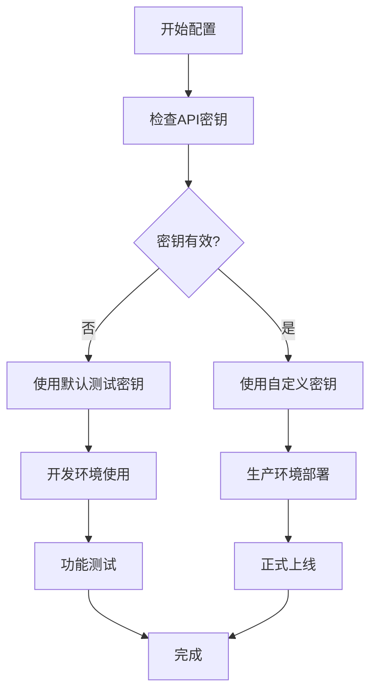

**图表来源**
- [tianditu.ts:5-7](file://src/config/tianditu.ts#L5-L7)

#### 服务地址设置

项目支持多种天地图服务地址配置，包括官方API和本地部署选项：

| 配置项 | 服务类型 | URL格式 | 用途 |
|--------|----------|---------|------|
| API_URL | 官方API | `https://api.tianditu.gov.cn/api?v=4.0` | 主要API服务 |
| WMTS服务 | 卫星影像 | `http://t0.tianditu.gov.cn/img_w/wmts` | 影像底图 |
| WMTS服务 | 注记图层 | `http://t0.tianditu.gov.cn/cia_w/wmts` | 地名标注 |

**章节来源**
- [tianditu.ts:9-12](file://src/config/tianditu.ts#L9-L12)

### Cesium天地图集成

#### 图层添加流程

项目通过Cesium的WebMapTileServiceImageryProvider实现天地图的无缝集成：

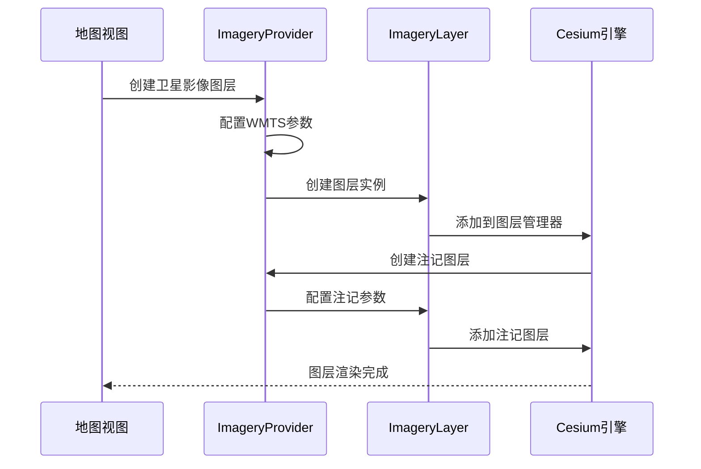

**图表来源**
- [MapOverview.vue:129-162](file://src/views/map/MapOverview.vue#L129-L162)

#### 图层类型选择

项目实现了多种天地图图层类型的组合使用：

| 图层类型 | 服务URL | 功能描述 | 最大缩放级别 |
|----------|---------|----------|-------------|
| 卫星影像 | `img_w` | 高分辨率卫星图片 | 18级 |
| 注记图层 | `cia_w` | 地名、道路标注 | 18级 |
| 街道地图 | `vec_w` | 街景地图服务 | 18级 |
| 道路网络 | `ter_w` | 地形和道路 | 18级 |

**章节来源**
- [MapOverview.vue:138-161](file://src/views/map/MapOverview.vue#L138-L161)

### 天地图JavaScript API集成

#### 地图选择器实现

项目在终端管理界面中集成了天地图JavaScript API，提供直观的地图选择功能：

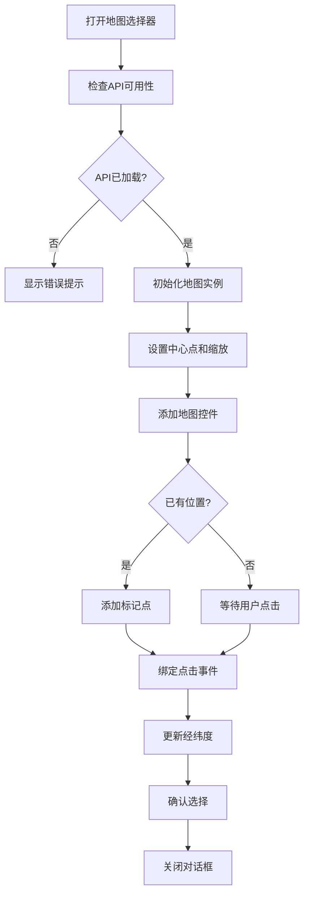

**图表来源**
- [TerminalList.vue:1190-1243](file://src/views/terminal/TerminalList.vue#L1190-L1243)

**章节来源**
- [TerminalList.vue:1190-1243](file://src/views/terminal/TerminalList.vue#L1190-L1243)

### 坐标系转换和投影系统

#### WGS84坐标系支持

项目全面支持WGS84地理坐标系，确保与天地图服务的完美兼容：

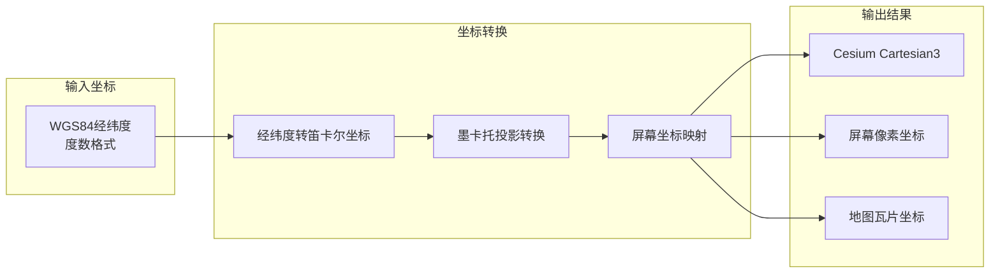

**图表来源**
- [MapOverview.vue:104-111](file://src/views/map/MapOverview.vue#L104-L111)

#### 投影系统配置

项目针对不同应用场景配置了合适的投影系统：

| 应用场景 | 投影类型 | 参数配置 | 适用范围 |
|----------|----------|----------|----------|
| 三维地球 | WGS84椭球体 | Web Mercator | 全球范围 |
| 二维地图 | 平面投影 | 等距圆锥 | 区域范围 |
| 数据标注 | 笛卡尔坐标 | 直角坐标系 | 局部区域 |

**章节来源**
- [MapOverview.vue:104-111](file://src/views/map/MapOverview.vue#L104-L111)

### 多图层叠加效果

#### 光墙效果实现

项目实现了创新的光墙视觉效果，通过ImageMaterialProperty创建动态发光纹理：

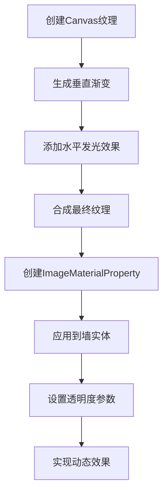

**图表来源**
- [MapOverview.vue:168-199](file://src/views/map/MapOverview.vue#L168-L199)

**章节来源**
- [MapOverview.vue:168-199](file://src/views/map/MapOverview.vue#L168-L199)

### 错误处理机制

#### API加载错误处理

项目实现了完善的错误处理机制，确保用户体验的稳定性：

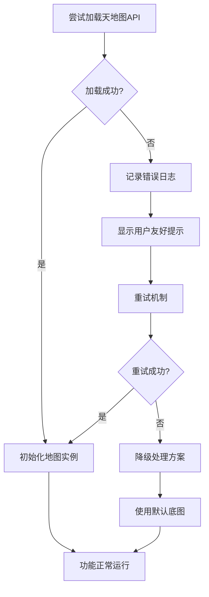

**图表来源**
- [tianditu.ts:38-43](file://src/utils/tianditu.ts#L38-L43)

**章节来源**
- [tianditu.ts:38-43](file://src/utils/tianditu.ts#L38-L43)

## 依赖关系分析

### 核心依赖配置

项目使用现代化的依赖管理策略，确保天地图集成的稳定性和性能：

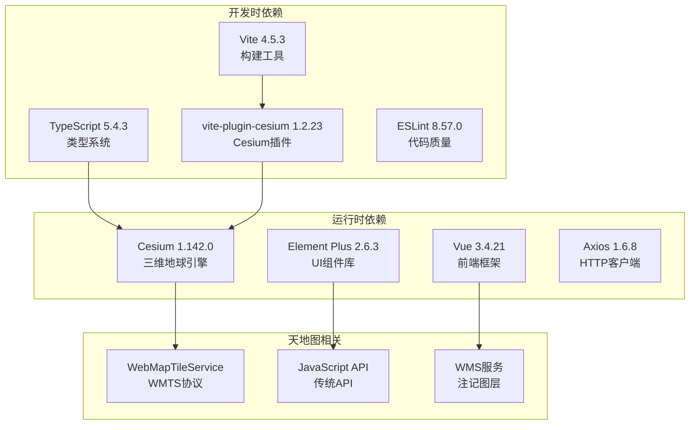

**图表来源**
- [package.json:14-46](file://package.json#L14-L46)

### 构建配置优化

项目通过Vite插件系统优化了Cesium的构建和加载过程：

| 配置项 | 值 | 作用 |
|--------|----|------|
| vite-plugin-cesium | 1.2.23 | 自动处理Cesium兼容性 |
| 手动分块 | element-plus, vendor | 优化代码分割 |
| 源码映射 | 关闭 | 生产环境优化 |
| 代理配置 | /api, /ai-api | 开发环境路由转发 |

**章节来源**
- [package.json:14-46](file://package.json#L14-L46)
- [vite.config.ts:14-66](file://vite.config.ts#L14-L66)

## 性能考虑

### 加载优化策略

项目采用了多种性能优化策略来提升天地图服务的响应速度：

#### 图片预加载机制

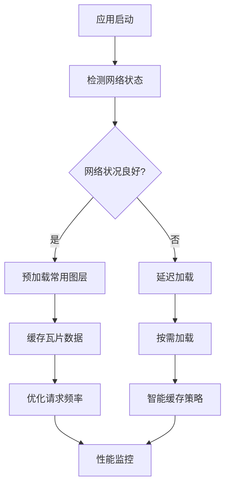

#### 内存管理优化

项目实现了智能的内存管理机制，避免长时间使用导致的内存泄漏：

| 优化措施 | 实现方式 | 效果 |
|----------|----------|------|
| 实体清理 | 组件卸载时销毁 | 防止内存泄漏 |
| 图层管理 | 动态添加删除 | 控制资源占用 |
| 事件监听 | 组件销毁时移除 | 避免重复绑定 |
| 缓存策略 | 智能缓存瓦片 | 减少网络请求 |

### 渲染性能优化

#### 视锥剔除

项目利用Cesium的视锥剔除功能，只渲染可见范围内的图层：

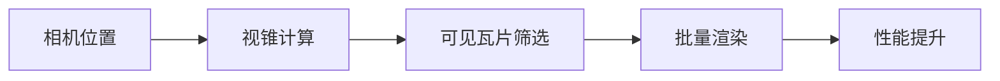

#### 级别细节控制

项目根据距离动态调整瓦片的详细程度，平衡视觉质量和性能：

| 距离范围 | 最大缩放级别 | 用途 |
|----------|-------------|------|
| 远距离 | 12级 | 大范围概览 |
| 中距离 | 15级 | 城市级浏览 |
| 近距离 | 18级 | 详细观察 |

## 故障排除指南

### 常见问题诊断

#### API密钥相关问题

| 问题症状 | 可能原因 | 解决方案 |
|----------|----------|----------|
| 地图加载失败 | 密钥无效或过期 | 更新为有效密钥 |
| 请求被拒绝 | IP白名单限制 | 配置允许的IP地址 |
| 访问受限 | 配额用尽 | 联系天地图客服 |
| CORS错误 | 跨域配置问题 | 检查服务器配置 |

#### 网络连接问题

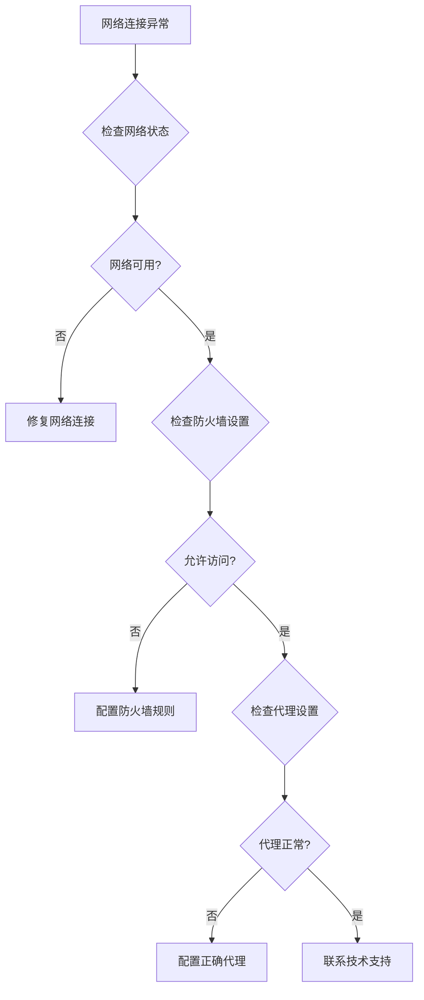

#### 浏览器兼容性问题

| 问题类型 | 解决方案 | 验证方法 |
|----------|----------|----------|
| WebGL不支持 | 使用降级方案 | 检查浏览器控制台 |
| JavaScript错误 | 更新Cesium版本 | 查看错误堆栈 |
| CSS样式冲突 | 检查样式隔离 | 使用开发者工具 |
| 资源加载失败 | 检查CDN配置 | 验证网络连接 |

**章节来源**
- [tianditu.ts:38-43](file://src/utils/tianditu.ts#L38-L43)
- [MapOverview.vue:120-123](file://src/views/map/MapOverview.vue#L120-L123)

### 调试技巧

#### 开发者工具使用

项目提供了丰富的调试工具和日志信息：

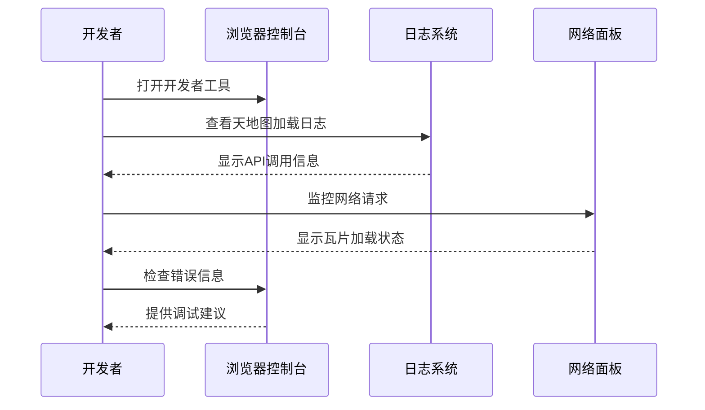

#### 性能监控

项目实现了多层次的性能监控机制：

| 监控指标 | 监控方式 | 阈值设置 |
|----------|----------|----------|
| 加载时间 | 时间戳记录 | < 5秒 |
| 渲染帧率 | requestAnimationFrame | > 30 FPS |
| 内存使用 | Performance API | < 500MB |
| 网络请求 | Network面板 | < 100请求/分钟 |

## 结论

天地图服务集成项目展现了现代前端地图应用的最佳实践。通过精心设计的架构和完善的错误处理机制，项目实现了稳定可靠的天地图服务集成。

### 主要成就

1. **双层架构设计**：同时支持Cesium三维地球和传统二维地图API
2. **灵活的配置管理**：集中化的配置系统便于维护和扩展
3. **完善的错误处理**：多层次的错误处理确保用户体验
4. **性能优化策略**：智能的缓存和渲染优化提升性能
5. **跨平台兼容性**：良好的浏览器兼容性和移动端适配

### 技术亮点

- **坐标系统一**：完整的WGS84坐标系支持
- **图层管理**：灵活的多图层叠加和控制
- **视觉效果**：创新的光墙效果和动态纹理
- **交互体验**：直观的地图选择和标注功能
- **开发效率**：模块化的代码结构和清晰的文档

### 未来发展方向

1. **功能扩展**：增加更多天地图服务类型的支持
2. **性能优化**：进一步优化大规模数据的渲染性能
3. **用户体验**：改进交互设计和响应速度
4. **技术升级**：跟进Cesium和天地图的最新版本
5. **国际化支持**：扩展多语言和多地区支持

该项目为其他类似的地图集成项目提供了宝贵的参考和借鉴价值，展示了如何在保证功能完整性的同时，实现高性能和良好的用户体验。