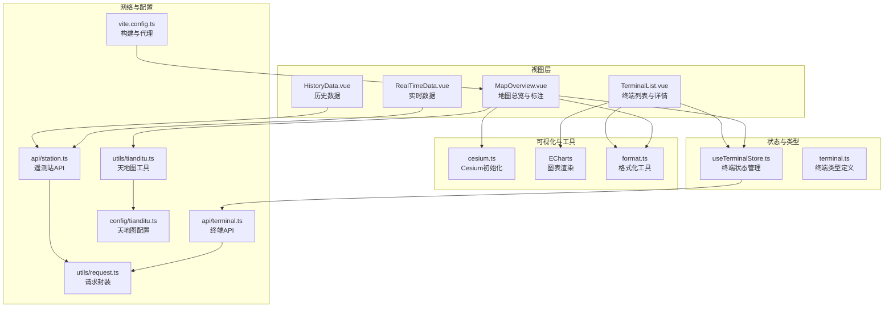
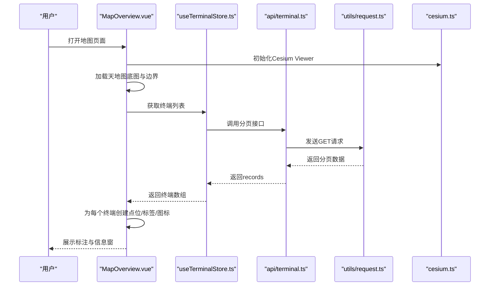
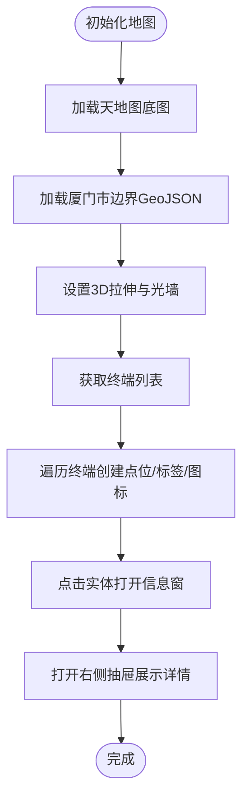
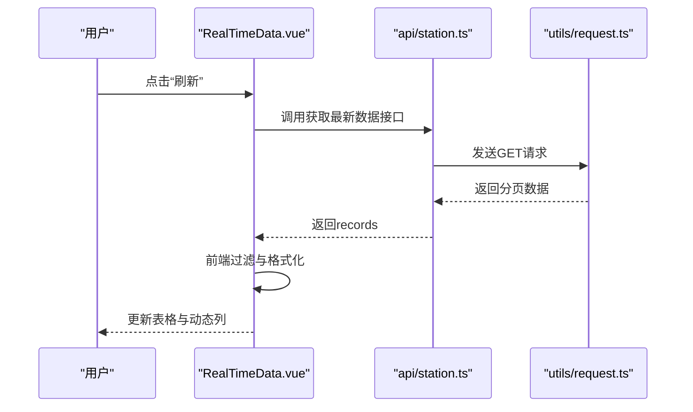
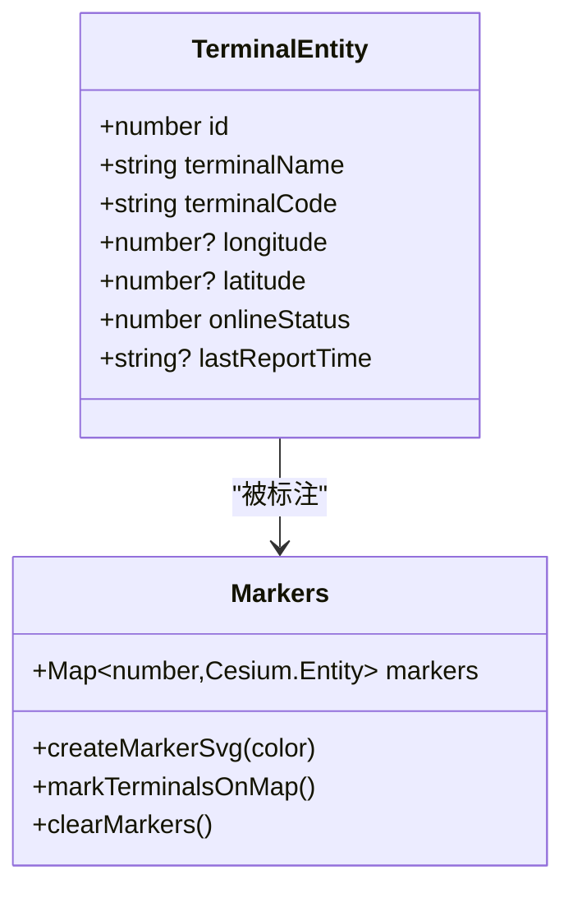
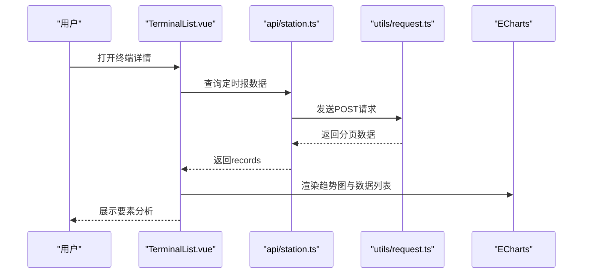
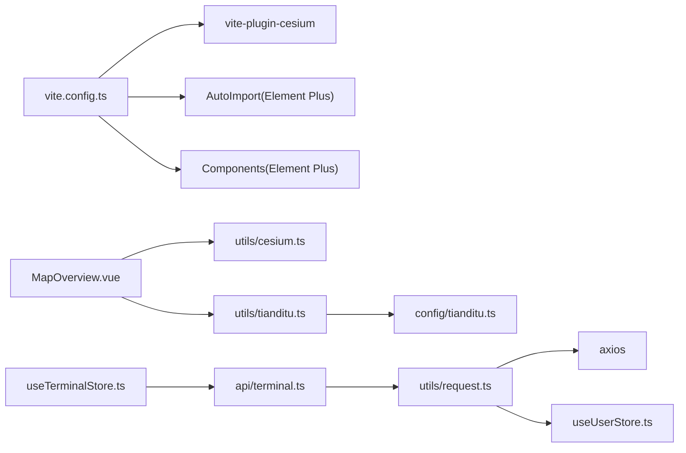

# 数据可视化与标注

<cite>
**本文档引用的文件**
- [README.md](file://README.md)
- [MapOverview.vue](file://src/views/map/MapOverview.vue)
- [useTerminalStore.ts](file://src/stores/useTerminalStore.ts)
- [terminal.ts](file://src/types/terminal.ts)
- [cesium.ts](file://src/utils/cesium.ts)
- [terminal.ts](file://src/api/terminal.ts)
- [RealTimeData.vue](file://src/views/data/RealTimeData.vue)
- [HistoryData.vue](file://src/views/data/HistoryData.vue)
- [TerminalList.vue](file://src/views/terminal/TerminalList.vue)
- [format.ts](file://src/utils/format.ts)
- [station.ts](file://src/api/station.ts)
- [request.ts](file://src/utils/request.ts)
- [tianditu.ts](file://src/utils/tianditu.ts)
- [tianditu.ts](file://src/config/tianditu.ts)
- [vite.config.ts](file://vite.config.ts)
- [.env](file://.env)
</cite>

## 目录
1. [简介](#简介)
2. [项目结构](#项目结构)
3. [核心组件](#核心组件)
4. [架构总览](#架构总览)
5. [详细组件分析](#详细组件分析)
6. [依赖关系分析](#依赖关系分析)
7. [性能考量](#性能考量)
8. [故障排查指南](#故障排查指南)
9. [结论](#结论)
10. [附录](#附录)

## 简介
本文件面向开发者，系统化梳理本项目的“数据可视化与标注”能力，覆盖终端设备在三维地图上的标注方式、图标样式与标签显示；动态数据更新机制、实时位置刷新与状态指示；不同终端类型的样式差异与颜色编码；数据聚合显示、热力图与密度分布的实现思路；时间序列数据的地图展示、轨迹动画与路径绘制；筛选、范围选择与批量操作；以及标注的交互行为、信息窗口与详情展示。同时提供完整的实现指南与性能优化策略。

## 项目结构
项目采用 Vue 3 + TypeScript + Element Plus 架构，结合 Cesium 实现三维地图可视化，ECharts 实现时间序列图表，Pinia 管理状态，Axios 封装网络请求。地图模块位于 views/map，终端管理位于 views/terminal，实时与历史数据位于 views/data，类型定义位于 types，工具函数位于 utils，API 封装位于 api。

**图表来源**
- [MapOverview.vue:1-649](file://src/views/map/MapOverview.vue#L1-L649)
- [TerminalList.vue:1-800](file://src/views/terminal/TerminalList.vue#L1-L800)
- [RealTimeData.vue:1-300](file://src/views/data/RealTimeData.vue#L1-L300)
- [HistoryData.vue:1-271](file://src/views/data/HistoryData.vue#L1-L271)
- [useTerminalStore.ts:1-294](file://src/stores/useTerminalStore.ts#L1-L294)
- [terminal.ts:1-84](file://src/types/terminal.ts#L1-L84)
- [cesium.ts:1-19](file://src/utils/cesium.ts#L1-L19)
- [station.ts:1-115](file://src/api/station.ts#L1-L115)
- [request.ts:1-180](file://src/utils/request.ts#L1-L180)
- [tianditu.ts:1-68](file://src/utils/tianditu.ts#L1-L68)
- [tianditu.ts:1-28](file://src/config/tianditu.ts#L1-L28)
- [vite.config.ts:1-68](file://vite.config.ts#L1-L68)

**章节来源**
- [README.md:1-128](file://README.md#L1-L128)
- [vite.config.ts:1-68](file://vite.config.ts#L1-L68)

## 核心组件
- 地图总览与标注：负责加载天地图底图、加载厦门市边界、创建3D立体效果与光墙、按终端在线状态生成点位标注、标签显示与点击信息窗。
- 终端状态管理：集中管理终端列表、查询参数、详情弹窗、表单数据与 CRUD 操作，支持分页与筛选。
- 实时与历史数据：提供遥测站最新数据与定时报数据的分页查询、动态列展示、图表与列表联动。
- 时间序列与图表：在终端详情页集成 ECharts，按要素类型动态渲染趋势图与数据列表。
- 工具与配置：Cesium 初始化、天地图配置与加载、请求封装与拦截器、日期时间格式化。

**章节来源**
- [MapOverview.vue:1-649](file://src/views/map/MapOverview.vue#L1-L649)
- [useTerminalStore.ts:1-294](file://src/stores/useTerminalStore.ts#L1-L294)
- [RealTimeData.vue:1-300](file://src/views/data/RealTimeData.vue#L1-L300)
- [HistoryData.vue:1-271](file://src/views/data/HistoryData.vue#L1-L271)
- [TerminalList.vue:1-800](file://src/views/terminal/TerminalList.vue#L1-L800)
- [cesium.ts:1-19](file://src/utils/cesium.ts#L1-L19)
- [tianditu.ts:1-68](file://src/utils/tianditu.ts#L1-L68)
- [tianditu.ts:1-28](file://src/config/tianditu.ts#L1-L28)
- [request.ts:1-180](file://src/utils/request.ts#L1-L180)
- [format.ts:1-102](file://src/utils/format.ts#L1-L102)

## 架构总览
本项目采用“视图层 + 状态层 + 可视化层 + 网络层”的分层设计。地图与图表通过 Cesium/ECharts 渲染，状态通过 Pinia 管理，数据通过 Axios 封装的 API 层调用，工具函数提供通用能力。

**图表来源**
- [MapOverview.vue:77-124](file://src/views/map/MapOverview.vue#L77-L124)
- [useTerminalStore.ts:72-93](file://src/stores/useTerminalStore.ts#L72-L93)
- [terminal.ts:16-18](file://src/api/terminal.ts#L16-L18)
- [request.ts:155-157](file://src/utils/request.ts#L155-L157)
- [cesium.ts:10-15](file://src/utils/cesium.ts#L10-L15)

## 详细组件分析

### 地图标注与样式体系
- 底图与裁剪
  - 使用天地图卫星影像与注记图层，设置最大层级与版权信息。
  - 通过 GeoJSON 加载厦门市边界，启用贴地显示与3D拉伸，创建光墙效果。
  - 可选使用 ClippingPlane 实现精确多边形裁剪，保留边界内区域。
- 终端标注
  - 按在线状态设置点位颜色（在线绿色、离线灰色）。
  - 使用 SVG 生成带描边的圆形图标，支持动态颜色。
  - 标签显示终端名称，设置显示距离与贴地高度参考。
  - 点击实体触发信息窗，展示终端基础信息。
- 交互与抽屉
  - 点击信息窗后打开右侧抽屉，展示终端详情与跳转链接。

**图表来源**
- [MapOverview.vue:129-162](file://src/views/map/MapOverview.vue#L129-L162)
- [MapOverview.vue:302-462](file://src/views/map/MapOverview.vue#L302-L462)
- [MapOverview.vue:467-557](file://src/views/map/MapOverview.vue#L467-L557)
- [MapOverview.vue:588-604](file://src/views/map/MapOverview.vue#L588-L604)

**章节来源**
- [MapOverview.vue:129-162](file://src/views/map/MapOverview.vue#L129-L162)
- [MapOverview.vue:302-462](file://src/views/map/MapOverview.vue#L302-L462)
- [MapOverview.vue:467-557](file://src/views/map/MapOverview.vue#L467-L557)
- [MapOverview.vue:588-604](file://src/views/map/MapOverview.vue#L588-L604)

### 动态数据更新与实时刷新
- 终端列表分页查询：通过 Pinia Store 维护查询参数与分页状态，支持重置、切换页码与页大小。
- 实时数据页：提供“刷新”按钮，重新拉取最新数据并前端过滤。
- 历史数据页：根据遥测站编号与时间范围查询定时报数据，支持分页与列表展示。
- 交互行为：点击“查看详情”跳转至终端详情页，打开抽屉展示实时数据与要素分析。

**图表来源**
- [RealTimeData.vue:188-229](file://src/views/data/RealTimeData.vue#L188-L229)
- [station.ts:74-80](file://src/api/station.ts#L74-L80)
- [request.ts:155-157](file://src/utils/request.ts#L155-L157)

**章节来源**
- [useTerminalStore.ts:72-93](file://src/stores/useTerminalStore.ts#L72-L93)
- [RealTimeData.vue:188-229](file://src/views/data/RealTimeData.vue#L188-L229)
- [HistoryData.vue:182-208](file://src/views/data/HistoryData.vue#L182-L208)
- [TerminalList.vue:745-791](file://src/views/terminal/TerminalList.vue#L745-L791)

### 样式体系与颜色编码
- 在线状态编码：在线（1）绿色，离线（0）灰色，用于点位颜色与标签状态。
- 图标样式：SVG 圆形图标，内部同心圆形成高亮效果，统一描边与尺寸。
- 标签样式：白字黑 Outline，设置垂直偏移与贴地显示，保证可读性。
- 3D立体与光墙：边界区域拉伸高度并附加 ImageMaterialProperty 的发光纹理，增强视觉层次。

**图表来源**
- [terminal.ts:6-18](file://src/types/terminal.ts#L6-L18)
- [MapOverview.vue:490-557](file://src/views/map/MapOverview.vue#L490-L557)
- [MapOverview.vue:562-571](file://src/views/map/MapOverview.vue#L562-L571)

**章节来源**
- [terminal.ts:6-18](file://src/types/terminal.ts#L6-L18)
- [MapOverview.vue:490-557](file://src/views/map/MapOverview.vue#L490-L557)
- [MapOverview.vue:562-571](file://src/views/map/MapOverview.vue#L562-L571)

### 数据聚合、热力图与密度分布
- 聚合显示：当前实现为逐点标注，未见专门的聚合或热力图组件。
- 密度分布建议：可在 Cesium 中使用点云或粒子系统模拟密度分布；或通过 GeoJSON 多边形叠加透明材质实现区域密度可视化。
- 热力图建议：结合后端聚合结果，使用 ImageMaterialProperty 或自定义 Shader 实现热力图效果。

[本节为实现建议，不直接对应具体代码文件]

### 时间序列数据、轨迹动画与路径绘制
- 时间序列：终端详情页集成 ECharts，按要素类型动态渲染趋势图与数据列表，支持时间范围查询与分页。
- 轨迹动画与路径：当前未见轨迹动画或路径绘制逻辑，可在 Cesium 中使用 PolylineGraphics 与 Path 材质实现移动轨迹与路径绘制。

**图表来源**
- [TerminalList.vue:745-791](file://src/views/terminal/TerminalList.vue#L745-L791)
- [station.ts:88-90](file://src/api/station.ts#L88-L90)
- [request.ts:159-165](file://src/utils/request.ts#L159-L165)

**章节来源**
- [TerminalList.vue:440-505](file://src/views/terminal/TerminalList.vue#L440-L505)
- [station.ts:25-45](file://src/api/station.ts#L25-L45)
- [request.ts:159-165](file://src/utils/request.ts#L159-L165)

### 数据筛选、范围选择与批量操作
- 筛选与范围：终端列表支持按名称、编码、在线状态筛选；实时数据页支持按遥测站名称、编号、在线状态筛选；历史数据页支持时间范围查询。
- 范围选择：地图层未见范围选择控件，可通过天地图工具类加载外部地图脚本实现范围选择（需扩展）。
- 批量操作：终端列表支持新增、编辑、删除；实时与历史数据页支持分页与刷新。

**章节来源**
- [useTerminalStore.ts:232-248](file://src/stores/useTerminalStore.ts#L232-L248)
- [RealTimeData.vue:232-244](file://src/views/data/RealTimeData.vue#L232-L244)
- [HistoryData.vue:211-222](file://src/views/data/HistoryData.vue#L211-L222)
- [TerminalList.vue:726-737](file://src/views/terminal/TerminalList.vue#L726-L737)

### 标注交互、信息窗口与详情展示
- 信息窗口：Cesium Entity 的 description 字段承载 HTML 内容，点击实体后显示信息窗。
- 抽屉详情：点击信息窗后打开右侧抽屉，展示终端基础信息、实时数据、要素分析与原始报文。
- 跳转行为：抽屉底部提供“查看详情”按钮，跳转至终端管理页面并携带查询参数。

**章节来源**
- [MapOverview.vue:542-551](file://src/views/map/MapOverview.vue#L542-L551)
- [MapOverview.vue:588-597](file://src/views/map/MapOverview.vue#L588-L597)
- [TerminalList.vue:299-306](file://src/views/terminal/TerminalList.vue#L299-L306)

## 依赖关系分析
- 构建与插件：Vite 配置启用 Cesium 插件、Element Plus 自动导入与组件解析、代理与分包策略。
- 网络层：Axios 实例统一处理响应数据、大整数预处理、拦截器与错误提示。
- 地图与底图：Cesium 初始化与样式引入；天地图配置与脚本加载工具。
- 类型与状态：终端类型定义与 Pinia Store 管理终端列表与查询参数。

**图表来源**
- [vite.config.ts:14-27](file://vite.config.ts#L14-L27)
- [request.ts:52-75](file://src/utils/request.ts#L52-L75)
- [MapOverview.vue:57-62](file://src/views/map/MapOverview.vue#L57-L62)
- [tianditu.ts:1-68](file://src/utils/tianditu.ts#L1-L68)
- [tianditu.ts:1-28](file://src/config/tianditu.ts#L1-L28)
- [useTerminalStore.ts:1-17](file://src/stores/useTerminalStore.ts#L1-L17)
- [terminal.ts:1-8](file://src/api/terminal.ts#L1-L8)

**章节来源**
- [vite.config.ts:1-68](file://vite.config.ts#L1-L68)
- [request.ts:1-180](file://src/utils/request.ts#L1-L180)
- [MapOverview.vue:57-62](file://src/views/map/MapOverview.vue#L57-L62)
- [tianditu.ts:1-68](file://src/utils/tianditu.ts#L1-L68)
- [tianditu.ts:1-28](file://src/config/tianditu.ts#L1-L28)
- [useTerminalStore.ts:1-17](file://src/stores/useTerminalStore.ts#L1-L17)
- [terminal.ts:1-8](file://src/api/terminal.ts#L1-L8)

## 性能考量
- Cesium 资源与初始化
  - 使用 Vite 插件自动处理 Cesium 兼容性，避免手动配置。
  - 控制实体数量与标签显示距离，减少渲染压力。
- 地图底图与裁剪
  - 合理设置天地图最大层级，避免过度瓦片加载。
  - 裁剪区域过大可能影响性能，建议按需启用 ClippingPlane 并限制裁剪平面数量。
- 数据加载与渲染
  - 终端列表一次性加载（当前为1000条），建议在地图场景下改为分页或按视图范围动态加载。
  - ECharts 图表按需渲染，避免频繁重绘。
- 网络与缓存
  - Axios 统一拦截器处理错误与 Token，减少重复请求。
  - 合理设置超时与重试策略，避免阻塞 UI。

[本节提供通用指导，不直接分析具体文件]

## 故障排查指南
- 地图初始化失败
  - 检查 Cesium Viewer 初始化参数与容器是否存在。
  - 确认天地图 Token 有效且网络可达。
- 信息窗不显示
  - 确认 Entity 的 description 字段为 ConstantProperty，并包含有效 HTML。
- 数据加载异常
  - 检查 API 返回结构与响应拦截器处理逻辑。
  - 确认分页参数与后端接口一致。
- 图表渲染问题
  - 确保 ECharts 容器尺寸正确，避免在隐藏状态下渲染。
  - 检查数据格式与要素编码映射。

**章节来源**
- [MapOverview.vue:77-124](file://src/views/map/MapOverview.vue#L77-L124)
- [MapOverview.vue:542-551](file://src/views/map/MapOverview.vue#L542-L551)
- [request.ts:96-151](file://src/utils/request.ts#L96-L151)
- [TerminalList.vue:440-505](file://src/views/terminal/TerminalList.vue#L440-L505)

## 结论
本项目在地图标注方面实现了基础但完整的功能：天地图底图、边界3D化、终端点位标注与标签、在线状态颜色编码、信息窗与详情抽屉。实时与历史数据页提供了数据筛选、分页与图表联动。建议后续扩展包括：范围选择、热力图/密度分布、轨迹动画与路径绘制、按视图范围动态加载与聚合标注，以进一步提升用户体验与性能表现。

## 附录
- 环境变量与代理
  - 通过 Vite 代理将 /api 前缀转发至后端服务，支持本地联调。
  - 可配置端口与 AI 接口代理。
- 天地图配置
  - 提供 API Key 与默认中心点、缩放级别，便于快速接入。

**章节来源**
- [vite.config.ts:33-51](file://vite.config.ts#L33-L51)
- [tianditu.ts:4-27](file://src/config/tianditu.ts#L4-L27)