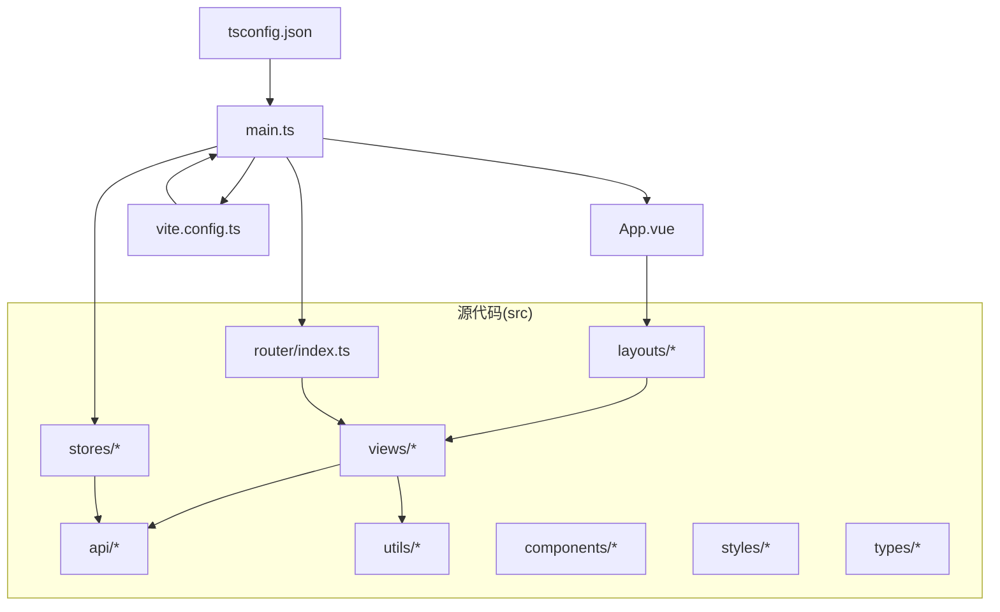
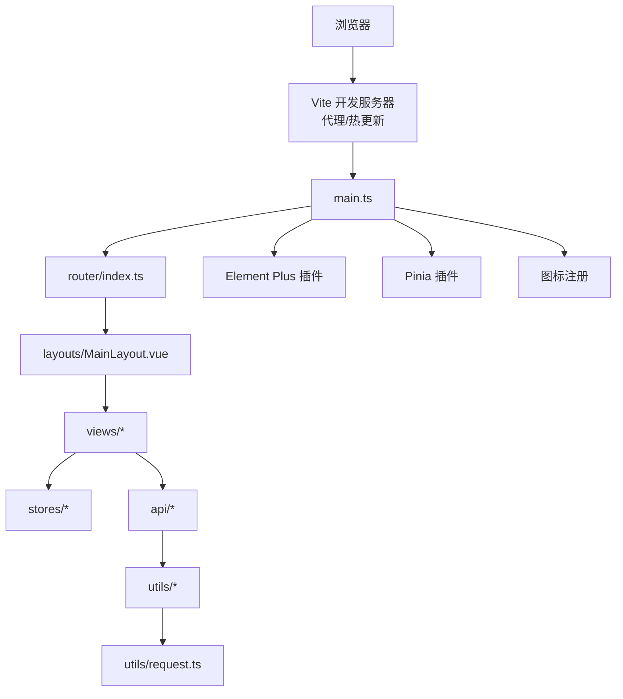
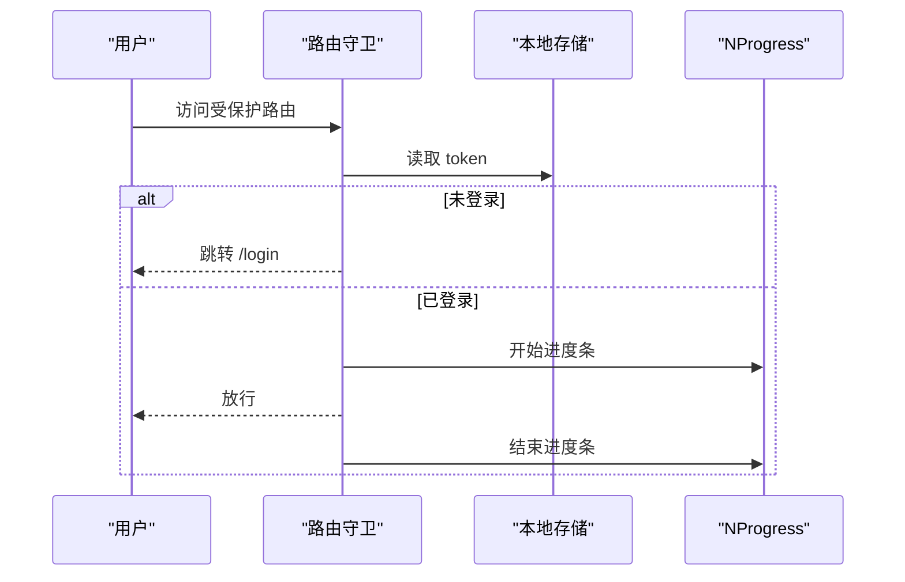
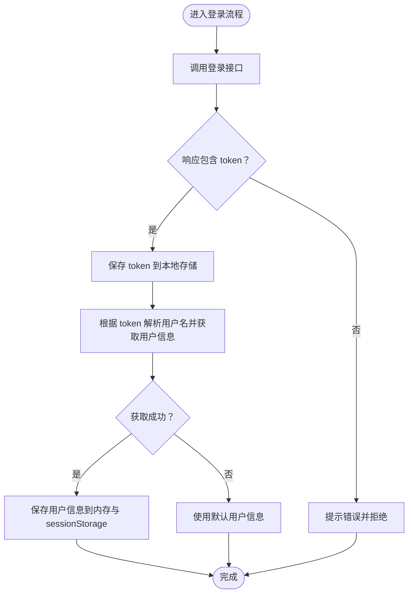
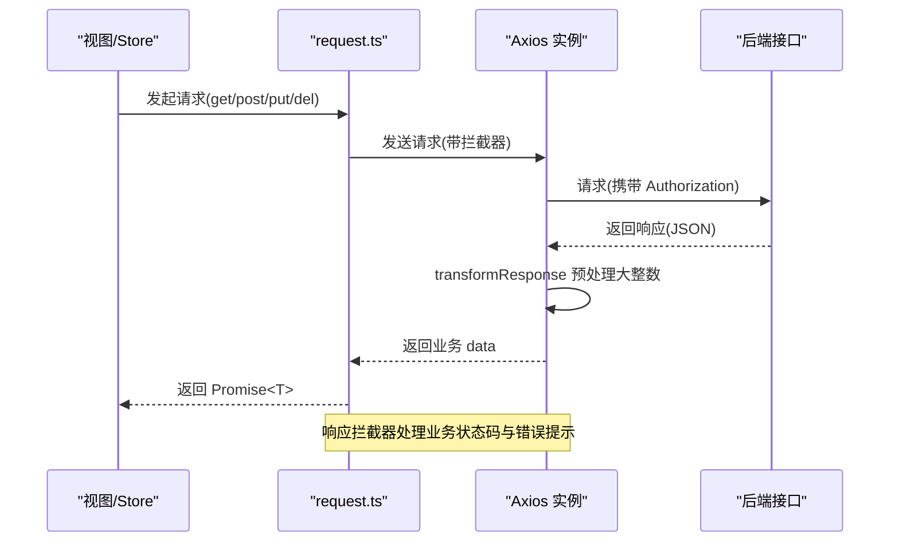
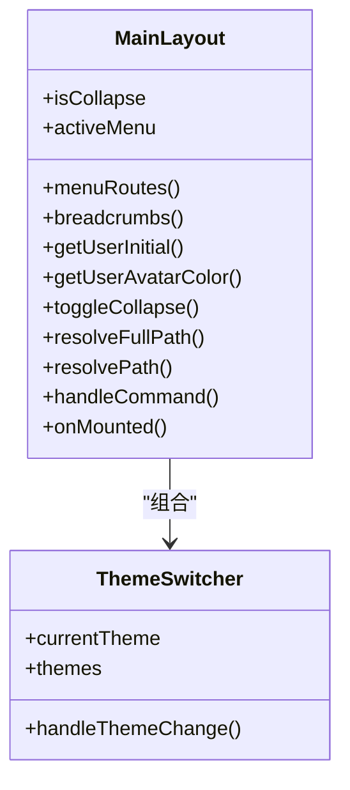
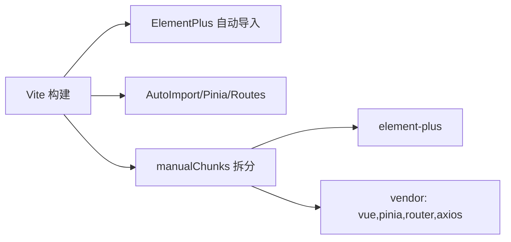

# 代码规范与最佳实践

<cite>
**本文引用的文件**
- [package.json](file://package.json)
- [tsconfig.json](file://tsconfig.json)
- [vite.config.ts](file://vite.config.ts)
- [README.md](file://README.md)
- [src/main.ts](file://src/main.ts)
- [src/App.vue](file://src/App.vue)
- [src/router/index.ts](file://src/router/index.ts)
- [src/stores/useUserStore.ts](file://src/stores/useUserStore.ts)
- [src/utils/request.ts](file://src/utils/request.ts)
- [src/layouts/MainLayout.vue](file://src/layouts/MainLayout.vue)
- [src/components/ThemeSwitcher.vue](file://src/components/ThemeSwitcher.vue)
- [src/api/user.ts](file://src/api/user.ts)
</cite>

## 目录
1. [简介](#简介)
2. [项目结构](#项目结构)
3. [核心组件](#核心组件)
4. [架构总览](#架构总览)
5. [详细组件分析](#详细组件分析)
6. [依赖分析](#依赖分析)
7. [性能考虑](#性能考虑)
8. [故障排查指南](#故障排查指南)
9. [结论](#结论)
10. [附录](#附录)

## 简介
本指南面向“水文监测管理系统”前端团队，提供一套完整的代码规范与最佳实践，覆盖 TypeScript 编码规范、Vue 3 Composition API 使用规范、组件开发规范、文件命名约定、代码组织原则、模块化设计与依赖管理策略，并结合项目现有配置（ESLint、Prettier、Vite、Pinia、Element Plus 等）给出落地建议与示例路径。同时包含代码审查清单、性能优化建议与安全编码实践，帮助开发者高效、一致地交付高质量代码。

## 项目结构
项目采用按职责分层的目录组织方式，便于维护与扩展：
- src/api：接口封装与类型定义
- src/utils：通用工具函数（如请求封装）
- src/stores：Pinia 状态管理
- src/views：页面级组件
- src/components：通用业务/展示组件
- src/layouts：布局组件
- src/router：路由配置与守卫
- src/styles：全局样式与变量
- src/types：全局类型声明
- vite.config.ts：构建与开发服务器配置
- tsconfig.json：TypeScript 编译选项与路径别名
- package.json：脚本与依赖管理

**图表来源**
- [src/main.ts:1-26](file://src/main.ts#L1-L26)
- [src/router/index.ts:1-136](file://src/router/index.ts#L1-L136)
- [vite.config.ts:1-68](file://vite.config.ts#L1-L68)
- [tsconfig.json:1-40](file://tsconfig.json#L1-L40)

**章节来源**
- [README.md:17-34](file://README.md#L17-L34)
- [src/main.ts:1-26](file://src/main.ts#L1-L26)
- [vite.config.ts:1-68](file://vite.config.ts#L1-L68)
- [tsconfig.json:23-31](file://tsconfig.json#L23-L31)

## 核心组件
- 应用入口与插件注册：在入口文件中集中注册 Pinia、Router、Element Plus，并批量注册图标组件，保证全局可用性与一致性。
- 路由与权限：通过路由元信息与前置守卫实现登录态校验与页面跳转控制，结合进度条提升用户体验。
- 状态管理：使用 Pinia Composable Store，集中管理用户令牌、用户信息与主题配置，提供初始化与恢复逻辑。
- 请求封装：统一 Axios 实例与拦截器，处理业务状态码、鉴权头、错误提示与大整数安全传输。
- 布局与主题：主布局组件负责菜单、面包屑、头部操作与内容区渲染；主题切换组件提供多主题选择与持久化。

**章节来源**
- [src/main.ts:1-26](file://src/main.ts#L1-L26)
- [src/router/index.ts:116-135](file://src/router/index.ts#L116-L135)
- [src/stores/useUserStore.ts:1-200](file://src/stores/useUserStore.ts#L1-L200)
- [src/utils/request.ts:1-180](file://src/utils/request.ts#L1-L180)
- [src/layouts/MainLayout.vue:1-434](file://src/layouts/MainLayout.vue#L1-L434)
- [src/components/ThemeSwitcher.vue:1-132](file://src/components/ThemeSwitcher.vue#L1-L132)

## 架构总览
系统采用“入口 → 路由 → 布局/视图 → 组件/Store/API”的清晰层次，配合 Vite 插件链路实现自动导入与按需打包。

**图表来源**
- [src/main.ts:1-26](file://src/main.ts#L1-L26)
- [src/router/index.ts:1-136](file://src/router/index.ts#L1-L136)
- [src/layouts/MainLayout.vue:1-434](file://src/layouts/MainLayout.vue#L1-L434)
- [src/utils/request.ts:1-180](file://src/utils/request.ts#L1-L180)
- [vite.config.ts:1-68](file://vite.config.ts#L1-L68)

## 详细组件分析

### 路由与权限控制
- 路由元信息：通过 requiresAuth 控制页面是否需要登录；通过 title/icon 等配置菜单显示。
- 权限守卫：在 beforeEach 中读取本地 token，未登录访问受保护路由跳转登录；已登录访问登录页跳转首页。
- 进度条：结合 NProgress 在路由切换时显示加载状态。

**图表来源**
- [src/router/index.ts:116-135](file://src/router/index.ts#L116-L135)

**章节来源**
- [src/router/index.ts:8-109](file://src/router/index.ts#L8-L109)
- [src/router/index.ts:116-135](file://src/router/index.ts#L116-L135)

### 用户状态管理（Pinia Store）
- 数据模型：token、用户信息（含 id 兼容大整数）、派生计算属性（登录态、角色、昵称、是否管理员）。
- 行为方法：登录（调用登录接口、设置 token、拉取用户信息）、退出登录（清理本地存储与提示）、获取用户信息（从 token 解析用户名或回退默认信息）、初始化（从 sessionStorage 恢复）。
- 错误处理：登录与获取用户信息均包含 try/catch 与错误消息提示，失败时使用默认信息避免阻断。

**图表来源**
- [src/stores/useUserStore.ts:61-125](file://src/stores/useUserStore.ts#L61-L125)

**章节来源**
- [src/stores/useUserStore.ts:1-200](file://src/stores/useUserStore.ts#L1-L200)

### 请求封装与拦截器
- Axios 实例：统一 baseURL、超时、请求头；自定义 transformResponse 在解析前处理大整数，避免 JS 精度丢失。
- 请求拦截器：从 Store 读取 token 并注入 Authorization。
- 响应拦截器：根据业务 code 判断成功/失败；401 自动登出并跳转登录；其他状态码映射为友好提示；最终返回业务 data，简化上层调用。

**图表来源**
- [src/utils/request.ts:52-151](file://src/utils/request.ts#L52-L151)

**章节来源**
- [src/utils/request.ts:1-180](file://src/utils/request.ts#L1-L180)

### 布局与主题切换
- 菜单渲染：根据路由树动态生成菜单与子菜单，支持图标组件与面包屑。
- 头部交互：折叠侧边栏、主题切换、用户下拉菜单（个人中心/退出登录）。
- 主题持久化：初始化时从 Store 恢复主题配置，切换后更新并持久化。

**图表来源**
- [src/layouts/MainLayout.vue:117-211](file://src/layouts/MainLayout.vue#L117-L211)
- [src/components/ThemeSwitcher.vue:35-83](file://src/components/ThemeSwitcher.vue#L35-L83)

**章节来源**
- [src/layouts/MainLayout.vue:1-434](file://src/layouts/MainLayout.vue#L1-L434)
- [src/components/ThemeSwitcher.vue:1-132](file://src/components/ThemeSwitcher.vue#L1-L132)

### 页面组件示例（Dashboard）
- 使用 Element Plus 布局组件与卡片结构，提供统计卡片、图表占位与快捷操作区。
- 采用 `<script setup>` 与 scoped 样式，保持组件内聚与样式隔离。

**章节来源**
- [src/views/dashboard/Dashboard.vue:1-155](file://src/views/dashboard/Dashboard.vue#L1-L155)

## 依赖分析
- 构建与开发：Vite 提供快速冷启动与热更新；自动导入 Element Plus 组件与 Vue API，减少样板代码。
- 依赖拆分：通过 Rollup manualChunks 将 element-plus 与核心运行时(vue/pinia/vue-router/axios)独立打包，优化缓存与加载。
- 环境代理：开发时对 /api 与 /ai-api 进行代理，屏蔽后端差异，提升联调效率。

**图表来源**
- [vite.config.ts:14-27](file://vite.config.ts#L14-L27)
- [vite.config.ts:57-64](file://vite.config.ts#L57-L64)

**章节来源**
- [vite.config.ts:1-68](file://vite.config.ts#L1-L68)

## 性能考虑
- 代码分割与懒加载：路由按需加载页面组件，降低首屏体积。
- 手动分包：将第三方 UI 库与核心运行时独立打包，提升缓存命中率。
- 请求优化：统一拦截器减少重复逻辑，transformResponse 预处理大整数避免二次转换成本。
- 样式隔离：组件内使用 scoped，避免全局污染与重绘。
- 进度反馈：路由切换时显示进度条，改善感知性能。

**章节来源**
- [src/router/index.ts:12-14](file://src/router/index.ts#L12-L14)
- [vite.config.ts:57-64](file://vite.config.ts#L57-L64)
- [src/utils/request.ts:52-75](file://src/utils/request.ts#L52-L75)

## 故障排查指南
- 登录失败/无权限：检查路由守卫是否正确读取 token；确认响应拦截器对 401 的处理是否触发登出与跳转。
- 接口报错：查看响应拦截器的状态码映射与错误提示；确认 baseURL 与代理配置是否正确。
- 大整数精度丢失：确认 transformResponse 是否生效；必要时在上游接口层也进行字符串化处理。
- 主题/菜单异常：检查 Store 初始化逻辑与本地存储键值；确认菜单路径解析函数是否正确拼接。
- 类型错误：启用严格模式与未使用变量检查；确保 API 返回结构与类型定义一致。

**章节来源**
- [src/router/index.ts:116-135](file://src/router/index.ts#L116-L135)
- [src/utils/request.ts:95-151](file://src/utils/request.ts#L95-L151)
- [src/stores/useUserStore.ts:100-125](file://src/stores/useUserStore.ts#L100-L125)
- [tsconfig.json:17-22](file://tsconfig.json#L17-L22)

## 结论
本规范以项目现有技术栈为基础，围绕“强类型 + 组合式 API + 状态集中 + 请求统一 + 布局解耦 + 构建优化”展开，既保证开发效率，又兼顾可维护性与性能。建议在日常开发中严格执行类型约束、错误处理与样式隔离，持续通过 ESLint/Prettier/Vitest 等工具保障质量。

## 附录

### TypeScript 编码规范
- 语言与编译：使用严格模式、开启未使用局部变量/参数检查、禁用 switch 穿透。
- 路径别名：统一使用 @/ 前缀，避免相对路径混乱。
- 类型优先：禁止使用 any；明确 props、状态与 API 返回类型；对大整数字段使用 string|number 兼容后端 int64。
- 导入顺序：标准库/第三方 → 项目内相对路径 → 类型与样式。

**章节来源**
- [tsconfig.json:17-22](file://tsconfig.json#L17-L22)
- [tsconfig.json:23-31](file://tsconfig.json#L23-L31)
- [src/api/user.ts:20-32](file://src/api/user.ts#L20-L32)

### Vue 3 Composition API 使用规范
- 统一使用 `<script setup>` 语法糖，减少样板代码。
- 组件样式：一律使用 scoped，避免全局污染。
- 异步操作：必须包含错误处理与 loading 状态管理。
- 组件职责：单一职责、可复用性强；页面组件只做编排，逻辑下沉至 Store 或 Composables。

**章节来源**
- [src/views/dashboard/Dashboard.vue:100-102](file://src/views/dashboard/Dashboard.vue#L100-L102)
- [src/layouts/MainLayout.vue:117-120](file://src/layouts/MainLayout.vue#L117-L120)

### 组件开发规范
- 命名：组件文件使用 PascalCase，如 MainLayout.vue、ThemeSwitcher.vue。
- 结构：模板、脚本、样式三段式，注释简洁明了。
- 交互：通过 props 传参、emit 事件向外暴露行为；内部状态尽量私有化。
- 可测试性：将复杂逻辑抽离为纯函数或 Composables，便于单元测试。

**章节来源**
- [src/layouts/MainLayout.vue:1-434](file://src/layouts/MainLayout.vue#L1-L434)
- [src/components/ThemeSwitcher.vue:1-132](file://src/components/ThemeSwitcher.vue#L1-L132)

### 文件命名约定
- 组件：PascalCase.vue（如 Dashboard.vue、AIChat.vue）
- 工具函数：camelCase.ts（如 format.ts、validate.ts）
- 类型定义：index.ts 或具体模块名.ts（如 terminal.ts）
- 视图页面：PascalCase.vue（如 RealTimeData.vue）

**章节来源**
- [README.md:17-34](file://README.md#L17-L34)

### 代码组织原则与模块化设计
- 按功能域划分：api、utils、stores、views、components、layouts。
- 低耦合高内聚：Store 聚合状态，API 封装网络，工具函数提供纯能力。
- 可扩展性：通过插件机制（Vite 插件、Element Plus 自动导入）减少改动成本。

**章节来源**
- [vite.config.ts:14-27](file://vite.config.ts#L14-L27)
- [src/main.ts:1-26](file://src/main.ts#L1-L26)

### 依赖管理策略
- 生产依赖：Vue、Router、Pinia、Element Plus、Axios、ECharts、Cesium 等。
- 开发依赖：ESLint、Prettier、TypeScript、Vite 插件等。
- 版本锁定：通过 package-lock.json 保证一致性；升级前先跑测试与类型检查。

**章节来源**
- [package.json:14-46](file://package.json#L14-L46)

### ESLint 与 Prettier 配置说明
- ESLint：启用 @typescript-eslint/parser 与 plugin/vue，结合 eslint-config-prettier 关闭与 Prettier 冲突的规则。
- Prettier：统一缩进、引号、尾逗号等风格；通过 npm scripts 执行格式化。
- 建议：在 CI 中加入 lint 与 format 校验，确保提交质量。

**章节来源**
- [package.json:10-12](file://package.json#L10-L12)
- [README.md:105-117](file://README.md#L105-L117)

### Git 提交规范与分支管理策略
- 提交规范：采用约定式提交（如 feat/fix/docs/chore），每条提交聚焦单一变更。
- 分支策略：主分支保护，功能开发在 feature/*，修复在 hotfix/*，发布打 tag 并合并到 main/release。
- 合并与审查：PR 必须通过 CI 与代码审查，避免直接 push 到主分支。

[本节为通用实践建议，无需特定文件引用]

### 代码审查清单
- 类型安全：是否使用明确类型、避免 any；API 返回是否与类型定义一致。
- 错误处理：异步调用是否包含 try/catch 与错误提示；边界条件是否覆盖。
- 性能与体积：是否使用懒加载与手动分包；是否存在冗余依赖。
- 可维护性：组件是否单一职责；命名是否语义化；注释是否清晰。
- 安全：是否在请求拦截器注入 token；是否对用户输入进行校验；是否避免在前端存储敏感信息。

[本节为通用实践建议，无需特定文件引用]

### 性能优化建议
- 路由懒加载：继续沿用按需加载页面组件。
- 图表与地图：ECharts/Cesium 按需引入与懒加载，避免首屏阻塞。
- 缓存策略：Store 与本地存储合理使用；对高频数据设置有效期。
- 样式与资源：scoped 样式减少冲突；静态资源走 CDN 或构建优化。

**章节来源**
- [src/router/index.ts:12-14](file://src/router/index.ts#L12-L14)
- [vite.config.ts:57-64](file://vite.config.ts#L57-L64)

### 安全编码实践
- 认证与授权：统一从 Store 读取 token 并注入请求头；401 自动登出。
- 输入校验：对用户输入与路由参数进行校验与清洗。
- CORS 与代理：开发环境通过 Vite 代理避免跨域风险；生产环境后端正确配置 CORS。
- 敏感信息：不在前端存储明文密码；避免在日志中输出敏感字段。

**章节来源**
- [src/utils/request.ts:77-93](file://src/utils/request.ts#L77-L93)
- [src/stores/useUserStore.ts:88-94](file://src/stores/useUserStore.ts#L88-L94)