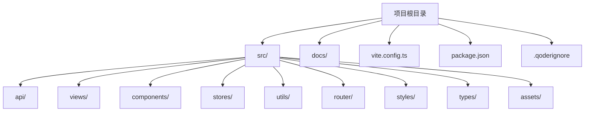
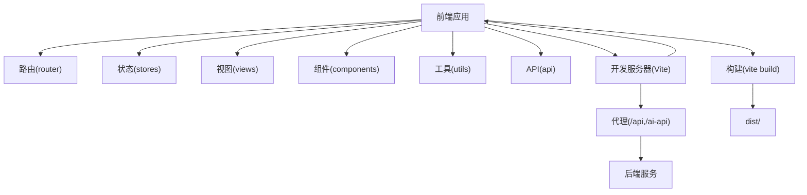
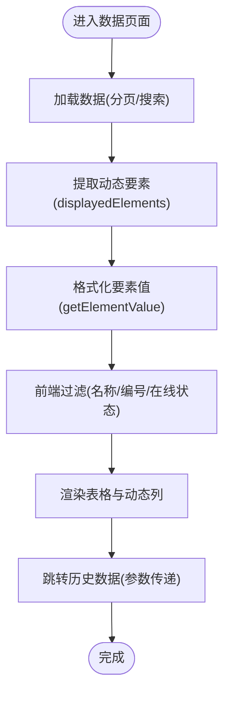
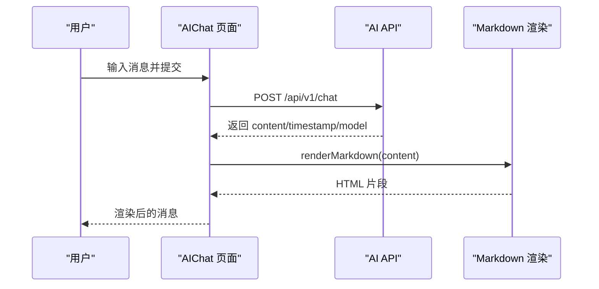
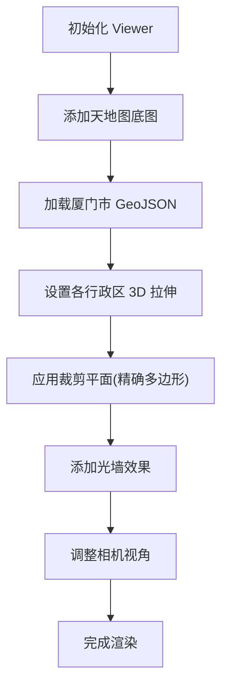
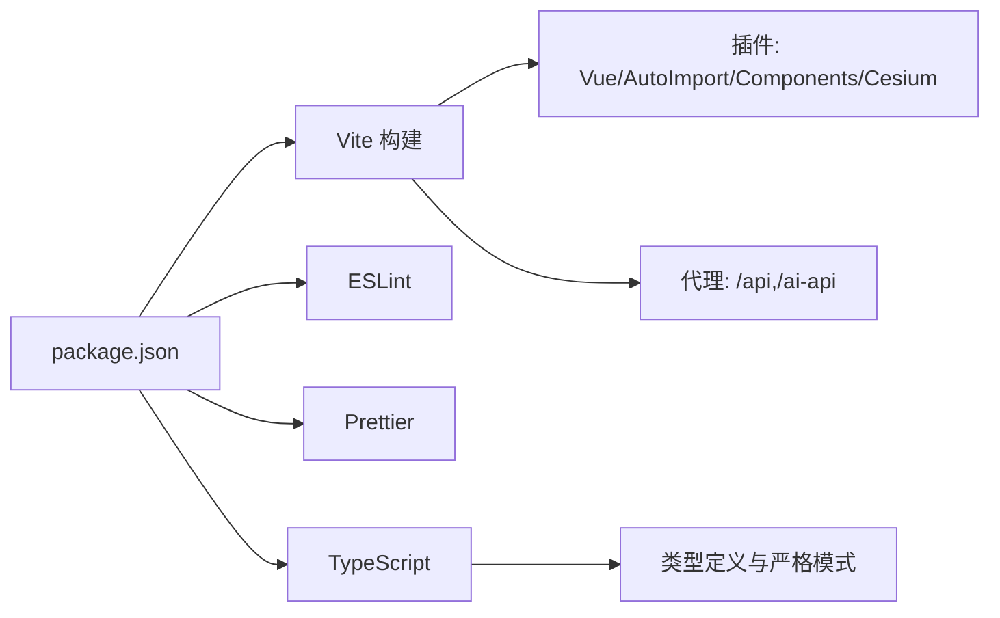

# 开发工作流程

<cite>
**本文引用的文件**
- [package.json](file://package.json)
- [README.md](file://README.md)
- [vite.config.ts](file://vite.config.ts)
- [start.bat](file://start.bat)
- [check-status.bat](file://check-status.bat)
- [tsconfig.json](file://tsconfig.json)
- [.qoderignore](file://.qoderignore)
- [docs/GUIDE.md](file://docs/GUIDE.md)
- [docs/DATA_MODULE.md](file://docs/DATA_MODULE.md)
- [docs/AI_CHAT_GUIDE.md](file://docs/AI_CHAT_GUIDE.md)
- [docs/CESIUM_GUIDE.md](file://docs/CESIUM_GUIDE.md)
- [DOCUMENTATION_INDEX.md](file://DOCUMENTATION_INDEX.md)
</cite>

## 目录
1. [引言](#引言)
2. [项目结构](#项目结构)
3. [核心组件](#核心组件)
4. [架构总览](#架构总览)
5. [详细组件分析](#详细组件分析)
6. [依赖关系分析](#依赖关系分析)
7. [性能考虑](#性能考虑)
8. [故障排查指南](#故障排查指南)
9. [结论](#结论)
10. [附录](#附录)

## 引言
本文件面向“水文监测管理系统”的前端团队，提供一套标准化的开发工作流程，覆盖从需求分析、任务分解、开发计划、代码提交、测试验证到上线交付的全流程。文档结合项目现有脚本、配置与指南，明确日常开发任务的执行步骤（代码检查、类型检查、构建打包、部署准备），并给出 Git 工作流、分支策略与合并规范建议，以及团队协作、沟通与问题跟踪的实践方法，帮助团队提升开发效率与交付质量。

## 项目结构
项目采用 Vue 3 + TypeScript + Vite 的现代前端架构，核心目录与职责如下：
- src/api：封装后端接口调用
- src/views：页面组件
- src/components：通用组件
- src/stores：Pinia 状态管理
- src/utils：工具函数
- src/router：路由配置
- docs：模块化开发指南与故障排查
- vite.config.ts：构建与开发服务器配置
- package.json：脚本与依赖管理

**图表来源**
- [vite.config.ts:1-68](file://vite.config.ts#L1-L68)
- [package.json:1-48](file://package.json#L1-L48)

**章节来源**
- [README.md:17-34](file://README.md#L17-L34)
- [vite.config.ts:10-66](file://vite.config.ts#L10-L66)
- [package.json:6-13](file://package.json#L6-L13)

## 核心组件
- 开发与构建脚本：通过 package.json 的 scripts 管理开发、构建、预览、代码检查与格式化等任务。
- 开发服务器与代理：vite.config.ts 提供代理配置，解决前后端联调跨域问题。
- 环境变量：.env.development/.env.production 用于配置端口与 API 基础地址。
- 类型检查：tsconfig.json 启用严格模式与路径别名，保障类型安全。
- 启动与状态检查：start.bat 与 check-status.bat 提供自动化环境检测与启动流程。

**章节来源**
- [package.json:6-13](file://package.json#L6-L13)
- [vite.config.ts:33-52](file://vite.config.ts#L33-L52)
- [docs/GUIDE.md:101-121](file://docs/GUIDE.md#L101-L121)
- [tsconfig.json:24-31](file://tsconfig.json#L24-L31)
- [start.bat:1-66](file://start.bat#L1-L66)
- [check-status.bat:1-63](file://check-status.bat#L1-L63)

## 架构总览
前端采用“页面组件 + 组合式 API + 状态管理 + 工具函数”的分层组织方式，结合 Vite 的插件体系与自动导入能力，提升开发效率与可维护性。

**图表来源**
- [vite.config.ts:14-27](file://vite.config.ts#L14-L27)
- [vite.config.ts:37-51](file://vite.config.ts#L37-L51)
- [package.json:7-12](file://package.json#L7-L12)

## 详细组件分析

### 数据模块（实时/历史数据）
- 功能：提供遥测站数据的实时与历史查询，支持动态要素列与搜索筛选。
- 接口：分页查询最新数据与按站点编号查询历史数据。
- 实现要点：动态要素提取、要素值格式化、前端过滤与分页。
- 测试验证：加载、格式化、筛选、跳转参数、空值与异常处理、控制台无错误。

**图表来源**
- [docs/DATA_MODULE.md:155-236](file://docs/DATA_MODULE.md#L155-L236)

**章节来源**
- [docs/DATA_MODULE.md:9-27](file://docs/DATA_MODULE.md#L9-L27)
- [docs/DATA_MODULE.md:43-93](file://docs/DATA_MODULE.md#L43-L93)
- [docs/DATA_MODULE.md:155-236](file://docs/DATA_MODULE.md#L155-L236)
- [docs/DATA_MODULE.md:397-418](file://docs/DATA_MODULE.md#L397-L418)

### AI 助手模块（智能问答 + Markdown 渲染）
- 功能：智能对话、健康检查、消息历史、Markdown 渲染。
- 接口：发送聊天消息、健康检查、诊断服务。
- 实现要点：markdown-it 解析器、渲染函数、模板使用。
- 测试验证：代码块渲染、标题层级、列表与表格、综合渲染效果。

**图表来源**
- [docs/AI_CHAT_GUIDE.md:71-131](file://docs/AI_CHAT_GUIDE.md#L71-L131)
- [docs/AI_CHAT_GUIDE.md:134-175](file://docs/AI_CHAT_GUIDE.md#L134-L175)

**章节来源**
- [docs/AI_CHAT_GUIDE.md:9-21](file://docs/AI_CHAT_GUIDE.md#L9-L21)
- [docs/AI_CHAT_GUIDE.md:71-131](file://docs/AI_CHAT_GUIDE.md#L71-L131)
- [docs/AI_CHAT_GUIDE.md:134-175](file://docs/AI_CHAT_GUIDE.md#L134-L175)
- [docs/AI_CHAT_GUIDE.md:248-294](file://docs/AI_CHAT_GUIDE.md#L248-L294)

### Cesium 地图模块（三维地图与可视化）
- 功能：天地图底图、厦门市边界、3D 立体效果、光墙与裁剪。
- 实现要点：Viewer 初始化、天地图图层、GeoJSON 加载、3D 拉伸、裁剪平面、光墙材质。
- 测试验证：地图加载、卫星影像、边界颜色、3D 效果、光墙、裁剪边缘、标签显示。

**图表来源**
- [docs/CESIUM_GUIDE.md:80-153](file://docs/CESIUM_GUIDE.md#L80-L153)
- [docs/CESIUM_GUIDE.md:232-290](file://docs/CESIUM_GUIDE.md#L232-L290)
- [docs/CESIUM_GUIDE.md:292-362](file://docs/CESIUM_GUIDE.md#L292-L362)

**章节来源**
- [docs/CESIUM_GUIDE.md:9-21](file://docs/CESIUM_GUIDE.md#L9-L21)
- [docs/CESIUM_GUIDE.md:80-153](file://docs/CESIUM_GUIDE.md#L80-L153)
- [docs/CESIUM_GUIDE.md:232-290](file://docs/CESIUM_GUIDE.md#L232-L290)
- [docs/CESIUM_GUIDE.md:292-362](file://docs/CESIUM_GUIDE.md#L292-L362)
- [docs/CESIUM_GUIDE.md:602-629](file://docs/CESIUM_GUIDE.md#L602-L629)

## 依赖关系分析
- 构建与开发：Vite 插件链（Vue、自动导入、组件解析、Cesium 插件）与代理配置。
- 代码质量：ESLint + Prettier + TypeScript 类型检查。
- 运行时依赖：Vue 3、Element Plus、Pinia、Axios、ECharts、Cesium 等。

**图表来源**
- [package.json:27-46](file://package.json#L27-L46)
- [vite.config.ts:14-27](file://vite.config.ts#L14-L27)
- [vite.config.ts:37-51](file://vite.config.ts#L37-L51)
- [tsconfig.json:17-31](file://tsconfig.json#L17-L31)

**章节来源**
- [package.json:14-26](file://package.json#L14-L26)
- [package.json:27-46](file://package.json#L27-L46)
- [vite.config.ts:14-27](file://vite.config.ts#L14-L27)
- [tsconfig.json:17-31](file://tsconfig.json#L17-L31)

## 性能考虑
- 构建优化：手动分包策略（element-plus、vendor），chunkSize 警告阈值设置。
- 运行时优化：Cesium 标签显示范围控制、缩放比例、禁用深度测试以保证层级优先。
- 代码质量：严格类型检查、未使用变量/参数检查、无贯穿开关检查，减少运行时风险。

**章节来源**
- [vite.config.ts:53-65](file://vite.config.ts#L53-L65)
- [tsconfig.json:17-22](file://tsconfig.json#L17-L22)
- [docs/CESIUM_GUIDE.md:520-560](file://docs/CESIUM_GUIDE.md#L520-L560)

## 故障排查指南
- 启动与环境
  - Node.js/npm 未安装或版本不满足：检查版本并升级。
  - 依赖未安装：执行安装命令或使用启动脚本。
  - 端口被占用：更换端口或结束占用进程。
- 开发与代理
  - 端口与代理：确认 .env.development 与 vite.config.ts 的代理配置一致。
  - 环境变量未生效：检查文件格式与加载顺序。
- Cesium 地图
  - 模块导入错误：使用 vite-plugin-cesium 插件。
  - 天地图 Token：正确配置并检查有效性。
  - GeoJSON 加载：确认文件路径与格式。
- AI 助手
  - 后端服务：确认 AI 服务地址与连通性。
  - Markdown 渲染：检查依赖与样式加载。
- 数据模块
  - elementSet 缺失：前端具备智能补全与调试提示，最终需后端修复。

**章节来源**
- [docs/GUIDE.md:174-269](file://docs/GUIDE.md#L174-L269)
- [docs/CESIUM_GUIDE.md:397-460](file://docs/CESIUM_GUIDE.md#L397-L460)
- [docs/AI_CHAT_GUIDE.md:297-345](file://docs/AI_CHAT_GUIDE.md#L297-L345)
- [docs/DATA_MODULE.md:279-374](file://docs/DATA_MODULE.md#L279-L374)

## 结论
本工作流程以项目现有脚本、配置与模块化文档为基础，明确了从开发到上线的关键步骤与质量保障手段。建议团队在日常工作中坚持“先检查、再提交、后测试”的原则，结合 Git 分支与合并规范，持续优化开发效率与交付质量。

## 附录

### 日常开发任务执行步骤
- 环境准备
  - 使用启动脚本或手动安装依赖并启动开发服务器。
  - 检查端口与代理配置，确保 API 与 AI 接口可达。
- 代码质量
  - 提交前执行代码检查与类型检查，必要时进行格式化。
- 构建与预览
  - 执行构建命令生成 dist，使用预览命令验证产物。
- 部署准备
  - 确认环境变量、代理与静态资源路径，准备发布包。

**章节来源**
- [start.bat:1-66](file://start.bat#L1-L66)
- [check-status.bat:1-63](file://check-status.bat#L1-L63)
- [package.json:6-12](file://package.json#L6-L12)
- [docs/GUIDE.md:53-67](file://docs/GUIDE.md#L53-L67)

### Git 工作流程、分支策略与合并规范（建议）
- 分支策略
  - develop：集成主分支，保持可发布状态
  - feature/<issue-id>-<模块名>：功能开发分支
  - hotfix/<issue-id>-<紧急修复>：线上紧急修复
- 提交流程
  - 提交前：执行代码检查、类型检查、格式化；编写最小可验证测试
  - 提交信息：使用语义化前缀（feat/fix/docs/chore/refactor）
  - 合并与评审：开启 Pull Request，至少一名成员评审通过后合并
- 合并规范
  - rebase 优先，保持线性历史；冲突在本地解决后再推送
  - 合并后清理分支，避免遗留分支污染

### 团队协作规范、沟通机制与问题跟踪
- 沟通机制
  - 日站会：同步进度与阻塞问题
  - 评审会：PR 评审与技术决策
  - 文档同步：问题与修复在文档中归档
- 问题跟踪
  - 使用 Issue 模板记录问题、复现步骤、期望结果与影响范围
  - 问题与分支关联：Issue ID 嵌入分支名与提交信息
  - 修复闭环：问题关闭需附带验证结论与回归测试

### 开发效率提升技巧与工具建议
- 工具与插件
  - VS Code 推荐插件：ESLint、Prettier、Vue Language Features、Auto Import
  - Vite 插件：自动导入、组件解析、Cesium 兼容
- 习惯与流程
  - 小步提交、频繁同步、及时清理无效分支
  - 代码审查中关注可读性、可测试性与性能影响
  - 使用文档索引导航，减少重复沟通成本