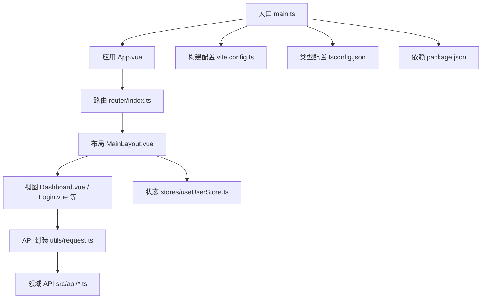
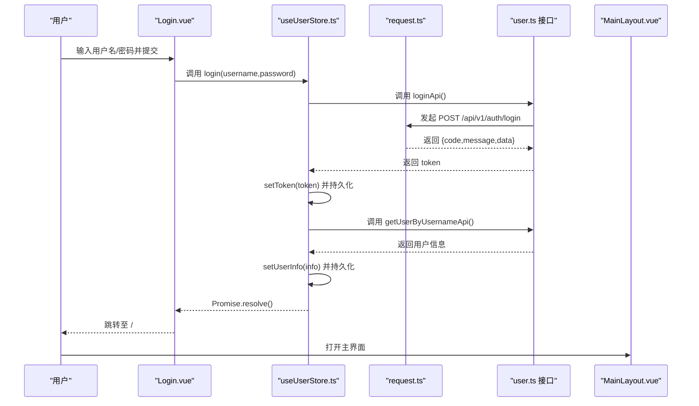
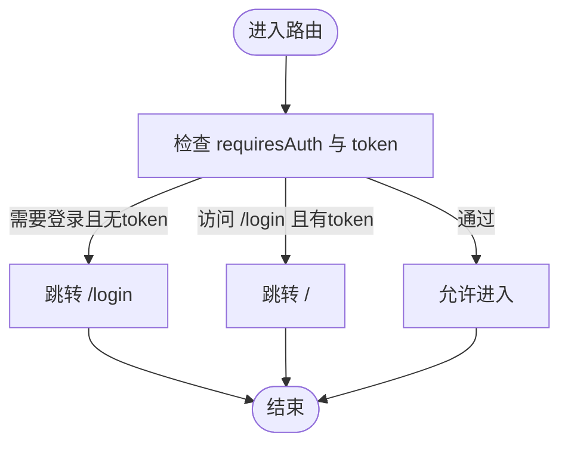
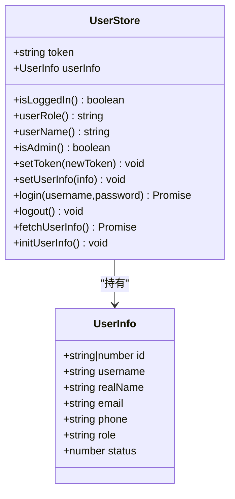
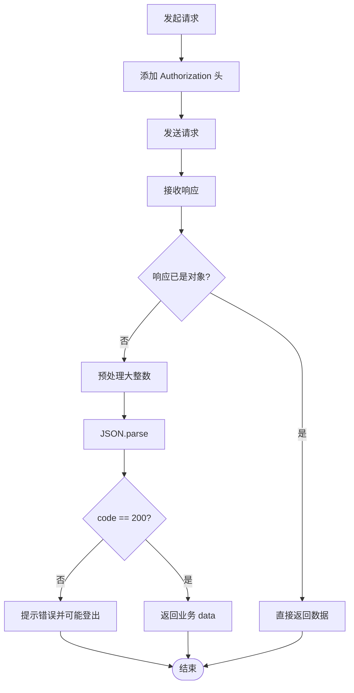
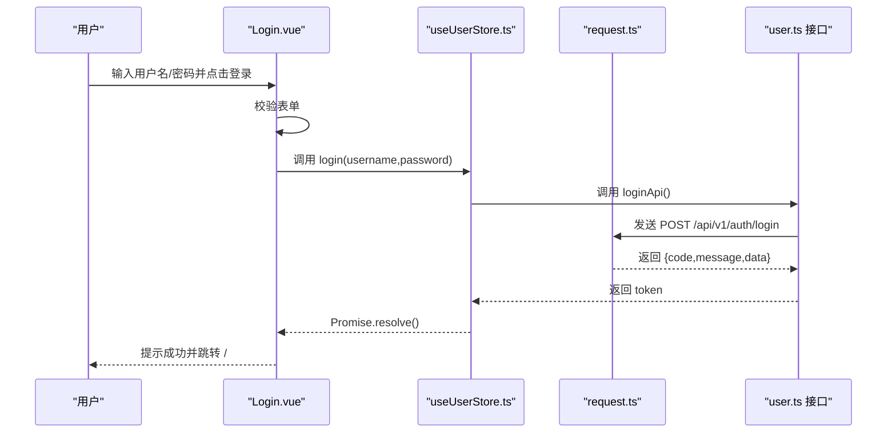
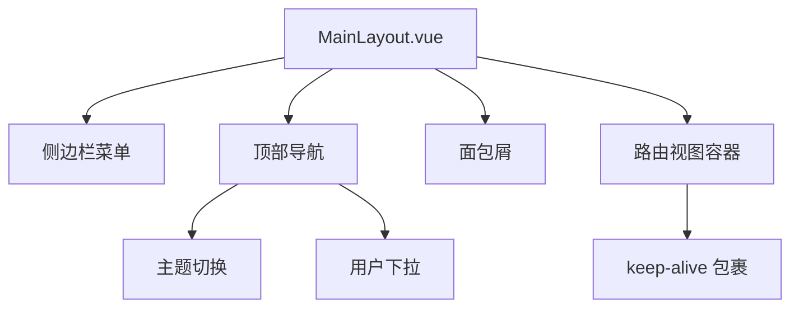
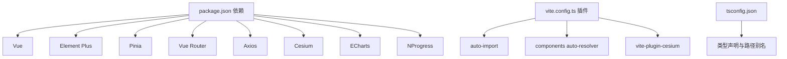

# 开发指南

<cite>
**本文引用的文件**
- [README.md](file://README.md)
- [package.json](file://package.json)
- [vite.config.ts](file://vite.config.ts)
- [tsconfig.json](file://tsconfig.json)
- [src/main.ts](file://src/main.ts)
- [src/router/index.ts](file://src/router/index.ts)
- [src/stores/useUserStore.ts](file://src/stores/useUserStore.ts)
- [src/utils/request.ts](file://src/utils/request.ts)
- [src/api/user.ts](file://src/api/user.ts)
- [src/App.vue](file://src/App.vue)
- [src/layouts/MainLayout.vue](file://src/layouts/MainLayout.vue)
- [src/views/dashboard/Dashboard.vue](file://src/views/dashboard/Dashboard.vue)
- [src/views/login/Login.vue](file://src/views/login/Login.vue)
</cite>

## 目录
1. [简介](#简介)
2. [项目结构](#项目结构)
3. [核心组件](#核心组件)
4. [架构总览](#架构总览)
5. [详细组件分析](#详细组件分析)
6. [依赖关系分析](#依赖关系分析)
7. [性能考虑](#性能考虑)
8. [故障排除指南](#故障排除指南)
9. [结论](#结论)
10. [附录](#附录)

## 简介
本指南面向水文监测管理系统前端团队，目标是帮助新成员快速上手开发，统一开发规范与最佳实践，并覆盖从环境搭建、编码风格、组件与API开发、构建与部署到性能优化与故障排查的全流程。项目采用 Vue 3 + TypeScript + Element Plus + Pinia + Vue Router + Vite 技术栈，强调强类型约束、组件化与模块化组织。

## 项目结构
项目采用按功能域划分的目录结构，便于扩展与维护：
- src/api：API 接口封装，按领域拆分（如 user、station、terminal）
- src/stores：Pinia 状态管理，按领域拆分（如 useUserStore、useTerminalStore）
- src/utils：通用工具函数（如请求封装、格式化、校验）
- src/views：页面级组件，按模块组织（如 dashboard、data、login、map、terminal、user）
- src/layouts：布局组件（如 MainLayout）
- src/components：通用业务组件（如 ThemeSwitcher）
- src/router：路由配置与守卫
- src/styles：全局样式与变量
- src/types：全局类型定义
- 构建与配置：vite.config.ts、tsconfig.json、package.json

**图表来源**
- [src/main.ts:1-26](file://src/main.ts#L1-L26)
- [src/App.vue:1-15](file://src/App.vue#L1-L15)
- [src/router/index.ts:1-136](file://src/router/index.ts#L1-L136)
- [src/layouts/MainLayout.vue:1-434](file://src/layouts/MainLayout.vue#L1-L434)
- [src/views/dashboard/Dashboard.vue:1-155](file://src/views/dashboard/Dashboard.vue#L1-L155)
- [src/views/login/Login.vue:1-408](file://src/views/login/Login.vue#L1-L408)
- [src/stores/useUserStore.ts:1-200](file://src/stores/useUserStore.ts#L1-L200)
- [src/utils/request.ts:1-180](file://src/utils/request.ts#L1-L180)
- [src/api/user.ts:1-179](file://src/api/user.ts#L1-L179)
- [vite.config.ts:1-68](file://vite.config.ts#L1-L68)
- [tsconfig.json:1-40](file://tsconfig.json#L1-L40)
- [package.json:1-48](file://package.json#L1-L48)

**章节来源**
- [README.md:17-34](file://README.md#L17-L34)
- [src/main.ts:1-26](file://src/main.ts#L1-L26)
- [vite.config.ts:1-68](file://vite.config.ts#L1-L68)
- [tsconfig.json:1-40](file://tsconfig.json#L1-L40)

## 核心组件
- 应用入口与插件注册：在入口文件中完成应用创建、插件安装（Element Plus、路由、状态）、全局样式引入与挂载。
- 路由与权限：通过路由守卫实现登录态校验与进度条展示；路由采用懒加载与父子结构组织。
- 状态管理：使用 Pinia 定义用户状态，包含登录、登出、用户信息获取与初始化恢复。
- 请求封装：Axios 实例封装，统一处理大整数精度、鉴权头、业务状态码与错误提示。
- 视图与布局：Dashboard 作为首页概览，Login 提供登录表单与动画；MainLayout 提供侧边栏、面包屑、头部导航与主题切换。

**章节来源**
- [src/main.ts:1-26](file://src/main.ts#L1-L26)
- [src/router/index.ts:116-135](file://src/router/index.ts#L116-L135)
- [src/stores/useUserStore.ts:18-199](file://src/stores/useUserStore.ts#L18-L199)
- [src/utils/request.ts:52-151](file://src/utils/request.ts#L52-L151)
- [src/views/dashboard/Dashboard.vue:1-155](file://src/views/dashboard/Dashboard.vue#L1-L155)
- [src/views/login/Login.vue:80-134](file://src/views/login/Login.vue#L80-L134)
- [src/layouts/MainLayout.vue:117-211](file://src/layouts/MainLayout.vue#L117-L211)

## 架构总览
系统采用“入口 -> 路由 -> 布局 -> 视图 -> 状态/请求”的线性数据流，配合 Pinia 管理用户会话，Axios 统一封装 HTTP 请求，Element Plus 提供 UI 基础能力。

**图表来源**
- [src/views/login/Login.vue:117-134](file://src/views/login/Login.vue#L117-L134)
- [src/stores/useUserStore.ts:61-83](file://src/stores/useUserStore.ts#L61-L83)
- [src/api/user.ts:106-108](file://src/api/user.ts#L106-L108)
- [src/utils/request.ts:155-177](file://src/utils/request.ts#L155-L177)
- [src/layouts/MainLayout.vue:206-210](file://src/layouts/MainLayout.vue#L206-L210)

## 详细组件分析

### 路由与权限控制
- 路由结构：采用父子路由组织模块菜单，支持懒加载与图标、标题元信息。
- 权限守卫：在进入路由前检查 token，未登录跳转登录页，已登录访问登录页则跳转首页。
- 进度条：使用 NProgress 在路由切换时显示加载状态。

**图表来源**
- [src/router/index.ts:116-135](file://src/router/index.ts#L116-L135)

**章节来源**
- [src/router/index.ts:8-109](file://src/router/index.ts#L8-L109)

### 用户状态管理（Pinia）
- 状态：token、userInfo
- 计算属性：isLoggedIn、userRole、userName、isAdmin
- 动作：setToken、setUserInfo、login、logout、fetchUserInfo、initUserInfo
- 默认用户与缓存恢复：支持从 sessionStorage 恢复用户信息，失败时回退默认管理员信息。

**图表来源**
- [src/stores/useUserStore.ts:18-199](file://src/stores/useUserStore.ts#L18-L199)

**章节来源**
- [src/stores/useUserStore.ts:18-199](file://src/stores/useUserStore.ts#L18-L199)

### 请求封装与拦截器
- Axios 实例：baseURL 根据环境动态选择，超时、请求头统一配置。
- 响应预处理：对超过安全整数范围的大整数进行字符串化处理，避免精度丢失。
- 请求拦截：自动注入 Authorization 头。
- 响应拦截：根据业务 code 处理消息与错误，401 自动登出并跳转登录页。
- 方法导出：get/post/put/del，返回业务数据 T。

**图表来源**
- [src/utils/request.ts:52-151](file://src/utils/request.ts#L52-L151)

**章节来源**
- [src/utils/request.ts:52-151](file://src/utils/request.ts#L52-L151)

### 登录视图与交互
- 表单校验：用户名、密码长度校验。
- 登录流程：表单校验通过后调用用户仓库登录，成功后提示并跳转首页。
- 动画与样式：登录页包含动态背景、粒子与波浪动画，提升视觉体验。

**图表来源**
- [src/views/login/Login.vue:117-134](file://src/views/login/Login.vue#L117-L134)
- [src/stores/useUserStore.ts:61-83](file://src/stores/useUserStore.ts#L61-L83)
- [src/api/user.ts:106-108](file://src/api/user.ts#L106-L108)
- [src/utils/request.ts:155-177](file://src/utils/request.ts#L155-L177)

**章节来源**
- [src/views/login/Login.vue:80-134](file://src/views/login/Login.vue#L80-L134)

### 主布局与导航
- 侧边栏：支持折叠、图标与标题、面包屑导航。
- 头部：主题切换、用户头像与下拉菜单（个人中心、退出登录）。
- keep-alive：对路由视图启用缓存，减少重复渲染。
- 初始化：挂载时从缓存恢复用户信息与主题。

**图表来源**
- [src/layouts/MainLayout.vue:117-211](file://src/layouts/MainLayout.vue#L117-L211)

**章节来源**
- [src/layouts/MainLayout.vue:117-211](file://src/layouts/MainLayout.vue#L117-L211)

### 仪表盘视图
- 统计卡片：用户总数、文章数量、评论数量、访问量。
- 图表占位：访问趋势与用户分布区域预留。
- 快捷操作：新建用户、导入数据、导出数据、系统设置按钮。

**章节来源**
- [src/views/dashboard/Dashboard.vue:1-155](file://src/views/dashboard/Dashboard.vue#L1-L155)

## 依赖关系分析
- 构建与开发：Vite 提供开发服务器、代理与打包；TypeScript 提供类型检查；ESLint/Prettier 保证代码风格。
- 运行时依赖：Vue、Element Plus、Pinia、Vue Router、Axios、Cesium、ECharts、NProgress。
- 插件生态：unplugin-auto-import、unplugin-vue-components、vite-plugin-cesium。

**图表来源**
- [package.json:14-46](file://package.json#L14-L46)
- [vite.config.ts:14-27](file://vite.config.ts#L14-L27)
- [tsconfig.json:24-31](file://tsconfig.json#L24-L31)

**章节来源**
- [package.json:14-46](file://package.json#L14-L46)
- [vite.config.ts:1-68](file://vite.config.ts#L1-L68)
- [tsconfig.json:1-40](file://tsconfig.json#L1-L40)

## 性能考虑
- 代码分割：Vite Rollup 配置对 element-plus 与 vendor 进行手动分包，降低首屏体积。
- 资源体积预警：chunkSizeWarningLimit 调整以提前发现大模块。
- 进度条与懒加载：NProgress 与路由懒加载减少感知延迟。
- 大整数处理：请求拦截器预处理避免精度丢失，减少后端数据清洗成本。
- 缓存策略：用户信息与主题在 sessionStorage/localStorage 中持久化，减少重复请求与初始化成本。

**章节来源**
- [vite.config.ts:53-65](file://vite.config.ts#L53-L65)
- [src/utils/request.ts:22-50](file://src/utils/request.ts#L22-L50)
- [src/stores/useUserStore.ts:51-53](file://src/stores/useUserStore.ts#L51-L53)
- [src/stores/useUserStore.ts:172-183](file://src/stores/useUserStore.ts#L172-L183)

## 故障排除指南
- 登录失败或报错
  - 检查 .env 中 VITE_API_BASE_URL 是否正确，确认 /api 代理配置。
  - 确认后端返回的 token 字段与解析逻辑一致。
  - 查看响应拦截器对 401 的处理是否触发登出。
  - 参考：[src/views/login/Login.vue:117-134](file://src/views/login/Login.vue#L117-L134)，[src/stores/useUserStore.ts:61-83](file://src/stores/useUserStore.ts#L61-L83)，[src/utils/request.ts:96-151](file://src/utils/request.ts#L96-L151)
- 图表或地图空白
  - 确认 Cesium 插件已启用，检查代理 /ai-api 与 /api 的目标地址。
  - 参考：[vite.config.ts:16](file://vite.config.ts#L16)，[vite.config.ts:37-51](file://vite.config.ts#L37-L51)
- 构建报错或类型检查失败
  - 使用 npm run type-check 检查类型问题；确保 tsconfig.json 路径别名与类型声明正确。
  - 参考：[tsconfig.json:24-31](file://tsconfig.json#L24-L31)，[package.json:12](file://package.json#L12)
- 本地开发端口或跨域问题
  - 修改 VITE_PORT 或检查代理规则；确认 /api 前缀与后端路径映射。
  - 参考：[vite.config.ts:33-51](file://vite.config.ts#L33-L51)

**章节来源**
- [src/views/login/Login.vue:117-134](file://src/views/login/Login.vue#L117-L134)
- [src/stores/useUserStore.ts:61-83](file://src/stores/useUserStore.ts#L61-L83)
- [src/utils/request.ts:96-151](file://src/utils/request.ts#L96-L151)
- [vite.config.ts:16](file://vite.config.ts#L16)
- [vite.config.ts:33-51](file://vite.config.ts#L33-L51)
- [tsconfig.json:24-31](file://tsconfig.json#L24-L31)
- [package.json:12](file://package.json#L12)

## 结论
本指南围绕开发规范、组件与API开发、构建与部署、性能优化与故障排查提供了系统化的参考。建议团队在日常协作中严格遵循 TypeScript 强类型约束、组件 scoped 样式、Pinia 状态集中管理与 Axios 统一封装的原则，持续优化用户体验与开发效率。

## 附录

### 开发环境搭建与运行
- 安装依赖：npm install
- 开发运行：npm run dev（默认端口由 VITE_PORT 控制）
- 生产构建：npm run build
- 代码检查：npm run lint
- 类型检查：npm run type-check

**章节来源**
- [README.md:52-84](file://README.md#L52-L84)
- [package.json:6-12](file://package.json#L6-L12)
- [vite.config.ts:33-36](file://vite.config.ts#L33-L36)

### 代码规范与最佳实践
- 语言与框架：Vue 3 Composition API + `<script setup>`，TypeScript 严格模式。
- 禁止使用 any，Props 必须定义类型验证。
- 组件样式使用 scoped，异步操作必须包含错误处理。
- 统一使用 Element Plus 组件与图标，避免手工引入。
- API 调用统一通过 utils/request.ts，遵循业务 code 约定。

**章节来源**
- [README.md:106-117](file://README.md#L106-L117)
- [src/utils/request.ts:155-179](file://src/utils/request.ts#L155-L179)

### Git 工作流程与分支管理
- 分支命名：feature/xxx、fix/xxx、docs/xxx、refactor/xxx
- 提交规范：类型(scope): 说明（参考 Angular 规范）
- 合并与审查：通过 Pull Request 进行代码审查，合并前确保通过 lint 与 type-check

[本节为通用流程建议，不直接分析具体文件，故无章节来源]

### 环境变量与部署
- 环境变量：.env（通用）、.env.development（开发）、.env.production（生产）
- 构建产物：dist，可通过 npm run preview 预览
- 代理与端口：VITE_PORT 控制开发端口，VITE_API_BASE_URL 控制后端代理

**章节来源**
- [README.md:100-105](file://README.md#L100-L105)
- [vite.config.ts:11](file://vite.config.ts#L11)
- [vite.config.ts:33-45](file://vite.config.ts#L33-L45)
- [package.json:9](file://package.json#L9)