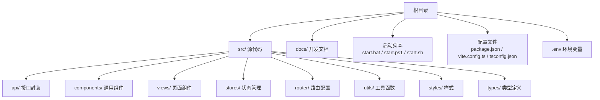
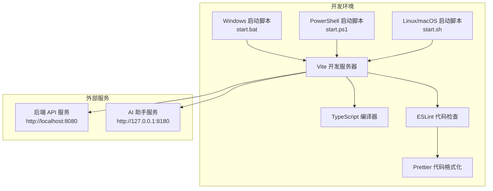
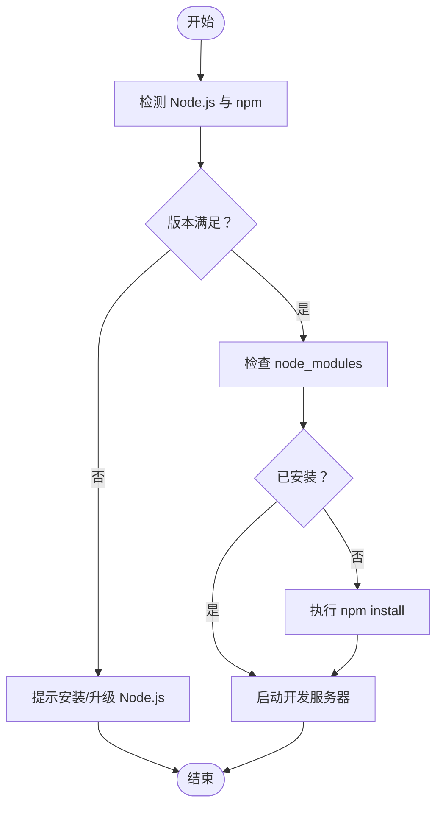
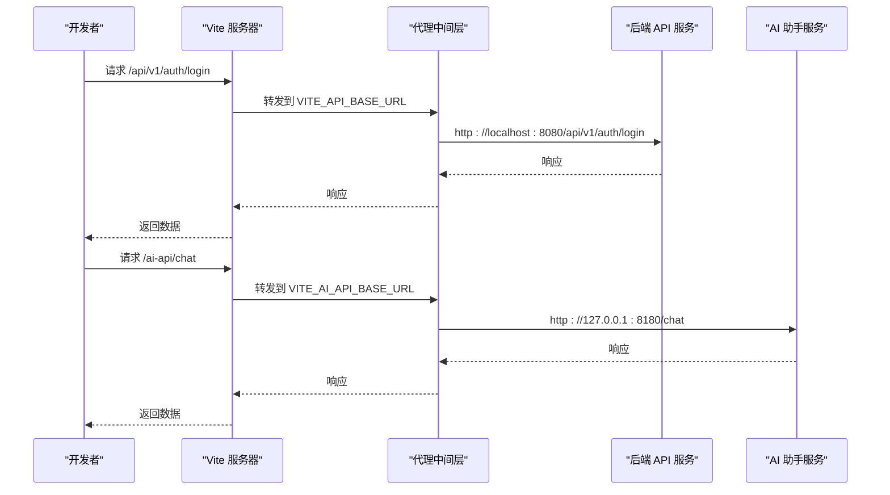
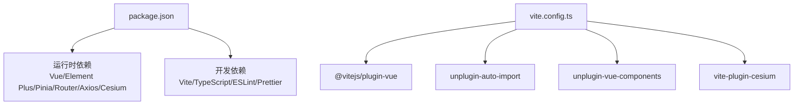

# 开发环境搭建

<cite>
**本文档引用的文件**
- [package.json](file://package.json)
- [vite.config.ts](file://vite.config.ts)
- [tsconfig.json](file://tsconfig.json)
- [tsconfig.node.json](file://tsconfig.node.json)
- [README.md](file://README.md)
- [docs/GUIDE.md](file://docs/GUIDE.md)
- [docs/AI_CHAT_GUIDE.md](file://docs/AI_CHAT_GUIDE.md)
- [start.bat](file://start.bat)
- [start.ps1](file://start.ps1)
- [start.sh](file://start.sh)
- [check-status.bat](file://check-status.bat)
</cite>

## 目录
1. [简介](#简介)
2. [项目结构](#项目结构)
3. [核心组件](#核心组件)
4. [架构总览](#架构总览)
5. [详细组件分析](#详细组件分析)
6. [依赖关系分析](#依赖关系分析)
7. [性能考虑](#性能考虑)
8. [故障排查指南](#故障排查指南)
9. [结论](#结论)
10. [附录](#附录)

## 简介
本指南面向水文监测管理系统前端开发团队，提供从零开始搭建开发环境的完整流程，涵盖 Node.js 版本要求、依赖安装、开发服务器启动、环境变量配置，以及跨平台（Windows、PowerShell、Linux/macOS）的启动方式差异。同时详解 Vite 构建工具配置、TypeScript 编译设置与 ESLint 代码检查工具的使用，并给出开发工具推荐、IDE 配置建议与调试技巧，帮助开发者快速、稳定地完成本地开发环境搭建。

## 项目结构
项目采用 Vue 3 + TypeScript + Vite 技术栈，核心目录与文件如下：
- 根目录包含构建脚本与配置：package.json、vite.config.ts、tsconfig.json、tsconfig.node.json
- 文档目录 docs 提供完整开发指南与故障排查
- 平台启动脚本：start.bat（Windows）、start.ps1（PowerShell）、start.sh（Linux/macOS）
- 环境变量文件：.env、.env.development、.env.production（由 README 与文档说明）

**图表来源**
- [docs/GUIDE.md:71-95](file://docs/GUIDE.md#L71-L95)
- [README.md:17-34](file://README.md#L17-L34)

**章节来源**
- [docs/GUIDE.md:71-95](file://docs/GUIDE.md#L71-L95)
- [README.md:17-34](file://README.md#L17-L34)

## 核心组件
- 包管理与脚本：通过 package.json 定义开发、构建、预览、代码检查与格式化脚本
- 构建工具：Vite 配置集中于 vite.config.ts，包含插件、别名、代理、构建分包策略
- 类型系统：TypeScript 配置位于 tsconfig.json 与 tsconfig.node.json，启用严格模式与路径别名
- 平台启动：Windows、PowerShell、Linux/macOS 三套启动脚本，统一完成环境检测、依赖安装与开发服务器启动

**章节来源**
- [package.json:6-13](file://package.json#L6-L13)
- [vite.config.ts:1-68](file://vite.config.ts#L1-L68)
- [tsconfig.json:1-40](file://tsconfig.json#L1-L40)
- [tsconfig.node.json:1-12](file://tsconfig.node.json#L1-L12)

## 架构总览
下图展示了开发环境的核心组件交互：启动脚本负责环境检测与依赖安装；Vite 作为开发服务器，加载环境变量并通过代理转发 API 请求；TypeScript 负责编译与类型检查；ESLint 与 Prettier 保障代码风格与质量。

**图表来源**
- [start.bat:1-66](file://start.bat#L1-L66)
- [start.ps1:1-161](file://start.ps1#L1-L161)
- [start.sh:1-65](file://start.sh#L1-L65)
- [vite.config.ts:33-51](file://vite.config.ts#L33-L51)
- [package.json:6-13](file://package.json#L6-L13)

## 详细组件分析

### Node.js 与包管理器版本要求
- 系统要求：Node.js >= 16.0.0（推荐 LTS），npm >= 7.0.0
- 启动脚本均包含环境检测逻辑，若未安装或版本不满足，会提示安装与升级

**章节来源**
- [docs/GUIDE.md:11-16](file://docs/GUIDE.md#L11-L16)
- [start.bat:8-28](file://start.bat#L8-L28)
- [start.ps1:11-30](file://start.ps1#L11-L30)
- [start.sh:8-24](file://start.sh#L8-L24)

### 依赖安装步骤
- Windows：双击 start.bat 或在命令行执行，脚本会自动检测并安装依赖
- PowerShell：执行 start.ps1，提供菜单选择与依赖安装
- Linux/macOS：执行 start.sh，自动检测并安装依赖
- 手动安装：在任意平台执行 npm install

**图表来源**
- [start.bat:8-49](file://start.bat#L8-L49)
- [start.ps1:11-49](file://start.ps1#L11-L49)
- [start.sh:8-43](file://start.sh#L8-L43)

**章节来源**
- [start.bat:8-49](file://start.bat#L8-L49)
- [start.ps1:11-49](file://start.ps1#L11-L49)
- [start.sh:8-43](file://start.sh#L8-L43)

### 开发服务器启动方法（跨平台）
- Windows：双击 start.bat 或执行 npm run dev
- PowerShell：执行 start.ps1，选择开发模式
- Linux/macOS：执行 start.sh，自动检测端口占用并启动
- 默认访问地址：http://localhost:3000（可通过环境变量调整）

**章节来源**
- [docs/GUIDE.md:17-51](file://docs/GUIDE.md#L17-L51)
- [start.bat:50-66](file://start.bat#L50-L66)
- [start.ps1:73-86](file://start.ps1#L73-L86)
- [start.sh:45-64](file://start.sh#L45-L64)

### 环境变量配置
- 通用环境变量：.env
- 开发环境：.env.development（包含 VITE_PORT、VITE_API_BASE_URL、VITE_AI_API_BASE_URL）
- 生产环境：.env.production（包含 VITE_API_BASE_URL）
- Vite 会根据 mode 加载对应环境变量，未指定时默认 development

**章节来源**
- [README.md:100-104](file://README.md#L100-L104)
- [docs/GUIDE.md:101-114](file://docs/GUIDE.md#L101-L114)
- [vite.config.ts:10-11](file://vite.config.ts#L10-L11)

### Vite 构建工具配置
- 插件生态：Vue 插件、自动导入 Element Plus、自动组件注册、Cesium 插件
- 路径别名：@ 指向 src
- 服务器：host=0.0.0.0、端口来自 VITE_PORT、自动打开浏览器
- 代理规则：
  - /api → VITE_API_BASE_URL（保留路径前缀）
  - /ai-api → VITE_AI_API_BASE_URL（重写为无前缀）
- 构建优化：分包 element-plus 与 vendor（vue、vue-router、pinia、axios）

**图表来源**
- [vite.config.ts:33-51](file://vite.config.ts#L33-L51)
- [docs/AI_CHAT_GUIDE.md:25-30](file://docs/AI_CHAT_GUIDE.md#L25-L30)

**章节来源**
- [vite.config.ts:14-27](file://vite.config.ts#L14-L27)
- [vite.config.ts:28-32](file://vite.config.ts#L28-L32)
- [vite.config.ts:33-51](file://vite.config.ts#L33-L51)
- [vite.config.ts:53-66](file://vite.config.ts#L53-L66)

### TypeScript 编译设置
- 目标与模块：ES2020、ESNext、bundler 模式
- 严格模式：开启严格检查、未使用变量/参数、switch 穷举
- 路径别名：@/* 映射 src/*
- 类型声明：包含 vite/client 与 element-plus/global
- Node 配置：tsconfig.node.json 用于 Vite 配置文件的类型检查

**章节来源**
- [tsconfig.json:2-31](file://tsconfig.json#L2-L31)
- [tsconfig.node.json:2-11](file://tsconfig.node.json#L2-L11)

### ESLint 与代码检查
- ESLint 配置：扫描 .vue、.js、.ts 等扩展名，支持 --fix 与忽略 .gitignore
- 与 Prettier 集成：通过 eslint-config-prettier 关闭与 Prettier 冲突的规则
- 常用命令：npm run lint（检查）、npm run type-check（类型检查）、npm run format（格式化）

**章节来源**
- [package.json:10-12](file://package.json#L10-L12)
- [package.json:32-37](file://package.json#L32-L37)

### 平台启动脚本差异
- Windows（start.bat）：基础检测与自动安装，直接启动 npm run dev
- PowerShell（start.ps1）：菜单化选择（开发/构建/预览/检查/类型检查/清理），支持端口读取与详细输出
- Linux/macOS（start.sh）：端口占用检测与自动关闭占用进程，提升开发体验

**章节来源**
- [start.bat:1-66](file://start.bat#L1-L66)
- [start.ps1:60-161](file://start.ps1#L60-L161)
- [start.sh:45-64](file://start.sh#L45-L64)

## 依赖关系分析
- 运行时依赖：Vue 3、Element Plus、Pinia、Vue Router、Axios、Cesium、ECharts、NProgress、Markdown-it
- 开发依赖：Vite、TypeScript、ESLint、Prettier、Vue 插件与自动导入工具链
- Vite 插件：@vitejs/plugin-vue、unplugin-auto-import、unplugin-vue-components、vite-plugin-cesium

**图表来源**
- [package.json:14-46](file://package.json#L14-L46)
- [vite.config.ts:14-27](file://vite.config.ts#L14-L27)

**章节来源**
- [package.json:14-46](file://package.json#L14-L46)
- [vite.config.ts:14-27](file://vite.config.ts#L14-L27)

## 性能考虑
- 构建分包：将 element-plus 与 vendor（vue、vue-router、pinia、axios）独立打包，减少重复依赖
- 源映射：生产构建关闭 sourcemap，降低体积与泄露风险
- 警告阈值：chunkSizeWarningLimit 提升至 1500KB，避免过大包触发警告
- Cesium 插件：自动处理兼容性问题，减少手动配置成本

**章节来源**
- [vite.config.ts:53-66](file://vite.config.ts#L53-L66)

## 故障排查指南
- Node.js 未找到：安装/升级 Node.js LTS，重启终端验证 node -v 与 npm -v
- 依赖安装失败：清理缓存、删除 node_modules 与 lock 文件后重装
- 端口被占用：查找占用进程并结束，或修改 .env.development 中的 VITE_PORT
- TypeScript 类型错误：运行 npm run type-check 逐项修复后再构建
- 浏览器无法访问：尝试 http://127.0.0.1:3000，检查防火墙；查看控制台错误
- 环境变量未生效：确认 .env.development 存在且格式正确（无引号）
- 代理不通：检查 VITE_API_BASE_URL/VITE_AI_API_BASE_URL 与后端服务状态
- 详细日志：使用 DEBUG=vite:* npm run dev 查看 Vite 日志
- 依赖树检查：npm list --depth=0 定位冲突依赖
- 清理重建：删除 node_modules、dist、package-lock.json 后重新安装与启动

**章节来源**
- [docs/GUIDE.md:174-269](file://docs/GUIDE.md#L174-L269)
- [check-status.bat:8-62](file://check-status.bat#L8-L62)

## 结论
通过本指南，开发者可在 Windows、PowerShell、Linux/macOS 上快速完成开发环境搭建。借助统一的启动脚本、完善的环境变量配置与 Vite 代理机制，可高效进行本地开发与调试。配合 TypeScript 严格模式与 ESLint/Prettier 规范，确保代码质量与一致性。遇到问题时，可依据故障排查章节逐步定位并解决。

## 附录

### 常用命令速查
- 开发：npm run dev
- 构建：npm run build
- 预览：npm run preview
- 代码检查：npm run lint
- 类型检查：npm run type-check
- 代码格式化：npm run format

**章节来源**
- [docs/GUIDE.md:53-67](file://docs/GUIDE.md#L53-L67)
- [package.json:6-12](file://package.json#L6-L12)