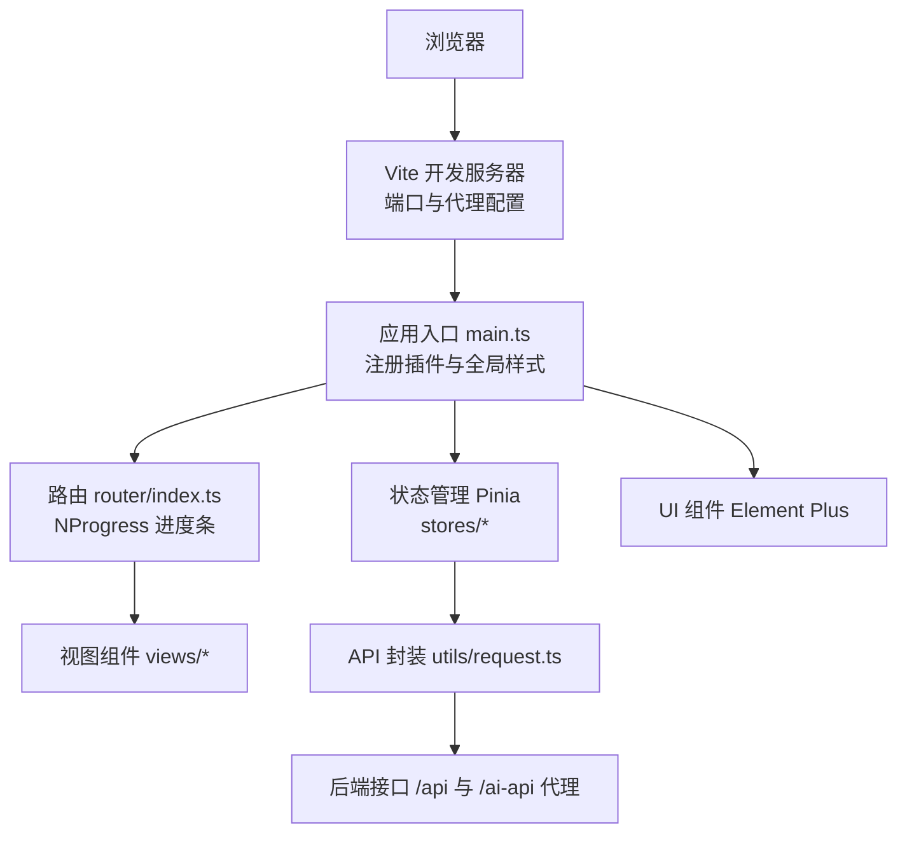
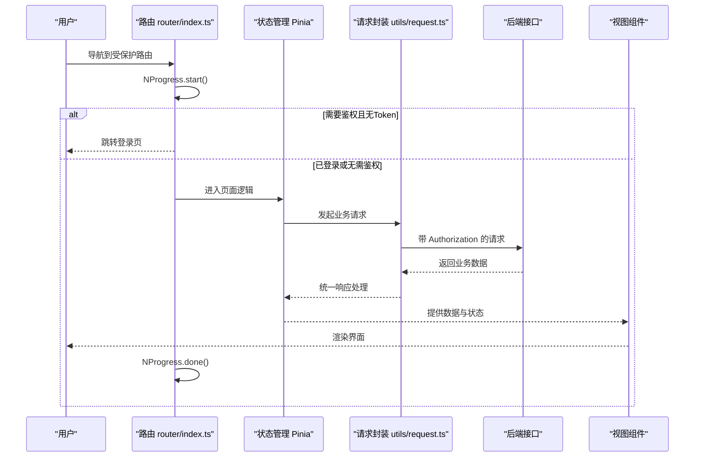
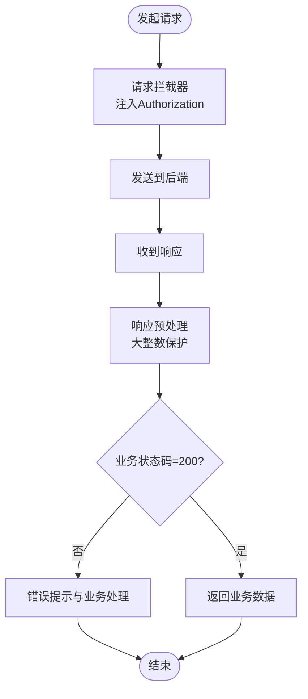
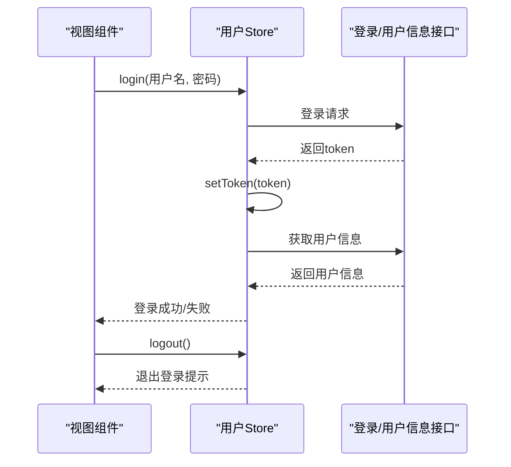
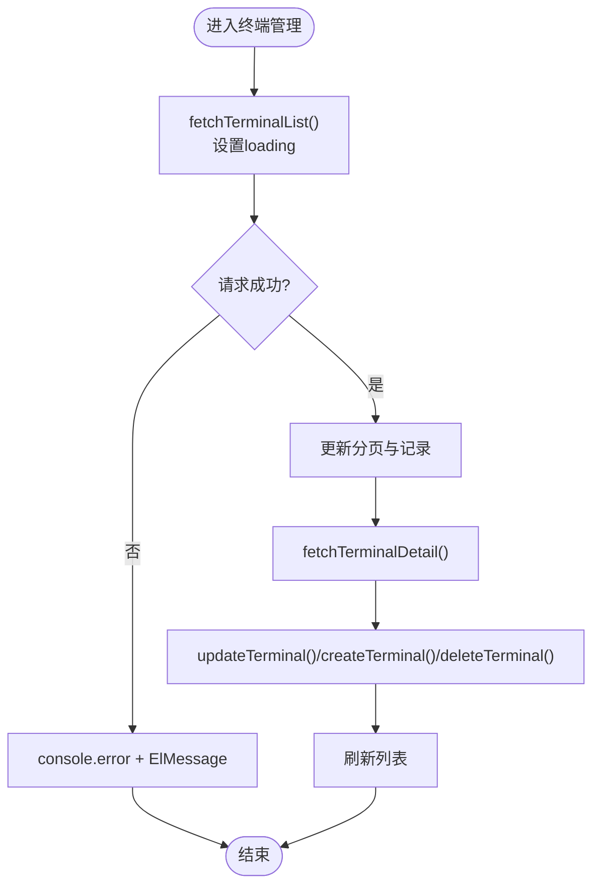
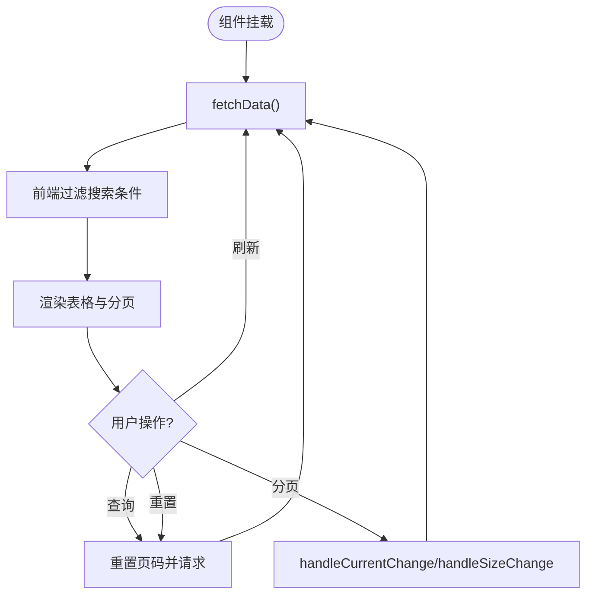
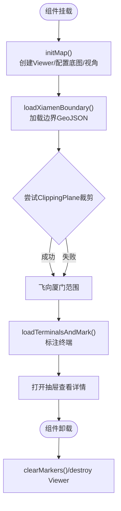
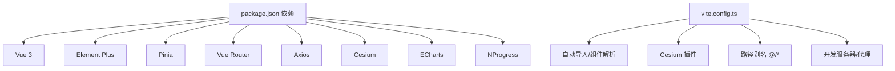

# 调试与性能分析

<cite>
**本文档引用的文件**
- [README.md](file://README.md)
- [package.json](file://package.json)
- [vite.config.ts](file://vite.config.ts)
- [src/main.ts](file://src/main.ts)
- [src/router/index.ts](file://src/router/index.ts)
- [src/utils/request.ts](file://src/utils/request.ts)
- [src/stores/useUserStore.ts](file://src/stores/useUserStore.ts)
- [src/stores/useTerminalStore.ts](file://src/stores/useTerminalStore.ts)
- [src/views/data/RealTimeData.vue](file://src/views/data/RealTimeData.vue)
- [src/views/map/MapOverview.vue](file://src/views/map/MapOverview.vue)
- [src/api/station.ts](file://src/api/station.ts)
- [src/api/terminal.ts](file://src/api/terminal.ts)
</cite>

## 目录
1. [简介](#简介)
2. [项目结构](#项目结构)
3. [核心组件](#核心组件)
4. [架构总览](#架构总览)
5. [详细组件分析](#详细组件分析)
6. [依赖分析](#依赖分析)
7. [性能考虑](#性能考虑)
8. [故障排查指南](#故障排查指南)
9. [结论](#结论)
10. [附录](#附录)

## 简介
本指南面向水文监测管理系统的前端开发与运维人员，聚焦于浏览器开发者工具与Vue DevTools的实战使用、网络请求调试、状态管理调试、组件渲染调试、性能分析（内存泄漏、渲染性能、网络性能）、错误日志收集与异常捕获、调试信息输出最佳实践，以及常见问题诊断与性能优化建议。文档结合项目实际代码结构与配置，提供可操作的步骤与可视化流程图。

## 项目结构
项目采用 Vue 3 + TypeScript + Vite + Element Plus + Pinia + Vue Router 技术栈，核心入口、路由、状态管理、网络请求与视图组件分布在 src 目录中；构建与代理通过 Vite 配置集中管理；开发与生产环境通过 .env.* 文件与 Vite 环境变量协同。

**图表来源**
- [vite.config.ts:33-52](file://vite.config.ts#L33-L52)
- [src/main.ts:12-25](file://src/main.ts#L12-L25)
- [src/router/index.ts:111-135](file://src/router/index.ts#L111-L135)

**章节来源**
- [README.md:17-34](file://README.md#L17-L34)
- [vite.config.ts:10-67](file://vite.config.ts#L10-L67)
- [src/main.ts:1-26](file://src/main.ts#L1-L26)

## 核心组件
- 应用入口与插件注册：创建应用实例、注册 Element Plus、路由与 Pinia，并挂载根组件。
- 路由与进度条：使用 NProgress 在路由切换时显示加载进度，便于观察网络与渲染耗时。
- 网络请求与拦截器：统一 Axios 实例，包含请求头注入 Token、响应预处理（大整数保护）、业务状态码处理与错误消息提示。
- 状态管理：用户状态与终端管理 Store，集中处理登录、Token、用户信息、终端列表与分页等。
- 视图组件：实时数据与地图概览组件，展示数据列表、分页与 Cesium 地图渲染，涉及复杂异步与资源管理。

**章节来源**
- [src/main.ts:12-25](file://src/main.ts#L12-L25)
- [src/router/index.ts:5-6](file://src/router/index.ts#L5-L6)
- [src/router/index.ts:116-133](file://src/router/index.ts#L116-L133)
- [src/utils/request.ts:52-75](file://src/utils/request.ts#L52-L75)
- [src/utils/request.ts:77-93](file://src/utils/request.ts#L77-L93)
- [src/utils/request.ts:95-151](file://src/utils/request.ts#L95-L151)
- [src/stores/useUserStore.ts:18-199](file://src/stores/useUserStore.ts#L18-L199)
- [src/stores/useTerminalStore.ts:23-293](file://src/stores/useTerminalStore.ts#L23-L293)
- [src/views/data/RealTimeData.vue:108-279](file://src/views/data/RealTimeData.vue#L108-L279)
- [src/views/map/MapOverview.vue:52-622](file://src/views/map/MapOverview.vue#L52-L622)

## 架构总览
系统从前端入口开始，经由路由与进度条，进入 Pinia 状态管理，调用统一的网络请求层，最终渲染到视图组件。网络请求层对响应进行预处理，避免大整数精度丢失，并根据业务状态码统一处理错误与 Token 失效逻辑。

**图表来源**
- [src/router/index.ts:116-133](file://src/router/index.ts#L116-L133)
- [src/utils/request.ts:77-93](file://src/utils/request.ts#L77-L93)
- [src/utils/request.ts:95-151](file://src/utils/request.ts#L95-L151)

## 详细组件分析

### 网络请求与拦截器调试
- 请求拦截：自动注入 Token，便于识别会话状态与权限校验。
- 响应拦截：统一业务状态码处理、错误消息提示、Token 失效跳转登录。
- 响应预处理：针对大整数（超过 JS 安全范围）进行字符串化处理，避免精度丢失。

**图表来源**
- [src/utils/request.ts:77-93](file://src/utils/request.ts#L77-L93)
- [src/utils/request.ts:95-151](file://src/utils/request.ts#L95-L151)
- [src/utils/request.ts:22-50](file://src/utils/request.ts#L22-L50)

**章节来源**
- [src/utils/request.ts:52-180](file://src/utils/request.ts#L52-L180)

### 用户状态与登录流程调试
- 登录：调用登录接口，成功后设置 Token 并拉取用户信息；失败时弹出错误消息。
- Token 解析：从 JWT 中解析用户名，若失败则降级使用默认管理员信息。
- 退出登录：清除 Token 与用户信息，提示“已退出登录”。

**图表来源**
- [src/stores/useUserStore.ts:61-83](file://src/stores/useUserStore.ts#L61-L83)
- [src/stores/useUserStore.ts:100-125](file://src/stores/useUserStore.ts#L100-L125)
- [src/stores/useUserStore.ts:132-150](file://src/stores/useUserStore.ts#L132-L150)
- [src/stores/useUserStore.ts:172-183](file://src/stores/useUserStore.ts#L172-L183)

**章节来源**
- [src/stores/useUserStore.ts:18-200](file://src/stores/useUserStore.ts#L18-L200)

### 终端管理状态调试
- 列表加载：分页查询终端列表，设置 loading 状态，异常时记录错误并提示。
- 详情查看：查询终端详情，打开详情对话框。
- 新增/更新/删除：统一返回业务数据，成功后刷新列表并提示成功，失败时提示失败。

**图表来源**
- [src/stores/useTerminalStore.ts:72-93](file://src/stores/useTerminalStore.ts#L72-L93)
- [src/stores/useTerminalStore.ts:99-113](file://src/stores/useTerminalStore.ts#L99-L113)
- [src/stores/useTerminalStore.ts:119-180](file://src/stores/useTerminalStore.ts#L119-L180)

**章节来源**
- [src/stores/useTerminalStore.ts:23-293](file://src/stores/useTerminalStore.ts#L23-L293)

### 实时数据组件调试
- 搜索与过滤：基于输入条件前端过滤，注意大数据量时的性能影响。
- 分页与加载：loading 控制与分页参数变更触发重新请求。
- 路由跳转：点击“查看历史数据”跳转到历史数据页并携带查询参数。

**图表来源**
- [src/views/data/RealTimeData.vue:187-229](file://src/views/data/RealTimeData.vue#L187-L229)
- [src/views/data/RealTimeData.vue:231-262](file://src/views/data/RealTimeData.vue#L231-L262)
- [src/views/data/RealTimeData.vue:264-278](file://src/views/data/RealTimeData.vue#L264-L278)

**章节来源**
- [src/views/data/RealTimeData.vue:108-300](file://src/views/data/RealTimeData.vue#L108-L300)

### 地图概览组件调试
- 地图初始化：创建 Cesium Viewer，配置天地图底图，设置初始视角。
- 边界加载与裁剪：加载厦门市边界 GeoJSON，尝试应用 ClippingPlane 裁剪，失败时回退默认显示。
- 终端标注：分页获取终端列表，在地图上绘制点位、标签与描述信息。
- 资源清理：组件卸载时清空标记并销毁 Viewer，防止内存泄漏。

**图表来源**
- [src/views/map/MapOverview.vue:77-124](file://src/views/map/MapOverview.vue#L77-L124)
- [src/views/map/MapOverview.vue:302-462](file://src/views/map/MapOverview.vue#L302-L462)
- [src/views/map/MapOverview.vue:467-485](file://src/views/map/MapOverview.vue#L467-L485)
- [src/views/map/MapOverview.vue:611-622](file://src/views/map/MapOverview.vue#L611-L622)

**章节来源**
- [src/views/map/MapOverview.vue:52-649](file://src/views/map/MapOverview.vue#L52-L649)

## 依赖分析
- 构建与代理：Vite 配置启用自动导入 Element Plus 与 Vue API、Cesium 插件、路径别名与开发服务器代理。
- 运行时依赖：Vue 3、Element Plus、Pinia、Vue Router、Axios、Cesium、ECharts、NProgress。
- 环境变量：通过 Vite 环境变量控制端口与后端地址，支持开发与生产环境区分。

**图表来源**
- [package.json:14-26](file://package.json#L14-L26)
- [vite.config.ts:14-27](file://vite.config.ts#L14-L27)
- [vite.config.ts:28-32](file://vite.config.ts#L28-L32)
- [vite.config.ts:33-52](file://vite.config.ts#L33-L52)

**章节来源**
- [package.json:1-48](file://package.json#L1-L48)
- [vite.config.ts:10-67](file://vite.config.ts#L10-L67)

## 性能考虑
- 渲染性能
  - 实时数据组件前端过滤：当数据量较大时，建议后端分页与筛选，减少前端渲染压力。
  - 地图组件：大量实体与裁剪平面可能影响性能，注意裁剪平面数量与 Viewer 销毁时机。
- 网络性能
  - 使用 NProgress 观察路由切换与请求耗时，结合浏览器 Network 面板分析接口耗时与缓存命中。
  - 合理设置超时与重试策略，避免长时间阻塞 UI。
- 内存泄漏
  - 地图组件卸载时务必销毁 Viewer 与清空标记；避免重复订阅或未清理的定时器。
- 构建优化
  - Vite 已按 vendor 与 element-plus 进行手动分包，关注打包体积与 chunkSize 警告阈值。

**章节来源**
- [src/views/data/RealTimeData.vue:187-229](file://src/views/data/RealTimeData.vue#L187-L229)
- [src/views/map/MapOverview.vue:611-622](file://src/views/map/MapOverview.vue#L611-L622)
- [vite.config.ts:53-65](file://vite.config.ts#L53-L65)

## 故障排查指南
- 登录与鉴权
  - 检查 Token 是否正确写入 localStorage，请求拦截器是否注入 Authorization。
  - 若出现 401，确认响应拦截器是否触发退出登录与跳转。
- 网络请求
  - 使用 Network 面板查看请求头、状态码、响应体；关注跨域与代理配置。
  - 大整数精度问题：确认响应预处理逻辑是否生效。
- 状态管理
  - 使用 Vue DevTools 观察 Pinia Store 的 state、getters、actions 调用链。
  - 用户信息降级：若 Token 解析失败，检查 JWT 结构与字段映射。
- 组件渲染
  - 实时数据：确认 loading 与分页参数变化是否触发请求。
  - 地图：确认 Viewer 初始化、底图加载与边界数据是否成功；失败时查看控制台错误。
- 错误日志与提示
  - 统一使用 ElMessage 输出错误信息，便于定位问题。
  - 控制台错误：结合浏览器 Console 面板与堆栈信息定位具体调用点。

**章节来源**
- [src/utils/request.ts:77-93](file://src/utils/request.ts#L77-L93)
- [src/utils/request.ts:95-151](file://src/utils/request.ts#L95-L151)
- [src/stores/useUserStore.ts:132-150](file://src/stores/useUserStore.ts#L132-L150)
- [src/stores/useUserStore.ts:172-183](file://src/stores/useUserStore.ts#L172-L183)
- [src/views/data/RealTimeData.vue:231-262](file://src/views/data/RealTimeData.vue#L231-L262)
- [src/views/map/MapOverview.vue:458-461](file://src/views/map/MapOverview.vue#L458-L461)

## 结论
通过浏览器开发者工具与 Vue DevTools 的系统化使用，结合统一的网络请求与状态管理机制，能够高效定位与解决水文监测管理系统前端的网络、状态与渲染问题。配合性能分析与内存泄漏防护措施，可在保证用户体验的同时提升系统稳定性与可维护性。

## 附录
- 浏览器开发者工具使用要点
  - Elements：检查 DOM 结构与样式，定位渲染异常。
  - Console：查看错误日志与调试输出，结合断点调试。
  - Sources：设置断点，逐步跟踪函数调用链。
  - Network：分析请求耗时、状态码、响应体与缓存行为。
  - Performance：录制渲染与交互过程，识别长任务与重排重绘。
  - Memory：快照对比，发现未释放的对象与闭包泄漏。
- Vue DevTools 安装与配置
  - 在浏览器扩展商店安装 Vue DevTools。
  - 在应用入口 main.ts 中启用严格模式与开发工具（若需要）。
  - 在组件中合理使用 watch、computed 与 emits，便于在 DevTools 中观察状态变化。
- 调试信息输出最佳实践
  - 使用结构化日志（含模块、方法、关键参数），避免冗余输出。
  - 对异步流程使用 try/catch 包裹并记录上下文信息。
  - 对关键路径（登录、列表加载、地图初始化）增加性能计时与错误埋点。