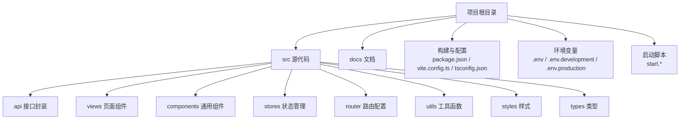
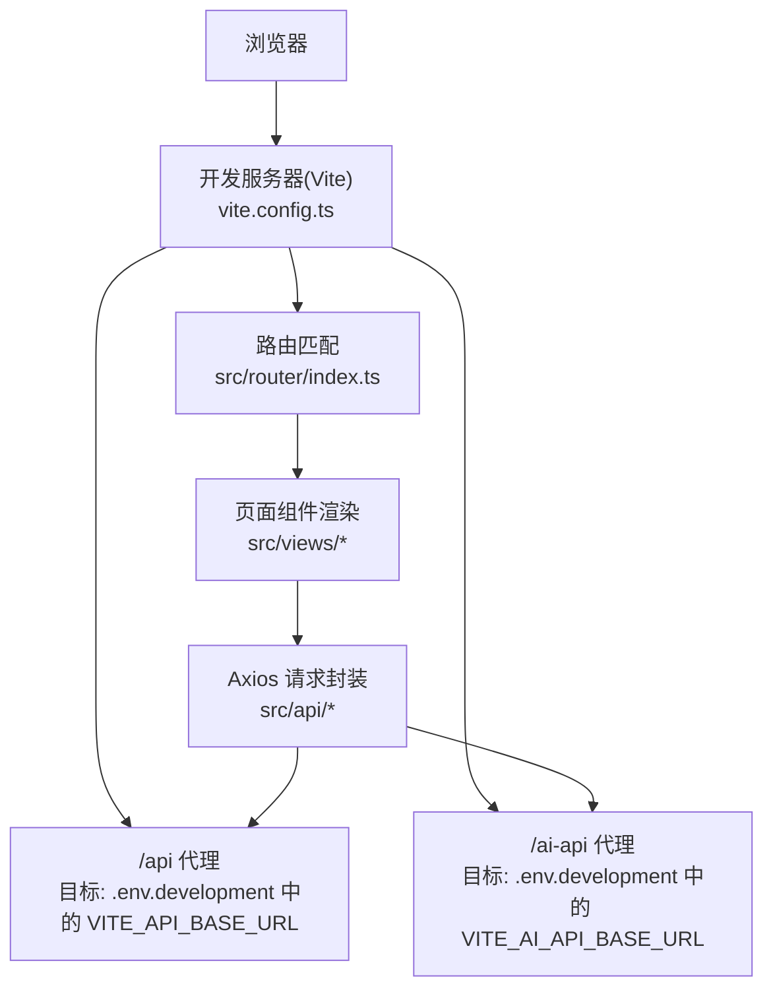
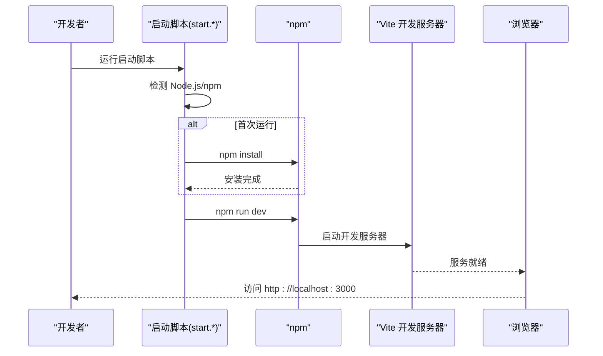
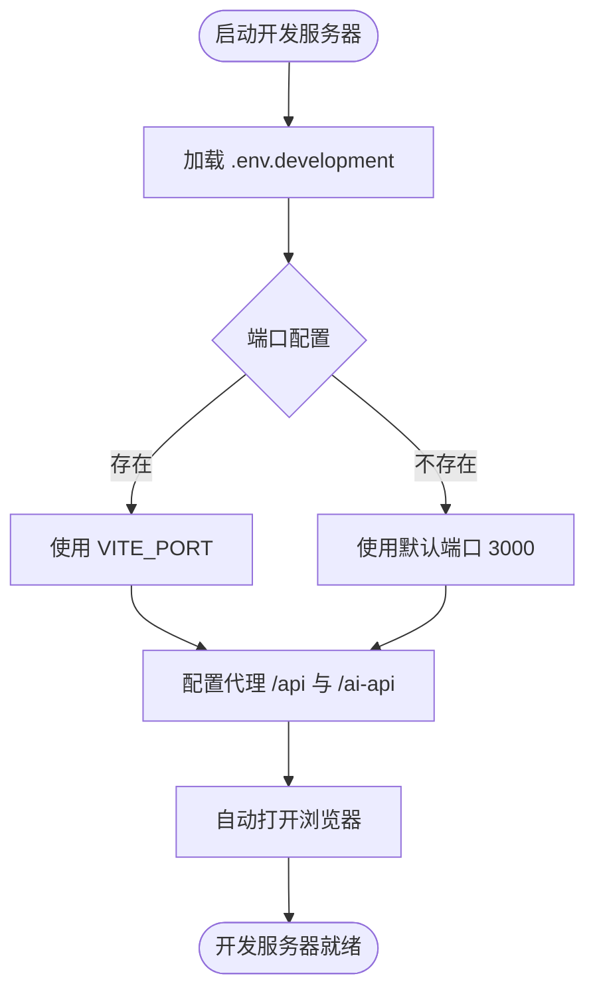
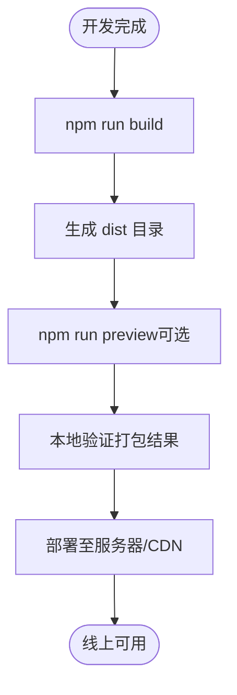
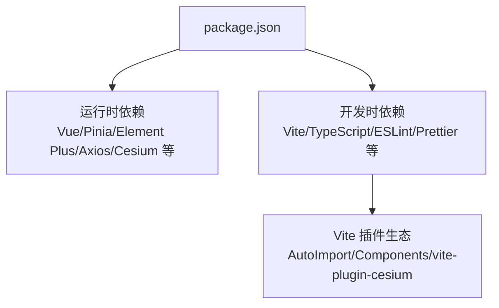
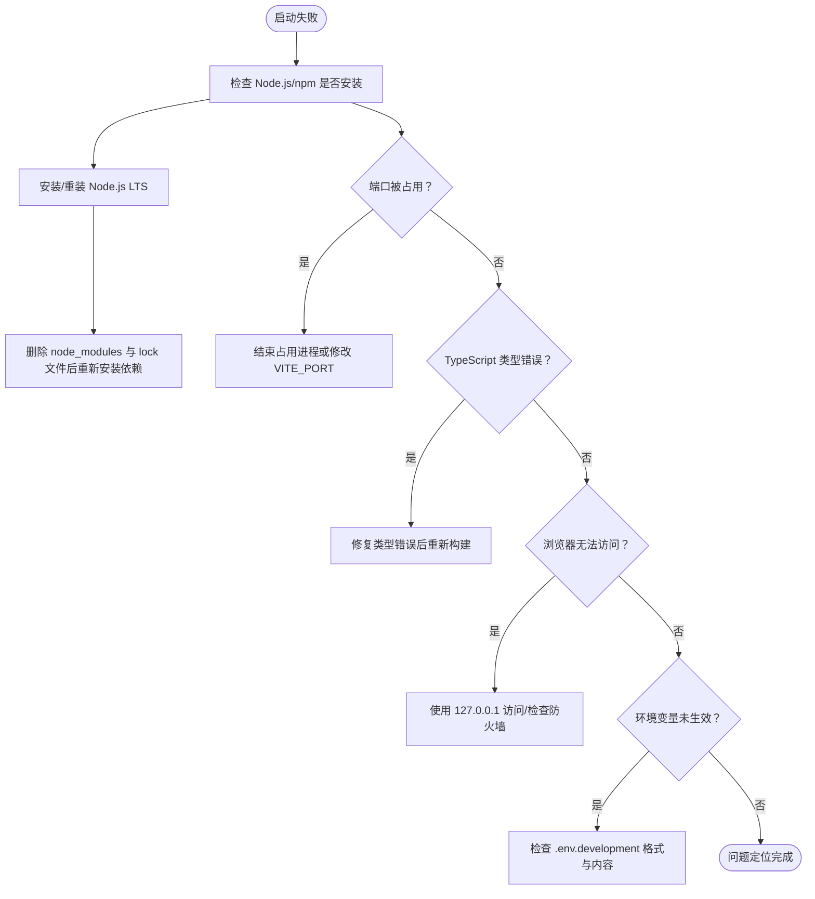

# 快速开始

<cite>
**本文引用的文件**
- [README.md](file://README.md)
- [GUIDE.md](file://docs/GUIDE.md)
- [package.json](file://package.json)
- [vite.config.ts](file://vite.config.ts)
- [.env.development](file://.env.development)
- [.env.production](file://.env.production)
- [tsconfig.json](file://tsconfig.json)
- [index.html](file://index.html)
- [src/main.ts](file://src/main.ts)
- [src/App.vue](file://src/App.vue)
- [src/router/index.ts](file://src/router/index.ts)
- [start.bat](file://start.bat)
- [start-quick.bat](file://start-quick.bat)
- [start.sh](file://start.sh)
- [start.ps1](file://start.ps1)
</cite>

## 目录
1. [简介](#简介)
2. [项目结构](#项目结构)
3. [核心组件](#核心组件)
4. [架构总览](#架构总览)
5. [详细组件分析](#详细组件分析)
6. [依赖分析](#依赖分析)
7. [性能考虑](#性能考虑)
8. [故障排查指南](#故障排查指南)
9. [结论](#结论)
10. [附录](#附录)

## 简介
本指南面向新加入的开发者，帮助你在最短时间内完成开发环境准备、项目启动与运行，并掌握常见问题的排查方法。项目采用 Vue 3 + TypeScript + Element Plus + Vite 技术栈，提供 Windows、macOS/Linux 的一键启动脚本与手动命令两种启动方式。

## 项目结构
- 项目采用“按功能域划分”的前端工程化组织方式，核心目录包括：
  - src/api：接口封装
  - src/views：页面组件
  - src/components：通用组件
  - src/stores：状态管理（Pinia）
  - src/router：路由配置
  - src/utils：工具函数
  - src/styles：全局样式
  - src/types：类型声明
  - docs：项目文档与指南

**章节来源**
- [README.md: 第17-34行:17-34](file://README.md#L17-L34)
- [GUIDE.md: 第71-95行:71-95](file://docs/GUIDE.md#L71-L95)

## 核心组件
- 应用入口与依赖注入
  - 入口文件负责创建应用实例、注册 Element Plus、国际化、全局样式与路由/状态管理插件。
- 根组件
  - 根组件通过路由视图渲染页面。
- 路由与权限
  - 路由采用懒加载与权限守卫，结合进度条 NProgress 实现跳转状态反馈。

**章节来源**
- [src/main.ts: 第1-26行:1-26](file://src/main.ts#L1-L26)
- [src/App.vue: 第1-15行:1-15](file://src/App.vue#L1-L15)
- [src/router/index.ts: 第111-136行:111-136](file://src/router/index.ts#L111-L136)

## 架构总览
下图展示了从浏览器访问到后端接口调用的关键路径，以及开发服务器代理与环境变量的作用。

**图表来源**
- [vite.config.ts: 第33-51行:33-51](file://vite.config.ts#L33-L51)
- [.env.development: 第3-5行:3-5](file://.env.development#L3-L5)
- [src/router/index.ts: 第111-136行:111-136](file://src/router/index.ts#L111-L136)

**章节来源**
- [vite.config.ts: 第10-67行:10-67](file://vite.config.ts#L10-L67)
- [.env.development: 第1-6行:1-6](file://.env.development#L1-L6)

## 详细组件分析

### 启动脚本与手动命令
- Windows 批处理脚本
  - 自动检测 Node.js 与 npm，首次运行自动安装依赖，随后启动开发服务器。
  - 可读取 .env.development 中的 VITE_PORT 并提示访问地址与后端 API 地址。
- PowerShell 脚本
  - 提供交互式菜单，支持开发、构建、预览、代码检查、类型检查与清理重装。
- Shell 脚本（macOS/Linux）
  - 自动检测 Node.js 与 npm，首次运行自动安装依赖；若端口被占用则尝试结束进程并重启。
- 手动命令
  - 安装依赖后，执行开发服务器命令即可启动。

**图表来源**
- [start.bat: 第8-65行:8-65](file://start.bat#L8-L65)
- [start.ps1: 第11-161行:11-161](file://start.ps1#L11-L161)
- [start.sh: 第8-64行:8-64](file://start.sh#L8-L64)
- [README.md: 第36-84行:36-84](file://README.md#L36-L84)

**章节来源**
- [start.bat: 第1-66行:1-66](file://start.bat#L1-L66)
- [start-quick.bat: 第1-66行:1-66](file://start-quick.bat#L1-L66)
- [start.sh: 第1-65行:1-65](file://start.sh#L1-L65)
- [start.ps1: 第1-161行:1-161](file://start.ps1#L1-L161)
- [README.md: 第36-84行:36-84](file://README.md#L36-L84)

### 开发服务器配置与访问
- 端口与主机
  - 默认监听 0.0.0.0:3000，可通过 .env.development 中的 VITE_PORT 修改。
- 代理配置
  - /api 前缀代理至后端服务地址（默认 http://localhost:8080）。
  - /ai-api 前缀代理至 AI 服务地址（默认 http://127.0.0.1:8180），并重写路径去除前缀。
- 自动打开浏览器
  - 开发服务器配置中开启自动打开浏览器。

**图表来源**
- [vite.config.ts: 第33-51行:33-51](file://vite.config.ts#L33-L51)
- [.env.development: 第3-5行:3-5](file://.env.development#L3-L5)

**章节来源**
- [vite.config.ts: 第33-51行:33-51](file://vite.config.ts#L33-L51)
- [.env.development: 第1-6行:1-6](file://.env.development#L1-L6)

### 生产环境构建与部署
- 构建命令
  - 执行生产构建生成 dist 目录产物。
- 预览构建
  - 在本地预览生产构建效果，便于验证打包结果。
- 部署建议
  - 将 dist 目录部署至静态服务器或 CDN；根据实际域名配置 .env.production 中的 VITE_API_BASE_URL。

**图表来源**
- [README.md: 第68-72行:68-72](file://README.md#L68-L72)

**章节来源**
- [README.md: 第68-84行:68-84](file://README.md#L68-L84)

## 依赖分析
- 运行时依赖
  - Vue 3、Vue Router、Pinia、Element Plus、Axios、Cesium、ECharts、NProgress 等。
- 开发时依赖
  - Vite、TypeScript、ESLint、Prettier、unplugin-auto-import、unplugin-vue-components、vite-plugin-cesium、vue-tsc 等。
- 包管理工具
  - 使用 npm 进行依赖安装与脚本执行。

**图表来源**
- [package.json: 第14-46行:14-46](file://package.json#L14-L46)

**章节来源**
- [package.json: 第1-48行:1-48](file://package.json#L1-L48)

## 性能考虑
- 构建优化
  - Rollup 分包策略将第三方库拆分为独立 chunk，减少重复打包体积。
  - 关闭 Source Map 以降低构建体积与调试成本。
- 资源与样式
  - 使用 SCSS 与全局样式变量，统一风格与减少重复样式。
- 路由与组件
  - 路由懒加载与按需加载组件，提升首屏性能。

**章节来源**
- [vite.config.ts: 第53-65行:53-65](file://vite.config.ts#L53-L65)
- [README.md: 第86-99行:86-99](file://README.md#L86-L99)

## 故障排查指南
- Node.js 未找到
  - 现象：启动脚本报错提示未检测到 Node.js。
  - 解决：安装 Node.js LTS 版本并重启终端，确认 node -v 与 npm -v 输出版本号。
- 依赖安装失败
  - 解决：清理 npm 缓存、删除 node_modules 与 lock 文件后重新安装。
- 端口被占用
  - 解决：查找占用端口的进程并结束，或修改 .env.development 中的 VITE_PORT。
- TypeScript 类型错误
  - 解决：执行类型检查修复错误后再进行构建。
- 浏览器无法访问
  - 解决：尝试使用 127.0.0.1 访问，检查防火墙与代理设置。
- 环境变量未生效
  - 检查 .env.development 文件是否存在且格式正确（键值对，无引号）。

**图表来源**
- [GUIDE.md: 第174-268行:174-268](file://docs/GUIDE.md#L174-L268)

**章节来源**
- [GUIDE.md: 第174-268行:174-268](file://docs/GUIDE.md#L174-L268)

## 结论
通过本快速开始指南，你已经了解了开发环境要求、启动脚本与手动命令、开发服务器配置、生产构建流程与常见问题排查方法。建议在首次启动前准备好 Node.js 与 npm，并优先使用提供的启动脚本以获得最佳体验。

## 附录
- 环境变量说明
  - .env.development：开发环境端口与后端 API 地址等。
  - .env.production：生产环境后端 API 地址等。
- 路由与页面
  - 路由采用懒加载与权限守卫，页面位于 src/views 下，按模块划分。
- 入口与模板
  - index.html 为应用入口模板，src/main.ts 为应用入口文件。

**章节来源**
- [.env.development: 第1-6行:1-6](file://.env.development#L1-L6)
- [.env.production: 第1-4行:1-4](file://.env.production#L1-L4)
- [src/router/index.ts: 第8-109行:8-109](file://src/router/index.ts#L8-L109)
- [index.html: 第1-14行:1-14](file://index.html#L1-L14)
- [src/main.ts: 第1-26行:1-26](file://src/main.ts#L1-L26)