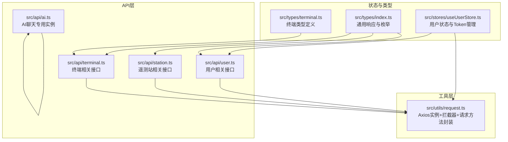
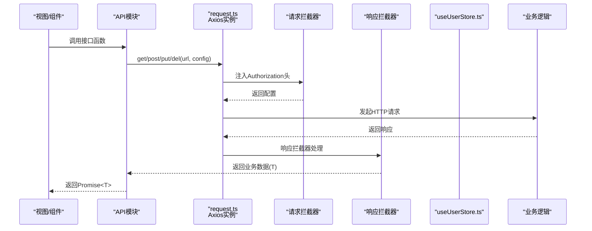
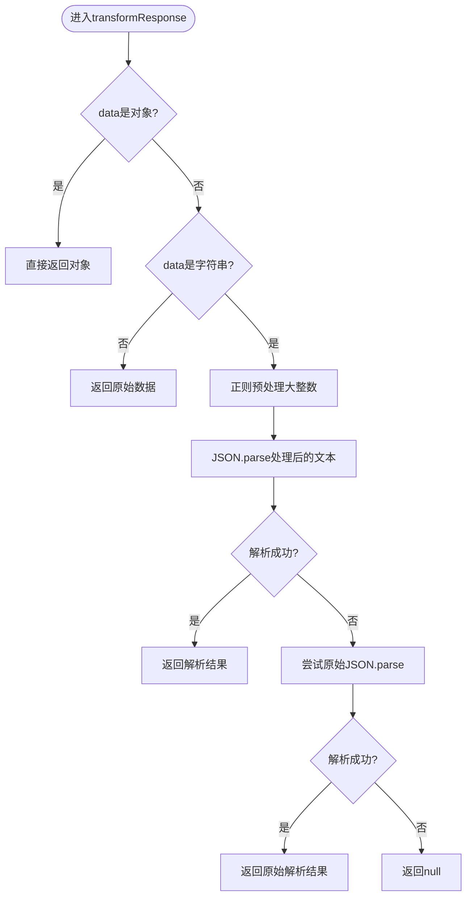
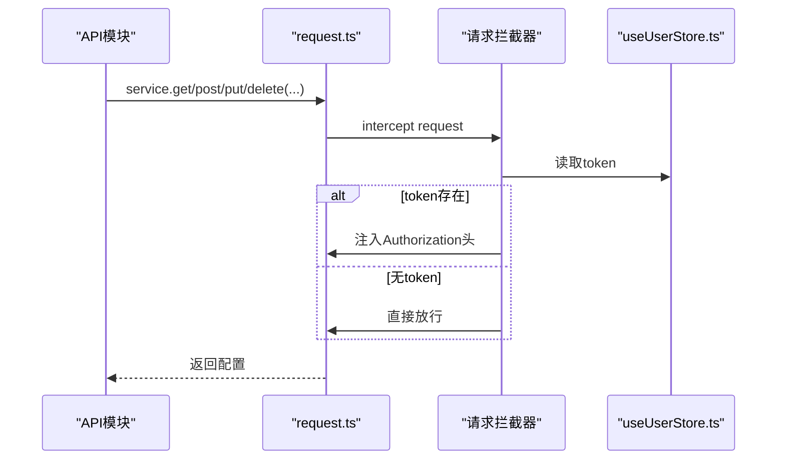
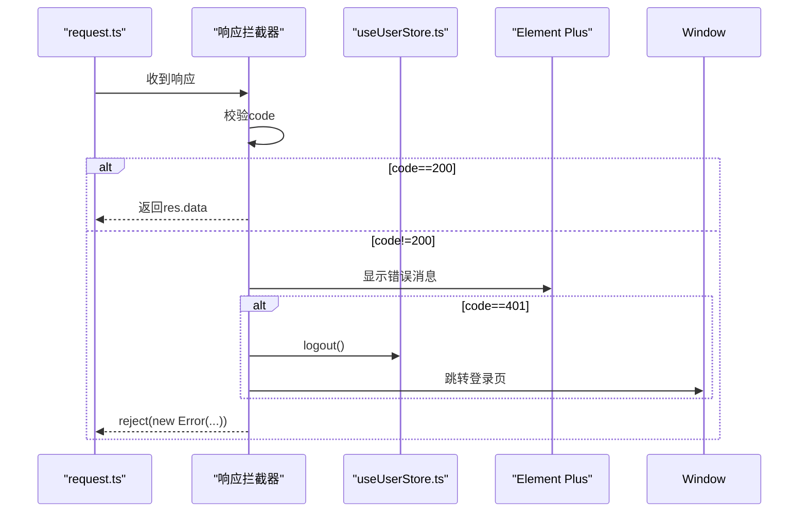
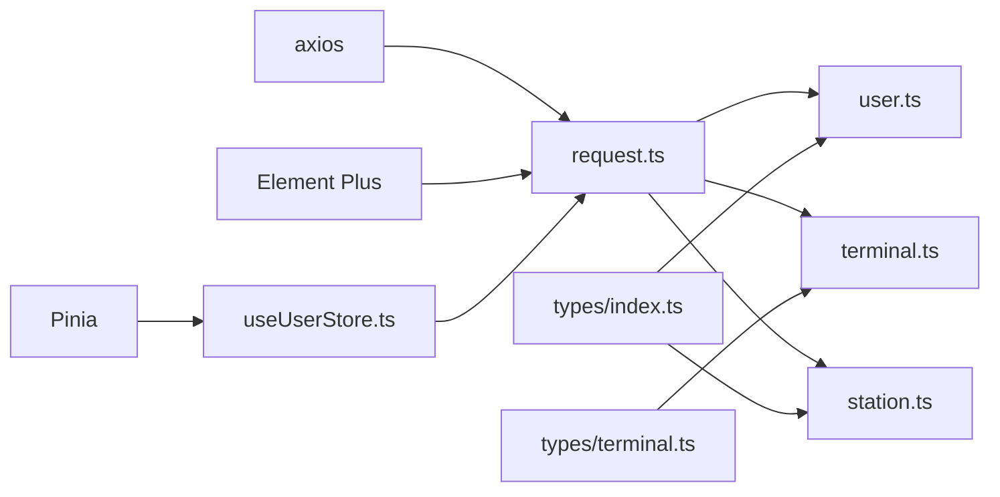

# HTTP请求处理

<cite>
**本文档引用的文件**
- [request.ts](file://src/utils/request.ts)
- [user.ts](file://src/api/user.ts)
- [station.ts](file://src/api/station.ts)
- [terminal.ts](file://src/api/terminal.ts)
- [ai.ts](file://src/api/ai.ts)
- [useUserStore.ts](file://src/stores/useUserStore.ts)
- [index.ts](file://src/types/index.ts)
- [terminal.ts](file://src/types/terminal.ts)
- [package.json](file://package.json)
</cite>

## 目录
1. [简介](#简介)
2. [项目结构](#项目结构)
3. [核心组件](#核心组件)
4. [架构总览](#架构总览)
5. [详细组件分析](#详细组件分析)
6. [依赖关系分析](#依赖关系分析)
7. [性能考虑](#性能考虑)
8. [故障排查指南](#故障排查指南)
9. [结论](#结论)
10. [附录](#附录)

## 简介
本文件面向前端开发者，系统性阐述本项目的HTTP请求处理方案。重点覆盖：
- Axios实例的配置与自定义响应转换器的实现原理
- 请求拦截器中的Token自动添加机制
- 响应拦截器中的业务状态码处理与Token过期策略
- 大整数精度保护机制（通过正则表达式预处理JSON响应中的大整数）
- 请求方法封装（get、post、put、delete）的使用示例与最佳实践
- 错误处理机制（网络错误、业务错误、Token过期）
- 调试方法与性能优化建议

## 项目结构
HTTP请求处理主要集中在工具层与API层：
- 工具层：统一的Axios实例与请求/响应拦截器、请求方法封装
- API层：按功能模块导出具体接口函数，复用工具层封装
- 状态管理：用户Token与用户信息的持久化与解析
- 类型定义：统一的业务响应结构与各模块数据模型

图表来源
- [request.ts:1-180](file://src/utils/request.ts#L1-L180)
- [user.ts:1-179](file://src/api/user.ts#L1-L179)
- [station.ts:1-115](file://src/api/station.ts#L1-L115)
- [terminal.ts:1-59](file://src/api/terminal.ts#L1-L59)
- [ai.ts:1-113](file://src/api/ai.ts#L1-L113)
- [useUserStore.ts:1-200](file://src/stores/useUserStore.ts#L1-L200)
- [index.ts:1-51](file://src/types/index.ts#L1-L51)
- [terminal.ts:1-84](file://src/types/terminal.ts#L1-L84)

章节来源
- [request.ts:1-180](file://src/utils/request.ts#L1-L180)
- [user.ts:1-179](file://src/api/user.ts#L1-L179)
- [station.ts:1-115](file://src/api/station.ts#L1-L115)
- [terminal.ts:1-59](file://src/api/terminal.ts#L1-L59)
- [ai.ts:1-113](file://src/api/ai.ts#L1-L113)
- [useUserStore.ts:1-200](file://src/stores/useUserStore.ts#L1-L200)
- [index.ts:1-51](file://src/types/index.ts#L1-L51)
- [terminal.ts:1-84](file://src/types/terminal.ts#L1-L84)

## 核心组件
- Axios实例与拦截器：统一的请求/响应处理、Token注入、业务状态码处理、大整数精度保护
- 请求方法封装：get/post/put/del，返回Promise<T>，直接拿到业务数据
- 业务响应结构：统一的code/message/data结构，便于集中处理
- 用户状态管理：Token持久化、解析、登出与页面跳转

章节来源
- [request.ts:53-75](file://src/utils/request.ts#L53-L75)
- [request.ts:77-93](file://src/utils/request.ts#L77-L93)
- [request.ts:95-151](file://src/utils/request.ts#L95-L151)
- [request.ts:155-179](file://src/utils/request.ts#L155-L179)
- [index.ts:1-6](file://src/types/index.ts#L1-L6)
- [useUserStore.ts:18-94](file://src/stores/useUserStore.ts#L18-L94)

## 架构总览
下图展示了请求从调用到返回的完整流程，包括拦截器与响应转换器的作用点。

图表来源
- [request.ts:77-93](file://src/utils/request.ts#L77-L93)
- [request.ts:95-151](file://src/utils/request.ts#L95-L151)
- [user.ts:106-108](file://src/api/user.ts#L106-L108)
- [useUserStore.ts:18-36](file://src/stores/useUserStore.ts#L18-L36)

## 详细组件分析

### Axios实例与自定义响应转换器
- 实例配置
  - 基础URL：开发环境使用代理前缀，生产环境使用环境变量
  - 超时：15秒
  - Content-Type：application/json;charset=UTF-8
- 自定义响应转换器
  - 在默认JSON解析前执行，确保对字符串响应进行预处理
  - 对于对象响应，直接透传
  - 对于字符串响应，先进行大整数预处理再解析

章节来源
- [request.ts:53-75](file://src/utils/request.ts#L53-L75)

### 大整数精度保护机制
- 目标：解决JavaScript安全整数范围外的int64大整数精度丢失问题
- 实现原理
  - 预处理阶段：使用正则匹配JSON中的大整数（至少16位），将其用引号包裹转换为字符串
  - 安全检查：仅对超出安全范围的数字进行转换
  - 回退策略：若预处理失败，尝试原始JSON.parse，失败则返回null
- 关键点
  - 正则匹配形如": 数字"的键值对，避免误伤其他字段
  - 仅对字符串响应文本进行预处理，对象响应直接透传
  - 保证最终返回的对象结构，避免破坏上层类型推断

图表来源
- [request.ts:60-74](file://src/utils/request.ts#L60-L74)
- [request.ts:22-50](file://src/utils/request.ts#L22-L50)

章节来源
- [request.ts:12-50](file://src/utils/request.ts#L12-L50)

### 请求拦截器：Token自动添加机制
- 读取Pinia状态中的token
- 若存在token，则在请求头Authorization中添加Bearer前缀
- 异常时记录错误并拒绝请求

图表来源
- [request.ts:77-93](file://src/utils/request.ts#L77-L93)
- [useUserStore.ts:18-36](file://src/stores/useUserStore.ts#L18-L36)

章节来源
- [request.ts:77-93](file://src/utils/request.ts#L77-L93)
- [useUserStore.ts:18-36](file://src/stores/useUserStore.ts#L18-L36)

### 响应拦截器：业务状态码处理与Token过期策略
- 业务状态码处理
  - code非200：弹出错误消息，reject错误
  - code为401：触发登出、清空本地存储、跳转登录页
- 网络错误处理
  - 根据HTTP状态码映射到用户可读的消息
  - 无response时提示网络连接异常
- 返回值优化
  - 直接返回res.data，避免多层嵌套，简化上层调用

图表来源
- [request.ts:95-151](file://src/utils/request.ts#L95-L151)
- [useUserStore.ts:88-94](file://src/stores/useUserStore.ts#L88-L94)

章节来源
- [request.ts:95-151](file://src/utils/request.ts#L95-L151)
- [useUserStore.ts:88-94](file://src/stores/useUserStore.ts#L88-L94)

### 请求方法封装：get、post、put、delete
- 封装形式
  - 泛型返回Promise<T>，直接拿到业务数据
  - 内部直接调用service对应方法
- 使用要点
  - get：支持params参数传递查询参数
  - post/put：支持data参数传递请求体
  - del：支持路径参数拼接

章节来源
- [request.ts:155-179](file://src/utils/request.ts#L155-L179)

### API模块使用示例与最佳实践
- 用户模块
  - 登录：调用loginApi，直接获得token与过期时间
  - 获取用户信息：调用getUserByUsernameApi，返回用户VO
  - 分页查询：调用getUserPageApi，传入查询参数
- 终端模块
  - 分页查询：getTerminalPageApi(params)
  - 新增/更新/删除：createTerminalApi/updateTerminalApi/deleteTerminalApi
- 遥测站模块
  - 最新数据分页：getStationLatestDataApi(params)
  - 定时报分页：getTimedReportPageApi(data)
  - 原始报文分页：getRawMessagePageApi(data)

最佳实践
- 统一使用封装的get/post/put/del，避免直接调用service
- 对于需要鉴权的接口，确保useUserStore中有有效token
- 对于大整数字段，保持后端返回字符串或number均可，前端已做精度保护
- 错误处理：在调用处使用try/catch捕获Promise.reject，并结合Element Plus消息提示

章节来源
- [user.ts:106-178](file://src/api/user.ts#L106-L178)
- [terminal.ts:16-58](file://src/api/terminal.ts#L16-L58)
- [station.ts:74-114](file://src/api/station.ts#L74-L114)

### AI聊天专用实例
- 独立实例：aiService，独立的baseURL与超时设置
- Token注入：从localStorage读取token
- 响应处理：与通用实例一致的业务状态码处理

章节来源
- [ai.ts:8-77](file://src/api/ai.ts#L8-L77)

## 依赖关系分析
- request.ts依赖
  - axios：HTTP客户端
  - Element Plus：消息提示
  - useUserStore：Token与用户信息
- API模块依赖
  - request.ts：统一请求方法
  - 类型定义：确保类型安全
- 用户状态依赖
  - localStorage/sessionStorage：持久化
  - JWT解析：从token中提取用户名

图表来源
- [request.ts:1-3](file://src/utils/request.ts#L1-L3)
- [user.ts](file://src/api/user.ts#L1)
- [terminal.ts](file://src/api/terminal.ts#L1)
- [station.ts](file://src/api/station.ts#L1)
- [useUserStore.ts:1-4](file://src/stores/useUserStore.ts#L1-L4)
- [index.ts:1-51](file://src/types/index.ts#L1-L51)
- [terminal.ts:1-84](file://src/types/terminal.ts#L1-L84)

章节来源
- [request.ts:1-3](file://src/utils/request.ts#L1-L3)
- [user.ts](file://src/api/user.ts#L1)
- [terminal.ts](file://src/api/terminal.ts#L1)
- [station.ts](file://src/api/station.ts#L1)
- [useUserStore.ts:1-4](file://src/stores/useUserStore.ts#L1-L4)
- [index.ts:1-51](file://src/types/index.ts#L1-L51)
- [terminal.ts:1-84](file://src/types/terminal.ts#L1-L84)

## 性能考虑
- 超时设置：15秒，兼顾稳定性与用户体验
- 响应转换器：仅在字符串响应时进行预处理，避免不必要的开销
- 请求拦截器：轻量操作，仅读取token并注入头
- 建议
  - 对高频接口可考虑缓存策略（如分页参数相同且短时间内重复请求）
  - 合理设置超时，避免长时间阻塞UI
  - 对大响应体可考虑分页或懒加载

[本节为通用建议，无需特定文件引用]

## 故障排查指南
- 网络错误
  - 检查baseURL与代理配置
  - 查看浏览器Network面板，确认请求是否发出
- 业务错误
  - 关注响应拦截器中的错误消息与code
  - 确认后端返回的code/message/data结构
- Token过期
  - 响应拦截器会自动触发登出与跳转
  - 检查useUserStore中的token与localStorage
- 大整数精度问题
  - 确认后端返回的int64字段是否被正确识别为大整数
  - 如仍出现精度丢失，检查后端是否返回字符串

章节来源
- [request.ts:117-151](file://src/utils/request.ts#L117-L151)
- [useUserStore.ts:88-94](file://src/stores/useUserStore.ts#L88-L94)

## 结论
本项目的HTTP请求处理通过统一的Axios实例与拦截器，实现了：
- Token自动注入
- 业务状态码集中处理与Token过期策略
- 大整数精度保护
- 简洁的请求方法封装与类型安全
配合清晰的API模块与类型定义，能够高效、稳定地支撑前端业务。

[本节为总结，无需特定文件引用]

## 附录

### 环境变量与基础URL
- 开发环境：baseURL使用代理前缀
- 生产环境：baseURL来自环境变量

章节来源
- [request.ts](file://src/utils/request.ts#L54)

### 依赖版本
- axios：^1.6.8
- element-plus：^2.6.3
- pinia：^2.1.7

章节来源
- [package.json:17-25](file://package.json#L17-L25)