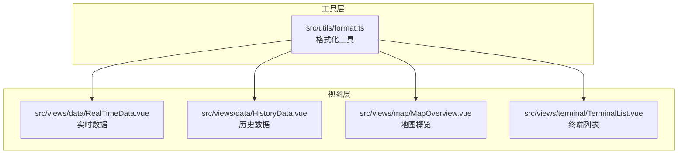
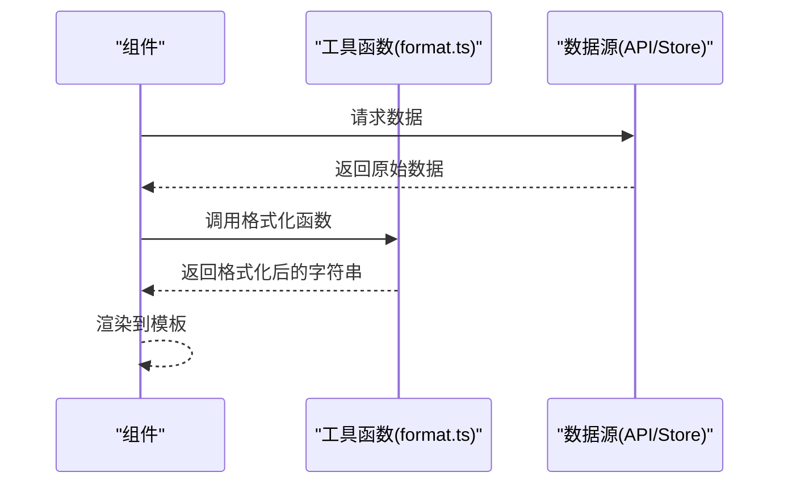
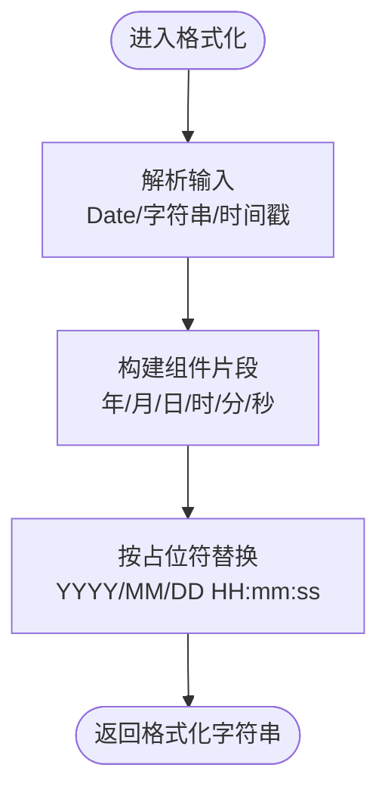
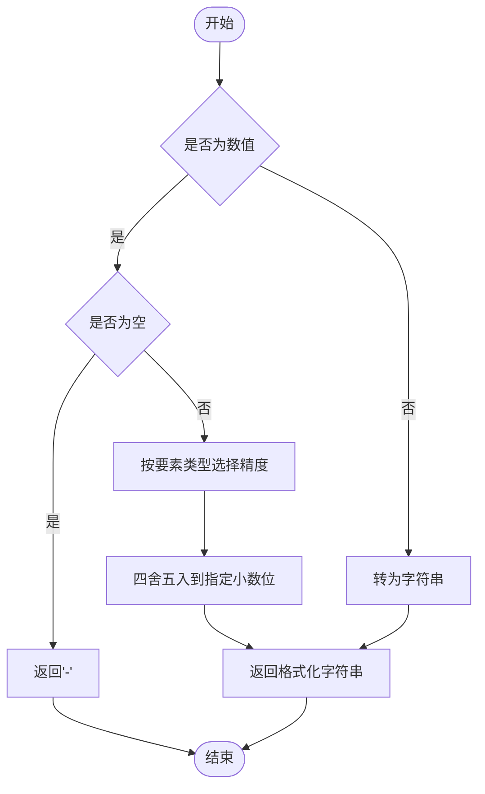
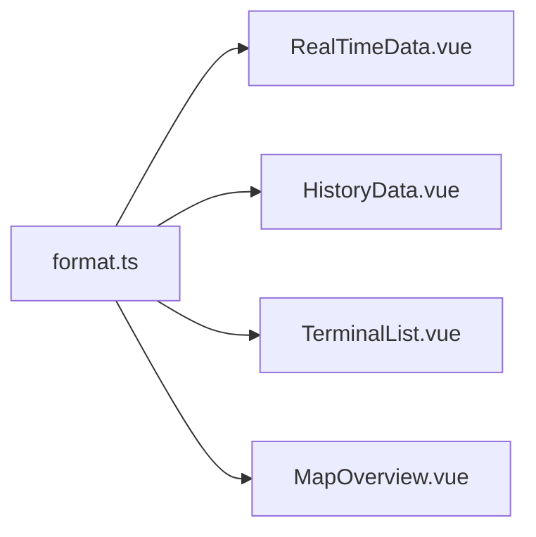

# 数据格式化

<cite>
**本文档引用的文件**
- [src/utils/format.ts](file://src/utils/format.ts)
- [src/views/data/RealTimeData.vue](file://src/views/data/RealTimeData.vue)
- [src/views/data/HistoryData.vue](file://src/views/data/HistoryData.vue)
- [src/views/map/MapOverview.vue](file://src/views/map/MapOverview.vue)
- [src/views/terminal/TerminalList.vue](file://src/views/terminal/TerminalList.vue)
- [src/types/index.ts](file://src/types/index.ts)
- [src/types/terminal.ts](file://src/types/terminal.ts)
- [package.json](file://package.json)
</cite>

## 目录
1. [简介](#简介)
2. [项目结构](#项目结构)
3. [核心组件](#核心组件)
4. [架构总览](#架构总览)
5. [详细组件分析](#详细组件分析)
6. [依赖分析](#依赖分析)
7. [性能考虑](#性能考虑)
8. [故障排查指南](#故障排查指南)
9. [结论](#结论)
10. [附录](#附录)

## 简介
本文件系统性梳理项目中的数据格式化处理机制，覆盖日期时间格式化、数值格式化、文件大小格式化以及防抖/节流等通用工具。文档重点说明：
- 各类格式化函数的设计原则与适用场景
- 在组件中的使用方式与最佳实践
- 本地化与国际化的支持现状与扩展路径
- 性能优化建议与缓存策略
- 自定义格式化函数的开发指南与扩展方案

## 项目结构
项目采用“工具函数 + 视图组件”的分层组织方式。格式化逻辑集中在工具模块，视图组件通过组合式 API 或模板表达式调用这些函数。

**图表来源**
- [src/utils/format.ts](file://src/utils/format.ts)
- [src/views/data/RealTimeData.vue](file://src/views/data/RealTimeData.vue)
- [src/views/data/HistoryData.vue](file://src/views/data/HistoryData.vue)
- [src/views/map/MapOverview.vue](file://src/views/map/MapOverview.vue)
- [src/views/terminal/TerminalList.vue](file://src/views/terminal/TerminalList.vue)

**章节来源**
- [src/utils/format.ts](file://src/utils/format.ts)
- [src/views/data/RealTimeData.vue](file://src/views/data/RealTimeData.vue)
- [src/views/data/HistoryData.vue](file://src/views/data/HistoryData.vue)
- [src/views/map/MapOverview.vue](file://src/views/map/MapOverview.vue)
- [src/views/terminal/TerminalList.vue](file://src/views/terminal/TerminalList.vue)

## 核心组件
- 日期时间格式化：统一输出标准格式字符串，便于表格与卡片展示。
- 数值格式化：按要素类型自动选择合适的精度，提升可读性。
- 文件大小格式化：将字节转换为人类可读的单位（B/KB/MB/GB/TB）。
- 防抖/节流：优化高频交互与滚动场景的性能表现。
- 深拷贝：安全复制复杂对象，避免副作用。

**章节来源**
- [src/utils/format.ts](file://src/utils/format.ts)

## 架构总览
格式化流程在组件中以“输入数据 → 格式化函数 → 输出字符串”的方式串联，既保证了展示一致性，又便于扩展与维护。

**图表来源**
- [src/utils/format.ts](file://src/utils/format.ts)
- [src/views/data/RealTimeData.vue](file://src/views/data/RealTimeData.vue)
- [src/views/data/HistoryData.vue](file://src/views/data/HistoryData.vue)
- [src/views/map/MapOverview.vue](file://src/views/map/MapOverview.vue)
- [src/views/terminal/TerminalList.vue](file://src/views/terminal/TerminalList.vue)

## 详细组件分析

### 日期时间格式化
- 设计原则
  - 输入兼容多种类型（Date、字符串、时间戳）
  - 支持自定义格式占位符（YYYY、MM、DD、HH、mm、ss）
  - 默认格式统一，便于跨组件一致展示
- 使用场景
  - 实时数据/历史数据表格中的观测时间、接收时间
  - 终端列表与抽屉中的创建/更新/上报时间
  - 地图抽屉中的终端最后上报时间
- 典型调用
  - 终端列表：最后上报时间、创建时间
  - 地图抽屉：终端最后上报时间
  - 实时/历史数据：观测时间、接收时间

**图表来源**
- [src/utils/format.ts](file://src/utils/format.ts)

**章节来源**
- [src/utils/format.ts](file://src/utils/format.ts)
- [src/views/data/RealTimeData.vue](file://src/views/data/RealTimeData.vue)
- [src/views/data/HistoryData.vue](file://src/views/data/HistoryData.vue)
- [src/views/map/MapOverview.vue](file://src/views/map/MapOverview.vue)
- [src/views/terminal/TerminalList.vue](file://src/views/terminal/TerminalList.vue)

### 数值格式化
- 设计原则
  - 根据要素类型自动选择精度，兼顾准确性与可读性
  - 对空值进行兜底处理，避免显示异常
- 使用场景
  - 实时数据与历史数据表格中的监测要素值
  - 终端抽屉中的要素卡片展示
- 精度策略
  - 水位/降雨/流量：保留两位小数
  - 流速：保留三位小数
  - 电压：保留两位小数
  - 其他类型：转为字符串

**图表来源**
- [src/views/data/RealTimeData.vue](file://src/views/data/RealTimeData.vue)
- [src/views/data/HistoryData.vue](file://src/views/data/HistoryData.vue)
- [src/views/terminal/TerminalList.vue](file://src/views/terminal/TerminalList.vue)

**章节来源**
- [src/views/data/RealTimeData.vue](file://src/views/data/RealTimeData.vue)
- [src/views/data/HistoryData.vue](file://src/views/data/HistoryData.vue)
- [src/views/terminal/TerminalList.vue](file://src/views/terminal/TerminalList.vue)

### 文件大小格式化
- 设计原则
  - 基于 1024 的幂次自动选择单位
  - 固定两位小数，提升可读性
  - 零值特判，直接返回“0 B”
- 使用场景
  - 展示报文长度等以字节为单位的数据

**章节来源**
- [src/utils/format.ts](file://src/utils/format.ts)

### 防抖与节流
- 设计原则
  - 防抖：在连续触发时仅保留最后一次调用
  - 节流：在固定周期内最多触发一次
- 使用场景
  - 搜索/筛选时优化请求频率
  - 滚动/窗口尺寸变化时降低计算压力
- 扩展建议
  - 将延迟/间隔参数化，便于组件级配置
  - 提供取消方法，避免内存泄漏

**章节来源**
- [src/utils/format.ts](file://src/utils/format.ts)

### 深拷贝
- 设计原则
  - 递归处理对象、数组与日期类型
  - 保持类型与结构一致性
- 使用场景
  - 保存/恢复状态前的副本生成
  - 避免引用共享导致的副作用

**章节来源**
- [src/utils/format.ts](file://src/utils/format.ts)

## 依赖分析
- 工具函数依赖
  - 无外部依赖，纯函数设计，易于测试与复用
- 组件依赖
  - 实时/历史数据：数值格式化
  - 终端列表/抽屉：日期时间格式化、数值格式化
  - 地图抽屉：日期时间格式化

**图表来源**
- [src/utils/format.ts](file://src/utils/format.ts)
- [src/views/data/RealTimeData.vue](file://src/views/data/RealTimeData.vue)
- [src/views/data/HistoryData.vue](file://src/views/data/HistoryData.vue)
- [src/views/map/MapOverview.vue](file://src/views/map/MapOverview.vue)
- [src/views/terminal/TerminalList.vue](file://src/views/terminal/TerminalList.vue)

**章节来源**
- [src/utils/format.ts](file://src/utils/format.ts)
- [src/views/data/RealTimeData.vue](file://src/views/data/RealTimeData.vue)
- [src/views/data/HistoryData.vue](file://src/views/data/HistoryData.vue)
- [src/views/map/MapOverview.vue](file://src/views/map/MapOverview.vue)
- [src/views/terminal/TerminalList.vue](file://src/views/terminal/TerminalList.vue)

## 性能考虑
- 渲染性能
  - 数值格式化采用简单字符串拼接与四舍五入，开销极低
  - 日期时间格式化为常量时间操作，适合高频渲染
- 交互性能
  - 防抖/节流可显著降低请求与计算次数，建议在搜索/筛选场景启用
- 内存与缓存
  - 深拷贝会复制对象结构，大对象频繁拷贝可能带来内存压力；建议仅在必要时使用
  - 对于重复使用的格式化结果，可在组件层引入轻量缓存（例如 Map 缓存最近 N 条记录）

[本节为通用指导，无需具体文件引用]

## 故障排查指南
- 日期时间显示异常
  - 检查传入参数类型是否为合法的时间戳或日期对象
  - 确认格式字符串占位符是否正确
- 数值显示为“-”
  - 确认数据源中对应字段是否为空或未定义
  - 检查要素类型判断逻辑是否覆盖目标字段
- 文件大小显示异常
  - 确认传入字节数是否为非负数
  - 检查单位映射索引是否越界
- 防抖/节流无效
  - 确认回调函数绑定的上下文与参数传递是否正确
  - 检查延迟/间隔参数是否合理

**章节来源**
- [src/utils/format.ts](file://src/utils/format.ts)
- [src/views/data/RealTimeData.vue](file://src/views/data/RealTimeData.vue)
- [src/views/data/HistoryData.vue](file://src/views/data/HistoryData.vue)
- [src/views/terminal/TerminalList.vue](file://src/views/terminal/TerminalList.vue)

## 结论
项目在数据格式化方面实现了统一、简洁且高效的工具层，配合组件层的灵活使用，满足了实时/历史数据、终端信息与地图展示等多场景需求。当前实现以本地化与国际化无关的纯函数为主，未来可按需扩展为基于 Intl 的本地化格式化方案，并结合缓存策略进一步优化性能。

[本节为总结性内容，无需具体文件引用]

## 附录

### 本地化与国际化支持现状
- 当前格式化函数均为硬编码实现，未使用浏览器或第三方库的本地化能力
- 若需支持多语言日期/数字格式，建议：
  - 使用浏览器原生 Intl.DateTimeFormat 与 Intl.NumberFormat
  - 在应用入口注入用户语言偏好，按 locale 生成格式化器
  - 为数值格式化提供最小/最大分数位数等配置项

[本节为概念性内容，无需具体文件引用]

### 自定义格式化函数开发指南
- 设计原则
  - 保持纯函数特性，避免副作用
  - 明确输入/输出类型与边界条件
  - 提供合理的默认值与兜底策略
- 扩展方向
  - 数值：支持千分位分隔、货币符号、科学计数法
  - 日期：支持时区转换、相对时间（如“5分钟前”）、短/长格式
  - 文本：支持截断省略、超长文本折叠
- 组件集成
  - 在组件中集中导入与复用，避免分散实现
  - 为复杂格式化提供可配置参数（如精度、单位、分隔符）

[本节为通用指导，无需具体文件引用]