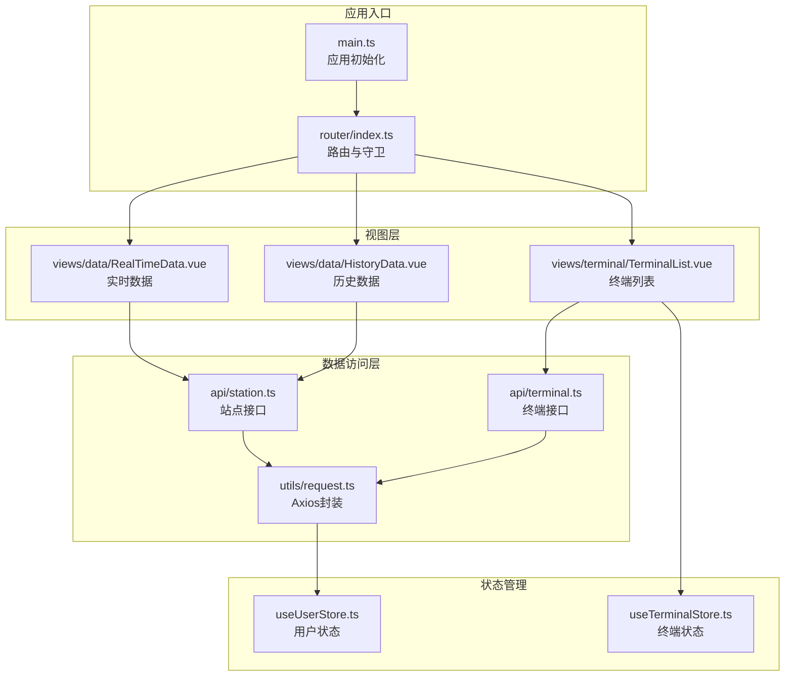
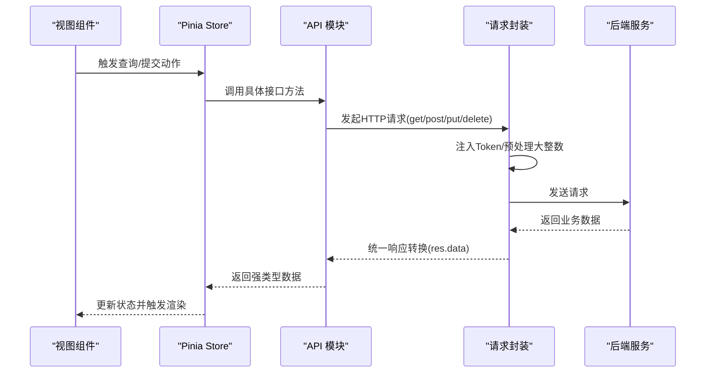
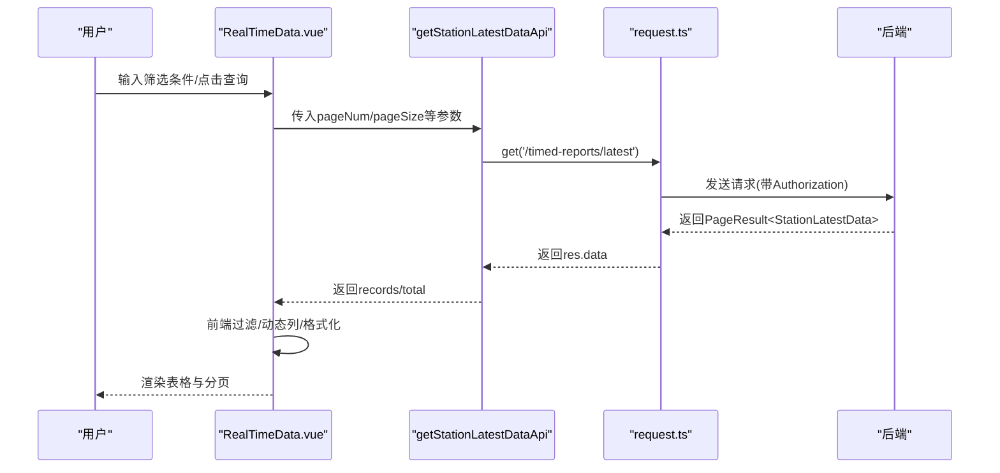
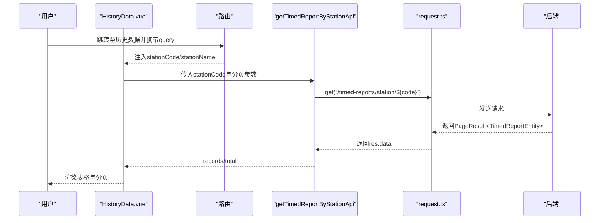
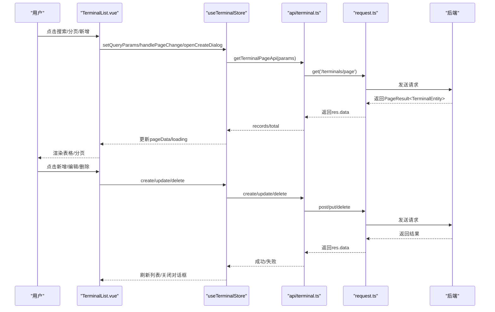
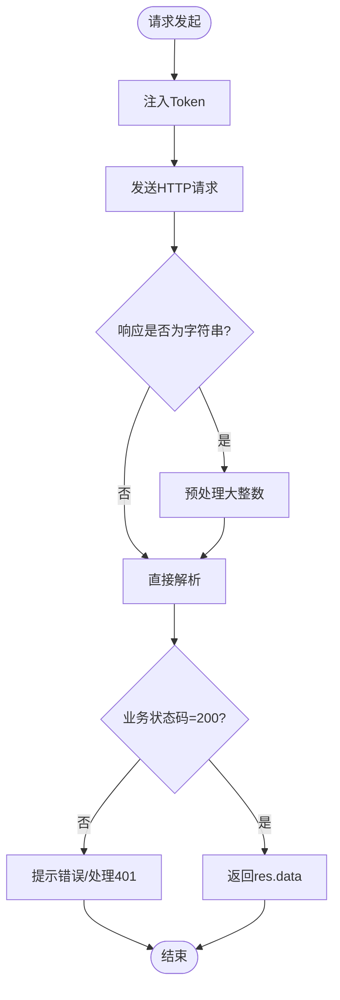
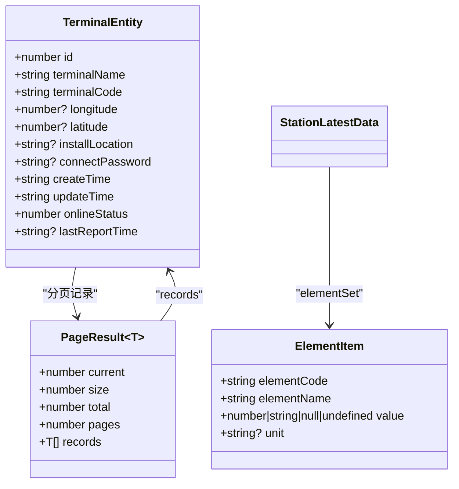
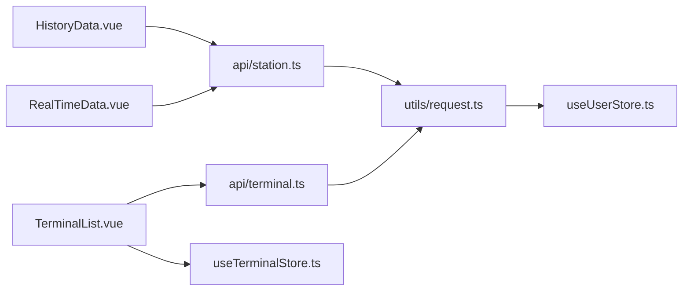

# 数据流设计

<cite>
**本文引用的文件**   
- [main.ts](file://src/main.ts)
- [router/index.ts](file://src/router/index.ts)
- [utils/request.ts](file://src/utils/request.ts)
- [api/terminal.ts](file://src/api/terminal.ts)
- [api/station.ts](file://src/api/station.ts)
- [stores/useTerminalStore.ts](file://src/stores/useTerminalStore.ts)
- [stores/useUserStore.ts](file://src/stores/useUserStore.ts)
- [views/data/RealTimeData.vue](file://src/views/data/RealTimeData.vue)
- [views/data/HistoryData.vue](file://src/views/data/HistoryData.vue)
- [views/terminal/TerminalList.vue](file://src/views/terminal/TerminalList.vue)
- [utils/format.ts](file://src/utils/format.ts)
- [utils/validate.ts](file://src/utils/validate.ts)
- [types/terminal.ts](file://src/types/terminal.ts)
- [types/index.ts](file://src/types/index.ts)
- [App.vue](file://src/App.vue)
- [package.json](file://package.json)
</cite>

## 目录
1. [简介](#简介)
2. [项目结构](#项目结构)
3. [核心组件](#核心组件)
4. [架构总览](#架构总览)
5. [详细组件分析](#详细组件分析)
6. [依赖分析](#依赖分析)
7. [性能考虑](#性能考虑)
8. [故障排除指南](#故障排除指南)
9. [结论](#结论)
10. [附录](#附录)

## 简介
本设计文档围绕“水文监测管理系统”的前端数据流进行系统化梳理，覆盖从用户操作到数据展示的完整链路。重点包括：
- API 请求封装与响应格式化
- 数据获取、处理、存储与展示
- 类型安全、数据校验与异常处理
- 缓存策略、错误处理与重试机制建议
- 性能优化方案与最佳实践
- 监控、调试与故障排除方法
- 设计指南与扩展方案

## 项目结构
系统采用 Vue 3 + TypeScript + Pinia + Element Plus 架构，按职责分层组织：
- 入口与路由：应用入口、路由注册与鉴权守卫
- 状态管理：Pinia Store 管理用户与终端等状态
- API 封装：统一请求实例与接口模块
- 视图组件：页面级组件负责数据展示与交互
- 工具与类型：格式化、校验、通用类型定义

**图表来源**
- [main.ts:1-26](file://src/main.ts#L1-L26)
- [router/index.ts:1-136](file://src/router/index.ts#L1-L136)
- [utils/request.ts:1-180](file://src/utils/request.ts#L1-L180)
- [api/terminal.ts:1-59](file://src/api/terminal.ts#L1-L59)
- [api/station.ts:1-115](file://src/api/station.ts#L1-L115)
- [stores/useTerminalStore.ts:1-294](file://src/stores/useTerminalStore.ts#L1-L294)
- [stores/useUserStore.ts:1-200](file://src/stores/useUserStore.ts#L1-L200)
- [views/data/RealTimeData.vue:1-300](file://src/views/data/RealTimeData.vue#L1-L300)
- [views/data/HistoryData.vue:1-271](file://src/views/data/HistoryData.vue#L1-L271)
- [views/terminal/TerminalList.vue:1-800](file://src/views/terminal/TerminalList.vue#L1-L800)

**章节来源**
- [main.ts:1-26](file://src/main.ts#L1-L26)
- [router/index.ts:1-136](file://src/router/index.ts#L1-L136)
- [package.json:1-48](file://package.json#L1-L48)

## 核心组件
- 应用入口与路由
  - 应用初始化注册 Element Plus、路由与 Pinia；根组件渲染路由视图
  - 路由守卫实现登录态校验与进度条
- 请求封装与拦截器
  - Axios 实例统一配置 baseURL、超时、请求头
  - 响应拦截器统一处理业务状态码与错误提示
  - 请求拦截器统一注入 Token
  - 响应转换器预处理大整数，避免 JS 安全整数范围问题
- 状态管理
  - 用户 Store：登录、Token 管理、用户信息缓存与解析
  - 终端 Store：分页、查询、增删改查、对话框与表单状态
- 视图组件
  - 实时数据/历史数据：分页查询、前端过滤、动态列渲染、数值格式化
  - 终端列表：CRUD、地图选点、抽屉详情、图表与原始报文

**章节来源**
- [main.ts:1-26](file://src/main.ts#L1-L26)
- [router/index.ts:116-133](file://src/router/index.ts#L116-L133)
- [utils/request.ts:52-180](file://src/utils/request.ts#L52-L180)
- [stores/useUserStore.ts:18-200](file://src/stores/useUserStore.ts#L18-L200)
- [stores/useTerminalStore.ts:23-294](file://src/stores/useTerminalStore.ts#L23-L294)
- [views/data/RealTimeData.vue:108-300](file://src/views/data/RealTimeData.vue#L108-L300)
- [views/data/HistoryData.vue:99-271](file://src/views/data/HistoryData.vue#L99-L271)
- [views/terminal/TerminalList.vue:594-800](file://src/views/terminal/TerminalList.vue#L594-L800)

## 架构总览
系统数据流自上而下分为四层：视图层、状态层、接口层、网络层。

**图表来源**
- [views/data/RealTimeData.vue:187-229](file://src/views/data/RealTimeData.vue#L187-L229)
- [stores/useTerminalStore.ts:69-93](file://src/stores/useTerminalStore.ts#L69-L93)
- [api/station.ts:74-80](file://src/api/station.ts#L74-L80)
- [utils/request.ts:77-151](file://src/utils/request.ts#L77-L151)

## 详细组件分析

### 实时数据视图数据流
- 用户操作：点击查询/重置/刷新、切换分页
- 前端过滤：根据站名、编号、在线状态进行本地过滤
- 动态列：遍历 elementSet 收集唯一要素生成列
- 数值格式化：依据要素类型自动保留小数位
- 分页与总数：使用后端返回的 total 控制分页组件

**图表来源**
- [views/data/RealTimeData.vue:187-229](file://src/views/data/RealTimeData.vue#L187-L229)
- [api/station.ts:74-80](file://src/api/station.ts#L74-L80)
- [utils/request.ts:155-165](file://src/utils/request.ts#L155-L165)

**章节来源**
- [views/data/RealTimeData.vue:108-300](file://src/views/data/RealTimeData.vue#L108-L300)
- [api/station.ts:12-45](file://src/api/station.ts#L12-L45)

### 历史数据视图数据流
- 参数来源：通过路由 query 传递 stationCode 与 stationName
- 查询流程：调用 getTimedReportByStationApi，支持时间范围与分页
- 展示逻辑：动态列、空值占位、数值格式化

**图表来源**
- [views/data/HistoryData.vue:107-208](file://src/views/data/HistoryData.vue#L107-L208)
- [api/station.ts:99-104](file://src/api/station.ts#L99-L104)
- [utils/request.ts:155-165](file://src/utils/request.ts#L155-L165)

**章节来源**
- [views/data/HistoryData.vue:99-271](file://src/views/data/HistoryData.vue#L99-L271)
- [api/station.ts:34-45](file://src/api/station.ts#L34-L45)

### 终端管理数据流
- 列表查询：分页参数与筛选条件组合，调用 getTerminalPageApi
- 详情查看：调用 getTerminalDetailApi 并在抽屉中展示
- 新增/编辑/删除：分别调用 create/update/delete 接口，成功后刷新列表
- 表单校验：基于 Element Plus 表单规则与工具函数 validate

**图表来源**
- [views/terminal/TerminalList.vue:725-737](file://src/views/terminal/TerminalList.vue#L725-L737)
- [stores/useTerminalStore.ts:69-180](file://src/stores/useTerminalStore.ts#L69-L180)
- [api/terminal.ts:16-58](file://src/api/terminal.ts#L16-L58)
- [utils/request.ts:155-177](file://src/utils/request.ts#L155-L177)

**章节来源**
- [views/terminal/TerminalList.vue:594-800](file://src/views/terminal/TerminalList.vue#L594-L800)
- [stores/useTerminalStore.ts:23-294](file://src/stores/useTerminalStore.ts#L23-L294)
- [api/terminal.ts:1-59](file://src/api/terminal.ts#L1-L59)
- [utils/validate.ts:1-36](file://src/utils/validate.ts#L1-L36)

### 请求封装与响应处理
- 统一基地址与超时：开发/生产环境区分 base URL
- Token 注入：从用户 Store 读取并附加 Authorization
- 响应拦截：业务状态码判断、消息提示、Token 失效处理
- 大整数处理：预处理 JSON 中的 16 位以上整数，避免精度丢失
- 类型约束：泛型返回值确保调用方获得强类型数据

**图表来源**
- [utils/request.ts:52-151](file://src/utils/request.ts#L52-L151)

**章节来源**
- [utils/request.ts:1-180](file://src/utils/request.ts#L1-L180)

### 类型安全与数据验证
- 类型定义：终端、分页、要素项、用户状态等强类型
- 参数校验：邮箱、手机、密码强度、空值检测
- 响应格式：统一 ApiResponse 结构，拦截器返回 res.data

**图表来源**
- [types/terminal.ts:6-42](file://src/types/terminal.ts#L6-L42)
- [api/station.ts:5-10](file://src/api/station.ts#L5-L10)
- [types/index.ts:1-20](file://src/types/index.ts#L1-L20)

**章节来源**
- [types/terminal.ts:1-84](file://src/types/terminal.ts#L1-L84)
- [api/station.ts:12-45](file://src/api/station.ts#L12-L45)
- [types/index.ts:1-51](file://src/types/index.ts#L1-L51)
- [utils/validate.ts:1-36](file://src/utils/validate.ts#L1-L36)

## 依赖分析
- 组件耦合
  - 视图组件依赖 Store 与 API 模块，Store 再依赖 API 模块
  - API 模块依赖请求封装，请求封装依赖用户 Store 与 Element Plus
- 外部依赖
  - Vue 3、Element Plus、Axios、Pinia、Vue Router
- 循环依赖
  - 未发现直接循环依赖；若后续扩展，建议保持模块单向依赖

**图表来源**
- [views/data/RealTimeData.vue:113](file://src/views/data/RealTimeData.vue#L113)
- [views/data/HistoryData.vue:104](file://src/views/data/HistoryData.vue#L104)
- [views/terminal/TerminalList.vue:603](file://src/views/terminal/TerminalList.vue#L603)
- [api/terminal.ts:1](file://src/api/terminal.ts#L1)
- [api/station.ts:1](file://src/api/station.ts#L1)
- [utils/request.ts:3](file://src/utils/request.ts#L3)

**章节来源**
- [package.json:14-26](file://package.json#L14-L26)

## 性能考虑
- 防抖与节流
  - 使用防抖/节流工具减少频繁请求与重排
- 前端分页与过滤
  - 实时数据支持前端过滤，注意大数据量时的性能影响
- 图表渲染
  - ECharts 按需渲染，避免不必要的重绘
- 缓存策略建议
  - 读多写少场景：对分页结果进行内存缓存，结合查询参数键值
  - 失效策略：同页码/尺寸/筛选条件一致则复用，否则清空
- 错误与重试
  - 响应拦截器已处理常见错误；建议在高频查询场景增加指数退避重试
- 资源优化
  - 路由懒加载已启用；可进一步拆分组件与按需加载第三方库

**章节来源**
- [utils/format.ts:47-79](file://src/utils/format.ts#L47-L79)
- [views/data/RealTimeData.vue:187-229](file://src/views/data/RealTimeData.vue#L187-L229)
- [views/terminal/TerminalList.vue:745-791](file://src/views/terminal/TerminalList.vue#L745-L791)

## 故障排除指南
- 登录态失效
  - 响应拦截器检测 401 自动清理 Token 并跳转登录
- 网络错误
  - 根据状态码映射错误信息并提示
- 大整数精度丢失
  - 响应转换器预处理 16 位以上整数，避免 Number 安全范围问题
- 数据为空或格式异常
  - 组件内对空值/缺失字段进行占位与格式化兜底
- 调试建议
  - 打开浏览器 Network 面板观察请求与响应
  - 在请求拦截器与响应拦截器设置断点定位问题
  - 使用路由守卫与进度条确认导航链路

**章节来源**
- [utils/request.ts:96-151](file://src/utils/request.ts#L96-L151)
- [stores/useUserStore.ts:61-83](file://src/stores/useUserStore.ts#L61-L83)
- [views/data/RealTimeData.vue:155-185](file://src/views/data/RealTimeData.vue#L155-L185)

## 结论
本系统通过清晰的分层与强类型约束，实现了从用户操作到数据展示的稳定数据流。请求封装统一、拦截器完备、状态管理集中、视图组件职责明确。建议在后续迭代中引入缓存与重试策略、增强监控埋点，并持续优化前端性能与用户体验。

## 附录
- 设计指南
  - 优先使用强类型接口与 DTO，避免 any
  - 所有异步操作均需错误处理与加载状态
  - 统一在请求封装中处理 Token 与业务错误
- 扩展方案
  - 新增模块：遵循 api/ → utils/request.ts → stores/ → views/ 的链路
  - 缓存：为高频读取接口增加内存缓存与失效策略
  - 监控：在请求拦截器中埋点统计成功率与耗时